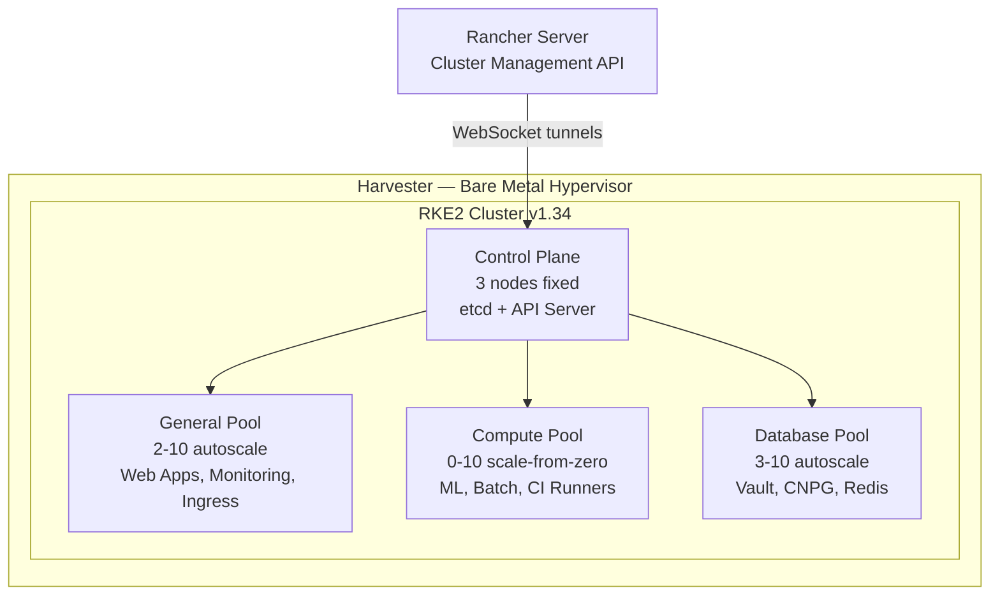
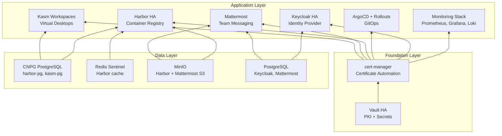

[](https://claude.ai/claude-code)
[](https://github.com/derhornspieler/harvester-rke2-platform/actions/workflows/shellcheck.yml)
[](https://github.com/derhornspieler/harvester-rke2-platform/actions/workflows/terraform.yml)
[](https://github.com/derhornspieler/harvester-rke2-platform/actions/workflows/yamllint.yml)
[](https://github.com/derhornspieler/harvester-rke2-platform/actions/workflows/kubeconform.yml)
[](https://github.com/derhornspieler/harvester-rke2-platform/actions/workflows/gitleaks.yml)
[](https://github.com/derhornspieler/harvester-rke2-platform/actions/workflows/codeql.yml)
[](https://github.com/derhornspieler/harvester-rke2-platform/actions/workflows/node-labeler.yml)
[](https://github.com/derhornspieler/harvester-rke2-platform/actions/workflows/storage-autoscaler.yml)

[](https://harvesterhci.io/)
[](https://docs.rke2.io/)
[](https://www.terraform.io/)
[](https://rockylinux.org/)

# RKE2 Cluster Platform

Production-grade RKE2 Kubernetes platform on Harvester, managed via Rancher Terraform provider. Includes 8 integrated services: Vault PKI, cert-manager, full monitoring stack, Keycloak SSO, ArgoCD GitOps, Harbor container registry, Mattermost messaging, and Kasm virtual desktops.

> **Note**: Throughout this document, `<DOMAIN>` refers to the root domain
> configured in `scripts/.env` (e.g., `example.com`). Derived formats:
> `<DOMAIN_DASHED>` = dots replaced with hyphens (e.g., `example-com`),
> `<DOMAIN_DOT>` = dots replaced with `-dot-` (e.g., `example-dot-com`).
> All service FQDNs follow the pattern `<service>.<DOMAIN>`.

## Platform Architecture



## Platform at a Glance

| Component | Details |
|-----------|---------|
| **Distribution** | RKE2 v1.34 |
| **OS** | Rocky Linux 9 (GenericCloud) |
| **CNI** | Cilium (eBPF, kube-proxy replacement, VXLAN overlay) |
| **Ingress** | Traefik 3.x (LB IP: 203.0.113.202) |
| **Storage** | Harvester CSI (Longhorn) |
| **TLS** | Vault PKI via cert-manager (auto-renewed) |
| **GitOps** | ArgoCD 3.3 + Argo Rollouts (progressive delivery) |
| **Services** | 8 integrated services across 12 TLS endpoints |

## Service Dependency Map



## Repository Structure

```
.
├── cluster/                     # Terraform infrastructure
│   ├── *.tf                     # HCL resources (cluster, machine configs, variables)
│   ├── terraform.sh             # Wrapper script (secret sync + terraform commands)
│   └── terraform.tfvars.example
├── services/                    # Kubernetes workloads (deployed post-cluster)
│   ├── monitoring-stack/        # Kustomize: Prometheus, Grafana, Loki, Alloy
│   ├── vault/                   # Vault HA: Helm values, Gateway + HTTPRoute
│   ├── cert-manager/            # ClusterIssuer (vault-issuer), RBAC
│   ├── keycloak/                # Keycloak HA: 2-replica IDP, PostgreSQL, HPA
│   ├── argo/                    # ArgoCD + Argo Rollouts, app-of-apps bootstrap
│   ├── harbor/                  # Harbor HA: registry, CNPG, Redis, MinIO, HPAs
│   ├── mattermost/              # Mattermost: team messaging, PostgreSQL + MinIO
│   └── kasm/                    # Kasm Workspaces: virtual desktops, CNPG PG 14
└── docs/                        # Architecture, flows, operations
```

## Quick Start

```bash
# 1. Configure infrastructure
cd cluster
cp terraform.tfvars.example terraform.tfvars
# Edit terraform.tfvars with Rancher URL, API token, Harvester details

# 2. Deploy cluster (~20-30 min)
./terraform.sh init
./terraform.sh plan
./terraform.sh apply

# 3. Deploy services (see docs/engineering/deployment-automation.md for full sequence)
# Phase 1: cert-manager → Phase 2: Vault → Phase 3: Monitoring
# Phase 4: Keycloak, Harbor, Mattermost, Kasm → Phase 5: ArgoCD
```

See [DEVELOPERS_GUIDE.md](DEVELOPERS_GUIDE.md) for prerequisites and detailed setup.

## Node Pools

| Pool | Count | CPU | Memory | Disk | NICs | Autoscale | Purpose |
|------|-------|-----|--------|------|------|-----------|---------|
| Control Plane | 3 (fixed) | 8 | 32 GiB | 250 GiB | 1 (eth0) | No | etcd + API server |
| General | 2-10 | 4 | 8 GiB | 100 GiB | 2 (eth0, eth1) | Yes | Web apps, monitoring, APIs |
| Compute | 0-10 | 8 | 32 GiB | 200 GiB | 2 (eth0, eth1) | Yes (scale-from-zero) | ML, batch, event-driven |
| Database | 3-10 | 4 | 16 GiB | 200 GiB | 2 (eth0, eth1) | Yes | Vault, CNPG, Redis, stateful workloads |

Autoscaling is managed by Rancher Cluster Autoscaler deployed in `kube-system`.

## TLS Endpoints

All external services are served over HTTPS via Traefik using Gateway API (HTTPRoute + Gateway with cert-manager gateway-shim for automatic TLS). Two exceptions use Traefik IngressRoute CRDs: Traefik Dashboard (`api@internal` backend) and Kasm (backend HTTPS with `serversTransport`). Certificates are issued by Vault PKI (Root CA > Intermediate CA) and auto-renewed by cert-manager.

| Endpoint | Namespace | Ingress Type | Auth Method |
|----------|-----------|-------------|-------------|
| `grafana.<DOMAIN>` | monitoring | Gateway + HTTPRoute | Grafana login |
| `prometheus.<DOMAIN>` | monitoring | Gateway + HTTPRoute | Keycloak SSO (oauth2-proxy) |
| `hubble.<DOMAIN>` | kube-system | Gateway + HTTPRoute | Keycloak SSO (oauth2-proxy) |
| `traefik.<DOMAIN>` | kube-system | IngressRoute | Keycloak SSO (oauth2-proxy) |
| `vault.<DOMAIN>` | vault | Gateway + HTTPRoute | Vault login |
| `harbor.<DOMAIN>` | harbor | Gateway + HTTPRoute | Harbor login |
| `keycloak.<DOMAIN>` | keycloak | Gateway + HTTPRoute | Keycloak login |
| `argo.<DOMAIN>` | argocd | Gateway + HTTPRoute | ArgoCD login |
| `rollouts.<DOMAIN>` | argo-rollouts | Gateway + HTTPRoute | Keycloak SSO (oauth2-proxy) |
| `mattermost.<DOMAIN>` | mattermost | Gateway + HTTPRoute | Mattermost login |
| `kasm.<DOMAIN>` | kasm | IngressRoute | Kasm login |
| `gitlab.<DOMAIN>` | gitlab | External | GitLab login |

## Documentation

See the **[Documentation Index](docs/README.md)** for a complete master index with cross-references.

### Engineering References

| Document | Description |
|----------|-------------|
| [System Architecture](docs/engineering/system-architecture.md) | Infrastructure topology, networking, cluster topology, storage architecture |
| [Terraform Infrastructure](docs/engineering/terraform-infrastructure.md) | All Terraform resources, 44 variables, cloud-init templates, state management |
| [Deployment Automation](docs/engineering/deployment-automation.md) | All scripts, 11-phase deployment, lib.sh reference, upgrade procedures |
| [Services Reference](docs/engineering/services-reference.md) | All 14+ K8s services: architecture, resources, networking, storage, HA design |
| [Monitoring & Observability](docs/engineering/monitoring-observability.md) | Prometheus, Grafana, Loki, Alloy, Alertmanager deep dive |
| [Security Architecture](docs/engineering/security-architecture.md) | PKI, Vault, cert-manager, Keycloak OIDC, RBAC, secrets management |
| [Custom Operators](docs/engineering/custom-operators.md) | Node-labeler and storage-autoscaler Kubebuilder operators |
| [Golden Image & CI/CD](docs/engineering/golden-image-cicd.md) | Golden image pipeline, CI/CD architecture, Harbor integration |
| [Flow Charts](docs/engineering/flow-charts.md) | 23+ Mermaid diagrams: deployment, operations, controllers, decision trees |
| [Troubleshooting SOP](docs/engineering/troubleshooting-sop.md) | SOPs, diagnostic flowcharts, Day-2 operations, disaster recovery |

### Guides & Planning

| Document | Description |
|----------|-------------|
| [kubectl OIDC Setup](docs/kubectl-oidc-setup.md) | End-user guide for Keycloak OIDC kubectl authentication |
| [Developer's Guide](DEVELOPERS_GUIDE.md) | Prerequisites, file structure, quick-start workflow |
| [Airgapped Mode](docs/airgapped-mode.md) | Air-gapped / offline deployment design |
| [Vault HA Migration](docs/vault-ha.md) | HA migration plan (implemented) |
| [Vault Credential Storage](docs/vault-credential-storage.md) | Migration plan: K8s Secrets to Vault KV + ESO |
| [Golden Image Plan](docs/golden-image-plan.md) | Pre-baked Rocky 9 image design record |

## Service READMEs

Each service has its own README with architecture diagrams, deployment steps, configuration reference, and troubleshooting.

| Service | README | Status |
|---------|--------|--------|
| Monitoring Stack | [services/monitoring-stack/README.md](services/monitoring-stack/README.md) | Deployed |
| Vault | [services/vault/README.md](services/vault/README.md) | Deployed (HA) |
| cert-manager | [services/cert-manager/README.md](services/cert-manager/README.md) | Deployed |
| Keycloak | [services/keycloak/README.md](services/keycloak/README.md) | Deployed (HA) |
| ArgoCD + Rollouts | [services/argo/README.md](services/argo/README.md) | Deployed (HA) |
| Harbor | [services/harbor/README.md](services/harbor/README.md) | Deployed (HA) |
| Mattermost | [services/mattermost/README.md](services/mattermost/README.md) | Manifests ready |
| Kasm Workspaces | [services/kasm/README.md](services/kasm/README.md) | Deployed |

## Contributors

| Contributor | Role |
|-------------|------|
| **Your Name** | Platform architect, infrastructure and services |
| **[Claude Code](https://claude.ai/claude-code)** | AI pair programmer — Gateway API migration, Harbor HPA fix, documentation, IaC |
