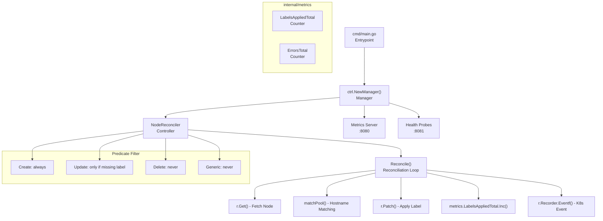
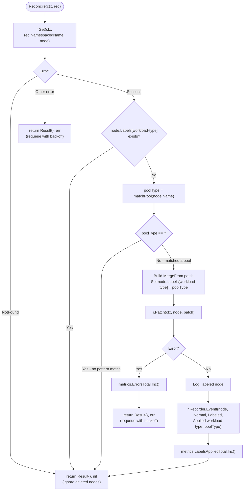
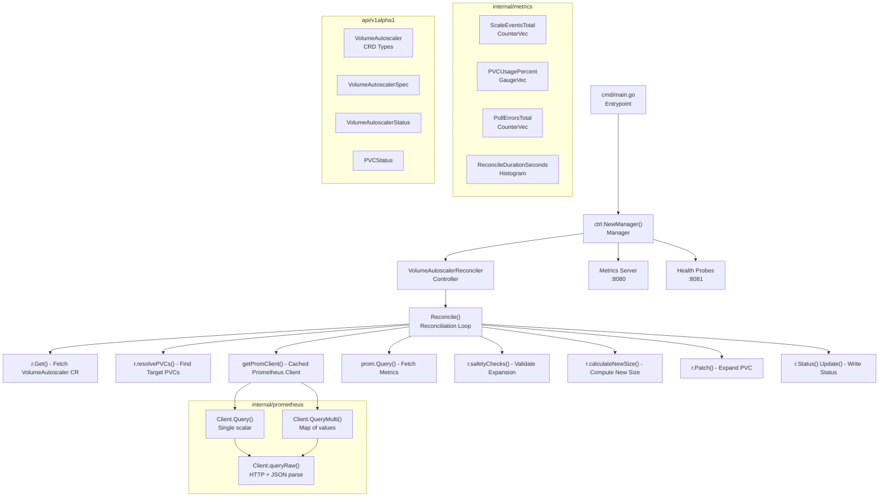
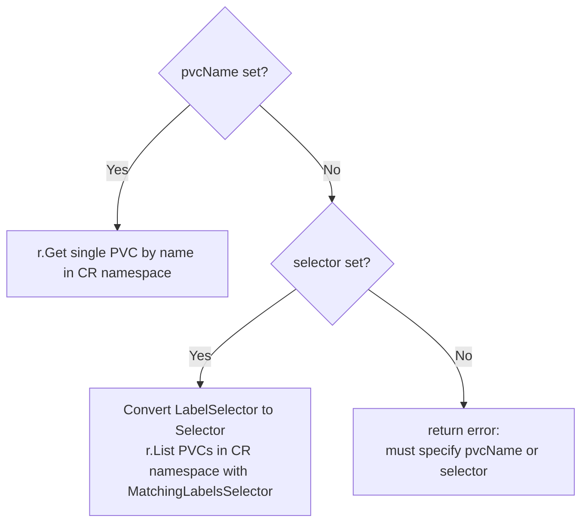
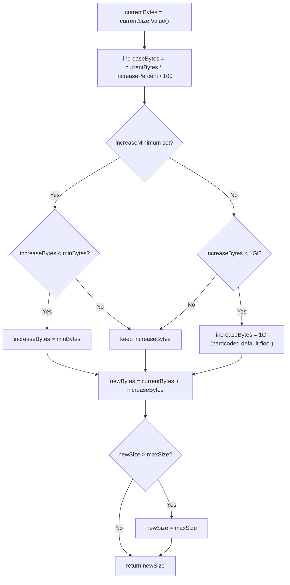
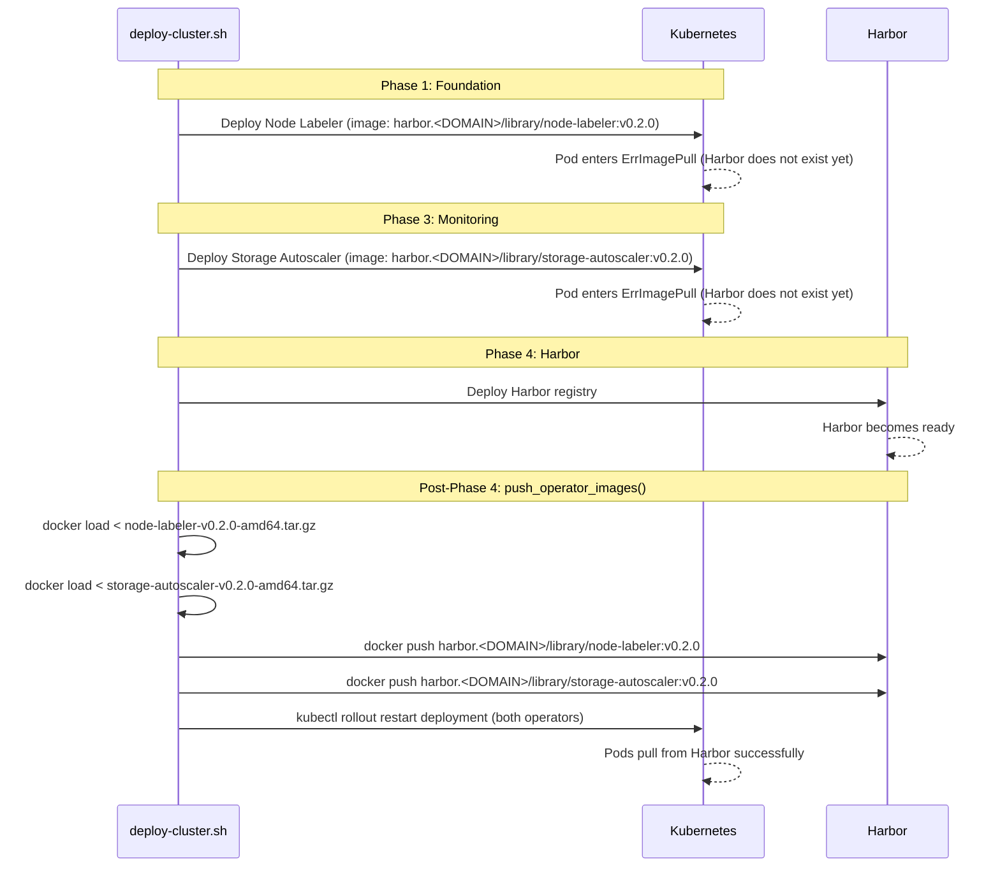
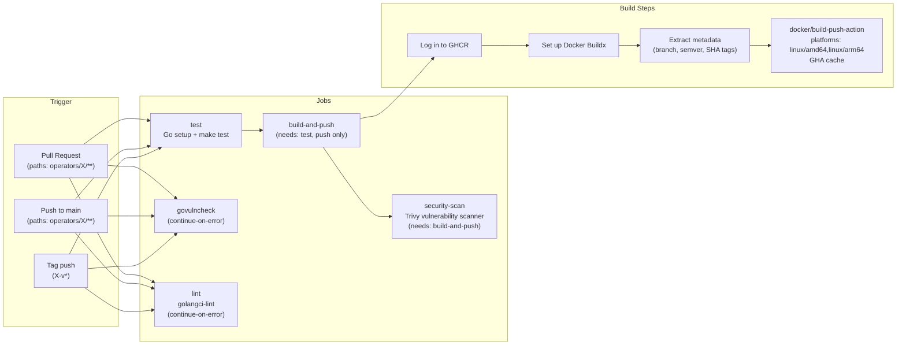
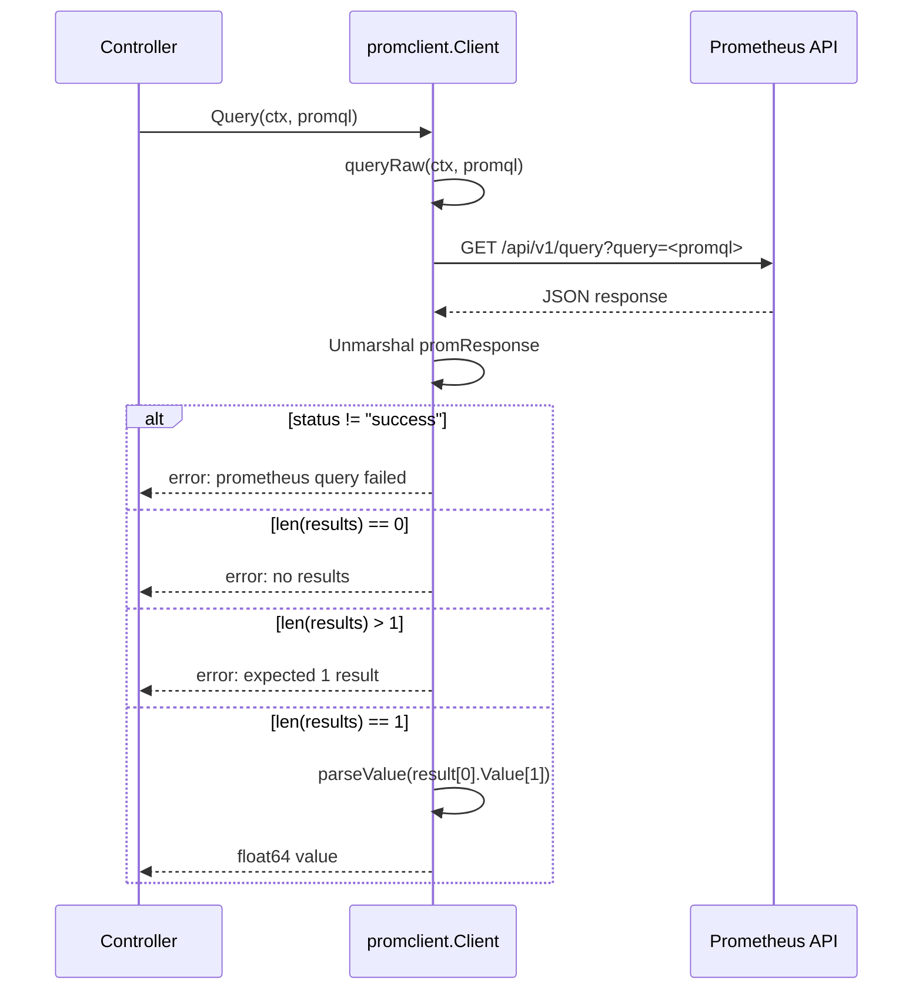

# Custom Operators Engineering Guide

> **Note**: Throughout this document, `<DOMAIN>` refers to the root domain
> configured in `scripts/.env` (e.g., `example.com`).

This cluster ships two custom Kubernetes operators built with
[Kubebuilder](https://kubebuilder.io/) and the
[controller-runtime](https://github.com/kubernetes-sigs/controller-runtime)
framework. Both are compiled as static Go binaries, packaged in distroless
container images, and deployed via Helm/Kustomize manifests.

| Operator | API Group | Purpose |
|----------|-----------|---------|
| **Node Labeler** | *(core -- watches Nodes)* | Applies `workload-type` labels to nodes based on hostname patterns |
| **Storage Autoscaler** | `autoscaling.volume-autoscaler.io` | Automatically expands PVCs when Prometheus reports usage above a threshold |

---

## Table of Contents

1. [Node Labeler](#1-node-labeler)
   - [1.1 Purpose and Design](#11-purpose-and-design)
   - [1.2 Code Architecture](#12-code-architecture)
   - [1.3 Reconciliation Logic](#13-reconciliation-logic)
   - [1.4 Prometheus Metrics](#14-prometheus-metrics)
   - [1.5 RBAC Permissions](#15-rbac-permissions)
   - [1.6 Error Handling](#16-error-handling)
   - [1.7 Test Coverage](#17-test-coverage)
   - [1.8 Build and Deploy](#18-build-and-deploy)
2. [Storage Autoscaler](#2-storage-autoscaler)
   - [2.1 Purpose and Design](#21-purpose-and-design)
   - [2.2 Code Architecture](#22-code-architecture)
   - [2.3 Reconciliation Logic](#23-reconciliation-logic)
   - [2.4 CRD Schema](#24-crd-schema)
   - [2.5 Prometheus Metrics](#25-prometheus-metrics)
   - [2.6 RBAC Permissions](#26-rbac-permissions)
   - [2.7 Safety Mechanisms](#27-safety-mechanisms)
   - [2.8 Error Handling](#28-error-handling)
   - [2.9 Test Coverage](#29-test-coverage)
   - [2.10 Build and Deploy](#210-build-and-deploy)
   - [2.11 VolumeAutoscaler Examples](#211-volumeautoscaler-examples)
3. [Cross-Cutting Concerns](#3-cross-cutting-concerns)
   - [3.1 Comparison Table](#31-comparison-table)
   - [3.2 Airgapped Bootstrap (Chicken-and-Egg Problem)](#32-airgapped-bootstrap-chicken-and-egg-problem)
   - [3.3 CI/CD Pipeline](#33-cicd-pipeline)
   - [3.4 Development Workflow](#34-development-workflow)
   - [3.5 Adding a New Operator](#35-adding-a-new-operator)

---

## 1. Node Labeler

### 1.1 Purpose and Design

**Problem**: Rancher's cluster autoscaler provisions new nodes from machine pool
templates, but does not reliably propagate user-defined machine-pool labels
(such as `workload-type=compute`) to the resulting Kubernetes Node objects. When
workload scheduling depends on node affinity rules that reference these labels,
newly-provisioned nodes remain unused until an administrator manually applies
the labels.

**Solution**: The Node Labeler operator watches Node objects and derives the
correct `workload-type` label from the node's hostname. The cluster's naming
convention embeds the pool type in the hostname:

| Hostname Pattern | Label Applied |
|------------------|--------------|
| `*-general-*` | `workload-type=general` |
| `*-compute-*` | `workload-type=compute` |
| `*-database-*` | `workload-type=database` |

**Design decisions**:

- **No CRD**: The mapping is a compile-time constant (`poolPatterns` map).
  Adding a new pool type requires a code change and rebuild. This was a
  deliberate simplicity trade-off: the pool naming convention is stable and
  infrastructure-level, so a CRD would add operational overhead without
  meaningful benefit.
- **Idempotent patch**: If the label already exists on the node, the
  reconciler returns immediately. This makes repeated reconciliations cheap
  (no API writes).
- **Event filtering**: The predicate skips Delete and Generic events entirely.
  Update events are only processed if the node does NOT already have the label,
  which covers the edge case of an administrator removing a label.
- **Kubernetes Events**: Each successful labeling emits a Normal event on the
  Node object for auditability.

**Source files**:

| File | Purpose |
|------|---------|
| `operators/node-labeler/cmd/main.go` | Entrypoint, manager bootstrap |
| `operators/node-labeler/internal/controller/node_controller.go` | Reconciler and predicates |
| `operators/node-labeler/internal/controller/node_controller_test.go` | Unit tests |
| `operators/node-labeler/internal/metrics/metrics.go` | Prometheus counter registration |

### 1.2 Code Architecture



### 1.3 Reconciliation Logic



**matchPool() internals**: Iterates `poolPatterns` map, checking if the hostname
contains each substring (`-general-`, `-compute-`, `-database-`). Returns the
first match or empty string. Note: iteration order over Go maps is
non-deterministic, but since hostnames match at most one pattern this is not a
correctness concern.

### 1.4 Prometheus Metrics

| Metric Name | Type | Labels | Description |
|-------------|------|--------|-------------|
| `node_labeler_labels_applied_total` | Counter | *(none)* | Total number of `workload-type` labels successfully applied to nodes |
| `node_labeler_errors_total` | Counter | *(none)* | Total number of errors encountered while patching node labels |

Both metrics are registered via `init()` in `internal/metrics/metrics.go` using
the controller-runtime metrics registry (which exposes them on the manager's
`:8080/metrics` endpoint).

### 1.5 RBAC Permissions

Derived from `+kubebuilder:rbac` markers in `node_controller.go`:

| API Group | Resource | Verbs |
|-----------|----------|-------|
| `""` (core) | `nodes` | `get`, `list`, `watch`, `patch` |
| `""` (core) | `events` | `create`, `patch` |

The operator needs `patch` on nodes (not `update`) because it uses
`client.MergeFrom` strategic merge patches, which is the safest way to modify
a single label without risking overwriting concurrent changes to other fields.

### 1.6 Error Handling

| Error Scenario | Handling | Retry Behavior |
|----------------|----------|----------------|
| Node not found (deleted) | `client.IgnoreNotFound(err)` returns `nil` | No requeue -- the node is gone |
| Hostname matches no pool | Returns `Result{}, nil` | No requeue -- nothing to do |
| Label already present | Returns `Result{}, nil` early | No requeue -- idempotent |
| Patch API call fails | Increments `ErrorsTotal`, returns error | controller-runtime exponential backoff requeue |

### 1.7 Test Coverage

**What IS tested** (file: `internal/controller/node_controller_test.go`):

| Test | Description |
|------|-------------|
| `TestMatchPool` | Table-driven: `general`, `compute`, `database`, control-plane, random, empty string |
| `TestReconcile_LabelsUnlabeledNode` | Verifies a general-pool node receives the `workload-type=general` label |
| `TestReconcile_SkipsAlreadyLabeledNode` | Verifies no event is emitted when label already exists |
| `TestReconcile_SkipsCPNode` | Verifies control-plane nodes (hostname pattern `-cp-`) get no label |
| `TestReconcile_NodeNotFound` | Verifies reconcile returns nil for deleted nodes |
| `TestReconcile_DatabaseNode` | Verifies database-pool hostname gets `workload-type=database` |

Uses `fake.NewClientBuilder()` and `record.NewFakeRecorder` -- pure unit tests,
no envtest.

**What is NOT tested** (gaps):

- **Predicate filtering logic**: The `WithEventFilter` predicate functions are
  not tested. The Update predicate's label-check logic could regress without
  detection.
- **Patch failure path**: No test injects an error from the fake client to
  verify that `ErrorsTotal` is incremented.
- **Concurrent reconciliation**: No tests for race conditions if two reconciles
  target the same node simultaneously.
- **Metrics emission**: Tests do not assert that Prometheus counters are
  incremented.
- **Event content**: The Labeled event message format is not asserted (the
  fake recorder captures events but only `TestReconcile_SkipsAlreadyLabeledNode`
  inspects the channel).
- **Nodes with nil Labels map**: Implicitly covered (the code handles
  `node.Labels == nil`), but there is no explicit test case.

### 1.8 Build and Deploy

**Makefile targets** (file: `operators/node-labeler/Makefile`):

| Target | Description |
|--------|-------------|
| `make build` | `go build -o bin/manager cmd/main.go` (runs `fmt` and `vet` first) |
| `make test` | `go test ./... -coverprofile cover.out` (runs `fmt` and `vet` first) |
| `make run` | Run controller locally against current kubeconfig |
| `make docker-build` | Build container image with tag `${IMG}` |
| `make docker-push` | Push image to registry |
| `make docker-save` | Build linux/amd64 image, `docker save \| gzip` to `../images/` |
| `make docker-buildx` | Multi-arch build and push (linux/amd64 + linux/arm64) |
| `make lint` | Run golangci-lint (v2.7.2) |

**Dockerfile stages** (file: `operators/node-labeler/Dockerfile`):

| Stage | Base Image | Purpose |
|-------|-----------|---------|
| `builder` | `golang:1.25.7` | Downloads modules, compiles static binary with `CGO_ENABLED=0` |
| *(final)* | `gcr.io/distroless/static:nonroot` | Copies binary, runs as UID 65532 |

---

## 2. Storage Autoscaler

### 2.1 Purpose and Design

**Problem**: Kubernetes PersistentVolumeClaims do not auto-expand. When a
volume fills up, the workload crashes or enters read-only mode. Operators must
manually monitor disk usage via Prometheus/Grafana dashboards and manually
patch PVC sizes -- a repetitive, error-prone, and time-sensitive task.

**Solution**: The Storage Autoscaler defines a `VolumeAutoscaler` Custom
Resource that declares a target PVC (by name or label selector), a usage
threshold, and expansion parameters. The controller polls Prometheus for
`kubelet_volume_stats_*` metrics and automatically patches PVC sizes when
usage exceeds the threshold.

**Design decisions**:

- **Prometheus as the metrics source**: Rather than mounting volumes or
  deploying a DaemonSet, the operator queries the existing Prometheus instance
  for kubelet-exported volume statistics. This is zero-footprint on nodes.
- **CRD-driven configuration**: Each PVC (or group of PVCs) has its own
  VolumeAutoscaler CR with independent thresholds, cooldowns, and limits.
- **Safety-first**: Four separate safety checks (in-progress resize, cooldown
  period, max size cap, StorageClass expansion support) must all pass before
  any expansion is attempted.
- **Prometheus client caching**: A global `sync.Mutex`-protected map caches
  Prometheus HTTP clients by URL, avoiding repeated client construction.
- **Polling via RequeueAfter**: The controller does not use external cron jobs.
  Each reconcile returns `RequeueAfter: pollInterval`, creating a continuous
  polling loop driven by the controller-runtime work queue.

**Source files**:

| File | Purpose |
|------|---------|
| `operators/storage-autoscaler/cmd/main.go` | Entrypoint, scheme registration, manager bootstrap |
| `operators/storage-autoscaler/api/v1alpha1/volumeautoscaler_types.go` | CRD type definitions (spec, status, PVCStatus) |
| `operators/storage-autoscaler/internal/controller/volumeautoscaler_controller.go` | Reconciler, safety checks, size calculation |
| `operators/storage-autoscaler/internal/controller/volumeautoscaler_controller_test.go` | Ginkgo/Gomega integration tests with envtest |
| `operators/storage-autoscaler/internal/prometheus/client.go` | Prometheus HTTP API client (Query, QueryMulti) |
| `operators/storage-autoscaler/internal/prometheus/client_test.go` | Prometheus client unit tests with httptest |
| `operators/storage-autoscaler/internal/metrics/metrics.go` | Prometheus metric registration |
| `operators/storage-autoscaler/config/crd/bases/...yaml` | Generated CRD manifest |

### 2.2 Code Architecture



### 2.3 Reconciliation Logic

```mermaid
flowchart TD
    START(["Reconcile(ctx, req)"])
    START --> TIMER["start = time.Now()<br/>defer: record ReconcileDurationSeconds"]
    TIMER --> FETCH["r.Get(ctx, req.NamespacedName, &va)"]
    FETCH --> FETCH_ERR{Error?}
    FETCH_ERR -->|NotFound| RETURN_OK_EMPTY["return Result{}, nil"]
    FETCH_ERR -->|Other error| RETURN_ERR["return Result{}, err"]
    FETCH_ERR -->|Success| PARSE_CONFIG["Parse pollInterval<br/>Parse cooldownPeriod<br/>(apply defaults if nil)"]

    PARSE_CONFIG --> RESOLVE["r.resolvePVCs(ctx, &va)"]
    RESOLVE --> RESOLVE_ERR{Error?}
    RESOLVE_ERR -->|Yes| SET_COND_NOPVC["Set condition:<br/>Ready=False, NoPVCsFound"]
    SET_COND_NOPVC --> STATUS_NOPVC["r.Status().Update()"]
    STATUS_NOPVC --> INC_RESOLVE_ERR["PollErrorsTotal++<br/>reason=resolve_pvcs"]
    INC_RESOLVE_ERR --> REQUEUE_POLL["return Result{RequeueAfter: pollInterval}"]

    RESOLVE_ERR -->|Success, len=0| SET_COND_EMPTY["Set condition:<br/>Ready=False, NoPVCsFound"]
    SET_COND_EMPTY --> STATUS_EMPTY["r.Status().Update()"]
    STATUS_EMPTY --> REQUEUE_POLL

    RESOLVE_ERR -->|Success, len>0| INIT_PROM["Resolve Prometheus URL<br/>getPromClient(promURL)<br/>Set lastPollTime, observedGeneration"]

    INIT_PROM --> BUILD_MAP["Build existingPVCStatus map<br/>for cooldown tracking"]
    BUILD_MAP --> LOOP_START{{"For each PVC in pvcs"}}

    LOOP_START --> QUERY_USED["prom.Query: kubelet_volume_stats_used_bytes"]
    QUERY_USED --> USED_ERR{Error?}
    USED_ERR -->|Yes| INC_PROM_ERR1["PollErrorsTotal++<br/>reason=prometheus_query<br/>allHealthy = false"]
    INC_PROM_ERR1 --> LOOP_NEXT["continue to next PVC"]

    USED_ERR -->|No| QUERY_CAP["prom.Query: kubelet_volume_stats_capacity_bytes"]
    QUERY_CAP --> CAP_ERR{Error?}
    CAP_ERR -->|Yes| INC_PROM_ERR2["PollErrorsTotal++<br/>reason=prometheus_query<br/>allHealthy = false"]
    INC_PROM_ERR2 --> LOOP_NEXT

    CAP_ERR -->|No| CAP_CHECK{"capBytes <= 0?"}
    CAP_CHECK -->|Yes| LOOP_NEXT
    CAP_CHECK -->|No| CALC_USAGE["usagePercent = round(used/cap * 100)<br/>Set PVCUsagePercent gauge"]

    CALC_USAGE --> BUILD_STATUS["Build PVCStatus struct<br/>Carry forward lastScaleTime/Size"]
    BUILD_STATUS --> THRESHOLD_CHECK{"usagePercent >= threshold?"}
    THRESHOLD_CHECK -->|No| APPEND_STATUS["Append pvcStatus"]
    APPEND_STATUS --> LOOP_NEXT

    THRESHOLD_CHECK -->|Yes| SAFETY["r.safetyChecks(ctx, va, pvc, pvcStatus, cooldown)"]
    SAFETY --> SAFETY_ERR{Error?}
    SAFETY_ERR -->|Yes - blocked| APPEND_STATUS

    SAFETY_ERR -->|No - passed| HEALTH_CHECK["prom.Query: kubelet_volume_stats_health_abnormal"]
    HEALTH_CHECK --> HEALTH_BAD{"healthAbnormal > 0?"}
    HEALTH_BAD -->|Yes| EMIT_UNHEALTHY["Event: VolumeUnhealthy"]
    EMIT_UNHEALTHY --> APPEND_STATUS

    HEALTH_BAD -->|No| INODE_CHECK{"inodeThresholdPercent > 0?"}
    INODE_CHECK -->|Yes| QUERY_INODES["Query inodes_used and inodes total<br/>Log if threshold exceeded"]
    QUERY_INODES --> CALC_SIZE["r.calculateNewSize(&va, &currentSize)"]
    INODE_CHECK -->|No| CALC_SIZE

    CALC_SIZE --> PATCH_PVC["Build MergeFrom patch<br/>r.Patch(ctx, &pvc, patch)"]
    PATCH_PVC --> PATCH_ERR{Error?}
    PATCH_ERR -->|Yes| EMIT_FAIL["Event: ExpandFailed<br/>PollErrorsTotal++ reason=patch_pvc"]
    EMIT_FAIL --> APPEND_STATUS

    PATCH_ERR -->|No| EMIT_OK["Event: Expanded (Normal)<br/>ScaleEventsTotal++<br/>Set lastScaleTime, lastScaleSize<br/>TotalScaleEvents++"]
    EMIT_OK --> APPEND_STATUS

    LOOP_NEXT --> LOOP_END{{"More PVCs?"}}
    LOOP_END -->|Yes| LOOP_START
    LOOP_END -->|No| SET_FINAL_STATUS["Set va.Status.PVCs = pvcStatuses"]

    SET_FINAL_STATUS --> HEALTHY_CHECK{"allHealthy?"}
    HEALTHY_CHECK -->|Yes| COND_READY["Set condition:<br/>Ready=True, Polling"]
    HEALTHY_CHECK -->|No| COND_DEGRADED["Set condition:<br/>Ready=False, PrometheusUnavailable"]

    COND_READY --> FINAL_UPDATE["r.Status().Update(ctx, &va)"]
    COND_DEGRADED --> FINAL_UPDATE
    FINAL_UPDATE --> UPDATE_ERR{Error?}
    UPDATE_ERR -->|Yes| RETURN_ERR_30["return Result{RequeueAfter: 30s}"]
    UPDATE_ERR -->|No| REQUEUE_POLL
```



**resolvePVCs()** branching:



**calculateNewSize()** logic:



### 2.4 CRD Schema

**Group**: `autoscaling.volume-autoscaler.io`
**Version**: `v1alpha1`
**Kind**: `VolumeAutoscaler`
**Scope**: Namespaced
**Generated by**: controller-gen v0.20.0

#### Spec Fields

| Field | Type | Required | Default | Validation | Description |
|-------|------|----------|---------|------------|-------------|
| `target` | `VolumeAutoscalerTarget` | Yes | -- | -- | Identifies which PVCs to autoscale |
| `target.pvcName` | `string` | No* | -- | -- | Targets a single PVC by name in the CR's namespace. Mutually exclusive with `selector`. |
| `target.selector` | `LabelSelector` | No* | -- | -- | Matches multiple PVCs by labels in the CR's namespace. Mutually exclusive with `pvcName`. |
| `thresholdPercent` | `int32` | No | `80` | min=1, max=99 | Usage percentage that triggers expansion |
| `maxSize` | `Quantity` | **Yes** | -- | Kubernetes quantity format | Maximum size a PVC can be expanded to. Required safety cap. |
| `increasePercent` | `int32` | No | `20` | min=1, max=100 | Percentage of current capacity to add per expansion |
| `increaseMinimum` | `Quantity` | No | 1Gi (code default) | Kubernetes quantity format | Minimum amount to add per expansion (floor for small PVCs) |
| `pollInterval` | `Duration` | No | `60s` | Go duration string | How often to check volume metrics |
| `cooldownPeriod` | `Duration` | No | `5m` | Go duration string | Minimum wait between consecutive expansions of the same PVC |
| `inodeThresholdPercent` | `int32` | No | `0` | min=0, max=99 | Triggers expansion when inode usage exceeds this %. 0 = disabled. |
| `prometheusURL` | `string` | No | `http://prometheus.monitoring.svc.cluster.local:9090` | -- | Prometheus endpoint to query for volume metrics |

*One of `target.pvcName` or `target.selector` must be specified.

#### Status Fields

| Field | Type | Description |
|-------|------|-------------|
| `conditions` | `[]Condition` | Standard Kubernetes conditions (`Ready`) |
| `lastPollTime` | `*Time` | Timestamp of the last metrics check |
| `pvcs` | `[]PVCStatus` | Per-PVC status information |
| `totalScaleEvents` | `int32` | Cumulative number of PVC expansions performed |
| `observedGeneration` | `int64` | Most recent `.metadata.generation` observed |

#### PVCStatus Fields

| Field | Type | Description |
|-------|------|-------------|
| `name` | `string` | PVC name |
| `currentSize` | `Quantity` | Current storage capacity |
| `usageBytes` | `int64` | Bytes currently used |
| `usagePercent` | `int32` | Current usage as percentage of capacity |
| `lastScaleTime` | `*Time` | When this PVC was last expanded |
| `lastScaleSize` | `*Quantity` | Size of the last expansion |

#### Printer Columns (kubectl output)

| Column | JSON Path | Type |
|--------|-----------|------|
| `Threshold` | `.spec.thresholdPercent` | integer |
| `MaxSize` | `.spec.maxSize` | string |
| `ScaleEvents` | `.status.totalScaleEvents` | integer |
| `Age` | `.metadata.creationTimestamp` | date |

#### Condition Types

| Type | Status | Reason | Meaning |
|------|--------|--------|---------|
| `Ready` | `True` | `Polling` | Successfully polling volume metrics |
| `Ready` | `False` | `NoPVCsFound` | Target PVC(s) do not exist (yet) |
| `Ready` | `False` | `PrometheusUnavailable` | Some metrics queries failed |

### 2.5 Prometheus Metrics

| Metric Name | Type | Labels | Description |
|-------------|------|--------|-------------|
| `volume_autoscaler_scale_events_total` | CounterVec | `namespace`, `pvc`, `volumeautoscaler` | Total number of PVC expansion events |
| `volume_autoscaler_pvc_usage_percent` | GaugeVec | `namespace`, `pvc`, `volumeautoscaler` | Current usage percentage of managed PVCs |
| `volume_autoscaler_poll_errors_total` | CounterVec | `namespace`, `volumeautoscaler`, `reason` | Total number of poll errors. Reason values: `resolve_pvcs`, `prometheus_query`, `patch_pvc` |
| `volume_autoscaler_reconcile_duration_seconds` | Histogram | *(none)* | Duration of reconcile loops. Uses default Prometheus buckets. |

All metrics are registered via `init()` in `internal/metrics/metrics.go` using
the controller-runtime metrics registry.

**Prometheus queries issued per PVC per reconcile** (up to 5):

1. `kubelet_volume_stats_used_bytes{namespace="<ns>",persistentvolumeclaim="<name>"}`
2. `kubelet_volume_stats_capacity_bytes{namespace="<ns>",persistentvolumeclaim="<name>"}`
3. `kubelet_volume_stats_health_abnormal{namespace="<ns>",persistentvolumeclaim="<name>"}` -- only when threshold is exceeded
4. `kubelet_volume_stats_inodes_used{namespace="<ns>",persistentvolumeclaim="<name>"}` -- only when `inodeThresholdPercent > 0`
5. `kubelet_volume_stats_inodes{namespace="<ns>",persistentvolumeclaim="<name>"}` -- only when `inodeThresholdPercent > 0`

### 2.6 RBAC Permissions

Derived from `+kubebuilder:rbac` markers in `volumeautoscaler_controller.go`:

| API Group | Resource | Verbs |
|-----------|----------|-------|
| `autoscaling.volume-autoscaler.io` | `volumeautoscalers` | `get`, `list`, `watch`, `create`, `update`, `patch`, `delete` |
| `autoscaling.volume-autoscaler.io` | `volumeautoscalers/status` | `get`, `update`, `patch` |
| `autoscaling.volume-autoscaler.io` | `volumeautoscalers/finalizers` | `update` |
| `""` (core) | `persistentvolumeclaims` | `get`, `list`, `watch`, `patch` |
| `""` (core) | `persistentvolumes` | `get`, `list` |
| `storage.k8s.io` | `storageclasses` | `get`, `list` |
| `""` (core) | `events` | `create`, `patch` |
| `coordination.k8s.io` | `leases` | `get`, `list`, `watch`, `create`, `update`, `patch`, `delete` |

### 2.7 Safety Mechanisms

The `safetyChecks()` function enforces four guards before any PVC expansion.
ALL must pass; the first failure short-circuits and skips the PVC for that cycle.

| Check | Logic | Failure Behavior |
|-------|-------|------------------|
| **In-progress resize** | Inspects PVC `.status.conditions` for `PersistentVolumeClaimResizing` or `FileSystemResizePending` with status `True` | Skips with log: "PVC is already being resized" |
| **Cooldown period** | Compares `time.Since(lastScaleTime)` against `cooldownPeriod` | Skips with log: "cooldown not elapsed (Xs remaining)" |
| **Max size cap** | Compares `pvc.Status.Capacity[storage]` against `va.Spec.MaxSize` | Emits Warning event `MaxSizeReached`, skips |
| **StorageClass expansion** | Fetches `StorageClass` by name, checks `AllowVolumeExpansion == true` | Emits Warning event `StorageClassNotExpandable`, skips |

Additionally, outside `safetyChecks()`:

| Check | Logic | Failure Behavior |
|-------|-------|------------------|
| **Volume health** | Queries `kubelet_volume_stats_health_abnormal`; skips if value > 0 | Emits Warning event `VolumeUnhealthy`, skips expansion |
| **calculateNewSize cap** | Even after computing the increase, the final size is capped to `maxSize` via `newSize.Cmp(va.Spec.MaxSize) > 0` | Silently clamps to maxSize |
| **Default minimum floor** | If `increaseMinimum` is not set, a hardcoded 1Gi floor prevents tiny expansions | Ensures at least 1Gi increase per event |

### 2.8 Error Handling

| Error Scenario | Handling | Retry Behavior |
|----------------|----------|----------------|
| VolumeAutoscaler CR not found (deleted) | `client.IgnoreNotFound(err)` returns `nil` | No requeue |
| PVC resolution fails | Sets condition `NoPVCsFound`, increments `PollErrorsTotal` with reason `resolve_pvcs` | Requeue after `pollInterval` (not error-based backoff) |
| No PVCs match | Sets condition `NoPVCsFound` | Requeue after `pollInterval` |
| Prometheus query fails (per PVC) | Logs error, increments `PollErrorsTotal` with reason `prometheus_query`, sets `allHealthy = false` | `continue` to next PVC; PVCs that succeed are still processed |
| Capacity query returns <= 0 | Skips PVC silently | `continue` to next PVC |
| Safety check fails | Logs reason, skips PVC | `continue` to next PVC; recheck on next poll |
| PVC patch fails | Logs error, emits `ExpandFailed` event, increments `PollErrorsTotal` with reason `patch_pvc` | `continue` to next PVC |
| Status update fails | Logs error | Requeue after 30s (hardcoded `requeueOnError`) |
| Normal completion | Updates status, sets Ready condition | Requeue after `pollInterval` |

Key design principle: **partial failures do not block healthy PVCs**. If 3 out
of 5 PVCs fail their Prometheus queries, the remaining 2 are still processed
for potential expansion.

### 2.9 Test Coverage

**What IS tested** (files: `internal/controller/volumeautoscaler_controller_test.go`,
`internal/prometheus/client_test.go`):

#### Controller Tests (Ginkgo/Gomega with envtest)

| Test | Description |
|------|-------------|
| Should handle missing PVC gracefully | Creates a VolumeAutoscaler targeting a nonexistent PVC, verifies `NoPVCsFound` condition |
| Should reconcile successfully when CR is deleted | Reconciles a nonexistent CR name, verifies no error |
| Should increase by percentage | `10Gi + 20% = 12Gi` |
| Should apply minimum floor | `10Gi * 10% = 1Gi < 5Gi min, so 10Gi + 5Gi = 15Gi` |
| Should cap at maxSize | `10Gi + 50% = 15Gi > 12Gi max, capped to 12Gi` |
| Should default to 1Gi minimum | `2Gi * 1% = ~21MB < 1Gi default, so 2Gi + 1Gi = 3Gi` |
| Should find PVC by name | Creates PVC, resolves via `pvcName` |
| Should find PVCs by label selector | Creates 2 PVCs with matching labels, resolves via `selector` |
| Should error when no target is specified | Verifies error message for empty target |

Tests use a mock Prometheus `httptest.Server` that responds to `used_bytes`,
`capacity_bytes`, and `health_abnormal` queries.

#### Prometheus Client Tests (standard Go testing)

| Test | Description |
|------|-------------|
| `TestQuery_Success` | Verifies single-value query parsing (`42.5`) |
| `TestQuery_NoResults` | Verifies error on empty result set |
| `TestQuery_MultipleResults` | Verifies error when expecting single result but getting multiple |
| `TestQueryMulti_Success` | Verifies multi-value query returns correct map |
| `TestQuery_PrometheusError` | Verifies error propagation for Prometheus error response |
| `TestQuery_HTTPError` | Verifies error for HTTP 503 |
| `TestQuery_ConnectionRefused` | Verifies error when Prometheus is unreachable |

**What is NOT tested** (gaps):

- **Full end-to-end expansion**: No test creates a PVC, populates Prometheus
  with usage data above threshold, and verifies the PVC is actually resized.
  The `calculateNewSize` logic is tested in isolation but not through the full
  reconcile loop with a real PVC.
- **Safety checks**: The `safetyChecks()` function has no dedicated tests.
  In-progress resize detection, cooldown enforcement, StorageClass validation,
  and maxSize blocking are all untested at the unit level.
- **Volume health check path**: The `kubelet_volume_stats_health_abnormal`
  query returning > 0 is not tested.
- **Inode threshold path**: The `inodeThresholdPercent > 0` code path is
  untested.
- **Prometheus client caching**: The `getPromClient()` mutex-protected cache
  is untested.
- **Metrics emission**: No tests assert that `ScaleEventsTotal`,
  `PVCUsagePercent`, `PollErrorsTotal`, or `ReconcileDurationSeconds` are
  populated correctly.
- **Status update failure retry**: The 30s `requeueOnError` path is untested.
- **Concurrent reconciliation**: No concurrency tests.
- **Leader election**: Not tested (manager-level configuration).

### 2.10 Build and Deploy

**Makefile targets** (file: `operators/storage-autoscaler/Makefile`):

| Target | Description |
|--------|-------------|
| `make manifests` | Generate CRD, ClusterRole, and webhook YAML via controller-gen |
| `make generate` | Generate DeepCopy methods |
| `make build` | Build manager binary (runs `manifests`, `generate`, `fmt`, `vet`) |
| `make test` | Run tests with envtest (auto-downloads K8s binaries) |
| `make run` | Run controller locally |
| `make docker-build` | Build container image |
| `make docker-push` | Push image |
| `make docker-save` | Build linux/amd64 image, `docker save \| gzip` to `../images/` |
| `make docker-buildx` | Multi-arch build (linux/amd64, linux/arm64, linux/s390x, linux/ppc64le) |
| `make install` | Apply CRDs to current cluster |
| `make uninstall` | Remove CRDs from cluster |
| `make deploy` | Deploy controller and CRDs to cluster via Kustomize |
| `make undeploy` | Remove controller and CRDs |
| `make build-installer` | Generate consolidated `dist/install.yaml` |
| `make lint` | Run golangci-lint (v2.7.2) |
| `make setup-test-e2e` | Create Kind cluster for e2e tests |
| `make test-e2e` | Run e2e tests in Kind |
| `make cleanup-test-e2e` | Delete Kind cluster |

**Tool versions** (auto-downloaded to `bin/`):

| Tool | Version |
|------|---------|
| kustomize | v5.7.1 |
| controller-gen | v0.20.0 |
| setup-envtest | Derived from controller-runtime version |
| golangci-lint | v2.7.2 |

**Dockerfile stages** (file: `operators/storage-autoscaler/Dockerfile`):

| Stage | Base Image | Purpose |
|-------|-----------|---------|
| `builder` | `golang:1.25.7` | Downloads modules, compiles static binary with `CGO_ENABLED=0` |
| *(final)* | `gcr.io/distroless/static:nonroot` | Copies binary, runs as UID 65532 |

### 2.11 VolumeAutoscaler Examples

All example CRs are in `services/storage-autoscaler/examples/`. They cover
the production workloads managed by this cluster.

#### Single PVC by Name

| File | CR Name | Namespace | PVC Target | Max Size | Threshold | Increase | Min Increase | Poll | Cooldown |
|------|---------|-----------|------------|----------|-----------|----------|-------------|------|----------|
| `harbor-minio.yaml` | harbor-minio | minio | `minio-data` | 500Gi | 80% | 20% | 10Gi | 120s | 10m |
| `loki.yaml` | loki | monitoring | `data-loki-0` | 200Gi | 80% | 25% | 5Gi | 60s | 5m |
| `mattermost-minio.yaml` | mattermost-minio | mattermost | `data-mattermost-minio-0` | 200Gi | 80% | 25% | 5Gi | 120s | 10m |
| `prometheus.yaml` | prometheus | monitoring | `data-prometheus-0` | 200Gi | 80% | 25% | 5Gi | 60s | 5m |
| `alertmanager.yaml` | alertmanager | monitoring | `data-alertmanager-0` | 20Gi | 80% | 25% | 2Gi | 120s | 10m |
| `grafana.yaml` | grafana | monitoring | `grafana-data` | 50Gi | 80% | 25% | 5Gi | 120s | 10m |
| `uptime-kuma.yaml` | uptime-kuma | uptime-kuma | `uptime-kuma-data` | 10Gi | 80% | 25% | 1Gi | 120s | 10m |
| `librenms.yaml` *(1/3)* | librenms-data | librenms | `librenms-data` | 50Gi | 80% | 25% | 5Gi | 120s | 10m |

#### Multiple PVCs by Label Selector

| File | CR Name | Namespace | Selector | Max Size | Threshold | Increase | Min Increase | Poll | Cooldown |
|------|---------|-----------|----------|----------|-----------|----------|-------------|------|----------|
| `harbor-pg.yaml` | harbor-pg | database | `cnpg.io/cluster: harbor-pg` | 100Gi | 80% | 25% | 5Gi | 120s | 10m |
| `kasm-pg.yaml` | kasm-pg | database | `cnpg.io/cluster: kasm-pg` | 100Gi | 80% | 25% | 5Gi | 120s | 10m |
| `keycloak-pg.yaml` | keycloak-pg | database | `cnpg.io/cluster: keycloak-pg` | 50Gi | 80% | 25% | 5Gi | 120s | 10m |
| `mattermost-pg.yaml` | mattermost-pg | database | `cnpg.io/cluster: mattermost-pg` | 100Gi | 80% | 25% | 5Gi | 120s | 10m |
| `vault.yaml` | vault | vault | `app.kubernetes.io/name: vault` | 50Gi | 80% | 25% | 5Gi | 120s | 10m |
| `harbor-valkey.yaml` | harbor-redis | harbor | `app: harbor-redis` | 10Gi | 80% | 25% | 1Gi | 120s | 10m |
| `librenms.yaml` *(2/3)* | librenms-mariadb | librenms | `app.kubernetes.io/name: librenms-mariadb` | 50Gi | 80% | 25% | 5Gi | 120s | 10m |
| `librenms.yaml` *(3/3)* | librenms-redis | librenms | `app: librenms-redis` | 10Gi | 80% | 25% | 1Gi | 120s | 10m |

**Patterns observed**:

- **Database CRs use label selectors** (not PVC names) because CloudNativePG
  clusters have multiple PVCs (primary + replicas) that all need autoscaling,
  and the `cnpg.io/cluster` label selects them all.
- **Monitoring workloads use shorter poll/cooldown** (60s/5m for Prometheus
  and Loki) because these are write-heavy and can fill quickly.
- **Object storage (MinIO) has higher maxSize** (200-500Gi) reflecting blob
  storage growth patterns.
- **Small utility services** (Alertmanager, Uptime Kuma, Redis/Valkey) have
  conservative maxSize caps (10-20Gi) and small minimum increases (1-2Gi).

---

## 3. Cross-Cutting Concerns

### 3.1 Comparison Table

| Feature | Node Labeler | Storage Autoscaler |
|---------|-------------|-------------------|
| **Framework** | Kubebuilder / controller-runtime | Kubebuilder / controller-runtime |
| **Go version** | 1.25.7 | 1.25.7 |
| **Custom CRD** | No | Yes (`VolumeAutoscaler`) |
| **Watched resource** | `corev1.Node` | `VolumeAutoscaler` CR |
| **Reconcile trigger** | Node create/update events | CR create/update + `RequeueAfter` polling |
| **External dependencies** | None | Prometheus HTTP API |
| **Leader election ID** | `node-labeler.io` | `volume-autoscaler.io` |
| **Metrics port** | `:8080` | `:8080` |
| **Health port** | `:8081` | `:8081` |
| **Custom metrics** | 2 (counters) | 4 (counters + gauge + histogram) |
| **Event filtering** | Custom predicates (skip delete/generic) | Default (watches own CR only) |
| **Kubernetes Events** | Yes (Normal: Labeled) | Yes (Normal: Expanded; Warning: ExpandFailed, VolumeUnhealthy, MaxSizeReached, StorageClassNotExpandable) |
| **Safety checks** | Idempotent skip if label exists | 4-check safety gate + health check |
| **Test framework** | `testing` + fake client | Ginkgo/Gomega + envtest + httptest |
| **Test count** | 6 | 9 controller + 7 Prometheus client |
| **CRD generation** | N/A | controller-gen v0.20.0 |
| **Makefile complexity** | Simple (no CRD generation) | Full Kubebuilder scaffold |
| **CI/CD** | GitHub Actions (test, lint, build-push) | GitHub Actions (test, lint, build-push) |
| **GHCR image** | `ghcr.io/derhornspieler/<repo>/node-labeler` | `ghcr.io/derhornspieler/<repo>/storage-autoscaler` |
| **Replicas** | 3 (leader election) | 3 (leader election) |
| **Deploy phase** | Phase 1 (Foundation) | Phase 3 (Monitoring) |
| **Lines of Go** | ~120 (controller) | ~430 (controller) + ~150 (Prometheus client) + ~170 (types) |

### 3.2 Airgapped Bootstrap (Chicken-and-Egg Problem)

Both operators deploy to the cluster before the Harbor container registry
exists. This creates a bootstrap ordering problem:



**How it works**:

1. Operator images are pre-built as `linux/amd64` tarballs using
   `make docker-save` and committed to `operators/images/` as:
   - `node-labeler-v0.2.0-amd64.tar.gz`
   - `storage-autoscaler-v0.2.0-amd64.tar.gz`

2. During cluster deployment, the operators are installed with image references
   pointing to the Harbor registry (`harbor.<DOMAIN>/library/...`).

3. The operator pods stay in `ErrImagePull` until Harbor is deployed in Phase 4.

4. After Harbor is ready, `deploy-cluster.sh` calls `push_operator_images()`,
   which:
   - Loads each tarball with `docker load`
   - Pushes to Harbor with `docker push`
   - Restarts the operator deployments so kubelet retries the image pull

**Rebuilding tarballs**:

```bash
cd operators/node-labeler
make docker-save IMG=harbor.<DOMAIN>/library/node-labeler:v0.2.0

cd operators/storage-autoscaler
make docker-save IMG=harbor.<DOMAIN>/library/storage-autoscaler:v0.2.0
```

### 3.3 CI/CD Pipeline

Both operators follow the same GitHub Actions workflow structure.



**Key CI/CD details**:

| Setting | Node Labeler | Storage Autoscaler |
|---------|-------------|-------------------|
| Workflow file | `.github/workflows/node-labeler.yml` | `.github/workflows/storage-autoscaler.yml` |
| Path filter | `operators/node-labeler/**` | `operators/storage-autoscaler/**` |
| Tag pattern | `node-labeler-v*` | `storage-autoscaler-v*` |
| GHCR image | `ghcr.io/derhornspieler/<repo>/node-labeler` | `ghcr.io/derhornspieler/<repo>/storage-autoscaler` |
| Build platforms | linux/amd64, linux/arm64 | linux/amd64, linux/arm64 |
| GHA cache | Enabled (`type=gha, mode=max`) | Enabled (`type=gha, mode=max`) |
| Lint blocking | No (`continue-on-error: true`) | No (`continue-on-error: true`) |
| Govulncheck | Non-blocking (`continue-on-error: true`) | Non-blocking (`continue-on-error: true`) |
| Security scan | Trivy (after build-and-push, push only) | Trivy (after build-and-push, push only) |

**Tag-based versioning**: When you push a tag like `storage-autoscaler-v0.2.0`,
the metadata action extracts `0.2.0` from the tag pattern
`storage-autoscaler-v(.*)` and applies it as the image tag.

### 3.4 Development Workflow

#### Modifying an existing operator

```bash
# 1. Make code changes
vim operators/storage-autoscaler/internal/controller/volumeautoscaler_controller.go

# 2. If you changed CRD types, regenerate manifests and deepcopy
cd operators/storage-autoscaler
make manifests generate

# 3. Run tests
make test

# 4. Run linter
make lint

# 5. Test locally against a real cluster (uses current kubeconfig)
make run

# 6. Build and save a new image tarball for airgapped deployment
make docker-save IMG=harbor.<DOMAIN>/library/storage-autoscaler:v0.2.0

# 7. Commit the tarball and source changes
git add -A && git commit -m "Bump storage-autoscaler to v0.2.0"

# 8. Tag for CI/CD to build and push to GHCR
git tag storage-autoscaler-v0.2.0
git push origin main --tags
```

#### Running tests

```bash
# Node Labeler (fast -- no envtest, pure unit tests)
cd operators/node-labeler && make test

# Storage Autoscaler (slower -- downloads envtest K8s binaries on first run)
cd operators/storage-autoscaler && make test

# Storage Autoscaler e2e (requires Kind)
cd operators/storage-autoscaler && make test-e2e
```

#### Debugging tips

- **View operator logs**: `kubectl logs -n <namespace> deploy/<operator-name> -f`
- **Check events**: `kubectl get events --sort-by=.lastTimestamp -n <namespace>`
- **Inspect VolumeAutoscaler status**: `kubectl get volumeautoscaler -A -o wide`
- **Query Prometheus directly**: `kubectl port-forward -n monitoring svc/prometheus 9090:9090` then browse `http://localhost:9090`
- **Check node labels**: `kubectl get nodes --show-labels | grep workload-type`

### 3.5 Adding a New Operator

Step-by-step guide for creating a new Kubebuilder-based operator in this
repository.

#### 1. Scaffold the project

```bash
mkdir -p operators/my-operator && cd operators/my-operator

# Initialize the Kubebuilder project
kubebuilder init \
  --domain my-operator.io \
  --repo github.com/my-operator/my-operator \
  --project-name my-operator

# (Optional) Create a CRD if needed
kubebuilder create api \
  --group mygroup \
  --version v1alpha1 \
  --kind MyResource \
  --resource --controller
```

#### 2. Implement the controller

Edit the generated files:

- `api/v1alpha1/myresource_types.go` -- define your CRD spec/status
- `internal/controller/myresource_controller.go` -- implement `Reconcile()`
- Add RBAC markers (`+kubebuilder:rbac`) for required permissions

#### 3. Add custom metrics

Create `internal/metrics/metrics.go` following the pattern from the existing
operators:

```go
package metrics

import (
    "github.com/prometheus/client_golang/prometheus"
    "sigs.k8s.io/controller-runtime/pkg/metrics"
)

var (
    MyCounter = prometheus.NewCounter(prometheus.CounterOpts{
        Name: "my_operator_operations_total",
        Help: "Total operations performed",
    })
)

func init() {
    metrics.Registry.MustRegister(MyCounter)
}
```

Import the metrics package with a blank import in `cmd/main.go`:

```go
_ "github.com/my-operator/my-operator/internal/metrics"
```

#### 4. Copy the Dockerfile

Copy from an existing operator and adjust if needed:

```bash
cp ../node-labeler/Dockerfile .
```

Both existing operators use identical Dockerfiles (golang:1.25.7 builder +
distroless runtime).

#### 5. Add the Makefile docker-save target

Ensure your Makefile includes the `docker-save` target for airgapped tarballs:

```makefile
IMAGES_DIR ?= ../images
SAVE_NAME ?= $(shell basename "$(IMG)" | tr ':' '-')

.PHONY: docker-save
docker-save:
	$(CONTAINER_TOOL) buildx build --platform=linux/amd64 --load -t ${IMG} .
	mkdir -p "$(IMAGES_DIR)"
	$(CONTAINER_TOOL) save ${IMG} | gzip > "$(IMAGES_DIR)/$(SAVE_NAME)-amd64.tar.gz"
	@echo "Saved $(IMAGES_DIR)/$(SAVE_NAME)-amd64.tar.gz"
```

#### 6. Build the initial tarball

```bash
make docker-save IMG=harbor.<DOMAIN>/library/my-operator:v0.2.0
```

Commit the tarball at `operators/images/my-operator-v0.2.0-amd64.tar.gz`.

#### 7. Create the GitHub Actions workflow

Copy `.github/workflows/node-labeler.yml` and adjust:

- Workflow name
- Path filters (`operators/my-operator/**`)
- Tag pattern (`my-operator-v*`)
- Image name in the `IMAGE_NAME` env var
- Go version file path

#### 8. Create Helm/Kustomize deployment manifests

Add deployment manifests under `services/my-operator/` following the
repository's existing patterns.

#### 9. Integrate with deploy-cluster.sh

Add the operator deployment to the appropriate phase in `deploy-cluster.sh` and
ensure `push_operator_images()` includes the new tarball.

#### 10. Update the images README

Add the new tarball to `operators/images/README.md`.

---

## Appendix: Prometheus Client Internals

The `internal/prometheus/client.go` module is a lightweight, purpose-built
Prometheus HTTP API client. It does not use the official
`prometheus/client_golang` API client, instead implementing only what is needed.

**Query flow**:



**Client configuration**:

| Setting | Value |
|---------|-------|
| HTTP timeout | 10 seconds |
| HTTP method | GET |
| Response format expected | Prometheus instant query vector |
| Value parsing | String-encoded float64 (standard Prometheus format) |

**QueryMulti**: Returns a `map[string]float64` keyed by a specified label name,
used for queries that return multiple time series. Currently not used by the
controller but available for future use (e.g., batch querying all PVCs with a
single PromQL query using label matchers).
