# Deployment & Automation Engineering Guide

> Definitive reference for the RKE2 cluster deployment automation system.
> Covers every script, every phase, every function, and every error handling pattern.

---

## Table of Contents

1. [Script Architecture Overview](#1-script-architecture-overview)
2. [lib.sh Shared Library](#2-libsh-shared-library)
3. [Environment Configuration](#3-environment-configuration)
4. [deploy-cluster.sh Master Flow](#4-deploy-clustersh-master-flow)
5. [Vault PKI Setup Flow](#5-vault-pki-setup-flow)
6. [destroy-cluster.sh Flow](#6-destroy-clustersh-flow)
7. [upgrade-cluster.sh Flow](#7-upgrade-clustersh-flow)
8. [setup-keycloak.sh Flow](#8-setup-keycloaksh-flow)
9. [setup-cicd.sh Flow](#9-setup-cicdsh-flow)
10. [CI/CD Pipeline Architecture](#10-cicd-pipeline-architecture)
11. [Error Handling Patterns](#11-error-handling-patterns)
12. [Resume Capability](#12-resume-capability)
13. [Credential Generation](#13-credential-generation)
14. [External Tool Dependencies](#14-external-tool-dependencies)

---

## 1. Script Architecture Overview

The deployment automation consists of six interconnected Bash scripts that share a common library. Each script is self-contained but depends on `lib.sh` for shared utilities, logging, credential management, and Kubernetes helpers.

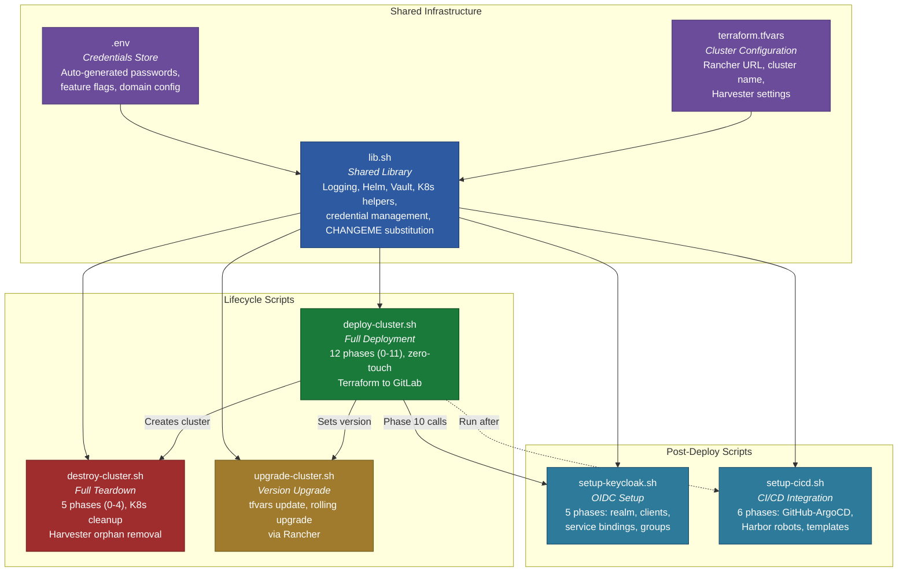

### Script Dependency Chain

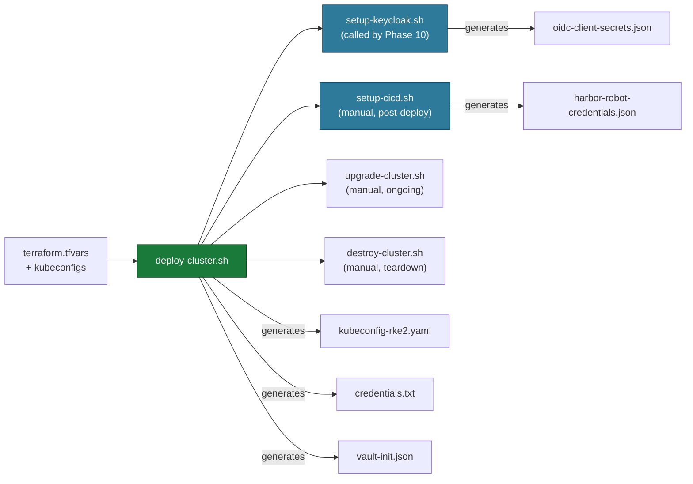

### Execution Order

| Order | Script | When to Run | Duration |
|-------|--------|-------------|----------|
| 1 | `deploy-cluster.sh` | Initial cluster creation | ~45-60 min |
| 2 | `setup-keycloak.sh` | Called automatically by Phase 10 | ~5 min |
| 3 | `setup-cicd.sh` | Manual, after deployment | ~3 min |
| 4 | `upgrade-cluster.sh` | Manual, when upgrading K8s version | ~15-30 min |
| 5 | `destroy-cluster.sh` | Manual, full teardown | ~10-15 min |

---

## 2. lib.sh Shared Library

The shared library (`scripts/lib.sh`) provides all common functions used across the deployment scripts. It is sourced at the top of every script.

### 2.1 Path Constants

| Constant | Value | Description |
|----------|-------|-------------|
| `REPO_ROOT` | Parent of `scripts/` | Repository root directory |
| `CLUSTER_DIR` | `${REPO_ROOT}/cluster` | Terraform configs, kubeconfigs, vault-init.json |
| `SERVICES_DIR` | `${REPO_ROOT}/services` | Kubernetes manifests for all services |
| `SCRIPTS_DIR` | `${REPO_ROOT}/scripts` | Deployment scripts and .env |

### 2.2 Logging Functions

| Function | Parameters | Description | Output |
|----------|-----------|-------------|--------|
| `log_info` | `message...` | Informational message | `[INFO]  message` (blue) |
| `log_ok` | `message...` | Success message | `[OK]    message` (green) |
| `log_warn` | `message...` | Warning (non-fatal) | `[WARN]  message` (yellow) |
| `log_error` | `message...` | Error message | `[ERROR] message` (red) |
| `log_step` | `message...` | Major step marker | `[STEP]  message` (cyan) |
| `die` | `message...` | Fatal error, exits with code 1 | `[ERROR] message` then `exit 1` |

### 2.3 Timer Functions

| Function | Parameters | Return | Side Effects |
|----------|-----------|--------|-------------|
| `start_phase` | `phase_name` | None | Sets `PHASE_START_TIME`, prints decorated banner |
| `end_phase` | `phase_name` | None | Calculates elapsed time since `PHASE_START_TIME`, prints duration |
| `print_total_time` | None | None | Calculates elapsed time since `DEPLOY_START_TIME`, prints total |

### 2.4 Prerequisite Check Functions

| Function | Parameters | Return | Side Effects |
|----------|-----------|--------|-------------|
| `require_cmd` | `cmd_name` | None | Calls `die` if command not found on PATH |
| `check_prerequisites` | None | None | Validates all required CLI tools: `terraform`, `kubectl`, `helm`, `jq`, `openssl`, `curl` |
| `check_changeme_placeholders` | None | None | Scans `services/` for unreplaced `CHANGEME` tokens in YAML files. Ignores comments and README files. Calls `die` if any found. |

### 2.5 Terraform Helpers

| Function | Parameters | Return | Side Effects |
|----------|-----------|--------|-------------|
| `check_tfvars` | None | None | Validates `terraform.tfvars` exists and contains all required variables. Checks for example/placeholder values. Calls `die` on failure. |
| `ensure_harvester_kubeconfig` | None | None | Ensures `kubeconfig-harvester.yaml` exists and is valid. Method 1: Rancher API. Method 2: `~/.kube/config` extraction. |
| `ensure_cloud_provider_kubeconfig` | None | None | Ensures `harvester-cloud-provider-kubeconfig` exists. Tries Harvester secrets first, then Rancher API generation. |
| `ensure_harvester_vm_namespace` | None | None | Creates the VM namespace on Harvester if it does not exist. |
| `ensure_external_files` | None | None | Orchestrates all three `ensure_*` functions above. |
| `_get_tfvar` | `var_name` | `string` | Extracts a quoted value from `terraform.tfvars` by variable name. |
| `get_cluster_name` | None | `string` | Returns `cluster_name` from tfvars. |
| `get_rancher_url` | None | `string` | Returns `rancher_url` from tfvars. |
| `get_rancher_token` | None | `string` | Returns `rancher_token` from tfvars. |
| `get_harvester_cluster_id` | None | `string` | Returns `harvester_cluster_id` from tfvars. |
| `get_vm_namespace` | None | `string` | Returns `vm_namespace` from tfvars. |

### 2.6 Kubernetes Wait Helpers

| Function | Parameters | Return | Side Effects |
|----------|-----------|--------|-------------|
| `wait_for_deployment` | `namespace`, `name`, `timeout` (default `300s`) | `0` on success, `1` on timeout | Uses `kubectl wait --for=condition=available`. Prints pod status on failure. |
| `wait_for_pods_ready` | `namespace`, `label`, `timeout` (default `300s`) | `0` on success, `1` on timeout | Polls every 5s for all pods matching label to be in `Running` state. |
| `wait_for_pods_running` | `namespace`, `count`, `timeout` (default `300s`) | `0` on success, `1` on timeout | Waits for at least `count` pods to be Running (not Ready -- used for sealed Vault). |
| `wait_for_clusterissuer` | `name`, `timeout` (default `120s`) | `0` on success, `1` on timeout | Polls for ClusterIssuer `.status.conditions[Ready]=True`. |
| `wait_for_cnpg_primary` | `namespace`, `cluster_name`, `timeout` (default `300s`) | `0` on success, `1` on timeout | Waits for CNPG cluster phase `Cluster in healthy state` or primary pod Running. |
| `wait_for_helm_release` | `namespace`, `release`, `timeout` (default `120s`) | `0` on success, `1` on timeout | Polls `helm status` for `deployed` status. |
| `wait_for_tls_secret` | `namespace`, `secret_name`, `timeout` (default `120s`) | Always `0` | Non-fatal. Waits for cert-manager to create a TLS secret. Warns if not found. |

### 2.7 Node Labeling

| Function | Parameters | Return | Side Effects |
|----------|-----------|--------|-------------|
| `label_unlabeled_nodes` | None | None | Labels all worker nodes based on hostname pattern (`*-general-*`, `*-compute-*`, `*-database-*`) with `workload-type` and `node-role.kubernetes.io` labels. Idempotent via `--overwrite`. Called in Phase 1 (start and end) to catch autoscaler-created nodes. The Node Labeler operator (also deployed in Phase 1) handles ongoing labeling for nodes created after initial deployment. |

### 2.8 Helm Helpers

| Function | Parameters | Return | Side Effects |
|----------|-----------|--------|-------------|
| `helm_repo_add` | `name`, `url` | None | Adds a Helm repo if not already present, or logs that it exists. In airgapped mode, skips repo add entirely. |
| `resolve_helm_chart` | `online_chart`, `oci_var_name` | `string` (chart ref) | Returns OCI URL from the named env var when `AIRGAPPED=true`, otherwise returns the online chart reference. Used by all Helm installs to support airgapped mode. |
| `helm_install_if_needed` | `release`, `chart`, `namespace`, `...extra_args` | None | If the release exists, runs `helm upgrade`. Otherwise runs `helm install --create-namespace`. All extra arguments are passed through. |

### 2.8a Airgapped Validation

| Function | Parameters | Return | Side Effects |
|----------|-----------|--------|-------------|
| `validate_airgapped_prereqs` | None | None | When `AIRGAPPED=true`, validates all required HELM_OCI_* variables are set, GIT_BASE_URL is set, UPSTREAM_PROXY_REGISTRY is set, ARGO_ROLLOUTS_PLUGIN_URL does not point to github.com, and Gateway API CRD file exists locally. Calls `die` with detailed instructions on failure. |

### 2.9 Rancher API Helpers

| Function | Parameters | Return | Side Effects |
|----------|-----------|--------|-------------|
| `get_rancher_cluster_id` | `cluster_name` | `string` (cluster ID) | Queries Rancher provisioning API for the v3 cluster ID (c-xxxxx format). |
| `wait_for_cluster_active` | `cluster_name`, `timeout` (default `1800s`) | `0` on success | Polls Rancher API every 30s for `.status.ready=true`. Calls `die` on timeout. |
| `generate_kubeconfig` | `cluster_name`, `output_path` | None | Generates kubeconfig via Rancher `generateKubeconfig` action. Calls `die` if empty. |

### 2.10 Vault Helpers

| Function | Parameters | Return | Side Effects |
|----------|-----------|--------|-------------|
| `vault_init` | `output_file` | None | Initializes Vault with 5 key shares, threshold 3. Saves JSON to `output_file`. Validates key count. |
| `vault_unseal_replica` | `replica_index`, `init_file` | None | Unseals a single Vault replica (0, 1, or 2) using the first 3 unseal keys from `init_file`. |
| `vault_unseal_all` | `init_file` | None | Calls `vault_unseal_replica` for indices 0, 1, 2. |
| `vault_exec` | `root_token`, `...vault_args` | Command output | Executes a Vault command on `vault-0` via `kubectl exec` with `VAULT_ADDR` and `VAULT_TOKEN` set. |
| `vault_exec_stdin` | `root_token`, `...vault_args` | Command output | Same as `vault_exec` but with `-i` flag for stdin (used for policy writes). |

### 2.11 kubectl Apply Helpers

| Function | Parameters | Return | Side Effects |
|----------|-----------|--------|-------------|
| `kube_apply` | `...kubectl_args` | None | Wrapper around `kubectl apply` with logging. |
| `kube_apply_k` | `directory` | None | Applies a kustomize directory with logging. |
| `kube_apply_subst` | `file1`, `file2`, ... | None | Reads each file, pipes through `_subst_changeme` for credential/domain substitution, applies via `kubectl apply -f -`. |
| `kube_apply_k_subst` | `directory` | None | Runs `kubectl kustomize`, pipes through `_subst_changeme`, applies via `kubectl apply -f -`. |
| `ensure_namespace` | `namespace` | None | Creates namespace if it does not exist. Idempotent. |

### 2.12 Credential Management

| Function | Parameters | Return | Side Effects |
|----------|-----------|--------|-------------|
| `gen_password` | `length` (default `32`) | `string` | Generates a random alphanumeric password via `openssl rand -base64` with `+/=` stripped. |
| `generate_or_load_env` | None | None | Loads `.env` if it exists, otherwise generates fresh credentials. Auto-generates any missing values using `gen_password`. Derives `DOMAIN_DASHED` and `DOMAIN_DOT` from `DOMAIN`. Exports all variables. Writes updated `.env` file. See [Section 3](#3-environment-configuration) for full variable reference. |
| `_subst_changeme` | None (stdin filter) | stdout | `sed` filter that replaces all `CHANGEME_*` tokens and domain placeholders with actual values from exported environment variables. |
| `write_credentials_file` | None | None | Writes `cluster/credentials.txt` with all service URLs, admin passwords, and Root CA certificate. |

### 2.13 HTTPS Connectivity Checks

| Function | Parameters | Return | Side Effects |
|----------|-----------|--------|-------------|
| `deploy_check_pod` | None | None | Creates a `curl-check` pod in the `default` namespace using `curlimages/curl`. Scheduled on `workload-type=general` nodes. Sleeps for 7200s (2 hours). |
| `check_https` | `fqdn` | None | Runs `curl -sk` from inside the `curl-check` pod to verify HTTPS connectivity. Uses `--resolve` to point FQDN at `TRAEFIK_LB_IP`. Checks HTTP status code and TLS certificate issuer. |
| `check_https_batch` | `fqdn1`, `fqdn2`, ... | None | Calls `check_https` for each FQDN. |
| `cleanup_check_pod` | None | None | Deletes the `curl-check` pod. |

### 2.14 Root CA Distribution

| Function | Parameters | Return | Side Effects |
|----------|-----------|--------|-------------|
| `extract_root_ca` | None | `string` (PEM) | Returns Root CA PEM. Primary: reads `cluster/root-ca.pem`. Fallback: extracts root cert from Vault intermediate CA chain. |
| `distribute_root_ca` | None | None | Creates a `vault-root-ca` ConfigMap containing the Root CA PEM in `kube-system`, `monitoring`, `argocd`, `argo-rollouts`, `harbor`, `mattermost`, `gitlab`, and `keycloak` namespaces (8 total). |

### 2.15 Registry Configuration

| Function | Parameters | Return | Side Effects |
|----------|-----------|--------|-------------|
| `create_harbor_project` | `name`, `public` | None | Creates a Harbor project via API. Used by Phase 4 (proxy caches) and Phase 5b (DHI). |
| `configure_rancher_registries` | None | None | Patches the Rancher provisioning cluster object with registry mirrors (docker.io, quay.io, ghcr.io, gcr.io, registry.k8s.io, docker.elastic.co) pointing to Harbor proxy-cache projects. Includes Root CA bundle for TLS. Primary method: kubectl patch via K3K Rancher pod. Fallback: Rancher Steve API PUT. |
| `_configure_registries_curl` | `rancher_url`, `rancher_token`, `cluster_name`, `ca_b64`, `harbor_fqdn` | `0`/`1` | Curl fallback for `configure_rancher_registries`. Fetches full cluster JSON, merges registries config, PUTs back via Rancher API. |

### 2.16 Operator Image Push

| Function | Parameters | Return | Side Effects |
|----------|-----------|--------|-------------|
| `push_operator_images` | None | None | Scans `operators/images/` for `.tar.gz` tarballs. Creates a `crane` pod in the cluster. Authenticates to Harbor. Copies tarballs into the pod and pushes to `harbor.DOMAIN/library/`. Restarts node-labeler and storage-autoscaler deployments afterward. Tarball naming convention: `<name>-<version>-<arch>.tar.gz` |

---

## 3. Environment Configuration

### 3.1 .env Variable Reference

All variables are defined in `scripts/.env` (generated from `.env.example`). If a variable is unset or empty, `generate_or_load_env` auto-generates a secure random value.

| Variable | Default | Auto-Generated | Description |
|----------|---------|:--------------:|-------------|
| `DOMAIN` | *(required)* | No | Root domain for all service FQDNs (e.g., `example.com`) |
| `DOMAIN_DASHED` | *(derived)* | Yes | Domain with dots replaced by dashes (e.g., `example-com`). Used in TLS secret names. |
| `DOMAIN_DOT` | *(derived)* | Yes | Domain with dots replaced by `-dot-` (e.g., `example-dot-com`). Used in Vault PKI role names. |
| `DEPLOY_UPTIME_KUMA` | `true` | No | Feature flag: deploy Uptime Kuma status page |
| `DEPLOY_LIBRENMS` | `false` | No | Feature flag: deploy LibreNMS network monitoring |
| `DEPLOY_DHI_BUILDER` | `false` | No | Enable DHI Builder hardened image pipeline (requires Harbor + ArgoCD) |
| `AIRGAPPED` | `false` | No | Enable airgapped mode for Harbor proxy-cache |
| `UPSTREAM_PROXY_REGISTRY` | *(empty)* | No | Upstream proxy registry hostname for airgapped mode |
| `KEYCLOAK_BOOTSTRAP_CLIENT_SECRET` | *(random 32 chars)* | Yes | Keycloak bootstrap admin client secret |
| `KEYCLOAK_DB_PASSWORD` | *(random 32 chars)* | Yes | PostgreSQL password for Keycloak CNPG cluster |
| `MATTERMOST_DB_PASSWORD` | *(random 32 chars)* | Yes | PostgreSQL password for Mattermost CNPG cluster |
| `MATTERMOST_MINIO_ROOT_USER` | `mattermost-minio-admin` | No | MinIO root user for Mattermost object storage |
| `MATTERMOST_MINIO_ROOT_PASSWORD` | *(random 32 chars)* | Yes | MinIO root password for Mattermost |
| `HARBOR_REDIS_PASSWORD` | *(random 32 chars)* | Yes | Password for Harbor Valkey Sentinel cluster |
| `HARBOR_ADMIN_PASSWORD` | *(random 32 chars)* | Yes | Harbor admin user password |
| `HARBOR_MINIO_SECRET_KEY` | *(random 32 chars)* | Yes | MinIO secret key for Harbor S3 storage |
| `HARBOR_DB_PASSWORD` | *(random 32 chars)* | Yes | PostgreSQL password for Harbor CNPG cluster |
| `KASM_PG_SUPERUSER_PASSWORD` | *(random 32 chars)* | Yes | PostgreSQL superuser password for Kasm CNPG cluster |
| `KASM_PG_APP_PASSWORD` | *(random 30 chars)* | Yes | PostgreSQL app password for Kasm CNPG cluster |
| `KC_ADMIN_PASSWORD` | *(random 24 chars)* | Yes | Keycloak realm admin password |
| `GRAFANA_ADMIN_PASSWORD` | *(random 24 chars)* | Yes | Grafana admin password |
| `BASIC_AUTH_PASSWORD` | *(random 24 chars)* | Yes | **Deprecated**: kept for rollback compatibility. oauth2-proxy secrets are auto-generated at deploy time. |
| `BASIC_AUTH_HTPASSWD` | *(derived)* | Yes | **Deprecated**: bcrypt htpasswd hash. No longer used — oauth2-proxy handles authentication. |
| `OAUTH2_PROXY_REDIS_PASSWORD` | *(random 32 chars)* | Yes | Redis session store password for oauth2-proxy instances |
| `LIBRENMS_DB_PASSWORD` | *(random 32 chars)* | Yes | MariaDB password for LibreNMS (generated even if disabled) |
| `LIBRENMS_VALKEY_PASSWORD` | *(random 32 chars)* | Yes | Valkey/Redis password for LibreNMS |
| `GITLAB_ROOT_PASSWORD` | *(random 32 chars)* | Yes | GitLab root user password |
| `GITLAB_PRAEFECT_DB_PASSWORD` | *(random 32 chars)* | Yes | GitLab Praefect PostgreSQL password |
| `GITLAB_REDIS_PASSWORD` | *(random 32 chars)* | Yes | GitLab Redis password |
| `GITLAB_GITALY_TOKEN` | *(random 32 chars)* | Yes | GitLab Gitaly authentication token |
| `GITLAB_PRAEFECT_TOKEN` | *(random 32 chars)* | Yes | GitLab Praefect authentication token |
| `GITLAB_CHART_PATH` | `/home/rocky/data/gitlab` | No | Local path to GitLab Helm chart (for offline install) |
| `TRAEFIK_LB_IP` | `198.51.100.2` | No | Traefik LoadBalancer IP (read from tfvars or default) |
| `ORG_NAME` | *(derived from DOMAIN)* | Yes | Organization name for PKI CA Common Names (e.g., `Example Org`). Auto-derived from DOMAIN if empty. |
| `KC_REALM` | *(derived from DOMAIN)* | Yes | Keycloak realm name. Derived from DOMAIN first segment (e.g., `example.com` -> `example`). |
| `GIT_REPO_URL` | *(derived from git remote)* | Yes | Git repo URL for ArgoCD bootstrap. Derived from `git remote get-url origin`, fallback: `git@github.com:OWNER/rke2-cluster.git` |
| `GIT_BASE_URL` | *(derived from GIT_REPO_URL)* | Yes | Base URL for ArgoCD service repos (e.g., `git@github.com:org`). Derived by stripping repo name from GIT_REPO_URL. Required for airgapped mode (set to internal git server). |
| `ARGO_ROLLOUTS_PLUGIN_URL` | GitHub release URL | No | Argo Rollouts Gateway API plugin binary URL. Must point to internal mirror when `AIRGAPPED=true`. |
| `HELM_OCI_CERT_MANAGER` | *(empty)* | No | OCI URL override for cert-manager chart (required when `AIRGAPPED=true`) |
| `HELM_OCI_CNPG` | *(empty)* | No | OCI URL override for CNPG chart (required when `AIRGAPPED=true`) |
| `HELM_OCI_CLUSTER_AUTOSCALER` | *(empty)* | No | OCI URL override for cluster-autoscaler chart (required when `AIRGAPPED=true`) |
| `HELM_OCI_REDIS_OPERATOR` | *(empty)* | No | OCI URL override for redis-operator chart (required when `AIRGAPPED=true`) |
| `HELM_OCI_MARIADB_OPERATOR` | *(empty)* | No | OCI URL override for mariadb-operator chart (required when `AIRGAPPED=true`, if LibreNMS enabled) |
| `HELM_OCI_VAULT` | *(empty)* | No | OCI URL override for Vault chart (required when `AIRGAPPED=true`) |
| `HELM_OCI_HARBOR` | *(empty)* | No | OCI URL override for Harbor chart (required when `AIRGAPPED=true`) |
| `HELM_OCI_ARGOCD` | *(empty)* | No | OCI URL override for ArgoCD chart (required when `AIRGAPPED=true`) |
| `HELM_OCI_ARGO_ROLLOUTS` | *(empty)* | No | OCI URL override for Argo Rollouts chart (required when `AIRGAPPED=true`) |
| `HELM_OCI_KASM` | *(empty)* | No | OCI URL override for Kasm chart (required when `AIRGAPPED=true`) |
| ~~`OAUTH2_PROXY_COOKIE_SECRET`~~ | -- | -- | *Removed: per-service cookie secrets are auto-generated during Phase 10 deploy* |
| `HARVESTER_CONTEXT` | `harvester` | No | kubectl context name for Harvester in `~/.kube/config` |
| `USER_DATA_CP_FILE` | *(empty)* | No | Custom cloud-init file for control plane nodes |
| `USER_DATA_WORKER_FILE` | *(empty)* | No | Custom cloud-init file for worker nodes |
| `IDENTITY_PORTAL_OIDC_SECRET` | *(random 32 chars)* | Yes | Identity Portal Keycloak OIDC client secret |
| `GITLAB_API_TOKEN` | *(empty)* | No | GitLab API token for automated deploy key setup (optional, used by `setup-cicd.sh`) |

### 3.2 Auto-Generation Logic

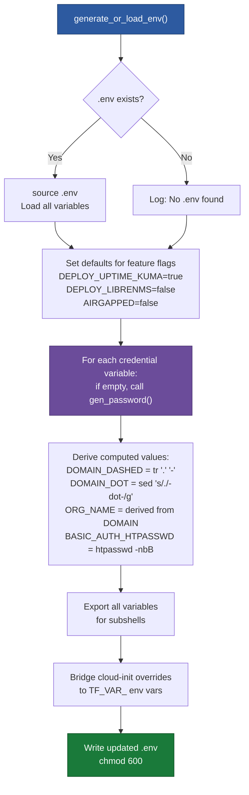

### 3.3 CHANGEME Token Substitution

The `_subst_changeme` function performs inline substitution of placeholder tokens in Kubernetes manifests at apply time. This avoids storing secrets in YAML files committed to Git.

| Token in YAML | Replaced With |
|----------------|---------------|
| `CHANGEME_BOOTSTRAP_CLIENT_SECRET` | `$KEYCLOAK_BOOTSTRAP_CLIENT_SECRET` |
| `CHANGEME_KEYCLOAK_DB_PASSWORD` | `$KEYCLOAK_DB_PASSWORD` |
| `CHANGEME_MATTERMOST_DB_PASSWORD` | `$MATTERMOST_DB_PASSWORD` |
| `CHANGEME_MINIO_ROOT_USER` | `$MATTERMOST_MINIO_ROOT_USER` |
| `CHANGEME_MINIO_ROOT_PASSWORD` | `$MATTERMOST_MINIO_ROOT_PASSWORD` |
| `CHANGEME_HARBOR_REDIS_PASSWORD` | `$HARBOR_REDIS_PASSWORD` |
| `CHANGEME_GRAFANA_ADMIN_PASSWORD` | `$GRAFANA_ADMIN_PASSWORD` |
| `CHANGEME_LIBRENMS_DB_PASSWORD` | `$LIBRENMS_DB_PASSWORD` |
| `CHANGEME_LIBRENMS_VALKEY_PASSWORD` | `$LIBRENMS_VALKEY_PASSWORD` |
| `CHANGEME_HARBOR_ADMIN_PASSWORD` | `$HARBOR_ADMIN_PASSWORD` |
| `CHANGEME_HARBOR_MINIO_SECRET_KEY` | `$HARBOR_MINIO_SECRET_KEY` |
| `CHANGEME_HARBOR_DB_PASSWORD` | `$HARBOR_DB_PASSWORD` |
| `CHANGEME_KASM_PG_SUPERUSER_PASSWORD` | `$KASM_PG_SUPERUSER_PASSWORD` |
| `CHANGEME_KASM_PG_APP_PASSWORD` | `$KASM_PG_APP_PASSWORD` |
| `CHANGEME_KC_ADMIN_PASSWORD` | `$KC_ADMIN_PASSWORD` |
| `CHANGEME_GITLAB_REDIS_PASSWORD` | `$GITLAB_REDIS_PASSWORD` |
| `CHANGEME_OAUTH2_PROXY_REDIS_PASSWORD` | `$OAUTH2_PROXY_REDIS_PASSWORD` |
| `admin:CHANGEME_GENERATE_WITH_HTPASSWD` | `$BASIC_AUTH_HTPASSWD` |
| `CHANGEME_TRAEFIK_LB_IP` | `$TRAEFIK_LB_IP` |
| `CHANGEME_GIT_REPO_URL` | `$GIT_REPO_URL` |
| `CHANGEME_ARGO_ROLLOUTS_PLUGIN_URL` | `$ARGO_ROLLOUTS_PLUGIN_URL` |
| `CHANGEME_GIT_BASE_URL` | `$GIT_BASE_URL` |
| `CHANGEME_TRAEFIK_FQDN` | `traefik.${DOMAIN}` |
| `CHANGEME_TRAEFIK_TLS_SECRET` | `traefik-${DOMAIN_DASHED}-tls` |
| `CHANGEME_KC_REALM` | `$KC_REALM` |
| `<DOMAIN_DOT>` (e.g., `example-dot-com`) | `$DOMAIN_DOT` |
| `<DOMAIN_DASHED>` (e.g., `example-com`) | `$DOMAIN_DASHED` |
| `<DOMAIN>` (e.g., `example.com`) | `$DOMAIN` |

---

## 4. deploy-cluster.sh Master Flow

### 4.1 CLI Arguments

| Argument | Description |
|----------|-------------|
| `--skip-tf` | Skip Terraform (Phase 0). Assumes cluster already exists. |
| `--from N` | Resume from phase N (0-11). Requires `kubeconfig-rke2.yaml` for N > 0. |
| `-h`, `--help` | Print usage and exit. |

### 4.2 Master Execution Flow

```mermaid
flowchart TD
    START["main()"] --> BANNER["Print ASCII banner"]
    BANNER --> TIMER["Set DEPLOY_START_TIME"]
    TIMER --> PREREQ["check_prerequisites()"]
    PREREQ --> CREDS["generate_or_load_env()"]

    CREDS --> P0{"FROM_PHASE <= 0<br/>AND not --skip-tf?"}
    P0 -->|Yes| PHASE0["phase_0_terraform()"]
    P0 -->|No| P1

    PHASE0 --> P1{"FROM_PHASE <= 1?"}
    P1 -->|Yes| PHASE1["phase_1_foundation()"]
    P1 -->|No| P2

    PHASE1 --> P2{"FROM_PHASE <= 2?"}
    P2 -->|Yes| PHASE2["phase_2_vault()"]
    P2 -->|No| P3

    PHASE2 --> P3{"FROM_PHASE <= 3?"}
    P3 -->|Yes| PHASE3["phase_3_monitoring()"]
    P3 -->|No| P4

    PHASE3 --> P4{"FROM_PHASE <= 4?"}
    P4 -->|Yes| PHASE4["phase_4_harbor()"]
    P4 -->|No| P5

    PHASE4 --> P5{"FROM_PHASE <= 5?"}
    P5 -->|Yes| PHASE5["phase_5_argocd()"]
    P5 -->|No| P6

    PHASE5 --> P6{"FROM_PHASE <= 6?"}
    P6 -->|Yes| PHASE6["phase_6_keycloak()"]
    P6 -->|No| P7

    PHASE6 --> P7{"FROM_PHASE <= 7?"}
    P7 -->|Yes| PHASE7["phase_7_remaining()"]
    P7 -->|No| P8

    PHASE7 --> P8{"FROM_PHASE <= 8?"}
    P8 -->|Yes| PHASE8["phase_8_dns()"]
    P8 -->|No| P9

    PHASE8 --> P9{"FROM_PHASE <= 9?"}
    P9 -->|Yes| PHASE9["phase_9_validation()"]
    P9 -->|No| P10

    PHASE9 --> P10{"FROM_PHASE <= 10?"}
    P10 -->|Yes| PHASE10["phase_10_keycloak_setup()"]
    P10 -->|No| P11

    PHASE10 --> P11{"FROM_PHASE <= 11?"}
    P11 -->|Yes| PHASE11["phase_11_gitlab()"]
    P11 -->|No| DONE["Done"]

    PHASE11 --> DONE

    style START fill:#2d5aa0,color:#fff
    style PHASE0 fill:#4a4a4a,color:#fff
    style PHASE1 fill:#1a5a3a,color:#fff
    style PHASE2 fill:#6b4c9a,color:#fff
    style PHASE3 fill:#2d7a9a,color:#fff
    style PHASE4 fill:#2d5aa0,color:#fff
    style PHASE5 fill:#a07a2d,color:#fff
    style PHASE6 fill:#a05a2d,color:#fff
    style PHASE7 fill:#5a2d7a,color:#fff
    style PHASE8 fill:#7a5a2d,color:#fff
    style PHASE9 fill:#1a7a3a,color:#fff
    style PHASE10 fill:#2d7a9a,color:#fff
    style PHASE11 fill:#7a2d5a,color:#fff
```

### 4.3 Phase 0: Terraform -- RKE2 Cluster Provisioning

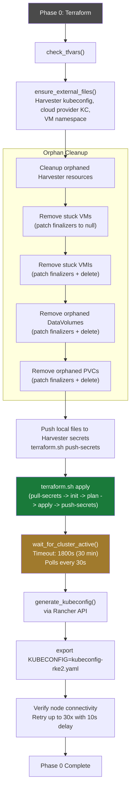

### 4.4 Phase 1: Cluster Foundation

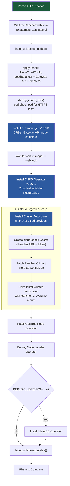

### 4.5 Phase 2: Vault + PKI + SSH CA

See [Section 5: Vault PKI Setup Flow](#5-vault-pki-setup-flow) for detailed breakdown. This phase also configures the SSH secrets engine (`ssh-client-signer/`), signing roles (admin-role, infra-role, developer-role), and the `identity-portal` K8s auth role for SSH certificate issuance.

### 4.6 Phase 3: Monitoring Stack

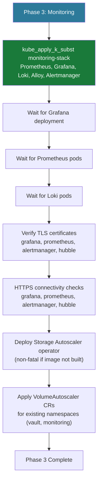

### 4.7 Phase 4: Harbor

```mermaid
flowchart TD
    START["Phase 4: Harbor"] --> NS["Create namespaces: harbor, minio, database"]

    NS --> MINIO["Deploy MinIO<br/>secret -> PVC -> deployment -> service"]
    MINIO --> MINIOW["Wait for MinIO deployment"]
    MINIOW --> BUCKET["Job: create MinIO buckets"]

    BUCKET --> PG["Deploy CNPG harbor-pg<br/>secret -> cluster -> scheduled backup"]
    PG --> PGW["Wait for harbor-pg primary (600s)"]

    PGW --> VALKEY["Deploy Valkey Sentinel<br/>secret -> replication -> sentinel"]
    VALKEY --> VALKEYW["Wait for Valkey replication + sentinel pods"]

    VALKEYW --> HARBOR["Helm install Harbor v1.18.2<br/>Values substituted via _subst_changeme"]
    HARBOR --> HW["Wait for harbor-core deployment (600s)"]

    HW --> GW["Apply Gateway + HTTPRoute + HPAs"]
    GW --> TLS["Wait for TLS secret + HTTPS check"]

    TLS --> PROXY["Configure Harbor proxy cache projects<br/>docker.io, quay.io, ghcr.io, gcr.io,<br/>registry.k8s.io, docker.elastic.co"]
    PROXY --> CICD["Create CICD projects<br/>library, charts, dev"]

    CICD --> ROOTCA["distribute_root_ca()<br/>kube-system, monitoring, argocd,<br/>argo-rollouts, harbor, mattermost,<br/>gitlab, keycloak"]

    ROOTCA --> REG["configure_rancher_registries()<br/>Mirror docker.io/quay.io/ghcr.io etc. to Harbor"]

    REG --> PUSH["push_operator_images()<br/>node-labeler, storage-autoscaler to Harbor"]

    PUSH --> DONE["Phase 4 Complete"]

    style START fill:#2d5aa0,color:#fff
    style HARBOR fill:#1a7a3a,color:#fff
    style REG fill:#6b4c9a,color:#fff
```

### 4.8 Phase 5: ArgoCD + Argo Rollouts + Argo Workflows + Argo Events

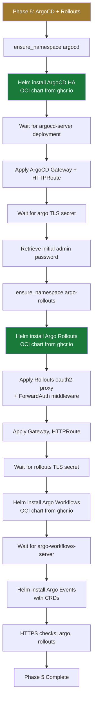

### 4.8a Phase 5b: DHI Builder

Phase 5b deploys the Docker Hardened Images (DHI) Builder pipeline. This phase is gated behind the `DEPLOY_DHI_BUILDER=true` feature flag and requires Harbor (Phase 4) and ArgoCD (Phase 5) to be operational.

**Feature flag**: `DEPLOY_DHI_BUILDER=true`

**Steps**: Create Harbor `dhi/` project, deploy DHI Builder manifests (BuildKit, Argo Events, Argo Workflows pipeline), wait for BuildKit readiness.

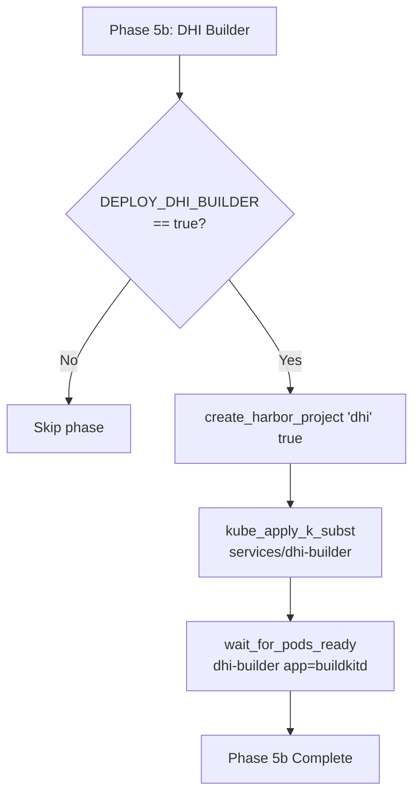

### 4.9 Phase 6: Keycloak

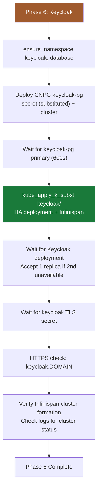

### 4.10 Phase 7: Remaining Services (including Identity Portal)

```mermaid
flowchart TD
    START["Phase 7: Remaining Services"] --> DBNS["ensure_namespace database"]

    subgraph "7.1 Mattermost"
        DBNS --> MMPG["CNPG mattermost-pg"]
        MMPG --> MM["kube_apply_k_subst mattermost/"]
        MM --> MMMINIO["Wait for Mattermost MinIO"]
        MMMINIO --> MMWAIT["Wait for Mattermost deployment"]
        MMWAIT --> MMBUCKET["Job: Create MinIO bucket via mc"]
        MMBUCKET --> MMTLS["Wait for TLS + HTTPS check"]
    end

    subgraph "7.2 Kasm Workspaces"
        MMTLS --> KASMNS["Create kasm namespace"]
        KASMNS --> KASMPG["CNPG kasm-pg (PG 14)"]
        KASMPG --> KASMEXT["Create uuid-ossp extension<br/>via psql superuser"]
        KASMEXT --> KASMHELM["Helm install Kasm v1.1181.0"]
        KASMHELM --> KASMINIT["Wait for DB init job"]
        KASMINIT --> KASMWAIT["Wait for kasm-api-deployment"]
        KASMWAIT --> KASMTLS["Apply certificate + IngressRoute"]
    end

    subgraph "7.3 Uptime Kuma (conditional)"
        KASMTLS --> UKCHECK{"DEPLOY_UPTIME_KUMA?"}
        UKCHECK -->|Yes| UK["kube_apply_k_subst uptime-kuma/"]
        UKCHECK -->|No| LCHECK
        UK --> UKTLS["Wait for TLS + HTTPS check"]
        UKTLS --> LCHECK
    end

    subgraph "7.4 LibreNMS (conditional)"
        LCHECK{"DEPLOY_LIBRENMS?"}
        LCHECK -->|Yes| LN["kube_apply_k_subst librenms/"]
        LCHECK -->|No| DONE
        LN --> LNDB["Wait for MariaDB Galera"]
        LNDB --> LNREDIS["Wait for Redis repl + sentinel"]
        LNREDIS --> LNAPP["Wait for LibreNMS deployment"]
        LNAPP --> LNTLS["Wait for TLS + HTTPS check"]
        LNTLS --> IDCHECK
    end

    subgraph "7.5 Identity Portal"
        IDCHECK["Deploy Identity Portal"] --> IDNS["ensure_namespace identity-portal"]
        IDNS --> IDAPPLY["kube_apply_k_subst identity-portal/"]
        IDAPPLY --> IDWAIT["Wait for backend + frontend deployments"]
        IDWAIT --> IDTLS["Wait for TLS + HTTPS check"]
    end

    IDTLS --> DONE["Phase 7 Complete"]

    style START fill:#5a2d7a,color:#fff
```

### 4.11 Phase 8: DNS Records

Phase 8 is informational only -- it prints the required DNS A records pointing to the Traefik LoadBalancer IP. The following FQDNs are listed:

- vault, grafana, prometheus, alertmanager, hubble, traefik, harbor, argo, rollouts, keycloak, mattermost, kasm, identity, gitlab
- Conditionally: status (Uptime Kuma), librenms (LibreNMS)

### 4.12 Phase 9: Validation

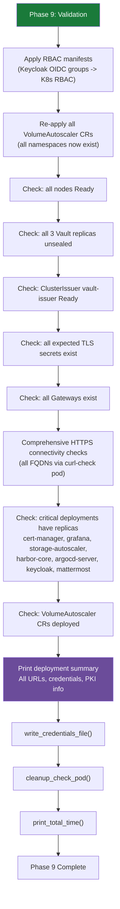

### 4.13 Phase 10: Keycloak OIDC Setup + oauth2-proxy ForwardAuth

Phase 10 has two stages:

1. **Keycloak OIDC Setup**: Calls `setup-keycloak.sh` as a child process, which creates the realm, 15 OIDC clients (including `identity-portal`), service bindings, and 8 groups. See [Section 8](#8-setup-keycloaksh-flow) for details.

2. **oauth2-proxy ForwardAuth**: After Keycloak setup completes, Phase 10 reads the generated `oidc-client-secrets.json` and:
   - Creates per-service `oauth2-proxy-*` Secrets in the correct namespaces for: prometheus (monitoring), alertmanager (monitoring), hubble (kube-system), traefik-dashboard (kube-system), rollouts (argo-rollouts)
   - Distributes oauth2-proxy Redis session store credentials to `kube-system` and `argo-rollouts` namespaces
   - Applies oauth2-proxy Deployment + ForwardAuth Middleware manifests for all 5 protected services

### 4.14 Phase 11: GitLab

Phase 11 calls `setup-gitlab.sh`, which deploys GitLab with 7 internal phases: Prerequisites, CNPG PostgreSQL, Secrets, OpsTree Redis, Gateway, Helm Install, and Validation. See `scripts/setup-gitlab.sh` for details.

---

## 5. Vault PKI Setup Flow

Phase 2 is the most complex phase in the deployment. It bootstraps a full PKI hierarchy with an offline root CA.

### 5.1 Complete PKI Bootstrap Flow

```mermaid
flowchart TD
    START["Phase 2: Vault + PKI"] --> WEBHOOK["Wait for Rancher webhook<br/>30 attempts, 10s interval"]

    WEBHOOK --> HELM["Helm install Vault HA v0.32.0<br/>3 replicas, Raft storage"]
    HELM --> PODWAIT["wait_for_pods_running vault 3 300"]

    PODWAIT --> INITCHECK{"Vault already<br/>initialized?"}

    INITCHECK -->|Yes| RESUME["Resume path:<br/>Load vault-init.json"]

    subgraph "Resume Path"
        RESUME --> INITFILE{"vault-init.json<br/>exists locally?"}
        INITFILE -->|No| PULL["Pull from Harvester secrets"]
        INITFILE -->|Yes| UNSEALCHECK
        PULL --> UNSEALCHECK{"vault-0 sealed?"}
        UNSEALCHECK -->|Yes| UNSEAL0R["Unseal vault-0"]
        UNSEALCHECK -->|No| JOINLOOP
        UNSEAL0R --> JOINLOOP["Join + unseal vault-1, vault-2"]
    end

    INITCHECK -->|No| FRESH["Fresh initialization"]

    subgraph "Fresh Init Path"
        FRESH --> INIT["vault_init()<br/>5 shares, threshold 3<br/>Save to vault-init.json"]
        INIT --> UNSEAL0["Unseal vault-0<br/>Using keys 0, 1, 2"]
    end

    UNSEAL0 --> RAFTFORM
    JOINLOOP --> RAFTFORM

    RAFTFORM["Ensure Raft cluster formed"] --> RAFTJOIN["For vault-1, vault-2:<br/>Join Raft if not initialized<br/>Unseal if sealed"]
    RAFTJOIN --> PODREADY["wait_for_pods_ready<br/>label: app.kubernetes.io/name=vault"]
    PODREADY --> RAFTVERIFY["Verify Raft peers<br/>vault operator raft list-peers"]

    RAFTVERIFY --> ROOTCA{"root-ca.pem<br/>exists?"}

    subgraph "Root CA Generation"
        ROOTCA -->|No| PULLCA["Try pulling from Harvester"]
        PULLCA --> CACHECK{"root-ca.pem<br/>now exists?"}
        CACHECK -->|No| GENROOT["Generate Root CA locally<br/>4096-bit RSA, 15yr validity<br/>Subject: Example Org Root CA"]
        CACHECK -->|Yes| INTCA
        ROOTCA -->|Yes| INTCA
        GENROOT --> INTCA
    end

    subgraph "Intermediate CA (Vault)"
        INTCA{"pki_int/ engine<br/>exists?"}
        INTCA -->|Yes| K8SAUTH
        INTCA -->|No| ENABLEPKI["Enable PKI engine at pki_int/"]
        ENABLEPKI --> TUNE["Tune max-lease-ttl=87600h (10yr)"]
        TUNE --> CSR["Generate intermediate CSR<br/>inside Vault (4096-bit, 10yr)"]
        CSR --> SIGN["Sign CSR locally with Root CA key<br/>openssl x509 with CA:true, pathlen:0"]
        SIGN --> CHAIN["Build chain: intermediate + root"]
        CHAIN --> IMPORT["Import signed chain into Vault<br/>pki_int/intermediate/set-signed"]
        IMPORT --> URLS["Configure issuing/CRL URLs"]
        URLS --> ROLE["Create signing role<br/>allowed_domains=DOMAIN<br/>allow_subdomains=true, max_ttl=720h"]
    end

    subgraph "Kubernetes Auth for cert-manager"
        ROLE --> K8SAUTH{"kubernetes/ auth<br/>already enabled?"}
        K8SAUTH -->|Yes| STORE
        K8SAUTH -->|No| ENABLEAUTH["Enable kubernetes auth"]
        ENABLEAUTH --> SATOKEN["Create long-lived SA token<br/>(8760h via kubectl create token)"]
        SATOKEN --> SACA["Get kube-root-ca.crt ConfigMap"]
        SACA --> AUTHCONFIG["Write auth/kubernetes/config<br/>kubernetes_host, ca_cert, issuer"]
        AUTHCONFIG --> POLICY["Write cert-manager policy<br/>pki_int/sign, pki_int/issue, pki_int/cert/ca"]
        POLICY --> AUTHROLE["Create K8s auth role<br/>cert-manager-issuer<br/>bound to vault-issuer SA in cert-manager ns"]
    end

    AUTHROLE --> STORE["Push vault-init.json to Harvester<br/>terraform.sh push-secrets"]

    STORE --> RBAC["Apply cert-manager RBAC<br/>+ ClusterIssuer vault-issuer"]
    RBAC --> CIREADY["wait_for_clusterissuer vault-issuer"]

    CIREADY --> VAULTGW["Apply Vault Gateway + HTTPRoute"]

    VAULTGW --> CLEANUP["Cleanup temp files"]
    CLEANUP --> TLSCHECK["Wait for Vault TLS secret"]
    TLSCHECK --> HTTPSCHECK["check_https vault.DOMAIN"]

    HTTPSCHECK --> DIST["distribute_root_ca()<br/>kube-system, monitoring, argocd,<br/>argo-rollouts, harbor, mattermost,<br/>gitlab, keycloak"]

    DIST --> TRAEFIK_RESTART["Restart Traefik DaemonSet<br/>to pick up Root CA"]

    TRAEFIK_RESTART --> DONE["Phase 2 Complete<br/>TLS available cluster-wide"]

    style START fill:#6b4c9a,color:#fff
    style GENROOT fill:#a02d2d,color:#fff
    style SIGN fill:#a02d2d,color:#fff
    style IMPORT fill:#1a7a3a,color:#fff
    style DONE fill:#1a7a3a,color:#fff
```

### 5.2 PKI Architecture Summary

```
    Example Org Root CA (15yr, 4096-bit RSA)
    Key: LOCAL ONLY (cluster/root-ca-key.pem)
    Cert: cluster/root-ca.pem
    Backed up to: Harvester secrets
        |
        +--- Example Org Intermediate CA (10yr, 4096-bit RSA)
             Key: VAULT ONLY (pki_int/ engine, never exported)
             Signed by: Root CA (openssl, locally)
                 |
                 +--- Leaf Certificates (30 day TTL, auto-renewed)
                      Issued by: Vault via cert-manager ClusterIssuer
                      Role: DOMAIN with subdomains allowed
                      Consumed by: Gateway API TLS listeners
```

### 5.3 Vault Unseal Process

Each Vault replica requires 3 of 5 unseal keys (Shamir's Secret Sharing, threshold 3):

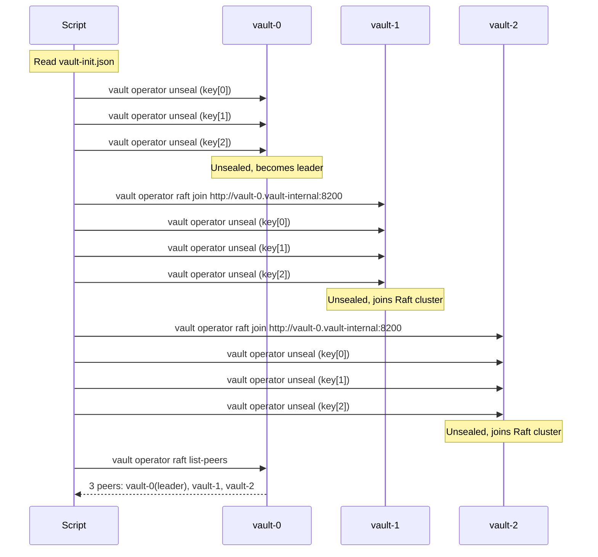

---

## 6. destroy-cluster.sh Flow

### 6.1 CLI Arguments

| Argument | Description |
|----------|-------------|
| `--auto` | Skip confirmation prompt. Adds `-auto-approve` to Terraform destroy. |
| `--skip-tf` | Skip Terraform destroy. Only perform Harvester orphan cleanup. |
| `-h`, `--help` | Print usage and exit. |

### 6.2 Complete Destroy Flow

```mermaid
flowchart TD
    START["main()"] --> BANNER["Print ASCII banner (red)"]
    BANNER --> TIMER["Set DEPLOY_START_TIME"]
    TIMER --> P0["Phase 0: Pre-flight"]

    subgraph "Phase 0: Pre-flight"
        P0 --> PREREQ["check_prerequisites()"]
        PREREQ --> TFVARS["check_tfvars()"]
        TFVARS --> CREDS["generate_or_load_env()"]
        CREDS --> HKC["ensure_harvester_kubeconfig()"]
        HKC --> INFO["Log cluster name, VM namespace"]
        INFO --> CONFIRM{"--auto flag?"}
        CONFIRM -->|No| PROMPT["Prompt: type cluster name to confirm"]
        CONFIRM -->|Yes| P1CHECK
        PROMPT -->|Mismatch| DIE["die: Confirmation failed"]
        PROMPT -->|Match| P1CHECK
    end

    P1CHECK --> P1["Phase 1: K8S Workload Cleanup"]

    subgraph "Phase 1: K8S Workload Cleanup"
        P1 --> RKECHECK{"RKE2 kubeconfig<br/>exists + cluster reachable?"}
        RKECHECK -->|No| P1SKIP["Skip K8s cleanup"]
        RKECHECK -->|Yes| GLUNINSTALL["Helm uninstall GitLab"]
        GLUNINSTALL --> GLREDIS["Delete GitLab Redis CRs<br/>(sentinel + replication)"]
        GLREDIS --> GLCNPG["Delete GitLab CNPG cluster<br/>(gitlab-postgresql)"]
        GLCNPG --> GLNS["Delete gitlab namespace"]
    end

    P1SKIP --> TFCHECK{"--skip-tf?"}
    GLNS --> TFCHECK
    TFCHECK -->|No| P2["Phase 2: Terraform Destroy"]
    TFCHECK -->|Yes| P3

    subgraph "Phase 2: Terraform Destroy"
        P2 --> PUSHSEC["Push secrets to Harvester<br/>(backup before destroy)"]
        PUSHSEC --> TFDESTROY["terraform.sh destroy<br/>(with -auto-approve if --auto)"]
    end

    TFDESTROY --> P3["Phase 3: Harvester Orphan Cleanup"]

    subgraph "Phase 3: Harvester Cleanup"
        P3 --> VMWAIT["Wait for VMs to be deleted by CAPI<br/>Timeout: 300s, poll every 10s"]
        VMWAIT --> STUCKVMS["Remove stuck VMs<br/>Patch finalizers to null"]
        STUCKVMS --> STUCKVMIS["Remove stuck VMIs<br/>Patch finalizers + delete"]
        STUCKVMIS --> DVCLEAN["Delete orphaned DataVolumes<br/>Patch finalizers + delete"]
        DVCLEAN --> PVCCLEAN["Delete orphaned PVCs<br/>Patch finalizers + delete"]
        PVCCLEAN --> VERIFY["Verify namespace is clean<br/>Count remaining VMs + PVCs"]
    end

    VERIFY --> P4["Phase 4: Local Cleanup"]

    subgraph "Phase 4: Local Cleanup"
        P4 --> RMKC["Remove kubeconfig-rke2.yaml"]
        RMKC --> RMCREDS["Remove credentials.txt"]
        RMCREDS --> PRESERVE["Log preserved files:<br/>terraform.tfvars, kubeconfig-harvester.yaml,<br/>kubeconfig-harvester-cloud-cred.yaml,<br/>harvester-cloud-provider-kubeconfig, .env"]
    end

    PRESERVE --> SUCCESS["CLUSTER DESTROYED SUCCESSFULLY"]
    SUCCESS --> TOTAL["print_total_time()"]

    style START fill:#a02d2d,color:#fff
    style TFDESTROY fill:#a02d2d,color:#fff
    style DIE fill:#a02d2d,color:#fff
    style SUCCESS fill:#1a7a3a,color:#fff
```

### 6.3 Why Harvester Cleanup Is Necessary

Terraform destroy deletes Rancher-managed resources (cluster, machine pools, cloud credentials), but the actual VM teardown is asynchronous via CAPI (Cluster API). This async process commonly leaves behind:

1. **Stuck VMs** -- Kubernetes finalizers prevent deletion when Rancher credentials are already gone
2. **Stuck VMIs** -- VirtualMachineInstances persist after VMs are patched
3. **Orphaned DataVolumes** -- CDI DataVolumes that backed VM disks
4. **Orphaned PVCs** -- PersistentVolumeClaims for both VM disks and workload data

The cleanup process patches `metadata.finalizers` to `null` on each resource before deleting, bypassing any finalizer controller that may no longer be running.

---

## 7. upgrade-cluster.sh Flow

### 7.1 CLI Arguments

| Argument | Description |
|----------|-------------|
| `--check` | Show current version, node versions, and Rancher default version |
| `--list` | List all available RKE2 versions from Rancher |
| `VERSION` | Target version (e.g., `v1.34.2+rke2r3`) |
| `-h`, `--help` | Print usage and exit |

### 7.2 Upgrade Flow

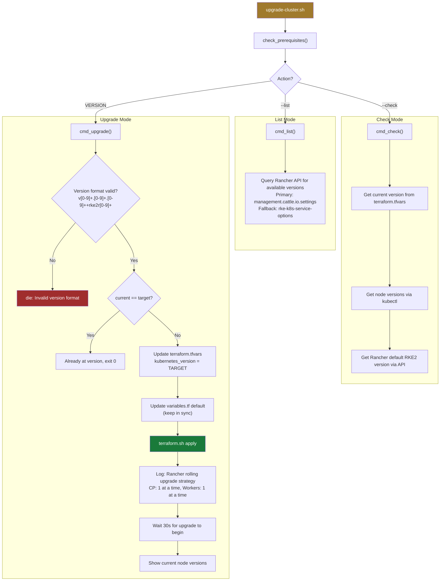

### 7.3 Version Validation

The upgrade script enforces strict version format validation:

- Pattern: `v<major>.<minor>.<patch>+rke2r<revision>`
- Example: `v1.34.2+rke2r3`
- Regex: `^v[0-9]+\.[0-9]+\.[0-9]+\+rke2r[0-9]+$`

The script updates both `terraform.tfvars` (runtime value) and `variables.tf` (default value) to keep them synchronized. Rancher then orchestrates the rolling upgrade using the strategy defined in `cluster.tf`.

---

## 8. setup-keycloak.sh Flow

### 8.1 CLI Arguments

| Argument | Description |
|----------|-------------|
| `--from N` | Resume from phase N (1-5) |
| `-h`, `--help` | Print usage and exit |

### 8.2 Connectivity Auto-Detection

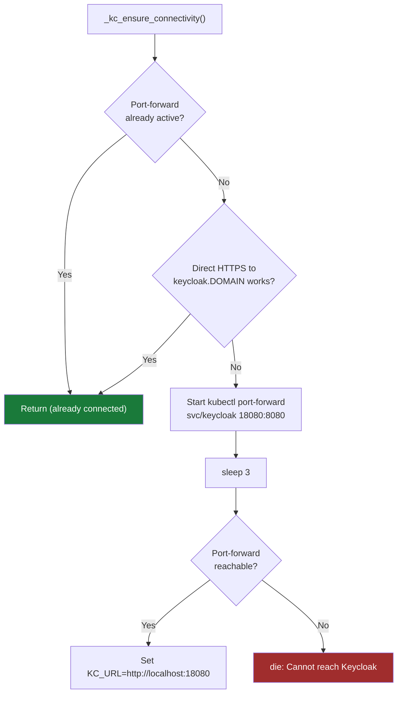

### 8.3 Complete Keycloak Setup Flow

```mermaid
flowchart TD
    START["main()"] --> PREREQ["check_prerequisites()"]
    PREREQ --> P1{"FROM_PHASE <= 1?"}

    P1 -->|Yes| PHASE1["Phase 1: Realm + Admin Setup"]

    subgraph "Phase 1: Realm + Users"
        PHASE1 --> CONN["Verify Keycloak connectivity<br/>(auto-fallback to port-forward)"]
        CONN --> AUTH["Authenticate via bootstrap<br/>client credentials"]
        AUTH --> REALM{"Realm<br/>exists?"}
        REALM -->|No| CREALM["Create KC_REALM realm<br/>Brute force protection,<br/>access token 5min, SSO 30min"]
        REALM -->|Yes| ADMIN
        CREALM --> ADMIN{"Admin user<br/>exists?"}
        ADMIN -->|No| CADMIN["Create admin user<br/>admin@DOMAIN, realm-admin role"]
        ADMIN -->|Yes| USER
        CADMIN --> USER{"General user<br/>exists?"}
        USER -->|No| CUSER["Create general user<br/>user@DOMAIN"]
        USER -->|Yes| TOTP
        CUSER --> TOTP["Configure TOTP 2FA policy<br/>SHA1, 6 digits, 30s period"]
    end

    TOTP --> P2{"FROM_PHASE <= 2?"}

    P2 -->|Yes| PHASE2["Phase 2: OIDC Client Creation"]

    subgraph "Phase 2: OIDC Clients"
        PHASE2 --> INIT["Initialize oidc-client-secrets.json = {}"]
        INIT --> C1["Create client: grafana<br/>redirect: grafana.DOMAIN/*"]
        C1 --> C2["Create client: argocd<br/>redirect: argo.DOMAIN/auth/callback"]
        C2 --> C3["Create client: harbor<br/>redirect: harbor.DOMAIN/c/oidc/callback"]
        C3 --> C4["Create client: vault<br/>redirect: vault.DOMAIN/ui/... + localhost:8250"]
        C4 --> C5["Create client: mattermost<br/>redirect: mattermost.DOMAIN/signup/openid/complete"]
        C5 --> C6["Create client: kasm<br/>redirect: kasm.DOMAIN/api/oidc_callback"]
        C6 --> C7["Create client: gitlab<br/>redirect: gitlab.DOMAIN/.../callback"]
        C7 --> C8["Create client: kubernetes<br/>(public — no secret, for kubelogin)"]
        C8 --> C9["Create per-service clients:<br/>prometheus-oidc, alertmanager-oidc,<br/>hubble-oidc, traefik-dashboard-oidc,<br/>rollouts-oidc, rancher"]
        C9 --> SAVE["Save all secrets to<br/>oidc-client-secrets.json"]
    end

    SAVE --> P3{"FROM_PHASE <= 3?"}

    P3 -->|Yes| PHASE3["Phase 3: Service Bindings"]

    subgraph "Phase 3: Service Bindings"
        PHASE3 --> GRAFANA["Bind Grafana<br/>kubectl set env deployment/grafana<br/>GF_AUTH_GENERIC_OAUTH_* vars"]
        GRAFANA --> ARGOCD["Bind ArgoCD<br/>Patch argocd-cm ConfigMap<br/>OIDC config + RBAC groups"]
        ARGOCD --> HARBOR["Bind Harbor<br/>curl PUT to Harbor API<br/>Mount Root CA volume"]
        HARBOR --> VAULTOIDC["Bind Vault<br/>Enable OIDC auth method<br/>Configure with Root CA"]
        VAULTOIDC --> MMOIDC["Bind Mattermost<br/>kubectl set env + Root CA mount"]
        MMOIDC --> KASM["Kasm: print manual instructions"]
        KASM --> GITLAB["GitLab: print manual instructions"]
    end

    GITLAB --> P4{"FROM_PHASE <= 4?"}

    P4 -->|Yes| PHASE4["Phase 4: Groups + Role Mapping"]

    subgraph "Phase 4: Groups"
        PHASE4 --> GROUPS["Create groups (8):<br/>platform-admins, harvester-admins,<br/>rancher-admins, infra-engineers,<br/>network-engineers, senior-developers,<br/>developers, viewers"]
        GROUPS --> ASSIGN1["Add admin -> platform-admins"]
        ASSIGN1 --> ASSIGN2["Add user -> developers"]
        ASSIGN2 --> MAPPERS["Add group-membership protocol mapper<br/>to all OIDC clients<br/>claim name: groups"]
    end

    MAPPERS --> P5{"FROM_PHASE <= 5?"}
    P5 -->|Yes| PHASE5["Phase 5: Validation + Summary"]

    subgraph "Phase 5: Validation"
        PHASE5 --> SUMMARY["Print setup summary:<br/>URLs, credentials, groups"]
        SUMMARY --> APPEND["Append Keycloak credentials<br/>to credentials.txt"]
        APPEND --> TIME["print_total_time()"]
    end

    style START fill:#2d7a9a,color:#fff
    style CREALM fill:#1a7a3a,color:#fff
    style SAVE fill:#6b4c9a,color:#fff
```

### 8.4 OIDC Client Creation Logic

The `kc_create_client` function handles both new creation and idempotent updates:

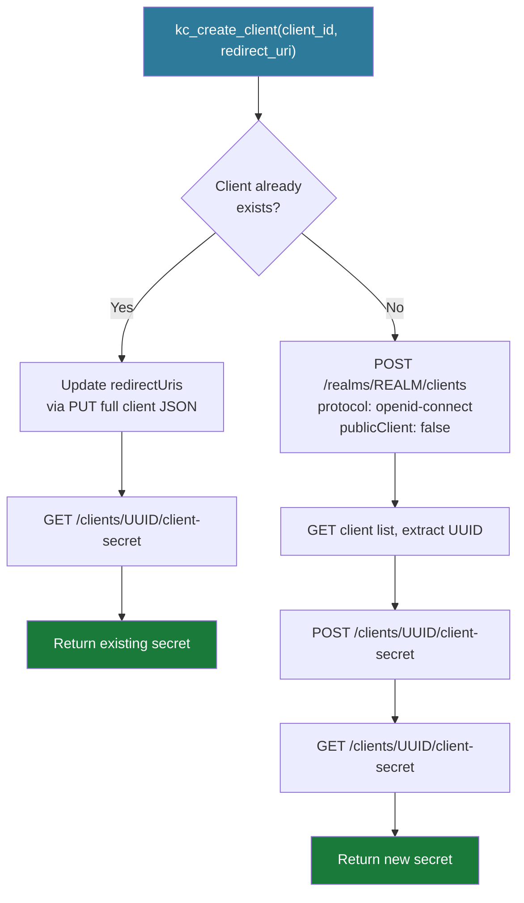

---

## 9. setup-cicd.sh Flow

### 9.1 CLI Arguments

| Argument | Description |
|----------|-------------|
| `--from N` | Resume from phase N (1-6) |
| `--dry-run` | Print actions without executing |
| `-h`, `--help` | Print usage and exit |

### 9.2 Complete CI/CD Setup Flow

```mermaid
flowchart TD
    START["main()"] --> PREREQ["check_prerequisites()"]
    PREREQ --> P1{"FROM_PHASE <= 1?"}

    P1 -->|Yes| PHASE1["Phase 1: GitHub <-> ArgoCD Connection"]

    subgraph "Phase 1: GitHub-ArgoCD"
        PHASE1 --> KEYGEN{"Deploy key<br/>exists?"}
        KEYGEN -->|No| GEN["ssh-keygen -t ed25519"]
        KEYGEN -->|Yes| SKIP["Skip generation"]

        GEN --> GHAPI["Add deploy key to GitHub repos<br/>via gh CLI"]
        SKIP --> GHAPI

        GHAPI --> HOSTKEY["ssh-keyscan github.com"]
        HOSTKEY --> REPOSECRET["Create ArgoCD credential template<br/>(SSH key + known hosts)"]
        REPOSECRET --> KNOWNHOSTS["Update argocd-ssh-known-hosts-cm"]
        KNOWNHOSTS --> VERIFY["Verify ArgoCD recognizes repos"]
    end

    VERIFY --> P2{"FROM_PHASE <= 2?"}

    P2 -->|Yes| PHASE2["Phase 2: App-of-Apps Bootstrap"]

    subgraph "Phase 2: Bootstrap"
        PHASE2 --> SVCREPOS["Create private GitHub repos<br/>(svc-REALM-NAME per service)"]
        SVCREPOS --> PUSHMANIFESTS["Push substituted manifests<br/>to each service repo"]
        PUSHMANIFESTS --> GENBOOTSTRAP["Generate ArgoCD Application<br/>manifests (app-of-apps)"]
        GENBOOTSTRAP --> SELFMGMT["Apply ArgoCD self-management<br/>(optional, if YAML exists)"]
    end

    SELFMGMT --> P3{"FROM_PHASE <= 3?"}

    P3 -->|Yes| PHASE3["Phase 3: Harbor CI Integration"]

    subgraph "Phase 3: Harbor CI"
        PHASE3 --> CIPUSH["Create Harbor robot: ci-push<br/>Push access to library, charts, dev"]
        CIPUSH --> CLPULL["Create Harbor robot: cluster-pull<br/>Pull access to all projects (*)"]
        CLPULL --> PULLSEC["Create imagePullSecret harbor-pull<br/>in default namespace"]
        PULLSEC --> SAVECREDS["Save robot credentials JSON"]
        SAVECREDS --> PRINTCI["Print GitLab CI/CD variables:<br/>HARBOR_REGISTRY, HARBOR_CI_USER,<br/>HARBOR_CI_PASSWORD, ARGOCD_SERVER"]
    end

    PRINTCI --> P4{"FROM_PHASE <= 4?"}

    P4 -->|Yes| PHASE4["Phase 4: Analysis Templates"]

    subgraph "Phase 4: Templates"
        PHASE4 --> AT1["ClusterAnalysisTemplate: success-rate<br/>HTTP 2xx/3xx ratio > 99%"]
        AT1 --> AT2["ClusterAnalysisTemplate: latency-p99<br/>P99 latency < threshold-ms"]
        AT2 --> AT3["ClusterAnalysisTemplate: error-rate<br/>HTTP 5xx ratio < threshold"]
        AT3 --> AT4["ClusterAnalysisTemplate: pod-restarts<br/>Container restarts == 0"]
    end

    AT4 --> P5{"FROM_PHASE <= 5?"}

    P5 -->|Yes| PHASE5["Phase 5: Sample Templates"]

    subgraph "Phase 5: Samples"
        PHASE5 --> S1["Generate: sample-rollout-bluegreen.yaml<br/>Blue/Green with pre/post analysis"]
        S1 --> S2["Generate: sample-rollout-canary.yaml<br/>Canary: 10% -> 30% -> 60% -> 100%"]
        S2 --> S3["Generate: sample-gitlab-ci.yml<br/>lint -> build -> test -> deploy"]
        S3 --> S4["Generate: sample-argocd-app.yaml<br/>ArgoCD Application for Rollout"]
    end

    S4 --> P6{"FROM_PHASE <= 6?"}
    P6 -->|Yes| PHASE6["Phase 6: Validation + Summary"]

    subgraph "Phase 6: Validation"
        PHASE6 --> STATUS["List ArgoCD applications"]
        STATUS --> TEMPLATES["List ClusterAnalysisTemplates"]
        TEMPLATES --> PIPEFLOW["Print pipeline flow diagram"]
        PIPEFLOW --> REMAINSTEPS["Print remaining manual steps"]
    end

    style START fill:#2d7a9a,color:#fff
    style ROOTAPP fill:#1a7a3a,color:#fff
    style CIPUSH fill:#6b4c9a,color:#fff
```

### 9.3 Analysis Template Summary

| Template | Metric | Interval | Count | Failure Limit | Success Condition |
|----------|--------|----------|-------|---------------|-------------------|
| `success-rate` | HTTP success ratio | 30s | 10 | 2 | `result > 0.99` |
| `latency-p99` | P99 latency (ms) | 30s | 10 | 2 | `result < threshold-ms` |
| `error-rate` | HTTP 5xx ratio | 30s | 10 | 1 | `result < threshold` |
| `pod-restarts` | Container restarts | 30s | 5 | 1 | `result == 0` |

### 9.4 CI/CD Pipeline Flow

```mermaid
sequenceDiagram
    participant Dev as Developer
    participant GL as GitLab CI
    participant Harbor as Harbor Registry
    participant Git as Git Repo
    participant Argo as ArgoCD
    participant Roll as Argo Rollouts
    participant Prom as Prometheus

    Dev->>GL: git push (main branch)
    GL->>GL: Lint (yamllint, helm lint)
    GL->>Harbor: Build + push image (kaniko)
    GL->>Git: Update image tag in manifests
    Argo->>Git: Detect change (auto-sync)
    Argo->>Roll: Apply Rollout CRD
    Roll->>Roll: Create preview ReplicaSet
    Roll->>Prom: Run pre-promotion analysis
    Prom-->>Roll: Metrics (success rate, latency)
    Roll->>Roll: Promote (switch traffic)
    Roll->>Prom: Run post-promotion analysis
    Prom-->>Roll: Metrics (error rate, restarts)
    Roll->>Roll: Scale down old ReplicaSet
    Argo-->>Dev: Sync status: Healthy
```

---

## 10. CI/CD Pipeline Architecture

This section covers the design-level CI/CD architecture: the monorepo strategy, GitLab CI pipeline structure, ArgoCD app-of-apps pattern details, Harbor CI integration, and Argo Rollouts configuration. For the `setup-cicd.sh` automation that bootstraps this infrastructure, see [Section 9](#9-setup-cicdsh-flow).

### 10.1 Monorepo Strategy

| Aspect | Monorepo (Recommended) | Multi-repo |
|--------|----------------------|------------|
| **Structure** | Single repo, GitLab CI with `rules:changes` per service | Separate repo per service |
| **ArgoCD** | App-of-apps pattern, single source | Multiple Application CRs |
| **Complexity** | Lower -- one CI config, shared lib | Higher -- duplicated CI, cross-repo deps |
| **Atomic changes** | Easy -- single MR touches infra + service | Hard -- coordinated MRs |
| **Best for** | Platform team (1-5 devs), infrastructure-heavy | Large teams, independent service ownership |

### 10.2 Repository Structure

```
rke2-cluster/
├── .gitlab-ci.yml              # Root CI config
├── cluster/                    # Terraform infra
├── operators/
│   ├── storage-autoscaler/     # Go operator source
│   └── node-labeler/           # Go operator source
├── services/
│   ├── argo/                   # ArgoCD + Rollouts
│   │   └── bootstrap/          # App-of-apps root Application
│   ├── harbor/                 # Harbor HA
│   ├── keycloak/               # Keycloak HA
│   ├── monitoring-stack/       # Prometheus, Grafana, Loki, Alloy
│   ├── vault/                  # Vault HA
│   ├── node-labeler/           # Node labeler deployment
│   ├── storage-autoscaler/     # Volume autoscaler deployment
│   └── ...                     # Other services
├── scripts/                    # Deployment automation
└── docs/                       # Documentation
```

### 10.3 GitLab CI Pipeline Structure

The proposed `.gitlab-ci.yml` uses `rules:changes` to run only the pipelines relevant to changed paths:

```yaml
stages:
  - lint
  - test
  - build
  - deploy

# ─── Operator Pipelines ────────────────────────────────────────
# Only build operators when their source changes

storage-autoscaler:test:
  stage: test
  rules:
    - changes: ["operators/storage-autoscaler/**"]
  script:
    - cd operators/storage-autoscaler && make test

storage-autoscaler:build:
  stage: build
  needs: ["storage-autoscaler:test"]
  rules:
    - changes: ["operators/storage-autoscaler/**"]
      if: $CI_COMMIT_BRANCH == "main"
  script:
    - cd operators/storage-autoscaler
    - make docker-buildx IMG=${HARBOR_REGISTRY}/library/storage-autoscaler:${CI_COMMIT_SHORT_SHA}

node-labeler:test:
  stage: test
  rules:
    - changes: ["operators/node-labeler/**"]
  script:
    - cd operators/node-labeler && make test

node-labeler:build:
  stage: build
  needs: ["node-labeler:test"]
  rules:
    - changes: ["operators/node-labeler/**"]
      if: $CI_COMMIT_BRANCH == "main"
  script:
    - cd operators/node-labeler
    - make docker-buildx IMG=${HARBOR_REGISTRY}/library/node-labeler:${CI_COMMIT_SHORT_SHA}

# ─── Service Validation ────────────────────────────────────────
# Validate Kubernetes manifests on any service change

validate:manifests:
  stage: lint
  rules:
    - changes: ["services/**"]
  script:
    - kubeconform -strict -kubernetes-version 1.34.0 services/

# ─── ArgoCD Sync ───────────────────────────────────────────────
# Trigger ArgoCD sync when services/ changes are merged to main

sync:services:
  stage: deploy
  rules:
    - changes: ["services/**"]
      if: $CI_COMMIT_BRANCH == "main"
  script:
    - argocd app sync root-app --prune --timeout 300
```

### 10.4 Pipeline per Service Type

| Service Type | CI Pipeline | CD Method |
|-------------|-------------|-----------|
| Go operators | Build -> Test -> Docker build -> Push to Harbor | ArgoCD detects image tag change in deployment manifest |
| Helm-configured (Harbor, ArgoCD, Vault) | Lint values -> Validate templates | ArgoCD syncs Kustomize/Helm overlay |
| Kustomize-only (monitoring, keycloak) | kubeconform validation | ArgoCD syncs Kustomize |
| Terraform (cluster/) | `terraform validate` + `terraform plan` | Manual apply (no auto-deploy for infra) |

### 10.5 ArgoCD App-of-Apps Pattern

#### Root Application

The root Application watches the `services/` directory and auto-creates child Applications for each subdirectory:

```yaml
apiVersion: argoproj.io/v1alpha1
kind: Application
metadata:
  name: root-app
  namespace: argocd
spec:
  project: default
  source:
    repoURL: git@gitlab.<DOMAIN>:platform/rke2-cluster.git
    targetRevision: main
    path: services/argo/bootstrap
  destination:
    server: https://kubernetes.default.svc
    namespace: argocd
  syncPolicy:
    automated:
      prune: true
      selfHeal: true
```

#### Child Applications

Each service directory has a corresponding Application resource in `services/argo/bootstrap/`:

```yaml
# services/argo/bootstrap/monitoring.yaml
apiVersion: argoproj.io/v1alpha1
kind: Application
metadata:
  name: monitoring
  namespace: argocd
spec:
  project: default
  source:
    repoURL: git@gitlab.<DOMAIN>:platform/rke2-cluster.git
    targetRevision: main
    path: services/monitoring-stack
  destination:
    server: https://kubernetes.default.svc
    namespace: monitoring
  syncPolicy:
    automated:
      prune: true
      selfHeal: true
```

#### Sync Policies

| Service | Sync Policy | Reason |
|---------|-------------|--------|
| Vault | Manual | Requires unseal after pod restart |
| Everything else | Auto-sync + prune + self-heal | Standard GitOps |

### 10.6 Harbor CI Integration

#### Robot Account Permissions

| Robot | Projects | Permissions |
|-------|----------|-------------|
| `robot$ci-push` | library, charts, dev | Push + Pull |
| `robot$ci-pull` | All proxy cache + CICD | Pull only |

#### Image Tagging Strategy

```
harbor.<DOMAIN>/library/<operator>:<git-sha>     # CI builds
harbor.<DOMAIN>/library/<operator>:v1.0.0         # Release tags
harbor.<DOMAIN>/library/<operator>:latest         # Main branch HEAD
```

#### Vulnerability Scanning

Harbor's built-in Trivy scanner auto-scans pushed images. The CI pipeline checks scan results before promotion:

```yaml
check:vulnerability:
  stage: deploy
  script:
    - |
      RESULT=$(curl -sf -u "robot:${HARBOR_TOKEN}" \
        "https://harbor.${DOMAIN}/api/v2.0/projects/library/repositories/${IMAGE}/artifacts/${TAG}?with_scan_overview=true")
      CRITICAL=$(echo "$RESULT" | jq '.scan_overview."application/vnd.security.vulnerability.report; version=1.1".summary.Critical // 0')
      [[ "$CRITICAL" -eq 0 ]] || { echo "Critical vulnerabilities found!"; exit 1; }
```

### 10.7 Argo Rollouts Configuration

#### Analysis Templates

Canary deployments use AnalysisTemplates to verify health before promotion:

```yaml
apiVersion: argoproj.io/v1alpha1
kind: AnalysisTemplate
metadata:
  name: success-rate
spec:
  metrics:
    - name: success-rate
      interval: 30s
      successCondition: result[0] > 0.95
      provider:
        prometheus:
          address: http://prometheus.monitoring.svc.cluster.local:9090
          query: |
            sum(rate(http_requests_total{status=~"2.."}[5m]))
            / sum(rate(http_requests_total[5m]))
```

#### Gateway API Traffic Router

Argo Rollouts uses the Gateway API plugin for traffic splitting during canary deployments:

```yaml
apiVersion: argoproj.io/v1alpha1
kind: Rollout
spec:
  strategy:
    canary:
      canaryService: app-canary
      stableService: app-stable
      trafficRouting:
        plugins:
          argoproj-labs/gatewayAPI:
            httpRoute: app-route
            namespace: app-ns
```

### 10.8 Implementation Status

- [x] ArgoCD deployed with HA configuration
- [x] Argo Rollouts with Gateway API plugin
- [x] App-of-apps pattern scaffolded in `services/argo/bootstrap/`
- [x] `setup-cicd.sh` script for GitLab integration
- [ ] GitLab deployed on cluster (external currently)
- [ ] `.gitlab-ci.yml` with per-service pipelines
- [ ] Harbor robot accounts for CI
- [ ] AnalysisTemplates for canary deployments
- [ ] Image tag automation (update deployment manifests on build)

---

## 11. Error Handling Patterns

### 11.1 Global Error Handling

All scripts use `set -euo pipefail` for strict error handling:

| Flag | Behavior |
|------|----------|
| `-e` | Exit immediately on any command failure |
| `-u` | Treat unset variables as errors |
| `-o pipefail` | Pipeline fails if any command in the pipe fails |

### 11.2 Retry Loops

| Location | What | Max Retries | Interval | Timeout | Behavior on Failure |
|----------|------|-------------|----------|---------|---------------------|
| Phase 0 | Node connectivity | 30 | 10s | 300s | Proceeds (may fail later) |
| Phase 1 | Rancher webhook endpoints | 30 | 10s | 300s | Warns and continues |
| Phase 2 | Vault status check | Inline | 0s | N/A | Captures exit code, parses JSON |
| Phase 4 | Harbor API readiness | 30 | 10s | 300s | Warns, skips project config |
| Keycloak | Token acquisition | 10 | 5s | 50s | `die` if all fail |
| Keycloak | All API calls | 3 (curl `--retry`) | 2s (`--retry-delay`) | 30s (`--max-time`) | Varies by caller |
| All | `wait_for_deployment` | N/A (kubectl wait) | N/A | configurable (default 300s) | Returns 1, caller decides |
| All | `wait_for_pods_ready` | timeout/5 | 5s | configurable (default 300s) | Returns 1 |
| All | `wait_for_pods_running` | timeout/5 | 5s | configurable (default 300s) | Returns 1 |
| All | `wait_for_clusterissuer` | timeout/5 | 5s | configurable (default 120s) | Returns 1 |
| All | `wait_for_cnpg_primary` | timeout/10 | 10s | configurable (default 300s) | Returns 1 |
| All | `wait_for_tls_secret` | timeout/5 | 5s | configurable (default 120s) | Always returns 0 (non-fatal) |

### 11.3 Fallback Strategies

| Component | Primary Method | Fallback | Trigger |
|-----------|---------------|----------|---------|
| Harvester kubeconfig | Rancher API `generateKubeconfig` | `~/.kube/config` context extraction | API call fails |
| Cloud provider kubeconfig | Harvester secrets pull | Rancher API generation | Secret not found |
| Rancher registries config | kubectl patch via K3K pod | Rancher Steve API PUT | K3K pod not found |
| Vault SA token | `kubectl create token --duration=8760h` | Legacy SA token secret | `create token` fails |
| Root CA extraction | Local file `root-ca.pem` | Vault `ca_chain` last cert | File not found |
| Keycloak connectivity | Direct HTTPS to `keycloak.DOMAIN` | `kubectl port-forward` to `localhost:18080` | HTTPS unreachable |

### 11.4 Non-Fatal vs Fatal Errors

The scripts distinguish between blocking failures (which call `die`) and non-blocking issues (which `log_warn` and continue):

**Fatal (die):**
- Missing required CLI tools
- `terraform.tfvars` missing or contains placeholders
- Vault initialized but `vault-init.json` not found
- Keycloak unreachable via both HTTPS and port-forward
- Generated kubeconfig is empty
- Cluster did not become Active within timeout
- Invalid upgrade version format

**Non-Fatal (warn and continue):**
- Storage Autoscaler not ready (image may not be built)
- Node Labeler not ready (image may not be built)
- Cluster Autoscaler pod not running
- Rancher CA cert not fetchable
- Keycloak has only 1/2 replicas
- Mattermost has no replicas (autoscaler may add capacity)
- HTTPS check returns non-200 (service still starting)
- TLS secret not yet created (cert-manager still issuing)
- Harbor robot creation fails (may already exist)
- GitLab deploy key addition fails

### 11.5 Cleanup Traps

| Script | Trap | Purpose |
|--------|------|---------|
| `setup-keycloak.sh` | `trap _kc_cleanup EXIT` | Kills `kubectl port-forward` background process on exit |

---

## 12. Resume Capability

### 12.1 How --from Works

Both `deploy-cluster.sh` and `setup-keycloak.sh` support `--from N` to resume from a specific phase. The logic uses sequential `[[ $FROM_PHASE -le N ]]` checks, meaning:

- `--from 0`: Runs all phases (default)
- `--from 3`: Skips phases 0, 1, 2; runs phases 3 through 11
- `--from 11`: Runs only phase 11

**Prerequisites for resume:**
- `--from N` (where N > 0) requires `kubeconfig-rke2.yaml` to exist
- The KUBECONFIG is set to the RKE2 cluster kubeconfig
- `.env` must exist with the same credentials used during initial deployment

### 12.2 Phase Idempotency Matrix

| Phase | Script | Idempotent? | Notes |
|-------|--------|:-----------:|-------|
| 0 | deploy | Partially | Terraform is idempotent. Orphan cleanup is idempotent. Kubeconfig regeneration overwrites. |
| 1 | deploy | Yes | `helm_install_if_needed` does upgrade-or-install. `kubectl apply` is idempotent. Node labeling uses `--overwrite`. |
| 2 | deploy | Yes | Vault init checks if already initialized. Raft join checks if already joined. PKI engine checks if already enabled. K8s auth checks if already enabled. |
| 3 | deploy | Yes | kustomize apply is idempotent. VolumeAutoscaler CRs use `kubectl apply`. |
| 4 | deploy | Yes | MinIO apply is idempotent. CNPG cluster is declarative. Harbor helm upgrade-or-install. Proxy cache project creation returns success if already exists. Registry config patches are idempotent (merge). |
| 5 | deploy | Yes | Helm upgrade-or-install. kubectl apply is idempotent. |
| 6 | deploy | Yes | CNPG cluster declarative. kustomize apply idempotent. |
| 7 | deploy | Yes | All sub-deployments use idempotent patterns. MinIO bucket `--ignore-existing`. Job deletes previous run before creating. |
| 8 | deploy | Yes | Informational only (prints DNS records). |
| 9 | deploy | Yes | Read-only validation checks. VolumeAutoscaler CRs applied idempotently. |
| 10 | deploy | Yes | Delegates to `setup-keycloak.sh` which is fully idempotent. |
| 11 | deploy | Yes | GitLab deployment. |
| 1 | keycloak | Yes | Realm creation checks if exists. User creation checks if exists. TOTP config is a PUT (overwrite). |
| 2 | keycloak | Yes | Client creation checks if exists and updates redirect URIs. Secret retrieval returns existing secret. |
| 3 | keycloak | Yes | `kubectl set env` is idempotent. ConfigMap patches use `--type merge`. OIDC auth enable tolerates "already enabled". |
| 4 | keycloak | Yes | Group creation checks if exists. Group membership PUT is idempotent. Protocol mapper creation tolerates "already exists". |
| 5 | keycloak | Yes | Read-only validation. Credential file append may duplicate entries. |
| 1-6 | cicd | Mostly | Deploy key ssh-keygen skips if exists. ArgoCD repo secret uses `kubectl apply`. Harbor robot creation may fail if exists (warned). |

### 12.3 Safe Resume Points

The following phases are recommended resume points after a failure:

| Resume From | When to Use |
|-------------|-------------|
| `--from 0` | Terraform failed or cluster not created |
| `--from 1` | Cluster exists but foundation not installed |
| `--from 2` | Foundation installed but Vault not configured |
| `--from 3` | Vault PKI working but monitoring not deployed |
| `--from 4` | Monitoring deployed but Harbor not installed |
| `--from 7` | ArgoCD + Keycloak deployed, remaining services needed |
| `--from 9` | All services deployed, need validation rerun |
| `--from 10` | Need to rerun Keycloak OIDC setup |
| `--from 11` | Need to rerun GitLab deployment |

---

## 13. Credential Generation

### 13.1 Password Generation Method

All auto-generated passwords use `openssl rand`:

```bash
gen_password() {
  local len="${1:-32}"
  openssl rand -base64 "$len" | tr -d '/+=' | head -c "$len"
}
```

- Source of randomness: OpenSSL CSPRNG (cryptographically secure)
- Encoding: Base64 with `+`, `/`, `=` characters stripped
- Result: Alphanumeric characters only
- Default length: 32 characters

### 13.2 Credential Lifecycle

```mermaid
flowchart TD
    START["deploy-cluster.sh starts"]
    START --> CHECK{".env exists?"}

    CHECK -->|Yes| LOAD["Load existing credentials<br/>source .env"]
    CHECK -->|No| GEN["Generate all credentials<br/>gen_password() for each"]

    LOAD --> FILLMISSING["Fill any missing values<br/>with gen_password()"]
    GEN --> SAVE

    FILLMISSING --> SAVE["Save to scripts/.env<br/>chmod 600"]

    SAVE --> SUBST["_subst_changeme() replaces<br/>CHANGEME_* tokens in manifests<br/>at kubectl apply time"]

    SUBST --> DEPLOY["Credentials flow to cluster<br/>via Kubernetes Secrets,<br/>Helm values, ConfigMaps"]

    DEPLOY --> CREDSFILE["write_credentials_file()<br/>cluster/credentials.txt"]

    DEPLOY --> HARVESTER["terraform.sh push-secrets<br/>Backup to Harvester"]

    subgraph "Generated Credentials"
        VAULT["vault-init.json<br/>5 unseal keys + root token<br/>(generated by Vault itself)"]
        ARGOCD["argocd-initial-admin-secret<br/>(generated by ArgoCD Helm chart)"]
        KC["Keycloak realm passwords<br/>(generated by setup-keycloak.sh<br/>openssl rand -base64 24)"]
        OIDC["OIDC client secrets<br/>(generated by Keycloak API)"]
    end

    style SAVE fill:#6b4c9a,color:#fff
    style CREDSFILE fill:#1a7a3a,color:#fff
```

### 13.3 Credential Storage Locations

| Credential | Storage Location | Format | Backup |
|------------|-----------------|--------|--------|
| Service passwords | `scripts/.env` | Shell variables | Manually preserved |
| Vault unseal keys + root token | `cluster/vault-init.json` | JSON | Harvester secrets |
| Root CA key | `cluster/root-ca-key.pem` | PEM | Harvester secrets |
| Root CA cert | `cluster/root-ca.pem` | PEM | Harvester secrets |
| RKE2 kubeconfig | `cluster/kubeconfig-rke2.yaml` | YAML | Regenerated from Rancher API |
| All credentials summary | `cluster/credentials.txt` | Plain text | Deleted on destroy |
| OIDC client secrets | `scripts/oidc-client-secrets.json` | JSON | Appended to credentials.txt |
| Harbor robot accounts | `scripts/harbor-robot-credentials.json` | JSON | Not backed up |
| ArgoCD deploy key | `scripts/.deploy-keys/` | SSH key pair | Not backed up |

---

## 14. External Tool Dependencies

### 14.1 Required CLI Tools

| Tool | Used By | Purpose | Check Method |
|------|---------|---------|--------------|
| `terraform` | deploy, destroy, upgrade | Infrastructure provisioning via Rancher/Harvester provider | `require_cmd` |
| `kubectl` | All scripts | Kubernetes API interaction, manifest application, port-forwarding | `require_cmd` |
| `helm` | deploy, cicd | Helm chart installation (cert-manager, Vault, Harbor, ArgoCD, etc.) | `require_cmd` |
| `jq` | All scripts | JSON parsing (Vault init, Rancher API, Keycloak API, Harbor API) | `require_cmd` |
| `openssl` | deploy, keycloak | Password generation (`rand`), Root CA generation (`genrsa`, `req`, `x509`) | `require_cmd` |
| `curl` | All scripts | HTTP API calls (Rancher, Keycloak, Harbor, GitLab) | `require_cmd` |
| `htpasswd` | deploy (via lib.sh) | Generate bcrypt password hash for basic-auth middleware | `require_cmd` (conditional) |
| `ssh-keygen` | cicd | Generate ed25519 deploy key for ArgoCD-GitLab connection | Implicit (part of OpenSSH) |
| `ssh-keyscan` | cicd | Fetch GitLab SSH host key for ArgoCD known_hosts | Implicit (part of OpenSSH) |
| `python3` | lib.sh | JSON string unescaping for cloud provider kubeconfig | Implicit fallback |
| `sed` | All scripts | CHANGEME token substitution, tfvars modification | Built-in |
| `awk` | All scripts | tfvars value extraction, text processing | Built-in |
| `base64` | lib.sh, keycloak | Kubernetes secret decoding, CA bundle encoding | Built-in |
| `tr` | lib.sh | Domain name transformation (dots to dashes) | Built-in |
| `wc` | All scripts | Counting pods, PVCs, nodes | Built-in |
| `grep` | All scripts | Pattern matching in output parsing | Built-in |

### 14.2 In-Cluster Tools (Created During Deployment)

| Tool | Image | Namespace | Purpose | Lifetime |
|------|-------|-----------|---------|----------|
| `curl-check` pod | `curlimages/curl` | `default` | HTTPS connectivity testing across phases | Created Phase 1, deleted Phase 9 |
| `image-pusher` pod | `gcr.io/go-containerregistry/crane:debug` | `default` | Push operator image tarballs to Harbor | Created and deleted in Phase 4.10 |
| `kasm-pg-ext` pod | `postgres:14-alpine` | `database` | Create `uuid-ossp` extension in Kasm DB | Ephemeral (`--rm`) |

### 14.3 Helm Chart Versions

| Chart | Repository | Version | Phase |
|-------|-----------|---------|-------|
| `jetstack/cert-manager` | `https://charts.jetstack.io` | `v1.19.3` | Phase 1 |
| `cnpg/cloudnative-pg` | `https://cloudnative-pg.github.io/charts` | `0.27.1` | Phase 1 |
| `autoscaler/cluster-autoscaler` | `https://kubernetes.github.io/autoscaler` | latest | Phase 1 |
| `ot-helm/redis-operator` | `https://ot-container-kit.github.io/helm-charts/` | latest | Phase 1 |
| `mariadb-operator/mariadb-operator` | `https://mariadb-operator.github.io/mariadb-operator` | latest | Phase 1 (conditional) |
| `hashicorp/vault` | `https://helm.releases.hashicorp.com` | `0.32.0` | Phase 2 |
| `goharbor/harbor` | `https://helm.goharbor.io` | `1.18.2` | Phase 4 |
| `oci://ghcr.io/argoproj/argo-helm/argo-cd` | OCI registry | latest | Phase 5 |
| `oci://ghcr.io/argoproj/argo-helm/argo-rollouts` | OCI registry | latest | Phase 5 |
| `kasmtech/kasm` | `https://helm.kasmweb.com/` | `1.1181.0` | Phase 7 |

### 14.4 Terraform Providers

The Terraform configuration (managed by `terraform.sh`) uses the following providers:

| Provider | Purpose |
|----------|---------|
| `harvester` | VM provisioning, DataVolume management on Harvester |
| `rancher2` | Cluster creation, machine pool management, cloud credentials |

### 14.5 Generated Files Reference

| File | Generated By | Consumed By | Git-Ignored |
|------|-------------|-------------|:-----------:|
| `scripts/.env` | `generate_or_load_env()` | All scripts | Yes |
| `cluster/kubeconfig-rke2.yaml` | `generate_kubeconfig()` | All scripts (KUBECONFIG) | Yes |
| `cluster/kubeconfig-harvester.yaml` | `ensure_harvester_kubeconfig()` | Phase 0 orphan cleanup, destroy | Yes |
| `cluster/harvester-cloud-provider-kubeconfig` | `ensure_cloud_provider_kubeconfig()` | Terraform | Yes |
| `cluster/vault-init.json` | `vault_init()` | Phase 2 unseal, Phase 9 validation, Keycloak OIDC | Yes |
| `cluster/root-ca.pem` | Phase 2 openssl | Root CA distribution, OIDC TLS | Yes |
| `cluster/root-ca-key.pem` | Phase 2 openssl | Intermediate CA signing (one-time) | Yes |
| `cluster/credentials.txt` | `write_credentials_file()` | Human reference | Yes |
| `scripts/oidc-client-secrets.json` | `setup-keycloak.sh` Phase 2 | Phase 3 service bindings | Yes |
| `scripts/harbor-robot-credentials.json` | `setup-cicd.sh` Phase 3 | GitLab CI/CD variable setup | Yes |
| `scripts/.deploy-keys/` | `setup-cicd.sh` Phase 1 | ArgoCD repo secret | Yes |
| `scripts/samples/*.yaml` | `setup-cicd.sh` Phase 5 | Developer reference | No |

---

## Appendix A: Quick Reference -- All Phases at a Glance

```
deploy-cluster.sh
  Phase 0:  Terraform Apply + Cluster Wait + Kubeconfig
  Phase 1:  Traefik config, cert-manager, CNPG, Cluster Autoscaler, Redis Operator, Node Labeler, MariaDB Operator*
  Phase 2:  Vault HA + PKI (Root CA, Intermediate CA, ClusterIssuer)
  Phase 3:  Prometheus, Grafana, Loki, Alloy, Alertmanager, Storage Autoscaler
  Phase 4:  MinIO, CNPG, Valkey Sentinel, Harbor, Proxy Cache, Registry Mirrors
  Phase 5:  ArgoCD HA + Argo Rollouts + Argo Workflows + Argo Events
  Phase 5b: DHI Builder (Harbor dhi/ project, BuildKit, Argo Events/Workflows pipeline) [DEPLOY_DHI_BUILDER=true]
  Phase 6:  CNPG, Keycloak HA + Infinispan
  Phase 7:  Mattermost, Kasm, Uptime Kuma, LibreNMS
  Phase 8:  DNS Records (informational)
  Phase 9:  Validation + Credentials File
  Phase 10: Keycloak OIDC Setup (delegates to setup-keycloak.sh)
  Phase 11: GitLab

destroy-cluster.sh
  Phase 0:  Pre-flight + Confirmation
  Phase 1:  K8S Workload Cleanup (GitLab Helm, Redis CRs, CNPG, namespace)
  Phase 2:  Terraform Destroy
  Phase 3:  Harvester Orphan Cleanup (VMs, VMIs, DVs, PVCs)
  Phase 4:  Local File Cleanup

upgrade-cluster.sh
  Modes:    --check | --list | VERSION

setup-keycloak.sh
  Phase 1:  Realm + Admin/User Creation + TOTP
  Phase 2:  OIDC Client Creation (15 clients, including identity-portal)
  Phase 3:  Service Bindings (Grafana, ArgoCD, Harbor, Vault, Mattermost, Identity Portal, Kasm*, GitLab*)
  Phase 4:  Groups + Role Mapping (8 groups: platform-admins, harvester-admins, rancher-admins, infra-engineers, network-engineers, senior-developers, developers, viewers)
  Phase 5:  Validation + Summary

setup-cicd.sh
  Phase 1:  GitHub <-> ArgoCD Connection (SSH deploy key)
  Phase 2:  App-of-Apps Bootstrap (create service repos, generate manifests)
  Phase 3:  Harbor CI Robot Accounts
  Phase 4:  Argo Rollouts Analysis Templates
  Phase 5:  Sample Rollout + CI Templates
  Phase 6:  Validation + Summary
```
