# Flow Charts and Decision Trees

Comprehensive visual reference for all deployment, operational, and controller flows in the RKE2 cluster platform. Every diagram is derived from the actual source code.

---

## Table of Contents

- [Deployment Flows](#deployment-flows)
  1. [Complete Cluster Deployment](#1-complete-cluster-deployment)
  2. [Terraform Apply Flow](#2-terraform-apply-flow)
  3. [Terraform Destroy Flow](#3-terraform-destroy-flow)
  4. [Golden Image Build Flow](#4-golden-image-build-flow)
  5. [Cluster Destruction Flow](#5-cluster-destruction-flow)
- [Service Setup Flows](#service-setup-flows)
  6. [Vault PKI Bootstrap](#6-vault-pki-bootstrap)
  7. [Harbor Deployment](#7-harbor-deployment)
  8. [Keycloak OIDC Setup](#8-keycloak-oidc-setup)
  9. [CI/CD Setup](#9-cicd-setup)
- [Operational Flows](#operational-flows)
  10. [Cluster Upgrade Flow](#10-cluster-upgrade-flow)
  11. [Vault Unseal Procedure](#11-vault-unseal-procedure)
  12. [Certificate Renewal Flow](#12-certificate-renewal-flow)
  13. [Node Scaling Flow](#13-node-scaling-flow)
- [Controller Logic Flows](#controller-logic-flows)
  14. [Storage Autoscaler Reconciliation Loop](#14-storage-autoscaler-reconciliation-loop)
  15. [Node Labeler Reconciliation Loop](#15-node-labeler-reconciliation-loop)
- [Decision Trees](#decision-trees)
  16. [Ingress Routing Decision](#16-ingress-routing-decision)
  17. [Database Backend Selection](#17-database-backend-selection)
  18. [Worker Pool Selection](#18-worker-pool-selection)
  19. [Troubleshooting Triage](#19-troubleshooting-triage)
  20. [Image Mode Selection](#20-image-mode-selection)
- [Network Flows](#network-flows)
  21. [External Traffic Path](#21-external-traffic-path)
  22. [TLS Certificate Issuance](#22-tls-certificate-issuance)
  23. [Monitoring Data Flow](#23-monitoring-data-flow)

---

## Deployment Flows

### 1. Complete Cluster Deployment

The full `deploy-cluster.sh` pipeline across all 12 phases (0 through 11). Each phase is idempotent and supports resumption via `--from N`.

```mermaid
flowchart TD
    Start([deploy-cluster.sh]) --> ParseArgs{Parse CLI Args}
    ParseArgs -->|--skip-tf| SkipTF[Set SKIP_TERRAFORM=true]
    ParseArgs -->|--from N| SetFrom[Set FROM_PHASE=N]
    ParseArgs -->|default| FullRun[FROM_PHASE=0]
    SkipTF --> PreFlight
    SetFrom --> PreFlight
    FullRun --> PreFlight

    PreFlight[Pre-Flight Checks] --> CheckPrereqs[check_prerequisites<br/>terraform, kubectl, helm, jq, openssl, curl]
    CheckPrereqs --> LoadEnv[generate_or_load_env<br/>Load or generate .env credentials]

    LoadEnv --> P0{Phase 0?}
    P0 -->|FROM_PHASE <= 0<br/>and not --skip-tf| Phase0

    subgraph Phase0 [Phase 0: Terraform]
        P0_Start[check_tfvars + ensure_external_files] --> P0_Cleanup[Clean orphaned Harvester resources<br/>VMs, VMIs, DataVolumes, PVCs]
        P0_Cleanup --> P0_Push[terraform.sh push-secrets]
        P0_Push --> P0_Apply[terraform.sh apply<br/>pull-secrets, init, plan, apply, push-secrets]
        P0_Apply --> P0_Wait[wait_for_cluster_active<br/>Poll Rancher API up to 30min]
        P0_Wait --> P0_Kubeconfig[generate_kubeconfig via Rancher API]
        P0_Kubeconfig --> P0_Verify[Verify nodes reachable]
    end

    Phase0 --> P1
    P0 -->|skip| P1

    P1{Phase 1?} -->|FROM_PHASE <= 1| Phase1

    subgraph Phase1 [Phase 1: Cluster Foundation]
        P1_Webhook[Wait for Rancher webhook endpoints] --> P1_Labels[label_unlabeled_nodes]
        P1_Labels --> P1_Traefik[Traefik HelmChartConfig<br/>LoadBalancer + Gateway API + timeouts]
        P1_Traefik --> P1_Curl[Deploy curl-check pod]
        P1_Curl --> P1_CertMgr[Helm install cert-manager v1.19.3<br/>+ Gateway API support]
        P1_CertMgr --> P1_CNPG[Helm install CNPG Operator v0.27.1]
        P1_CNPG --> P1_Autoscaler[Helm install Cluster Autoscaler<br/>Rancher cloud provider + CA trust]
        P1_Autoscaler --> P1_Redis[Helm install OpsTree Redis Operator]
        P1_Redis --> P1_NodeLabeler[Deploy Node Labeler operator]
        P1_NodeLabeler --> P1_MariaDB{LibreNMS<br/>enabled?}
        P1_MariaDB -->|yes| P1_MariaDBInstall[Helm install MariaDB Operator]
        P1_MariaDB -->|no| P1_Done[Label unlabeled nodes again]
        P1_MariaDBInstall --> P1_Done
    end

    Phase1 --> P2
    P1 -->|skip| P2

    P2{Phase 2?} -->|FROM_PHASE <= 2| Phase2

    subgraph Phase2 [Phase 2: Vault + PKI]
        P2_Helm[Helm install Vault HA 3 replicas] --> P2_Init{Already<br/>initialized?}
        P2_Init -->|no| P2_DoInit[vault operator init<br/>5 shares, threshold 3]
        P2_DoInit --> P2_Unseal0[Unseal vault-0<br/>3 of 5 keys]
        P2_Init -->|yes| P2_PullInit[Pull vault-init.json<br/>from Harvester]
        P2_PullInit --> P2_Unseal0
        P2_Unseal0 --> P2_Raft[Raft join + unseal vault-1, vault-2]
        P2_Raft --> P2_RootCA[Generate Root CA<br/>15yr, 4096-bit RSA, local key]
        P2_RootCA --> P2_IntCA[Generate Intermediate CA<br/>CSR in Vault, signed locally by Root CA]
        P2_IntCA --> P2_K8sAuth[Configure K8s auth<br/>for cert-manager]
        P2_K8sAuth --> P2_Push[Push vault-init.json to Harvester]
        P2_Push --> P2_Issuer[Apply ClusterIssuer vault-issuer<br/>+ RBAC for cert-manager]
        P2_Issuer --> P2_Gateway[Apply Vault Gateway + HTTPRoute]
        P2_Gateway --> P2_RootDist[Distribute Root CA ConfigMap<br/>to service namespaces]
    end

    Phase2 --> P3
    P2 -->|skip| P3

    P3{Phase 3?} -->|FROM_PHASE <= 3| Phase3

    subgraph Phase3 [Phase 3: Monitoring Stack]
        P3_Apply[kustomize apply monitoring-stack<br/>Prometheus, Grafana, Loki, Alloy, Alertmanager<br/>+ TLSStore default cert + Traefik dashboard] --> P3_Wait[Wait for Grafana, Prometheus, Loki]
        P3_Wait --> P3_TLS[Verify TLS secrets<br/>grafana, prometheus, alertmanager, hubble]
        P3_TLS --> P3_HTTPS[HTTPS connectivity checks]
        P3_HTTPS --> P3_StorageAuto[Deploy Storage Autoscaler operator]
        P3_StorageAuto --> P3_VACRs[Apply VolumeAutoscaler CRs<br/>for existing namespaces]
    end

    Phase3 --> P4
    P3 -->|skip| P4

    P4{Phase 4?} -->|FROM_PHASE <= 4| Phase4

    subgraph Phase4 [Phase 4: Harbor]
        P4_NS[Create harbor, minio, database namespaces] --> P4_MinIO[Deploy MinIO + create buckets]
        P4_MinIO --> P4_PG[Deploy CNPG harbor-pg cluster]
        P4_PG --> P4_Redis[Deploy Valkey Sentinel via OpsTree]
        P4_Redis --> P4_Helm[Helm install Harbor v1.18.2]
        P4_Helm --> P4_GW[Apply Gateway + HTTPRoute + HPAs]
        P4_GW --> P4_Proxy[Configure proxy cache projects<br/>dockerhub, quay, ghcr, gcr, k8s, elastic]
        P4_Proxy --> P4_CA[Distribute Root CA + configure Rancher registries]
        P4_CA --> P4_Images[Push operator images to Harbor<br/>via crane pod]
    end

    Phase4 --> P5
    P4 -->|skip| P5

    P5{Phase 5?} -->|FROM_PHASE <= 5| Phase5

    subgraph Phase5 [Phase 5: ArgoCD + Argo Rollouts]
        P5_Argo[Helm install ArgoCD HA] --> P5_ArgoGW[Apply ArgoCD Gateway + HTTPRoute]
        P5_ArgoGW --> P5_Rollouts[Helm install Argo Rollouts]
        P5_Rollouts --> P5_RolloutsGW[Apply Rollouts Gateway + HTTPRoute]
        P5_RolloutsGW --> P5_HTTPS[HTTPS checks: argo, rollouts]
    end

    Phase5 --> P6
    P5 -->|skip| P6

    P6{Phase 6?} -->|FROM_PHASE <= 6| Phase6

    subgraph Phase6 [Phase 6: Keycloak]
        P6_PG[Deploy CNPG keycloak-pg] --> P6_App[Deploy Keycloak HA stack<br/>kustomize with substitution]
        P6_App --> P6_TLS[Wait for TLS + HTTPS check]
        P6_TLS --> P6_Cluster[Verify Infinispan cluster formation]
    end

    Phase6 --> P7
    P6 -->|skip| P7

    P7{Phase 7?} -->|FROM_PHASE <= 7| Phase7

    subgraph Phase7 [Phase 7: Remaining Services]
        P7_MMPG[Deploy CNPG mattermost-pg] --> P7_MM[Deploy Mattermost + MinIO bucket]
        P7_MM --> P7_KasmPG[Deploy CNPG kasm-pg + uuid-ossp ext]
        P7_KasmPG --> P7_Kasm[Helm install Kasm Workspaces]
        P7_Kasm --> P7_Uptime{Uptime Kuma<br/>enabled?}
        P7_Uptime -->|yes| P7_UptimeDeploy[Deploy Uptime Kuma]
        P7_Uptime -->|no| P7_Libre{LibreNMS<br/>enabled?}
        P7_UptimeDeploy --> P7_Libre
        P7_Libre -->|yes| P7_LibreDeploy[Deploy LibreNMS<br/>MariaDB + Redis + App]
        P7_Libre -->|no| P7_Done[Done]
        P7_LibreDeploy --> P7_Done
    end

    Phase7 --> P8
    P7 -->|skip| P8

    P8{Phase 8?} -->|FROM_PHASE <= 8| Phase8[Phase 8: DNS Records<br/>Print A records for all services<br/>pointing to Traefik LB IP]

    Phase8 --> P9
    P8 -->|skip| P9

    P9{Phase 9?} -->|FROM_PHASE <= 9| Phase9

    subgraph Phase9 [Phase 9: Validation]
        P9_RBAC[Apply RBAC manifests<br/>Keycloak OIDC groups to K8s RBAC] --> P9_VA[Re-apply all VolumeAutoscaler CRs]
        P9_VA --> P9_Nodes[Check all nodes Ready]
        P9_Nodes --> P9_Vault[Check Vault unsealed x3]
        P9_Vault --> P9_Issuer[Check ClusterIssuer Ready]
        P9_Issuer --> P9_TLS[Check all TLS secrets exist]
        P9_TLS --> P9_HTTPS[HTTPS checks for all services]
        P9_HTTPS --> P9_Pods[Check critical deployments have replicas]
        P9_Pods --> P9_Summary[Print deployment summary + credentials]
        P9_Summary --> P9_Creds[Write credentials.txt]
    end

    Phase9 --> P10
    P9 -->|skip| P10

    P10{Phase 10?} -->|FROM_PHASE <= 10| Phase10[Phase 10: Keycloak OIDC Setup<br/>Runs setup-keycloak.sh<br/>Realm, users, TOTP, clients, bindings, groups]

    Phase10 --> P11
    P10 -->|skip| P11

    P11{Phase 11?} -->|FROM_PHASE <= 11| Phase11[Phase 11: GitLab]

    Phase11 --> Done([Deployment Complete])
```

---

### 2. Terraform Apply Flow

The `terraform.sh apply` command workflow, including secret synchronization with Harvester via Kubernetes backend.

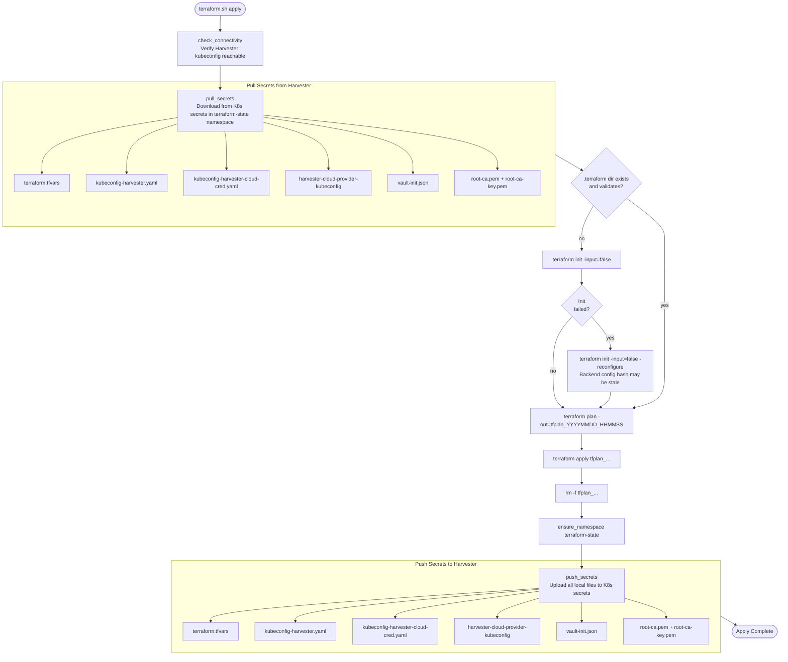
```mermaid
flowchart TD
    Start([terraform.sh apply]) --> Connectivity[check_connectivity<br/>Verify Harvester kubeconfig reachable]
    Connectivity --> Pull[pull_secrets<br/>Download from K8s secrets in terraform-state namespace]

    subgraph PullSecrets [Pull Secrets from Harvester]
        Pull --> PullTFVars[terraform.tfvars]
        Pull --> PullHarvKC[kubeconfig-harvester.yaml]
        Pull --> PullCloudCred[kubeconfig-harvester-cloud-cred.yaml]
        Pull --> PullCloudProvider[harvester-cloud-provider-kubeconfig]
        Pull --> PullVaultInit[vault-init.json]
        Pull --> PullRootCA[root-ca.pem + root-ca-key.pem]
    end

    PullSecrets --> CheckInit{.terraform dir exists<br/>and validates?}
    CheckInit -->|no| Init[terraform init -input=false]
    Init --> InitFail{Init<br/>failed?}
    InitFail -->|yes| Reconfigure[terraform init -input=false -reconfigure<br/>Backend config hash may be stale]
    InitFail -->|no| Plan
    Reconfigure --> Plan
    CheckInit -->|yes| Plan

    Plan[terraform plan -out=tfplan_YYYYMMDD_HHMMSS] --> Apply[terraform apply tfplan_...]
    Apply --> Cleanup[rm -f tfplan_...]
    Cleanup --> EnsureNS[ensure_namespace terraform-state]
    EnsureNS --> Push[push_secrets<br/>Upload all local files to K8s secrets]

    subgraph PushSecrets [Push Secrets to Harvester]
        Push --> PushTFVars[terraform.tfvars]
        Push --> PushHarvKC[kubeconfig-harvester.yaml]
        Push --> PushCloudCred[kubeconfig-harvester-cloud-cred.yaml]
        Push --> PushCloudProvider[harvester-cloud-provider-kubeconfig]
        Push --> PushVaultInit[vault-init.json]
        Push --> PushRootCA[root-ca.pem + root-ca-key.pem]
    end

    PushSecrets --> Done([Apply Complete])
```

---

### 3. Terraform Destroy Flow

The `terraform.sh destroy` command workflow, including post-destroy Harvester orphan cleanup.

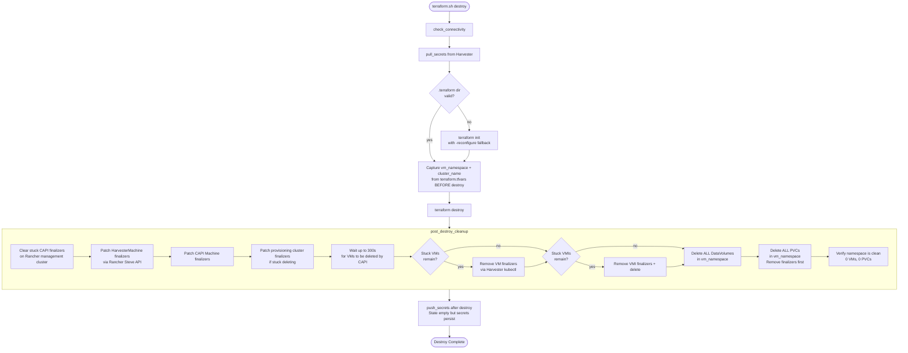
```mermaid
flowchart TD
    Start([terraform.sh destroy]) --> Connectivity[check_connectivity]
    Connectivity --> Pull[pull_secrets from Harvester]
    Pull --> CheckInit{.terraform dir<br/>valid?}
    CheckInit -->|no| Init[terraform init<br/>with -reconfigure fallback]
    CheckInit -->|yes| Capture
    Init --> Capture

    Capture[Capture vm_namespace + cluster_name<br/>from terraform.tfvars BEFORE destroy] --> Destroy[terraform destroy]

    Destroy --> PostCleanup

    subgraph PostCleanup [post_destroy_cleanup]
        PDC_CAPI[Clear stuck CAPI finalizers<br/>on Rancher management cluster] --> PDC_HM[Patch HarvesterMachine finalizers<br/>via Rancher Steve API]
        PDC_HM --> PDC_Machines[Patch CAPI Machine finalizers]
        PDC_Machines --> PDC_Cluster[Patch provisioning cluster finalizers<br/>if stuck deleting]
        PDC_Cluster --> PDC_Wait[Wait up to 300s<br/>for VMs to be deleted by CAPI]
        PDC_Wait --> PDC_VMs{Stuck VMs<br/>remain?}
        PDC_VMs -->|yes| PDC_PatchVMs[Remove VM finalizers<br/>via Harvester kubectl]
        PDC_VMs -->|no| PDC_VMIs
        PDC_PatchVMs --> PDC_VMIs{Stuck VMIs<br/>remain?}
        PDC_VMIs -->|yes| PDC_PatchVMIs[Remove VMI finalizers + delete]
        PDC_VMIs -->|no| PDC_DVs
        PDC_PatchVMIs --> PDC_DVs[Delete ALL DataVolumes<br/>in vm_namespace]
        PDC_DVs --> PDC_PVCs[Delete ALL PVCs<br/>in vm_namespace<br/>Remove finalizers first]
        PDC_PVCs --> PDC_Verify[Verify namespace is clean<br/>0 VMs, 0 PVCs]
    end

    PostCleanup --> PushAfter[push_secrets after destroy<br/>State empty but secrets persist]
    PushAfter --> Done([Destroy Complete])
```

---

### 4. Golden Image Build Flow

The `golden-image/build.sh build` lifecycle: spin up a utility VM on Harvester, bake a Rocky 9 qcow2 with virt-customize, import the image, then clean up.

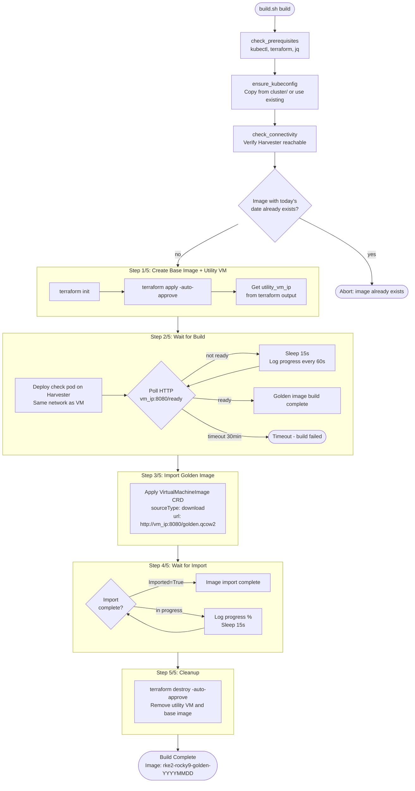
```mermaid
flowchart TD
    Start([build.sh build]) --> PreFlight[check_prerequisites<br/>kubectl, terraform, jq]
    PreFlight --> Kubeconfig[ensure_kubeconfig<br/>Copy from cluster/ or use existing]
    Kubeconfig --> Connect[check_connectivity<br/>Verify Harvester reachable]
    Connect --> CheckExist{Image with today's<br/>date already exists?}
    CheckExist -->|yes| Abort([Abort: image already exists])
    CheckExist -->|no| Step1

    subgraph Step1 [Step 1/5: Create Base Image + Utility VM]
        S1_Init[terraform init] --> S1_Apply[terraform apply -auto-approve]
        S1_Apply --> S1_IP[Get utility_vm_ip<br/>from terraform output]
    end

    Step1 --> Step2

    subgraph Step2 [Step 2/5: Wait for Build]
        S2_Pod[Deploy check pod on Harvester<br/>Same network as VM] --> S2_Poll{Poll HTTP<br/>vm_ip:8080/ready}
        S2_Poll -->|not ready| S2_Wait[Sleep 15s<br/>Log progress every 60s]
        S2_Wait --> S2_Poll
        S2_Poll -->|ready| S2_Done[Golden image build complete]
        S2_Poll -->|timeout 30min| S2_Fail([Timeout - build failed])
    end

    Step2 --> Step3

    subgraph Step3 [Step 3/5: Import Golden Image]
        S3_Apply[Apply VirtualMachineImage CRD<br/>sourceType: download<br/>url: http://vm_ip:8080/golden.qcow2]
    end

    Step3 --> Step4

    subgraph Step4 [Step 4/5: Wait for Import]
        S4_Poll{Import<br/>complete?} -->|Imported=True| S4_Done[Image import complete]
        S4_Poll -->|in progress| S4_Wait[Log progress %<br/>Sleep 15s]
        S4_Wait --> S4_Poll
    end

    Step4 --> Step5

    subgraph Step5 [Step 5/5: Cleanup]
        S5_Destroy[terraform destroy -auto-approve<br/>Remove utility VM and base image]
    end

    Step5 --> Summary([Build Complete<br/>Image: rke2-rocky9-golden-YYYYMMDD])
```

---

### 5. Cluster Destruction Flow

The full `destroy-cluster.sh` pipeline with confirmation, Terraform destroy, Harvester cleanup, and local file removal.

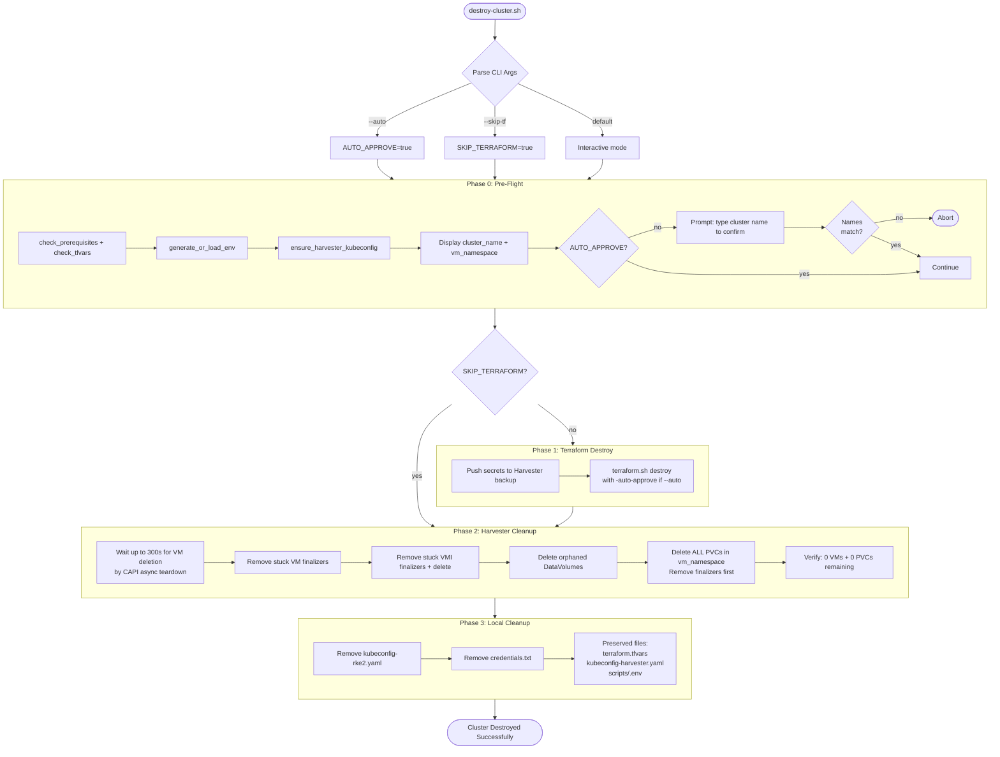
```mermaid
flowchart TD
    Start([destroy-cluster.sh]) --> ParseArgs{Parse CLI Args}
    ParseArgs -->|--auto| AutoApprove[AUTO_APPROVE=true]
    ParseArgs -->|--skip-tf| SkipTF[SKIP_TERRAFORM=true]
    ParseArgs -->|default| Interactive[Interactive mode]
    AutoApprove --> Phase0
    SkipTF --> Phase0
    Interactive --> Phase0

    subgraph Phase0 [Phase 0: Pre-Flight]
        PF_Check[check_prerequisites + check_tfvars] --> PF_Env[generate_or_load_env]
        PF_Env --> PF_Harv[ensure_harvester_kubeconfig]
        PF_Harv --> PF_Info[Display cluster_name + vm_namespace]
        PF_Info --> PF_Confirm{AUTO_APPROVE?}
        PF_Confirm -->|no| PF_Prompt[Prompt: type cluster name to confirm]
        PF_Prompt --> PF_Match{Names<br/>match?}
        PF_Match -->|no| PF_Abort([Abort])
        PF_Match -->|yes| PF_Done[Continue]
        PF_Confirm -->|yes| PF_Done
    end

    Phase0 --> TFCheck{SKIP_TERRAFORM?}
    TFCheck -->|no| Phase1

    subgraph Phase1 [Phase 1: Terraform Destroy]
        TF_Push[Push secrets to Harvester backup] --> TF_Destroy[terraform.sh destroy<br/>with -auto-approve if --auto]
    end

    TFCheck -->|yes| Phase2
    Phase1 --> Phase2

    subgraph Phase2 [Phase 2: Harvester Cleanup]
        HC_Wait[Wait up to 300s for VM deletion<br/>by CAPI async teardown] --> HC_VMs[Remove stuck VM finalizers]
        HC_VMs --> HC_VMIs[Remove stuck VMI finalizers + delete]
        HC_VMIs --> HC_DVs[Delete orphaned DataVolumes]
        HC_DVs --> HC_PVCs[Delete ALL PVCs in vm_namespace<br/>Remove finalizers first]
        HC_PVCs --> HC_Verify[Verify: 0 VMs + 0 PVCs remaining]
    end

    Phase2 --> Phase3

    subgraph Phase3 [Phase 3: Local Cleanup]
        LC_KC[Remove kubeconfig-rke2.yaml] --> LC_Creds[Remove credentials.txt]
        LC_Creds --> LC_Preserved[Preserved files:<br/>terraform.tfvars<br/>kubeconfig-harvester.yaml<br/>scripts/.env]
    end

    Phase3 --> Done([Cluster Destroyed Successfully])
```

---

## Service Setup Flows

### 6. Vault PKI Bootstrap

The complete Vault initialization, Raft cluster formation, and PKI hierarchy setup from Phase 2 of `deploy-cluster.sh`.

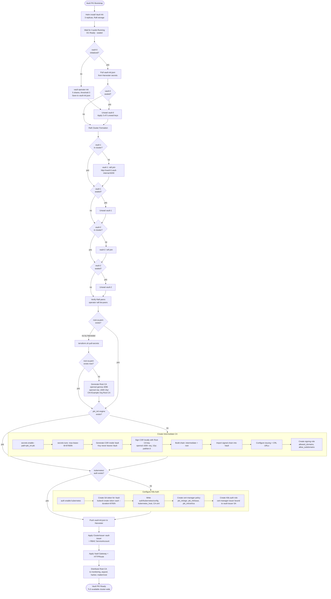
```mermaid
flowchart TD
    Start([Vault PKI Bootstrap]) --> Install[Helm install Vault HA<br/>3 replicas, Raft storage]
    Install --> WaitPods[Wait for 3 pods Running<br/>0/1 Ready - sealed]

    WaitPods --> CheckInit{vault-0<br/>initialized?}

    CheckInit -->|no| Init[vault operator init<br/>5 shares, threshold 3<br/>Save to vault-init.json]
    Init --> Unseal0

    CheckInit -->|yes| PullInit[Pull vault-init.json<br/>from Harvester secrets]
    PullInit --> CheckSealed{vault-0<br/>sealed?}
    CheckSealed -->|no| Raft
    CheckSealed -->|yes| Unseal0

    Unseal0[Unseal vault-0<br/>Apply 3 of 5 unseal keys] --> Raft

    Raft[Raft Cluster Formation] --> Join1{vault-1<br/>in cluster?}
    Join1 -->|no| RaftJoin1[vault-1: raft join<br/>http://vault-0.vault-internal:8200]
    Join1 -->|yes| Seal1
    RaftJoin1 --> Seal1{vault-1<br/>sealed?}
    Seal1 -->|yes| Unseal1[Unseal vault-1]
    Seal1 -->|no| Join2
    Unseal1 --> Join2{vault-2<br/>in cluster?}
    Join2 -->|no| RaftJoin2[vault-2: raft join]
    Join2 -->|yes| Seal2
    RaftJoin2 --> Seal2{vault-2<br/>sealed?}
    Seal2 -->|yes| Unseal2[Unseal vault-2]
    Seal2 -->|no| VerifyRaft
    Unseal2 --> VerifyRaft[Verify Raft peers<br/>operator raft list-peers]

    VerifyRaft --> RootCA{root-ca.pem<br/>exists?}
    RootCA -->|no try Harvester| PullCA[terraform.sh pull-secrets]
    PullCA --> RootCA2{root-ca.pem<br/>exists now?}
    RootCA2 -->|no| GenCA[Generate Root CA<br/>openssl genrsa 4096<br/>openssl req -x509 15yr<br/>CN=Example Org Root CA]
    RootCA2 -->|yes| IntCA
    GenCA --> IntCA
    RootCA -->|yes| IntCA

    IntCA{pki_int/ engine<br/>exists?} -->|no| CreateInt
    IntCA -->|yes| K8sAuth

    subgraph CreateInt [Create Intermediate CA]
        Int_Enable[secrets enable -path=pki_int pki] --> Int_Tune[secrets tune -max-lease-ttl=87600h]
        Int_Tune --> Int_CSR[Generate CSR inside Vault<br/>Key never leaves Vault]
        Int_CSR --> Int_Sign[Sign CSR locally with Root CA key<br/>openssl x509 -req, 10yr, pathlen:0]
        Int_Sign --> Int_Chain[Build chain: intermediate + root]
        Int_Chain --> Int_Import[Import signed chain into Vault]
        Int_Import --> Int_URLs[Configure issuing + CRL URLs]
        Int_URLs --> Int_Role[Create signing role<br/>allowed_domains, allow_subdomains]
    end

    CreateInt --> K8sAuth

    K8sAuth{kubernetes/<br/>auth exists?} -->|no| CreateAuth
    K8sAuth -->|yes| Push

    subgraph CreateAuth [Configure K8s Auth]
        Auth_Enable[auth enable kubernetes] --> Auth_JWT[Create SA token for Vault<br/>kubectl create token vault --duration=8760h]
        Auth_JWT --> Auth_Config[Write auth/kubernetes/config<br/>kubernetes_host, CA cert]
        Auth_Config --> Auth_Policy[Create cert-manager policy<br/>pki_int/sign, pki_int/issue, pki_int/cert/ca]
        Auth_Policy --> Auth_Role[Create K8s auth role<br/>cert-manager-issuer bound to vault-issuer SA]
    end

    CreateAuth --> Push[Push vault-init.json to Harvester]
    Push --> Issuer[Apply ClusterIssuer vault-issuer<br/>+ RBAC ServiceAccount]
    Issuer --> Gateway[Apply Vault Gateway + HTTPRoute]
    Gateway --> DistCA[Distribute Root CA<br/>to monitoring, argocd, harbor, mattermost]
    DistCA --> Done([Vault PKI Ready<br/>TLS available cluster-wide])
```

---

### 7. Harbor Deployment

Phase 4 of `deploy-cluster.sh`: the full Harbor container registry deployment with all backing services.

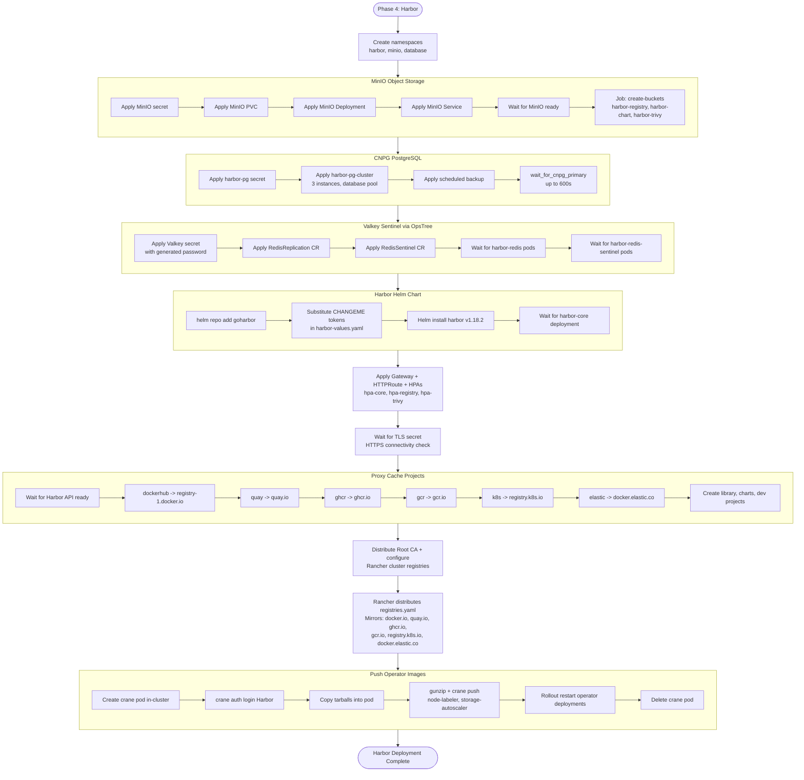
```mermaid
flowchart TD
    Start([Phase 4: Harbor]) --> NS[Create namespaces<br/>harbor, minio, database]

    NS --> MinIO

    subgraph MinIO [MinIO Object Storage]
        M_Secret[Apply MinIO secret] --> M_PVC[Apply MinIO PVC]
        M_PVC --> M_Deploy[Apply MinIO Deployment]
        M_Deploy --> M_Svc[Apply MinIO Service]
        M_Svc --> M_Wait[Wait for MinIO ready]
        M_Wait --> M_Buckets[Job: create-buckets<br/>harbor-registry, harbor-chart, harbor-trivy]
    end

    MinIO --> CNPG

    subgraph CNPG [CNPG PostgreSQL]
        PG_Secret[Apply harbor-pg secret] --> PG_Cluster[Apply harbor-pg-cluster<br/>3 instances, database pool]
        PG_Cluster --> PG_Backup[Apply scheduled backup]
        PG_Backup --> PG_Wait[wait_for_cnpg_primary<br/>up to 600s]
    end

    CNPG --> Redis

    subgraph Redis [Valkey Sentinel via OpsTree]
        R_Secret[Apply Valkey secret<br/>with generated password] --> R_Replication[Apply RedisReplication CR]
        R_Replication --> R_Sentinel[Apply RedisSentinel CR]
        R_Sentinel --> R_WaitRepl[Wait for harbor-redis pods]
        R_WaitRepl --> R_WaitSent[Wait for harbor-redis-sentinel pods]
    end

    Redis --> Harbor

    subgraph Harbor [Harbor Helm Chart]
        H_Repo[helm repo add goharbor] --> H_Values[Substitute CHANGEME tokens<br/>in harbor-values.yaml]
        H_Values --> H_Install[Helm install harbor v1.18.2]
        H_Install --> H_Wait[Wait for harbor-core deployment]
    end

    Harbor --> Ingress[Apply Gateway + HTTPRoute + HPAs<br/>hpa-core, hpa-registry, hpa-trivy]
    Ingress --> TLS[Wait for TLS secret<br/>HTTPS connectivity check]

    TLS --> ProxyCache

    subgraph ProxyCache [Proxy Cache Projects]
        PC_Wait[Wait for Harbor API ready] --> PC_DockerHub[dockerhub -> registry-1.docker.io]
        PC_DockerHub --> PC_Quay[quay -> quay.io]
        PC_Quay --> PC_GHCR[ghcr -> ghcr.io]
        PC_GHCR --> PC_GCR[gcr -> gcr.io]
        PC_GCR --> PC_K8s[k8s -> registry.k8s.io]
        PC_K8s --> PC_Elastic[elastic -> docker.elastic.co]
        PC_Elastic --> PC_CICD[Create library, charts, dev projects]
    end

    ProxyCache --> CA[Distribute Root CA + configure<br/>Rancher cluster registries]
    CA --> Mirrors[Rancher distributes registries.yaml<br/>Mirrors: docker.io, quay.io, ghcr.io,<br/>gcr.io, registry.k8s.io, docker.elastic.co]

    Mirrors --> Operators

    subgraph Operators [Push Operator Images]
        OP_Pod[Create crane pod in-cluster] --> OP_Auth[crane auth login Harbor]
        OP_Auth --> OP_Copy[Copy tarballs into pod]
        OP_Copy --> OP_Push[gunzip + crane push<br/>node-labeler, storage-autoscaler]
        OP_Push --> OP_Restart[Rollout restart operator deployments]
        OP_Restart --> OP_Clean[Delete crane pod]
    end

    Operators --> Done([Harbor Deployment Complete])
```

---

### 8. Keycloak OIDC Setup

The full `setup-keycloak.sh` pipeline: realm creation, user provisioning, OIDC client creation, service bindings, and group configuration.

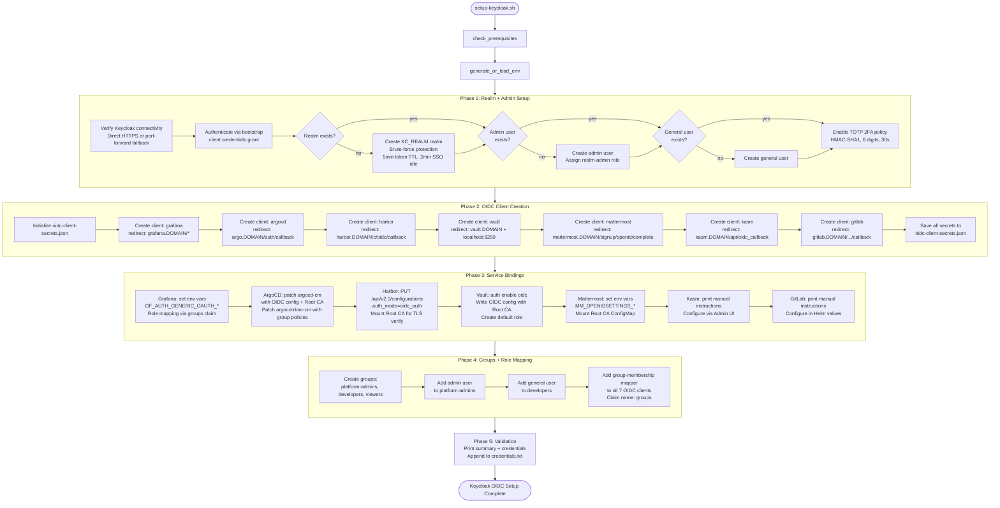
```mermaid
flowchart TD
    Start([setup-keycloak.sh]) --> Prereqs[check_prerequisites]
    Prereqs --> LoadEnv[generate_or_load_env]
    LoadEnv --> Phase1

    subgraph Phase1 [Phase 1: Realm + Admin Setup]
        P1_Connect[Verify Keycloak connectivity<br/>Direct HTTPS or port-forward fallback] --> P1_Token[Authenticate via bootstrap<br/>client credentials grant]
        P1_Token --> P1_Realm{Realm exists?}
        P1_Realm -->|no| P1_CreateRealm[Create KC_REALM realm<br/>Brute-force protection<br/>5min token TTL, 2min SSO idle]
        P1_Realm -->|yes| P1_Admin
        P1_CreateRealm --> P1_Admin{Admin user<br/>exists?}
        P1_Admin -->|no| P1_CreateAdmin[Create admin user<br/>Assign realm-admin role]
        P1_Admin -->|yes| P1_User
        P1_CreateAdmin --> P1_User{General user<br/>exists?}
        P1_User -->|no| P1_CreateUser[Create general user]
        P1_User -->|yes| P1_TOTP
        P1_CreateUser --> P1_TOTP[Enable TOTP 2FA policy<br/>HMAC-SHA1, 6 digits, 30s]
    end

    Phase1 --> Phase2

    subgraph Phase2 [Phase 2: OIDC Client Creation]
        P2_Init[Initialize oidc-client-secrets.json] --> P2_Grafana[Create client: grafana<br/>redirect: grafana.DOMAIN/*]
        P2_Grafana --> P2_ArgoCD[Create client: argocd<br/>redirect: argo.DOMAIN/auth/callback]
        P2_ArgoCD --> P2_Harbor[Create client: harbor<br/>redirect: harbor.DOMAIN/c/oidc/callback]
        P2_Harbor --> P2_Vault[Create client: vault<br/>redirect: vault.DOMAIN + localhost:8250]
        P2_Vault --> P2_MM[Create client: mattermost<br/>redirect: mattermost.DOMAIN/signup/openid/complete]
        P2_MM --> P2_Kasm[Create client: kasm<br/>redirect: kasm.DOMAIN/api/oidc_callback]
        P2_Kasm --> P2_GitLab[Create client: gitlab<br/>redirect: gitlab.DOMAIN/.../callback]
        P2_GitLab --> P2_Save[Save all secrets to<br/>oidc-client-secrets.json]
    end

    Phase2 --> Phase3

    subgraph Phase3 [Phase 3: Service Bindings]
        P3_Grafana[Grafana: set env vars<br/>GF_AUTH_GENERIC_OAUTH_*<br/>Role mapping via groups claim] --> P3_ArgoCD[ArgoCD: patch argocd-cm<br/>with OIDC config + Root CA<br/>Patch argocd-rbac-cm with group policies]
        P3_ArgoCD --> P3_Harbor[Harbor: PUT /api/v2.0/configurations<br/>auth_mode=oidc_auth<br/>Mount Root CA for TLS verify]
        P3_Harbor --> P3_Vault[Vault: auth enable oidc<br/>Write OIDC config with Root CA<br/>Create default role]
        P3_Vault --> P3_MM[Mattermost: set env vars<br/>MM_OPENIDSETTINGS_*<br/>Mount Root CA ConfigMap]
        P3_MM --> P3_Kasm[Kasm: print manual instructions<br/>Configure via Admin UI]
        P3_Kasm --> P3_GitLab[GitLab: print manual instructions<br/>Configure in Helm values]
    end

    Phase3 --> Phase4

    subgraph Phase4 [Phase 4: Groups + Role Mapping]
        P4_Groups[Create groups:<br/>platform-admins, developers, viewers] --> P4_AdminGroup[Add admin user<br/>to platform-admins]
        P4_AdminGroup --> P4_UserGroup[Add general user<br/>to developers]
        P4_UserGroup --> P4_Mappers[Add group-membership mapper<br/>to all 7 OIDC clients<br/>Claim name: groups]
    end

    Phase4 --> Phase5[Phase 5: Validation<br/>Print summary + credentials<br/>Append to credentials.txt]
    Phase5 --> Done([Keycloak OIDC Setup Complete])
```

---

### 9. CI/CD Setup

The `setup-cicd.sh` pipeline: GitLab-ArgoCD connection, app-of-apps bootstrap, Harbor robot accounts, and Argo Rollouts analysis templates.

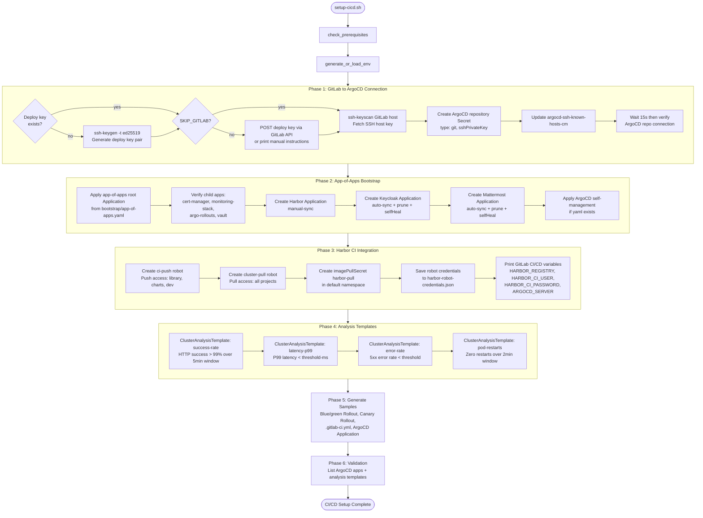
```mermaid
flowchart TD
    Start([setup-cicd.sh]) --> Prereqs[check_prerequisites]
    Prereqs --> LoadEnv[generate_or_load_env]
    LoadEnv --> Phase1

    subgraph Phase1 [Phase 1: GitLab to ArgoCD Connection]
        P1_Key{Deploy key<br/>exists?}
        P1_Key -->|no| P1_GenKey[ssh-keygen -t ed25519<br/>Generate deploy key pair]
        P1_Key -->|yes| P1_GitLab
        P1_GenKey --> P1_GitLab{SKIP_GITLAB?}
        P1_GitLab -->|no| P1_AddKey[POST deploy key via GitLab API<br/>or print manual instructions]
        P1_GitLab -->|yes| P1_HostKey
        P1_AddKey --> P1_HostKey[ssh-keyscan GitLab host<br/>Fetch SSH host key]
        P1_HostKey --> P1_RepoSecret[Create ArgoCD repository Secret<br/>type: git, sshPrivateKey]
        P1_RepoSecret --> P1_KnownHosts[Update argocd-ssh-known-hosts-cm]
        P1_KnownHosts --> P1_Verify[Wait 15s then verify<br/>ArgoCD repo connection]
    end

    Phase1 --> Phase2

    subgraph Phase2 [Phase 2: App-of-Apps Bootstrap]
        P2_Root[Apply app-of-apps root Application<br/>from bootstrap/app-of-apps.yaml] --> P2_Check[Verify child apps:<br/>cert-manager, monitoring-stack,<br/>argo-rollouts, vault]
        P2_Check --> P2_Harbor[Create Harbor Application<br/>manual-sync]
        P2_Harbor --> P2_KC[Create Keycloak Application<br/>auto-sync + prune + selfHeal]
        P2_KC --> P2_MM[Create Mattermost Application<br/>auto-sync + prune + selfHeal]
        P2_MM --> P2_Self[Apply ArgoCD self-management<br/>if yaml exists]
    end

    Phase2 --> Phase3

    subgraph Phase3 [Phase 3: Harbor CI Integration]
        P3_Push[Create ci-push robot<br/>Push access: library, charts, dev] --> P3_Pull[Create cluster-pull robot<br/>Pull access: all projects]
        P3_Pull --> P3_Secret[Create imagePullSecret harbor-pull<br/>in default namespace]
        P3_Secret --> P3_Save[Save robot credentials<br/>to harbor-robot-credentials.json]
        P3_Save --> P3_Print[Print GitLab CI/CD variables<br/>HARBOR_REGISTRY, HARBOR_CI_USER,<br/>HARBOR_CI_PASSWORD, ARGOCD_SERVER]
    end

    Phase3 --> Phase4

    subgraph Phase4 [Phase 4: Analysis Templates]
        P4_Success[ClusterAnalysisTemplate: success-rate<br/>HTTP success > 99% over 5min window] --> P4_Latency[ClusterAnalysisTemplate: latency-p99<br/>P99 latency < threshold-ms]
        P4_Latency --> P4_Error[ClusterAnalysisTemplate: error-rate<br/>5xx error rate < threshold]
        P4_Error --> P4_Restarts[ClusterAnalysisTemplate: pod-restarts<br/>Zero restarts over 2min window]
    end

    Phase4 --> Phase5[Phase 5: Generate Samples<br/>Blue/green Rollout, Canary Rollout,<br/>.gitlab-ci.yml, ArgoCD Application]
    Phase5 --> Phase6[Phase 6: Validation<br/>List ArgoCD apps + analysis templates]
    Phase6 --> Done([CI/CD Setup Complete])
```

---

## Operational Flows

### 10. Cluster Upgrade Flow

The `upgrade-cluster.sh` workflow: version validation, tfvars update, Terraform apply, and Rancher-orchestrated rolling upgrade.

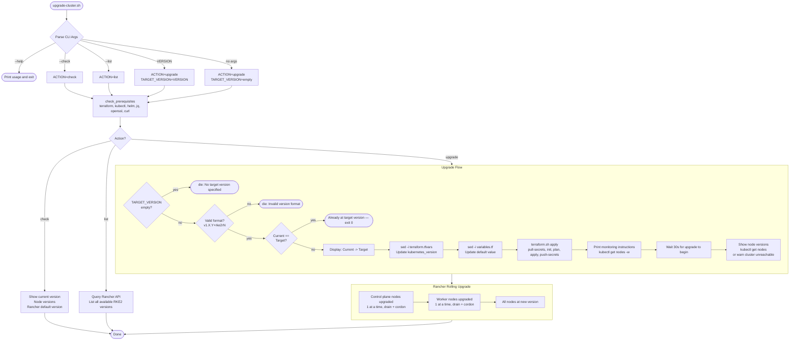
```mermaid
flowchart TD
    Start([upgrade-cluster.sh]) --> ParseArgs{Parse CLI Args}
    ParseArgs -->|--help| Help([Print usage and exit])
    ParseArgs -->|--check| SetCheck[ACTION=check]
    ParseArgs -->|--list| SetList[ACTION=list]
    ParseArgs -->|VERSION| SetUpgrade[ACTION=upgrade<br/>TARGET_VERSION=VERSION]
    ParseArgs -->|no args| SetDefault[ACTION=upgrade<br/>TARGET_VERSION=empty]

    SetCheck --> Prereqs[check_prerequisites<br/>terraform, kubectl, helm, jq, openssl, curl]
    SetList --> Prereqs
    SetUpgrade --> Prereqs
    SetDefault --> Prereqs

    Prereqs --> ActionSwitch{Action?}

    ActionSwitch -->|check| Check[Show current version<br/>Node versions<br/>Rancher default version]
    ActionSwitch -->|list| List[Query Rancher API<br/>List all available RKE2 versions]
    ActionSwitch -->|upgrade| Upgrade

    Check --> Done([Done])
    List --> Done

    subgraph Upgrade [Upgrade Flow]
        U_Empty{TARGET_VERSION<br/>empty?}
        U_Empty -->|yes| U_Die([die: No target version specified])
        U_Empty -->|no| U_Validate{Valid format?<br/>v1.X.Y+rke2rN}
        U_Validate -->|no| U_Abort([die: Invalid version format])
        U_Validate -->|yes| U_Same{Current ==<br/>Target?}
        U_Same -->|yes| U_NOP([Already at target version — exit 0])
        U_Same -->|no| U_Display[Display: Current -> Target]
        U_Display --> U_TFVars[sed -i terraform.tfvars<br/>Update kubernetes_version]
        U_TFVars --> U_VarsTF[sed -i variables.tf<br/>Update default value]
        U_VarsTF --> U_Apply[terraform.sh apply<br/>pull-secrets, init, plan, apply, push-secrets]
        U_Apply --> U_Info[Print monitoring instructions<br/>kubectl get nodes -w]
        U_Info --> U_Wait[Wait 30s for upgrade to begin]
        U_Wait --> U_ShowNodes[Show node versions<br/>kubectl get nodes<br/>or warn cluster unreachable]
    end

    Upgrade --> Monitor

    subgraph Monitor [Rancher Rolling Upgrade]
        R_CP[Control plane nodes upgraded<br/>1 at a time, drain + cordon] --> R_Workers[Worker nodes upgraded<br/>1 at a time, drain + cordon]
        R_Workers --> R_Verify[All nodes at new version]
    end

    Monitor --> Done
```

---

### 11. Vault Unseal Procedure

The unseal logic from `vault_unseal_replica` and Phase 2 initialization handling in `deploy-cluster.sh`.

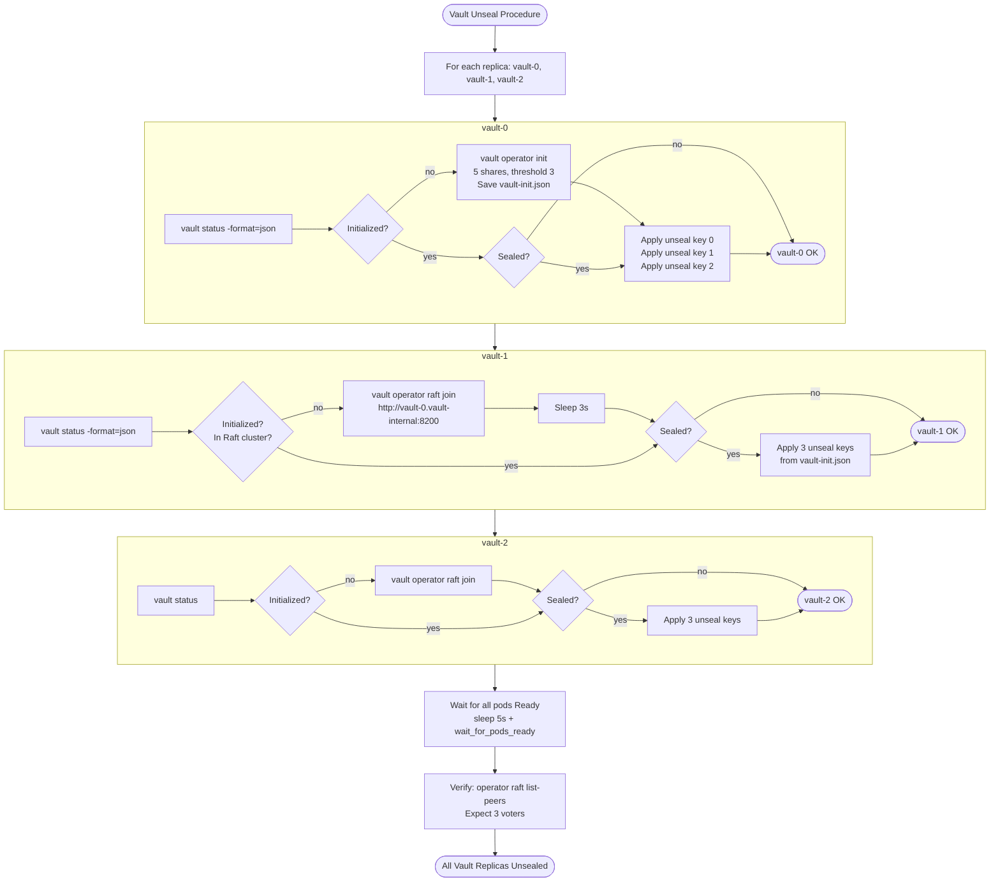
```mermaid
flowchart TD
    Start([Vault Unseal Procedure]) --> CheckAll[For each replica: vault-0, vault-1, vault-2]

    CheckAll --> R0

    subgraph R0 [vault-0]
        R0_Status[vault status -format=json] --> R0_Init{Initialized?}
        R0_Init -->|no| R0_FullInit[vault operator init<br/>5 shares, threshold 3<br/>Save vault-init.json]
        R0_FullInit --> R0_Unseal
        R0_Init -->|yes| R0_Sealed{Sealed?}
        R0_Sealed -->|no| R0_OK([vault-0 OK])
        R0_Sealed -->|yes| R0_Unseal[Apply unseal key 0<br/>Apply unseal key 1<br/>Apply unseal key 2]
        R0_Unseal --> R0_OK
    end

    R0 --> R1

    subgraph R1 [vault-1]
        R1_Status[vault status -format=json] --> R1_Init{Initialized?<br/>In Raft cluster?}
        R1_Init -->|no| R1_Join[vault operator raft join<br/>http://vault-0.vault-internal:8200]
        R1_Join --> R1_Sleep[Sleep 3s]
        R1_Sleep --> R1_Sealed
        R1_Init -->|yes| R1_Sealed{Sealed?}
        R1_Sealed -->|no| R1_OK([vault-1 OK])
        R1_Sealed -->|yes| R1_Unseal[Apply 3 unseal keys<br/>from vault-init.json]
        R1_Unseal --> R1_OK
    end

    R1 --> R2

    subgraph R2 [vault-2]
        R2_Status[vault status] --> R2_Init{Initialized?}
        R2_Init -->|no| R2_Join[vault operator raft join]
        R2_Join --> R2_Sealed
        R2_Init -->|yes| R2_Sealed{Sealed?}
        R2_Sealed -->|no| R2_OK([vault-2 OK])
        R2_Sealed -->|yes| R2_Unseal[Apply 3 unseal keys]
        R2_Unseal --> R2_OK
    end

    R2 --> WaitReady[Wait for all pods Ready<br/>sleep 5s + wait_for_pods_ready]
    WaitReady --> Verify[Verify: operator raft list-peers<br/>Expect 3 voters]
    Verify --> Done([All Vault Replicas Unsealed])
```

---

### 12. Certificate Renewal Flow

How cert-manager, Vault PKI, and Gateway API annotations work together for automatic TLS certificate lifecycle management.

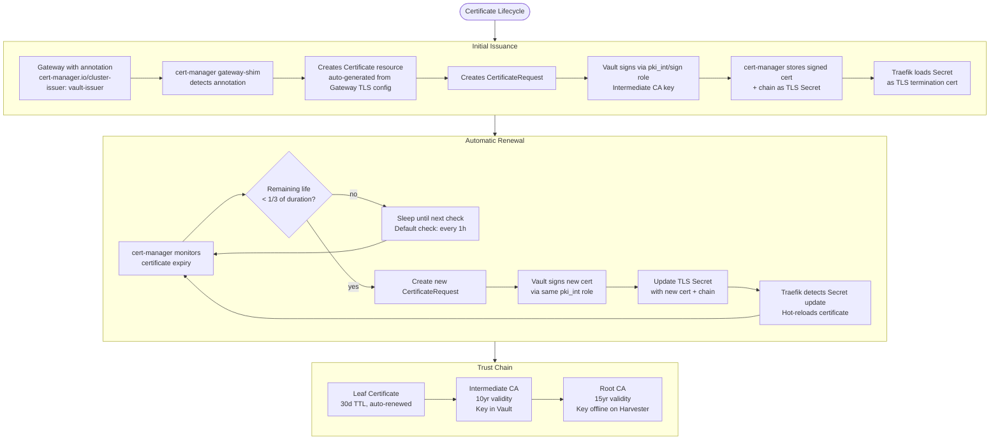
```mermaid
flowchart TD
    Start([Certificate Lifecycle]) --> Create

    subgraph Create [Initial Issuance]
        GW[Gateway with annotation<br/>cert-manager.io/cluster-issuer: vault-issuer] --> CM_Detect[cert-manager gateway-shim<br/>detects annotation]
        CM_Detect --> CM_Cert[Creates Certificate resource<br/>auto-generated from Gateway TLS config]
        CM_Cert --> CM_Order[Creates CertificateRequest]
        CM_Order --> Vault_Sign[Vault signs via pki_int/sign role<br/>Intermediate CA key]
        Vault_Sign --> CM_Secret[cert-manager stores signed cert<br/>+ chain as TLS Secret]
        CM_Secret --> GW_Mount[Traefik loads Secret<br/>as TLS termination cert]
    end

    Create --> Renew

    subgraph Renew [Automatic Renewal]
        CM_Timer[cert-manager monitors<br/>certificate expiry] --> CM_Check{Remaining life<br/>< 1/3 of duration?}
        CM_Check -->|no| CM_Wait[Sleep until next check<br/>Default check: every 1h]
        CM_Wait --> CM_Timer
        CM_Check -->|yes| CM_Reissue[Create new CertificateRequest]
        CM_Reissue --> Vault_ReSign[Vault signs new cert<br/>via same pki_int role]
        Vault_ReSign --> CM_Update[Update TLS Secret<br/>with new cert + chain]
        CM_Update --> Traefik_Reload[Traefik detects Secret update<br/>Hot-reloads certificate]
        Traefik_Reload --> CM_Timer
    end

    Renew --> Chain

    subgraph Chain [Trust Chain]
        Leaf[Leaf Certificate<br/>30d TTL, auto-renewed] --> Intermediate[Intermediate CA<br/>10yr validity<br/>Key in Vault]
        Intermediate --> Root[Root CA<br/>15yr validity<br/>Key offline on Harvester]
    end
```

---

### 13. Node Scaling Flow

How the Cluster Autoscaler, Rancher, and the Node Labeler operator work together to scale worker pools.

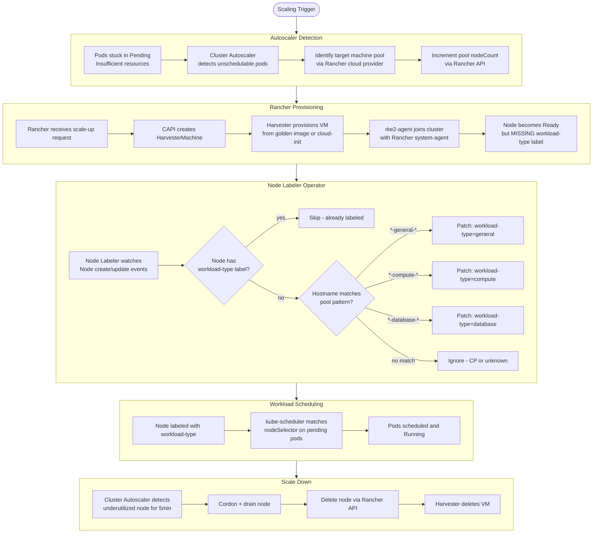
```mermaid
flowchart TD
    Start([Scaling Trigger]) --> Trigger

    subgraph Trigger [Autoscaler Detection]
        Pending[Pods stuck in Pending<br/>Insufficient resources] --> CA_Detect[Cluster Autoscaler<br/>detects unschedulable pods]
        CA_Detect --> CA_Pool[Identify target machine pool<br/>via Rancher cloud provider]
        CA_Pool --> CA_Scale[Increment pool nodeCount<br/>via Rancher API]
    end

    Trigger --> Provision

    subgraph Provision [Rancher Provisioning]
        R_Receive[Rancher receives scale-up request] --> R_CAPI[CAPI creates HarvesterMachine]
        R_CAPI --> H_VM[Harvester provisions VM<br/>from golden image or cloud-init]
        H_VM --> R_Agent[rke2-agent joins cluster<br/>with Rancher system-agent]
        R_Agent --> R_Ready[Node becomes Ready<br/>but MISSING workload-type label]
    end

    Provision --> Label

    subgraph Label [Node Labeler Operator]
        NL_Watch[Node Labeler watches<br/>Node create/update events] --> NL_Check{Node has<br/>workload-type label?}
        NL_Check -->|yes| NL_Skip[Skip - already labeled]
        NL_Check -->|no| NL_Match{Hostname matches<br/>pool pattern?}
        NL_Match -->|*-general-*| NL_General[Patch: workload-type=general]
        NL_Match -->|*-compute-*| NL_Compute[Patch: workload-type=compute]
        NL_Match -->|*-database-*| NL_Database[Patch: workload-type=database]
        NL_Match -->|no match| NL_Ignore[Ignore - CP or unknown]
    end

    Label --> Schedule

    subgraph Schedule [Workload Scheduling]
        Labeled[Node labeled with workload-type] --> Scheduler[kube-scheduler matches<br/>nodeSelector on pending pods]
        Scheduler --> Running[Pods scheduled and Running]
    end

    Schedule --> ScaleDown

    subgraph ScaleDown [Scale Down]
        SD_Idle[Cluster Autoscaler detects<br/>underutilized node for 5min] --> SD_Cordon[Cordon + drain node]
        SD_Cordon --> SD_Delete[Delete node via Rancher API]
        SD_Delete --> SD_VM[Harvester deletes VM]
    end
```

---

## Controller Logic Flows

### 14. Storage Autoscaler Reconciliation Loop

The full reconciliation logic from `volumeautoscaler_controller.go`, including PVC resolution, Prometheus queries, safety checks, and PVC patching.

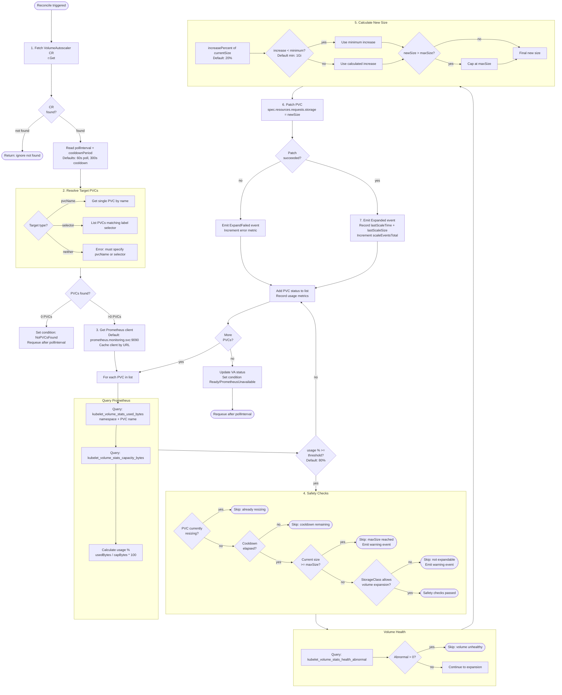
```mermaid
flowchart TD
    Start([Reconcile triggered]) --> Fetch[1. Fetch VolumeAutoscaler CR<br/>r.Get]
    Fetch --> NotFound{CR<br/>found?}
    NotFound -->|not found| Ignore([Return: ignore not found])
    NotFound -->|found| Config

    Config[Read pollInterval + cooldownPeriod<br/>Defaults: 60s poll, 300s cooldown] --> Resolve

    subgraph Resolve [2. Resolve Target PVCs]
        Resolve_Start{Target type?}
        Resolve_Start -->|pvcName| Single[Get single PVC by name]
        Resolve_Start -->|selector| Multi[List PVCs matching label selector]
        Resolve_Start -->|neither| Error[Error: must specify pvcName or selector]
    end

    Resolve --> PVCCheck{PVCs found?}
    PVCCheck -->|0 PVCs| NoPVC[Set condition: NoPVCsFound<br/>Requeue after pollInterval]
    PVCCheck -->|>0 PVCs| PromSetup

    PromSetup[3. Get Prometheus client<br/>Default: prometheus.monitoring.svc:9090<br/>Cache client by URL] --> Loop

    Loop[For each PVC in list] --> QueryUsed

    subgraph QueryProm [Query Prometheus]
        QueryUsed[Query: kubelet_volume_stats_used_bytes<br/>namespace + PVC name] --> QueryCap[Query: kubelet_volume_stats_capacity_bytes]
        QueryCap --> CalcUsage[Calculate usage %<br/>usedBytes / capBytes * 100]
    end

    QueryProm --> CheckThreshold{usage % >=<br/>threshold?<br/>Default: 80%}

    CheckThreshold -->|no| AddStatus[Add PVC status to list<br/>Record usage metrics]
    CheckThreshold -->|yes| SafetyChecks

    subgraph SafetyChecks [4. Safety Checks]
        SC_Resizing{PVC currently<br/>resizing?}
        SC_Resizing -->|yes| SC_Skip([Skip: already resizing])
        SC_Resizing -->|no| SC_Cooldown{Cooldown<br/>elapsed?}
        SC_Cooldown -->|no| SC_Skip2([Skip: cooldown remaining])
        SC_Cooldown -->|yes| SC_MaxSize{Current size<br/>>= maxSize?}
        SC_MaxSize -->|yes| SC_Skip3([Skip: maxSize reached<br/>Emit warning event])
        SC_MaxSize -->|no| SC_StorageClass{StorageClass allows<br/>volume expansion?}
        SC_StorageClass -->|no| SC_Skip4([Skip: not expandable<br/>Emit warning event])
        SC_StorageClass -->|yes| SC_Pass([Safety checks passed])
    end

    SafetyChecks --> HealthCheck

    subgraph HealthCheck [Volume Health]
        HC_Query[Query: kubelet_volume_stats_health_abnormal] --> HC_Check{Abnormal > 0?}
        HC_Check -->|yes| HC_Skip([Skip: volume unhealthy])
        HC_Check -->|no| HC_Pass[Continue to expansion]
    end

    HealthCheck --> Calculate

    subgraph Calculate [5. Calculate New Size]
        C_Percent[increasePercent of currentSize<br/>Default: 20%] --> C_Floor{increase < minimum?<br/>Default min: 1Gi}
        C_Floor -->|yes| C_UseMin[Use minimum increase]
        C_Floor -->|no| C_UseCalc[Use calculated increase]
        C_UseMin --> C_Cap{newSize > maxSize?}
        C_UseCalc --> C_Cap
        C_Cap -->|yes| C_MaxSize[Cap at maxSize]
        C_Cap -->|no| C_Final[Final new size]
        C_MaxSize --> C_Final
    end

    Calculate --> Patch[6. Patch PVC<br/>spec.resources.requests.storage = newSize]
    Patch --> PatchResult{Patch<br/>succeeded?}
    PatchResult -->|no| PatchError[Emit ExpandFailed event<br/>Increment error metric]
    PatchResult -->|yes| Emit[7. Emit Expanded event<br/>Record lastScaleTime + lastScaleSize<br/>Increment scaleEventsTotal]

    PatchError --> AddStatus
    Emit --> AddStatus
    AddStatus --> NextPVC{More<br/>PVCs?}
    NextPVC -->|yes| Loop
    NextPVC -->|no| UpdateStatus[Update VA status<br/>Set condition Ready/PrometheusUnavailable]
    UpdateStatus --> Requeue([Requeue after pollInterval])
```

---

### 15. Node Labeler Reconciliation Loop

The reconciliation logic from `node_controller.go`: watch Node events, match hostname patterns, and apply `workload-type` labels.

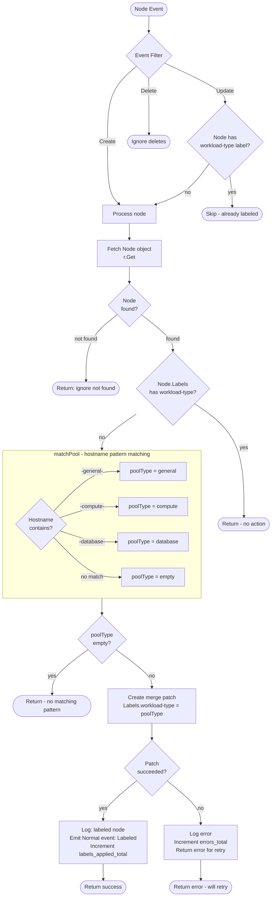
```mermaid
flowchart TD
    Start([Node Event]) --> Filter{Event Filter}
    Filter -->|Create| Process[Process node]
    Filter -->|Update| CheckLabel{Node has<br/>workload-type label?}
    CheckLabel -->|yes| Skip([Skip - already labeled])
    CheckLabel -->|no| Process
    Filter -->|Delete| Ignore([Ignore deletes])

    Process --> GetNode[Fetch Node object<br/>r.Get]
    GetNode --> Found{Node<br/>found?}
    Found -->|not found| IgnoreNF([Return: ignore not found])
    Found -->|found| HasLabel{Node.Labels<br/>has workload-type?}
    HasLabel -->|yes| AlreadyLabeled([Return - no action])
    HasLabel -->|no| Match

    subgraph Match [matchPool - hostname pattern matching]
        M_Start{Hostname<br/>contains?}
        M_Start -->|"-general-"| M_General[poolType = general]
        M_Start -->|"-compute-"| M_Compute[poolType = compute]
        M_Start -->|"-database-"| M_Database[poolType = database]
        M_Start -->|no match| M_None[poolType = empty]
    end

    Match --> PoolCheck{poolType<br/>empty?}
    PoolCheck -->|yes| NoMatch([Return - no matching pattern])
    PoolCheck -->|no| Patch

    Patch[Create merge patch<br/>Labels.workload-type = poolType] --> PatchResult{Patch<br/>succeeded?}
    PatchResult -->|yes| Success[Log: labeled node<br/>Emit Normal event: Labeled<br/>Increment labels_applied_total]
    PatchResult -->|no| Failure[Log error<br/>Increment errors_total<br/>Return error for retry]

    Success --> Done([Return success])
    Failure --> Retry([Return error - will retry])
```

---

## Decision Trees

### 16. Ingress Routing Decision

How to choose the right ingress pattern for a new service, and which authentication method to use.

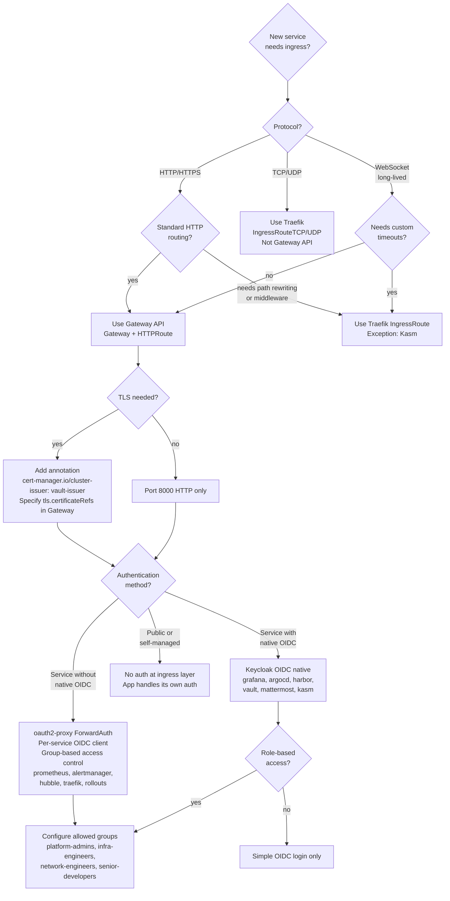
```mermaid
flowchart TD
    Start{New service<br/>needs ingress?} --> Proto{Protocol?}

    Proto -->|HTTP/HTTPS| GatewayCheck{Standard HTTP<br/>routing?}
    Proto -->|TCP/UDP| TCPNote[Use Traefik<br/>IngressRouteTCP/UDP<br/>Not Gateway API]
    Proto -->|WebSocket<br/>long-lived| WSCheck{Needs custom<br/>timeouts?}

    GatewayCheck -->|yes| Gateway[Use Gateway API<br/>Gateway + HTTPRoute]
    GatewayCheck -->|needs path rewriting<br/>or middleware| IngressRoute[Use Traefik IngressRoute<br/>Exception: Kasm]

    WSCheck -->|yes| IngressRoute
    WSCheck -->|no| Gateway

    Gateway --> TLS{TLS needed?}
    TLS -->|yes| Annotation[Add annotation<br/>cert-manager.io/cluster-issuer: vault-issuer<br/>Specify tls.certificateRefs in Gateway]
    TLS -->|no| NoTLS[Port 8000 HTTP only]

    Annotation --> Auth
    NoTLS --> Auth

    Auth{Authentication<br/>method?}
    Auth -->|Service without<br/>native OIDC| ForwardAuth[oauth2-proxy ForwardAuth<br/>Per-service OIDC client<br/>Group-based access control<br/>prometheus, alertmanager,<br/>hubble, traefik, rollouts]
    Auth -->|Service with<br/>native OIDC| OIDC[Keycloak OIDC native<br/>grafana, argocd, harbor,<br/>vault, mattermost, kasm]
    Auth -->|Public or<br/>self-managed| None[No auth at ingress layer<br/>App handles its own auth]

    ForwardAuth --> Groups[Configure allowed groups<br/>platform-admins, infra-engineers,<br/>network-engineers, senior-developers]
    OIDC --> GroupMapping{Role-based<br/>access?}
    GroupMapping -->|yes| Groups
    GroupMapping -->|no| Simple[Simple OIDC login only]
```

---

### 17. Database Backend Selection

How to choose the right database backend for a new service in the cluster.

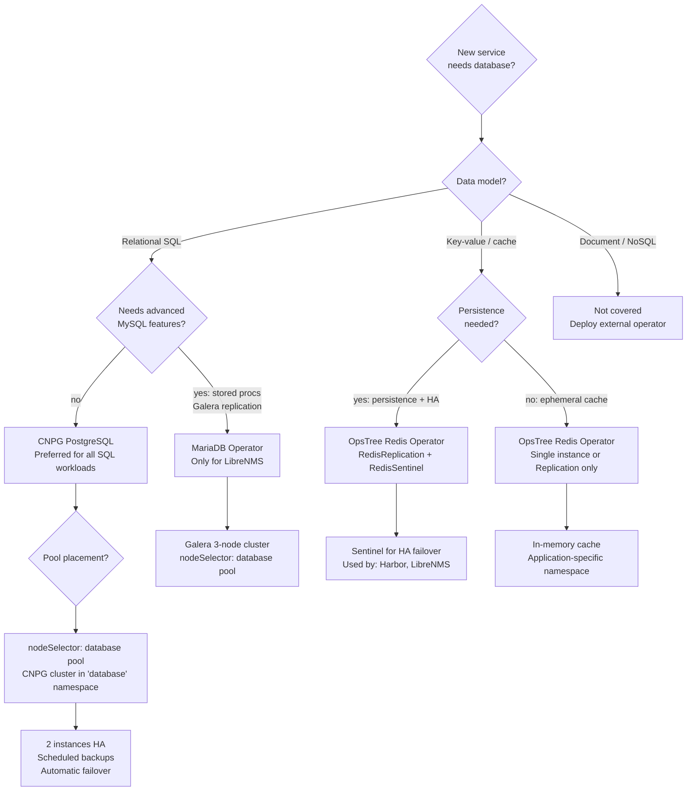
```mermaid
flowchart TD
    Start{New service<br/>needs database?} --> Type{Data model?}

    Type -->|Relational SQL| RelCheck{Needs advanced<br/>MySQL features?}
    Type -->|Key-value / cache| CacheCheck{Persistence<br/>needed?}
    Type -->|Document / NoSQL| External[Not covered<br/>Deploy external operator]

    RelCheck -->|no| CNPG[CNPG PostgreSQL<br/>Preferred for all SQL workloads]
    RelCheck -->|yes: stored procs<br/>Galera replication| MariaDB[MariaDB Operator<br/>Only for LibreNMS]

    CNPG --> PGPool{Pool placement?}
    PGPool --> Database[nodeSelector: database pool<br/>CNPG cluster in 'database' namespace]
    Database --> PGConfig[2 instances HA<br/>Scheduled backups<br/>Automatic failover]

    MariaDB --> MariaConfig[Galera 3-node cluster<br/>nodeSelector: database pool]

    CacheCheck -->|yes: persistence + HA| Redis[OpsTree Redis Operator<br/>RedisReplication + RedisSentinel]
    CacheCheck -->|no: ephemeral cache| RedisSimple[OpsTree Redis Operator<br/>Single instance or Replication only]

    Redis --> RedisConfig[Sentinel for HA failover<br/>Used by: Harbor, LibreNMS]
    RedisSimple --> RedisSimpleConfig[In-memory cache<br/>Application-specific namespace]
```

---

### 18. Worker Pool Selection

How to determine the correct worker pool (`nodeSelector`) for a workload.

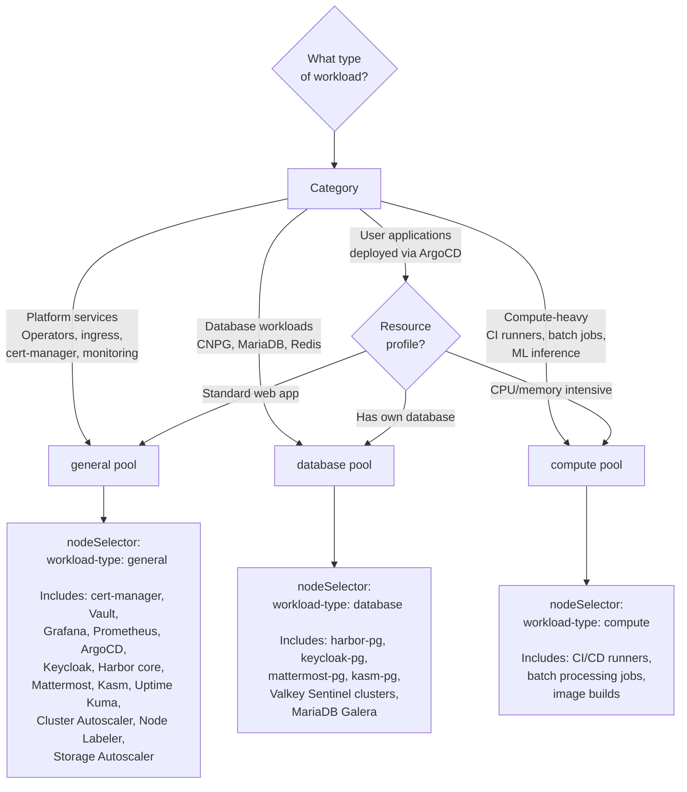
```mermaid
flowchart TD
    Start{What type<br/>of workload?} --> Category

    Category -->|Platform services<br/>Operators, ingress,<br/>cert-manager, monitoring| General[general pool]
    Category -->|Database workloads<br/>CNPG, MariaDB, Redis| DatabasePool[database pool]
    Category -->|Compute-heavy<br/>CI runners, batch jobs,<br/>ML inference| Compute[compute pool]
    Category -->|User applications<br/>deployed via ArgoCD| AppCheck{Resource<br/>profile?}

    General --> GeneralSpec[nodeSelector:<br/>  workload-type: general<br/><br/>Includes: cert-manager, Vault,<br/>Grafana, Prometheus, ArgoCD,<br/>Keycloak, Harbor core,<br/>Mattermost, Kasm, Uptime Kuma,<br/>Cluster Autoscaler, Node Labeler,<br/>Storage Autoscaler]

    DatabasePool --> DBSpec[nodeSelector:<br/>  workload-type: database<br/><br/>Includes: harbor-pg, keycloak-pg,<br/>mattermost-pg, kasm-pg,<br/>Valkey Sentinel clusters,<br/>MariaDB Galera]

    Compute --> ComputeSpec[nodeSelector:<br/>  workload-type: compute<br/><br/>Includes: CI/CD runners,<br/>batch processing jobs,<br/>image builds]

    AppCheck -->|CPU/memory intensive| Compute
    AppCheck -->|Standard web app| General
    AppCheck -->|Has own database| DatabasePool
```

---

### 19. Troubleshooting Triage

Decision tree for diagnosing common cluster issues.

```mermaid
flowchart TD
    Start{Symptom?} --> Cat

    Cat -->|Pods not scheduling| Sched
    Cat -->|TLS/cert errors| Cert
    Cat -->|Service unreachable| Network
    Cat -->|Vault sealed| VaultIssue
    Cat -->|Node not Ready| NodeIssue
    Cat -->|PVC stuck Pending| StorageIssue

    subgraph Sched [Pod Scheduling Issues]
        S1{kubectl describe pod<br/>Check Events} --> S2{Insufficient<br/>resources?}
        S2 -->|yes| S3{Cluster Autoscaler<br/>active?}
        S3 -->|yes| S4[Check autoscaler logs<br/>kubectl -n kube-system logs<br/>-l app.kubernetes.io/name=rancher-cluster-autoscaler]
        S3 -->|no| S5[Scale pool manually via<br/>terraform.tfvars + terraform apply]
        S2 -->|no| S6{nodeSelector<br/>mismatch?}
        S6 -->|yes| S7[Check workload-type labels<br/>kubectl get nodes --show-labels<br/>Run label_unlabeled_nodes]
        S6 -->|no| S8[Check taints, tolerations,<br/>affinity rules, PVC bindings]
    end

    subgraph Cert [Certificate Issues]
        C1{kubectl get certificate -A<br/>Check Ready status} --> C2{ClusterIssuer<br/>Ready?}
        C2 -->|no| C3[Check Vault unsealed<br/>Check K8s auth role<br/>Check cert-manager logs]
        C2 -->|yes| C4{Certificate<br/>shows error?}
        C4 -->|yes| C5[Check CertificateRequest<br/>kubectl describe certificaterequest<br/>Check Vault PKI role allows domain]
        C4 -->|no| C6[Check Gateway annotation<br/>cert-manager.io/cluster-issuer: vault-issuer<br/>Check certificateRefs in TLS config]
    end

    subgraph Network [Service Unreachable]
        N1{From inside cluster<br/>or outside?} --> N2{Inside}
        N1 --> N3{Outside}
        N2 --> N4[Check Service endpoints<br/>kubectl get endpoints<br/>Check pod readiness]
        N3 --> N5{DNS resolves<br/>to LB IP?}
        N5 -->|no| N6[Create DNS A record<br/>pointing to Traefik LB IP]
        N5 -->|yes| N7{Traefik LB<br/>responding?}
        N7 -->|no| N8[Check Traefik pods<br/>Check Cilium L2 announcement<br/>kubectl get svc -n kube-system traefik]
        N7 -->|yes| N9[Check Gateway + HTTPRoute exist<br/>Check hostname matches<br/>Check Root CA in browser]
    end

    subgraph VaultIssue [Vault Sealed]
        V1[Check vault status on each pod<br/>kubectl exec vault-N -- vault status] --> V2{vault-init.json<br/>available?}
        V2 -->|yes| V3[Run vault_unseal_replica<br/>for each sealed replica]
        V2 -->|no| V4[Pull from Harvester:<br/>terraform.sh pull-secrets<br/>Check terraform-state/vault-init secret]
    end

    subgraph NodeIssue [Node Not Ready]
        NI1[kubectl describe node NODE] --> NI2{Condition?}
        NI2 -->|MemoryPressure<br/>DiskPressure| NI3[Check resource usage<br/>Storage Autoscaler may help<br/>Scale pool or evict workloads]
        NI2 -->|NetworkUnavailable| NI4[Check Cilium agent<br/>kubectl -n kube-system logs<br/>-l k8s-app=cilium]
        NI2 -->|NotReady| NI5[Check kubelet and rke2-agent<br/>SSH to node, check journalctl -u rke2-agent]
    end

    subgraph StorageIssue [PVC Stuck Pending]
        ST1{StorageClass<br/>exists?} -->|no| ST2[Apply correct StorageClass<br/>Check Harvester CSI driver]
        ST1 -->|yes| ST3{Capacity<br/>available?}
        ST3 -->|no| ST4[Check Longhorn/Harvester storage<br/>May need more disk on Harvester nodes]
        ST3 -->|yes| ST5[Check PVC spec matches SC<br/>Check volumeMode, accessModes]
    end
```

---

### 20. Image Mode Selection

How to choose between golden image and full cloud-init for VM provisioning.

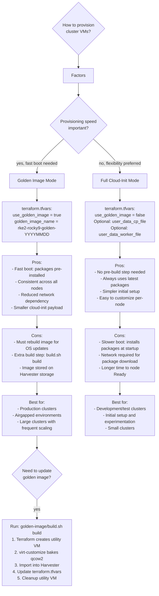
```mermaid
flowchart TD
    Start{How to provision<br/>cluster VMs?} --> Factors

    Factors --> Speed{Provisioning speed<br/>important?}
    Speed -->|yes, fast boot needed| Golden
    Speed -->|no, flexibility preferred| CloudInit

    Golden[Golden Image Mode] --> GoldenConfig[terraform.tfvars:<br/>use_golden_image = true<br/>golden_image_name = rke2-rocky9-golden-YYYYMMDD]
    GoldenConfig --> GoldenPros[Pros:<br/>- Fast boot: packages pre-installed<br/>- Consistent across all nodes<br/>- Reduced network dependency<br/>- Smaller cloud-init payload]
    GoldenPros --> GoldenCons[Cons:<br/>- Must rebuild image for OS updates<br/>- Extra build step: build.sh build<br/>- Image stored on Harvester storage]
    GoldenCons --> GoldenWhen[Best for:<br/>- Production clusters<br/>- Airgapped environments<br/>- Large clusters with frequent scaling]

    CloudInit[Full Cloud-Init Mode] --> CloudInitConfig[terraform.tfvars:<br/>use_golden_image = false<br/>Optional: user_data_cp_file<br/>Optional: user_data_worker_file]
    CloudInitConfig --> CloudInitPros[Pros:<br/>- No pre-build step needed<br/>- Always uses latest packages<br/>- Simpler initial setup<br/>- Easy to customize per-node]
    CloudInitPros --> CloudInitCons[Cons:<br/>- Slower boot: installs packages at startup<br/>- Network required for package download<br/>- Longer time to node Ready]
    CloudInitCons --> CloudInitWhen[Best for:<br/>- Development/test clusters<br/>- Initial setup and experimentation<br/>- Small clusters]

    GoldenWhen --> Rebuild{Need to update<br/>golden image?}
    Rebuild -->|yes| BuildFlow[Run: golden-image/build.sh build<br/>1. Terraform creates utility VM<br/>2. virt-customize bakes qcow2<br/>3. Import into Harvester<br/>4. Update terraform.tfvars<br/>5. Cleanup utility VM]
```

---

## Network Flows

### 21. External Traffic Path

The complete path of an external HTTPS request from client to application pod, through all network layers.

```mermaid
flowchart LR
    Client([Client Browser]) -->|DNS lookup| DNS[(DNS Server<br/>A record -> LB IP)]
    DNS -->|HTTPS request| LB

    subgraph Harvester [Harvester Host Network]
        LB[Cilium L2<br/>LoadBalancer<br/>Announces LB IP<br/>via ARP/NDP]
    end

    LB -->|TCP 443| Traefik

    subgraph K8s [RKE2 Cluster]
        subgraph TraefikNS [kube-system]
            Traefik[Traefik Proxy<br/>DaemonSet<br/>Listens :8443 HTTPS<br/>Listens :8000 HTTP]
            TLSStore[TLSStore default<br/>Sets Vault-issued cert as<br/>Traefik default certificate<br/>Prevents TRAEFIK DEFAULT CERT]
        end

        Traefik -->|Match hostname<br/>via Gateway listener| GW

        subgraph ServiceNS [Service Namespace]
            GW[Gateway Resource<br/>gatewayClassName: traefik<br/>TLS termination with<br/>Vault-issued cert]
            GW -->|HTTPRoute rules<br/>path matching| Route[HTTPRoute<br/>backendRefs -> Service]
            Route --> Svc[Kubernetes Service<br/>ClusterIP]
            Svc -->|Endpoint selection| Pod([Application Pod])
        end
    end

    Pod -->|HTTP response| Client

    style Client fill:#e1f5fe
    style DNS fill:#fff3e0
    style LB fill:#f3e5f5
    style Traefik fill:#e8f5e9
    style GW fill:#e8f5e9
    style Pod fill:#e8f5e9
```

---

### 22. TLS Certificate Issuance

The detailed flow of how a Gateway annotation triggers cert-manager to issue a TLS certificate via Vault PKI.

```mermaid
flowchart TD
    GW[Gateway Created/Updated<br/>annotation: cert-manager.io/cluster-issuer: vault-issuer<br/>listeners.tls.certificateRefs: name] --> Shim

    subgraph Shim [cert-manager Gateway Shim]
        Shim_Detect[gateway-shim controller<br/>detects annotated Gateway] --> Shim_Cert[Auto-creates Certificate CR<br/>dnsNames from Gateway hostname<br/>secretName from certificateRefs.name<br/>issuerRef: vault-issuer]
    end

    Shim --> CM

    subgraph CM [cert-manager Controller]
        CM_Cert[Certificate CR triggers<br/>CertificateRequest creation] --> CM_CSR[Generate private key<br/>Create CSR with SANs]
        CM_CSR --> CM_Submit[Submit to ClusterIssuer<br/>vault-issuer]
    end

    CM --> Vault

    subgraph Vault [Vault PKI Engine]
        V_Auth[cert-manager authenticates<br/>via K8s ServiceAccount JWT<br/>auth/kubernetes/login] --> V_Token[Vault returns<br/>short-lived token<br/>with cert-manager policy]
        V_Token --> V_Sign[POST pki_int/sign/DOMAIN<br/>CSR + TTL]
        V_Sign --> V_Issue[Vault signs with<br/>Intermediate CA key<br/>Returns: leaf cert + chain]
    end

    Vault --> Store

    subgraph Store [Secret Creation]
        S_Create[cert-manager creates<br/>TLS Secret in namespace] --> S_Data[Secret contains:<br/>tls.crt = leaf + intermediate + root<br/>tls.key = private key<br/>ca.crt = CA chain]
    end

    Store --> Traefik[Traefik reads Secret<br/>Uses for TLS termination<br/>on matching Gateway listener]
    Store --> TLSStore[TLSStore CRD references<br/>traefik TLS secret as default cert<br/>Prevents TRAEFIK DEFAULT CERT fallback]
    TLSStore --> TraefikDefault[Traefik uses Vault-issued cert<br/>as default for unmatched SNI requests]

    subgraph Chain [Certificate Chain]
        Leaf[Leaf cert<br/>CN: service.DOMAIN<br/>TTL: 30d] -.->|signed by| IntCA[Intermediate CA<br/>CN: Example Org Intermediate CA<br/>TTL: 10yr<br/>Key in Vault]
        IntCA -.->|signed by| RootCA[Root CA<br/>CN: Example Org Root CA<br/>TTL: 15yr<br/>Key offline]
    end
```

---

### 23. Monitoring Data Flow

How metrics and logs flow from sources through the observability stack to Grafana dashboards.

```mermaid
flowchart TD
    subgraph Sources [Data Sources on Each Node]
        NE[node-exporter<br/>DaemonSet<br/>Host metrics: CPU, memory,<br/>disk, network]
        KSM[kube-state-metrics<br/>Deployment<br/>K8s object metrics:<br/>pods, deployments, PVCs]
        Kubelet[Kubelet /metrics<br/>Container + volume metrics<br/>kubelet_volume_stats_*]
        AppMetrics[Application /metrics<br/>Custom app metrics<br/>HTTP requests, latencies]
        Logs[Container stdout/stderr<br/>Node journal logs<br/>/var/log/containers/*]
    end

    subgraph MetricsPipeline [Metrics Pipeline]
        NE --> Prom
        KSM --> Prom
        Kubelet --> Prom
        AppMetrics --> Prom

        Prom[Prometheus<br/>monitoring namespace<br/>Scrapes targets every 30s<br/>TSDB retention: 30d]
        Prom --> PromStore[(Prometheus TSDB<br/>PVC with VolumeAutoscaler)]
    end

    subgraph LogsPipeline [Logs Pipeline]
        Logs --> Alloy[Grafana Alloy<br/>DaemonSet<br/>Collects logs from<br/>all containers + journals]
        Alloy --> Loki[Loki<br/>monitoring namespace<br/>Log aggregation + indexing]
        Loki --> LokiStore[(Loki Storage<br/>PVC with VolumeAutoscaler)]
    end

    subgraph Alerting [Alerting Pipeline]
        Prom -->|Alerting rules<br/>evaluate every 1m| AM[Alertmanager<br/>monitoring namespace<br/>Deduplication + routing]
        AM -->|Notifications| MM_Alert[Mattermost webhook]
        AM -->|Notifications| Email[Email alerts]
    end

    subgraph Visualization [Grafana Dashboards]
        Grafana[Grafana<br/>monitoring namespace<br/>OIDC auth via Keycloak]
        PromStore --> Grafana
        LokiStore --> Grafana
    end

    subgraph Consumers [Other Metric Consumers]
        PromStore --> StorageAuto[Storage Autoscaler<br/>Queries kubelet_volume_stats_*<br/>to trigger PVC expansion]
        PromStore --> Rollouts[Argo Rollouts AnalysisRun<br/>Queries success-rate, latency-p99,<br/>error-rate for canary/blue-green]
        PromStore --> HPA[HorizontalPodAutoscaler<br/>Custom metrics for Harbor<br/>core, registry, trivy]
    end

    style Grafana fill:#e8f5e9
    style Prom fill:#fff3e0
    style Loki fill:#e3f2fd
    style AM fill:#fce4ec
```
