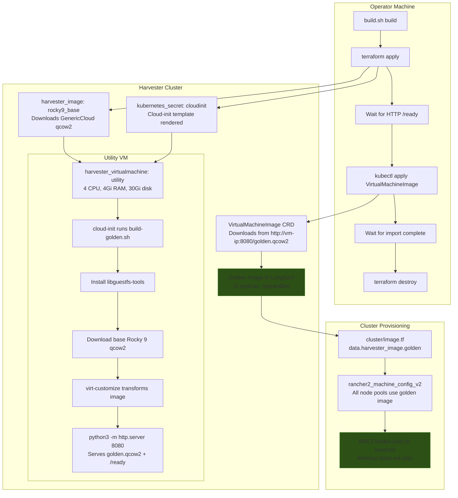
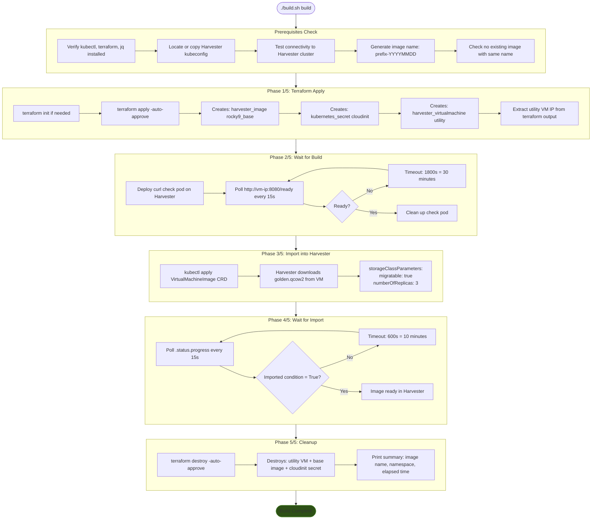
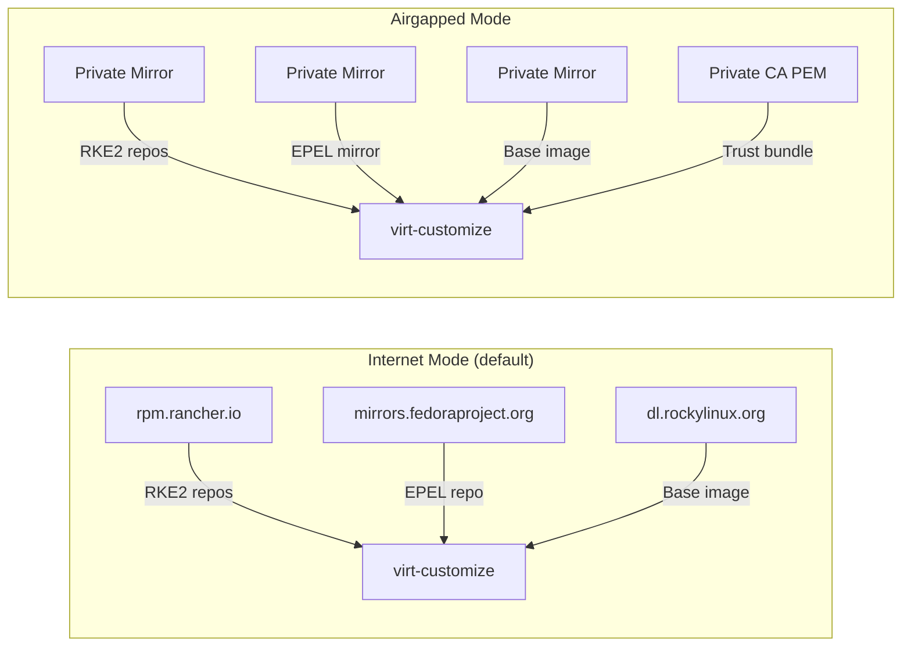
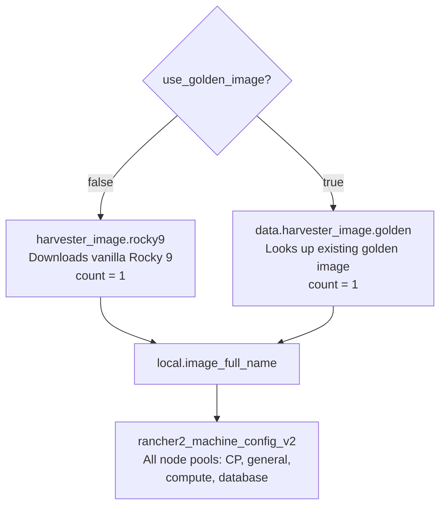
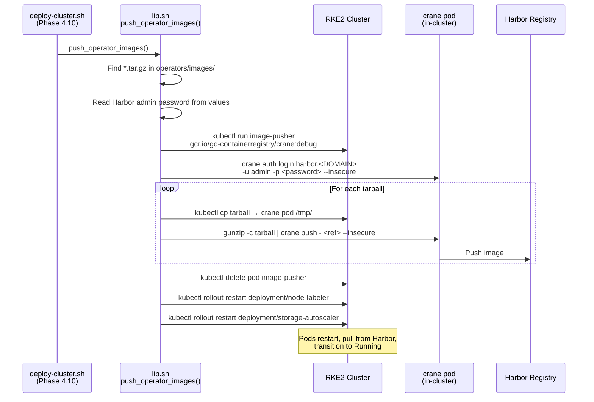
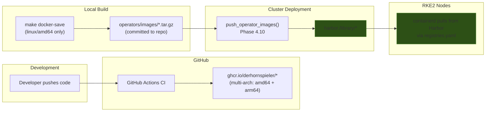
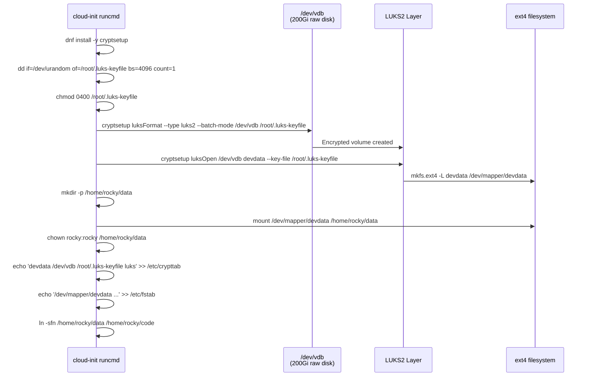
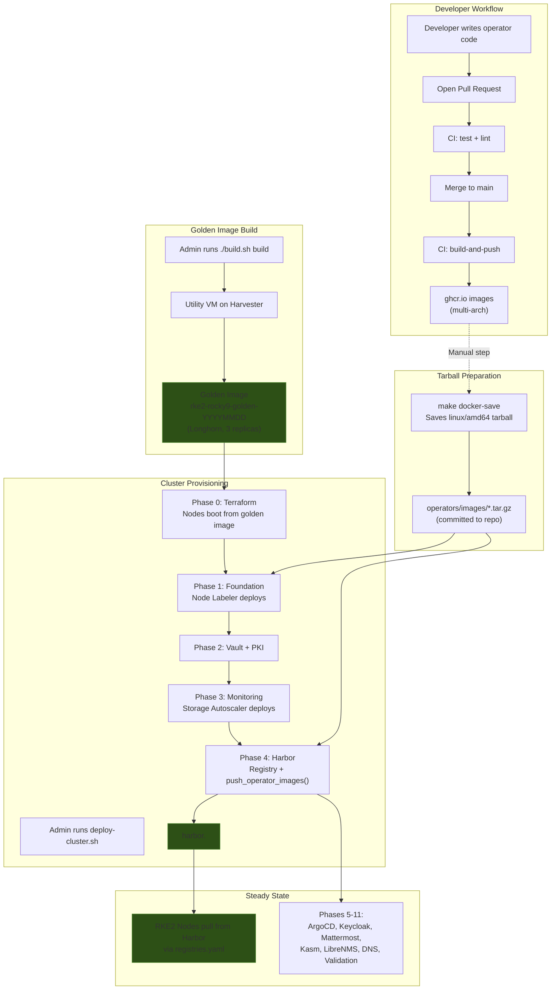

# Golden Image & CI/CD Engineering Guide

> **Scope**: This document covers the golden image build system, CI/CD pipelines
> for custom operators, the developer VM, and the integration points that tie
> these components together in an end-to-end RKE2 cluster lifecycle.

> **Note**: Throughout this document, `<DOMAIN>` refers to the root domain
> configured in `scripts/.env` (e.g., `example.com`).

---

## Table of Contents

- [Part 1: Golden Image Build System](#part-1-golden-image-build-system)
  - [1. Architecture Overview](#1-architecture-overview)
  - [2. What Gets Baked](#2-what-gets-baked)
  - [3. Build Process Flow](#3-build-process-flow)
  - [4. virt-customize Operations](#4-virt-customize-operations)
  - [5. Cloud-Init Template](#5-cloud-init-template)
  - [6. Variable Reference](#6-variable-reference)
  - [7. Airgapped Mode](#7-airgapped-mode)
  - [8. How Golden Image Connects to Cluster](#8-how-golden-image-connects-to-cluster)
  - [9. Maintenance](#9-maintenance)
  - [10. Troubleshooting](#10-troubleshooting)
- [Part 2: CI/CD Pipelines](#part-2-cicd-pipelines)
  - [11. GitHub Actions Architecture](#11-github-actions-architecture)
  - [12. Pipeline Triggers](#12-pipeline-triggers)
  - [13. Build and Push](#13-build-and-push)
  - [14. Operator Image Bootstrap](#14-operator-image-bootstrap)
  - [15. Container Image Registry](#15-container-image-registry)
- [Part 3: Dev VM](#part-3-dev-vm)
  - [16. Purpose and Design](#16-purpose-and-design)
  - [17. LUKS Encryption](#17-luks-encryption)
  - [18. Pre-installed Tools](#18-pre-installed-tools)
  - [19. Usage](#19-usage)
- [Part 4: Cross-Component Integration](#part-4-cross-component-integration)
  - [20. End-to-End Flow](#20-end-to-end-flow)
  - [21. Shared Infrastructure](#21-shared-infrastructure)
  - [22. Version Matrix](#22-version-matrix)

---

# Part 1: Golden Image Build System

## 1. Architecture Overview

The golden image build system creates a pre-baked Rocky 9 qcow2 image containing
all static RKE2 node configuration. Rather than installing packages and applying
configuration at every node boot via cloud-init (which is slow and
network-dependent), the golden image bakes these artifacts into the disk image
once. Nodes provisioned from the golden image boot faster and require only
minimal cloud-init (SSH keys and Cilium manifests).

The build runs inside Harvester itself: a temporary "utility VM" downloads the
base Rocky 9 image, transforms it using `virt-customize`, then serves the result
over HTTP so Harvester can import it as a `VirtualMachineImage`.



### Key Design Decisions

| Decision | Rationale |
|----------|-----------|
| Build inside Harvester | The operator machine may not be on the VM network; the utility VM is |
| HTTP serving via Python | Simple, zero-dependency; Harvester natively supports HTTP image import |
| Check pod for readiness | Operator machine cannot reach VM IP directly; a curl pod on Harvester can |
| Terraform for lifecycle | Declarative creation and cleanup of all transient resources |
| Longhorn 3-replica storage | Golden image is durable and migratable across Harvester nodes |

---

## 2. What Gets Baked

The golden image contains everything a node needs at boot time except SSH keys,
Cilium L2 manifests, and RKE2 itself (which Rancher provisions). Below is the
complete inventory of what `virt-customize` embeds in the qcow2.

### YUM Repositories

| Repository | File | Source |
|-----------|------|--------|
| Rancher RKE2 Common | `/etc/yum.repos.d/rancher-rke2-common.repo` | `rpm.rancher.io/rke2/latest/common/centos/9/noarch` |
| Rancher RKE2 1.34 | `/etc/yum.repos.d/rancher-rke2-1-34.repo` | `rpm.rancher.io/rke2/latest/1.34/centos/9/x86_64` |
| EPEL 9 | `/etc/yum.repos.d/epel.repo` | Fedora EPEL metalink |

### Installed Packages

| Package | Purpose |
|---------|---------|
| `qemu-guest-agent` | Harvester/KubeVirt VM management, IP reporting |
| `iptables` + `iptables-services` | Firewall rules (replaces firewalld) |
| `container-selinux` | SELinux policies for container runtimes |
| `policycoreutils-python-utils` | SELinux management tools (`semanage`, `audit2allow`) |
| `audit` | Kernel audit framework |
| `rke2-selinux` | SELinux policies specific to RKE2 |

### Dracut Configuration

**File**: `/etc/dracut.conf.d/virtio.conf`

```ini
hostonly=no
hostonly_cmdline=no
force_drivers+=" virtio_blk virtio_net virtio_scsi virtio_pci virtio_console "
```

This is critical: `virt-customize` runs `dracut` inside a libguestfs appliance
where no virtio hardware is detected. Without `hostonly=no`, dracut builds a
hostonly initramfs that omits virtio drivers, and the VM fails to boot on
KubeVirt/Harvester. After copying this config, the build explicitly regenerates
initramfs for every installed kernel:

```bash
for kver in $(ls /lib/modules/); do
  dracut --force --no-hostonly --kver "$kver" \
    --force-drivers "virtio_blk virtio_net virtio_scsi virtio_pci virtio_console"
done
```

### iptables Rules

**File**: `/etc/sysconfig/iptables` (mode `0600`)

Default policy: `INPUT DROP`, `FORWARD ACCEPT`, `OUTPUT ACCEPT`.

| Port(s) | Protocol | Purpose |
|---------|----------|---------|
| `lo` (interface) | all | Loopback |
| ESTABLISHED,RELATED | all | Stateful tracking |
| ICMP | icmp | Ping |
| 22 | TCP | SSH |
| 6443 | TCP | Kubernetes API server |
| 9345 | TCP | RKE2 supervisor API |
| 2379-2381 | TCP | etcd client + peer + metrics |
| 10250 | TCP | Kubelet API |
| 10257 | TCP | kube-controller-manager |
| 10259 | TCP | kube-scheduler |
| 30000-32767 | TCP/UDP | NodePort services |
| 4240 | TCP | Cilium health checks |
| 8472 | UDP | VXLAN (Cilium overlay) |
| 4244 | TCP | Hubble server |
| 4245 | TCP | Hubble relay |
| 9962 | TCP | Cilium Prometheus metrics |

### Sysctl Configuration

**File**: `/etc/sysctl.d/90-arp.conf`

```ini
net.ipv4.conf.all.arp_ignore=1
net.ipv4.conf.all.arp_announce=2
```

These settings prevent ARP flux on multi-homed VMs (workers have two NICs).
`arp_ignore=1` causes the kernel to respond to ARP requests only on the
interface holding the target IP. `arp_announce=2` restricts ARP source addresses
to the best local address for the target.

### NetworkManager Dispatcher Script

**File**: `/etc/NetworkManager/dispatcher.d/10-ingress-routing` (mode `0755`)

This script sets up policy routing for the second NIC (`eth1`) on worker nodes.
Workers have a dual-NIC configuration: `eth0` for cluster traffic and `eth1`
for ingress/services traffic. Without policy routing, return traffic from
`eth1`'s IP would exit via `eth0` (the default route), causing asymmetric
routing failures.

The script:
1. Triggers only when `eth1` comes up
2. Adds routing table `200 ingress` to `/etc/iproute2/rt_tables`
3. Creates a policy rule: traffic _from_ `eth1`'s IP uses table `ingress`
4. Populates the `ingress` table with a default gateway and subnet route via `eth1`

### SELinux

The golden image runs with SELinux enabled. The build:
1. Installs `container-selinux` and `rke2-selinux` for proper labeling
2. Runs `restorecon -R /etc/NetworkManager/dispatcher.d/` to fix labels on the
   custom dispatcher script
3. Performs a full `--selinux-relabel` as the final virt-customize step to ensure
   all files have correct security contexts

### GRUB Boot Loader Fix

**File**: `/tmp/bake/fix-grub.sh` (runs inside virt-customize)

When `virt-customize` runs `--update` and a new kernel is installed, the kernel
RPM post-install script reads `/proc/cmdline` from the libguestfs appliance
(not the target image). This contaminates BLS (Boot Loader Specification)
entries with appliance-specific parameters:

- Wrong `root=UUID=...`
- `guestfs_network=1`
- `TERM=vt220`, `selinux=0`, `cgroup_disable=memory`
- `usbcore.nousb`, `cryptomgr.notests`, `edd=off`

The fix script:
1. Determines the correct root filesystem UUID via `blkid`
2. Iterates all BLS entries in `/boot/loader/entries/*.conf`
3. Fixes the `root=UUID=` parameter
4. Strips all libguestfs contamination parameters
5. Ensures `net.ifnames=0` is present (Rocky 9 GenericCloud standard)

### System Cleanup

The build finalizes with these cleanup operations:

| Operation | Purpose |
|-----------|---------|
| `dnf clean all` + `rm -rf /var/cache/dnf/*` | Remove package cache to reduce image size |
| `truncate -s 0 /etc/machine-id` | Force systemd to generate a unique machine ID on first boot |
| `rm -f /etc/ssh/ssh_host_*` | Force SSH host key regeneration per-node |
| `systemctl enable qemu-guest-agent` | Ensure guest agent starts on boot |
| `systemctl disable firewalld` | Prevent firewalld from conflicting with iptables |
| `systemctl enable iptables` | Activate iptables-services on boot |
| `--selinux-relabel` | Full filesystem SELinux relabel |

### Directory Pre-creation

```
/var/lib/rancher/rke2/server/manifests
```

This directory must exist before RKE2 starts so that static manifests (Cilium
LB IP pool, L2 announcement policy) placed by cloud-init are picked up on
first boot.

---

## 3. Build Process Flow

The build is orchestrated by `golden-image/build.sh` and proceeds through five
distinct phases.



### Timing Expectations

| Phase | Typical Duration | Timeout |
|-------|-----------------|---------|
| Phase 1: Terraform Apply | 3-5 minutes | 30 min (Harvester image download) |
| Phase 2: Wait for Build | 8-15 minutes | 30 min |
| Phase 3: Import | Instant (CRD apply) | -- |
| Phase 4: Wait for Import | 2-5 minutes | 10 min |
| Phase 5: Cleanup | 1-2 minutes | -- |
| **Total** | **15-25 minutes** | -- |

---

## 4. virt-customize Operations

The single `virt-customize` invocation inside the utility VM performs the
following operations in order. Each line maps to a specific purpose.

```
virt-customize -a /output/golden.qcow2 --memsize 2048 \
```

| # | Operation | What It Does |
|---|-----------|-------------|
| 1* | `--copy-in private-ca.pem:/etc/pki/ca-trust/source/anchors/` | (Airgapped only) Inject private CA certificate |
| 2* | `--run-command 'update-ca-trust'` | (Airgapped only) Rebuild CA trust bundle |
| 3 | `--copy-in rancher-rke2-common.repo:/etc/yum.repos.d/` | Add RKE2 Common yum repository |
| 4 | `--copy-in rancher-rke2-1-34.repo:/etc/yum.repos.d/` | Add RKE2 1.34 yum repository |
| 5 | `--copy-in epel.repo:/etc/yum.repos.d/` | Add EPEL 9 yum repository |
| 6 | `--mkdir /etc/dracut.conf.d` | Ensure dracut config directory exists |
| 7 | `--copy-in virtio.conf:/etc/dracut.conf.d/` | Install virtio driver dracut configuration |
| 8 | `--update` | Run `dnf update -y` (full system update) |
| 9 | `--run /tmp/bake/fix-grub.sh` | Fix GRUB BLS entries contaminated by libguestfs |
| 10 | `--install qemu-guest-agent,iptables,...` | Install all required packages |
| 11 | `--run-command 'dnf install -y rke2-selinux'` | Install rke2-selinux (separate for repo dep ordering) |
| 12 | `--copy-in iptables:/etc/sysconfig/` | Install iptables firewall rules |
| 13 | `--run-command 'chmod 0600 /etc/sysconfig/iptables'` | Restrict iptables file permissions |
| 14 | `--copy-in 90-arp.conf:/etc/sysctl.d/` | Install ARP sysctl settings |
| 15 | `--mkdir /etc/NetworkManager/dispatcher.d` | Ensure NM dispatcher directory exists |
| 16 | `--copy-in 10-ingress-routing:/etc/NetworkManager/dispatcher.d/` | Install ingress policy routing script |
| 17 | `--run-command 'chmod 0755 .../10-ingress-routing'` | Set executable permission on dispatcher script |
| 18 | `--run-command 'mkdir -p /var/lib/rancher/rke2/server/manifests'` | Pre-create RKE2 manifests directory |
| 19 | `--run-command 'systemctl enable qemu-guest-agent.service'` | Enable guest agent on boot |
| 20 | `--run-command 'systemctl disable firewalld \|\| true'` | Disable firewalld (replaced by iptables) |
| 21 | `--run-command 'systemctl enable iptables'` | Enable iptables-services on boot |
| 22 | `--run-command 'restorecon -R ...'` | Fix SELinux contexts on dispatcher script |
| 23 | `--run-command 'for kver in ...; do dracut ...; done'` | Rebuild initramfs with virtio drivers for all kernels |
| 24 | `--run-command 'dnf clean all'` | Clean dnf caches |
| 25 | `--run-command 'rm -rf /var/cache/dnf/*'` | Remove residual cache files |
| 26 | `--run-command 'truncate -s 0 /etc/machine-id'` | Clear machine ID for uniqueness on clone |
| 27 | `--run-command 'rm -f /etc/ssh/ssh_host_*'` | Remove SSH host keys for regeneration |
| 28 | `--selinux-relabel` | Full filesystem SELinux relabel |

\* Operations 1-2 are conditional on `airgapped = true`.

### Execution Environment

- **Memory**: 2048 MB (`--memsize 2048`) allocated to the libguestfs appliance
- **Backend**: `LIBGUESTFS_BACKEND=direct` (no libvirtd dependency)
- **Host**: Runs on the utility VM (Rocky 9 with libguestfs-tools-c installed)

---

## 5. Cloud-Init Template

**File**: `golden-image/templates/cloud-init.yaml.tpl`

This cloud-init configuration runs on the **utility VM**, not on the golden
image itself. It has four responsibilities:

### Section 1: SSH Keys (Optional)

```yaml
ssh_authorized_keys:
  - ssh-ed25519 AAAA... user@host
```

Injected from `var.ssh_authorized_keys`. These keys provide debug SSH access to
the utility VM during the build. They are NOT baked into the golden image.

### Section 2: write_files -- Bake Material

All files under `/tmp/bake/` are staging material that `virt-customize` copies
into the qcow2. The template conditionally renders different content based on
the `airgapped` variable:

| File | Airgapped = false | Airgapped = true |
|------|-------------------|------------------|
| `rancher-rke2-common.repo` | `rpm.rancher.io` with GPG check | Private mirror URL, `gpgcheck=0` |
| `rancher-rke2-1-34.repo` | `rpm.rancher.io` with GPG check | Private mirror URL, `gpgcheck=0` |
| `epel.repo` | Fedora metalink with GPG check | Private mirror URL, `gpgcheck=0` |
| `private-ca.pem` | Not created | PEM from `var.private_ca_pem` |

Static files (identical in both modes):

| File | Destination in Golden Image |
|------|---------------------------|
| `virtio.conf` | `/etc/dracut.conf.d/virtio.conf` |
| `iptables` | `/etc/sysconfig/iptables` |
| `90-arp.conf` | `/etc/sysctl.d/90-arp.conf` |
| `10-ingress-routing` | `/etc/NetworkManager/dispatcher.d/10-ingress-routing` |
| `fix-grub.sh` | Executed in-place by `virt-customize --run` |

### Section 3: Build Script

**File**: `/tmp/build-golden.sh`

This is the main build logic. It runs as a `runcmd` and performs four steps:

1. **Install libguestfs-tools-c** on the utility VM (plus CA trust update if airgapped)
2. **Download base Rocky 9 qcow2** via curl with retries
3. **Run virt-customize** (the single large invocation detailed in section 4)
4. **Signal completion**: creates `/output/ready` and serves `/output/` on port 8080

All output is tee'd to `/var/log/build-golden.log` for debugging.

### Section 4: runcmd

```yaml
runcmd:
  - /tmp/build-golden.sh
```

A single command triggers the entire build pipeline.

---

## 6. Variable Reference

All variables are defined in `golden-image/variables.tf`.

### Required Variables

| Variable | Type | Description |
|----------|------|-------------|
| `vm_namespace` | `string` | Harvester namespace (must match the cluster VMs namespace) |
| `harvester_network_name` | `string` | Harvester VM network name |
| `harvester_network_namespace` | `string` | Harvester VM network namespace |

### Optional Variables

| Variable | Type | Default | Description |
|----------|------|---------|-------------|
| `harvester_kubeconfig_path` | `string` | `"./kubeconfig-harvester.yaml"` | Path to Harvester kubeconfig file |
| `rocky_image_url` | `string` | Rocky 9 GenericCloud URL | Base qcow2 URL (or internal mirror for airgapped) |
| `builder_cpu` | `number` | `4` | vCPUs for utility VM (more = faster dnf) |
| `builder_memory` | `string` | `"4Gi"` | Memory for utility VM |
| `builder_disk_size` | `string` | `"30Gi"` | Disk for utility VM (holds 2x qcow2 + tools) |
| `image_name_prefix` | `string` | `"rke2-rocky9-golden"` | Prefix for golden image name (date is appended) |
| `ssh_authorized_keys` | `list(string)` | `[]` | SSH keys for debug access to utility VM |

### Airgapped Variables

| Variable | Type | Default | Required When |
|----------|------|---------|---------------|
| `airgapped` | `bool` | `false` | -- |
| `private_ca_pem` | `string` (sensitive) | `""` | `airgapped = true` |
| `private_rocky_repo_url` | `string` | `""` | `airgapped = true` |
| `private_rke2_repo_url` | `string` | `""` | `airgapped = true` |

Terraform enforces airgapped requirements via `lifecycle.precondition` blocks on
the utility VM resource. If `airgapped = true` and any of the three required
variables is empty, the plan fails with a descriptive error.

---

## 7. Airgapped Mode

When `airgapped = true`, the build system adapts to environments without
internet access.

### What Changes



### Configuration

In `terraform.tfvars`:

```hcl
airgapped              = true
private_ca_pem         = file("./private-ca.pem")
private_rocky_repo_url = "https://mirror.internal.example.com/rocky/9"
private_rke2_repo_url  = "https://mirror.internal.example.com/rke2"
rocky_image_url        = "https://mirror.internal.example.com/rocky/9/images/Rocky-9-GenericCloud-Base.latest.x86_64.qcow2"
```

### CA Certificate Injection (Two Places)

1. **Utility VM itself**: The build script copies `private-ca.pem` into the
   utility VM's trust store and runs `update-ca-trust` before `dnf install`
   (so the utility VM can reach the private mirror).

2. **Golden image**: `virt-customize` copies the same PEM into the qcow2's
   `/etc/pki/ca-trust/source/anchors/` and runs `update-ca-trust` inside the
   image (so cluster nodes trust the private mirror and internal services).

### Repository Differences

| Aspect | Internet | Airgapped |
|--------|----------|-----------|
| GPG checking | Enabled (`gpgcheck=1`) | Disabled (`gpgcheck=0`) |
| RPM GPG key | Downloaded from upstream | Not needed (trusted mirror) |
| Base URL | Public CDN/metalink | Private mirror URL |

### Mirror URL Structure

The private mirror must serve these paths:

```
${private_rocky_repo_url}/epel/9/Everything/x86_64      # EPEL packages
${private_rke2_repo_url}/common/centos/9/noarch          # rke2-selinux, etc.
${private_rke2_repo_url}/1.34/centos/9/x86_64            # RKE2 1.34 binaries
```

---

## 8. How Golden Image Connects to Cluster

### The use_golden_image Toggle

The cluster Terraform module (`cluster/`) has two variables that control
image selection:

```hcl
variable "use_golden_image" {
  description = "Use pre-baked golden image instead of vanilla Rocky 9"
  type        = bool
  default     = false
}

variable "golden_image_name" {
  description = "Name of golden image in Harvester (required when use_golden_image = true)"
  type        = string
  default     = ""
}
```

### Image Resolution (cluster/image.tf)



When `use_golden_image = false` (default), Terraform creates a `harvester_image`
resource that downloads the vanilla Rocky 9 GenericCloud qcow2. When
`use_golden_image = true`, it uses a `data` source to look up the pre-existing
golden image by name.

### Cloud-Init: Minimal vs Full

The most significant impact of the golden image is the reduction in cloud-init
complexity. The cluster module (`cluster/machine_config.tf`) maintains two
parallel cloud-init configurations for each node role.

#### Control Plane Nodes

| Aspect | Full (vanilla Rocky 9) | Golden (pre-baked) |
|--------|----------------------|-------------------|
| `package_update` | yes | omitted |
| `package_upgrade` | yes | omitted |
| `packages:` | 6 packages | omitted |
| `write_files:` repos | 3 repo files | omitted |
| `write_files:` iptables | full rules | omitted |
| `write_files:` Cilium manifests | yes | yes |
| `runcmd:` | 5 commands | omitted |
| SSH keys | yes | yes |
| **Boot time impact** | 3-5 min cloud-init | <30s cloud-init |

#### Worker Nodes

| Aspect | Full (vanilla Rocky 9) | Golden (pre-baked) |
|--------|----------------------|-------------------|
| `package_update` | yes | omitted |
| `package_upgrade` | yes | omitted |
| `packages:` | 6 packages | omitted |
| `write_files:` repos | 3 repo files | omitted |
| `write_files:` iptables | full rules | omitted |
| `write_files:` sysctl | `90-arp.conf` | omitted |
| `write_files:` NM dispatcher | ingress routing script | omitted |
| `runcmd:` | 6 commands | omitted |
| SSH keys | yes | yes |

#### Golden Mode CP Cloud-Init (Complete)

```yaml
#cloud-config

ssh_authorized_keys:
  - ssh-ed25519 AAAA...

write_files:
- path: /var/lib/rancher/rke2/server/manifests/cilium-lb-ippool.yaml
  permissions: '0644'
  content: |
    apiVersion: "cilium.io/v2alpha1"
    kind: CiliumLoadBalancerIPPool
    metadata:
      name: ingress-pool
    spec:
      blocks:
        - start: "198.51.100.2"
          stop: "198.51.100.20"

- path: /var/lib/rancher/rke2/server/manifests/cilium-l2-policy.yaml
  permissions: '0644'
  content: |
    apiVersion: "cilium.io/v2alpha1"
    kind: CiliumL2AnnouncementPolicy
    metadata:
      name: l2-policy
    spec:
      serviceSelector:
        matchLabels: {}
      nodeSelector:
        matchExpressions:
          - key: node-role.kubernetes.io/control-plane
            operator: DoesNotExist
      interfaces:
        - ^eth1$
      externalIPs: true
      loadBalancerIPs: true
```

#### Golden Mode Worker Cloud-Init (Complete)

```yaml
#cloud-config

ssh_authorized_keys:
  - ssh-ed25519 AAAA...
```

That is the entire worker cloud-init when using the golden image -- SSH keys
only. Everything else is pre-baked.

### Enabling Golden Image in Cluster

After building, `build.sh` prints instructions:

```
To use this image in your cluster, set in cluster/terraform.tfvars:
  use_golden_image  = true
  golden_image_name = "rke2-rocky9-golden-20260215"
```

---

## 9. Maintenance

### When to Rebuild

| Trigger | Reason |
|---------|--------|
| Monthly security updates | Rocky 9 packages, kernel patches |
| RKE2 version bump | New repo URL (e.g., 1.34 to 1.35) |
| Firewall rule changes | Modified iptables policy |
| New package requirements | Additional packages needed at boot |
| Dracut/initramfs changes | Kernel driver changes |
| SELinux policy changes | New `container-selinux` or `rke2-selinux` version |

### Versioning Strategy

Images are named with a date suffix:

```
rke2-rocky9-golden-20260215
```

The `image_name_prefix` variable allows custom prefixes. Only one image per day
can be built (the script checks for name collisions).

### Lifecycle Management

```bash
# List all golden images
./build.sh list

# Build a new image (creates rke2-rocky9-golden-YYYYMMDD)
./build.sh build

# Delete an old image
./build.sh delete rke2-rocky9-golden-20260101

# Clean up after a failed build
./build.sh destroy
```

### Recommended Workflow

1. Build a new golden image
2. Test by provisioning a single node pool with the new image
3. Roll out to remaining pools by updating `golden_image_name` in `terraform.tfvars`
4. Delete old images after confirming stability (keep 2-3 recent images)

### Image Retention

Harvester stores golden images in Longhorn with 3 replicas. Each image consumes
approximately 1.5-2 GB of storage (compressed qcow2). Retain at minimum the
currently active image and one previous version for rollback.

---

## 10. Troubleshooting

### Common Build Failures

#### Build Times Out (Phase 2)

**Symptom**: `Timeout waiting for golden image build (1800s)`

**Diagnosis**:
```bash
# SSH into the utility VM (requires network access or Harvester console)
ssh rocky@<vm-ip>
cat /var/log/build-golden.log

# Or check VM status from Harvester
kubectl --kubeconfig=kubeconfig-harvester.yaml get vm -n <namespace>
```

**Common causes**:
- Slow network (base image download takes too long)
- DNF mirror issues inside virt-customize
- Insufficient disk space on the utility VM (increase `builder_disk_size`)

#### virt-customize Fails with virtio Errors

**Symptom**: `dracut: FATAL: Don't know how to handle ...` or boot failures

**Fix**: Verify `/tmp/bake/virtio.conf` contains `hostonly=no`. Ensure the
dracut rebuild loop runs for all installed kernels.

#### GRUB Contamination

**Symptom**: VMs fail to boot with "no such device" or "unknown filesystem"

**Fix**: Verify `fix-grub.sh` is running successfully. Check that it can
determine the correct root UUID via at least one of its three fallback methods.

#### Check Pod Cannot Reach VM

**Symptom**: Build completes but Phase 2 never sees `/ready`

**Fix**: Ensure the check pod and utility VM are in the same namespace and on
the same Harvester network. Verify the VM has an IP assigned
(`terraform output utility_vm_ip`).

#### Image Already Exists

**Symptom**: `Image 'rke2-rocky9-golden-YYYYMMDD' already exists`

**Fix**: Either delete the existing image (`./build.sh delete <name>`) or wait
until the next day.

#### Terraform State Issues

**Symptom**: `Error acquiring the state lock` or stale state

**Fix**: The golden image module uses a Kubernetes backend with
`secret_suffix = "golden-image"` in the `terraform-state` namespace. Check
for stale locks:

```bash
kubectl --kubeconfig=kubeconfig-harvester.yaml get secrets -n terraform-state \
  -l "app.kubernetes.io/managed-by=terraform" | grep golden
```

#### Utility VM Cleanup After Failure

If the build fails mid-way, transient resources may linger:

```bash
# Automatic cleanup
./build.sh destroy -auto-approve

# Manual cleanup
kubectl --kubeconfig=kubeconfig-harvester.yaml delete vm rke2-rocky9-golden-builder -n <namespace>
kubectl --kubeconfig=kubeconfig-harvester.yaml delete secret rke2-rocky9-golden-builder-cloudinit -n <namespace>
kubectl --kubeconfig=kubeconfig-harvester.yaml delete virtualmachineimage golden-builder-rocky9-base -n <namespace>
```

---

# Part 2: CI/CD Pipelines

## 11. GitHub Actions Architecture

The repository contains two GitHub Actions workflows, one per custom operator.
Both follow an identical structure.

```mermaid
graph TB
    subgraph "GitHub Repository"
        A[Push to main<br/>paths: operators/X/**] --> D
        B["Tag: X-v*"] --> D
        C[Pull Request<br/>paths: operators/X/**] --> D
        D{Event Type}
    end

    D -->|PR| E[test job]
    D -->|PR| F[lint job]
    D -->|Push/Tag| E
    D -->|Push/Tag| F
    D -->|Push/Tag| G[build-and-push job]

    subgraph "test job"
        E1[actions/checkout@v4]
        E2[actions/setup-go@v5<br/>go-version-file: go.mod]
        E3[make test]
        E1 --> E2 --> E3
    end

    subgraph "lint job (non-blocking)"
        F1[actions/checkout@v4]
        F2[actions/setup-go@v5]
        F3[golangci-lint-action@v6]
        F1 --> F2 --> F3
    end

    subgraph "build-and-push job"
        G1[actions/checkout@v4]
        G2[docker/login-action@v3<br/>Registry: ghcr.io]
        G3[docker/setup-buildx-action@v3]
        G4[docker/metadata-action@v5<br/>Tags: branch, semver, sha]
        G5["docker/build-push-action@v6<br/>Platforms: linux/amd64, linux/arm64"]
        G1 --> G2 --> G3 --> G4 --> G5
    end

    E -->|needs: test| G

    G5 --> H["ghcr.io/derhornspieler/node-labeler<br/>ghcr.io/derhornspieler/storage-autoscaler"]

    style H fill:#2d5016,stroke:#4a8529

    E --> E1
    F --> F1
    G --> G1
```

### Job Dependencies

| Job | Depends On | Blocks Build? | Runs On |
|-----|-----------|---------------|---------|
| `test` | -- | Yes (build-and-push needs test) | `ubuntu-latest` |
| `lint` | -- | No (`continue-on-error: true`) | `ubuntu-latest` |
| `build-and-push` | `test` | -- | `ubuntu-latest` |

The `lint` job uses `continue-on-error: true` because `golangci-lint` may not
yet support the Go version used by the operator (the comment explicitly notes
this). Linting failures produce warnings but do not block the pipeline.

---

## 12. Pipeline Triggers

### Complete Trigger Matrix

| Event | Path Filter | node-labeler | storage-autoscaler | build-and-push? |
|-------|------------|-------------|-------------------|----------------|
| `push` to `main` | `operators/node-labeler/**` | Yes | -- | Yes |
| `push` to `main` | `operators/storage-autoscaler/**` | -- | Yes | Yes |
| Tag `node-labeler-v*` | -- | Yes | -- | Yes |
| Tag `storage-autoscaler-v*` | -- | Yes | -- | Yes |
| Pull Request | `operators/node-labeler/**` | Yes | -- | No (test + lint only) |
| Pull Request | `operators/storage-autoscaler/**` | -- | Yes | No (test + lint only) |

### Key Behaviors

- **Path filtering**: Workflows only trigger when files in the operator's
  directory change, preventing unnecessary builds when other parts of the
  repository are modified.

- **PR gating**: Pull requests run `test` and `lint` but never `build-and-push`
  (`if: github.event_name == 'push'` guard).

- **Tag-triggered releases**: Tags matching `<operator>-v*` trigger a full
  pipeline including build-and-push with a semantic version tag.

---

## 13. Build and Push

### Multi-Architecture Builds

Both pipelines build for `linux/amd64` and `linux/arm64` using Docker Buildx:

```yaml
platforms: linux/amd64,linux/arm64
```

The Dockerfile uses a multi-stage build with `TARGETOS` and `TARGETARCH` build
arguments:

```dockerfile
FROM golang:1.25 AS builder
ARG TARGETOS
ARG TARGETARCH
RUN CGO_ENABLED=0 GOOS=${TARGETOS:-linux} GOARCH=${TARGETARCH} go build -a -o manager cmd/main.go

FROM gcr.io/distroless/static:nonroot
COPY --from=builder /workspace/manager .
```

### GHCR (GitHub Container Registry)

Images are pushed to `ghcr.io` using the repository's `GITHUB_TOKEN`:

| Operator | Image Path |
|----------|-----------|
| Node Labeler | `ghcr.io/derhornspieler/node-labeler` |
| Storage Autoscaler | `ghcr.io/derhornspieler/storage-autoscaler` |

### Tagging Strategy

The `docker/metadata-action@v5` generates tags using three rules:

| Rule | Pattern | Example Output |
|------|---------|---------------|
| `type=ref,event=branch` | Branch name | `main` |
| `type=match,pattern=<op>-v(.*),group=1` | Semver from tag | `0.1.0` |
| `type=sha,prefix=` | Git commit SHA | `a1b2c3d` |

A push to `main` produces tags like: `main`, `a1b2c3d`.
A tag `node-labeler-v0.2.0` produces tags like: `0.2.0`, `a1b2c3d`.

### Build Caching

Both pipelines use GitHub Actions cache for Docker layers:

```yaml
cache-from: type=gha
cache-to: type=gha,mode=max
```

This stores layer cache in the GitHub Actions cache service, significantly
speeding up subsequent builds when only application code changes (Go module
downloads and base image layers are cached).

### Permissions

```yaml
permissions:
  contents: read     # Checkout code
  packages: write    # Push to GHCR
```

---

## 14. Operator Image Bootstrap

### The Chicken-and-Egg Problem

The cluster deployment proceeds in phases:

| Phase | What Deploys | Image Source |
|-------|-------------|-------------|
| Phase 1: Foundation | Node Labeler operator | No registry available |
| Phase 3: Monitoring | Storage Autoscaler operator | No registry available |
| Phase 4: Harbor | Harbor container registry | -- |

Operators deploy before Harbor exists. Their pods enter `ErrImagePull` because
no registry serves the images yet.

### Pre-Built Image Tarballs

**Directory**: `operators/images/`

| File | Target Image |
|------|-------------|
| `node-labeler-v0.1.0-amd64.tar.gz` | `harbor.<DOMAIN>/library/node-labeler:v0.1.0` |
| `storage-autoscaler-v0.1.0-amd64.tar.gz` | `harbor.<DOMAIN>/library/storage-autoscaler:v0.1.0` |

These are Docker-format tar archives created by `make docker-save`, then gzip
compressed. They are committed to the repository and carried through deployment.

### Building Tarballs

From each operator directory:

```bash
cd operators/node-labeler
make docker-save IMG=harbor.<DOMAIN>/library/node-labeler:v0.1.0

cd operators/storage-autoscaler
make docker-save IMG=harbor.<DOMAIN>/library/storage-autoscaler:v0.1.0
```

The `docker-save` Makefile target:
1. Builds a `linux/amd64` image via `docker buildx build --platform=linux/amd64 --load`
2. Runs `docker save <image> | gzip` to produce the tarball
3. Saves to `../images/<name>-<version>-amd64.tar.gz`

### push_operator_images() Flow

Called at the end of Phase 4 (after Harbor is ready), this function in
`scripts/lib.sh` pushes the tarballs into Harbor.



### Why crane Instead of Docker?

The function uses a `crane` pod inside the cluster rather than Docker on the
operator machine because:

1. The operator machine may not have the Vault Root CA in its trust store (it is
   set up in Phase 2, and nodes may not trust it yet for Docker pulls at Phase 4)
2. `crane --insecure` bypasses TLS verification for the push
3. The in-cluster pod has direct network access to Harbor on the cluster network

### Tarball Name Parsing

Filenames follow the convention `<name>-v<version>-<arch>.tar.gz`:

```
node-labeler-v0.1.0-amd64.tar.gz
  name = "node-labeler"      (everything before -v)
  tag  = "v0.1.0"            (version including v prefix)
  ref  = "harbor.<DOMAIN>/library/node-labeler:v0.1.0"
```

---

## 15. Container Image Registry

### Image Flow: Development to Production



### Registry Chain

| Stage | Registry | Purpose |
|-------|----------|---------|
| CI/CD | `ghcr.io/derhornspieler/<operator>` | Canonical build artifacts, multi-arch |
| Bootstrap | `operators/images/*.tar.gz` | Offline bootstrap before Harbor exists |
| Production | `harbor.<DOMAIN>/library/<operator>` | In-cluster registry, all nodes pull from here |

### Registries.yaml

Rancher configures `/etc/rancher/rke2/registries.yaml` on each node via the
cluster registries API (configured during Phase 4). This directs containerd to
pull operator images from the in-cluster Harbor instance, using the Vault Root
CA for TLS verification.

---

# Part 3: Dev VM

## 16. Purpose and Design

The developer VM provides a full Rocky 9 workstation running on Harvester,
designed for:

- Developing and testing cluster operations from within the same network
- Running `terraform`, `kubectl`, `helm` against the cluster
- AI-assisted development with Claude Code
- Persistent encrypted storage for source code and credentials

### Architecture

| Component | Specification |
|-----------|--------------|
| OS | Rocky 9 GenericCloud |
| vCPUs | 8 (default) |
| Memory | 16Gi (default) |
| OS Disk | 50Gi (virtio, boot) |
| Data Disk | 200Gi (virtio, LUKS-encrypted) |
| Machine Type | q35 with EFI boot |
| Network | Single NIC on VM network |

The VM is managed entirely through Terraform with its own state backend
(`secret_suffix = "dev-vm"` in the `terraform-state` namespace).

---

## 17. LUKS Encryption

The data disk (`/dev/vdb`) is encrypted with LUKS2 via cloud-init `runcmd`
commands executed on first boot.

### Setup Sequence



### Key Details

| Aspect | Detail |
|--------|--------|
| Key file | `/root/.luks-keyfile` (4096 bytes from `/dev/urandom`, mode `0400`) |
| Encryption | LUKS2 format |
| Mount point | `/home/rocky/data` |
| Symlink | `/home/rocky/code` -> `/home/rocky/data` |
| Auto-unlock | Via `/etc/crypttab` entry on reboot |
| Persistence | Via `/etc/fstab` entry |

---

## 18. Pre-installed Tools

Cloud-init installs the following packages and tools on first boot:

### System Packages (via dnf)

| Package | Purpose |
|---------|---------|
| `qemu-guest-agent` | Harvester VM management |
| `tmux` | Terminal multiplexer |
| `htop` | Process monitor |
| `tree` | Directory visualization |
| `unzip` | Archive extraction |
| `bash-completion` | Shell auto-completion |
| `git` | Version control |
| `make` | Build automation |
| `gcc` | C compiler |
| `golang` | Go programming language |
| `python3` + `python3-pip` | Python runtime |
| `jq` | JSON processor |
| `openssl` | TLS/crypto tools |
| `curl` + `wget` | HTTP clients |
| `cryptsetup` | LUKS disk encryption |
| `dnf-automatic` | Automated security updates |

### Additional Tools (via runcmd)

| Tool | Installation Method |
|------|-------------------|
| Node.js 22 + npm | dnf module or NodeSource RPM |
| Claude Code | `npm install -g @anthropic-ai/claude-code` |
| kubectl | Direct binary download from `dl.k8s.io` |
| Helm 3 | Official `get-helm-3` installer script |
| Terraform | HashiCorp RPM repository |

### Automated Security Updates

```ini
[commands]
upgrade_type = security
apply_updates = yes
```

The `dnf-automatic-install.timer` is enabled to apply security updates
automatically.

---

## 19. Usage

The dev VM is managed through `dev-vm/dev-vm.sh`, which wraps Terraform
operations with kubeconfig management.

### Commands

```bash
# Provision the VM (plan + apply)
./dev-vm.sh apply

# SSH into the VM (auto-attaches tmux session)
./dev-vm.sh ssh

# Destroy the VM
./dev-vm.sh destroy -auto-approve

# Run any Terraform command
./dev-vm.sh output ssh_command
./dev-vm.sh state list
./dev-vm.sh plan
```

### Kubeconfig Resolution

The script tries three methods to locate the Harvester kubeconfig:

1. `dev-vm/kubeconfig-harvester.yaml` (local file)
2. Symlink from `cluster/kubeconfig-harvester.yaml`
3. Extract from `~/.kube/config` (context named `harvester`)

### SSH with tmux

The `ssh` command automatically attaches to an existing tmux session or creates
a new one:

```bash
ssh rocky@<vm-ip> -t 'tmux attach -t dev 2>/dev/null || tmux new -s dev'
```

### Terraform State

State is stored in a Kubernetes secret on the Harvester cluster:

```hcl
backend "kubernetes" {
  secret_suffix = "dev-vm"
  namespace     = "terraform-state"
  config_path   = "kubeconfig-harvester.yaml"
}
```

---

# Part 4: Cross-Component Integration

## 20. End-to-End Flow



### Flow Summary

1. **Development**: Code changes go through PR -> CI test/lint -> merge -> CI build
2. **Image preparation**: Multi-arch images land in GHCR; tarballs are built
   locally via `make docker-save` and committed to the repo
3. **Golden image**: Built independently on Harvester, contains OS-level config
   but not operator images
4. **Cluster deployment**: Terraform provisions nodes from the golden image,
   then `deploy-cluster.sh` walks through 12 phases (0-11)
5. **Bootstrap resolution**: At Phase 4.10, `push_operator_images()` loads
   tarballs into Harbor, restarting operator pods to transition from
   `ErrImagePull` to `Running`
6. **Steady state**: All nodes pull from Harbor; future updates flow through
   CI -> GHCR -> Harbor

---

## 21. Shared Infrastructure

### Terraform State Backends

All Terraform modules use the Kubernetes backend on Harvester for state storage:

| Module | Secret Suffix | Namespace |
|--------|--------------|-----------|
| `cluster/` | `rke2-cluster` | `terraform-state` |
| `golden-image/` | `golden-image` | `terraform-state` |
| `dev-vm/` | `dev-vm` | `terraform-state` |

All modules reference `kubeconfig-harvester.yaml` for both the backend and the
Harvester provider. This kubeconfig must be placed in each module's directory
(or symlinked).

### Harvester Provider

All three modules use the same Harvester provider:

```hcl
provider "harvester" {
  kubeconfig = var.harvester_kubeconfig_path
}
```

The cluster module additionally uses the Rancher2 provider for RKE2 cluster
management.

### Namespace Sharing

The `vm_namespace` variable must match across modules:

| Resource | Namespace Source |
|----------|----------------|
| Golden image VirtualMachineImage | `golden-image/var.vm_namespace` |
| Golden image data source lookup | `cluster/var.vm_namespace` |
| Cluster VM nodes | `cluster/var.vm_namespace` |
| Dev VM | `dev-vm/var.vm_namespace` |

### Network Sharing

The golden image builder VM and cluster nodes use the same Harvester network.
This is required for the golden image build (check pod must reach the utility
VM) and for cluster node connectivity.

---

## 22. Version Matrix

All component versions referenced across the codebase:

### Infrastructure

| Component | Version Constraint | Source |
|-----------|-------------------|--------|
| Terraform | `>= 1.5.0` | `versions.tf` (all modules) |
| Harvester Provider | `~> 0.6` | `versions.tf` (all modules) |
| Rancher2 Provider | `~> 13.1` | `cluster/versions.tf` |
| Kubernetes Provider | `~> 2.0` | `golden-image/versions.tf` |

### Operating System

| Component | Version | Source |
|-----------|---------|--------|
| Rocky Linux | 9 (GenericCloud) | `rocky_image_url` default |
| SELinux | Enforcing | `container-selinux` + `rke2-selinux` |

### Kubernetes / RKE2

| Component | Version | Source |
|-----------|---------|--------|
| RKE2 | 1.34.x | `rancher-rke2-1-34.repo` |
| Kubernetes API | v0.35.0 | `operators/node-labeler/go.mod` |
| controller-runtime | v0.23.1 | `operators/node-labeler/go.mod` |

### CI/CD Actions

| Action | Version | Purpose |
|--------|---------|---------|
| `actions/checkout` | v4 | Repository checkout |
| `actions/setup-go` | v5 | Go toolchain |
| `docker/login-action` | v3 | GHCR authentication |
| `docker/setup-buildx-action` | v3 | Multi-platform builds |
| `docker/metadata-action` | v5 | Image tag generation |
| `docker/build-push-action` | v6 | Build and push images |
| `golangci/golangci-lint-action` | v6 | Go linting |

### Operator Build

| Component | Version | Source |
|-----------|---------|--------|
| Go | 1.25.x | `go.mod` / `Dockerfile` |
| golangci-lint | v2.7.2 | `Makefile` |
| Base image (runtime) | `gcr.io/distroless/static:nonroot` | `Dockerfile` |
| Prometheus client | v1.23.2 | `go.mod` |

### Operator Images

| Image | Version | Format |
|-------|---------|--------|
| `node-labeler` | v0.1.0 | `tar.gz` (amd64) + GHCR (multi-arch) |
| `storage-autoscaler` | v0.1.0 | `tar.gz` (amd64) + GHCR (multi-arch) |

### Dev VM Tools

| Tool | Version/Source |
|------|---------------|
| Node.js | 22 (dnf module) |
| kubectl | Latest stable (`dl.k8s.io/release/stable.txt`) |
| Helm | 3.x (latest via installer script) |
| Terraform | Latest (HashiCorp RPM repo) |
| Claude Code | Latest (npm global) |
| Go | System package (Rocky 9 AppStream) |

---

## File Reference

All source files documented in this guide:

| File | Purpose |
|------|---------|
| `golden-image/build.sh` | Build orchestrator (5-phase lifecycle) |
| `golden-image/main.tf` | Terraform: base image + cloudinit secret + utility VM |
| `golden-image/variables.tf` | All golden image variables |
| `golden-image/versions.tf` | Terraform and provider version constraints |
| `golden-image/providers.tf` | Harvester and Kubernetes provider config |
| `golden-image/outputs.tf` | Utility VM name, namespace, IP |
| `golden-image/templates/cloud-init.yaml.tpl` | Cloud-init for utility VM |
| `golden-image/terraform.tfvars.example` | Example variable configuration |
| `cluster/image.tf` | Conditional image resolution (golden vs vanilla) |
| `cluster/machine_config.tf` | Node pool configs with golden/full cloud-init |
| `cluster/variables.tf` | Cluster variables including `use_golden_image` |
| `cluster/versions.tf` | Cluster Terraform version constraints |
| `dev-vm/dev-vm.sh` | Dev VM management script |
| `dev-vm/main.tf` | Dev VM Terraform: image + cloud-init + VM |
| `dev-vm/variables.tf` | Dev VM variables |
| `dev-vm/versions.tf` | Dev VM Terraform version constraints |
| `dev-vm/providers.tf` | Dev VM Harvester provider |
| `dev-vm/outputs.tf` | Dev VM IP and SSH command |
| `.github/workflows/node-labeler.yml` | Node Labeler CI/CD pipeline |
| `.github/workflows/storage-autoscaler.yml` | Storage Autoscaler CI/CD pipeline |
| `operators/images/README.md` | Operator tarball documentation |
| `operators/node-labeler/Makefile` | Operator build targets including `docker-save` |
| `operators/node-labeler/Dockerfile` | Multi-stage Go build with distroless runtime |
| `scripts/lib.sh` | Library with `push_operator_images()` function |
| `scripts/deploy-cluster.sh` | 12-phase cluster deployment script (phases 0-11) |
| `.gitignore` | Excludes golden-image secrets, state, kubeconfigs |
