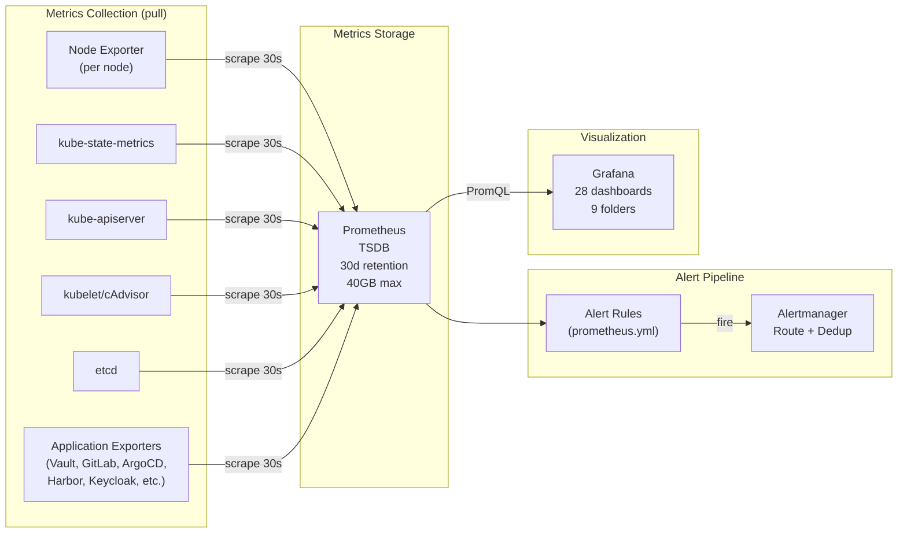
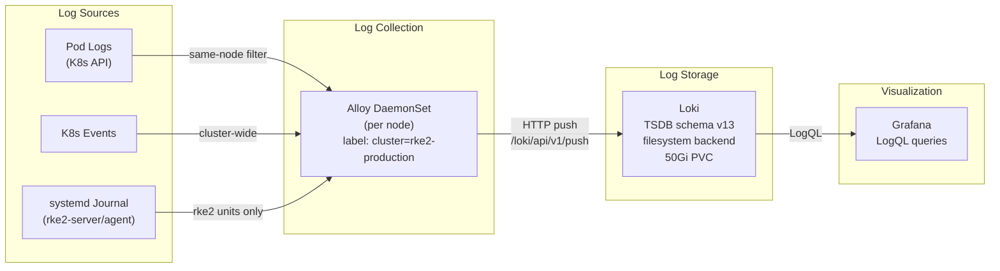
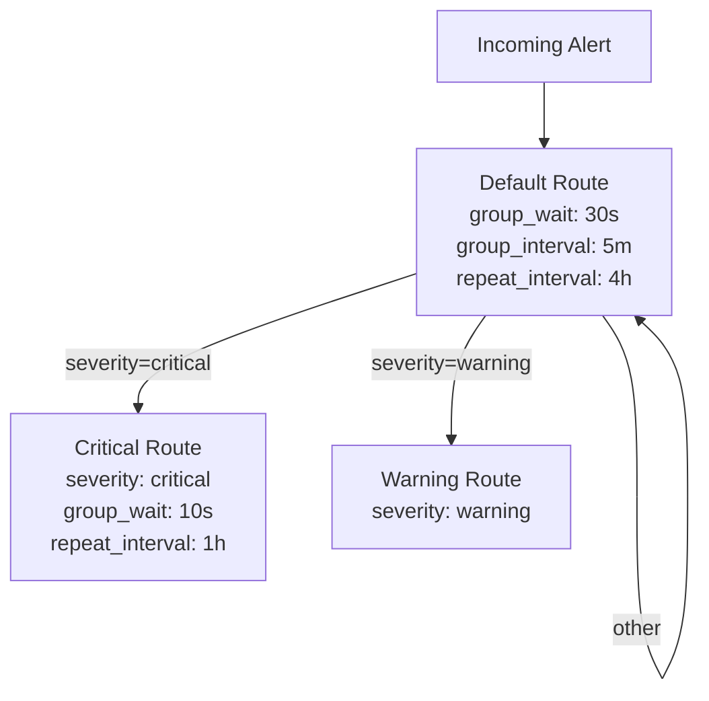
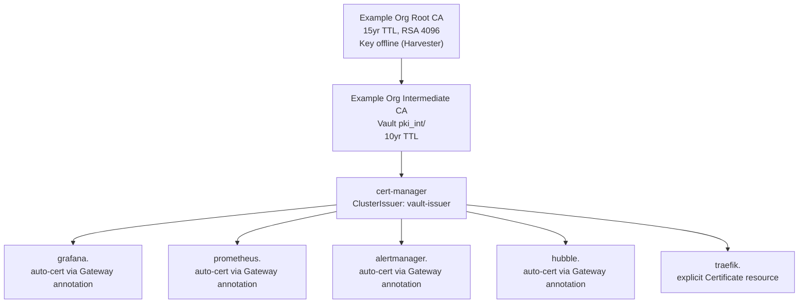

# Monitoring and Observability Architecture

Comprehensive engineering reference for the RKE2 cluster monitoring stack. Covers all components, data pipelines, scrape configurations, dashboards, alerting rules, and TLS integration.

> **Note**: Throughout this document, `<DOMAIN>` refers to the root domain
> configured in `scripts/.env` (e.g., `example.com`). Derived formats:
> `<DOMAIN_DASHED>` = dots replaced with hyphens (e.g., `example-com`),
> `<DOMAIN_DOT>` = dots replaced with `-dot-` (e.g., `example-dot-com`).
> All service FQDNs follow the pattern `<service>.<DOMAIN>`.

## Table of Contents

1. [Overview](#1-overview)
2. [Data Pipeline](#2-data-pipeline)
3. [Prometheus Deep Dive](#3-prometheus-deep-dive)
4. [Grafana Deep Dive](#4-grafana-deep-dive)
5. [Loki Deep Dive](#5-loki-deep-dive)
6. [Alloy Deep Dive](#6-alloy-deep-dive)
7. [Alertmanager Deep Dive](#7-alertmanager-deep-dive)
8. [Node Exporter](#8-node-exporter)
9. [kube-state-metrics](#9-kube-state-metrics)
10. [TLS Integration](#10-tls-integration)
11. [Dashboard Inventory](#11-dashboard-inventory)

---

## 1. Overview

The monitoring stack provides full observability for the RKE2 Kubernetes cluster running on Rancher/Harvester. It is deployed entirely into the `monitoring` namespace via Kustomize and consists of six core components:

| Component | Kind | Image | Replicas | Purpose |
|-----------|------|-------|----------|---------|
| Prometheus | StatefulSet | `prom/prometheus:v2.53.0` | 1 | Metrics collection, storage, alerting rules |
| Grafana | Deployment | `grafana/grafana:11.1.0` | 1 | Dashboards and visualization |
| Loki | StatefulSet | `grafana/loki:3.1.0` | 1 | Log aggregation and querying |
| Alloy | DaemonSet | `grafana/alloy:v1.3.0` | all nodes | Log collection agent |
| Alertmanager | StatefulSet | `prom/alertmanager:v0.27.0` | 1 | Alert routing and deduplication |
| Node Exporter | DaemonSet | `prom/node-exporter:v1.8.2` | all nodes | Host-level hardware/OS metrics |
| kube-state-metrics | Deployment | `kube-state-metrics:v2.13.0` | 1 | Kubernetes object state metrics |

### Architecture Diagram

```mermaid
graph TB
    subgraph External["External Access (HTTPS via Traefik)"]
        User["User Browser"]
    end

    subgraph Monitoring["monitoring namespace"]
        Grafana["Grafana<br/>:3000<br/>Deployment (1 replica)"]
        Prometheus["Prometheus<br/>:9090<br/>StatefulSet (1 replica)<br/>50Gi PVC"]
        Loki["Loki<br/>:3100 / :9096 gRPC<br/>StatefulSet (1 replica)<br/>50Gi PVC"]
        Alertmanager["Alertmanager<br/>:9093<br/>StatefulSet (1 replica)<br/>5Gi PVC"]
        Alloy["Alloy<br/>:12345<br/>DaemonSet (all nodes)"]
        NodeExporter["Node Exporter<br/>:9100<br/>DaemonSet (all nodes)"]
        KSM["kube-state-metrics<br/>:8080<br/>Deployment (1 replica)"]
    end

    subgraph Targets["Scrape Targets"]
        APIServer["kube-apiserver"]
        Kubelet["kubelet / cAdvisor"]
        Etcd["etcd :2381"]
        Scheduler["kube-scheduler :10259"]
        ControllerMgr["kube-controller-manager :10257"]
        CoreDNS["CoreDNS :9153"]
        Cilium["Cilium Agent :9962"]
        HubbleRelay["Hubble Relay"]
        Traefik["Traefik :9100"]
    end

    subgraph AppTargets["Application Scrape Targets"]
        Vault["Vault /v1/sys/metrics"]
        CertManager["cert-manager"]
        CNPG["CNPG Controller + PG"]
        GitLab["GitLab Exporter"]
        ArgoCD["ArgoCD Components"]
        ArgoRollouts["Argo Rollouts"]
        Harbor["Harbor core/registry/exporter"]
        Keycloak["Keycloak :9000"]
        Mattermost["Mattermost"]
    end

    User -->|HTTPS| Grafana
    Grafana -->|PromQL| Prometheus
    Grafana -->|LogQL| Loki
    Grafana -->|Alerts API| Alertmanager
    Prometheus -->|alerts| Alertmanager
    Prometheus -->|scrape| NodeExporter
    Prometheus -->|scrape| KSM
    Prometheus -->|scrape| APIServer
    Prometheus -->|scrape| Kubelet
    Prometheus -->|scrape| Etcd
    Prometheus -->|scrape| Scheduler
    Prometheus -->|scrape| ControllerMgr
    Prometheus -->|scrape| CoreDNS
    Prometheus -->|scrape| Cilium
    Prometheus -->|scrape| HubbleRelay
    Prometheus -->|scrape| Traefik
    Prometheus -->|scrape| Vault
    Prometheus -->|scrape| CertManager
    Prometheus -->|scrape| CNPG
    Prometheus -->|scrape| GitLab
    Prometheus -->|scrape| ArgoCD
    Prometheus -->|scrape| ArgoRollouts
    Prometheus -->|scrape| Harbor
    Prometheus -->|scrape| Keycloak
    Prometheus -->|scrape| Mattermost
    Prometheus -->|scrape| Alloy
    Prometheus -->|scrape| Loki
    Prometheus -->|scrape| Alertmanager
    Alloy -->|push logs| Loki
```

---

## 2. Data Pipeline

### Metrics Pipeline

### Log Pipeline

---

## 3. Prometheus Deep Dive

### Configuration Summary

| Parameter | Value |
|-----------|-------|
| Image | `docker.io/prom/prometheus:v2.53.0` |
| Replicas | 1 (StatefulSet) |
| Scrape interval | 30s |
| Evaluation interval | 30s |
| Scrape timeout | 10s |
| Retention (time) | 30d |
| Retention (size) | 40GB |
| Storage path | `/prometheus` |
| PVC size | 50Gi |
| Web lifecycle | Enabled (`--web.enable-lifecycle`) |
| Node selector | `workload-type: general` |

### Resource Allocation

| Resource | Request | Limit |
|----------|---------|-------|
| CPU | 500m | 2 |
| Memory | 2Gi | 4Gi |

### Security Context

| Setting | Value |
|---------|-------|
| runAsUser | 65534 (nobody) |
| runAsGroup | 65534 |
| fsGroup | 65534 |
| runAsNonRoot | true |

### RBAC

Prometheus uses a dedicated `ServiceAccount` named `prometheus` in the `monitoring` namespace, bound to a `ClusterRole` with the following permissions:

| API Group | Resources | Verbs |
|-----------|-----------|-------|
| `""` (core) | nodes, nodes/proxy, nodes/metrics, services, endpoints, pods | get, list, watch |
| extensions, networking.k8s.io | ingresses | get, list, watch |
| (non-resource) | /metrics, /metrics/cadvisor | get |

### Scrape Jobs (28 total)

| # | Job Name | Target | Discovery | Protocol | Port | Auth | Notes |
|---|----------|--------|-----------|----------|------|------|-------|
| 1 | `prometheus` | localhost | static | HTTP | 9090 | none | Self-monitoring |
| 2 | `kubernetes-apiservers` | API server endpoints | endpoints SD | HTTPS | 443 | SA token | Filtered by `default;kubernetes;https` |
| 3 | `kubelet` | all nodes | node SD | HTTPS | 10250 | SA token | `insecure_skip_verify: true` |
| 4 | `cadvisor` | all nodes | node SD | HTTPS | 10250 | SA token | Path: `/metrics/cadvisor` |
| 5 | `etcd` | control-plane nodes | node SD | HTTP | 2381 | none | Uses dedicated HTTP metrics port (not gRPC 2379) |
| 6 | `cilium-agent` | cilium pods | pod SD (kube-system) | HTTP | 9962 | none | Requires host firewall port open |
| 6b | `hubble-relay` | hubble-relay-metrics | endpoints SD (kube-system) | HTTP | metrics | none | Cilium flow observability |
| 7 | `coredns` | rke2-coredns pods | pod SD (kube-system) | HTTP | 9153 | none | |
| 8 | `kube-scheduler` | control-plane nodes | node SD | HTTPS | 10259 | SA token | Dynamic node discovery |
| 9 | `kube-controller-manager` | control-plane nodes | node SD | HTTPS | 10257 | SA token | Dynamic node discovery |
| 10 | `node-exporter` | node-exporter endpoints | endpoints SD | HTTP | 9100 | none | |
| 11 | `kube-state-metrics` | KSM endpoints | endpoints SD | HTTP | 8080 | none | Port name: `metrics` |
| 12 | `kubernetes-service-endpoints` | annotated services | endpoints SD | varies | varies | none | `prometheus.io/scrape: "true"` |
| 13 | `kubernetes-pods` | annotated pods | pod SD | varies | varies | none | `prometheus.io/scrape: "true"` |
| 14 | `vault` | vault-internal endpoints | endpoints SD (vault) | HTTP | 8200 | none | Path: `/v1/sys/metrics?format=prometheus` |
| 15 | `cert-manager` | cert-manager endpoints | endpoints SD (cert-manager) | HTTP | metrics | none | Port name: `tcp-prometheus-servicemonitor` |
| 16 | `traefik` | rke2-traefik pods | pod SD (kube-system) | HTTP | 9100 | none | |
| 17 | `cnpg-controller` | CNPG controller pods | pod SD (cnpg-system) | HTTP | 8080 | none | |
| 18 | `cnpg-postgresql` | CNPG PostgreSQL instances | pod SD (database) | HTTP | 9187 | none | Labels: `cnpg_cluster`, `role` |
| 19 | `alloy` | alloy endpoints | endpoints SD (monitoring) | HTTP | 12345 | none | Self-monitoring |
| 20 | `loki` | loki endpoints | endpoints SD (monitoring) | HTTP | 3100 | none | Self-monitoring |
| 21 | `gitlab-exporter` | gitlab-exporter endpoints | endpoints SD (gitlab) | HTTP | metrics | none | Port name: `http-metrics` |
| 22 | `argocd` | ArgoCD component metrics | endpoints SD (argocd) | HTTP | metrics | none | Regex: `argocd-.*-metrics` |
| 23 | `argo-rollouts` | argo-rollouts-metrics | endpoints SD (argo-rollouts) | HTTP | metrics | none | |
| 24 | `harbor` | Harbor core/registry/exporter | endpoints SD (harbor) | HTTP | metrics | none | Port name: `http-metrics` |
| 25 | `keycloak` | Keycloak pods | pod SD (keycloak) | HTTP | 9000 | none | Management port (Keycloak 26+) |
| 26 | `mattermost` | mattermost-metrics endpoints | endpoints SD (mattermost) | HTTP | metrics | none | Requires Enterprise license |
| 27 | `alertmanager` | alertmanager endpoints | endpoints SD (monitoring) | HTTP | 9093 | none | |
| 28 | `oauth2-proxy` | oauth2-proxy pods | pod SD (all namespaces) | HTTP | 4180 | none | Label: `app.kubernetes.io/name=oauth2-proxy`; relabels `instance` to `service` |

### Alert Rules

Prometheus defines alert rules organized into 13 groups:

#### Group: node-alerts

| Alert | Expression | For | Severity |
|-------|-----------|-----|----------|
| NodeDown | `up{job="node-exporter"} == 0` | 2m | critical |
| NodeHighCPU | CPU idle < 10% (avg by node over 5m) | 15m | warning |
| NodeHighMemory | MemAvailable/MemTotal < 10% | 15m | warning |
| NodeDiskPressure | Filesystem > 85% full (excl tmpfs/overlay) | 10m | warning |
| NodeDiskCritical | Filesystem > 95% full | 5m | critical |

#### Group: kubernetes-alerts

| Alert | Expression | For | Severity |
|-------|-----------|-----|----------|
| KubeAPIServerDown | `up{job="kubernetes-apiservers"} == 0` | 2m | critical |
| EtcdMemberDown | `up{job="etcd"} == 0` | 2m | critical |
| EtcdHighLatency | WAL fsync p99 > 0.5s | 10m | warning |
| EtcdHighCommitDuration | Backend commit p99 > 0.25s | 10m | warning |
| KubePodCrashLooping | > 5 restarts in 1h | 15m | warning |
| KubePodNotReady | Phase Pending or Unknown | 15m | warning |
| KubeDeploymentReplicasMismatch | Desired != ready replicas | 15m | warning |
| KubeDaemonSetNotScheduled | Desired - current > 0 | 10m | warning |
| KubeNodeNotReady | Node Ready condition != true | 5m | critical |
| KubeletDown | `up{job="kubelet"} == 0` | 2m | critical |

#### Group: vault-alerts

| Alert | Expression | For | Severity |
|-------|-----------|-----|----------|
| VaultSealed | `vault_core_unsealed == 0` | 2m | critical |
| VaultDown | `up{job="vault"} == 0` | 2m | critical |
| VaultLeaderLost | No active leader while instances are up | 5m | critical |

#### Group: certmanager-alerts

| Alert | Expression | For | Severity |
|-------|-----------|-----|----------|
| CertExpiringSoon | Cert expires in < 7 days | 1h | warning |
| CertNotReady | Certificate ready condition != True | 15m | warning |
| CertManagerDown | `up{job="cert-manager"} == 0` | 5m | critical |

#### Group: gitlab-alerts

| Alert | Expression | For | Severity |
|-------|-----------|-----|----------|
| GitLabDown | `up{job="gitlab-exporter"} == 0` | 5m | critical |

#### Group: postgresql-alerts

| Alert | Expression | For | Severity |
|-------|-----------|-----|----------|
| PostgreSQLDown | `up{job="cnpg-postgresql"} == 0` | 2m | critical |
| ReplicationLag | `cnpg_pg_replication_lag > 30` | 5m | warning |
| HighConnections | Connection usage > 80% of max_connections | 10m | warning |
| CNPGControllerDown | `up{job="cnpg-controller"} == 0` | 5m | critical |

#### Group: monitoring-self-alerts

| Alert | Expression | For | Severity |
|-------|-----------|-----|----------|
| PrometheusTargetDown | `up == 0` (any target) | 5m | warning |
| PrometheusTSDBCompactionsFailing | Failed compactions in 3h > 0 | 1h | warning |
| PrometheusStorageAlmostFull | TSDB storage > 80% of 50GB | 30m | warning |
| LokiDown | `up{job=~".*loki.*"} == 0` | 5m | critical |
| AlloyDown | `up{job="alloy"} == 0` | 5m | warning |

#### Group: traefik-alerts

| Alert | Expression | For | Severity |
|-------|-----------|-----|----------|
| TraefikDown | `up{job="traefik"} == 0` | 2m | critical |
| TraefikHighErrorRate | 5xx rate > 5% | 5m | warning |

#### Group: cilium-alerts

| Alert | Expression | For | Severity |
|-------|-----------|-----|----------|
| CiliumAgentDown | `up{job="cilium-agent"} == 0` | 2m | critical |
| CiliumEndpointNotReady | Endpoints in not-ready state > 0 | 15m | warning |

#### Group: argocd-alerts

| Alert | Expression | For | Severity |
|-------|-----------|-----|----------|
| ArgoCDDown | `up{job="argocd"} == 0` | 5m | critical |
| ArgoCDAppOutOfSync | App sync_status != Synced | 15m | warning |
| ArgoCDAppDegraded | App health Degraded or Missing | 10m | warning |

#### Group: harbor-alerts

| Alert | Expression | For | Severity |
|-------|-----------|-----|----------|
| HarborDown | `up{job="harbor"} == 0` | 5m | critical |

#### Group: keycloak-alerts

| Alert | Expression | For | Severity |
|-------|-----------|-----|----------|
| KeycloakDown | `up{job="keycloak"} == 0` | 5m | critical |

#### Group: mattermost-alerts

| Alert | Expression | For | Severity |
|-------|-----------|-----|----------|
| MattermostDown | `up{job="mattermost"} == 0` | 5m | critical |

#### Group: oauth2-proxy-alerts

| Alert | Expression | For | Severity |
|-------|-----------|-----|----------|
| OAuth2ProxyDown | `up{job="oauth2-proxy"} == 0` | 2m | critical |
| OAuth2ProxyHighMemory | `process_resident_memory_bytes{job="oauth2-proxy"} > 100MB` | 10m | warning |

#### Group: security-alerts

| Alert | Expression | For | Severity |
|-------|-----------|-----|----------|
| KeycloakBruteForceDetected | > 10 failed logins (user_not_found) in 5m | 2m | warning |
| KeycloakHighLoginFailures | Login failure rate > 30% | 10m | warning |
| UnusualPodNetworkTraffic | Pod outbound > 50MB/s | 15m | warning |
| APIServerUnusualRequestRate | Non-read requests > 100/s | 10m | warning |
| HighDNSQueryRate | CoreDNS queries > 5000/s per server | 10m | warning |
| SecretAccessSpike | Secret read requests > 50/s | 5m | warning |

---

## 4. Grafana Deep Dive

### Configuration Summary

| Parameter | Value |
|-----------|-------|
| Image | `docker.io/grafana/grafana:11.1.0` |
| Replicas | 1 (Deployment, Recreate strategy) |
| Admin user | `admin` (password from Secret `grafana-admin-secret`) |
| Root URL | `https://grafana.<DOMAIN>/` |
| Home dashboard | `/var/lib/grafana/dashboards/home/home-overview.json` |
| Node selector | `workload-type: general` |
| PVC | `grafana-data` (10Gi) |

### Resource Allocation

| Resource | Request | Limit |
|----------|---------|-------|
| CPU | 500m | 1 |
| Memory | 512Mi | 1Gi |

### Security Context

| Setting | Value |
|---------|-------|
| runAsUser | 472 |
| runAsGroup | 472 |
| fsGroup | 472 |

### Datasources

Grafana is provisioned with three datasources via ConfigMap `grafana-datasources`:

| Datasource | Type | UID | URL | Default |
|------------|------|-----|-----|---------|
| Prometheus | prometheus | `prometheus` | `http://prometheus.monitoring.svc:9090` | Yes |
| Loki | loki | `loki` | `http://loki.monitoring.svc:3100` | No |
| Alertmanager | alertmanager | `alertmanager` | `http://alertmanager.monitoring.svc:9093` | No |

All datasources are set to `proxy` access mode and are not editable.

### Authentication

Grafana supports two authentication methods:

1. **Built-in login**: Admin user with password from Kubernetes Secret `grafana-admin-secret`
2. **Keycloak OIDC** (configured via `setup-keycloak.sh`): Generic OAuth with group-based role mapping
   - `platform-admins` / `infra-engineers` groups map to `Admin`
   - `senior-developers` / `developers` groups map to `Editor`
   - All other authenticated users get `Viewer`
   - Root CA trust configured via `GF_AUTH_GENERIC_OAUTH_TLS_CLIENT_CA` pointing to the Vault Root CA PEM

### Dashboard Folder Structure

Dashboards are organized into 9 Grafana folders, configured via the `grafana-dashboard-provider` ConfigMap:

| Folder | Path | Description |
|--------|------|-------------|
| RKE2 | `/var/lib/grafana/dashboards/rke2` | RKE2-specific cluster dashboards |
| Kubernetes | `/var/lib/grafana/dashboards/kubernetes` | General Kubernetes monitoring |
| Loki | `/var/lib/grafana/dashboards/loki` | Log exploration and Loki health |
| Services | `/var/lib/grafana/dashboards/services` | Application service dashboards |
| Networking | `/var/lib/grafana/dashboards/networking` | Network component dashboards |
| Security | `/var/lib/grafana/dashboards/security` | Security and compliance dashboards |
| Operations | `/var/lib/grafana/dashboards/operations` | Operational health dashboards |
| CI/CD | `/var/lib/grafana/dashboards/cicd` | Continuous delivery dashboards |
| Home | `/var/lib/grafana/dashboards/home` | Home overview dashboard |

---

## 5. Loki Deep Dive

### Configuration Summary

| Parameter | Value |
|-----------|-------|
| Image | `docker.io/grafana/loki:3.1.0` |
| Mode | Monolithic (`-target=all`) |
| Replicas | 1 (StatefulSet) |
| HTTP port | 3100 |
| gRPC port | 9096 |
| Auth | Disabled (`auth_enabled: false`) |
| Node selector | `workload-type: general` |

### Resource Allocation

| Resource | Request | Limit |
|----------|---------|-------|
| CPU | 250m | 1 |
| Memory | 512Mi | 2Gi |

### Security Context

| Setting | Value |
|---------|-------|
| runAsUser | 10001 |
| runAsGroup | 10001 |
| fsGroup | 10001 |

### Storage Configuration

| Parameter | Value |
|-----------|-------|
| PVC size | 50Gi |
| Schema | v13 (TSDB) |
| Object store | filesystem |
| Chunks directory | `/loki/chunks` |
| TSDB index directory | `/loki/tsdb-index` |
| TSDB cache directory | `/loki/tsdb-cache` |
| Replication factor | 1 |
| KV store | inmemory |

### Retention and Limits

| Parameter | Value |
|-----------|-------|
| Ingestion rate | 20 MB/s |
| Ingestion burst | 40 MB/s |
| Max streams per user | 50,000 |
| Max entries per query | 10,000 |
| Max query series | 5,000 |
| Reject old samples | Yes, max age 168h (7 days) |
| Compaction interval | 10m |
| Retention enabled | Yes |
| Retention delete delay | 2h |
| Retention delete workers | 150 |

### Caching

| Cache | Size |
|-------|------|
| Chunk cache (embedded) | 100 MB |
| Query results cache (embedded) | 100 MB |

---

## 6. Alloy Deep Dive

### Configuration Summary

| Parameter | Value |
|-----------|-------|
| Image | `docker.io/grafana/alloy:v1.3.0` |
| Kind | DaemonSet (runs on all nodes) |
| HTTP port | 12345 |
| Stability level | generally-available |
| Tolerations | `Exists` (tolerates all taints) |

### Resource Allocation

| Resource | Request | Limit |
|----------|---------|-------|
| CPU | 100m | 500m |
| Memory | 128Mi | 512Mi |

### Volume Mounts

| Mount | Host Path | Access |
|-------|-----------|--------|
| Config | ConfigMap `alloy-config` | read |
| `/var/log` | `/var/log` (host) | readOnly |
| `/var/log/journal` | `/var/log/journal` (host) | readOnly |
| `/tmp/alloy` | emptyDir | read-write |

### Log Collection Pipelines

Alloy collects logs from three sources and pushes them all to `loki.monitoring.svc:3100/loki/api/v1/push` with the external label `cluster = "rke2-production"`.

#### Pipeline 1: Pod Logs

- **Source**: `loki.source.kubernetes` using Kubernetes service discovery (`discovery.kubernetes "pods"`)
- **Filter**: Only collects logs from pods on the same node as the Alloy instance (matched via `HOSTNAME` env var from `spec.nodeName`)
- **Labels applied**: `namespace`, `pod`, `container`, `node`, `app`, `app_name`, `component`, `instance_name`, `cnpg_cluster`

#### Pipeline 2: Kubernetes Events

- **Source**: `loki.source.kubernetes_events`
- **Format**: logfmt
- **Scope**: Cluster-wide (all events)

#### Pipeline 3: Journal Logs

- **Source**: `loki.source.journal` reading from `/var/log/journal`
- **Filter**: Only `rke2-server.service` and `rke2-agent.service` systemd units
- **Labels applied**: `unit` (systemd unit name), `node` (hostname)

---

## 7. Alertmanager Deep Dive

### Configuration Summary

| Parameter | Value |
|-----------|-------|
| Image | `docker.io/prom/alertmanager:v0.27.0` |
| Replicas | 1 (StatefulSet) |
| Port | 9093 |
| PVC size | 5Gi |
| Resolve timeout | 5m |
| Node selector | `workload-type: general` |

### Resource Allocation

| Resource | Request | Limit |
|----------|---------|-------|
| CPU | 50m | 200m |
| Memory | 64Mi | 256Mi |

### Security Context

| Setting | Value |
|---------|-------|
| runAsUser | 65534 (nobody) |
| runAsGroup | 65534 |
| fsGroup | 65534 |
| runAsNonRoot | true |

### Routing Configuration

The default route groups alerts by `alertname`, `namespace`, and `job`:

### Routes

| Route | Matcher | Receiver | Group Wait | Repeat Interval |
|-------|---------|----------|------------|-----------------|
| Default | (catch-all) | `default` | 30s | 4h |
| Critical | `severity: critical` | `critical` | 10s | 1h |
| Warning | `severity: warning` | `warning` | 30s (inherited) | 4h (inherited) |

### Receivers

| Receiver | Configuration |
|----------|---------------|
| `default` | No notification integrations configured (placeholder) |
| `critical` | No notification integrations configured (placeholder) |
| `warning` | No notification integrations configured (placeholder) |

> **Note**: Receivers are currently empty placeholders. Notification integrations (email, Slack, PagerDuty, webhooks) need to be configured for production alerting.

### Inhibit Rules

| Source Severity | Target Severity | Equal Labels | Effect |
|-----------------|-----------------|--------------|--------|
| critical | warning | alertname, namespace | Critical alerts suppress matching warnings |

---

## 8. Node Exporter

### Configuration Summary

| Parameter | Value |
|-----------|-------|
| Image | `docker.io/prom/node-exporter:v1.8.2` |
| Kind | DaemonSet (all nodes) |
| Port | 9100 |
| hostPID | true |
| Tolerations | `Exists` (tolerates all taints) |

### Resource Allocation

| Resource | Request | Limit |
|----------|---------|-------|
| CPU | 50m | 250m |
| Memory | 64Mi | 256Mi |

### Security Context

| Setting | Value |
|---------|-------|
| readOnlyRootFilesystem | true |
| allowPrivilegeEscalation | false |

### Host Mounts

| Container Path | Host Path | Purpose |
|----------------|-----------|---------|
| `/host/proc` | `/proc` | Process metrics |
| `/host/sys` | `/sys` | System metrics |
| `/host/root` | `/` | Filesystem metrics (HostToContainer propagation) |

### Filesystem Exclusions

- **Mount point exclusions**: `/dev`, `/proc`, `/sys`, `/var/lib/docker/...`, `/var/lib/kubelet/...`
- **Filesystem type exclusions**: autofs, binfmt_misc, bpf, cgroup, configfs, debugfs, devpts, devtmpfs, fusectl, hugetlbfs, iso9660, mqueue, nsfs, overlay, proc, pstore, rpc_pipefs, securityfs, selinuxfs, squashfs, sysfs, tracefs

### Metrics Exposed

Node Exporter provides hardware and OS-level metrics including:

- **CPU**: `node_cpu_seconds_total` (per-core, per-mode)
- **Memory**: `node_memory_MemTotal_bytes`, `node_memory_MemAvailable_bytes`, etc.
- **Disk**: `node_filesystem_size_bytes`, `node_filesystem_avail_bytes`, `node_disk_*`
- **Network**: `node_network_receive_bytes_total`, `node_network_transmit_bytes_total`
- **Load**: `node_load1`, `node_load5`, `node_load15`
- **System**: uptime, boot time, uname info

---

## 9. kube-state-metrics

### Configuration Summary

| Parameter | Value |
|-----------|-------|
| Image | `registry.k8s.io/kube-state-metrics/kube-state-metrics:v2.13.0` |
| Kind | Deployment |
| Replicas | 1 |
| Metrics port | 8080 |
| Telemetry port | 8081 |
| Node selector | `workload-type: general` |

### Resource Allocation

| Resource | Request | Limit |
|----------|---------|-------|
| CPU | 100m | 500m |
| Memory | 256Mi | 512Mi |

### Security Context

| Setting | Value |
|---------|-------|
| readOnlyRootFilesystem | true |
| allowPrivilegeEscalation | false |
| runAsNonRoot | true |
| runAsUser | 65534 (nobody) |

### Metrics Exposed

kube-state-metrics generates metrics about the state of Kubernetes objects:

- **Nodes**: `kube_node_status_condition`, `kube_node_info`, `kube_node_status_capacity`
- **Pods**: `kube_pod_info`, `kube_pod_status_phase`, `kube_pod_container_status_restarts_total`, `kube_pod_container_resource_requests`
- **Deployments**: `kube_deployment_spec_replicas`, `kube_deployment_status_ready_replicas`
- **StatefulSets**: `kube_statefulset_replicas`, `kube_statefulset_status_ready_replicas`
- **DaemonSets**: `kube_daemonset_status_desired_number_scheduled`, `kube_daemonset_status_current_number_scheduled`
- **Jobs/CronJobs**: `kube_job_status_succeeded`, `kube_cronjob_info`
- **PVCs**: `kube_persistentvolumeclaim_status_phase`, `kube_persistentvolumeclaim_resource_requests_storage_bytes`
- **Secrets/ConfigMaps**: `kube_secret_info`, `kube_configmap_info`
- **Namespaces**: `kube_namespace_status_phase`

---

## 10. TLS Integration

All monitoring components exposed externally use TLS certificates issued by the internal PKI chain:

### TLS Endpoints for Monitoring

| Service | URL | Namespace | Ingress Type | Certificate Secret | Auth |
|---------|-----|-----------|-------------|-------------------|------|
| Grafana | `https://grafana.<DOMAIN>` | monitoring | Gateway + HTTPRoute | auto via gateway-shim | Keycloak OIDC (native) |
| Prometheus | `https://prometheus.<DOMAIN>` | monitoring | Gateway + HTTPRoute | auto via gateway-shim | oauth2-proxy ForwardAuth |
| Alertmanager | `https://alertmanager.<DOMAIN>` | monitoring | Gateway + HTTPRoute | auto via gateway-shim | oauth2-proxy ForwardAuth |
| Hubble UI | `https://hubble.<DOMAIN>` | kube-system | Gateway + HTTPRoute | auto via gateway-shim | oauth2-proxy ForwardAuth |
| Traefik Dashboard | `https://traefik.<DOMAIN>` | kube-system | Gateway + HTTPRoute | explicit Certificate | oauth2-proxy ForwardAuth |

### Certificate Lifecycle

1. cert-manager detects the `cert-manager.io/cluster-issuer: vault-issuer` annotation on Gateway resources
2. Creates a `Certificate` resource for the hostname specified in the HTTPS listener
3. Sends a CSR to Vault via `pki_int/sign/<DOMAIN_DOT>`
4. Vault signs the certificate with the Intermediate CA (max TTL: 720h / 30 days)
5. cert-manager stores the signed cert + key in the referenced Secret
6. Traefik loads the Secret and terminates TLS
7. cert-manager auto-renews at 2/3 lifetime (~20 days)

### Internal Communication

Inter-component communication within the cluster uses plain HTTP over ClusterIP services:

- Grafana -> Prometheus: `http://prometheus.monitoring.svc:9090`
- Grafana -> Loki: `http://loki.monitoring.svc:3100`
- Grafana -> Alertmanager: `http://alertmanager.monitoring.svc:9093`
- Alloy -> Loki: `http://loki.monitoring.svc:3100/loki/api/v1/push`
- Prometheus -> Alertmanager: `alertmanager.monitoring.svc:9093`

---

## 11. Dashboard Inventory

### Complete Dashboard Table

| # | Dashboard Name | Grafana Folder | ConfigMap Name | Mount Path | JSON File | Primary Datasource |
|---|---------------|----------------|----------------|------------|-----------|-------------------|
| 1 | Cluster Home | Home | `grafana-dashboard-home` | `/var/lib/grafana/dashboards/home/home-overview.json` | `home-overview.json` | Prometheus |
| 2 | RKE2 Cluster | RKE2 | `grafana-dashboard-rke2` | `/var/lib/grafana/dashboards/rke2/rke2-cluster.json` | `rke2-cluster.json` | Prometheus + Loki |
| 3 | Kubernetes RKE Cluster | RKE2 | `grafana-dashboard-rke-cluster` | `/var/lib/grafana/dashboards/rke2/rke-cluster.json` | `rke-cluster.json` | Prometheus |
| 4 | etcd | RKE2 | `grafana-dashboard-etcd` | `/var/lib/grafana/dashboards/rke2/etcd.json` | `etcd.json` | Prometheus |
| 5 | API Server Performance | RKE2 | `grafana-dashboard-apiserver` | `/var/lib/grafana/dashboards/rke2/apiserver-performance.json` | `apiserver-performance.json` | Prometheus |
| 6 | Kubernetes Cluster Monitoring | Kubernetes | `grafana-dashboard-cluster` | `/var/lib/grafana/dashboards/kubernetes/cluster-monitoring.json` | `cluster-monitoring.json` | Prometheus |
| 7 | Pod Monitoring | Kubernetes | `grafana-dashboard-pods` | `/var/lib/grafana/dashboards/kubernetes/pod-monitoring.json` | `pod-monitoring.json` | Prometheus |
| 8 | Loki Logs | Loki | `grafana-dashboard-loki` | `/var/lib/grafana/dashboards/loki/loki-logs.json` | `loki-logs.json` | Loki |
| 9 | Loki Stack Monitoring | Loki | `grafana-dashboard-loki-stack` | `/var/lib/grafana/dashboards/loki/loki-stack.json` | `loki-stack.json` | Prometheus + Loki |
| 10 | Vault Cluster Overview | Services | `grafana-dashboard-vault` | `/var/lib/grafana/dashboards/services/vault-overview.json` | `vault-overview.json` | Prometheus |
| 11 | CloudNativePG Cluster | Services | `grafana-dashboard-cnpg` | `/var/lib/grafana/dashboards/services/cnpg-cluster.json` | `cnpg-cluster.json` | Prometheus |
| 12 | GitLab Overview | Services | `grafana-dashboard-gitlab` | `/var/lib/grafana/dashboards/services/gitlab-overview.json` | `gitlab-overview.json` | Prometheus |
| 13 | ArgoCD Overview | Services | `grafana-dashboard-argocd` | `/var/lib/grafana/dashboards/services/argocd-overview.json` | `argocd-overview.json` | Prometheus |
| 14 | Harbor Overview | Services | `grafana-dashboard-harbor` | `/var/lib/grafana/dashboards/services/harbor-overview.json` | `harbor-overview.json` | Prometheus |
| 15 | Mattermost Overview | Services | `grafana-dashboard-mattermost` | `/var/lib/grafana/dashboards/services/mattermost-overview.json` | `mattermost-overview.json` | Prometheus |
| 16 | Argo Rollouts Overview | Services | `grafana-dashboard-argo-rollouts` | `/var/lib/grafana/dashboards/services/argo-rollouts-overview.json` | `argo-rollouts-overview.json` | Prometheus |
| 17 | Cilium Overview | Networking | `grafana-dashboard-cilium` | `/var/lib/grafana/dashboards/networking/cilium-overview.json` | `cilium-overview.json` | Prometheus |
| 18 | Traefik Overview | Networking | `grafana-dashboard-traefik` | `/var/lib/grafana/dashboards/networking/traefik-overview.json` | `traefik-overview.json` | Prometheus |
| 19 | CoreDNS | Networking | `grafana-dashboard-coredns` | `/var/lib/grafana/dashboards/networking/coredns.json` | `coredns.json` | Prometheus |
| 20 | cert-manager | Security | `grafana-dashboard-cert-manager` | `/var/lib/grafana/dashboards/security/cert-manager.json` | `cert-manager.json` | Prometheus |
| 21 | Cluster Security | Security | `grafana-dashboard-security` | `/var/lib/grafana/dashboards/security/cluster-security.json` | `cluster-security.json` | Prometheus |
| 22 | Security Advanced | Security | `grafana-dashboard-security-advanced` | `/var/lib/grafana/dashboards/security/security-advanced.json` | `security-advanced.json` | Prometheus |
| 23 | Keycloak Overview | Security | `grafana-dashboard-keycloak` | `/var/lib/grafana/dashboards/security/keycloak-overview.json` | `keycloak-overview.json` | Prometheus |
| 24 | oauth2-proxy ForwardAuth | Security | `grafana-dashboard-oauth2-proxy` | `/var/lib/grafana/dashboards/security/oauth2-proxy-overview.json` | `oauth2-proxy-overview.json` | Prometheus + Loki |
| 25 | Cluster Operations | Operations | `grafana-dashboard-operations` | `/var/lib/grafana/dashboards/operations/cluster-operations.json` | `cluster-operations.json` | Prometheus |
| 26 | Node Detail | Operations | `grafana-dashboard-node-detail` | `/var/lib/grafana/dashboards/operations/node-detail.json` | `node-detail.json` | Prometheus |
| 27 | PV Usage | Operations | `grafana-dashboard-storage` | `/var/lib/grafana/dashboards/operations/pv-usage.json` | `pv-usage.json` | Prometheus |
| 28 | Pipelines Overview | CI/CD | `grafana-dashboard-pipelines` | `/var/lib/grafana/dashboards/cicd/pipelines-overview.json` | `pipelines-overview.json` | Prometheus |

### Dashboard Count by Folder

| Folder | Dashboard Count |
|--------|----------------|
| RKE2 | 4 |
| Kubernetes | 2 |
| Loki | 2 |
| Services | 6 |
| Networking | 3 |
| Security | 5 |
| Operations | 3 |
| CI/CD | 1 |
| Home | 1 |
| **Total** | **28** |

### Home Dashboard Details

The home dashboard (`Cluster Home`, UID: `home-overview`) is a single-page command center providing:

- **Top row**: Nodes Ready, Total Pods, Pods Not Ready, Firing Alerts, CPU Usage %, Memory Usage %
- **Infrastructure row**: Status tiles for etcd, API Server, Traefik, CoreDNS, Cilium, Prometheus, Loki, Alertmanager
- **Authentication row**: oauth2-proxy ForwardAuth instances up (expected: 5)
- **Application row**: Status tiles for Vault, GitLab, ArgoCD, Harbor, Keycloak, Mattermost, PostgreSQL, cert-manager
- **Charts**: Cluster CPU by Node, Cluster Memory by Node, Firing Alerts table, Container Restarts (1h), Disk Usage by Node, PVC Usage Top 10

Each tile links to the corresponding detailed dashboard for drill-down.

---

## Related Files

| File | Path |
|------|------|
| Kustomization | `services/monitoring-stack/kustomization.yaml` |
| Prometheus config | `services/monitoring-stack/prometheus/configmap.yaml` |
| Prometheus StatefulSet | `services/monitoring-stack/prometheus/statefulset.yaml` |
| Prometheus RBAC | `services/monitoring-stack/prometheus/rbac.yaml` |
| Grafana deployment | `services/monitoring-stack/grafana/deployment.yaml` |
| Grafana datasources | `services/monitoring-stack/grafana/configmap-datasources.yaml` |
| Grafana dashboard provider | `services/monitoring-stack/grafana/configmap-dashboard-provider.yaml` |
| Loki config | `services/monitoring-stack/loki/configmap.yaml` |
| Loki StatefulSet | `services/monitoring-stack/loki/statefulset.yaml` |
| Alertmanager config | `services/monitoring-stack/alertmanager/configmap.yaml` |
| Alertmanager StatefulSet | `services/monitoring-stack/alertmanager/statefulset.yaml` |
| Alloy config | `services/monitoring-stack/alloy/configmap.yaml` |
| Alloy DaemonSet | `services/monitoring-stack/alloy/daemonset.yaml` |
| Node Exporter DaemonSet | `services/monitoring-stack/node-exporter/daemonset.yaml` |
| kube-state-metrics deployment | `services/monitoring-stack/kube-state-metrics/deployment.yaml` |
| TLS integration guide | `services/monitoring-stack/docs/tls-integration-guide.md` |
| Monitoring stack README | `services/monitoring-stack/README.md` |
