# Security Architecture

Comprehensive engineering reference for the RKE2 cluster security architecture. Covers PKI, Vault, certificate management, authentication (Keycloak OIDC), RBAC, secrets management, network security, and container hardening.

> **Note**: Throughout this document, `<DOMAIN>` refers to the root domain
> configured in `scripts/.env` (e.g., `example.com`). Derived formats:
> `<DOMAIN_DASHED>` = dots replaced with hyphens (e.g., `example-com`),
> `<DOMAIN_DOT>` = dots replaced with `-dot-` (e.g., `example-dot-com`).
> All service FQDNs follow the pattern `<service>.<DOMAIN>`.

## Table of Contents

1. [Security Overview](#1-security-overview)
2. [PKI Architecture](#2-pki-architecture)
3. [Vault Architecture](#3-vault-architecture)
4. [Certificate Management](#4-certificate-management)
5. [TLS Configuration](#5-tls-configuration)
6. [Authentication Architecture](#6-authentication-architecture)
7. [OIDC Client Configuration](#7-oidc-client-configuration)
8. [RBAC Architecture](#8-rbac-architecture)
9. [Secrets Management](#9-secrets-management)
10. [Network Security](#10-network-security)
11. [Container Security](#11-container-security)
12. [Security Decision Tree](#12-security-decision-tree)
13. [Known Security Debt](#13-known-security-debt)

---

## 1. Security Overview

The RKE2 cluster implements a defense-in-depth security model with the following layers:

| Layer | Implementation | Status |
|-------|---------------|--------|
| **PKI / TLS** | Vault PKI engine with offline Root CA, cert-manager for automated leaf certificates | Implemented |
| **Authentication** | Keycloak OIDC SSO for most services, basic-auth for some endpoints | Implemented (mixed) |
| **Authorization** | Kubernetes RBAC, per-service role mappings via Keycloak groups | Implemented |
| **Secrets Management** | Kubernetes Secrets with CHANGEME placeholders; Vault KV migration planned | Partial |
| **Network Security** | Cilium CNI, iptables host firewall, VPN-only access, ARP hardening | Implemented |
| **Container Security** | Non-root users, read-only filesystems where possible, resource limits | Implemented (partial) |
| **Monitoring / Detection** | Prometheus security alerts (brute force, anomalous traffic, secret access spikes) | Implemented |

### Security Architecture Overview

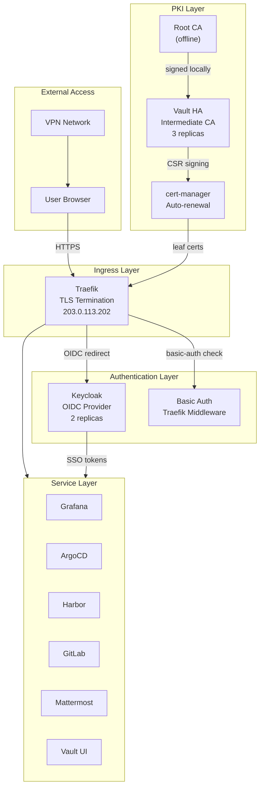

---

## 2. PKI Architecture

The platform uses a three-tier PKI hierarchy. The Root CA key never enters the cluster or Vault.

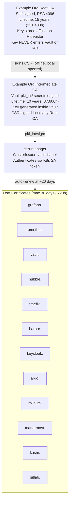

### Certificate Lifecycle Parameters

| Parameter | Value |
|-----------|-------|
| Root CA lifetime | 15 years (131,400h) |
| Root CA algorithm | RSA 4096 |
| Root CA storage | Offline on Harvester, never in Vault |
| Intermediate CA lifetime | 10 years (87,600h) |
| Intermediate CA algorithm | RSA 4096 (key generated inside Vault) |
| Intermediate CA path | `pki_int/` Vault secrets engine |
| Leaf certificate max TTL | 720h (30 days) |
| Leaf certificate renewal | Auto by cert-manager at 2/3 lifetime (~20 days) |
| Allowed domains | `*.<DOMAIN>` subdomains only |
| PKI role | `<DOMAIN_DOT>` (e.g., `example-dot-com`) |
| `require_cn` | false (cert-manager uses SAN-only CSRs) |

### Trust Distribution

To trust cluster certificates in browsers and CLI tools, install the Root CA:

```bash
# Root CA is stored locally (not in Vault)
# Copy from cluster/ directory after deploy
cp cluster/root-ca.pem aegis-root-ca.crt

# macOS
sudo security add-trusted-cert -d -r trustRoot \
  -k /Library/Keychains/System.keychain aegis-root-ca.crt

# Linux
sudo cp aegis-root-ca.crt /usr/local/share/ca-certificates/
sudo update-ca-certificates
```

### Root CA Generation (Reference)

```bash
# Generate Root CA key + cert (15 years, 4096-bit RSA)
openssl genrsa -out root-ca-key.pem 4096
openssl req -x509 -new -nodes \
  -key root-ca-key.pem -sha256 -days 5475 \
  -subj "/CN=Example Org Root CA" -out root-ca.pem
chmod 600 root-ca-key.pem && chmod 644 root-ca.pem
```

### Intermediate CA Setup (Reference)

```bash
# Enable PKI engine in Vault
vault secrets enable -path=pki_int pki
vault secrets tune -max-lease-ttl=87600h pki_int

# Generate CSR inside Vault (key never leaves Vault)
vault write -field=csr pki_int/intermediate/generate/internal \
  common_name="Example Org Intermediate CA" ttl=87600h key_bits=4096 > intermediate.csr

# Sign CSR locally with Root CA key
openssl x509 -req -in intermediate.csr \
  -CA root-ca.pem -CAkey root-ca-key.pem \
  -CAcreateserial -days 3650 -sha256 \
  -extfile <(printf "basicConstraints=critical,CA:true,pathlen:0\n\
keyUsage=critical,digitalSignature,keyCertSign,cRLSign\n\
subjectKeyIdentifier=hash\nauthorityKeyIdentifier=keyid:always") \
  -out intermediate.crt

# Import chain into Vault
cat intermediate.crt root-ca.pem > intermediate-chain.crt
vault write pki_int/intermediate/set-signed certificate=@intermediate-chain.crt
```

---

## 3. Vault Architecture

### Deployment Summary

| Parameter | Value |
|-----------|-------|
| Helm chart | `hashicorp/vault` 0.32.0 |
| Vault version | 1.19.0 |
| Namespace | `vault` |
| Mode | HA (High Availability) |
| Replicas | 3 (`vault-0`, `vault-1`, `vault-2`) |
| Storage | Integrated Raft |
| Storage per replica | 10Gi PVC (storageClass: harvester) |
| Node selector | `workload-type: database` |
| Unseal method | Shamir (5 shares, threshold 3) |
| Injector | Disabled |
| UI | Enabled |
| TLS (listener) | Disabled (`tls_disable = 1`) -- TLS termination at Traefik |

### Resource Allocation

| Resource | Request | Limit |
|----------|---------|-------|
| CPU | 250m | 1 |
| Memory | 256Mi | 512Mi |

### HA Architecture

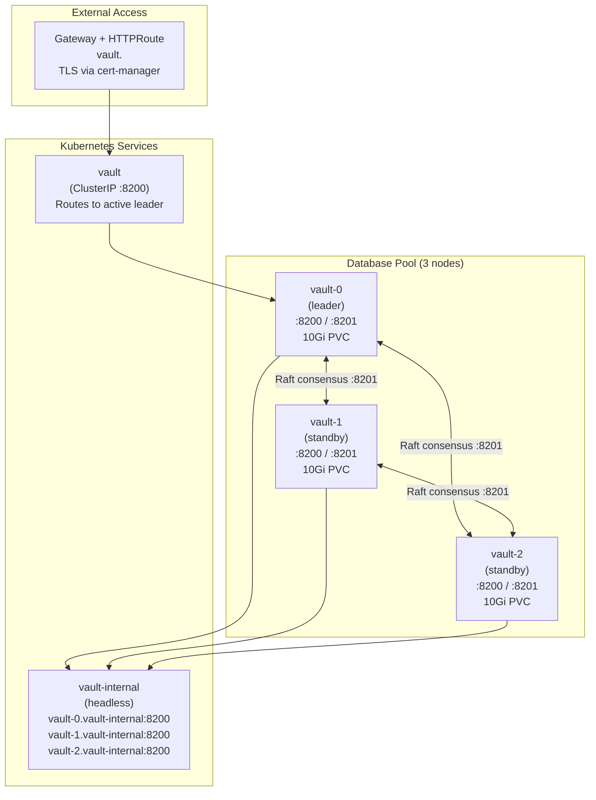

### Pod Anti-Affinity

Vault replicas use `preferredDuringSchedulingIgnoredDuringExecution` anti-affinity to spread across different nodes in the database pool, using `kubernetes.io/hostname` as the topology key.

### Raft Consensus

- Leader election is automatic; if the leader pod dies, remaining unsealed standby nodes elect a new leader (~10s failover)
- Data is replicated across all 3 Raft peers (no shared storage needed)
- The `vault` ClusterIP service automatically routes to the active leader

### Telemetry Configuration

```hcl
listener "tcp" {
  telemetry {
    unauthenticated_metrics_access = true
  }
}

telemetry {
  prometheus_retention_time = "30s"
  disable_hostname = true
}
```

Metrics are exposed at `/v1/sys/metrics?format=prometheus` on port 8200 with unauthenticated access enabled for Prometheus scraping.

### Secrets Engines

| Engine | Mount Path | Purpose |
|--------|-----------|---------|
| PKI | `pki_int/` | Intermediate CA for issuing leaf certificates |
| KV v2 | `secret/` | Credential storage (planned, see Section 9) |

### Vault Policies

| Policy | Path | Capabilities | Consumer |
|--------|------|-------------|----------|
| `pki-policy` | `pki_int/sign/<DOMAIN_DOT>` | create, update | cert-manager |
| `pki-policy` | `pki_int/cert/ca` | read | cert-manager |
| `external-secrets` | `secret/data/*` | read | External Secrets Operator (planned) |
| `external-secrets` | `secret/metadata/*` | read, list | External Secrets Operator (planned) |

### Authentication Methods

| Method | Mount Path | Purpose |
|--------|-----------|---------|
| Kubernetes | `auth/kubernetes/` | Service account authentication for cert-manager and ESO |
| OIDC | `auth/oidc/` | Keycloak SSO for Vault UI login |
| Token | (built-in) | Root token, generated tokens |

### Kubernetes Auth Roles

| Role | Bound SA | Bound Namespace | Policies | TTL |
|------|----------|-----------------|----------|-----|
| `cert-manager-issuer` | `vault-issuer` | `cert-manager` | `pki-policy` | 1h |
| `external-secrets` | `external-secrets` | `external-secrets` | `external-secrets` | 1h |

### OIDC Configuration

| Parameter | Value |
|-----------|-------|
| Discovery URL | `https://keycloak.<DOMAIN>/realms/<REALM>` |
| Client ID | `vault` |
| Default role | `default` |
| User claim | `preferred_username` |
| Groups claim | `groups` |
| Token TTL | 1h |
| Allowed redirect URIs | `https://vault.<DOMAIN>/ui/vault/auth/oidc/oidc/callback`, `http://localhost:8250/oidc/callback` |
| CA trust | Root CA PEM injected for OIDC TLS verification |

---

## 4. Certificate Management

### cert-manager Configuration

| Parameter | Value |
|-----------|-------|
| Helm chart | `jetstack/cert-manager` v1.19.3 |
| Namespace | `cert-manager` |
| Gateway API support | Enabled (`enableGatewayAPI: true`) |
| Node selector | `workload-type: general` |
| CRDs | Installed via Helm (`crds.enabled: true`) |

### ClusterIssuer: vault-issuer

The cluster uses a single `ClusterIssuer` named `vault-issuer` that connects to Vault's PKI engine:

```yaml
apiVersion: cert-manager.io/v1
kind: ClusterIssuer
metadata:
  name: vault-issuer
spec:
  vault:
    path: pki_int/sign/<DOMAIN_DOT>
    server: http://vault.vault.svc.cluster.local:8200
    auth:
      kubernetes:
        role: cert-manager-issuer
        mountPath: /v1/auth/kubernetes
        serviceAccountRef:
          name: vault-issuer
```

### cert-manager RBAC

The `vault-issuer` ServiceAccount in the `cert-manager` namespace has a dedicated Role and RoleBinding:

| Resource | Name | Namespace | Purpose |
|----------|------|-----------|---------|
| ServiceAccount | `vault-issuer` | `cert-manager` | Identity for Vault K8s auth |
| Role | `vault-issuer-token-creator` | `cert-manager` | Permission to create SA tokens |
| RoleBinding | `vault-issuer-token-creator-binding` | `cert-manager` | Binds cert-manager SA to token creator role |

The Role grants:
- API group: `""` (core)
- Resource: `serviceaccounts/token` (resourceName: `vault-issuer`)
- Verbs: `create`

This allows cert-manager to create tokens for the `vault-issuer` ServiceAccount to authenticate with Vault.

### Certificate Request Flow

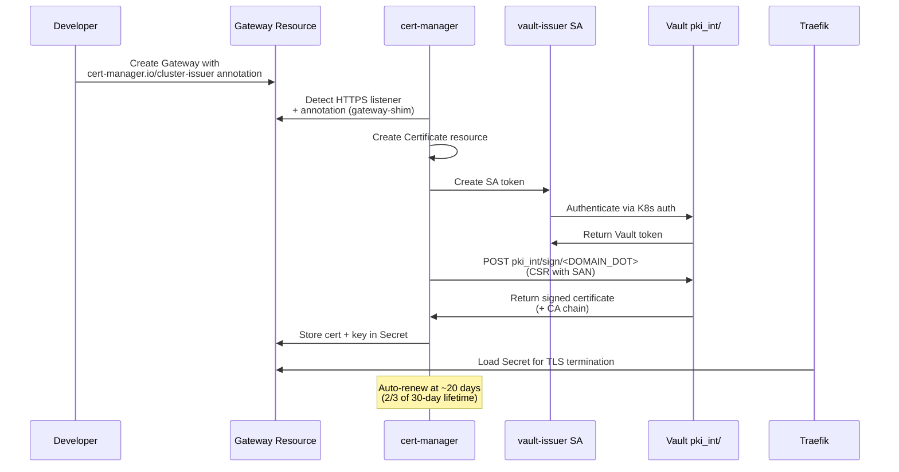

### Certificate Inventory

| Service | Secret Name | Namespace | Method | Renewal |
|---------|------------|-----------|--------|---------|
| Grafana | `grafana-<DOMAIN_DASHED>-tls` | monitoring | Auto (gateway-shim) | cert-manager |
| Prometheus | `prometheus-<DOMAIN_DASHED>-tls` | monitoring | Auto (gateway-shim) | cert-manager |
| Alertmanager | `alertmanager-<DOMAIN_DASHED>-tls` | monitoring | Auto (gateway-shim) | cert-manager |
| Hubble UI | `hubble-<DOMAIN_DASHED>-tls` | kube-system | Auto (gateway-shim) | cert-manager |
| Traefik Dashboard | `traefik-<DOMAIN_DASHED>-tls` | kube-system | Explicit Certificate | cert-manager |
| Vault | `vault-<DOMAIN_DASHED>-tls` | vault | Auto (gateway-shim) | cert-manager |
| Harbor | `harbor-<DOMAIN_DASHED>-tls` | harbor | Auto (gateway-shim) | cert-manager |
| Keycloak | `keycloak-<DOMAIN_DASHED>-tls` | keycloak | Auto (gateway-shim) | cert-manager |
| ArgoCD | `argo-<DOMAIN_DASHED>-tls` | argocd | Auto (gateway-shim) | cert-manager |
| Argo Rollouts | `rollouts-<DOMAIN_DASHED>-tls` | argo-rollouts | Auto (gateway-shim) | cert-manager |
| Mattermost | `mattermost-<DOMAIN_DASHED>-tls` | mattermost | Auto (gateway-shim) | cert-manager |
| Kasm | `kasm-<DOMAIN_DASHED>-tls` | kasm | Auto (gateway-shim) | cert-manager |
| GitLab | `gitlab-<DOMAIN_DASHED>-tls` | gitlab | Auto (gateway-shim) | cert-manager |

---

## 5. TLS Configuration

### Default TLS Store

Traefik is configured with a default TLS certificate to avoid serving its internal self-signed certificate:

```yaml
apiVersion: traefik.io/v1alpha1
kind: TLSStore
metadata:
  name: default
  namespace: kube-system
spec:
  defaultCertificate:
    secretName: traefik-<DOMAIN_DASHED>-tls
```

This ensures that any HTTPS request to an unknown hostname receives the Vault-signed wildcard certificate rather than Traefik's self-signed `TRAEFIK DEFAULT CERT`.

### TLS Termination Architecture

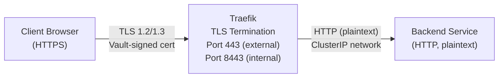

### Per-Service TLS Configuration

| Service | Ingress Type | Gateway Port | TLS Mode | Certificate Source |
|---------|-------------|-------------|----------|-------------------|
| Grafana | Gateway + HTTPRoute | 8443 | Terminate | gateway-shim annotation |
| Prometheus | Gateway + HTTPRoute | 8443 | Terminate | gateway-shim annotation |
| Alertmanager | Gateway + HTTPRoute | 8443 | Terminate | gateway-shim annotation |
| Vault | Gateway + HTTPRoute | 8443 | Terminate | gateway-shim annotation |
| Hubble UI | Gateway + HTTPRoute | 8443 | Terminate | gateway-shim annotation |
| Traefik Dashboard | IngressRoute (websecure) | 8443 | Terminate | explicit Certificate |
| Harbor | Gateway + HTTPRoute | 8443 | Terminate | gateway-shim annotation |
| Keycloak | Gateway + HTTPRoute | 8443 | Terminate | gateway-shim annotation |

### Gateway API TLS Pattern

The standard pattern for exposing services with TLS:

```yaml
apiVersion: gateway.networking.k8s.io/v1
kind: Gateway
metadata:
  annotations:
    cert-manager.io/cluster-issuer: vault-issuer  # Triggers auto-cert
spec:
  gatewayClassName: traefik
  listeners:
    - name: https
      protocol: HTTPS
      port: 8443
      hostname: <service>.<DOMAIN>
      tls:
        mode: Terminate
        certificateRefs:
          - name: <service>-<DOMAIN_DASHED>-tls  # Secret created by cert-manager
```

### Internal Communication

All inter-service communication within the cluster uses plain HTTP over ClusterIP services. TLS is only used at the ingress boundary (Traefik).

---

## 6. Authentication Architecture

### OIDC Authentication Flow

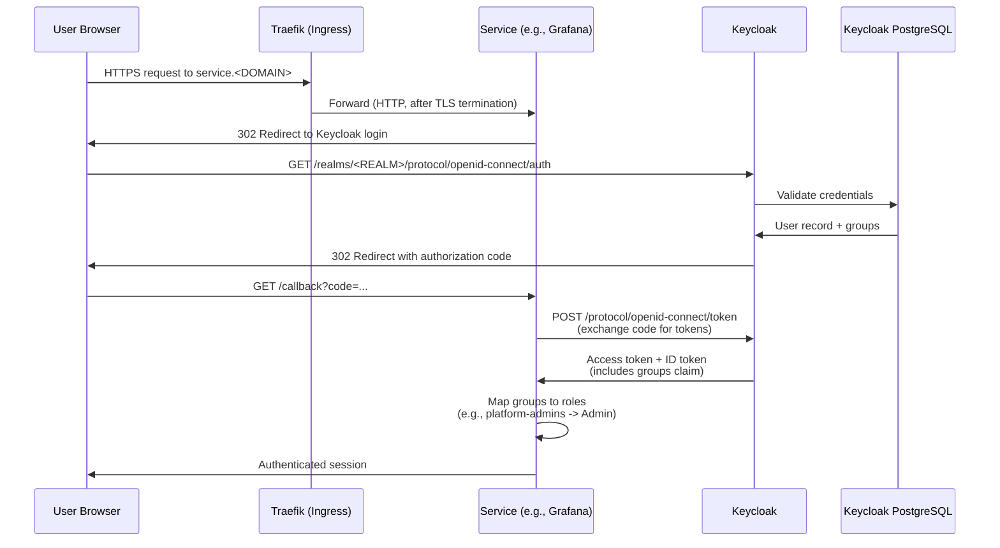

### Keycloak Deployment

| Parameter | Value |
|-----------|-------|
| Image | `quay.io/keycloak/keycloak:26.0` |
| Replicas | 2 |
| Cache | Infinispan with Kubernetes (JGroups) stack |
| Database | PostgreSQL 16.6 (CNPG, 3 instances) |
| Health port | 9000 |
| HTTP port | 8080 |
| JGroups port | 7800 |
| Hostname | `keycloak.<DOMAIN>` |
| Proxy mode | xforwarded headers |
| Metrics | Enabled on management port 9000 |
| Node selector | `workload-type: general` |

### Keycloak Security Context

| Setting | Value |
|---------|-------|
| runAsUser | 1000 |
| runAsNonRoot | true |
| fsGroup | 1000 |

### Keycloak Resource Allocation

| Resource | Request | Limit |
|----------|---------|-------|
| CPU | 500m | 2 |
| Memory | 512Mi | 1536Mi |

### Keycloak PostgreSQL (CNPG)

| Parameter | Value |
|-----------|-------|
| Image | `ghcr.io/cloudnative-pg/postgresql:16.6` |
| Instances | 3 |
| Database | `keycloak` |
| Owner | `keycloak` |
| Storage | 10Gi per instance (storageClass: harvester) |
| Node selector | `workload-type: database` |
| Data checksums | Enabled |
| Max connections | 100 |
| Backup | S3 to MinIO (`s3://cnpg-backups/keycloak-pg`) |
| Retention | 30d |

### Authentication Matrix

| Endpoint | Primary Auth | OIDC Client | SSO Status | Fallback |
|----------|-------------|-------------|------------|----------|
| `grafana.<DOMAIN>` | Keycloak OIDC | `grafana` | Implemented | Built-in login |
| `argo.<DOMAIN>` | Keycloak OIDC | `argocd` | Implemented | Local accounts |
| `harbor.<DOMAIN>` | Keycloak OIDC | `harbor` | Implemented | DB auth |
| `vault.<DOMAIN>` | Keycloak OIDC | `vault` | Implemented | Token auth |
| `mattermost.<DOMAIN>` | Keycloak OIDC | `mattermost` | Implemented | Built-in login |
| `gitlab.<DOMAIN>` | Keycloak OIDC | `gitlab` | Manual config required | Built-in login |
| `kasm.<DOMAIN>` | Keycloak OIDC | `kasm` | Manual config required | Built-in login |
| `prometheus.<DOMAIN>` | Basic auth | N/A | Planned (ForwardAuth) | Traefik middleware |
| `hubble.<DOMAIN>` | Basic auth | N/A | Planned (ForwardAuth) | Traefik middleware |
| `traefik.<DOMAIN>` | Basic auth | N/A | Planned (ForwardAuth) | Traefik middleware |
| `rollouts.<DOMAIN>` | Basic auth | N/A | Planned (ForwardAuth) | Traefik middleware |
| `keycloak.<DOMAIN>` | Keycloak (native) | N/A | N/A (is the IdP) | N/A |

### SSO Roadmap

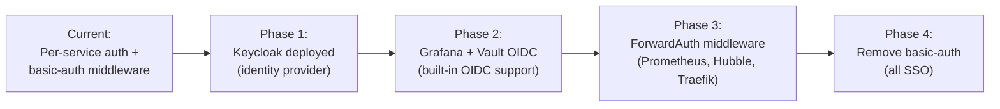

---

## 7. OIDC Client Configuration

The `setup-keycloak.sh` script creates all OIDC clients in the realm. The realm name is derived from the domain's first segment (e.g., `example` from `example.com`).

### Realm Configuration

| Parameter | Value |
|-----------|-------|
| Realm name | `<DOMAIN>` first segment (e.g., `example`) |
| Login with email | Allowed |
| Duplicate emails | Not allowed |
| Password reset | Allowed |
| Edit username | Not allowed |
| Brute force protection | Enabled |
| Failure factor | 5 attempts |
| Max failure wait | 900s (15 min) |
| SSL required | External |
| Access token lifespan | 300s (5 min) |
| SSO session idle timeout | 1800s (30 min) |
| SSO session max lifespan | 36000s (10 hours) |
| OTP policy | TOTP, HmacSHA1, 6 digits, 30s period |

### OIDC Clients

| Client ID | Name | Type | Redirect URI | Scopes | Notes |
|-----------|------|------|-------------|--------|-------|
| `grafana` | Grafana | Confidential | `https://grafana.<DOMAIN>/*` | openid, profile, email | Group-to-role mapping via `GF_AUTH_GENERIC_OAUTH_ROLE_ATTRIBUTE_PATH` |
| `argocd` | ArgoCD | Confidential | `https://argo.<DOMAIN>/auth/callback` | openid, profile, email, groups | Root CA embedded in OIDC config for TLS trust |
| `harbor` | Harbor Registry | Confidential | `https://harbor.<DOMAIN>/c/oidc/callback` | openid, profile, email | Admin group: `platform-admins`, auto-onboard enabled |
| `vault` | Vault | Confidential | `https://vault.<DOMAIN>/ui/vault/auth/oidc/oidc/callback`, `http://localhost:8250/oidc/callback` | openid, profile, email | Dual redirect for UI + CLI (kubelogin-style) |
| `mattermost` | Mattermost | Confidential | `https://mattermost.<DOMAIN>/signup/openid/complete` | openid, profile, email | Discovery endpoint used |
| `kasm` | Kasm Workspaces | Confidential | `https://kasm.<DOMAIN>/api/oidc_callback` | openid, profile, email | Manual UI config required |
| `gitlab` | GitLab | Confidential | `https://gitlab.<DOMAIN>/users/auth/openid_connect/callback` | openid, profile, email | Manual Helm/omnibus config required |
| `kubernetes` | Kubernetes (kubelogin) | **Public** | `http://localhost:8000`, `http://localhost:18000` | openid, profile, email | No client secret (public client for kubelogin) |
| `traefik-oidc` | Traefik OIDC Plugin | Confidential | `https://prometheus.<DOMAIN>/*`, `https://alertmanager.<DOMAIN>/*`, `https://hubble.<DOMAIN>/*`, `https://traefik.<DOMAIN>/*`, `https://rollouts.<DOMAIN>/*` | openid, profile, email | keycloakopenid Traefik middleware for per-site authentication |

### Common Client Settings

All confidential clients share these settings:
- `standardFlowEnabled: true`
- `directAccessGrantsEnabled: false`
- `serviceAccountsEnabled: false`
- `webOrigins: ["+"]` (CORS from all redirect origins)
- `post.logout.redirect.uris: "+"` (allow all post-logout redirects)

### Group Membership Mapper

All clients have an `oidc-group-membership-mapper` protocol mapper configured:

| Setting | Value |
|---------|-------|
| Mapper name | `group-membership` |
| Claim name | `groups` |
| Full path | false |
| ID token claim | true |
| Access token claim | true |
| Userinfo token claim | true |

### User Groups

| Group | Purpose |
|-------|---------|
| `platform-admins` | Full admin access to all services |
| `harvester-admins` | Harvester infrastructure administrators |
| `rancher-admins` | Rancher cluster management |
| `infra-engineers` | Infrastructure team with elevated access |
| `senior-developers` | Senior developers with editor-level access |
| `developers` | Standard developer access |
| `viewers` | Read-only access |

### Group-to-Role Mappings

#### Grafana

| Group | Grafana Role |
|-------|-------------|
| `platform-admins` | Admin |
| `infra-engineers` | Admin |
| `senior-developers` | Editor |
| `developers` | Editor |
| (all others) | Viewer |

#### ArgoCD

| Group | ArgoCD Role |
|-------|------------|
| `platform-admins` | role:admin |
| `developers` | role:developer (sync + get) |
| (default) | role:readonly |

#### Harbor

| Group | Harbor Role |
|-------|------------|
| `platform-admins` | OIDC admin group |

### Default Users

| Username | Email | Groups | Notes |
|----------|-------|--------|-------|
| `admin` | `admin@<DOMAIN>` | `platform-admins` | Realm admin role assigned, TOTP required |
| `user` | `user@<DOMAIN>` | `developers` | General user, TOTP required |

---

## 8. RBAC Architecture

### Cluster-Wide RBAC

| ClusterRole | Bound ServiceAccount | Namespace | Purpose |
|-------------|---------------------|-----------|---------|
| `prometheus` | `prometheus` | monitoring | Scrape metrics: nodes, pods, services, endpoints, ingresses, /metrics |
| Alloy ClusterRole | `alloy` | monitoring | Read pod logs across all namespaces |
| kube-state-metrics ClusterRole | `kube-state-metrics` | monitoring | Read all Kubernetes objects for state metrics |
| Node Exporter ClusterRole | `node-exporter` | monitoring | Host-level metrics access |
| `system:auth-delegator` | vault SA | vault | Token review for Kubernetes auth method |

### Prometheus ClusterRole Details

| API Group | Resources | Verbs |
|-----------|-----------|-------|
| `""` (core) | nodes, nodes/proxy, nodes/metrics, services, endpoints, pods | get, list, watch |
| extensions, networking.k8s.io | ingresses | get, list, watch |
| (non-resource) | /metrics, /metrics/cadvisor | get |

### Namespace-Scoped RBAC

#### cert-manager Namespace

| Resource | Name | Purpose |
|----------|------|---------|
| ServiceAccount | `vault-issuer` | Identity for Vault K8s auth |
| Role | `vault-issuer-token-creator` | Create tokens for vault-issuer SA |
| RoleBinding | `vault-issuer-token-creator-binding` | Binds cert-manager SA to token creator role |

**Role permissions**: `serviceaccounts/token` (resourceName: `vault-issuer`) -- verbs: `create`

#### keycloak Namespace

| Resource | Name | Purpose |
|----------|------|---------|
| ServiceAccount | `keycloak` | Identity for Keycloak pods |
| Role | `keycloak-pod-reader` | KUBE_PING pod discovery for JGroups clustering |
| RoleBinding | `keycloak-pod-reader` | Binds keycloak SA to pod-reader role |

**Role permissions**: `pods` -- verbs: `get`, `list`

This allows Keycloak's Infinispan/JGroups cache to discover peer pods for distributed caching via the `kubernetes` cache stack (DNS query: `keycloak-headless.keycloak.svc.cluster.local`).

### Service Accounts Inventory

| ServiceAccount | Namespace | Used By | automountToken |
|----------------|-----------|---------|----------------|
| `prometheus` | monitoring | Prometheus StatefulSet | true |
| `alloy` | monitoring | Alloy DaemonSet | true |
| `kube-state-metrics` | monitoring | kube-state-metrics Deployment | true |
| `node-exporter` | monitoring | Node Exporter DaemonSet | implied |
| `loki` | monitoring | Loki StatefulSet | implied |
| `vault-issuer` | cert-manager | cert-manager (token creation) | N/A |
| `keycloak` | keycloak | Keycloak Deployment | implied |

---

## 9. Secrets Management

### Current State

Credentials are stored in Kubernetes Secret manifests committed to git with placeholder values (`CHANGEME_*`).

| Secret | Namespace | Keys | Current State |
|--------|-----------|------|---------------|
| `keycloak-admin-secret` | keycloak | `KC_BOOTSTRAP_ADMIN_USERNAME`, `KC_BOOTSTRAP_ADMIN_PASSWORD`, `KC_BOOTSTRAP_ADMIN_CLIENT_ID`, `KC_BOOTSTRAP_ADMIN_CLIENT_SECRET` | Password is weak (`CHANGEME_KC_ADMIN_PASSWORD`), client secret is placeholder |
| `keycloak-postgres-secret` | keycloak | `POSTGRES_USER`, `POSTGRES_PASSWORD` | Password is placeholder |
| `grafana-admin-secret` | monitoring | `admin-password` | Placeholder |
| `basic-auth-users` | monitoring, kube-system | htpasswd data | Placeholder |

### Known Credential Issues

| Issue | Risk | Status |
|-------|------|--------|
| Keycloak admin password `CHANGEME_KC_ADMIN_PASSWORD` in git | Credential exposure | Must rotate after deployment |
| `CHANGEME_*` placeholders in committed Secrets | Non-functional until replaced | By design -- forces operator to set real values |
| Historical plaintext passwords in git history | Credential exposure | Rotated, placeholders committed |

### Vault KV Migration Plan

The planned architecture uses Vault KV v2 with External Secrets Operator to sync secrets into Kubernetes:

```mermaid
graph LR
    subgraph Vault["Vault KV v2 (secret/)"]
        G["secret/monitoring/grafana"]
        BA["secret/monitoring/basic-auth"]
        KC["secret/keycloak/postgres"]
        TF["secret/terraform/tfvars"]
    end

    subgraph ESO["External Secrets Operator"]
        CSS["ClusterSecretStore<br/>(vault-backend)"]
        ES["ExternalSecret<br/>(per namespace)"]
    end

    subgraph K8s["Kubernetes Secrets"]
        S1["grafana-admin-secret"]
        S2["basic-auth-users"]
        S3["keycloak-pg-credentials"]
    end

    Vault --> CSS
    CSS --> ES
    ES -->|"auto-sync<br/>refreshInterval: 1h"| K8s
```

**Migration phases**:
1. Enable Vault KV v2 secrets engine at `secret/`
2. Store credentials in Vault KV
3. Deploy External Secrets Operator
4. Create ClusterSecretStore + ExternalSecrets
5. Remove static Secret manifests from git
6. Migrate Terraform secrets to Vault KV

### Credential Rotation Checklist

| Credential | Location | Rotation Method |
|------------|----------|-----------------|
| Grafana admin password | K8s Secret | Update secret, restart pod |
| Basic-auth passwords | K8s Secrets (htpasswd) | Update secret |
| Vault root token | vault-init.json | `vault token revoke` + `vault operator generate-root` |
| Vault unseal keys | vault-init.json | `vault operator rekey` |
| Harbor admin password | Harbor UI | Settings > Change Password |
| Keycloak admin | Keycloak UI | Admin Console > Users |
| PostgreSQL passwords | K8s Secrets | Update secret, restart consumers |
| MinIO access keys | K8s Secrets per namespace | Update secret, restart consumers |
| ArgoCD admin | ArgoCD UI | Settings > Accounts |

---

## 10. Network Security

### Network Topology

All services are accessed externally through a single Traefik ingress point at `203.0.113.202`. The cluster is on an internal network accessible only via VPN.

| Access Type | Description |
|-------------|-------------|
| External | All services via Traefik at 203.0.113.202 (HTTPS only, port 443) |
| Internal | Inter-service via ClusterIP services (HTTP, no TLS) |
| Cluster access | VPN only -- no public internet exposure |

### Cilium CNI

The cluster uses Cilium as the CNI plugin, providing:
- eBPF-based networking
- Hubble flow observability (metrics scraped by Prometheus via `hubble-relay` job)
- Network policy enforcement (planned -- currently no policies deployed)

### Host Firewall (iptables)

All nodes run iptables with `INPUT DROP` default policy. Only required ports are opened for Kubernetes, RKE2, and service operation.

### ARP Hardening

Worker nodes with dual-NIC configurations have ARP hardening enabled:
- `arp_ignore=1` -- respond only on the interface with the target address
- `arp_announce=2` -- use best local address for ARP source

### Known Network Security Gaps

| Gap | Risk | Planned Mitigation |
|-----|------|-------------------|
| No Kubernetes NetworkPolicies | Lateral movement between namespaces | Cilium NetworkPolicy per namespace |
| Internal services use HTTP (no mTLS) | Traffic visible within cluster network | mTLS for sensitive paths (future) |
| Cilium agent port 9962 blocked by host firewall | Incomplete monitoring | Open port on all nodes |

---

## 11. Container Security

### Security Context Summary

| Component | runAsUser | runAsGroup | fsGroup | runAsNonRoot | readOnlyRootFs | allowPrivilegeEscalation | hostNetwork | hostPID |
|-----------|-----------|------------|---------|-------------|----------------|--------------------------|-------------|---------|
| Prometheus | 65534 | 65534 | 65534 | true | no | -- | no | no |
| Grafana | 472 | 472 | 472 | -- | no | -- | no | no |
| Loki | 10001 | 10001 | 10001 | -- | no | -- | no | no |
| Alertmanager | 65534 | 65534 | 65534 | true | no | -- | no | no |
| Alloy | -- | -- | -- | -- | no | -- | no | no |
| Node Exporter | -- | -- | -- | -- | **yes** | **false** | no | **yes** |
| kube-state-metrics | 65534 | -- | -- | true | **yes** | **false** | no | no |
| Vault | 100 | 1000 | 1000 | -- | no | -- | no | no |
| Keycloak | 1000 | -- | 1000 | true | no | -- | no | no |

### Security Hardening Patterns

**Non-root enforcement**: Most components run as non-root users (UID 65534 `nobody`, or service-specific UIDs like 472 for Grafana, 10001 for Loki, 1000 for Keycloak).

**Read-only root filesystem**: Node Exporter and kube-state-metrics use `readOnlyRootFilesystem: true` for minimal attack surface.

**Privilege escalation prevention**: Node Exporter and kube-state-metrics explicitly set `allowPrivilegeEscalation: false`.

**Host namespace access**: Only Node Exporter requires `hostPID: true` for accurate process metrics. All other components run in isolated namespaces.

### Known Container Security Gaps

| Gap | Affected Components | Planned Mitigation |
|-----|-------------------|-------------------|
| No Pod Security Standards (PSA) enforcement | All namespaces | Enforce `restricted` PSA profile |
| Alloy has no securityContext | Alloy DaemonSet | Add non-root, read-only where possible |
| Some containers lack readOnlyRootFilesystem | Prometheus, Grafana, Loki, Alertmanager, Vault, Keycloak | Evaluate feasibility per component |

---

## 12. Security Decision Tree

### When to Use Which Authentication Method

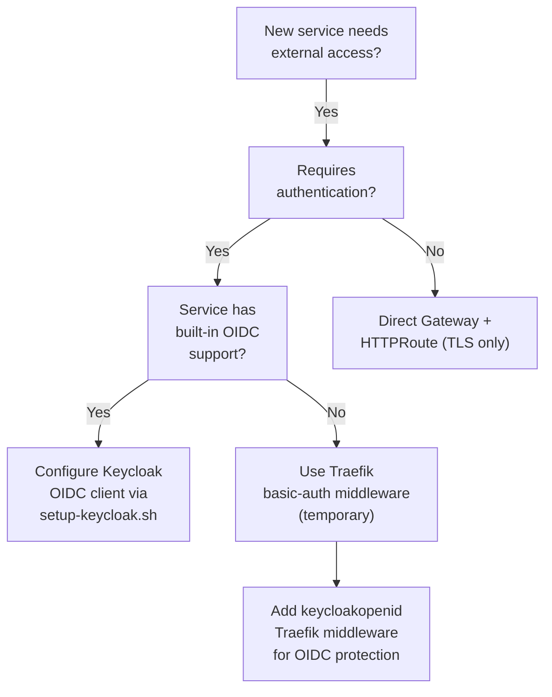

### When to Use Which TLS Method

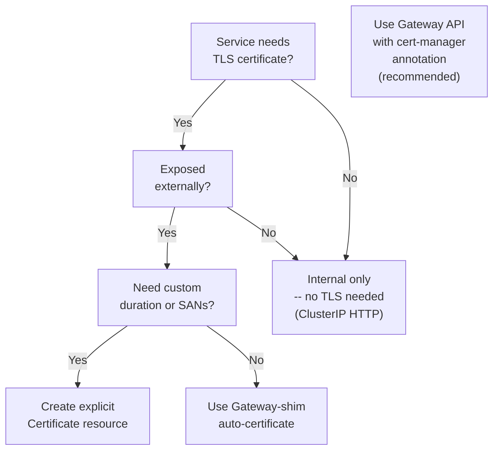

### SSO Migration Decision Tree

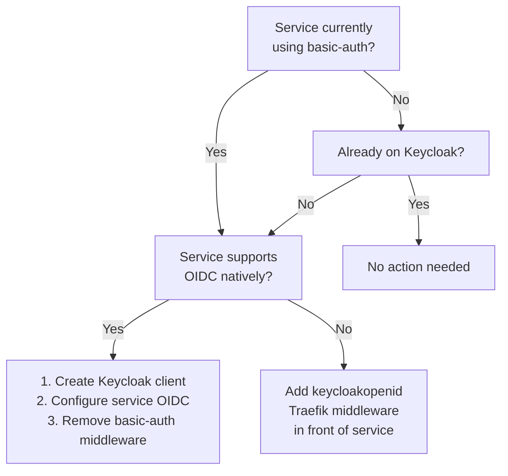

---

## 13. Known Security Debt

Consolidated view of all security gaps with priority and mitigation status.

| Issue | Risk | Mitigation | Priority |
|-------|------|------------|----------|
| Git history contains old passwords | Credential exposure | Passwords rotated, placeholders committed | High (done) |
| No Kubernetes NetworkPolicies | Lateral movement between namespaces | Plan: Cilium NetworkPolicy per namespace | Medium |
| Basic-auth on 4 services | Weak auth, no MFA | Plan: Keycloak SSO via ForwardAuth (Phase 3) | Medium |
| No secret scanning in CI | Credential leak risk | Plan: GitLab secret detection | Medium |
| No Pod Security Standards (PSA) enforcement | Privileged containers possible | Plan: PSA enforce `restricted` profile | Low |
| Vault Shamir unseal (manual) | Operational risk on restart | Plan: Auto-unseal via transit/KMS | Low |
| Internal services use HTTP (no mTLS) | Traffic visible within cluster network | Plan: mTLS for sensitive paths | Low |
| etcd mTLS certs manually copied | Operational risk | Plan: Automate via cloud-init or golden image | Low |
| Alloy has no securityContext | Container runs as root | Plan: Add non-root, read-only where possible | Low |
| Cilium agent port 9962 blocked by host firewall | Incomplete monitoring | Plan: Open port on all nodes | Low |

---

## Related Files

| File | Path |
|------|------|
| Vault Helm values | `services/vault/vault-values.yaml` |
| Vault Gateway | `services/vault/gateway.yaml` |
| Vault HTTPRoute | `services/vault/httproute.yaml` |
| cert-manager ClusterIssuer | `services/cert-manager/cluster-issuer.yaml` |
| cert-manager RBAC | `services/cert-manager/rbac.yaml` |
| Keycloak Deployment | `services/keycloak/keycloak/deployment.yaml` |
| Keycloak RBAC | `services/keycloak/keycloak/rbac.yaml` |
| Keycloak Secrets | `services/keycloak/keycloak/secret.yaml` |
| Keycloak PG Cluster | `services/keycloak/postgres/keycloak-pg-cluster.yaml` |
| Default TLS Store | `services/monitoring-stack/kube-system/traefik-default-tlsstore.yaml` |
| Keycloak Setup Script | `scripts/setup-keycloak.sh` |
| Vault HA Migration | `docs/vault-ha.md` |
| Vault Credential Storage | `docs/vault-credential-storage.md` |

---

## Related Documentation

- [Vault HA Migration](../vault-ha.md) -- HA migration process and operational considerations
- [Vault Credential Storage](../vault-credential-storage.md) -- Migration to Vault KV + ESO
- [TLS Integration Guide](../../services/monitoring-stack/docs/tls-integration-guide.md) -- Developer guide for adding TLS to new services
- [Monitoring and Observability](monitoring-observability.md) -- Security alert rules and monitoring integration
