# Services Reference Manual

Comprehensive engineering reference for all services deployed on the RKE2 cluster running on Rancher/Harvester. Each section provides architecture diagrams, Kubernetes resource inventories, configuration details, storage specifications, networking, security contexts, monitoring integration, high availability design, dependencies, and known issues.

> **Note**: Throughout this document, `<DOMAIN>` refers to the root domain configured in `scripts/.env`. Derived formats: `<DOMAIN_DASHED>` = dots replaced with hyphens, `<DOMAIN_DOT>` = dots replaced with `-dot-`. All service FQDNs follow `<service>.<DOMAIN>`.

---

## Table of Contents

1. [Master Service Dependency Diagram](#1-master-service-dependency-diagram)
2. [Complete Resource Budget](#2-complete-resource-budget)
3. [Vault](#3-vault)
4. [cert-manager](#4-cert-manager)
5. [Monitoring Stack](#5-monitoring-stack)
6. [Harbor](#6-harbor)
7. [ArgoCD and Argo Rollouts](#7-argocd-and-argo-rollouts)
8. [Keycloak](#8-keycloak)
9. [Mattermost](#9-mattermost)
10. [Kasm Workspaces](#10-kasm-workspaces)
11. [Uptime Kuma](#11-uptime-kuma)
12. [LibreNMS](#12-librenms)
13. [Node Labeler](#13-node-labeler)
14. [Storage Autoscaler](#14-storage-autoscaler)

---

## 1. Master Service Dependency Diagram

```mermaid
graph TD
    subgraph Infrastructure["Infrastructure Layer"]
        RKE2["RKE2 Cluster<br/>(Cilium CNI, Traefik LB)"]
        Harvester["Harvester CSI<br/>(StorageClass: harvester)"]
        CNPGOp["CNPG Operator<br/>(cnpg-system)"]
        MariaDBOp["MariaDB Operator<br/>(mariadb-operator-system)"]
        RedisOp["OpsTree Redis Operator<br/>(ot-operators)"]
    end

    subgraph PKI["PKI and Certificate Layer"]
        Vault["Vault HA (3 replicas)<br/>PKI engine, pki_int/"]
        CertMgr["cert-manager<br/>vault-issuer ClusterIssuer"]
    end

    subgraph Monitoring["Observability Layer"]
        Prometheus["Prometheus<br/>(27 scrape jobs)"]
        Grafana["Grafana<br/>(27+ dashboards)"]
        Loki["Loki<br/>(TSDB, 50Gi)"]
        Alloy["Alloy DaemonSet<br/>(log collection)"]
        Alertmanager["Alertmanager<br/>(route to receivers)"]
        NodeExporter["Node Exporter<br/>(DaemonSet)"]
        KSM["kube-state-metrics"]
    end

    subgraph GitOps["GitOps Layer"]
        ArgoCD["ArgoCD HA<br/>(app-of-apps)"]
        Rollouts["Argo Rollouts<br/>(canary/blue-green)"]
    end

    subgraph Identity["Identity Layer"]
        Keycloak["Keycloak HA<br/>(Infinispan, OIDC)"]
    end

    subgraph Apps["Application Layer"]
        Harbor["Harbor HA<br/>(container registry)"]
        Mattermost["Mattermost<br/>(team messaging)"]
        Kasm["Kasm Workspaces<br/>(virtual desktops)"]
        UptimeKuma["Uptime Kuma<br/>(status monitoring)"]
        LibreNMS["LibreNMS<br/>(network monitoring)"]
    end

    subgraph Operators["Custom Operators"]
        NodeLabeler["Node Labeler<br/>(auto-label nodes)"]
        StorageAS["Storage Autoscaler<br/>(PVC expansion)"]
    end

    RKE2 --> Vault
    Harvester --> Vault
    Vault --> CertMgr
    CertMgr --> Grafana
    CertMgr --> Prometheus
    CertMgr --> ArgoCD
    CertMgr --> Keycloak
    CertMgr --> Harbor
    CertMgr --> Mattermost
    CertMgr --> Kasm
    CertMgr --> UptimeKuma
    CertMgr --> LibreNMS
    CertMgr --> Rollouts

    CNPGOp --> Harbor
    CNPGOp --> Keycloak
    CNPGOp --> Mattermost
    CNPGOp --> Kasm
    MariaDBOp --> LibreNMS
    RedisOp --> LibreNMS

    Prometheus --> Grafana
    Loki --> Grafana
    Alloy --> Loki
    Prometheus --> Alertmanager

    StorageAS --> Prometheus

    Keycloak -.->|"OIDC SSO"| Grafana
    Keycloak -.->|"OIDC SSO"| Vault
    Keycloak -.->|"OIDC SSO"| ArgoCD
    Keycloak -.->|"OIDC SSO"| Harbor
    Keycloak -.->|"ForwardAuth"| Prometheus
    Keycloak -.->|"ForwardAuth"| UptimeKuma
    Keycloak -.->|"ForwardAuth"| LibreNMS

    ArgoCD -->|"GitOps sync"| Harbor
    ArgoCD -->|"GitOps sync"| Mattermost

    style Infrastructure fill:#e3f2fd
    style PKI fill:#fff3e0
    style Monitoring fill:#e8f5e9
    style GitOps fill:#f3e5f5
    style Identity fill:#fce4ec
    style Apps fill:#e0f7fa
    style Operators fill:#fff9c4
```

### Deployment Order

| Phase | Services | Rationale |
|-------|----------|-----------|
| 0 | RKE2, Cilium, Traefik, Harvester CSI | Infrastructure base |
| 1 | cert-manager | Must exist before any TLS certificate issuance |
| 2 | Vault (HA Raft) | PKI backend for cert-manager ClusterIssuer |
| 3 | Monitoring Stack, Node Labeler | Observability for all subsequent deployments |
| 4 | CNPG Operator, MariaDB Operator, Redis Operator | Database infrastructure for stateful services |
| 5 | ArgoCD + Argo Rollouts | GitOps engine for remaining deployments |
| 6 | Keycloak | Identity provider for SSO integration |
| 7 | Harbor, Mattermost, Kasm, Uptime Kuma, LibreNMS | Application services |
| 8 | Storage Autoscaler | Automated PVC expansion (requires Prometheus) |

---

## 2. Complete Resource Budget

### Per-Service CPU and Memory (Requests / Limits)

| Service | Component | Replicas | CPU Request | CPU Limit | Mem Request | Mem Limit | Pool |
|---------|-----------|----------|-------------|-----------|-------------|-----------|------|
| **Vault** | Server | 3 | 250m | 1 | 256Mi | 512Mi | database |
| **cert-manager** | Controller | 1 | - | - | - | - | general |
| **cert-manager** | Webhook | 1 | - | - | - | - | general |
| **cert-manager** | CAInjector | 1 | - | - | - | - | general |
| **Prometheus** | StatefulSet | 1 | 500m | 2 | 2Gi | 4Gi | general |
| **Grafana** | Deployment | 1 | 500m | 1 | 512Mi | 1Gi | general |
| **Loki** | StatefulSet | 1 | 250m | 1 | 512Mi | 2Gi | general |
| **Alloy** | DaemonSet | all | 100m | 500m | 128Mi | 512Mi | all |
| **Alertmanager** | StatefulSet | 1 | 50m | 200m | 64Mi | 256Mi | general |
| **Node Exporter** | DaemonSet | all | 50m | 250m | 64Mi | 256Mi | all |
| **kube-state-metrics** | Deployment | 1 | 100m | 500m | 256Mi | 512Mi | general |
| **Harbor** | Core | 2 | 250m | 1 | 256Mi | 512Mi | general |
| **Harbor** | Portal | 2 | 50m | 500m | 64Mi | 128Mi | general |
| **Harbor** | Registry | 2 | 250m | 1 | 256Mi | 1Gi | general |
| **Harbor** | JobService | 2 | 100m | 1 | 256Mi | 512Mi | general |
| **Harbor** | Trivy | 2 | 200m | 1 | 512Mi | 1Gi | general |
| **Harbor** | Exporter | 1 | 50m | 200m | 64Mi | 128Mi | general |
| **Harbor** | MinIO | 1 | 250m | 1 | 512Mi | 2Gi | database |
| **Harbor** | CNPG (harbor-pg) | 3 | 250m | 1 | 512Mi | 1Gi | database |
| **Harbor** | Valkey Sentinel | 3+3 | - | - | - | - | harbor |
| **ArgoCD** | Server | 2 | - | - | - | - | general |
| **ArgoCD** | Controller | 2 | - | - | - | - | general |
| **ArgoCD** | Repo-Server | 2 | - | - | - | - | general |
| **ArgoCD** | AppSet | 2 | - | - | - | - | general |
| **ArgoCD** | Redis HA | 3+3 | - | - | - | - | general |
| **Argo Rollouts** | Controller | 2 | - | - | - | - | general |
| **Argo Rollouts** | Dashboard | 1 | - | - | - | - | general |
| **Keycloak** | Server | 2 | 500m | 2 | 512Mi | 1536Mi | general |
| **Keycloak** | PostgreSQL (CNPG) | 3 | 250m | 1 | 512Mi | 1Gi | database |
| **Mattermost** | Server | 1 | 500m | 2 | 1Gi | 4Gi | general |
| **Mattermost** | PostgreSQL (CNPG) | 3 | 250m | 1 | 512Mi | 2Gi | database |
| **Mattermost** | MinIO | 1 | 250m | 1 | 512Mi | 2Gi | general |
| **Kasm** | Proxy | 1 | - | - | - | - | general |
| **Kasm** | Manager | 1 | - | - | - | - | general |
| **Kasm** | Share | 1 | - | - | - | - | general |
| **Kasm** | CNPG (kasm-pg) | 3 | 250m | 1 | 512Mi | 1Gi | database |
| **Uptime Kuma** | Server | 1 | 100m | 500m | 128Mi | 256Mi | general |
| **LibreNMS** | Server | 1 | 250m | 1 | 512Mi | 1Gi | general |
| **LibreNMS** | MariaDB Galera | 3 | 250m | 1 | 512Mi | 1Gi | database |
| **LibreNMS** | Valkey Replication | 3 | 100m | 500m | 128Mi | 256Mi | database |
| **LibreNMS** | Valkey Sentinel | 3 | 50m | 200m | 64Mi | 128Mi | database |
| **Node Labeler** | Controller | 1 | 10m | 100m | 32Mi | 64Mi | general |
| **Storage Autoscaler** | Controller | 1 | 50m | 200m | 64Mi | 128Mi | general |

### Storage Budget

| PVC | Namespace | Size | StorageClass | Service |
|-----|-----------|------|-------------|---------|
| data-vault-{0,1,2} | vault | 10Gi x3 | harvester | Vault Raft |
| data-prometheus-0 | monitoring | 50Gi | harvester | Prometheus TSDB |
| data-loki-0 | monitoring | 50Gi | harvester | Loki chunks |
| grafana-data | monitoring | 10Gi | harvester | Grafana |
| data-alertmanager-0 | monitoring | 5Gi | harvester | Alertmanager |
| minio-data | minio | 200Gi | harvester | Harbor MinIO |
| harbor-pg PVCs | database | 20Gi x3 | harvester | Harbor PostgreSQL |
| harbor-valkey PVCs | harbor | varies | harvester | Harbor Redis |
| keycloak-pg PVCs | database | 10Gi x3 | harvester | Keycloak PostgreSQL |
| mattermost-pg PVCs | database | 20Gi x3 | harvester | Mattermost PostgreSQL |
| mattermost-minio | mattermost | 20Gi | harvester | Mattermost MinIO |
| kasm-pg PVCs | database | 20Gi x3 | harvester | Kasm PostgreSQL |
| uptime-kuma-data | uptime-kuma | 2Gi | harvester | Uptime Kuma |
| librenms-data | librenms | 10Gi | harvester | LibreNMS |
| librenms-mariadb PVCs | librenms | 10Gi x3 | harvester | LibreNMS MariaDB |
| librenms-redis PVCs | librenms | 2Gi x3 | harvester | LibreNMS Valkey |

---

## 3. Vault

### 3.1 Architecture

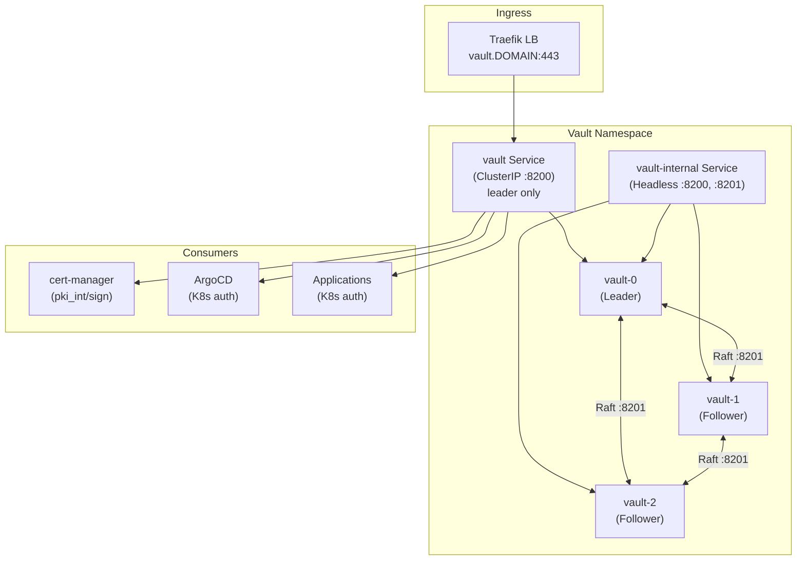

### 3.2 Kubernetes Resources

| Resource Type | Name | Namespace | Purpose |
|--------------|------|-----------|---------|
| StatefulSet | vault | vault | 3-replica HA Vault server |
| Service (ClusterIP) | vault | vault | Routes to active leader on :8200 |
| Service (Headless) | vault-internal | vault | Raft peer discovery :8200, :8201 |
| ServiceAccount | vault | vault | Pod identity and K8s auth |
| ClusterRoleBinding | vault-auth-delegator | - | Token review delegation |
| PVC | data-vault-{0,1,2} | vault | Raft storage (10Gi each) |
| Gateway | vault | vault | HTTPS ingress with cert-manager annotation |
| HTTPRoute | vault | vault | Route to vault :8200 |
| Secret | (auto via gateway-shim) | vault | TLS certificate for vault.DOMAIN |

### 3.3 Configuration

| Parameter | Value | Source |
|-----------|-------|--------|
| Vault Version | 1.19.0 | vault-values.yaml `server.image.tag` |
| Helm Chart | hashicorp/vault 0.32.0 | Helm repository |
| HA Mode | Raft integrated storage | `server.ha.raft.enabled: true` |
| Replicas | 3 | `server.ha.replicas: 3` |
| UI Enabled | true | `ui.enabled: true` |
| Injector | disabled | `injector.enabled: false` |
| Telemetry | Prometheus /v1/sys/metrics | `unauthenticated_metrics_access: true` |
| Shamir Shares | 5 shares, threshold 3 | Init parameters |
| PKI Mount | `pki_int/` only | Intermediate CA (Root CA external) |
| Leaf Cert TTL | 720h (30 days) | PKI role max_ttl |
| Root CA Validity | 15 years (5475 days) | External openssl |
| Intermediate CA Validity | 10 years (3650 days) | Signed by Root CA |

**Environment Variables**: None. Vault is configured entirely via HCL config in Helm values.

**Secrets**:
- `vault-init.json` -- unseal keys + root token (stored as K8s secret in `terraform-state` namespace)
- Root CA private key -- never enters cluster; stored on local machine + Harvester

### 3.4 Storage

| PVC | Size | StorageClass | Access Mode | Backup |
|-----|------|-------------|-------------|--------|
| data-vault-0 | 10Gi | harvester | RWO | Raft snapshot |
| data-vault-1 | 10Gi | harvester | RWO | Raft replication |
| data-vault-2 | 10Gi | harvester | RWO | Raft replication |

### 3.5 Database Backend

Vault uses integrated Raft storage (not an external database). Raft state is stored on local PVCs. Raft automatically replicates across all 3 replicas.

| Parameter | Value |
|-----------|-------|
| Storage type | Raft |
| Path | /vault/data |
| Performance multiplier | 1 |
| Trailing logs | 10000 |
| Snapshot threshold | 8192 |
| Quorum | 2/3 nodes |

### 3.6 Networking

| Port | Protocol | Purpose |
|------|----------|---------|
| 8200 | TCP/HTTP | Client API + UI |
| 8201 | TCP | Raft cluster communication |
| 443 | HTTPS | External via Traefik Gateway |

**Ingress**: Gateway API with HTTPRoute. TLS termination at Traefik; no basic-auth (Vault has own auth).

**TLS Certificate**: Auto-created by cert-manager gateway-shim from Gateway annotation (`cert-manager.io/cluster-issuer: vault-issuer`).

### 3.7 Security

| Context | Value |
|---------|-------|
| nodeSelector | `workload-type: database` |
| ServiceAccount | vault |
| ClusterRole | system:auth-delegator |
| Seal Type | Shamir (manual unseal) |
| K8s Auth Method | Enabled for cert-manager, ArgoCD |

### 3.8 Monitoring Integration

- **Prometheus scrape job**: `vault` (job #14 in prometheus configmap)
- **Metrics path**: `/v1/sys/metrics?format=prometheus`
- **Target discovery**: Endpoints SD in vault namespace, `vault-internal` service
- **Alert rules**: VaultSealed (critical, 2m), VaultDown (critical, 2m), VaultLeaderLost (critical, 5m)
- **Grafana dashboard**: `configmap-dashboard-vault.yaml`

### 3.9 High Availability

| Feature | Configuration |
|---------|--------------|
| Replicas | 3 (StatefulSet) |
| Leader election | Raft consensus (~10s failover) |
| Pod anti-affinity | Preferred, hostname topology |
| Quorum | 2/3 nodes must be healthy |
| Read availability | Any unsealed replica |
| Write availability | Leader only |

### 3.10 Dependencies

| Dependency | Required | Purpose |
|------------|----------|---------|
| Harvester CSI | Yes | PVC provisioning |
| Traefik | Yes | Ingress routing |
| cert-manager | Circular | Vault provides PKI for cert-manager; cert-manager provides TLS for Vault |
| DNS | Yes | vault.DOMAIN -> 203.0.113.202 |

### 3.11 Common Issues

| Issue | Symptom | Solution |
|-------|---------|----------|
| Sealed after restart | 503 on API, pods Running but not Ready | Unseal all 3 replicas with 3-of-5 keys |
| Raft peer join failure | `couldn't join raft cluster` in logs | Check DNS for vault-internal; scale to 1 then back to 3 |
| ClusterIssuer not ready | vault-issuer shows READY=False | Unseal Vault; verify K8s auth method exists |
| Lost unseal keys | Cannot unseal, Vault permanently locked | Recover from terraform-state secret; rebuild if not available |
| Raft disk full | snapshot/disk full errors | Trigger manual snapshot; expand PVC |

---

## 4. cert-manager

### 4.1 Architecture

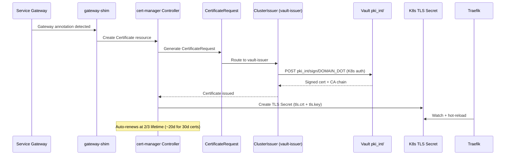

### 4.2 Kubernetes Resources

| Resource Type | Name | Namespace | Purpose |
|--------------|------|-----------|---------|
| Deployment | cert-manager | cert-manager | Controller + gateway-shim |
| Deployment | cert-manager-webhook | cert-manager | Admission webhook |
| Deployment | cert-manager-cainjector | cert-manager | CA bundle injection |
| ServiceAccount | vault-issuer | cert-manager | Token for Vault K8s auth |
| Role | vault-issuer-token-creator | cert-manager | Create SA tokens |
| RoleBinding | vault-issuer-token-creator | cert-manager | Bind role to cert-manager |
| ClusterIssuer | vault-issuer | - | Points to Vault PKI |

### 4.3 Configuration

| Parameter | Value |
|-----------|-------|
| Chart | jetstack/cert-manager v1.19.3 |
| CRDs | Installed via `crds.enabled=true` |
| Gateway API | `enableGatewayAPI=true` (controller config) |
| nodeSelector | `workload-type: general` (all components) |
| ClusterIssuer server | `http://vault.vault.svc.cluster.local:8200` |
| PKI sign path | `pki_int/sign/<DOMAIN_DOT>` |
| K8s auth role | `cert-manager-issuer` |
| ServiceAccount | `vault-issuer` |

### 4.4 Storage

cert-manager is stateless. No PVCs required.

### 4.5 Database Backend

Not applicable. cert-manager stores state in Kubernetes CRDs (Certificate, CertificateRequest, Order, Challenge).

### 4.6 Networking

| Port | Protocol | Purpose |
|------|----------|---------|
| 9402 | TCP | Prometheus metrics |
| 10250 | TCP | Webhook HTTPS |

### 4.7 Security

cert-manager pods run with default security contexts from the Helm chart. The `vault-issuer` ServiceAccount has minimal RBAC: only token creation for Vault K8s auth.

### 4.8 Monitoring Integration

- **Prometheus scrape job**: `cert-manager` (job #15)
- **Port**: `tcp-prometheus-servicemonitor` on cert-manager endpoints
- **Alert rules**: CertExpiringSoon (warning, <7d), CertNotReady (warning, 15m), CertManagerDown (critical, 5m)
- **Grafana dashboard**: `configmap-dashboard-cert-manager.yaml`

### 4.9 High Availability

cert-manager runs with 1 replica by default. Leader election is built in, so multiple replicas can run safely. Single replica is sufficient for this cluster size.

### 4.10 Dependencies

| Dependency | Required | Purpose |
|------------|----------|---------|
| Vault | Yes | PKI backend for signing certificates |
| Gateway API CRDs | Yes | gateway-shim requires Gateway API |
| Traefik | Yes | Consumes TLS secrets |

### 4.11 Certificate Inventory

| Certificate | Namespace | Method |
|-------------|-----------|--------|
| grafana.DOMAIN | monitoring | Auto (gateway-shim) |
| prometheus.DOMAIN | monitoring | Auto (gateway-shim) |
| hubble.DOMAIN | kube-system | Auto (gateway-shim) |
| traefik.DOMAIN | kube-system | Explicit Certificate |
| vault.DOMAIN | vault | Auto (gateway-shim) |
| harbor.DOMAIN | harbor | Auto (gateway-shim) |
| keycloak.DOMAIN | keycloak | Auto (gateway-shim) |
| argo.DOMAIN | argocd | Auto (gateway-shim) |
| rollouts.DOMAIN | argo-rollouts | Auto (gateway-shim) |
| mattermost.DOMAIN | mattermost | Auto (gateway-shim) |
| kasm.DOMAIN | kasm | Explicit Certificate (IngressRoute exception) |
| librenms.DOMAIN | librenms | Auto (gateway-shim) |
| uptime.DOMAIN | uptime-kuma | Auto (gateway-shim) |

### 4.12 Common Issues

| Issue | Symptom | Solution |
|-------|---------|----------|
| ClusterIssuer not ready | READY=False on vault-issuer | Unseal Vault; check K8s auth config |
| Certificate stuck Issuing | Certificate never becomes Ready | Check CertificateRequest; verify Vault PKI role allows domain |
| gateway-shim not working | No auto-cert from Gateway annotation | Verify `enableGatewayAPI=true` in controller config (not old feature gate) |
| After Vault rebuild | Old certs persist with wrong CA | Delete all TLS secrets cluster-wide; cert-manager reissues |

---

## 5. Monitoring Stack

### 5.1 Architecture

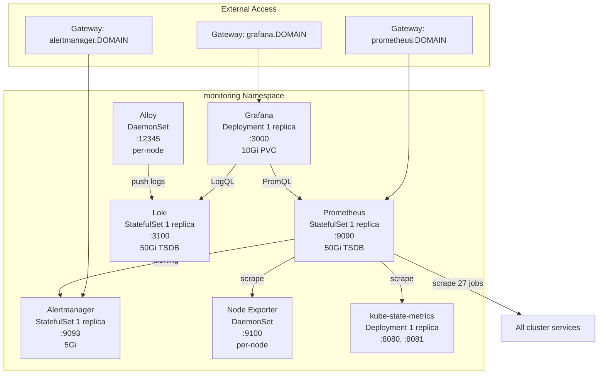

### 5.2 Kubernetes Resources

| Resource Type | Name | Namespace | Purpose |
|--------------|------|-----------|---------|
| Namespace | monitoring | - | All monitoring components |
| StatefulSet | prometheus | monitoring | Metrics storage + scraping |
| StatefulSet | loki | monitoring | Log aggregation |
| StatefulSet | alertmanager | monitoring | Alert routing |
| Deployment | grafana | monitoring | Visualization + dashboards |
| Deployment | kube-state-metrics | monitoring | K8s object metrics |
| DaemonSet | alloy | monitoring | Log collection per node |
| DaemonSet | node-exporter | monitoring | Host metrics per node |
| Service (ClusterIP) | prometheus | monitoring | :9090 |
| Service (ClusterIP) | loki | monitoring | :3100 |
| Service (ClusterIP) | grafana | monitoring | :3000 |
| Service (ClusterIP) | alertmanager | monitoring | :9093 |
| Service (ClusterIP) | kube-state-metrics | monitoring | :8080, :8081 |
| Service (Headless) | node-exporter | monitoring | :9100 per node |
| Service (Headless) | alloy | monitoring | :12345 per node |
| ConfigMap | prometheus-config | monitoring | 27 scrape jobs + alert rules |
| ConfigMap | alertmanager-config | monitoring | Route/receiver config |
| ConfigMap | loki-config | monitoring | TSDB + retention config |
| ConfigMap | alloy-config | monitoring | River pipeline config |
| ConfigMap | grafana-datasources | monitoring | Prometheus + Loki sources |
| ConfigMap | grafana-dashboard-* (27+) | monitoring | Pre-provisioned dashboards |
| Secret | grafana-admin-secret | monitoring | Admin password |
| Secret | etcd-certs | monitoring | etcd TLS certs (optional, mounted but unused -- etcd scraped via plain HTTP :2381) |
| Secret | oauth2-proxy-prometheus | monitoring | oauth2-proxy OIDC client + cookie secret |
| Secret | oauth2-proxy-alertmanager | monitoring | oauth2-proxy OIDC client + cookie secret |
| PVC | data-prometheus-0 | monitoring | 50Gi TSDB |
| PVC | data-loki-0 | monitoring | 50Gi log store |
| PVC | grafana-data | monitoring | 10Gi |
| PVC | data-alertmanager-0 | monitoring | 5Gi |
| Gateway | monitoring | monitoring | HTTPS for Grafana, Prometheus |
| HTTPRoute | grafana, prometheus | monitoring | Route to services |
| Gateway | alertmanager | monitoring | HTTPS for Alertmanager |
| HelmChartConfig | rke2-traefik | kube-system | Traefik overrides: LB IP, Gateway API, timeouts, access logs, OTLP tracing |
| TLSStore | default | kube-system | Sets Vault-issued wildcard cert as Traefik default TLS certificate |
| Service (ClusterIP) | traefik-api | kube-system | :8080 (Traefik internal API for dashboard) |
| Gateway | traefik-dashboard | kube-system | HTTPS for Traefik dashboard |
| HTTPRoute | traefik-dashboard | kube-system | Route to traefik-api :8080 with oauth2-proxy ForwardAuth |

### 5.3 Configuration

**Prometheus**:

| Parameter | Value |
|-----------|-------|
| Scrape interval | 30s |
| Evaluation interval | 30s |
| Scrape timeout | 10s |
| Retention (time) | 30d |
| Retention (size) | 40GB |
| Storage path | /prometheus |
| Web lifecycle | Enabled |
| Total scrape jobs | 27 |

**Loki**:

| Parameter | Value |
|-----------|-------|
| Mode | Monolithic (`-target=all`) |
| Schema | v13 (TSDB) |
| Storage backend | Filesystem (/loki/chunks) |
| Retention | 168h (7 days) |
| Ingestion rate limit | 20 MB/s (burst: 40 MB/s) |
| Max streams per user | 50,000 |
| Auth | Disabled |

**Alertmanager**:

| Parameter | Value |
|-----------|-------|
| Resolve timeout | 5m |
| Group wait | 30s (10s for critical) |
| Group interval | 5m |
| Repeat interval | 4h (1h for critical) |
| Routing | By alertname, namespace, job |

**Alert Rule Groups**: node-alerts, kubernetes-alerts, vault-alerts, certmanager-alerts, gitlab-alerts, postgresql-alerts, monitoring-self-alerts, traefik-alerts, cilium-alerts, argocd-alerts, harbor-alerts, keycloak-alerts, mattermost-alerts, security-alerts.

**Traefik HelmChartConfig** (`kube-system/rke2-traefik`):

| Parameter | Value |
|-----------|-------|
| Service type | LoadBalancer (Cilium L2) |
| Gateway API provider | Enabled |
| Access logging | Enabled |
| OTLP tracing | Enabled |
| HTTP -> HTTPS redirect | web entryPoint redirects to websecure |
| API insecure | true (enables dashboard on :8080) |
| Read/Write timeout | 1800s (both web and websecure entryPoints) |

**TLSStore** (`kube-system/default`):

Sets the Vault-issued wildcard certificate (`traefik-<DOMAIN_DASHED>-tls` Secret) as Traefik's default TLS certificate. Without this, Traefik serves its built-in self-signed "TRAEFIK DEFAULT CERT" for any request that does not match a Gateway/IngressRoute TLS secret.

> **Note**: The default TLS cert is set via the TLSStore CRD, not via Helm values -- the Helm `tls.stores` path does not create the CRD.

### 5.4 Storage

| PVC | Size | Purpose |
|-----|------|---------|
| data-prometheus-0 | 50Gi | TSDB (30d retention, 40GB limit) |
| data-loki-0 | 50Gi | Log chunks (7d retention) |
| grafana-data | 10Gi | Dashboards, plugins, sqlite DB |
| data-alertmanager-0 | 5Gi | Silence and notification state |

### 5.5 Database Backend

No external database. Prometheus uses its own TSDB. Loki uses embedded TSDB with filesystem storage. Grafana uses embedded SQLite.

### 5.6 Networking

| Component | Port | Purpose |
|-----------|------|---------|
| Prometheus | 9090 | PromQL API + UI |
| Grafana | 3000 | Dashboard UI |
| Loki | 3100 | LogQL API + push endpoint |
| Loki | 9096 | gRPC |
| Alertmanager | 9093 | Alert routing UI + API |
| Alloy | 12345 | Headless self-monitoring |
| Node Exporter | 9100 | Headless host metrics |
| kube-state-metrics | 8080 | Main metrics |
| kube-state-metrics | 8081 | Self metrics |

### 5.7 Security

| Component | runAsUser | runAsGroup | fsGroup | hostNetwork | hostPID | readOnlyRootFilesystem |
|-----------|-----------|------------|---------|-------------|---------|------------------------|
| Prometheus | 65534 | 65534 | 65534 | no | no | no |
| Grafana | 472 | 472 | 472 | no | no | no |
| Loki | 10001 | 10001 | 10001 | no | no | no |
| Alertmanager | 65534 | 65534 | 65534 | no | no | no |
| Alloy | - | - | - | no | no | no |
| Node Exporter | - | - | - | no | **yes** | **yes** |
| kube-state-metrics | 65534 | - | - | no | no | **yes** |

### 5.8 Monitoring Integration

Self-monitoring scrape jobs: `prometheus` (job #1), `alloy` (job #19), `loki` (job #20), `alertmanager` (job #27).

27+ Grafana dashboards provisioned as ConfigMaps across RKE2, Kubernetes, Loki, and service-specific folders.

### 5.9 High Availability

All core components run as single replicas. For HA:
- Prometheus: Use Thanos sidecar or federation
- Loki: Switch to microservices mode
- Grafana: Add replicas + external PostgreSQL
- Alertmanager: Native HA with `--cluster.peer` flag

Current single-replica deployment is appropriate for the cluster size.

### 5.10 Dependencies

| Dependency | Required | Purpose |
|------------|----------|---------|
| Vault + cert-manager | Yes | TLS certificates for external access |
| Traefik | Yes | Ingress routing |
| Harvester CSI | Yes | PVCs for Prometheus, Loki, Grafana |
| etcd-expose-metrics | Yes | RKE2 config flag that enables plain HTTP metrics on :2381 |
| RKE2 config changes | Yes | kube-scheduler/controller-manager bind to 0.0.0.0 |

### 5.11 Common Issues

| Issue | Symptom | Solution |
|-------|---------|----------|
| etcd scrape failing | Target down for etcd job | Verify `etcd-expose-metrics=true` in RKE2 config (enables plain HTTP on :2381) |
| Loki ingestion errors | Rate limit exceeded | Increase `per_stream_rate_limit` in loki config |
| Prometheus storage full | TSDB compaction failures | Expand PVC or reduce retention |
| Node Exporter not running | DaemonSet DESIRED != READY | Check tolerations (must tolerate all taints); verify hostPID and host volume mounts |

---

## 6. Harbor

### 6.1 Architecture

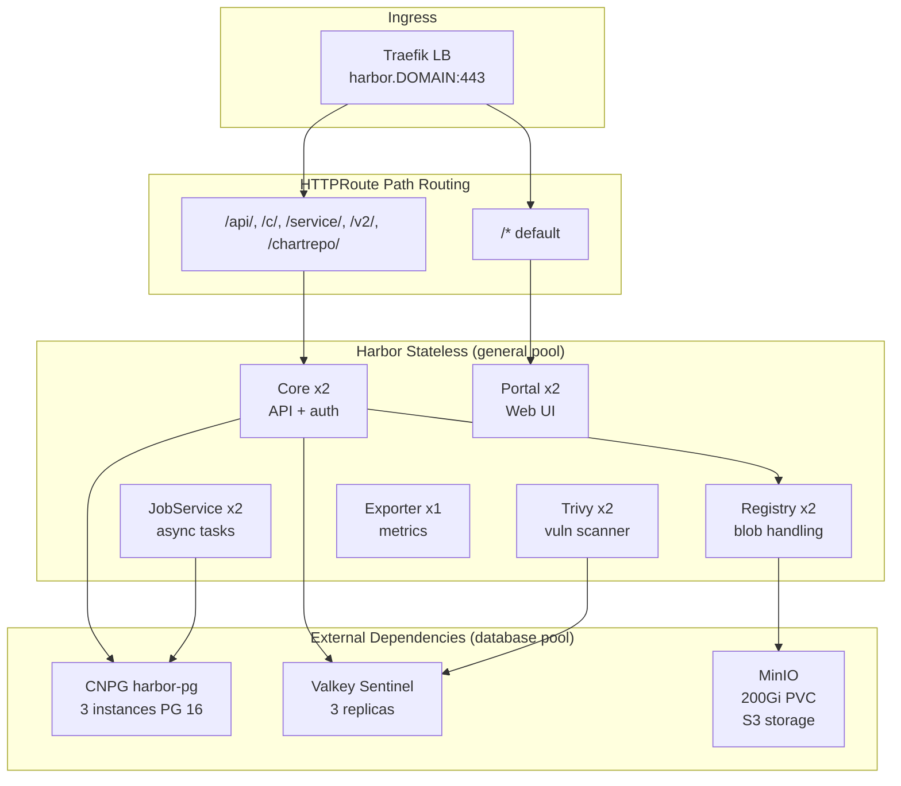

### 6.2 Kubernetes Resources

| Resource Type | Name | Namespace | Purpose |
|--------------|------|-----------|---------|
| Namespace | harbor | - | Harbor components |
| Namespace | minio | - | MinIO S3 storage |
| Deployment | harbor-core | harbor | Registry API, auth, projects |
| Deployment | harbor-portal | harbor | Web UI |
| Deployment | harbor-registry | harbor | Docker distribution (blob handling) |
| Deployment | harbor-jobservice | harbor | Async jobs: replication, GC, scans |
| StatefulSet | harbor-trivy | harbor | Vulnerability scanner |
| Deployment | harbor-exporter | harbor | Prometheus metrics |
| Deployment | minio | minio | S3-compatible object store |
| CNPG Cluster | harbor-pg | database | PostgreSQL 16 HA (3 instances) |
| RedisReplication + Sentinel | harbor-redis | harbor | Valkey Sentinel cache (OpsTree Redis Operator) |
| Service (ClusterIP) | harbor-core | harbor | :80 (HTTPRoute backend) |
| Service (ClusterIP) | harbor-portal | harbor | :80 (HTTPRoute backend) |
| Service (ClusterIP) | harbor-exporter | harbor | :8808 |
| Service (ClusterIP) | minio | minio | :9000 (S3), :9001 (console) |
| PVC | minio-data | minio | 200Gi S3 storage |
| Job | create-buckets | minio | Post-install bucket creation |
| Secret | harbor-s3-credentials | harbor | MinIO access keys |
| Secret | harbor-db-credentials | harbor | PostgreSQL connection |
| Secret | harbor-redis-credentials | harbor | Redis password |
| Gateway | harbor | harbor | HTTPS with cert-manager annotation |
| HTTPRoute | harbor | harbor | Path-based routing (core vs portal) |
| HPA | harbor-core | harbor | 2-5 replicas, 70% CPU |
| HPA | harbor-registry | harbor | 2-5 replicas, 70% CPU |
| HPA | harbor-trivy | harbor | 1-4 replicas, 70% CPU (StatefulSet) |
| HelmChartConfig | rke2-traefik | kube-system | Timeout 1800s + Gateway API + LB IP + access logs + OTLP tracing |

### 6.3 Configuration

| Parameter | Value |
|-----------|-------|
| Harbor Version | v2.14.x |
| Helm Chart | goharbor/harbor-helm v1.18.x |
| External URL | `https://harbor.<DOMAIN>` |
| Expose type | ClusterIP (TLS at Traefik) |
| Database | External CNPG: `harbor-pg-rw.database.svc:5432` |
| Database name | registry |
| Redis | External Sentinel: `harbor-redis-sentinel.harbor.svc:26379` |
| Sentinel master set | mymaster |
| Redis DB indices | core=0, jobservice=1, registry=2, trivy=5 |
| S3 endpoint | `http://minio.minio.svc.cluster.local:9000` |
| S3 bucket | harbor |
| S3 disableredirect | true (required for MinIO) |
| Metrics | Enabled, port 8808 |
| Notary | Disabled |
| ChartMuseum | Disabled (use native OCI) |
| Cache | Enabled, 24h expiry |

### 6.4 Storage

| PVC | Size | Namespace | Purpose |
|-----|------|-----------|---------|
| minio-data | 200Gi | minio | Container image blobs + Helm chart artifacts |
| harbor-pg PVCs (x3) | 20Gi each | database | PostgreSQL data |
| harbor-valkey PVCs | varies | harbor | Redis persistence |

### 6.5 Database Backend

| Parameter | Value |
|-----------|-------|
| CNPG Cluster name | harbor-pg |
| PostgreSQL version | 16 |
| Instances | 3 (Raft HA, auto-failover) |
| Database | registry |
| Owner | harbor |
| SSL mode | require |
| RW service | harbor-pg-rw.database.svc.cluster.local:5432 |
| RO service | harbor-pg-ro.database.svc.cluster.local:5432 |

### 6.6 Networking

| Port | Service | Purpose |
|------|---------|---------|
| 80 | harbor-core | Registry API (ClusterIP, Helm expose type) |
| 80 | harbor-portal | Web UI (ClusterIP, Helm expose type) |
| 8808 | exporter | Prometheus metrics |
| 9000 | minio | S3 API |
| 9001 | minio | Console UI |
| 26379 | sentinel | Redis Sentinel |
| 5432 | harbor-pg-rw | PostgreSQL |
| 443 | Traefik | External HTTPS |

**HTTPRoute routing**: `/api/`, `/c/`, `/service/`, `/v2/`, `/chartrepo/` -> harbor-core:80; `/*` -> harbor-portal:80.

### 6.7 Security

Harbor admin password is set in `harbor-values.yaml`. Core, portal, registry, jobservice, trivy all run as their default chart security contexts. MinIO runs as root (standalone mode).

### 6.8 Monitoring Integration

- **Prometheus scrape job**: `harbor` (job #24)
- **Targets**: harbor-core, harbor-registry, harbor-exporter (port `http-metrics`)
- **Alert rules**: HarborDown (critical, 5m)
- **Grafana dashboard**: `configmap-dashboard-harbor.yaml`
- **Metrics port**: 8808 (exporter)

### 6.9 High Availability

| Component | Replicas | HPA | Anti-affinity |
|-----------|----------|-----|---------------|
| Core | 2 | 2-5, 70% CPU | Preferred, hostname |
| Portal | 2 | No | Preferred, hostname |
| Registry | 2 | 2-5, 70% CPU | Preferred, hostname |
| JobService | 2 | No | Preferred, hostname |
| Trivy | 2 | 1-4, 70% CPU (StatefulSet) | Preferred, hostname |
| Exporter | 1 | No | None |

### 6.10 Dependencies

| Dependency | Required | Purpose |
|------------|----------|---------|
| MinIO | Yes | S3 blob storage (deploy first) |
| CNPG harbor-pg | Yes | PostgreSQL database (deploy first) |
| Redis Sentinel | Yes | Cache + job queue (deploy first) |
| Traefik timeout | Yes | 1800s for large image pushes |
| cert-manager | Yes | TLS certificate |

### 6.11 Proxy Cache Projects

| Project | Upstream Registry | Purpose |
|---------|-------------------|---------|
| dockerhub | registry-1.docker.io | Docker Hub public images |
| quay | quay.io | Quay.io images |
| ghcr | ghcr.io | GitHub Container Registry |
| gcr | gcr.io | Google Container Registry |
| k8s | registry.k8s.io | Kubernetes images |
| elastic | docker.elastic.co | Elastic Stack images |

### 6.12 Common Issues

| Issue | Symptom | Solution |
|-------|---------|----------|
| Push timeout | `net/http: request canceled` on large images | Increase Traefik timeout to 1800s |
| Redis auth failure | WRONGPASS errors in core logs | Set `auth.sentinel: false` in Redis chart |
| Trivy HPA stuck | HPA reports unknown metrics | Ensure HPA targets `kind: StatefulSet` |
| MinIO image pull fail | ImagePullBackOff 403 | Use `quay.io/minio/minio` instead of Bitnami |
| Do NOT use buffering middleware | Memory exhaustion on large layers | Remove any buffering/retry middleware |

---

## 7. ArgoCD and Argo Rollouts

### 7.1 Architecture

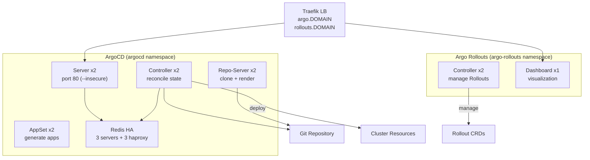

### 7.2 Kubernetes Resources

| Resource Type | Name | Namespace | Purpose |
|--------------|------|-----------|---------|
| Namespace | argocd | - | ArgoCD components |
| Namespace | argo-rollouts | - | Rollouts components |
| Deployment | argocd-server | argocd | Web UI + API |
| Deployment | argocd-application-controller | argocd | Reconciliation engine |
| Deployment | argocd-repo-server | argocd | Git clone + manifest render |
| Deployment | argocd-applicationset-controller | argocd | Template-based app generation |
| StatefulSet | argocd-redis-ha-server | argocd | Redis HA (3 replicas) |
| Deployment | argocd-redis-ha-haproxy | argocd | Redis proxy (3 replicas) |
| Deployment | argo-rollouts | argo-rollouts | Rollout CRD controller |
| Deployment | argo-rollouts-dashboard | argo-rollouts | Rollout visualization |
| Gateway | argocd | argocd | HTTPS for ArgoCD |
| HTTPRoute | argocd-server | argocd | Route to server port 80 |
| Gateway | rollouts | argo-rollouts | HTTPS for Rollouts dashboard |
| HTTPRoute | rollouts-dashboard | argo-rollouts | Route with oauth2-proxy ForwardAuth |
| Middleware | oauth2-proxy-rollouts | argo-rollouts | ForwardAuth for Rollouts dashboard |
| Secret | argocd-initial-admin-secret | argocd | Generated admin password |
| Secret | oauth2-proxy-rollouts | argo-rollouts | oauth2-proxy OIDC client + cookie secret |
| Application | app-of-apps | argocd | Root bootstrap application |

### 7.3 Configuration

**ArgoCD**:

| Parameter | Value |
|-----------|-------|
| Version | 3.3.0 |
| Helm Chart | argo/argo-cd |
| Server mode | `--insecure` (TLS at Traefik) |
| HA replicas | 2 (server, controller, repo-server, appset) |
| Redis HA | 3 servers + 3 haproxy |
| Redis anti-affinity | Preferred (soft) for 2-node pools |

**Argo Rollouts**:

| Parameter | Value |
|-----------|-------|
| Version | 1.8.3 |
| Helm Chart | argo/argo-rollouts |
| Controller replicas | 2 |
| Dashboard replicas | 1 |
| Traffic router plugin | Gateway API (`gatewayapi` class) |
| `trafficRouterPlugins` | **Must be top-level** in values (not nested under controller) |

### 7.4 App-of-Apps Bootstrap Pattern

The root Application (`app-of-apps.yaml`) auto-syncs child applications:
- monitoring-stack (auto-sync)
- cert-manager (auto-sync)
- argo-rollouts (auto-sync)
- **vault** (manual-sync only -- requires unseal)

### 7.5 Networking

| Port | Service | Purpose |
|------|---------|---------|
| 80 | argocd-server | HTTP API + UI (TLS at Traefik) |
| 8080 | argocd-*-metrics | Prometheus metrics |
| 3100 | argo-rollouts-dashboard | Rollouts UI |
| 8090 | argo-rollouts-metrics | Controller metrics |

### 7.6 Monitoring Integration

- **Prometheus scrape job**: `argocd` (job #22), `argo-rollouts` (job #23)
- **ArgoCD targets**: argocd-*-metrics services, port `http-metrics`
- **Rollouts targets**: argo-rollouts-metrics, port `metrics`
- **Alert rules**: ArgoCDDown (critical, 5m), ArgoCDAppOutOfSync (warning, 15m), ArgoCDAppDegraded (warning, 10m)
- **Grafana dashboards**: `configmap-dashboard-argocd.yaml`, `configmap-dashboard-argo-rollouts.yaml`

### 7.7 High Availability

| Component | Replicas | Leader Election |
|-----------|----------|----------------|
| ArgoCD Server | 2 | N/A (stateless) |
| ArgoCD Controller | 2 | Built-in |
| ArgoCD Repo-Server | 2 | N/A (stateless) |
| ArgoCD AppSet | 2 | Built-in |
| Redis HA | 3+3 | Redis Sentinel |
| Rollouts Controller | 2 | Built-in |

### 7.8 Dependencies

| Dependency | Required | Purpose |
|------------|----------|---------|
| Traefik | Yes | Ingress routing |
| cert-manager | Yes | TLS certificates |
| Vault | Yes | PKI backend |
| Cilium | Yes | L2 LoadBalancer IPs |
| Gateway API CRDs | Yes | Rollouts traffic routing |

### 7.9 Common Issues

| Issue | Symptom | Solution |
|-------|---------|----------|
| Redis HA pods Pending | Anti-affinity deadlock on 2-node pool | Use `preferredDuringScheduling` (soft) |
| Server 502 | HTTPRoute wrong port | Use port 80, not 443 (server runs `--insecure`) |
| Helm install hangs | Rancher tunnel watch stream errors | Omit `--wait`; monitor pods manually |
| trafficRouterPlugins crash | JSON unmarshal error in Rollouts controller | Place `trafficRouterPlugins` at top-level in values |
| Vault app won't sync | OutOfSync status | Manual sync only by design; unseal Vault first |

---

## 8. Keycloak

### 8.1 Architecture

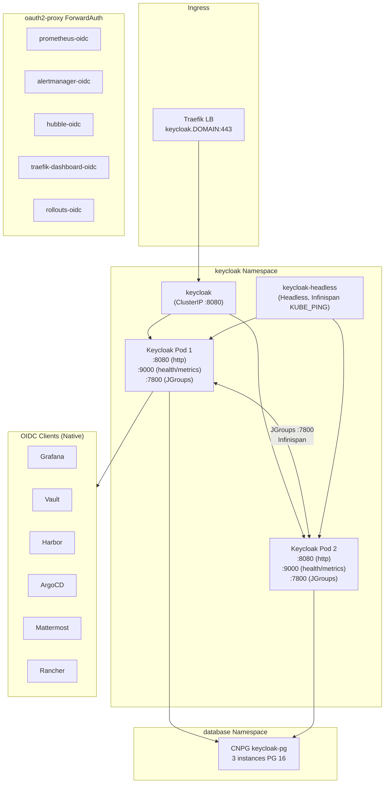

### 8.2 Kubernetes Resources

| Resource Type | Name | Namespace | Purpose |
|--------------|------|-----------|---------|
| Namespace | keycloak | - | Keycloak components |
| Deployment | keycloak | keycloak | 2-replica HA server |
| Service (ClusterIP) | keycloak | keycloak | :8080 (HTTP) |
| Service (Headless) | keycloak-headless | keycloak | Infinispan KUBE_PING discovery |
| ServiceAccount | keycloak | keycloak | Pod identity for KUBE_PING |
| Role + RoleBinding | keycloak | keycloak | Pod listing for JGroups discovery |
| HPA | keycloak | keycloak | 2-5 replicas, 70% CPU |
| CNPG Cluster | keycloak-pg | database | PostgreSQL for Keycloak |
| Secret | keycloak-postgres-secret | keycloak | DB credentials |
| Secret | keycloak-admin-secret | keycloak | Admin username, password, client ID, client secret |
| Gateway | keycloak | keycloak | HTTPS with cert-manager annotation |
| HTTPRoute | keycloak | keycloak | Route to keycloak :8080 |

### 8.3 Configuration

| Environment Variable | Value | Source |
|---------------------|-------|--------|
| KC_DB | postgres | Literal |
| KC_DB_URL_HOST | keycloak-pg-rw.database.svc.cluster.local | Literal |
| KC_DB_URL_DATABASE | keycloak | Literal |
| KC_DB_USERNAME | (secret) | keycloak-postgres-secret |
| KC_DB_PASSWORD | (secret) | keycloak-postgres-secret |
| KC_HOSTNAME | keycloak.DOMAIN | Literal |
| KC_PROXY_HEADERS | xforwarded | Literal |
| KC_HTTP_ENABLED | true | Literal |
| KC_HEALTH_ENABLED | true | Literal |
| KC_METRICS_ENABLED | true | Literal |
| KC_CACHE | ispn | Literal (Infinispan) |
| KC_CACHE_STACK | kubernetes | Literal (KUBE_PING) |
| JAVA_OPTS_APPEND | -Djgroups.dns.query=keycloak-headless.keycloak.svc.cluster.local | Literal |
| KC_BOOTSTRAP_ADMIN_USERNAME | (secret) | keycloak-admin-secret |
| KC_BOOTSTRAP_ADMIN_PASSWORD | (secret) | keycloak-admin-secret |
| KC_BOOTSTRAP_ADMIN_CLIENT_ID | (secret) | keycloak-admin-secret |
| KC_BOOTSTRAP_ADMIN_CLIENT_SECRET | (secret) | keycloak-admin-secret |

### 8.4 Storage

Keycloak itself is stateless. All state is in the CNPG PostgreSQL cluster.

| PVC | Size | Namespace | Purpose |
|-----|------|-----------|---------|
| keycloak-pg PVCs (x3) | 10Gi each | database | PostgreSQL data |

### 8.5 Database Backend

| Parameter | Value |
|-----------|-------|
| CNPG Cluster | keycloak-pg |
| PostgreSQL version | 16 |
| Instances | 3 |
| Database | keycloak |
| RW service | keycloak-pg-rw.database.svc.cluster.local:5432 |
| Storage | 10Gi per instance |
| Pool | database |

### 8.6 Networking

| Port | Protocol | Purpose |
|------|----------|---------|
| 8080 | HTTP | Keycloak web + API (TLS at Traefik) |
| 9000 | HTTP | Health + Prometheus metrics |
| 7800 | TCP | JGroups / Infinispan cluster communication |
| 5432 | TCP | PostgreSQL (internal) |

### 8.7 Security

| Context | Value |
|---------|-------|
| runAsUser | 1000 |
| runAsNonRoot | true |
| fsGroup | 1000 |
| nodeSelector | workload-type: general |
| TOTP 2FA | Required for all users (Phase 2) |
| Realm | `<KC_REALM>` (first segment of `<DOMAIN>`) |

### 8.8 OIDC Client Integrations

| Service | Client ID | Client Type | Integration | Allowed Groups |
|---------|-----------|------------|-------------|----------------|
| Grafana | `grafana` | Confidential | Native OIDC, role mapping (`prompt=login`) | All (role-mapped) |
| ArgoCD | `argocd` | Confidential | Native OIDC SSO (`prompt=login`) | All (RBAC policies) |
| Vault | `vault` | Confidential | Native OIDC auth method | platform-admins, infra-engineers |
| Harbor | `harbor` | Confidential | Native OIDC provider | All (admin: platform-admins) |
| Mattermost | `mattermost` | Confidential | Native OIDC | All |
| Prometheus | `prometheus-oidc` | Confidential | oauth2-proxy ForwardAuth | platform-admins, infra-engineers |
| AlertManager | `alertmanager-oidc` | Confidential | oauth2-proxy ForwardAuth | platform-admins, infra-engineers |
| Hubble UI | `hubble-oidc` | Confidential | oauth2-proxy ForwardAuth | platform-admins, infra-engineers, network-engineers |
| Traefik Dashboard | `traefik-dashboard-oidc` | Confidential | oauth2-proxy ForwardAuth | platform-admins, network-engineers |
| Rollouts | `rollouts-oidc` | Confidential | oauth2-proxy ForwardAuth | platform-admins, infra-engineers, senior-developers |
| Rancher | `rancher` | Confidential | Manual UI configuration | All |
| Kubernetes | `kubernetes` | Public | kubelogin (CLI) | All |

### 8.9 Monitoring Integration

- **Prometheus scrape job**: `keycloak` (job #25)
- **Metrics path**: `/metrics` on port 9000
- **Target discovery**: Pod SD in keycloak namespace, label `app=keycloak`
- **Alert rules**: KeycloakDown (critical, 5m), KeycloakBruteForceDetected (warning, 2m), KeycloakHighLoginFailures (warning, 10m)
- **Grafana dashboard**: `configmap-dashboard-keycloak.yaml`

### 8.10 High Availability

| Feature | Configuration |
|---------|--------------|
| Replicas | 2 (Deployment) |
| HPA | 2-5 replicas, 70% CPU |
| Cache | Infinispan (distributed, KUBE_PING) |
| Session replication | Via Infinispan over JGroups :7800 |
| Pod anti-affinity | Preferred, hostname topology |
| Startup probe | /health/started, 30 failures x 5s = 150s |
| Readiness probe | /health/ready, 30s initial, 10s period |
| Liveness probe | /health/live, 60s initial, 30s period |

### 8.11 Dependencies

| Dependency | Required | Purpose |
|------------|----------|---------|
| CNPG keycloak-pg | Yes | PostgreSQL database |
| cert-manager + Vault | Yes | TLS certificate |
| Traefik | Yes | Ingress routing |
| Harvester CSI | Yes | PVCs for CNPG |
| DNS | Yes | keycloak.DOMAIN -> 203.0.113.202 |

### 8.12 Common Issues

| Issue | Symptom | Solution |
|-------|---------|----------|
| Infinispan not clustering | Logs show single member | Check KUBE_PING RBAC; verify headless service resolves |
| Slow startup | Pod not ready for 2+ minutes | Normal for first boot; startup probe allows 150s |
| DB connection refused | CrashLoopBackOff | Ensure CNPG cluster is healthy; check secret credentials |
| ForwardAuth 403 | oauth2-proxy returns 403 on protected services | Verify user is in an allowed group for the service; check OIDC client config in Keycloak |

---

## 9. Mattermost

### 9.1 Architecture

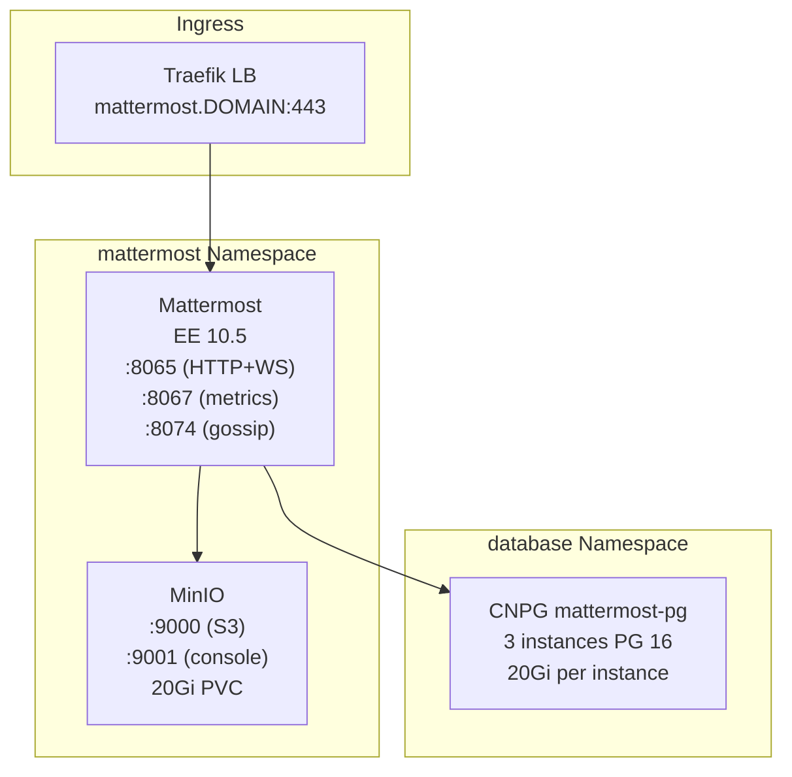

### 9.2 Kubernetes Resources

| Resource Type | Name | Namespace | Purpose |
|--------------|------|-----------|---------|
| Namespace | mattermost | - | All Mattermost components |
| Deployment | mattermost | mattermost | Mattermost server |
| StatefulSet | mattermost-minio | mattermost | S3 file storage |
| CNPG Cluster | mattermost-pg | database | PostgreSQL HA |
| Service (ClusterIP) | mattermost | mattermost | :8065 (HTTP+WS), :8074 (gossip) |
| Service (ClusterIP) | mattermost-metrics | mattermost | :8067 (Prometheus) |
| Service (ClusterIP) | mattermost-minio | mattermost | :9000 (S3), :9001 (console) |
| ConfigMap | mattermost-config | mattermost | MM_* environment variables |
| Secret | mattermost-secret | mattermost | DB connection string, MinIO keys |
| Secret | mattermost-pg-credentials | database | PostgreSQL user password |
| Secret | mattermost-minio-secret | mattermost | MinIO root credentials |
| Gateway | mattermost | mattermost | HTTPS with cert-manager annotation |
| HTTPRoute | mattermost | mattermost | Route to mattermost :8065 |

### 9.3 Configuration

| Variable | Value | Description |
|----------|-------|-------------|
| MM_SERVICESETTINGS_SITEURL | https://mattermost.DOMAIN | Public URL |
| MM_SERVICESETTINGS_LISTENADDRESS | :8065 | HTTP + WebSocket |
| MM_SQLSETTINGS_DRIVERNAME | postgres | Database driver |
| MM_FILESETTINGS_DRIVERNAME | amazons3 | File storage |
| MM_FILESETTINGS_AMAZONS3BUCKET | mattermost | MinIO bucket |
| MM_FILESETTINGS_AMAZONS3ENDPOINT | mattermost-minio.mattermost.svc.cluster.local:9000 | MinIO endpoint |
| MM_FILESETTINGS_AMAZONS3SSL | false | Internal HTTP |
| MM_METRICSSETTINGS_ENABLE | true | Prometheus metrics on :8067 |
| MM_CLUSTERSETTINGS_ENABLE | false | Set `true` for HA |
| MM_CLUSTERSETTINGS_GOSSIPPORT | 8074 | Inter-node gossip |
| MM_LOGSETTINGS_CONSOLEJSON | true | JSON logs for Loki |

### 9.4 Storage

| PVC | Size | Namespace | Purpose |
|-----|------|-----------|---------|
| mattermost-minio | 20Gi | mattermost | File attachments + plugins |
| mattermost-pg PVCs (x3) | 20Gi each | database | PostgreSQL data |

### 9.5 Database Backend

| Parameter | Value |
|-----------|-------|
| CNPG Cluster | mattermost-pg |
| PostgreSQL version | 16.6 |
| Instances | 3 |
| Database | mattermost |
| Owner | mattermost |
| RW service | mattermost-pg-rw.database.svc.cluster.local:5432 |
| max_connections | 200 |
| shared_buffers | 512MB |
| effective_cache_size | 2GB |
| work_mem | 8MB |
| Backup | S3 (MinIO) with 30d retention |

### 9.6 Networking

| Port | Protocol | Purpose |
|------|----------|---------|
| 8065 | HTTP + WebSocket | Mattermost API + real-time |
| 8067 | HTTP | Prometheus metrics |
| 8074 | TCP | Gossip (HA cluster, currently disabled) |
| 9000 | HTTP | MinIO S3 API |
| 9001 | HTTP | MinIO console |

### 9.7 Security

| Context | Value |
|---------|-------|
| runAsUser | 2000 |
| runAsNonRoot | true |
| fsGroup | 2000 |
| nodeSelector | workload-type: general |

### 9.8 Monitoring Integration

- **Prometheus scrape job**: `mattermost` (job #26)
- **Targets**: mattermost-metrics service, port `metrics` (:8067)
- **Note**: Full metrics require Enterprise license
- **Alert rules**: MattermostDown (critical, 5m)
- **Grafana dashboard**: `configmap-dashboard-mattermost.yaml`

### 9.9 High Availability

Currently single replica. HA upgrade path:
1. Obtain Enterprise license
2. Set `MM_CLUSTERSETTINGS_ENABLE=true`
3. Set `replicas: 2+`
4. Gossip port 8074 already exposed
5. Pod anti-affinity already configured
6. Shared PostgreSQL and MinIO backends ready

### 9.10 Dependencies

| Dependency | Required | Purpose |
|------------|----------|---------|
| CNPG mattermost-pg | Yes | PostgreSQL database |
| MinIO (mattermost-minio) | Yes | S3 file storage |
| cert-manager + Vault | Yes | TLS certificate |
| Traefik | Yes | Ingress routing |
| DNS | Yes | mattermost.DOMAIN -> 203.0.113.202 |

### 9.11 Common Issues

| Issue | Symptom | Solution |
|-------|---------|----------|
| DB connection failure | CrashLoopBackOff | Check `MM_SQLSETTINGS_DATASOURCE` format in secret |
| File uploads fail | Error on attachment upload | Verify MinIO bucket exists (`mc mb local/mattermost`) |
| WebSocket disconnections | Clients reconnecting frequently | At single replica, not an issue; for HA, enable cluster mode |
| PostgreSQL security context | InitContainer permission error | Do NOT set runAsUser on postgres; use `fsGroup: 70` only |

---

## 10. Kasm Workspaces

### 10.1 Architecture

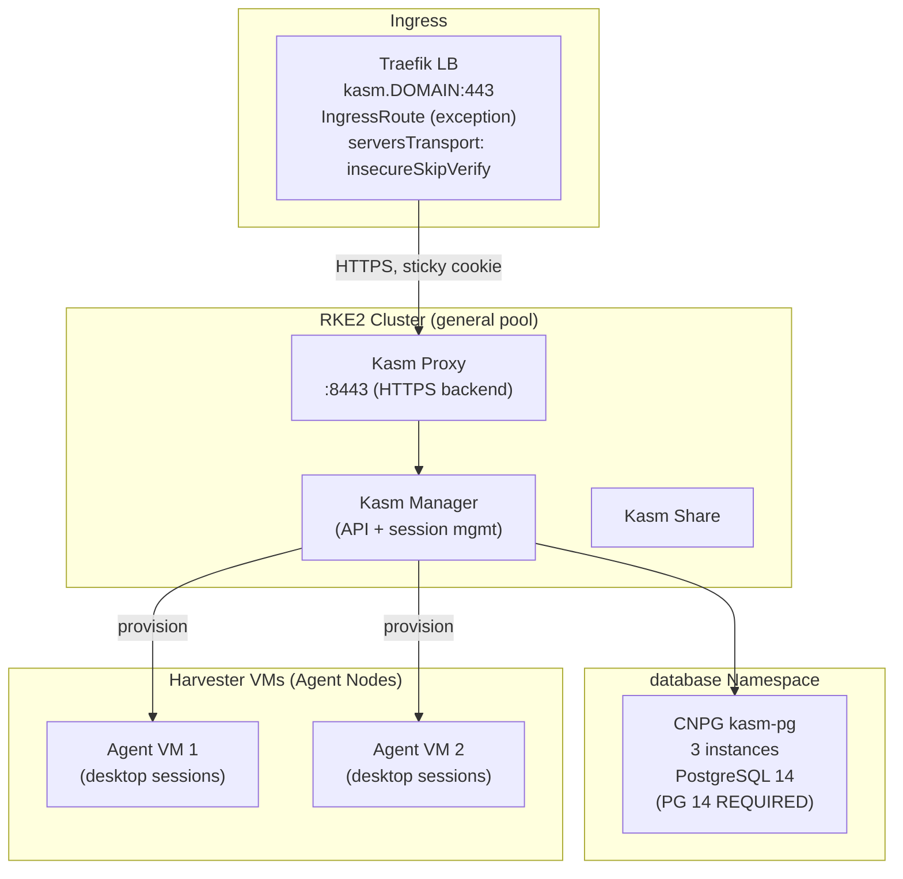

### 10.2 Kubernetes Resources

| Resource Type | Name | Namespace | Purpose |
|--------------|------|-----------|---------|
| Namespace | kasm | - | Kasm control plane |
| Deployment | kasm-proxy-default | kasm | Reverse proxy + WebSocket routing |
| Deployment | kasm-manager | kasm | API server + session management |
| Deployment | kasm-share | kasm | Session sharing service |
| CNPG Cluster | kasm-pg | database | PostgreSQL 14 HA (3 instances) |
| Service (ClusterIP) | kasm-proxy-default | kasm | :8443 (HTTPS) |
| Certificate | kasm-DOMAIN-tls | kasm | Explicit cert (not gateway-shim) |
| ServersTransport | kasm-skip-verify | kasm | insecureSkipVerify for HTTPS backend |
| IngressRoute | kasm | kasm | Traefik IngressRoute (exception) |
| Secret | kasm-secrets | kasm | Admin password |
| Secret | kasm-pg-credentials | database | PostgreSQL app user |
| Secret | kasm-pg-superuser-secret | database | PostgreSQL superuser |

### 10.3 Configuration

| Parameter | Value |
|-----------|-------|
| Kasm Version | 1.18.1 |
| Helm Chart | kasmtech/kasm v1.1181.0 |
| Public address | kasm.DOMAIN |
| Deployment size | small (1 replica each, 10-15 concurrent sessions) |
| Database | External CNPG: kasm-pg-rw.database.svc.cluster.local:5432 |
| Database name | kasm |
| Database user | kasmapp |
| PostgreSQL version | **14 (required -- do NOT upgrade)** |
| Proxy service type | ClusterIP |
| Ingress | Disabled (IngressRoute used) |
| nodeSelector | workload-type: general |

### 10.4 Why IngressRoute (Not Gateway API)

Kasm is the **only service** that uses Traefik IngressRoute instead of Gateway API HTTPRoute. Reason: Kasm proxy serves HTTPS internally with a self-signed certificate. The HTTPRoute backend requires a `serversTransport` with `insecureSkipVerify: true`, which is not yet supported in Gateway API extensionRef.

### 10.5 Storage

| PVC | Size | Namespace | Purpose |
|-----|------|-----------|---------|
| kasm-pg PVCs (x3) | 20Gi each | database | PostgreSQL data |

### 10.6 Database Backend

| Parameter | Value |
|-----------|-------|
| CNPG Cluster | kasm-pg |
| **PostgreSQL version** | **14.17 (Kasm requirement)** |
| Instances | 3 |
| Database | kasm |
| Owner | kasmapp |
| Extensions | uuid-ossp |
| max_connections | 200 |
| shared_buffers | 256MB |
| Backup | S3 (MinIO) with 30d retention |

### 10.7 Networking

| Port | Protocol | Purpose |
|------|----------|---------|
| 8443 | HTTPS | Kasm proxy (self-signed cert internally) |
| 443 | HTTPS | External via Traefik (IngressRoute) |

**Sticky sessions**: KASMSTICKY cookie (httpOnly, secure, sameSite=none).

**Timeout**: Traefik readTimeout must be 1800s for desktop streaming WebSocket connections.

### 10.8 Monitoring Integration

No dedicated Prometheus scrape job. Kasm metrics available through the Admin UI.

### 10.9 High Availability

Currently single replica ("small" deployment). Scale by adjusting `deploymentSize` in Helm values and adding Harvester agent VMs.

### 10.10 Dependencies

| Dependency | Required | Purpose |
|------------|----------|---------|
| CNPG kasm-pg (PG 14) | Yes | PostgreSQL database |
| cert-manager + Vault | Yes | TLS certificate (explicit, not gateway-shim) |
| Traefik (1800s timeout) | Yes | IngressRoute with serversTransport |
| CNPG Operator | Yes | Cluster management |
| Harvester | Yes | Agent VM provisioning |

### 10.11 Common Issues

| Issue | Symptom | Solution |
|-------|---------|----------|
| Desktop timeout at 10min | Session killed during idle | Increase Traefik timeout to 1800s |
| CNPG not initializing | Cluster stuck in setup | Check CNPG operator pods and secret existence |
| CrashLoopBackOff | Manager can't connect to DB | Verify CNPG cluster is healthy; check credentials |
| Agent VMs can't connect | Sessions won't start | Configure Harvester VM Provider in Admin UI |
| PG version mismatch | Schema errors | Kasm requires PG 14; do NOT use PG 16 |

---

## 11. Uptime Kuma

### 11.1 Architecture

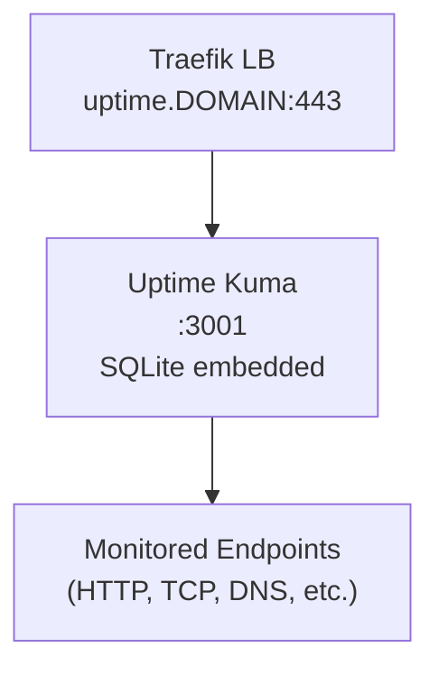

### 11.2 Kubernetes Resources

| Resource Type | Name | Namespace | Purpose |
|--------------|------|-----------|---------|
| Namespace | uptime-kuma | - | Uptime Kuma |
| Deployment | uptime-kuma | uptime-kuma | Status monitoring server |
| Service (ClusterIP) | uptime-kuma | uptime-kuma | :3001 |
| PVC | uptime-kuma-data | uptime-kuma | SQLite database + config |
| Gateway | uptime-kuma | uptime-kuma | HTTPS with cert-manager annotation |
| HTTPRoute | uptime-kuma | uptime-kuma | Route to :3001 |

### 11.3 Configuration

| Parameter | Value |
|-----------|-------|
| Image | louislam/uptime-kuma:2 |
| Port | 3001 |
| Replicas | 1 |
| Strategy | Recreate (SQLite requires exclusive access) |
| nodeSelector | workload-type: general |

### 11.4 Storage

| PVC | Size | StorageClass | Purpose |
|-----|------|-------------|---------|
| uptime-kuma-data | 2Gi | harvester | SQLite DB + config at /app/data |

### 11.5 Database Backend

Embedded SQLite database stored on the PVC. No external database required.

### 11.6 Networking

| Port | Protocol | Purpose |
|------|----------|---------|
| 3001 | HTTP | Web UI + API |
| 443 | HTTPS | External via Traefik Gateway |

### 11.7 Security

| Context | Value |
|---------|-------|
| fsGroup | 1000 |
| nodeSelector | workload-type: general |

### 11.8 Monitoring Integration

No dedicated Prometheus scrape job. Uptime Kuma itself is the monitoring tool for external endpoint availability.

### 11.9 High Availability

Single replica only (SQLite does not support concurrent writes). For HA, would need to migrate to an external database.

### 11.10 Dependencies

| Dependency | Required | Purpose |
|------------|----------|---------|
| cert-manager + Vault | Yes | TLS certificate |
| Traefik | Yes | Ingress routing |
| Harvester CSI | Yes | PVC for SQLite |

### 11.11 Common Issues

| Issue | Symptom | Solution |
|-------|---------|----------|
| Data loss on pod restart | Config gone after restart | Verify PVC is bound and mounted at /app/data |
| Cannot scale to 2 replicas | SQLite lock errors | Use Recreate strategy; single replica only |
| Slow startup | Page not loading | Allow 30s for initial SQLite setup |

---

## 12. LibreNMS

### 12.1 Architecture

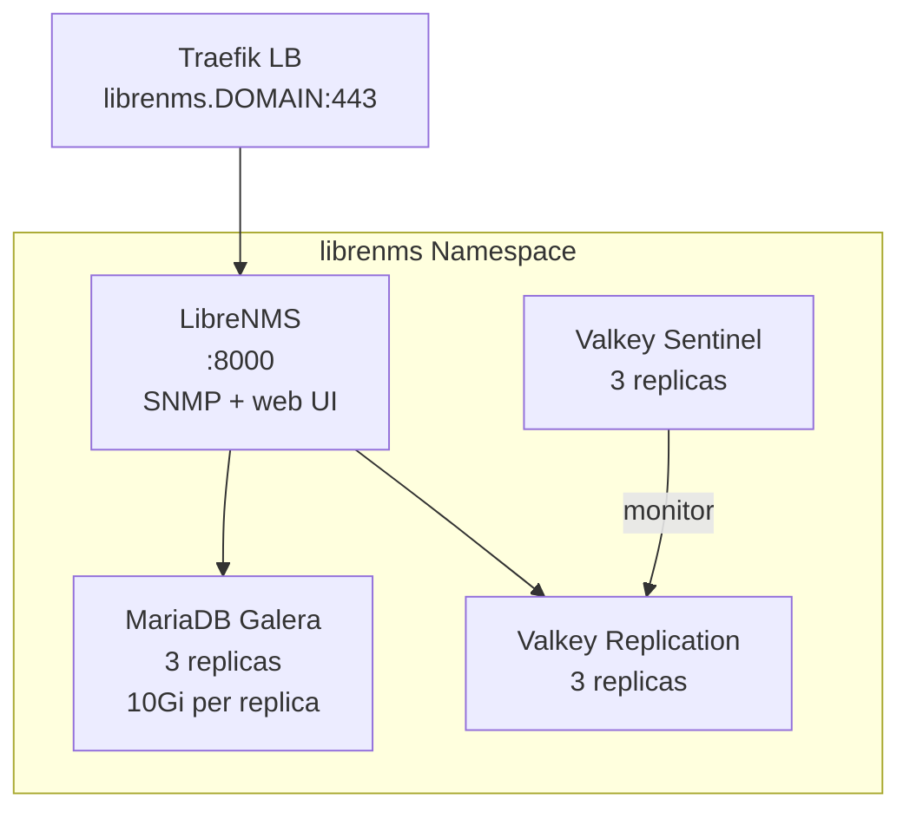

### 12.2 Kubernetes Resources

| Resource Type | Name | Namespace | Purpose |
|--------------|------|-----------|---------|
| Namespace | librenms | - | All LibreNMS components |
| Deployment | librenms | librenms | Network monitoring server |
| MariaDB (CRD) | librenms-mariadb | librenms | MariaDB 11.4 Galera HA cluster |
| RedisReplication (CRD) | librenms-redis | librenms | Valkey 7.0.15 replication (3 pods) |
| RedisSentinel (CRD) | librenms-redis | librenms | Valkey Sentinel (3 pods) |
| Service (ClusterIP) | librenms | librenms | :8000 |
| Service | librenms-mariadb | librenms | :3306 (auto by MariaDB Operator) |
| Service | librenms-redis | librenms | :6379 (auto by Redis Operator) |
| Service | librenms-redis-sentinel | librenms | :26379 (auto by Redis Operator) |
| PVC | librenms-data | librenms | 10Gi data storage |
| PVCs | librenms-mariadb-{0,1,2} | librenms | 10Gi x3 MariaDB |
| PVCs | librenms-redis-{0,1,2} | librenms | 2Gi x3 Valkey |
| ConfigMap | librenms-config | librenms | Environment configuration |
| Secret | librenms-secret | librenms | App key, DB password |
| Secret | librenms-mariadb-root | librenms | MariaDB root password |
| Secret | librenms-mariadb-credentials | librenms | MariaDB user password |
| Secret | librenms-valkey-credentials | librenms | Valkey password |
| Gateway | librenms | librenms | HTTPS with cert-manager annotation |
| HTTPRoute | librenms | librenms | Route to librenms :8000 |

### 12.3 Configuration

**LibreNMS ConfigMap**:

| Variable | Value |
|----------|-------|
| TZ | Europe/Zurich |
| DB_HOST | librenms-mariadb.librenms.svc.cluster.local |
| DB_PORT | 3306 |
| DB_NAME | librenms |
| DB_USER | librenms |
| REDIS_HOST | librenms-redis.librenms.svc.cluster.local |
| REDIS_PORT | 6379 |
| REDIS_SCHEME | tcp |
| REDIS_DB | 0 |
| CACHE_DRIVER | redis |
| SESSION_DRIVER | redis |

### 12.4 Storage

| PVC | Size | Purpose |
|-----|------|---------|
| librenms-data | 10Gi | RRD files, SNMP data |
| librenms-mariadb PVCs (x3) | 10Gi each | MariaDB Galera data |
| librenms-redis PVCs (x3) | 2Gi each | Valkey persistence |

### 12.5 Database Backend (MariaDB Galera)

| Parameter | Value |
|-----------|-------|
| CRD | MariaDB (k8s.mariadb.com/v1alpha1) |
| MariaDB version | 11.4 |
| Galera | Enabled (SST: mariabackup) |
| Replicas | 3 |
| Primary pod | Index 0 (automatic failover) |
| Recovery | Enabled (3m healthy timeout, 10m bootstrap timeout) |
| Storage | 10Gi per instance, harvester StorageClass |
| nodeSelector | workload-type: database |
| innodb_buffer_pool_size | 256M |
| max_connections | 200 |
| binlog_format | row |
| innodb_autoinc_lock_mode | 2 |

### 12.6 Valkey (Redis) Backend

**RedisReplication**:

| Parameter | Value |
|-----------|-------|
| CRD | RedisReplication (redis.redis.opstreelabs.in/v1beta2) |
| Cluster size | 3 |
| Image | quay.io/opstree/redis:v7.0.15 |
| Storage | 2Gi per instance |
| Redis exporter | Enabled (oliver006/redis_exporter) |
| nodeSelector | workload-type: database |
| runAsUser | 999, fsGroup: 999 |

**RedisSentinel**:

| Parameter | Value |
|-----------|-------|
| CRD | RedisSentinel (redis.redis.opstreelabs.in/v1beta2) |
| Cluster size | 3 |
| Master group | mymaster |
| Quorum | 2 |
| nodeSelector | workload-type: database |

### 12.7 Networking

| Port | Service | Purpose |
|------|---------|---------|
| 8000 | librenms | Web UI + API |
| 3306 | librenms-mariadb | MariaDB |
| 6379 | librenms-redis | Valkey |
| 26379 | librenms-redis-sentinel | Sentinel |
| 9121 | redis-exporter sidecar | Prometheus metrics |

### 12.8 Security

LibreNMS runs as the container default user. MariaDB Galera uses the operator-provided security context. Valkey runs as UID 999.

### 12.9 Monitoring Integration

- Valkey Redis exporter sidecar enabled for Prometheus scraping
- LibreNMS itself provides network monitoring (SNMP, ICMP)
- No dedicated Prometheus scrape job for LibreNMS web UI

### 12.10 High Availability

| Component | Replicas | HA Method |
|-----------|----------|-----------|
| LibreNMS | 1 | Recreate strategy |
| MariaDB | 3 | Galera (synchronous multi-master) |
| Valkey | 3 | Replication + Sentinel |

### 12.11 Dependencies

| Dependency | Required | Purpose |
|------------|----------|---------|
| MariaDB Operator | Yes | Galera cluster management |
| OpsTree Redis Operator | Yes | Valkey replication + Sentinel |
| cert-manager + Vault | Yes | TLS certificate |
| Traefik | Yes | Ingress routing |
| Harvester CSI | Yes | PVCs |

### 12.12 Common Issues

| Issue | Symptom | Solution |
|-------|---------|----------|
| Galera bootstrap failure | MariaDB pods stuck in Init | Check MariaDB Operator logs; ensure 3 database nodes available |
| Valkey auth issues | Connection refused or WRONGPASS | Check sentinel config does NOT set requirepass (use redisReplicationPassword only) |
| LibreNMS slow startup | Login page takes 60s+ to appear | Normal; readinessProbe starts at 30s, liveness at 60s |

---

## 13. Node Labeler

### 13.1 Architecture

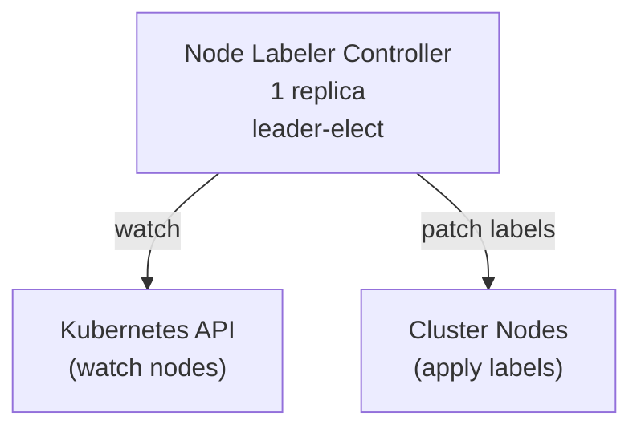

### 13.2 Kubernetes Resources

| Resource Type | Name | Namespace | Purpose |
|--------------|------|-----------|---------|
| Namespace | node-labeler | - | Operator namespace |
| Deployment | node-labeler | node-labeler | Controller |
| ServiceAccount | node-labeler | node-labeler | Pod identity |
| ClusterRole | node-labeler | - | Node get/list/watch/patch, events, leases |
| ClusterRoleBinding | node-labeler | - | Bind to ServiceAccount |
| Service (ClusterIP) | node-labeler | node-labeler | :8080 (metrics), :8081 (health) |

### 13.3 Configuration

| Parameter | Value |
|-----------|-------|
| Image | harbor.DOMAIN/library/node-labeler:v0.1.0 |
| Replicas | 1 |
| Args | `--leader-elect`, `--metrics-bind-address=:8080`, `--health-probe-bind-address=:8081` |
| nodeSelector | workload-type: general |
| Tolerations | node.kubernetes.io/not-ready (60s) |

### 13.4 Storage

No storage required. Stateless controller.

### 13.5 Networking

| Port | Purpose |
|------|---------|
| 8080 | Prometheus metrics |
| 8081 | Health + readiness probes |

### 13.6 Security

| Context | Value |
|---------|-------|
| runAsNonRoot | true |
| runAsUser | 65532 |
| runAsGroup | 65532 |
| fsGroup | 65532 |
| seccompProfile | RuntimeDefault |
| allowPrivilegeEscalation | false |
| capabilities.drop | ALL |
| readOnlyRootFilesystem | true |

This is one of the most hardened security contexts in the cluster.

### 13.7 RBAC

```
ClusterRole: node-labeler
  - nodes: get, list, watch, patch
  - events: create, patch
  - leases: get, list, watch, create, update, patch, delete (leader election)
```

### 13.8 Monitoring Integration

- **Pod annotation**: `prometheus.io/scrape: "true"`, `prometheus.io/port: "8080"`
- Auto-discovered by Prometheus annotation-based pod discovery (job #13)

### 13.9 High Availability

Single replica with leader election (`--leader-elect`). Safe to run multiple replicas; only the leader processes node events.

### 13.10 Dependencies

| Dependency | Required | Purpose |
|------------|----------|---------|
| Harbor | Yes | Container image registry |
| Kubernetes API | Yes | Node watch and patch |

### 13.11 Common Issues

| Issue | Symptom | Solution |
|-------|---------|----------|
| Labels not applied | New nodes missing labels | Check controller logs; verify RBAC |
| Leader election stuck | Controller not processing events | Delete the lease and restart pod |
| Image pull failure | ImagePullBackOff | Ensure Harbor is accessible and image exists |

---

## 14. Storage Autoscaler

### 14.1 Architecture

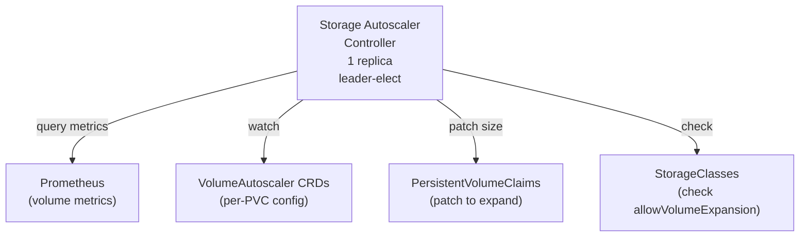

### 14.2 Kubernetes Resources

| Resource Type | Name | Namespace | Purpose |
|--------------|------|-----------|---------|
| Namespace | storage-autoscaler | - | Operator namespace |
| CRD | volumeautoscalers.autoscaling.volume-autoscaler.io | - | VolumeAutoscaler custom resource |
| Deployment | storage-autoscaler | storage-autoscaler | Controller |
| ServiceAccount | storage-autoscaler | storage-autoscaler | Pod identity |
| ClusterRole | storage-autoscaler | - | VolumeAutoscaler CRUD, PVC patch, PV/SC read, events, leases |
| ClusterRoleBinding | storage-autoscaler | - | Bind to ServiceAccount |
| Service (ClusterIP) | storage-autoscaler-metrics | storage-autoscaler | :8080 (metrics) |

### 14.3 CRD: VolumeAutoscaler

**API Group**: `autoscaling.volume-autoscaler.io/v1alpha1`

**Spec Fields**:

| Field | Type | Default | Description |
|-------|------|---------|-------------|
| target.pvcName | string | - | Single PVC by name |
| target.selector | LabelSelector | - | Match multiple PVCs by labels |
| thresholdPercent | int32 (1-99) | 80 | Usage percentage that triggers expansion |
| maxSize | Quantity | **required** | Maximum PVC size (safety cap) |
| increasePercent | int32 (1-100) | 20 | Percentage of current capacity to add |
| increaseMinimum | Quantity | - | Minimum amount to add per expansion |
| pollInterval | string | 60s | How often to check metrics |
| cooldownPeriod | string | 5m | Minimum wait between expansions |
| inodeThresholdPercent | int32 (0-99) | 0 | Inode usage trigger (0=disabled) |
| prometheusURL | string | http://prometheus.monitoring.svc.cluster.local:9090 | Prometheus endpoint |

**Status Fields**:

| Field | Description |
|-------|-------------|
| totalScaleEvents | Cumulative PVC expansions |
| lastPollTime | Last metrics check timestamp |
| pvcs[].name | PVC name |
| pvcs[].currentSize | Current capacity |
| pvcs[].usagePercent | Current usage percentage |
| pvcs[].usageBytes | Bytes used |
| pvcs[].lastScaleTime | Last expansion timestamp |
| pvcs[].lastScaleSize | Size of last expansion |
| conditions[] | Standard Kubernetes conditions |

### 14.4 VolumeAutoscaler Examples

**Prometheus (50Gi -> max 200Gi)**:
```yaml
apiVersion: autoscaling.volume-autoscaler.io/v1alpha1
kind: VolumeAutoscaler
metadata:
  name: prometheus
  namespace: monitoring
spec:
  target:
    pvcName: data-prometheus-0
  thresholdPercent: 80
  maxSize: 200Gi
  increasePercent: 25
  increaseMinimum: 5Gi
  pollInterval: 60s
  cooldownPeriod: 5m
```

**Harbor MinIO (200Gi -> max 500Gi)**:
```yaml
apiVersion: autoscaling.volume-autoscaler.io/v1alpha1
kind: VolumeAutoscaler
metadata:
  name: harbor-minio
  namespace: minio
spec:
  target:
    pvcName: minio-data
  thresholdPercent: 80
  maxSize: 500Gi
  increasePercent: 20
  increaseMinimum: 10Gi
  pollInterval: 120s
  cooldownPeriod: 10m
```

**Additional examples exist for**: Loki, Grafana, Alertmanager, Vault, Harbor PostgreSQL, Harbor Valkey, Keycloak PG, Mattermost PG, Mattermost MinIO, Kasm PG, Uptime Kuma, LibreNMS.

### 14.5 Configuration

| Parameter | Value |
|-----------|-------|
| Image | harbor.DOMAIN/library/storage-autoscaler:v0.1.0 |
| Replicas | 1 |
| Args | `--leader-elect`, `--metrics-bind-address=:8080`, `--health-probe-bind-address=:8081` |
| nodeSelector | workload-type: general |
| Tolerations | node.kubernetes.io/not-ready (60s) |

### 14.6 Storage

No storage required. Stateless controller that queries Prometheus and patches PVCs.

### 14.7 Networking

| Port | Purpose |
|------|---------|
| 8080 | Prometheus metrics |
| 8081 | Health + readiness probes |

### 14.8 Security

| Context | Value |
|---------|-------|
| runAsNonRoot | true |
| runAsUser | 65532 |
| runAsGroup | 65532 |
| fsGroup | 65532 |
| seccompProfile | RuntimeDefault |
| allowPrivilegeEscalation | false |
| capabilities.drop | ALL |
| readOnlyRootFilesystem | true |

### 14.9 RBAC

```
ClusterRole: storage-autoscaler
  - volumeautoscalers: get, list, watch, update, patch
  - volumeautoscalers/status: get, update, patch
  - volumeautoscalers/finalizers: update
  - persistentvolumeclaims: get, list, watch, patch
  - persistentvolumes: get, list
  - storageclasses: get, list
  - events: create, patch
  - leases: get, list, watch, create, update, patch, delete (leader election)
```

### 14.10 Monitoring Integration

- **Service annotation**: `prometheus.io/scrape: "true"`, `prometheus.io/port: "8080"`
- **Pod annotation**: `prometheus.io/scrape: "true"`, `prometheus.io/port: "8080"`
- Auto-discovered by Prometheus annotation-based discovery (jobs #12 and #13)

### 14.11 High Availability

Single replica with leader election (`--leader-elect`). Safe to run multiple replicas; only the leader performs PVC expansions.

### 14.12 Dependencies

| Dependency | Required | Purpose |
|------------|----------|---------|
| Prometheus | Yes | Volume usage metrics (kubelet_volume_stats_*) |
| Harvester CSI | Yes | StorageClass must have `allowVolumeExpansion: true` |
| Harbor | Yes | Container image registry |

### 14.13 Common Issues

| Issue | Symptom | Solution |
|-------|---------|----------|
| PVC not expanding | VolumeAutoscaler shows no scale events | Verify StorageClass has `allowVolumeExpansion: true` |
| Prometheus unreachable | Controller logs show connection errors | Check `prometheusURL` in VolumeAutoscaler spec |
| Max size reached | PVC at maxSize but still filling | Increase `maxSize` or add manual cleanup |
| Cooldown blocking expansion | PVC critical but expansion delayed | Reduce `cooldownPeriod` in the VolumeAutoscaler spec |

---

## Appendix: Quick Reference

### All External Endpoints

| Service | URL | Auth Method |
|---------|-----|-------------|
| Grafana | https://grafana.DOMAIN | Keycloak OIDC (native, `prompt=login`) |
| Prometheus | https://prometheus.DOMAIN | oauth2-proxy ForwardAuth |
| Alertmanager | https://alertmanager.DOMAIN | oauth2-proxy ForwardAuth |
| Vault | https://vault.DOMAIN | Keycloak OIDC (native) |
| ArgoCD | https://argo.DOMAIN | Keycloak OIDC (native, `prompt=login`) |
| Argo Rollouts | https://rollouts.DOMAIN | oauth2-proxy ForwardAuth |
| Harbor | https://harbor.DOMAIN | Keycloak OIDC (native) |
| Keycloak | https://keycloak.DOMAIN | Keycloak login |
| Mattermost | https://mattermost.DOMAIN | Keycloak OIDC (native) |
| Kasm | https://kasm.DOMAIN | Keycloak OIDC (manual UI config) |
| Rancher | https://rancher.DOMAIN | Keycloak OIDC (manual UI config) |
| Uptime Kuma | https://uptime.DOMAIN | Uptime Kuma login |
| LibreNMS | https://librenms.DOMAIN | LibreNMS login |
| Hubble UI | https://hubble.DOMAIN | oauth2-proxy ForwardAuth |
| Traefik Dashboard | https://traefik.DOMAIN | oauth2-proxy ForwardAuth |

### All Namespaces

| Namespace | Services |
|-----------|----------|
| vault | Vault HA (3 replicas) |
| cert-manager | cert-manager controller, webhook, cainjector |
| monitoring | Prometheus, Grafana, Loki, Alloy, Node Exporter, kube-state-metrics, Alertmanager |
| harbor | Harbor (core, portal, registry, jobservice, trivy, exporter), Valkey Sentinel |
| minio | MinIO (Harbor S3 storage) |
| database | All CNPG PostgreSQL clusters (harbor-pg, keycloak-pg, mattermost-pg, kasm-pg) |
| argocd | ArgoCD (server, controller, repo-server, appset, redis-ha) |
| argo-rollouts | Argo Rollouts (controller, dashboard) |
| keycloak | Keycloak (server, headless service) |
| mattermost | Mattermost (server, minio) |
| kasm | Kasm Workspaces (proxy, manager, share) |
| uptime-kuma | Uptime Kuma |
| librenms | LibreNMS, MariaDB Galera, Valkey |
| node-labeler | Node Labeler controller |
| storage-autoscaler | Storage Autoscaler controller |
| kube-system | Traefik, Cilium, CoreDNS, Hubble |
| cnpg-system | CNPG Operator |
| mariadb-operator-system | MariaDB Operator |
| ot-operators | OpsTree Redis Operator |

### PKI Certificate Chain

```
Example Org Root CA (15yr, 4096-bit RSA, key offline on Harvester)
  +-- Example Org Intermediate CA (10yr, in Vault pki_int/)
        +-- *.DOMAIN leaf certificates (30d TTL, auto-renewed by cert-manager)
```

---

**Generated**: 2026-02-15
**Cluster Version**: RKE2 v1.34+
**Maintainer**: RKE2 Infrastructure Team
