# System Architecture -- Engineering Reference

> **Definitive engineering reference** for the RKE2 Kubernetes cluster platform deployed
> via Rancher on Harvester HCI. This document consolidates infrastructure, networking,
> services, security, and operational architecture into a single source of truth.
>
> **Note**: Throughout this document, `<DOMAIN>` refers to the root domain configured in
> `scripts/.env`. Derived formats: `<DOMAIN_DASHED>` = dots replaced with hyphens,
> `<DOMAIN_DOT>` = dots replaced with `-dot-`. All service FQDNs follow the pattern
> `<service>.<DOMAIN>`.

---

## Table of Contents

1. [System Overview](#1-system-overview)
2. [Physical Infrastructure](#2-physical-infrastructure)
3. [Cluster Architecture](#3-cluster-architecture)
4. [Networking Architecture](#4-networking-architecture)
5. [Service Dependency Graph](#5-service-dependency-graph)
6. [Storage Architecture](#6-storage-architecture)
7. [Security Architecture](#7-security-architecture)
8. [Autoscaling Architecture](#8-autoscaling-architecture)
9. [Monitoring Architecture](#9-monitoring-architecture)
10. [GitOps Architecture](#10-gitops-architecture)
11. [Platform Services Inventory](#11-platform-services-inventory)

---

## 1. System Overview

### What This Platform Is

This is a production-grade, self-hosted Kubernetes platform built on **RKE2** (Rancher
Kubernetes Engine 2) running as virtual machines on **Harvester HCI** (Hyper-Converged
Infrastructure). The entire stack -- from bare-metal hypervisor to application services --
is managed through Infrastructure-as-Code (Terraform) and GitOps (ArgoCD).

The platform provides:

- **Container orchestration** via RKE2 (FIPS-compliant Kubernetes distribution)
- **Container registry** with vulnerability scanning (Harbor + Trivy)
- **Identity management** and SSO readiness (Keycloak)
- **Secrets management** with PKI infrastructure (HashiCorp Vault)
- **Full observability** stack (Prometheus, Grafana, Loki, Alloy, Alertmanager)
- **GitOps continuous delivery** with progressive rollouts (ArgoCD + Argo Rollouts)
- **Team messaging** (Mattermost)
- **Virtual desktop infrastructure** (Kasm Workspaces)
- **Automated scaling** at both cluster and application layers
- **Airgapped deployment** mode with private RPM mirrors, private CA trust, and system-default-registry pointing to Harbor

### Who Uses It

| Role | Interaction |
|------|-------------|
| **Platform Engineers** | Terraform for infrastructure, ArgoCD for services, kubectl for operations |
| **Application Developers** | Push to GitLab, ArgoCD deploys, Harbor stores images |
| **SREs / Operators** | Grafana dashboards, Alertmanager, operations runbook |
| **End Users** | Mattermost for messaging, Kasm for virtual desktops, Harbor for image pulls |

### Technology Stack at a Glance

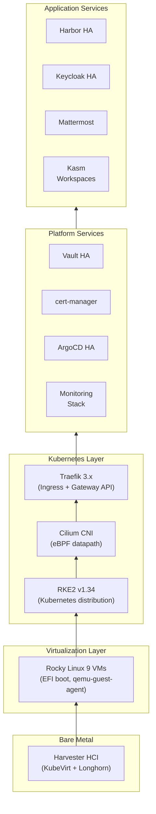

---

## 2. Physical Infrastructure

### Harvester HCI

Harvester is the bare-metal hypervisor layer providing compute, storage, and networking
primitives. It runs KubeVirt for VM lifecycle management and Longhorn for distributed
block storage.

| Component | Detail |
|-----------|--------|
| **Hypervisor** | Harvester HCI (KubeVirt-based) |
| **Storage Backend** | Longhorn (distributed, replicated block storage) |
| **Cloud Provider** | Harvester Cloud Provider (LoadBalancer + CSI integration) |
| **VM Image** | Rocky Linux 9 GenericCloud qcow2 (EFI boot via OVMF) |
| **VM Firmware** | UEFI (EFI patched via Rancher API post-creation) |
| **Guest Agent** | qemu-guest-agent (IP reporting, graceful shutdown) |

### Network Topology

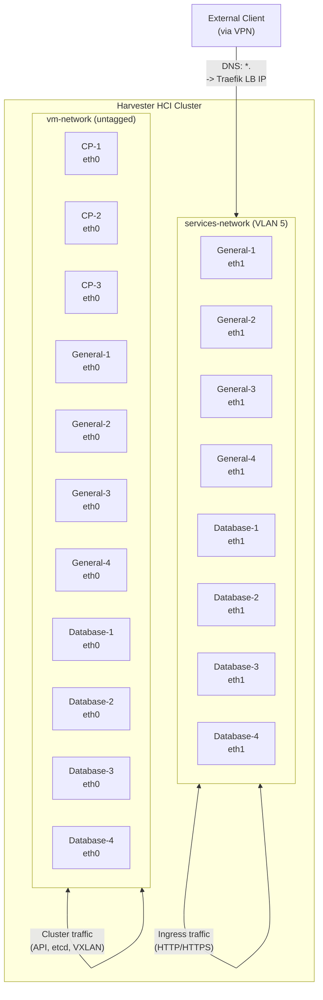

### Networks

| Network | Type | VLAN | Purpose | Connected Nodes |
|---------|------|------|---------|-----------------|
| `vm-network` | Harvester VM Network | Untagged | Cluster communication (API, etcd, VXLAN overlay, kubelet) | All nodes (eth0) |
| `services-network` | Harvester VM Network | 5 | Ingress/services traffic, LoadBalancer IPs, ARP announcements | Worker nodes only (eth1) |

### IP Addressing

| Range | Network | Purpose |
|-------|---------|---------|
| DHCP assigned | vm-network | Node eth0 addresses (cluster traffic) |
| DHCP assigned | services-network | Node eth1 addresses (ingress traffic) |
| `198.51.100.2-20` | services-network | Cilium L2 LoadBalancer IP pool (19 IPs for LoadBalancer services) |

---

## 3. Cluster Architecture

### High-Level Cluster Topology

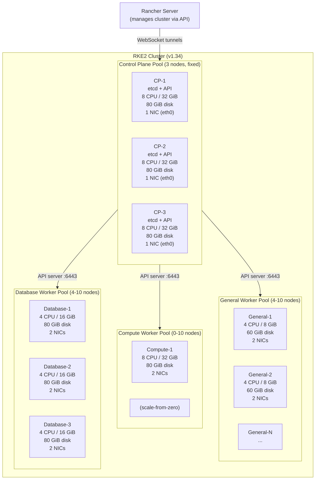

### Node Pool Specifications

| Pool | Roles | Count | NICs | CPU | Memory | Disk | Autoscale | Node Label |
|------|-------|-------|------|-----|--------|------|-----------|------------|
| **Control Plane** | etcd, control-plane | 3 (fixed) | 1 (eth0) | 8 | 32 GiB | 80 GiB | No | _(auto-tainted)_ |
| **General** | worker | 4--10 | 2 (eth0, eth1) | 4 | 8 GiB | 60 GiB | Yes | `workload-type=general` |
| **Compute** | worker | 0--10 | 2 (eth0, eth1) | 8 | 32 GiB | 80 GiB | Yes (scale-from-zero) | `workload-type=compute` |
| **Database** | worker | 4--10 | 2 (eth0, eth1) | 4 | 16 GiB | 80 GiB | Yes | `workload-type=database` |

### Node Roles, Labels, and Taints

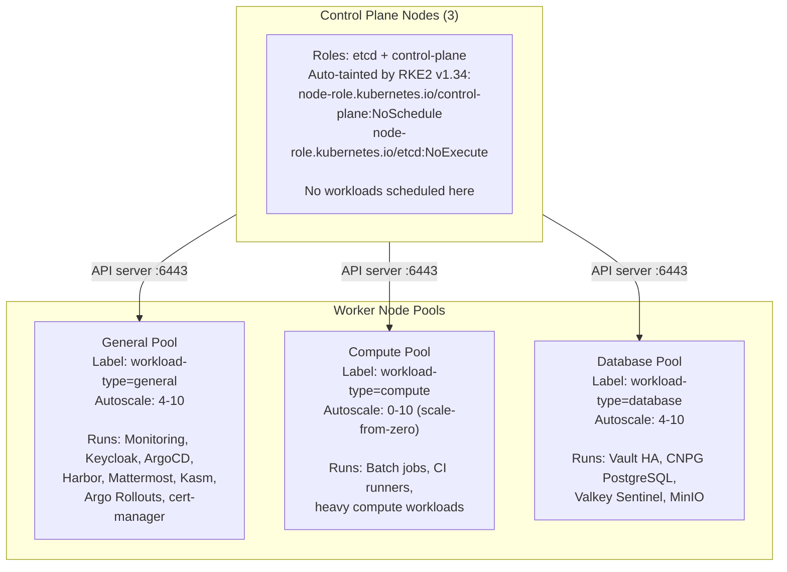

### Control Plane Components

Each control plane node runs:

| Component | Port | Purpose |
|-----------|------|---------|
| etcd | 2379 (client), 2380 (peer) | Distributed key-value store for cluster state |
| kube-apiserver | 6443 | Kubernetes API endpoint |
| kube-controller-manager | 10257 | Reconciliation loops |
| kube-scheduler | 10259 | Pod scheduling decisions |
| RKE2 supervisor | 9345 | RKE2 node registration and management |

kube-apiserver is configured with OIDC flags for Keycloak integration:
- `oidc-issuer-url`: `https://keycloak.<DOMAIN>/realms/<realm>`
- `oidc-client-id`: `kubernetes`
- `oidc-username-claim`: `preferred_username`
- `oidc-groups-claim`: `groups`

etcd is configured with:
- Snapshot schedule: every 6 hours (`0 */6 * * *`)
- Snapshot retention: 5 snapshots
- Metrics exposed on `:2381` for Prometheus scraping (plain HTTP)

### Upgrade Strategy

| Parameter | Value |
|-----------|-------|
| Control plane concurrency | 1 (one node at a time) |
| Worker concurrency | 1 (one node at a time) |
| Rolling update max unavailable | 0 (per pool) |
| Rolling update max surge | 1 (per pool) |
| Drain before delete | Yes (all pools) |

### Registry Configuration

All RKE2 nodes are configured via `registries.yaml` to authenticate to Docker Hub using
a `rancher2_secret_v2` credential, avoiding anonymous pull rate limits. In airgapped mode,
the `system-default-registry` is set to `harbor.<DOMAIN>`, redirecting all RKE2 system
image pulls to the local Harbor registry.

---

## 4. Networking Architecture

### CNI: Cilium with eBPF

Cilium replaces kube-proxy entirely, using eBPF programs in the Linux kernel for packet
forwarding, load balancing, and network policy enforcement.

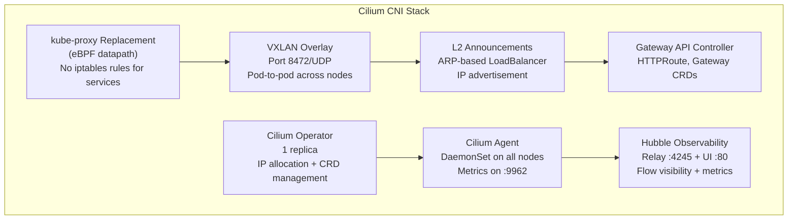

### Key Cilium Configuration

| Setting | Value | Purpose |
|---------|-------|---------|
| `kubeProxyReplacement` | `true` | eBPF replaces kube-proxy entirely |
| `k8sServiceHost` | `127.0.0.1` | API server via RKE2 local agent proxy |
| `k8sServicePort` | `6443` | API server port |
| `l2announcements.enabled` | `true` | ARP-based LoadBalancer IP announcement |
| `externalIPs.enabled` | `true` | External IP support on services |
| `gatewayAPI.enabled` | `true` | Cilium manages Gateway/HTTPRoute CRDs |
| `hubble.enabled` | `true` | Network flow observability |
| `hubble.relay.enabled` | `true` | Hubble gRPC relay for UI |
| `hubble.ui.enabled` | `true` | Web UI for network flows |
| `prometheus.enabled` | `true` | Cilium agent metrics for Prometheus |
| `k8sClientRateLimit.qps` | `25` | API client rate limit |
| `k8sClientRateLimit.burst` | `50` | API client burst limit |

### L2 Announcements and LoadBalancer IP Allocation

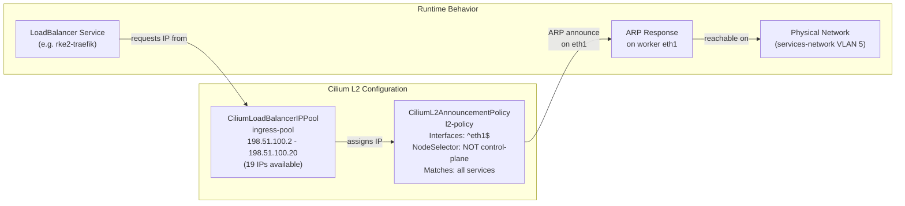

The L2 announcement manifests are deployed via cloud-init on control plane nodes to
`/var/lib/rancher/rke2/server/manifests/`, ensuring they are applied before any workloads
are scheduled.

### Ingress Architecture: Traefik + Gateway API

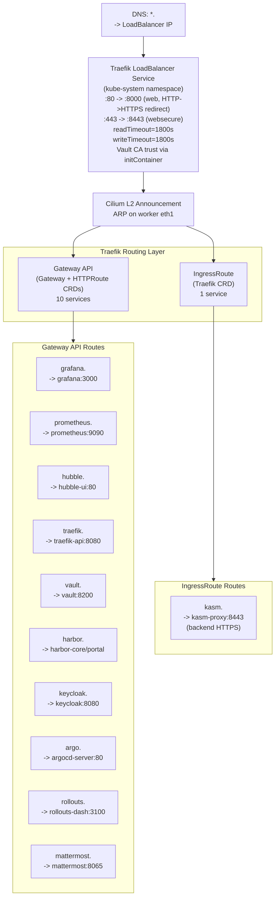

### Ingress Routing Table

| Hostname | Namespace | Ingress Type | Backend | Auth Method | Middleware |
|----------|-----------|-------------|---------|-------------|------------|
| `grafana.<DOMAIN>` | monitoring | Gateway + HTTPRoute | grafana:3000 | Keycloak OIDC (native) | None |
| `prometheus.<DOMAIN>` | monitoring | Gateway + HTTPRoute | prometheus:9090 | oauth2-proxy ForwardAuth | extensionRef |
| `alertmanager.<DOMAIN>` | monitoring | Gateway + HTTPRoute | alertmanager:9093 | oauth2-proxy ForwardAuth | extensionRef |
| `hubble.<DOMAIN>` | kube-system | Gateway + HTTPRoute | hubble-ui:80 | oauth2-proxy ForwardAuth | extensionRef |
| `traefik.<DOMAIN>` | kube-system | Gateway + HTTPRoute | traefik-api:8080 | oauth2-proxy ForwardAuth | extensionRef |
| `vault.<DOMAIN>` | vault | Gateway + HTTPRoute | vault:8200 | Keycloak OIDC (native) | None |
| `harbor.<DOMAIN>` | harbor | Gateway + HTTPRoute | harbor-core/portal:80 | Keycloak OIDC (native) | None |
| `keycloak.<DOMAIN>` | keycloak | Gateway + HTTPRoute | keycloak:8080 | Keycloak login | None |
| `argo.<DOMAIN>` | argocd | Gateway + HTTPRoute | argocd-server:80 | Keycloak OIDC (native) | None |
| `rollouts.<DOMAIN>` | argo-rollouts | Gateway + HTTPRoute | rollouts-dashboard:3100 | oauth2-proxy ForwardAuth | extensionRef |
| `mattermost.<DOMAIN>` | mattermost | Gateway + HTTPRoute | mattermost:8065 | Keycloak OIDC (native) | None |
| `kasm.<DOMAIN>` | kasm | IngressRoute | kasm-proxy:8443 | Keycloak OIDC (manual) | serversTransport (insecureSkipVerify) |
| `rancher.<DOMAIN>` | cattle-system | Rancher-managed | rancher:443 | Keycloak OIDC (manual) | None |

> **IngressRoute exception**: Kasm requires backend HTTPS with `serversTransport`
> `insecureSkipVerify`, which has no Gateway API equivalent.

> **HTTP-to-HTTPS redirect**: Traefik is configured to redirect all HTTP (port 80)
> traffic to HTTPS (port 443) via `ports.web.redirections.entryPoint`.

> **Vault CA trust**: Traefik runs an `initContainer` (`combine-ca`) that merges the
> system CA bundle with the Vault root CA from a ConfigMap. The combined bundle is
> mounted at `/combined-ca/ca-certificates.crt` and set via `SSL_CERT_FILE`, allowing
> Traefik to forward traffic to backends using Vault-signed certificates (e.g., Mattermost).

### Worker Dual-NIC Architecture

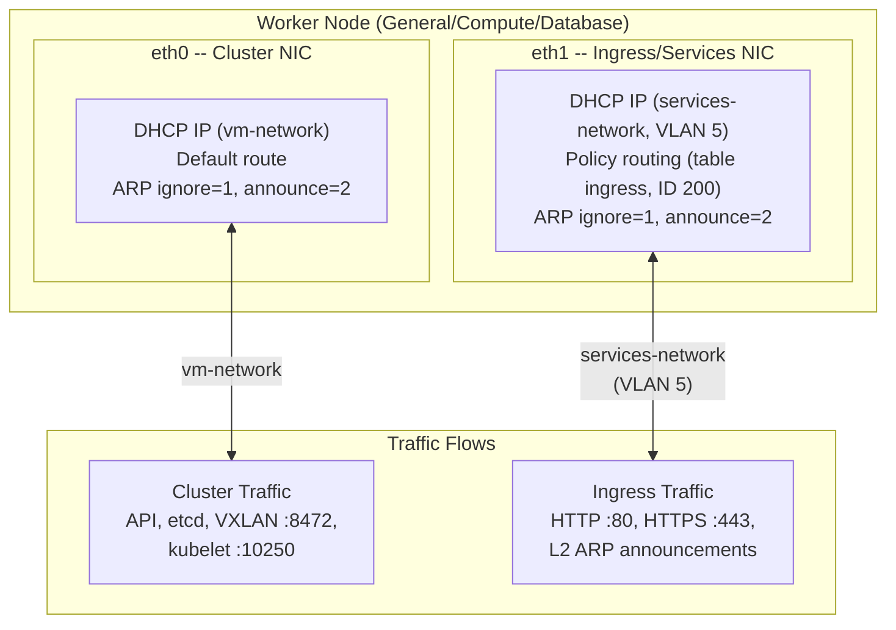

### ARP Hardening

Applied to all worker nodes via cloud-init (`/etc/sysctl.d/90-arp.conf`):

| Setting | Value | Purpose |
|---------|-------|---------|
| `net.ipv4.conf.all.arp_ignore` | `1` | Only respond to ARP if target IP is on receiving interface |
| `net.ipv4.conf.all.arp_announce` | `2` | Use best local address as ARP source (prevents cross-NIC leaks) |

### Policy Routing for eth1

A NetworkManager dispatcher script (`/etc/NetworkManager/dispatcher.d/10-ingress-routing`)
ensures traffic originating from eth1 replies via eth1:

- Creates routing table `ingress` (ID 200)
- Rule: traffic from eth1 IP uses table `ingress` (priority 100)
- Routes eth1 traffic out via eth1 gateway
- Triggered automatically when eth1 comes up

### Firewall Rules (iptables)

All nodes run iptables with `INPUT DROP` default policy:

| Port | Protocol | Purpose |
|------|----------|---------|
| 22 | TCP | SSH access |
| 6443 | TCP | Kubernetes API server |
| 9345 | TCP | RKE2 supervisor API |
| 2379--2381 | TCP | etcd client + peer |
| 10250 | TCP | kubelet API |
| 10257 | TCP | kube-controller-manager |
| 10259 | TCP | kube-scheduler |
| 30000--32767 | TCP/UDP | NodePort range |
| 4240 | TCP | Cilium health checks |
| 8472 | UDP | Cilium VXLAN overlay |
| 4244 | TCP | Hubble server |
| 4245 | TCP | Hubble relay |
| 9962 | TCP | Cilium agent metrics |

### End-to-End Packet Flow

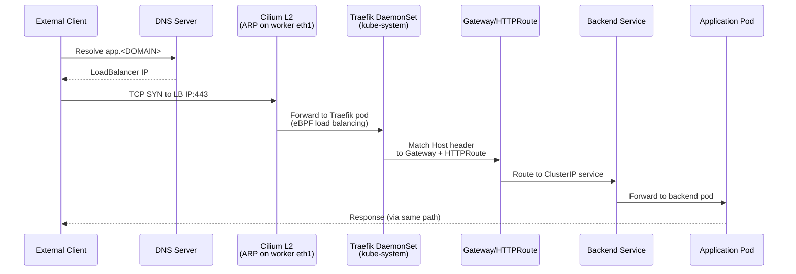

---

## 5. Service Dependency Graph

### Complete Service Dependency Map

```mermaid
graph BT
    subgraph Infrastructure["Infrastructure Layer"]
        Harvester["Harvester HCI<br/>(bare metal)"]
        Longhorn["Longhorn CSI<br/>(harvester StorageClass)"]
        HCP["Harvester Cloud Provider<br/>(LoadBalancer + CSI)"]
    end

    subgraph KubeLayer["Kubernetes Layer"]
        RKE2["RKE2 v1.34<br/>(Kubernetes)"]
        Cilium["Cilium CNI<br/>(eBPF, Gateway API)"]
        Traefik["Traefik 3.x<br/>(Ingress Controller)"]
        CoreDNS["CoreDNS<br/>(Cluster DNS)"]
    end

    subgraph Foundation["Foundation Layer"]
        CM["cert-manager v1.19.3<br/>(certificate lifecycle)"]
        Vault["Vault HA v1.19.0<br/>(3 replicas, Raft)<br/>PKI + secrets"]
        CNPG_Op["CNPG Operator<br/>(PostgreSQL lifecycle)"]
    end

    subgraph DataLayer["Data Layer"]
        HarborPG["CNPG harbor-pg<br/>(3 instances, PG 16)<br/>namespace: database"]
        KasmPG["CNPG kasm-pg<br/>(3 instances, PG 14)<br/>namespace: database"]
        KCPG["CNPG keycloak-pg<br/>(3 instances, PG 16)<br/>namespace: database"]
        MMPG["CNPG mattermost-pg<br/>(3 instances, PG 16)<br/>namespace: database"]
        HarborRedis["Valkey Sentinel<br/>(3+3 replicas, OpsTree)<br/>namespace: harbor"]
        ArgoRedis["Redis HA + HAProxy<br/>(3+3 replicas, Valkey 8)<br/>namespace: argocd"]
        HarborMinio["MinIO (200 GiB)<br/>namespace: minio"]
        MMMinio["MinIO (20 GiB)<br/>namespace: mattermost"]
    end

    subgraph Monitoring["Monitoring Layer"]
        Prom["Prometheus<br/>(50 GiB, 30d retention)"]
        Grafana["Grafana<br/>(24 dashboards)"]
        Loki["Loki<br/>(50 GiB, 7d retention)"]
        Alloy["Alloy<br/>(DaemonSet log collector)"]
        AM["Alertmanager<br/>(alert routing)"]
        NE["Node Exporter<br/>(DaemonSet)"]
        KSM["kube-state-metrics"]
    end

    subgraph AppLayer["Application Layer"]
        KC["Keycloak HA<br/>(2-5 replicas, HPA)"]
        ArgoCD["ArgoCD HA<br/>(2 replicas each component)"]
        ArgoRoll["Argo Rollouts<br/>(2 ctrl + 1 dashboard)"]
        Harbor["Harbor HA<br/>(core, portal, registry,<br/>jobservice, trivy, exporter)"]
        MM["Mattermost<br/>(team messaging)"]
        Kasm["Kasm Workspaces<br/>(virtual desktops)"]
    end

    %% Infrastructure dependencies
    Harvester --> Longhorn
    Harvester --> HCP
    Harvester --> RKE2
    Longhorn --> RKE2
    HCP --> RKE2
    RKE2 --> Cilium
    RKE2 --> CoreDNS
    Cilium --> Traefik

    %% Foundation dependencies
    Vault -->|"PKI backend"| CM
    CNPG_Op -->|"manages"| HarborPG
    CNPG_Op -->|"manages"| KasmPG
    CNPG_Op -->|"manages"| KCPG
    CNPG_Op -->|"manages"| MMPG

    %% cert-manager provides TLS to all apps
    CM -->|"TLS certs"| Traefik
    CM -->|"TLS certs"| KC
    CM -->|"TLS certs"| ArgoCD
    CM -->|"TLS certs"| Harbor
    CM -->|"TLS certs"| MM
    CM -->|"TLS certs"| Kasm
    CM -->|"TLS certs"| Grafana
    CM -->|"TLS certs"| Prom

    %% Data layer dependencies
    HarborPG -->|"metadata"| Harbor
    HarborRedis -->|"cache + sessions"| Harbor
    HarborMinio -->|"blobs + charts"| Harbor
    KasmPG -->|"metadata"| Kasm
    KCPG -->|"identity data"| KC
    MMPG -->|"messages"| MM
    MMMinio -->|"file attachments"| MM
    ArgoRedis -->|"state cache"| ArgoCD

    %% Monitoring scrapes everything
    NE -->|"host metrics"| Prom
    KSM -->|"K8s state"| Prom
    Alloy -->|"logs push"| Loki
    Prom -->|"PromQL"| Grafana
    Loki -->|"LogQL"| Grafana
    Prom -->|"alerts"| AM
```

### Service Communication Matrix

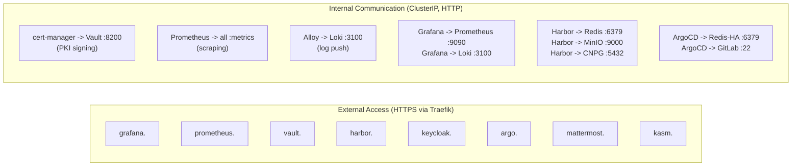

---

## 6. Storage Architecture

### Storage Hierarchy

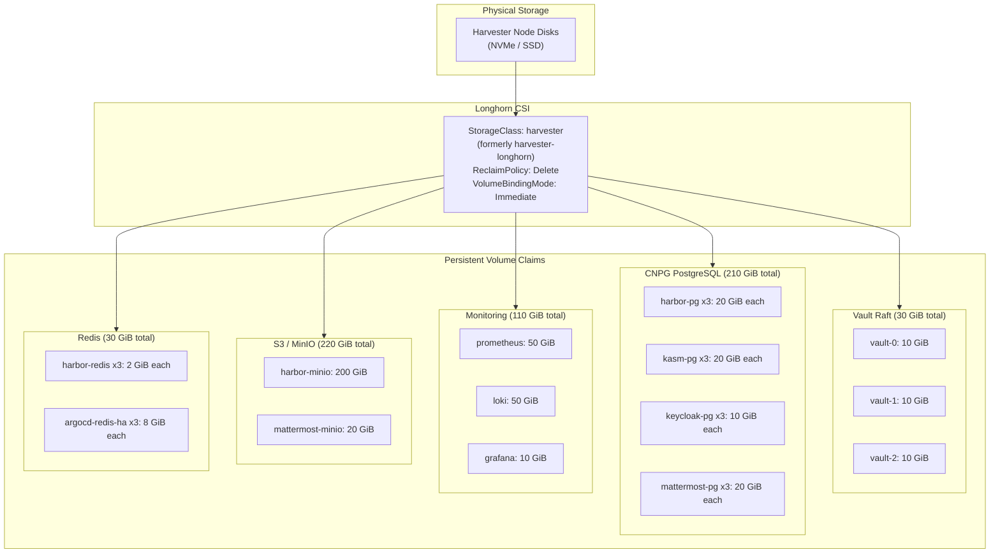

### Complete PVC Inventory

| Namespace | Workload | PVC Size | Replicas | Total | Retention | Purpose |
|-----------|----------|----------|----------|-------|-----------|---------|
| vault | vault-{0,1,2} | 10 GiB | 3 | 30 GiB | Permanent | Raft consensus storage |
| database | harbor-pg-{1,2,3} | 20 GiB | 3 | 60 GiB | Permanent | Harbor registry metadata |
| database | kasm-pg-{1,2,3} | 20 GiB | 3 | 60 GiB | Permanent | Kasm Workspaces metadata |
| database | keycloak-pg-{1,2,3} | 10 GiB | 3 | 30 GiB | Permanent | Keycloak identity data |
| database | mattermost-pg-{1,2,3} | 20 GiB | 3 | 60 GiB | Permanent | Mattermost messages |
| monitoring | prometheus | 50 GiB | 1 | 50 GiB | 30 days | Time-series metrics |
| monitoring | loki | 50 GiB | 1 | 50 GiB | 7 days | Log storage (TSDB v13) |
| monitoring | grafana | 10 GiB | 1 | 10 GiB | Permanent | Dashboard state + preferences |
| minio | harbor-minio | 200 GiB | 1 | 200 GiB | Permanent | OCI images, Helm charts |
| mattermost | mattermost-minio | 20 GiB | 1 | 20 GiB | Permanent | File attachments |
| harbor | harbor-redis-{0,1,2} | 2 GiB | 3 | 6 GiB | Ephemeral | Harbor cache + sessions |
| argocd | argocd-redis-ha-{0,1,2} | 8 GiB | 3 | 24 GiB | Ephemeral | ArgoCD state cache |
| **Total** | | | | **~600 GiB** | | |

---

## 7. Security Architecture

### TLS Certificate Chain

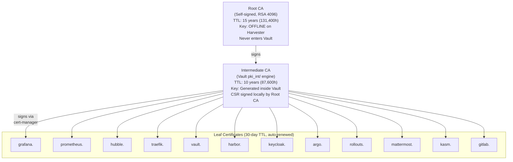

### Certificate Issuance Flow

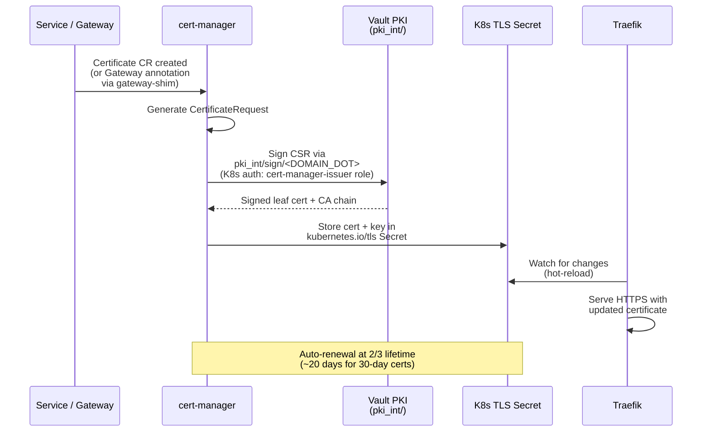

### Certificate Parameters

| Parameter | Value |
|-----------|-------|
| Root CA TTL | 131,400h (15 years) -- key offline on Harvester |
| Intermediate CA TTL | 87,600h (10 years) |
| Leaf certificate max TTL | 720h (30 days) |
| Auto-renewal trigger | At 2/3 lifetime (~20 days) |
| Root CA key algorithm | RSA 4096 |
| Leaf key algorithm | RSA 2048 |
| Allowed domains | `*.<DOMAIN>` |
| ClusterIssuer | `vault-issuer` |
| Vault PKI path | `pki_int/sign/<DOMAIN_DOT>` |
| Vault auth method | Kubernetes (ServiceAccount `vault-issuer` in cert-manager namespace) |

### Vault PKI and Kubernetes Auth

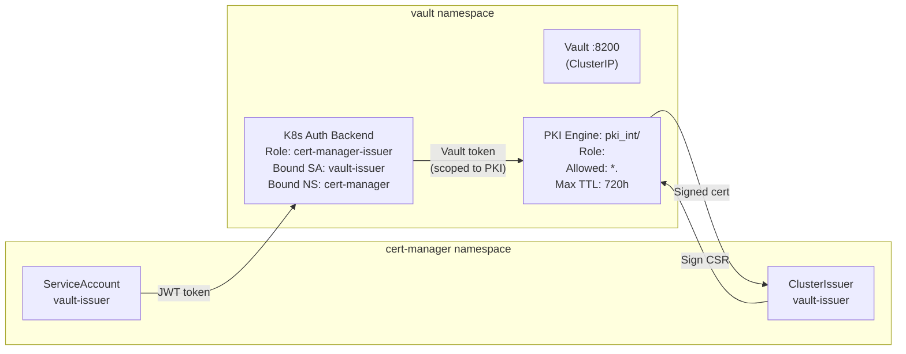

### Authentication Matrix

| Endpoint | Auth Method | Provider | SSO Status | Allowed Groups |
|----------|------------|----------|------------|----------------|
| `grafana.<DOMAIN>` | Keycloak OIDC | Grafana (native) | Implemented (`prompt=login`) | All (role-mapped) |
| `prometheus.<DOMAIN>` | oauth2-proxy ForwardAuth | `prometheus-oidc` client | Implemented | platform-admins, infra-engineers |
| `alertmanager.<DOMAIN>` | oauth2-proxy ForwardAuth | `alertmanager-oidc` client | Implemented | platform-admins, infra-engineers |
| `hubble.<DOMAIN>` | oauth2-proxy ForwardAuth | `hubble-oidc` client | Implemented | platform-admins, infra-engineers, network-engineers |
| `traefik.<DOMAIN>` | oauth2-proxy ForwardAuth | `traefik-dashboard-oidc` client | Implemented | platform-admins, network-engineers |
| `vault.<DOMAIN>` | Keycloak OIDC | Vault (native) | Implemented | platform-admins, infra-engineers |
| `harbor.<DOMAIN>` | Keycloak OIDC | Harbor (native) | Implemented | All (admin: platform-admins) |
| `keycloak.<DOMAIN>` | Keycloak (native) | Keycloak | N/A (is the IdP) | N/A |
| `argo.<DOMAIN>` | Keycloak OIDC | ArgoCD (native, `prompt=login`) | Implemented | All (RBAC policies) |
| `rollouts.<DOMAIN>` | oauth2-proxy ForwardAuth | `rollouts-oidc` client | Implemented | platform-admins, infra-engineers, senior-developers |
| `mattermost.<DOMAIN>` | Keycloak OIDC | Mattermost (native) | Implemented | All |
| `kasm.<DOMAIN>` | Keycloak OIDC | Kasm (manual UI config) | Manual config required | All |
| `rancher.<DOMAIN>` | Keycloak OIDC | Rancher (manual UI config) | Manual config required | All |

### SSO Implementation Status

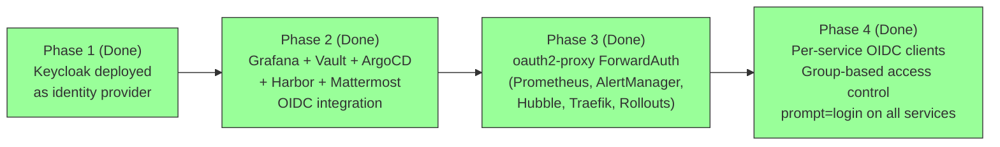

### Network Security Posture

| Layer | Control | Status |
|-------|---------|--------|
| **Perimeter** | VPN-only access to cluster | Active |
| **Firewall** | iptables INPUT DROP on all nodes | Active |
| **ARP** | arp_ignore=1, arp_announce=2 on workers | Active |
| **TLS** | All external traffic HTTPS (Vault-signed certs) | Active |
| **Internal** | ClusterIP HTTP (no inter-service TLS) | Active |
| **Network Policy** | Cilium NetworkPolicy per namespace | Planned |
| **Pod Security** | Pod Security Admission (restricted) | Planned |
| **Secret Management** | Vault KV + External Secrets Operator | Planned |

### RBAC Inventory

| Scope | ClusterRole/Role | Bound To | Purpose |
|-------|-----------------|----------|---------|
| Cluster | `system:auth-delegator` | vault SA (vault) | Vault K8s auth token review |
| Cluster | Prometheus ClusterRole | prometheus SA (monitoring) | Scrape metrics across all namespaces |
| Cluster | Alloy ClusterRole | alloy SA (monitoring) | Read pod logs across all namespaces |
| Cluster | kube-state-metrics ClusterRole | ksm SA (monitoring) | Read K8s objects for metrics |
| Cluster | Node Exporter ClusterRole | node-exporter SA (monitoring) | Host-level metrics access |
| Namespace | vault-issuer Role | vault-issuer SA (cert-manager) | Token creation for Vault K8s auth |
| Namespace | keycloak Role | keycloak SA (keycloak) | KUBE_PING pod listing for JGroups |
| Namespace | ArgoCD built-in RBAC | ArgoCD SAs (argocd) | Application management |

---

## 8. Autoscaling Architecture

### Multi-Layer Autoscaling

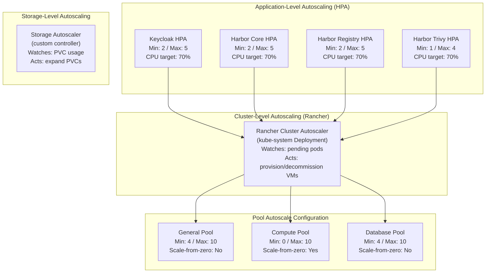

### Cluster Autoscaler: Scale-Down Behavior

The cluster resource carries annotations that configure autoscaler scale-down behavior:

| Annotation | Default | Purpose |
|------------|---------|---------|
| `autoscaler-scale-down-unneeded-time` | 30 min | Node must be idle this long before removal |
| `autoscaler-scale-down-delay-after-add` | 15 min | Cooldown after adding a node before scale-down |
| `autoscaler-scale-down-delay-after-delete` | 30 min | Cooldown after deleting a node |
| `autoscaler-scale-down-utilization-threshold` | 0.5 | CPU/memory utilization below which a node is unneeded |

### Cluster Autoscaler: Scale-From-Zero

The compute worker pool is configured with `min=0`, enabling scale-from-zero. When a pod
with `nodeSelector: workload-type=compute` is created and cannot be scheduled:

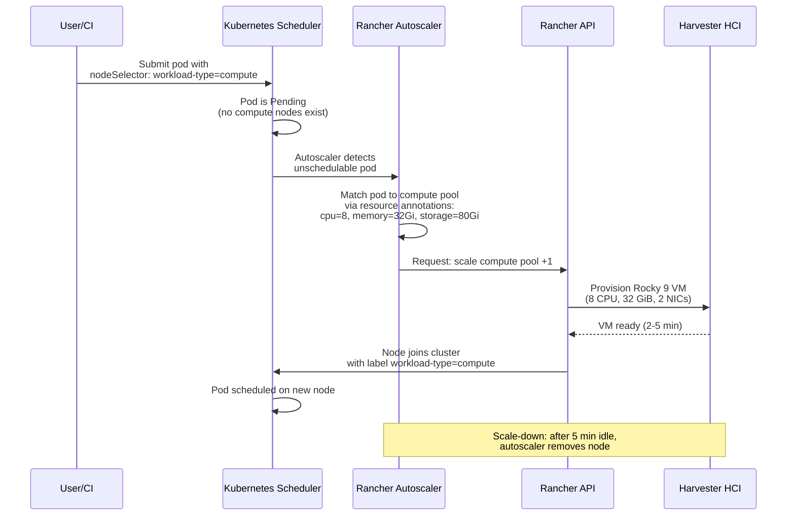

The compute pool uses Terraform annotations to advertise its capacity to the autoscaler
for scale-from-zero decisions:

```
cluster.provisioning.cattle.io/autoscaler-resource-cpu = "8"
cluster.provisioning.cattle.io/autoscaler-resource-memory = "32Gi"
cluster.provisioning.cattle.io/autoscaler-resource-storage = "80Gi"
```

### HPA Configuration Summary

| Target | Namespace | Min | Max | Metric | Target | Scale-Up Window | Scale-Down Window |
|--------|-----------|-----|-----|--------|--------|-----------------|-------------------|
| Keycloak | keycloak | 2 | 5 | CPU utilization | 70% | 60s | 300s |
| Harbor Core | harbor | 2 | 5 | CPU utilization | 70% | 60s | 300s |
| Harbor Registry | harbor | 2 | 5 | CPU utilization | 70% | 60s | 300s |
| Harbor Trivy | harbor | 1 | 4 | CPU utilization | 70% | 60s | 300s |

### Storage Autoscaler

A custom controller deployed in the `storage-autoscaler` namespace watches PVC usage
metrics from Prometheus and automatically expands PVCs before they run out of space.

---

## 9. Monitoring Architecture

### Monitoring Stack Overview

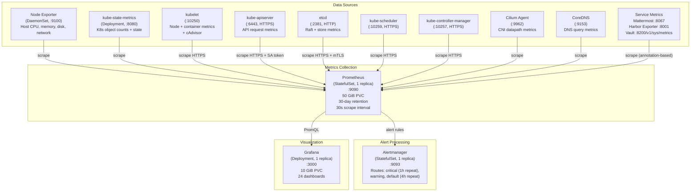

### Log Pipeline

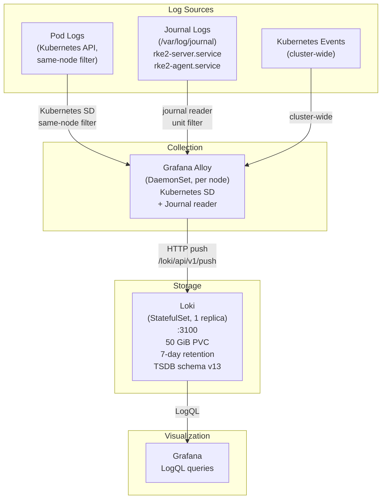

### Grafana Dashboard Inventory (24 Dashboards)

| Folder | Dashboard | ConfigMap | Datasource | Description |
|--------|-----------|-----------|------------|-------------|
| **Home** | Home | `configmap-dashboard-home` | Prometheus | Cluster overview with drill-down links |
| **RKE2** | etcd | `configmap-dashboard-etcd` | Prometheus | etcd cluster performance and Raft health |
| **Kubernetes** | Node Detail | `configmap-dashboard-node-detail` | Prometheus | Per-node hardware metrics |
| **Kubernetes** | API Server | `configmap-dashboard-apiserver` | Prometheus | API server request latency and errors |
| **Networking** | Cilium Agent | `configmap-dashboard-cilium` | Prometheus | CNI datapath metrics |
| **Networking** | CoreDNS | `configmap-dashboard-coredns` | Prometheus | DNS query performance |
| **Networking** | Traefik | `configmap-dashboard-traefik` | Prometheus | Ingress request rate and latency |
| **Loki** | Loki Logs | `configmap-dashboard-loki` | Loki | Log search and exploration |
| **Loki** | Loki Stack Monitoring | `configmap-dashboard-loki-stack` | Prometheus + Loki | Loki pipeline health |
| **Services** | Vault | `configmap-dashboard-vault` | Prometheus | Seal status, requests, Raft health |
| **Services** | cert-manager | `configmap-dashboard-cert-manager` | Prometheus | Certificate expiry, issuance rate |
| **Services** | ArgoCD | `configmap-dashboard-argocd` | Prometheus | Sync status, app health |
| **Services** | Argo Rollouts | `configmap-dashboard-argo-rollouts` | Prometheus | Rollout progress, analysis results |
| **Services** | Harbor | `configmap-dashboard-harbor` | Prometheus | Registry requests, storage usage |
| **Services** | Keycloak | `configmap-dashboard-keycloak` | Prometheus | Login events, active sessions |
| **Services** | Mattermost | `configmap-dashboard-mattermost` | Prometheus | Active users, message rate |
| **Services** | GitLab | `configmap-dashboard-gitlab` | Prometheus | CI pipeline metrics |
| **Services** | Redis | `configmap-dashboard-redis` | Prometheus | Redis/Valkey cluster health, memory, connections |
| **Services** | Node Labeler | `configmap-dashboard-node-labeler` | Prometheus | Node labeler controller metrics |
| **Storage** | Storage Overview | `configmap-dashboard-storage` | Prometheus | PVC capacity and IOPS |
| **Storage** | CNPG | `configmap-dashboard-cnpg` | Prometheus | PostgreSQL replication lag, query stats |
| **Security** | Security Advanced | `configmap-dashboard-security-advanced` | Prometheus | Security posture, certificate status, auth metrics |
| **Security** | oauth2-proxy ForwardAuth | `configmap-dashboard-oauth2-proxy` | Prometheus + Loki | Per-service proxy health, Keycloak per-client login analytics, resource usage |
| **Operations** | Firing Alerts | `configmap-dashboard-firing-alerts` | Prometheus | Currently firing alerts overview |

### Alertmanager Configuration

```mermaid
graph TD
    subgraph Routes["Alert Routing"]
        Default["Default Receiver<br/>group_wait: 30s<br/>group_interval: 5m<br/>repeat_interval: 4h"]
        Critical["Critical Receiver<br/>severity: critical<br/>group_wait: 10s<br/>repeat_interval: 1h"]
        Warning["Warning Receiver<br/>severity: warning"]
    end

    subgraph Inhibit["Inhibition Rules"]
        Rule["Critical suppresses Warning<br/>when same alertname + namespace"]
    end

    Prom["Prometheus<br/>Alert Rules"] --> Default
    Default -->|"severity: critical"| Critical
    Default -->|"severity: warning"| Warning
    Rule -.->|"inhibits"| Warning
```

---

## 10. GitOps Architecture

### ArgoCD App-of-Apps Pattern

```mermaid
graph TD
    subgraph GitLab["GitLab Repository"]
        Repo["git@gitlab.<DOMAIN>:infrastructure/rke2-cluster.git<br/>Branch: main<br/>Path: services/argo/bootstrap/apps/"]
    end

    subgraph ArgoCD["ArgoCD (argocd namespace)"]
        Root["app-of-apps<br/>(Root Application)<br/>auto-sync + prune + self-heal<br/>Watches: services/argo/bootstrap/apps/"]

        MonApp["monitoring-stack<br/>auto-sync<br/>Path: services/monitoring-stack/"]
        CMApp["cert-manager<br/>auto-sync<br/>Path: services/cert-manager/"]
        RollApp["argo-rollouts<br/>auto-sync<br/>Path: services/argo/argo-rollouts/"]
        VaultApp["vault<br/>MANUAL sync only<br/>Path: services/vault/"]
    end

    Repo --> Root
    Root --> MonApp
    Root --> CMApp
    Root --> RollApp
    Root --> VaultApp

    style VaultApp fill:#ff9,stroke:#333
```

> **Vault is manual-sync only** -- auto-sync would restart Vault pods, which then require
> manual unsealing (Shamir 3-of-5 keys).

### GitOps Sync Flow

```mermaid
sequenceDiagram
    participant Dev as Developer
    participant Git as GitLab
    participant Argo as ArgoCD
    participant K8s as Kubernetes
    participant Roll as Argo Rollouts

    Dev->>Git: git push (services/ changes)
    Git-->>Argo: Webhook / poll (3 min interval)
    Argo->>Argo: Compare desired vs live state

    alt Auto-sync app (monitoring, cert-manager, rollouts)
        Argo->>K8s: Apply manifests<br/>(prune + self-heal)
    else Manual-sync app (Vault)
        Argo->>Argo: Mark OutOfSync
        Dev->>Argo: Manual sync trigger via UI/CLI
        Argo->>K8s: Apply manifests
    end

    alt Rollout resource detected
        K8s->>Roll: Rollout triggered
        Roll->>K8s: Canary (% traffic split<br/>via Gateway API)
        Roll->>Roll: AnalysisTemplate<br/>(Prometheus metrics)
        Roll->>K8s: Promote to 100%
    else Standard Deployment
        K8s->>K8s: Rolling update
    end
```

### Argo Rollouts: Progressive Delivery

ArgoCD manages declarative state; Argo Rollouts handles progressive delivery for
application workloads that use the `Rollout` CRD instead of `Deployment`.

| Component | Replicas | Resources | Purpose |
|-----------|----------|-----------|---------|
| Rollouts Controller | 2 | 250m-1 CPU, 256Mi-512Mi | Manages Rollout lifecycle and analysis |
| Rollouts Dashboard | 1 | 100m-250m CPU, 128Mi-256Mi | Web UI for rollout visualization |
| Gateway API Plugin | (sidecar) | -- | Traffic splitting via HTTPRoute weights |

Traffic routing during canary uses the **Gateway API traffic router plugin**, which
modifies HTTPRoute backend weights to split traffic between stable and canary services.

### Day-2 Operations Flow

```mermaid
graph TD
    subgraph InfraChanges["Infrastructure Changes (Terraform)"]
        TFEdit["Edit cluster/*.tf files"]
        TFPush["./terraform.sh push-secrets"]
        TFPlan["./terraform.sh plan"]
        TFApply["./terraform.sh apply<br/>(Rancher orchestrates)"]
        TFEdit --> TFPush --> TFPlan --> TFApply
    end

    subgraph SvcChanges["Service Changes (GitOps)"]
        GitEdit["Edit services/ manifests"]
        GitPush["git push to main"]
        ArgoDetect["ArgoCD detects drift"]
        ArgoSync["Auto-sync (or manual for Vault)"]
        GitEdit --> GitPush --> ArgoDetect --> ArgoSync
    end

    subgraph ManualChanges["Manual Changes (pre-ArgoCD)"]
        KEdit["Edit manifests"]
        KApply["kubectl apply -k / helm upgrade"]
        KEdit --> KApply
    end
```

---

## 11. Platform Services Inventory

### Complete Service Table

| # | Service | Version | Chart | Namespace | Pool | Replicas | HA Mode | CPU (req/lim) | Memory (req/lim) | Storage | Ingress |
|---|---------|---------|-------|-----------|------|----------|---------|---------------|-------------------|---------|---------|
| 1 | **Vault** | 1.19.0 | hashicorp/vault 0.32.0 | vault | database | 3 | Raft consensus | 250m / 1 | 256Mi / 512Mi | 10 GiB x 3 | Gateway + HTTPRoute |
| 2 | **cert-manager** | v1.19.3 | jetstack/cert-manager | cert-manager | general | 1 | Stateless | -- | -- | None | None (internal) |
| 3 | **Prometheus** | (upstream) | Kustomize | monitoring | general | 1 | No | 500m / 2 | 2 GiB / 4 GiB | 50 GiB | Gateway + HTTPRoute |
| 4 | **Grafana** | (upstream) | Kustomize | monitoring | general | 1 | No | 500m / 1 | 512Mi / 1 GiB | 10 GiB | Gateway + HTTPRoute |
| 5 | **Loki** | (upstream) | Kustomize | monitoring | general | 1 | No | 250m / 1 | 512Mi / 2 GiB | 50 GiB | None (internal) |
| 6 | **Alloy** | (upstream) | Kustomize | monitoring | all (DS) | DaemonSet | N/A | 100m / 500m | 128Mi / 512Mi | None | None (internal) |
| 7 | **Alertmanager** | (upstream) | Kustomize | monitoring | general | 1 | No | -- | -- | None | Gateway + HTTPRoute |
| 8 | **Keycloak** | 26.0.8 | Kustomize | keycloak | general | 2--5 (HPA) | Infinispan/JGroups | 500m / 2 | 512Mi / 1.5 GiB | None (uses PG) | Gateway + HTTPRoute |
| 9 | **ArgoCD** | v3.3.0 | argo/argo-cd 9.4.1 | argocd | general | 2 (each component) | Redis HA (Valkey 8) | ~2 / ~8 (total) | ~2 GiB / ~8 GiB | 8 GiB x 3 (Redis) | Gateway + HTTPRoute |
| 10 | **Argo Rollouts** | v1.8.3 | argo/argo-rollouts 2.40.5 | argo-rollouts | general | 2 ctrl + 1 dash | N/A | ~750m / ~3 | ~768Mi / ~3 GiB | None | Gateway + HTTPRoute |
| 11 | **Harbor** | v2.14.x | goharbor/harbor 1.18.x | harbor | general | 2 (HPA, each component) | CNPG + Redis + MinIO | ~3 / ~12 | ~3 GiB / ~12 GiB | See data layer | Gateway + HTTPRoute |
| 12 | **Mattermost** | EE 10.5 | Kustomize | mattermost | general | 1 | HA-ready (gossip) | 500m / 2 | 1 GiB / 4 GiB | None (uses PG + MinIO) | Gateway + HTTPRoute |
| 13 | **Kasm Workspaces** | 1.18.1 | kasmtech/kasm 1.1181.0 | kasm | general | 1 (each component) | N/A | ~750m / ~3 | ~1.5 GiB / ~6 GiB | None (uses PG) | IngressRoute |
| 14 | **CNPG Operator** | (upstream) | Helm | cnpg-system | general | 1 | N/A | -- | -- | None | None (internal) |

### Data Layer Services

| # | Service | Type | Namespace | Instances | Version | Storage | Consumers |
|---|---------|------|-----------|-----------|---------|---------|-----------|
| 1 | **harbor-pg** | CNPG Cluster | database | 3 | PG 16 | 20 GiB x 3 | Harbor |
| 2 | **kasm-pg** | CNPG Cluster | database | 3 | PG 14 | 20 GiB x 3 | Kasm Workspaces |
| 3 | **keycloak-pg** | CNPG Cluster | database | 3 | PG 16 | 10 GiB x 3 | Keycloak |
| 4 | **mattermost-pg** | CNPG Cluster | database | 3 | PG 16 | 20 GiB x 3 | Mattermost |
| 5 | **Vault Raft** | Integrated | vault | 3 | N/A | 10 GiB x 3 | Vault (secrets + PKI) |
| 6 | **Harbor Valkey** | OpsTree Valkey Sentinel | harbor | 3 server + 3 sentinel | -- | 2 GiB x 3 | Harbor cache + sessions |
| 7 | **ArgoCD Redis** | HA + HAProxy (Valkey) | argocd | 3 server + 3 HAProxy | Valkey 8-alpine | 8 GiB x 3 | ArgoCD state cache |
| 8 | **Harbor MinIO** | Deployment | minio | 1 | quay.io/minio/minio | 200 GiB | Harbor blobs + OCI charts |
| 9 | **Mattermost MinIO** | Deployment | mattermost | 1 | quay.io/minio/minio | 20 GiB | Mattermost file attachments |

### Namespace Inventory

| Namespace | Services | Management Method |
|-----------|----------|-------------------|
| `kube-system` | Cilium, Traefik, Hubble, Cluster Autoscaler, CoreDNS | RKE2 managed |
| `monitoring` | Prometheus, Grafana, Loki, Alloy, Alertmanager, Node Exporter, KSM | Kustomize (ArgoCD) |
| `vault` | Vault HA (3 replicas) | Helm (ArgoCD manual-sync) |
| `cert-manager` | cert-manager controller, webhook, cainjector | Helm (ArgoCD) |
| `keycloak` | Keycloak | Kustomize |
| `argocd` | ArgoCD (server, controller, repo-server, appset, Redis HA) | Helm |
| `argo-rollouts` | Argo Rollouts controller + dashboard | Helm (ArgoCD) |
| `harbor` | Harbor (core, portal, registry, jobservice, trivy, exporter), Valkey | Helm + Kustomize |
| `minio` | MinIO (Harbor S3 backend) | Kustomize |
| `database` | CNPG harbor-pg, kasm-pg, keycloak-pg, mattermost-pg | CNPG Operator |
| `mattermost` | Mattermost, MinIO | Kustomize |
| `kasm` | Kasm Workspaces (proxy, manager, share) | Helm + Kustomize |
| `cnpg-system` | CNPG Operator | Helm |
| `storage-autoscaler` | Storage Autoscaler controller | Kustomize |
| `terraform-state` | Terraform state secret, vault-init.json | Manual |

### Resource Budget Summary

#### General Pool (4--10 nodes, 4 CPU / 8 GiB each)

| Service | Replicas | CPU (req/lim) | Memory (req/lim) |
|---------|----------|---------------|-------------------|
| Prometheus | 1 | 500m / 2 | 2 GiB / 4 GiB |
| Grafana | 1 | 500m / 1 | 512Mi / 1 GiB |
| Loki | 1 | 250m / 1 | 512Mi / 2 GiB |
| Alertmanager | 1 | -- | -- |
| Alloy (DaemonSet) | all | 100m / 500m | 128Mi / 512Mi |
| Node Exporter (DaemonSet) | all | 50m / 250m | 64Mi / 256Mi |
| kube-state-metrics | 1 | 100m / 500m | 256Mi / 512Mi |
| Keycloak | 2--5 | 500m / 2 | 512Mi / 1.5 GiB |
| ArgoCD (server+ctrl+repo+appset) | 2 each | ~2 / ~8 | ~2 GiB / ~8 GiB |
| Argo Rollouts (ctrl+dash) | 2+1 | ~750m / ~3 | ~768Mi / ~3 GiB |
| Harbor (core+portal+reg+job+trivy+exp) | 2 each | ~3 / ~12 | ~3 GiB / ~12 GiB |
| Mattermost | 1 | 500m / 2 | 1 GiB / 4 GiB |
| Kasm (proxy+manager+share) | 1 each | ~750m / ~3 | ~1.5 GiB / ~6 GiB |
| Mattermost MinIO | 1 | 250m / 1 | 512Mi / 2 GiB |
| **Total (approx)** | | **~9 / ~36** | **~13 GiB / ~45 GiB** |

> At minimum scale (4 nodes), total available is 16 CPU / 32 GiB -- which is still less
> than the ~9 CPU / ~13 GiB requests, so the pool will likely need to autoscale.

#### Database Pool (4--10 nodes, 4 CPU / 16 GiB each)

| Service | Replicas | CPU (req/lim) | Memory (req/lim) |
|---------|----------|---------------|-------------------|
| Vault | 3 | 250m / 1 | 256Mi / 512Mi |
| harbor-pg (CNPG) | 3 | ~750m / ~3 | ~1.5 GiB / ~6 GiB |
| kasm-pg (CNPG) | 3 | ~750m / ~3 | ~1.5 GiB / ~6 GiB |
| keycloak-pg (CNPG) | 3 | ~750m / ~3 | ~1.5 GiB / ~6 GiB |
| mattermost-pg (CNPG) | 3 | ~750m / ~3 | ~1.5 GiB / ~6 GiB |
| Harbor Valkey Sentinel | 3+3 | ~750m / ~3 | ~1.5 GiB / ~6 GiB |
| Harbor MinIO | 1 | 250m / 1 | 512Mi / 2 GiB |
| **Total (approx)** | | **~4.5 / ~18** | **~8.3 GiB / ~33 GiB** |

> At minimum scale (4 nodes), total available is 16 CPU / 64 GiB. Comfortable headroom.

---

## Appendix A: Terraform Resource Dependency Chain

```mermaid
graph TD
    Cred["rancher2_cloud_credential.harvester"]
    Img["harvester_image.rocky9"]

    EFI_CP["null_resource.efi_controlplane<br/>(EFI boot patch)"]
    EFI_G["null_resource.efi_general"]
    EFI_C["null_resource.efi_compute"]
    EFI_D["null_resource.efi_database"]

    MC_CP["rancher2_machine_config_v2.controlplane<br/>(8 CPU, 32 GiB, 1 NIC)"]
    MC_G["rancher2_machine_config_v2.general<br/>(4 CPU, 8 GiB, 2 NICs)"]
    MC_C["rancher2_machine_config_v2.compute<br/>(8 CPU, 32 GiB, 2 NICs)"]
    MC_D["rancher2_machine_config_v2.database<br/>(4 CPU, 16 GiB, 2 NICs)"]

    Cluster["rancher2_cluster_v2.rke2<br/>(RKE2 cluster resource)"]

    Cred --> MC_CP
    Cred --> MC_G
    Cred --> MC_C
    Cred --> MC_D

    Img --> MC_CP
    Img --> MC_G
    Img --> MC_C
    Img --> MC_D

    MC_CP --> EFI_CP
    MC_G --> EFI_G
    MC_C --> EFI_C
    MC_D --> EFI_D

    EFI_CP --> Cluster
    EFI_G --> Cluster
    EFI_C --> Cluster
    EFI_D --> Cluster
```

## Appendix B: Deployment Phases (0--11)

```mermaid
flowchart TD
    subgraph Phase0["Phase 0: Infrastructure"]
        TF["terraform apply<br/>(cluster/ directory)<br/>Provisions VMs + RKE2"]
    end

    subgraph Phase1["Phase 1: Foundation"]
        F1["cert-manager v1.19.3"]
        F2["CNPG Operator"]
        F3["OpsTree Redis Operator"]
        F4["Node Labeler"]
        F5["Cluster Autoscaler"]
        F6["MariaDB Operator"]
    end

    subgraph Phase2["Phase 2: Vault + PKI"]
        V1["Vault HA (3 replicas)"]
        V2["Init + Unseal + Raft"]
        V3["Root CA + Intermediate CA"]
        V4["K8s Auth + cert-manager"]
        V1 --> V2 --> V3 --> V4
    end

    subgraph Phase3["Phase 3: Monitoring"]
        Mon["Prometheus, Grafana, Loki,<br/>Alloy, Alertmanager<br/>+ Storage Autoscaler"]
    end

    subgraph Phase4["Phase 4: Harbor"]
        H1["MinIO + CNPG harbor-pg<br/>+ Valkey Sentinel"]
        H2["Harbor Helm + Gateway"]
        H1 --> H2
    end

    subgraph Phase5["Phase 5: ArgoCD"]
        A1["ArgoCD HA + Argo Rollouts"]
    end

    subgraph Phase6["Phase 6: Keycloak"]
        KC["CNPG keycloak-pg<br/>+ Keycloak HA"]
    end

    subgraph Phase7["Phase 7: Remaining"]
        MM["Mattermost + CNPG"]
        KW["Kasm Workspaces + CNPG"]
        UK["Uptime Kuma (optional)"]
        LN["LibreNMS (optional)"]
    end

    subgraph Phase8_11["Phases 8-11: Finalization"]
        DNS["Phase 8: DNS Records"]
        Val["Phase 9: Validation + RBAC"]
        OIDC["Phase 10: Keycloak OIDC<br/>+ oauth2-proxy ForwardAuth"]
        GL["Phase 11: GitLab"]
        DNS --> Val --> OIDC --> GL
    end

    Phase0 --> Phase1
    Phase1 --> Phase2
    Phase2 --> Phase3
    Phase3 --> Phase4
    Phase4 --> Phase5
    Phase5 --> Phase6
    Phase6 --> Phase7
    Phase7 --> Phase8_11
```

## Appendix C: Backup and Recovery Summary

| Component | Method | Frequency | Retention | RTO |
|-----------|--------|-----------|-----------|-----|
| Terraform State | K8s secret on Harvester | After every apply | Current | 5 min |
| vault-init.json | K8s secret + offline copy | Once at init | Permanent | Permanent |
| Vault Raft | `vault operator raft snapshot save` | Weekly | 4 weeks | 30 min |
| etcd | RKE2 auto-snapshots | Every 6 hours | 5 snapshots | 15 min |
| CNPG PostgreSQL | Continuous WAL + scheduled base backup | Continuous | 7 days | 1-2 min (PITR) |
| Grafana Dashboards | Git (ConfigMaps) | Every commit | Git history | Automatic |
| Prometheus Metrics | PVC (ephemeral) | N/A | 30 days | Regeneration |
| Harbor Images | MinIO PVC + CNPG | Continuous | 30 days | 5 min |

## Appendix D: Known Limitations and Technical Debt

| Issue | Risk | Current Mitigation | Planned Resolution |
|-------|------|-------------------|-------------------|
| Vault Shamir unseal (manual) | Operational: pod restart requires human | 3-replica HA reduces impact | Auto-unseal via transit/KMS |
| No Cilium NetworkPolicy | Lateral movement between namespaces | VPN-only access + iptables | Cilium NetworkPolicy per namespace |
| ~~Basic-auth on 4 services~~ | ~~Weak auth, no MFA~~ | ~~Strong passwords~~ | **Resolved**: oauth2-proxy ForwardAuth with per-service OIDC clients and group-based access control |
| No Pod Security Admission | Privileged containers possible | Security context on known workloads | PSA enforce restricted |
| Rancher autoscaler label bug | New nodes may lack workload-type label | Node-labeler controller | Rancher upstream fix |
| Mattermost single replica | No HA for messaging | Gossip protocol ready | Scale replicas + restore sticky cookies |
| No secret scanning in CI | Credential leak risk | Git history scrubbed | GitLab secret detection |

---

_This document is the definitive engineering reference for the RKE2 cluster platform.
For operational procedures, see [Day-2 Operations](troubleshooting-sop.md#11-day-2-operations-procedures).
For troubleshooting, see [Troubleshooting SOP](troubleshooting-sop.md).
For deployment instructions, see [Deployment Automation](deployment-automation.md)._
