# Terraform Infrastructure Engineering Guide

This document provides a comprehensive engineering reference for the Terraform module that provisions an RKE2 Kubernetes cluster on Harvester via Rancher. It covers every resource, variable, cloud-init template, helper script, and operational procedure in depth.

---

## Table of Contents

1. [Overview](#1-overview)
2. [Resource Dependency Chain](#2-resource-dependency-chain)
3. [Complete Variable Reference](#3-complete-variable-reference)
4. [Resource Deep Dive](#4-resource-deep-dive)
5. [Cloud-Init Templates](#5-cloud-init-templates)
6. [EFI Boot Patching](#6-efi-boot-patching)
7. [terraform.sh Wrapper](#7-terraformsh-wrapper)
8. [Secrets Management](#8-secrets-management)
9. [Post-Destroy Cleanup](#9-post-destroy-cleanup)
10. [Golden Image vs Full Mode](#10-golden-image-vs-full-mode)
11. [Autoscaler Integration](#11-autoscaler-integration)
12. [Networking Configuration](#12-networking-configuration)
13. [Common Modifications](#13-common-modifications)
14. [State Management](#14-state-management)

---

## 1. Overview

### What the Module Does

This Terraform module creates and manages an RKE2 Kubernetes cluster running on Harvester HCI virtual machines, orchestrated through Rancher. In a single `terraform apply`, it:

1. Registers a **cloud credential** so Rancher can provision VMs on Harvester.
2. Uploads (or references) a **Rocky Linux 9 VM image** to Harvester.
3. Creates four **machine configuration** templates (control plane, general, compute, database) that define VM specs.
4. Applies **EFI boot patches** to the machine configs via the Rancher Kubernetes API (working around a provider limitation).
5. Provisions a **`rancher2_cluster_v2`** resource -- the RKE2 cluster itself -- with four machine pools, Cilium CNI, Traefik ingress, Harvester cloud provider, etcd snapshots, and cluster autoscaler annotations.

### Architecture of the Module

```
cluster/
  versions.tf              # Terraform + provider version constraints, K8s backend
  providers.tf             # Rancher2 and Harvester provider configuration
  variables.tf             # All input variables (54 variables)
  cloud_credential.tf      # rancher2_cloud_credential for Harvester
  image.tf                 # harvester_image (upload) or data source (golden)
  machine_config.tf        # 4x rancher2_machine_config_v2 + cloud-init locals
  efi.tf                   # 4x null_resource EFI patches via curl
  cluster.tf               # rancher2_cluster_v2 (the RKE2 cluster)
  outputs.tf               # 5 outputs (cluster IDs, image ID, credential ID)
  terraform.sh             # Wrapper script for init/apply/destroy/secrets
  terraform.tfvars.example # Example variable values
  examples/
    cloud-init-cp.yaml     # Example cloud-init for control plane override
    cloud-init-worker.yaml # Example cloud-init for worker node override
```

The module targets two external systems:

- **Rancher** (via the `rancher2` provider) -- manages the cluster lifecycle, machine pools, and cloud credentials.
- **Harvester** (via the `harvester` provider) -- manages VM images and provides the kubeconfig for the cloud provider.

Terraform state is stored in a **Kubernetes secret** on the Harvester cluster itself, making the infrastructure self-referential: the platform that hosts the VMs also stores the state that describes them.

---

## 2. Resource Dependency Chain

The following diagram shows how every resource and data source connects, from provider initialization through to outputs.

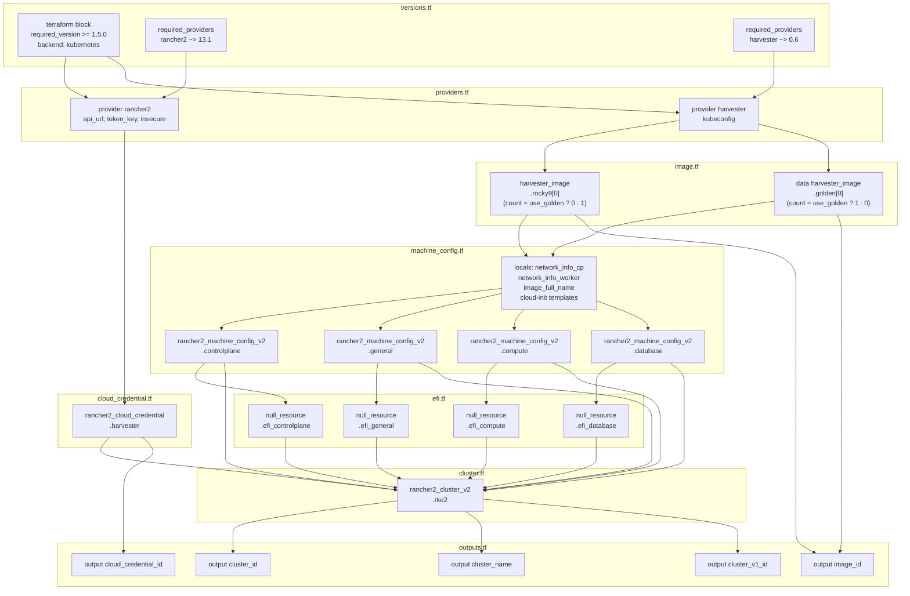

### Dependency Order Summary

| Step | File | Resources Created | Depends On |
|------|------|-------------------|------------|
| 1 | `versions.tf` | Terraform config, backend | -- |
| 2 | `providers.tf` | Provider instances | versions.tf |
| 3 | `cloud_credential.tf` | `rancher2_cloud_credential.harvester` | rancher2 provider |
| 4 | `image.tf` | `harvester_image.rocky9[0]` or `data.harvester_image.golden[0]` | harvester provider |
| 5 | `machine_config.tf` | 4x `rancher2_machine_config_v2` + locals | image resources |
| 6 | `efi.tf` | 4x `null_resource` (EFI patches) | machine configs |
| 7 | `cluster.tf` | `rancher2_cluster_v2.rke2` | EFI patches, cloud credential, machine configs |
| 8 | `outputs.tf` | 5 output values | cluster, image, credential |

---

## 3. Complete Variable Reference

### Rancher Connection

| Variable | Type | Default | Sensitive | Description |
|----------|------|---------|-----------|-------------|
| `rancher_url` | `string` | -- (required) | No | Rancher API URL (e.g., `https://rancher.example.com`). Used by the rancher2 provider and for EFI patch curl calls. |
| `rancher_token` | `string` | -- (required) | **Yes** | Rancher API token in `token-xxxxx:xxxxxxxxxxxx` format. Used for provider auth and EFI patch Bearer tokens. |

### Harvester Connection

| Variable | Type | Default | Sensitive | Description |
|----------|------|---------|-----------|-------------|
| `harvester_kubeconfig_path` | `string` | -- (required) | No | Path to Harvester cluster kubeconfig. Used by the harvester provider and the Kubernetes state backend. |
| `harvester_cloud_credential_kubeconfig_path` | `string` | `"./kubeconfig-harvester-cloud-cred.yaml"` | No | Path to Harvester kubeconfig for the Rancher cloud credential. Uses a dedicated service account token (not the user's Rancher token). |
| `harvester_cluster_id` | `string` | -- (required) | No | Harvester management cluster ID in Rancher (e.g., `c-bdrxb`). Found in Rancher UI under Virtualization Management. |

### Cluster Configuration

| Variable | Type | Default | Sensitive | Description |
|----------|------|---------|-----------|-------------|
| `cluster_name` | `string` | -- (required) | No | Name for the RKE2 cluster. Also used as prefix for VM names, image names, and machine config generate_names. |
| `kubernetes_version` | `string` | `"v1.34.2+rke2r1"` | No | Kubernetes version string. Must match an available RKE2 release in Rancher. |
| `cni` | `string` | `"cilium"` | No | CNI plugin. Set in `machine_global_config`. Cilium is the only tested configuration. |
| `traefik_lb_ip` | `string` | `"203.0.113.202"` | No | Static LoadBalancer IP for the Traefik ingress controller service. Must be routable on the services VLAN. |
| `domain` | `string` | -- (required) | No | Root domain for service FQDNs (e.g., `example.com`). Used in kube-apiserver OIDC issuer URL. |
| `keycloak_realm` | `string` | -- (required) | No | Keycloak realm name (e.g., `example`). Used in kube-apiserver OIDC issuer URL. |

### Harvester Networking

| Variable | Type | Default | Sensitive | Description |
|----------|------|---------|-----------|-------------|
| `vm_namespace` | `string` | -- (required) | No | Harvester namespace where VMs, images, and DataVolumes are created. Typically a dedicated namespace per cluster. |
| `harvester_network_name` | `string` | -- (required) | No | Name of the primary Harvester VM network (eth0, management VLAN). |
| `harvester_network_namespace` | `string` | -- (required) | No | Namespace of the primary VM network (usually same as `vm_namespace` or `default`). |
| `harvester_services_network_name` | `string` | `"services-network"` | No | Name of the secondary Harvester network (eth1, services/ingress VLAN). Workers only. |
| `harvester_services_network_namespace` | `string` | `"default"` | No | Namespace of the services network. |

### Rocky 9 Image

| Variable | Type | Default | Sensitive | Description |
|----------|------|---------|-----------|-------------|
| `rocky_image_url` | `string` | `"https://dl.rockylinux.org/pub/rocky/9/images/x86_64/Rocky-9-GenericCloud-Base.latest.x86_64.qcow2"` | No | Download URL for the Rocky 9 GenericCloud qcow2 image. Used only when `use_golden_image = false`. |
| `use_golden_image` | `bool` | `false` | No | When `true`, references a pre-existing golden image instead of downloading vanilla Rocky 9. Requires `golden_image_name`. |
| `golden_image_name` | `string` | `""` | No | Name of the golden image already uploaded to Harvester. Required when `use_golden_image = true` (enforced by precondition). |

### Control Plane Pool

| Variable | Type | Default | Sensitive | Description |
|----------|------|---------|-----------|-------------|
| `controlplane_count` | `number` | `3` | No | Number of control plane nodes. Should be odd (1, 3, 5) for etcd quorum. |
| `controlplane_cpu` | `string` | `"8"` | No | vCPUs per control plane node. Type is string because the Harvester provider expects it. |
| `controlplane_memory` | `string` | `"32"` | No | Memory in GiB per control plane node. |
| `controlplane_disk_size` | `number` | `80` | No | Disk size in GiB per control plane node. |

### General Worker Pool

| Variable | Type | Default | Sensitive | Description |
|----------|------|---------|-----------|-------------|
| `general_cpu` | `string` | `"4"` | No | vCPUs per general worker node. |
| `general_memory` | `string` | `"8"` | No | Memory in GiB per general worker node. |
| `general_disk_size` | `number` | `60` | No | Disk size in GiB per general worker node. |
| `general_min_count` | `number` | `4` | No | Minimum node count (autoscaler floor). Also used as initial `quantity`. |
| `general_max_count` | `number` | `10` | No | Maximum node count (autoscaler ceiling). |

### Compute Worker Pool

| Variable | Type | Default | Sensitive | Description |
|----------|------|---------|-----------|-------------|
| `compute_cpu` | `string` | `"8"` | No | vCPUs per compute worker node. |
| `compute_memory` | `string` | `"32"` | No | Memory in GiB per compute worker node. |
| `compute_disk_size` | `number` | `80` | No | Disk size in GiB per compute worker node. |
| `compute_min_count` | `number` | `0` | No | Minimum node count. **Default 0 enables scale-from-zero.** |
| `compute_max_count` | `number` | `10` | No | Maximum node count (autoscaler ceiling). |

### Database Worker Pool

| Variable | Type | Default | Sensitive | Description |
|----------|------|---------|-----------|-------------|
| `database_cpu` | `string` | `"4"` | No | vCPUs per database worker node. |
| `database_memory` | `string` | `"16"` | No | Memory in GiB per database worker node. |
| `database_disk_size` | `number` | `80` | No | Disk size in GiB per database worker node. |
| `database_min_count` | `number` | `4` | No | Minimum node count (autoscaler floor). |
| `database_max_count` | `number` | `10` | No | Maximum node count (autoscaler ceiling). |

### Cloud Provider

| Variable | Type | Default | Sensitive | Description |
|----------|------|---------|-----------|-------------|
| `harvester_cloud_credential_name` | `string` | -- (required) | No | Display name for the Harvester cloud credential in Rancher. |
| `harvester_cloud_provider_kubeconfig_path` | `string` | -- (required) | No | Path to the Harvester cloud provider kubeconfig. Injected into every node via `machine_selector_config` for the in-cluster Harvester cloud provider. |

### SSH

| Variable | Type | Default | Sensitive | Description |
|----------|------|---------|-----------|-------------|
| `ssh_user` | `string` | `"rocky"` | No | SSH user for the cloud image. Must match the image's default user. |
| `ssh_authorized_keys` | `list(string)` | -- (required) | No | List of SSH public keys injected into all nodes via cloud-init. |

### Cloud-Init Override

| Variable | Type | Default | Sensitive | Description |
|----------|------|---------|-----------|-------------|
| `user_data_cp_file` | `string` | `""` | No | Path to a custom cloud-init YAML file for control plane nodes. When non-empty, completely replaces the built-in template. |
| `user_data_worker_file` | `string` | `""` | No | Path to a custom cloud-init YAML file for worker nodes. When non-empty, completely replaces the built-in template. |

### Cluster Autoscaler Behavior

| Variable | Type | Default | Sensitive | Description |
|----------|------|---------|-----------|-------------|
| `autoscaler_scale_down_unneeded_time` | `string` | `"30m0s"` | No | How long a node must be unneeded before the autoscaler removes it. |
| `autoscaler_scale_down_delay_after_add` | `string` | `"15m0s"` | No | Cooldown after adding a node before any scale-down is considered. |
| `autoscaler_scale_down_delay_after_delete` | `string` | `"30m0s"` | No | Cooldown after deleting a node before the next scale-down. |
| `autoscaler_scale_down_utilization_threshold` | `string` | `"0.5"` | No | CPU/memory request utilization below which a node is considered unneeded (0.0--1.0). |

### Docker Hub Auth

| Variable | Type | Default | Sensitive | Description |
|----------|------|---------|-----------|-------------|
| `dockerhub_username` | `string` | `""` | No | Docker Hub username for authenticated pulls (rate-limit workaround). |
| `dockerhub_token` | `string` | `""` | **Yes** | Docker Hub personal access token. |

### Airgapped Mode

| Variable | Type | Default | Sensitive | Description |
|----------|------|---------|-----------|-------------|
| `airgapped` | `bool` | `false` | No | Enable airgapped mode. When `true`, cloud-init uses private RPM repo mirrors, and `system-default-registry` is set to `harbor.<DOMAIN>` in the machine global config. |
| `private_rocky_repo_url` | `string` | `""` | No | Base URL for private Rocky 9 repo mirror (used for EPEL when `airgapped = true`). |
| `private_rke2_repo_url` | `string` | `""` | No | Base URL for private RKE2 repo mirror (used for rke2-common and rke2-1-34 repos when `airgapped = true`). |
| `private_ca_pem` | `string` | `""` | **Yes** | PEM-encoded private CA certificate. When set and `airgapped = true`, injected into `/etc/pki/ca-trust/source/anchors/` via cloud-init and trusted via `update-ca-trust`. |

---

## 4. Resource Deep Dive

### 4.1 Terraform Backend and Providers (`versions.tf`, `providers.tf`)

#### Terraform Block

```hcl
terraform {
  required_version = ">= 1.5.0"

  required_providers {
    rancher2 = {
      source  = "rancher/rancher2"
      version = "~> 13.1"
    }
    harvester = {
      source  = "harvester/harvester"
      version = "~> 0.6"
    }
  }

  backend "kubernetes" {
    secret_suffix = "rke2-cluster"
    namespace     = "terraform-state"
    config_path   = "kubeconfig-harvester.yaml"
  }
}
```

**What it does:** Declares the minimum Terraform version (`>= 1.5.0`), pins the two provider versions, and configures the Kubernetes backend to store state as a secret named `tfstate-default-rke2-cluster` in the `terraform-state` namespace on Harvester.

**Key details:**
- `rancher2 ~> 13.1` -- allows 13.x patches but not 14.0 (pessimistic constraint).
- `harvester ~> 0.6` -- allows 0.6.x patches.
- The `config_path` is a relative path resolved from the working directory (the `cluster/` folder).

#### Providers

```hcl
provider "rancher2" {
  api_url   = var.rancher_url
  token_key = var.rancher_token
  insecure  = true
}

provider "harvester" {
  kubeconfig = var.harvester_kubeconfig_path
}
```

**What they do:**
- **rancher2** -- connects to the Rancher management server. `insecure = true` skips TLS verification (common in environments with internal CAs).
- **harvester** -- connects directly to the Harvester cluster via kubeconfig for image management.

---

### 4.2 Cloud Credential (`cloud_credential.tf`)

```hcl
resource "rancher2_cloud_credential" "harvester" {
  name = var.harvester_cloud_credential_name

  harvester_credential_config {
    cluster_id         = var.harvester_cluster_id
    cluster_type       = "imported"
    kubeconfig_content = file(var.harvester_cloud_credential_kubeconfig_path)
  }
}
```

**What it creates:** A Rancher cloud credential that allows Rancher to provision VMs on Harvester.

**Attributes:**
| Attribute | Value | Purpose |
|-----------|-------|---------|
| `name` | From `var.harvester_cloud_credential_name` | Display name in Rancher UI |
| `cluster_id` | From `var.harvester_cluster_id` | Links to the specific Harvester cluster (e.g., `c-bdrxb`) |
| `cluster_type` | `"imported"` | Harvester is an imported cluster in Rancher (not provisioned by Rancher) |
| `kubeconfig_content` | Read from file | A dedicated service account kubeconfig for Harvester (not the user's Rancher token) |

**Dependencies:**
- Implicit: `rancher2` provider.
- File dependency: `var.harvester_cloud_credential_kubeconfig_path` must exist at plan time.

**Consumers:**
- Every machine pool in `cluster.tf` references `rancher2_cloud_credential.harvester.id` as its `cloud_credential_secret_name`.

---

### 4.3 Image (`image.tf`)

This file contains two mutually exclusive resources controlled by `var.use_golden_image`:

#### Vanilla Rocky 9 Upload (default)

```hcl
resource "harvester_image" "rocky9" {
  count              = var.use_golden_image ? 0 : 1
  name               = "${var.cluster_name}-rocky9"
  namespace          = var.vm_namespace
  display_name       = "${var.cluster_name}-rocky9"
  source_type        = "download"
  url                = var.rocky_image_url
  storage_class_name = "harvester-longhorn"

  timeouts {
    create = "30m"
  }
}
```

**What it creates:** Downloads a Rocky 9 GenericCloud qcow2 image into Harvester's image store. The image is namespace-scoped and named `{cluster_name}-rocky9`.

**Attributes:**
| Attribute | Value | Purpose |
|-----------|-------|---------|
| `count` | `0` or `1` | Only created when NOT using golden image |
| `name` | `"{cluster_name}-rocky9"` | Unique per cluster, avoids collisions |
| `source_type` | `"download"` | Harvester downloads the qcow2 from the URL |
| `url` | Rocky 9 GenericCloud URL | Points to the latest Rocky 9 cloud image |
| `storage_class_name` | `"harvester-longhorn"` | Uses Longhorn for the backing PV |
| `timeouts.create` | `"30m"` | Large image downloads can be slow |

#### Golden Image Lookup

```hcl
data "harvester_image" "golden" {
  count     = var.use_golden_image ? 1 : 0
  name      = var.golden_image_name
  namespace = var.vm_namespace

  lifecycle {
    precondition {
      condition     = var.golden_image_name != ""
      error_message = "golden_image_name is required when use_golden_image is true."
    }
  }
}
```

**What it does:** Looks up an existing image by name. Does not create or modify anything.

**Lifecycle:**
- `precondition` -- fails the plan early with a clear error if `use_golden_image = true` but `golden_image_name` is empty.

**Image reference resolution (in `machine_config.tf` locals):**

```hcl
image_full_name = var.use_golden_image ? (
  "${var.vm_namespace}/${data.harvester_image.golden[0].name}"
) : (
  "${var.vm_namespace}/${harvester_image.rocky9[0].name}"
)
```

---

### 4.4 Machine Configs (`machine_config.tf`)

This file defines four `rancher2_machine_config_v2` resources and all cloud-init locals. Each machine config is a template that Rancher uses to create VMs in Harvester.

#### Resource Pattern (repeated for each pool)

Using the control plane as the example:

```hcl
resource "rancher2_machine_config_v2" "controlplane" {
  generate_name = "${var.cluster_name}-cp"

  harvester_config {
    vm_namespace         = var.vm_namespace
    cpu_count            = var.controlplane_cpu
    memory_size          = var.controlplane_memory
    reserved_memory_size = "-1"
    ssh_user             = var.ssh_user
    user_data            = var.user_data_cp_file != "" ? file(var.user_data_cp_file) : local.user_data_cp

    disk_info = jsonencode({
      disks = [{
        imageName = local.image_full_name
        size      = var.controlplane_disk_size
        bootOrder = 1
      }]
    })

    network_info = local.network_info_cp
  }
}
```

**Per-pool differences:**

| Pool | generate_name | CPU | Memory | Disk | Network | Cloud-Init |
|------|--------------|-----|--------|------|---------|------------|
| `controlplane` | `{cluster}-cp` | `controlplane_cpu` (8) | `controlplane_memory` (32) | `controlplane_disk_size` (80) | `network_info_cp` (single NIC) | `user_data_cp` |
| `general` | `{cluster}-general` | `general_cpu` (4) | `general_memory` (8) | `general_disk_size` (60) | `network_info_worker` (dual NIC) | `user_data_worker` |
| `compute` | `{cluster}-compute` | `compute_cpu` (8) | `compute_memory` (32) | `compute_disk_size` (80) | `network_info_worker` (dual NIC) | `user_data_worker` |
| `database` | `{cluster}-database` | `database_cpu` (4) | `database_memory` (16) | `database_disk_size` (80) | `network_info_worker` (dual NIC) | `user_data_worker` |

**Key attributes:**
| Attribute | Value | Purpose |
|-----------|-------|---------|
| `generate_name` | `"{cluster}-{pool}"` | Rancher appends a random suffix for uniqueness |
| `reserved_memory_size` | `"-1"` | Disables Harvester memory reservation (no memory balloon) |
| `ssh_user` | `"rocky"` | User that Rancher will SSH into for node provisioning |
| `user_data` | Conditional | Override file if set, otherwise built-in template |
| `disk_info` | JSON | Single disk from the image, boot order 1 |
| `network_info` | JSON | CP gets 1 NIC (management), workers get 2 NICs (management + services) |

**Network info locals:**

```hcl
# Control plane: single NIC (management VLAN only)
network_info_cp = jsonencode({
  interfaces = [{
    networkName = "${var.harvester_network_namespace}/${var.harvester_network_name}"
  }]
})

# Workers: dual NIC (management + services VLAN)
network_info_worker = jsonencode({
  interfaces = [
    { networkName = "${var.harvester_network_namespace}/${var.harvester_network_name}" },
    { networkName = "${var.harvester_services_network_namespace}/${var.harvester_services_network_name}" },
  ]
})
```

**Dependencies:**
- Implicit: `local.image_full_name` depends on either `harvester_image.rocky9[0]` or `data.harvester_image.golden[0]`.
- Implicit: `rancher2` provider.

---

### 4.5 EFI Patches (`efi.tf`)

Four `null_resource` resources, one per machine config pool. Detailed in [Section 6](#6-efi-boot-patching).

---

### 4.6 Docker Hub Auth Secret (`cluster.tf`)

A `rancher2_secret_v2` resource is created alongside the cluster to provide Docker Hub
authentication, working around anonymous pull rate limits:

```hcl
resource "rancher2_secret_v2" "dockerhub_auth" {
  cluster_id = "local"
  name       = "${var.cluster_name}-dockerhub-auth"
  namespace  = "fleet-default"
  type       = "kubernetes.io/basic-auth"
  data = {
    username = var.dockerhub_username
    password = var.dockerhub_token
  }
}
```

This secret is referenced in the cluster's `registries` block (see below) so all RKE2
nodes authenticate to Docker Hub via `registries.yaml`.

---

### 4.7 Cluster (`cluster.tf`)

The central resource -- `rancher2_cluster_v2.rke2` -- defines the entire RKE2 cluster.

#### Cluster-Level Autoscaler Annotations

The cluster resource carries annotations that configure autoscaler scale-down behavior:

```hcl
annotations = {
  "cluster.provisioning.cattle.io/autoscaler-scale-down-unneeded-time"         = var.autoscaler_scale_down_unneeded_time
  "cluster.provisioning.cattle.io/autoscaler-scale-down-delay-after-add"       = var.autoscaler_scale_down_delay_after_add
  "cluster.provisioning.cattle.io/autoscaler-scale-down-delay-after-delete"    = var.autoscaler_scale_down_delay_after_delete
  "cluster.provisioning.cattle.io/autoscaler-scale-down-utilization-threshold" = var.autoscaler_scale_down_utilization_threshold
}
```

| Annotation | Default | Purpose |
|------------|---------|---------|
| `autoscaler-scale-down-unneeded-time` | `30m0s` | Node must be idle this long before removal |
| `autoscaler-scale-down-delay-after-add` | `15m0s` | Cooldown after adding a node |
| `autoscaler-scale-down-delay-after-delete` | `30m0s` | Cooldown after deleting a node |
| `autoscaler-scale-down-utilization-threshold` | `0.5` | Utilization below this marks a node as unneeded |

#### Machine Pools

Four pools with distinct roles:

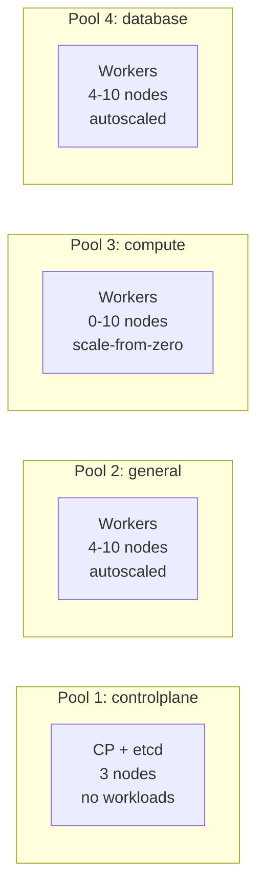

**Pool attributes common to all:**

| Attribute | Value | Purpose |
|-----------|-------|---------|
| `cloud_credential_secret_name` | `rancher2_cloud_credential.harvester.id` | Links pool to Harvester credential |
| `drain_before_delete` | `true` | Safely evicts pods before removing a node |
| `rolling_update.max_unavailable` | `"0"` | Never take a node offline during rolling updates |
| `rolling_update.max_surge` | `"1"` | Add one new node before removing old one |

**Pool-specific attributes:**

| Pool | Roles | Initial Quantity | Labels | Autoscaler Annotations |
|------|-------|-----------------|--------|----------------------|
| `controlplane` | CP + etcd | `var.controlplane_count` (3) | -- | -- |
| `general` | worker | `var.general_min_count` (4) | `workload-type=general` | min=4, max=10 |
| `compute` | worker | `var.compute_min_count` (0) | `workload-type=compute` | min=0, max=10, **resource annotations for scale-from-zero** |
| `database` | worker | `var.database_min_count` (4) | `workload-type=database` | min=4, max=10 |

The compute pool has additional resource annotations that tell the autoscaler what capacity a new node would provide when scaling from zero:

```hcl
"cluster.provisioning.cattle.io/autoscaler-resource-cpu"     = var.compute_cpu
"cluster.provisioning.cattle.io/autoscaler-resource-memory"  = "${var.compute_memory}Gi"
"cluster.provisioning.cattle.io/autoscaler-resource-storage" = "${var.compute_disk_size}Gi"
```

#### Machine Selector Configs

These inject per-node configuration based on pool membership:

1. **Global** -- All nodes get the Harvester cloud provider config:
   ```hcl
   machine_selector_config {
     config = yamlencode({
       cloud-provider-config = file(var.harvester_cloud_provider_kubeconfig_path)
       cloud-provider-name   = "harvester"
     })
   }
   ```

2. **Per-pool labels** -- Each worker pool gets a `workload-type` node label via RKE2's `--node-label` flag:
   ```hcl
   machine_selector_config {
     config = yamlencode({ node-label = ["workload-type=general"] })
     machine_label_selector {
       match_labels = { "rke.cattle.io/rke-machine-pool-name" = "general" }
     }
   }
   ```

> **Note:** The `node-role.kubernetes.io/*` labels cannot be set via kubelet's `--node-label` because the NodeRestriction admission controller blocks them. Those labels are applied separately by `deploy-cluster.sh`.

#### Chart Values

Three Helm charts are configured via `chart_values`:

**Harvester Cloud Provider:**
```yaml
harvester-cloud-provider:
  clusterName: "{cluster_name}"
  cloudConfigPath: "/var/lib/rancher/rke2/etc/config-files/cloud-provider-config"
```

**Cilium (CNI):**
```yaml
rke2-cilium:
  kubeProxyReplacement: true        # Full kube-proxy replacement
  k8sServiceHost: 127.0.0.1        # Localhost for API server
  k8sServicePort: 6443
  l2announcements:
    enabled: true                   # L2 LB IP announcements
  externalIPs:
    enabled: true                   # Allow external IP services
  gatewayAPI:
    enabled: true                   # Kubernetes Gateway API
  operator:
    replicas: 1                     # Single Cilium operator replica
  hubble:
    enabled: true                   # Network observability
    relay:
      enabled: true
    ui:
      enabled: true
  prometheus:
    enabled: true                   # Metrics export
  k8sClientRateLimit:
    qps: 25
    burst: 50
```

**Traefik (Ingress):**
```yaml
rke2-traefik:
  service:
    type: LoadBalancer
    spec:
      loadBalancerIP: "{traefik_lb_ip}"
  providers:
    kubernetesGateway:
      enabled: true                 # Gateway API support
  logs:
    access:
      enabled: true                 # Access logging
  tracing:
    otlp:
      enabled: true                 # OpenTelemetry tracing
  ports:
    web:
      redirections:
        entryPoint:
          to: websecure             # HTTP -> HTTPS redirect
          scheme: https
  volumes:                          # Vault root CA trust injection
    - name: vault-root-ca
      mountPath: /vault-ca
      type: configMap
    - name: combined-ca
      mountPath: /combined-ca
      type: emptyDir
  deployment:
    initContainers:
      - name: combine-ca           # Merges system CAs + Vault root CA
        image: alpine:3.21
        command: ["sh", "-c", "cp /etc/ssl/certs/ca-certificates.crt /combined-ca/... && cat /vault-ca/ca.crt >> ..."]
        volumeMounts:
          - name: vault-root-ca    # From ConfigMap
            mountPath: /vault-ca
          - name: combined-ca      # Output bundle
            mountPath: /combined-ca
  env:
    - name: SSL_CERT_FILE
      value: /combined-ca/ca-certificates.crt   # Traefik trusts Vault-signed backends
  additionalArguments:
    - "--api.insecure=true"                     # Internal API for dashboard
    - "--entryPoints.web.transport.respondingTimeouts.readTimeout=1800s"
    - "--entryPoints.web.transport.respondingTimeouts.writeTimeout=1800s"
    - "--entryPoints.websecure.transport.respondingTimeouts.readTimeout=1800s"
    - "--entryPoints.websecure.transport.respondingTimeouts.writeTimeout=1800s"
```

The Vault CA trust injection ensures Traefik can forward traffic to backends that use
Vault-signed certificates (e.g., Mattermost) without TLS errors. The `combine-ca` init
container merges the system CA bundle with the Vault root CA at startup.

#### Machine Global Config

```hcl
machine_global_config = yamlencode(merge(
  {
    cni                   = var.cni
    "disable-kube-proxy"  = true
    "disable"             = ["rke2-ingress-nginx"]
    "ingress-controller"  = "traefik"
    "etcd-expose-metrics" = true

    "kube-apiserver-arg" = [
      "oidc-issuer-url=https://keycloak.${var.domain}/realms/${var.keycloak_realm}",
      "oidc-client-id=kubernetes",
      "oidc-username-claim=preferred_username",
      "oidc-groups-claim=groups"
    ]
    "kube-scheduler-arg"          = ["bind-address=0.0.0.0"]
    "kube-controller-manager-arg" = ["bind-address=0.0.0.0"]
  },
  var.airgapped ? { "system-default-registry" = "harbor.${var.domain}" } : {}
))
```

The `merge()` conditionally adds `system-default-registry` in airgapped mode, directing
all RKE2 system images to pull from the local Harbor registry instead of Docker Hub.

| Setting | Value | Purpose |
|---------|-------|---------|
| `cni` | `"cilium"` | Use Cilium as CNI |
| `disable-kube-proxy` | `true` | Cilium replaces kube-proxy |
| `disable` | `["rke2-ingress-nginx"]` | Disable the default nginx ingress (Traefik is used instead) |
| `ingress-controller` | `"traefik"` | Explicitly sets Traefik as the ingress controller |
| `etcd-expose-metrics` | `true` | Expose etcd metrics for Prometheus |
| `kube-apiserver-arg` | OIDC flags | Configures Keycloak as OIDC provider for `kubectl` login (issuer URL, client ID, username/groups claims) |
| `kube-scheduler-arg` | `bind-address=0.0.0.0` | Bind scheduler metrics to all interfaces for scraping |
| `kube-controller-manager-arg` | `bind-address=0.0.0.0` | Bind controller-manager metrics to all interfaces |
| `system-default-registry` | `"harbor.<DOMAIN>"` | (airgapped only) Redirects all RKE2 system image pulls to local Harbor |

#### Upgrade Strategy

```hcl
upgrade_strategy {
  control_plane_concurrency = "1"
  worker_concurrency        = "1"
}
```

Upgrades one node at a time for both control plane and workers. Combined with `max_unavailable = "0"` and `max_surge = "1"` per pool, this ensures zero-downtime upgrades.

#### Private Registry Auth

```hcl
registries {
  configs {
    hostname                = "docker.io"
    auth_config_secret_name = rancher2_secret_v2.dockerhub_auth.name
  }
}
```

Configures all RKE2 nodes to authenticate to Docker Hub via the `dockerhub_auth` secret
(see [Section 4.6](#46-docker-hub-auth-secret-clustertf)). This avoids anonymous pull
rate limits when pulling upstream images that are not yet mirrored to Harbor.

#### Etcd Snapshots

```hcl
etcd {
  snapshot_schedule_cron = "0 */6 * * *"
  snapshot_retention     = 5
}
```

Takes an etcd snapshot every 6 hours, retains the last 5 snapshots.

#### Dependencies

```hcl
depends_on = [
  null_resource.efi_controlplane,
  null_resource.efi_general,
  null_resource.efi_compute,
  null_resource.efi_database,
]
```

Explicit dependency on all four EFI patches. This ensures the HarvesterConfig CRDs have `enableEfi: true` before Rancher starts provisioning VMs.

#### Lifecycle

```hcl
lifecycle {
  ignore_changes = [
    rke_config[0].machine_pools[1].quantity,  # general
    rke_config[0].machine_pools[2].quantity,  # compute
    rke_config[0].machine_pools[3].quantity,  # database
  ]
}
```

Ignores quantity changes on the three worker pools. The cluster autoscaler adjusts replica counts in real time; without `ignore_changes`, every `terraform apply` would reset them to the minimum. See [Section 11](#11-autoscaler-integration) for details.

#### Timeouts

```hcl
timeouts {
  create = "45m"
}
```

Cluster provisioning can take 20-40 minutes (image download + VM boot + RKE2 bootstrap + node join).

---

### 4.8 Outputs (`outputs.tf`)

| Output | Value | Description |
|--------|-------|-------------|
| `cluster_id` | `rancher2_cluster_v2.rke2.id` | Rancher v2 cluster ID (full resource path) |
| `cluster_name` | `rancher2_cluster_v2.rke2.name` | Cluster name as set in Rancher |
| `cluster_v1_id` | `rancher2_cluster_v2.rke2.cluster_v1_id` | Rancher v1 cluster ID (`c-xxxxx` format, used by some APIs) |
| `image_id` | Conditional on `use_golden_image` | Harvester image ID (either uploaded or golden) |
| `cloud_credential_id` | `rancher2_cloud_credential.harvester.id` | Rancher cloud credential ID |

---

## 5. Cloud-Init Templates

The module contains four cloud-init templates defined as `locals` in `machine_config.tf`. The template selection follows this logic:

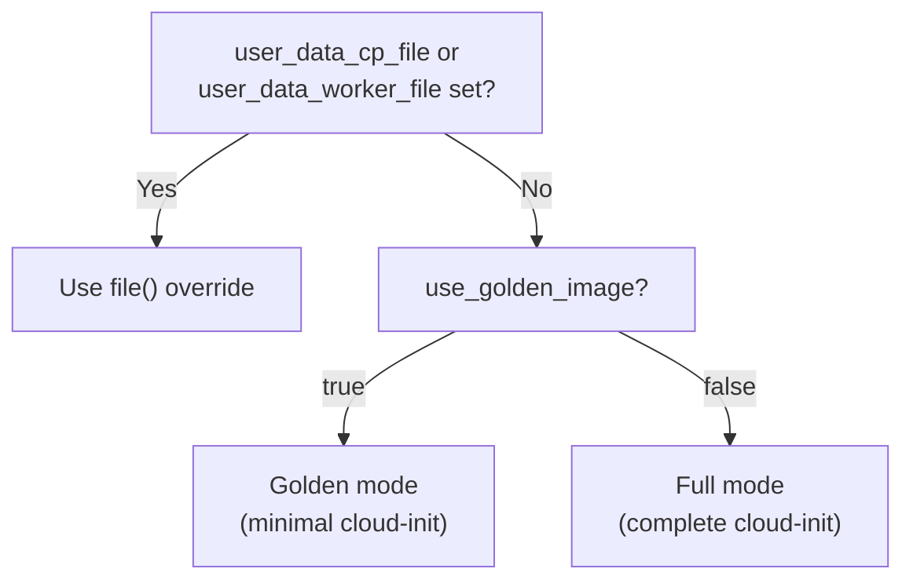

### 5.1 Full Mode -- Control Plane (`_user_data_cp_full`)

This is the default cloud-init for control plane nodes when using vanilla Rocky 9.

**Line-by-line breakdown:**

```yaml
#cloud-config
package_update: true        # Run 'dnf check-update' on first boot
package_upgrade: true       # Run 'dnf upgrade -y' on first boot
```
Updates all packages to latest versions. Essential for vanilla images to get security patches.

```yaml
ssh_authorized_keys:
  - ssh-ed25519 AAAA... user@host
```
Injected via Terraform template: `${join("\n", [for key in var.ssh_authorized_keys : "  - ${key}"])}`. Adds operator SSH keys to the `rocky` user.

```yaml
packages:
  - qemu-guest-agent               # Harvester/KubeVirt guest agent (IP reporting, graceful shutdown)
  - iptables                        # Firewall binary
  - iptables-services               # systemd service for persistent iptables rules
  - container-selinux               # SELinux policies for container runtimes
  - policycoreutils-python-utils    # SELinux management tools (semanage, audit2allow)
  - audit                           # Linux audit framework
```

```yaml
write_files:
  # RKE2 package repositories (3 repos: common, version-specific, EPEL)
  - path: /etc/yum.repos.d/rancher-rke2-common.repo
  - path: /etc/yum.repos.d/rancher-rke2-1-34.repo
  - path: /etc/yum.repos.d/epel.repo
```
Pre-configures yum repos so `rke2-selinux` can be installed in the `runcmd` phase.

**Airgapped mode**: When `var.airgapped = true` and `var.private_rke2_repo_url` /
`var.private_rocky_repo_url` are set, the cloud-init templates switch the yum repo URLs
from the public mirrors to private mirrors (with `gpgcheck=0`). Additionally, if
`var.private_ca_pem` is set, a private CA certificate is written to
`/etc/pki/ca-trust/source/anchors/private-ca.pem` and trusted via `update-ca-trust` in
the `runcmd` phase. This applies to both control plane and worker cloud-init templates.

```yaml
  # Firewall rules -- default DROP policy with allowlist
  - path: /etc/sysconfig/iptables
    permissions: '0600'
```
Writes a complete iptables ruleset. Allowed ports:

| Port | Protocol | Purpose |
|------|----------|---------|
| 22 | TCP | SSH |
| 6443 | TCP | Kubernetes API server |
| 9345 | TCP | RKE2 join/supervisor API |
| 2379-2381 | TCP | etcd client + peer + metrics |
| 10250 | TCP | kubelet API |
| 10257 | TCP | kube-controller-manager metrics |
| 10259 | TCP | kube-scheduler metrics |
| 30000-32767 | TCP+UDP | NodePort range |
| 4240 | TCP | Cilium health check |
| 8472 | UDP | Cilium VXLAN overlay |
| 4244 | TCP | Hubble server |
| 4245 | TCP | Hubble relay |
| 9962 | TCP | Cilium agent metrics |

```yaml
  # Cilium L2 manifests (auto-applied by RKE2 server on first start)
  - path: /var/lib/rancher/rke2/server/manifests/cilium-lb-ippool.yaml
  - path: /var/lib/rancher/rke2/server/manifests/cilium-l2-policy.yaml
```
These manifests are placed in the RKE2 server manifests directory. When the RKE2 server starts, it automatically applies any YAML files found here. The `CiliumLoadBalancerIPPool` defines the IP range for LoadBalancer services, and the `CiliumL2AnnouncementPolicy` controls ARP announcement behavior (workers only, eth1 interface).

```yaml
runcmd:
  - mkdir -p /var/lib/rancher/rke2/server/manifests   # Ensure manifests dir exists
  - systemctl enable --now qemu-guest-agent.service     # Start guest agent immediately
  - systemctl disable --now firewalld || true           # Disable firewalld (replaced by iptables)
  - dnf install -y rke2-selinux                         # Install SELinux policies for RKE2
  - systemctl enable --now iptables                     # Activate iptables rules
```

### 5.2 Full Mode -- Worker (`_user_data_worker_full`)

Workers share the same base as control plane nodes but add dual-NIC networking. The key differences:

**No Cilium manifests** -- Workers do not run the RKE2 server, so the manifests directory is not applicable.

**ARP hardening** (workers only):
```yaml
  - path: /etc/sysctl.d/90-arp.conf
    permissions: '0644'
    content: |
      net.ipv4.conf.all.arp_ignore=1
      net.ipv4.conf.all.arp_announce=2
```
- `arp_ignore=1` -- Only respond to ARP requests if the target IP is on the receiving interface. Prevents eth0 from answering ARP queries for eth1's IP.
- `arp_announce=2` -- Always use the best local address as the source in ARP announcements. Prevents asymmetric routing.

**Policy routing script** (workers only):
```yaml
  - path: /etc/NetworkManager/dispatcher.d/10-ingress-routing
    permissions: '0755'
```
A NetworkManager dispatcher script that fires when eth1 comes up. It creates a separate routing table (`200 ingress`) so that traffic arriving on eth1 always replies via eth1. Without this, the kernel would route reply packets via eth0 (the default route), causing asymmetric routing and dropped connections. See [Section 12](#12-networking-configuration) for full details.

**Additional runcmd steps** (workers only):
```yaml
runcmd:
  # ... shared steps ...
  - sysctl --system                                    # Apply ARP sysctl settings
  - restorecon -R /etc/NetworkManager/dispatcher.d/ || true  # Fix SELinux labels
```

### 5.3 Golden Mode -- Control Plane (`_user_data_cp_golden`)

Minimal cloud-init for pre-baked images that already have all packages and configuration:

```yaml
#cloud-config

ssh_authorized_keys:
  - ssh-ed25519 AAAA... user@host

write_files:
  - path: /var/lib/rancher/rke2/server/manifests/cilium-lb-ippool.yaml
  - path: /var/lib/rancher/rke2/server/manifests/cilium-l2-policy.yaml
```

Only SSH keys and Cilium manifests are injected. Everything else (packages, repos, firewall rules, SELinux) is assumed to be already in the golden image.

### 5.4 Golden Mode -- Worker (`_user_data_worker_golden`)

The most minimal template:

```yaml
#cloud-config

ssh_authorized_keys:
  - ssh-ed25519 AAAA... user@host
```

Only SSH keys. ARP hardening and policy routing are baked into the golden image.

---

## 6. EFI Boot Patching

### The Problem

The `rancher2` Terraform provider does not expose an `enableEfi` field in its `harvester_config` block. Without EFI, VMs boot with legacy BIOS firmware, which is incompatible with certain Rocky 9 images (especially golden images built with EFI partitions).

### The Solution

Four `null_resource` blocks use `local-exec` provisioners to PATCH the HarvesterConfig CRDs directly via the Rancher Kubernetes API after Terraform creates the machine configs.

```hcl
resource "null_resource" "efi_controlplane" {
  triggers = {
    name = rancher2_machine_config_v2.controlplane.name
  }

  provisioner "local-exec" {
    command = <<-EOT
      curl -sfk -o /dev/null -w 'EFI patch controlplane: HTTP %%{http_code}\n' -X PATCH \
        -H "Authorization: Bearer ${var.rancher_token}" \
        -H "Content-Type: application/merge-patch+json" \
        "${var.rancher_url}/apis/rke-machine-config.cattle.io/v1/namespaces/fleet-default/harvesterconfigs/${rancher2_machine_config_v2.controlplane.name}" \
        -d '{"enableEfi":true}'
    EOT
  }
}
```

### How It Works

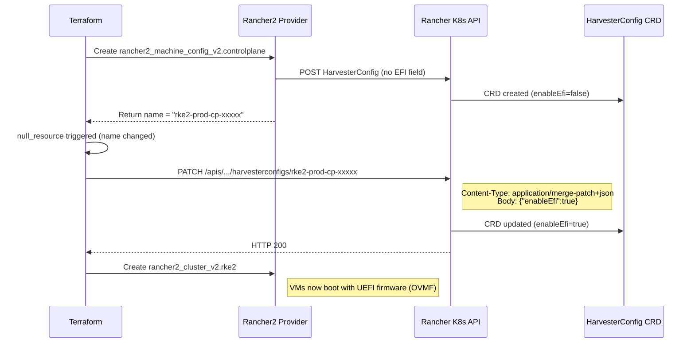

### Key Details

**API path:** `/apis/rke-machine-config.cattle.io/v1/namespaces/fleet-default/harvesterconfigs/{name}`

- Must use `/apis/` (native Kubernetes API), **not** `/v1/` (Rancher convenience API does not support PATCH on these CRDs).
- Namespace is always `fleet-default` (where Rancher stores machine configs).

**Field name:** `enableEfi` (camelCase) -- **not** `enableEFI` (uppercase I). Getting this wrong produces a silent no-op.

**curl flags:**
- `-s` -- silent (no progress bar)
- `-f` -- fail on HTTP errors (non-zero exit code)
- `-k` -- skip TLS verification (matches `insecure = true` on the provider)
- `-o /dev/null` -- discard response body
- `-w 'EFI patch ...: HTTP %%{http_code}\n'` -- print only the HTTP status code for logging

**Triggers:** Each null_resource triggers on the machine config's `name`. Since `generate_name` is used, the name includes a random suffix. The EFI patch re-runs whenever a machine config is recreated (new name = new trigger).

**Ordering:** `cluster.tf` has an explicit `depends_on` on all four EFI null_resources, ensuring patches complete before Rancher starts provisioning VMs.

---

## 7. terraform.sh Wrapper

The `terraform.sh` script wraps all Terraform operations with secrets management, connectivity checks, and post-destroy cleanup. Located at `cluster/terraform.sh`.

### Command Flow Charts

#### `./terraform.sh init`

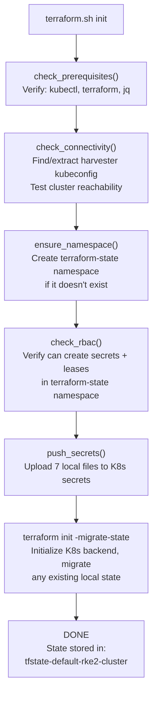

#### `./terraform.sh apply`

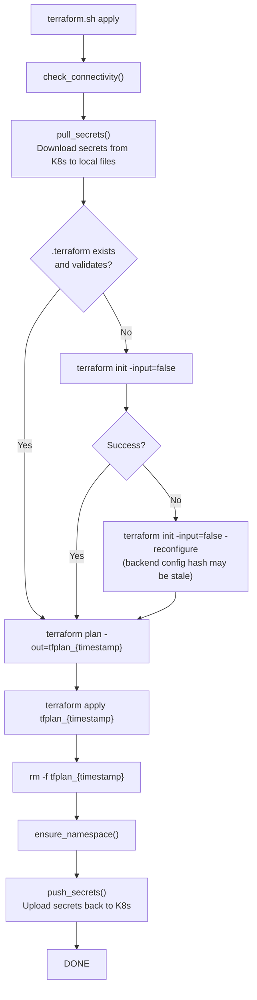

#### `./terraform.sh destroy`

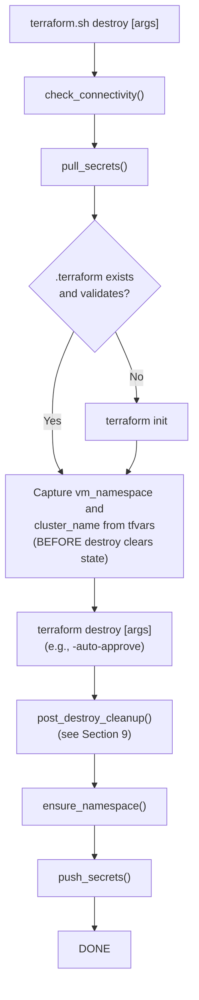

#### `./terraform.sh push-secrets`

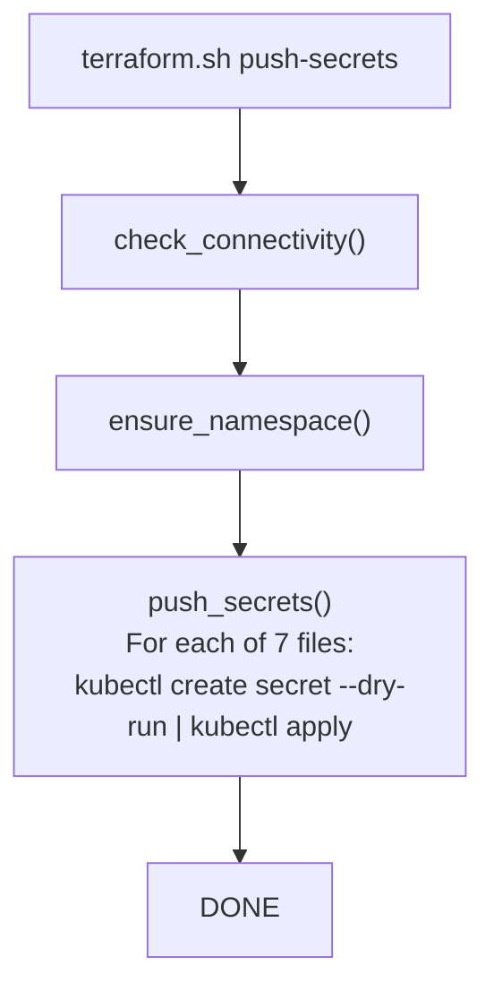

#### `./terraform.sh pull-secrets`

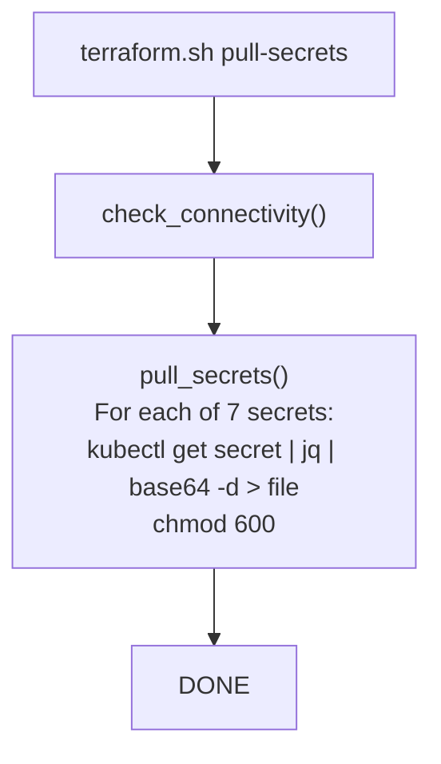

#### `./terraform.sh <any>` (pass-through)

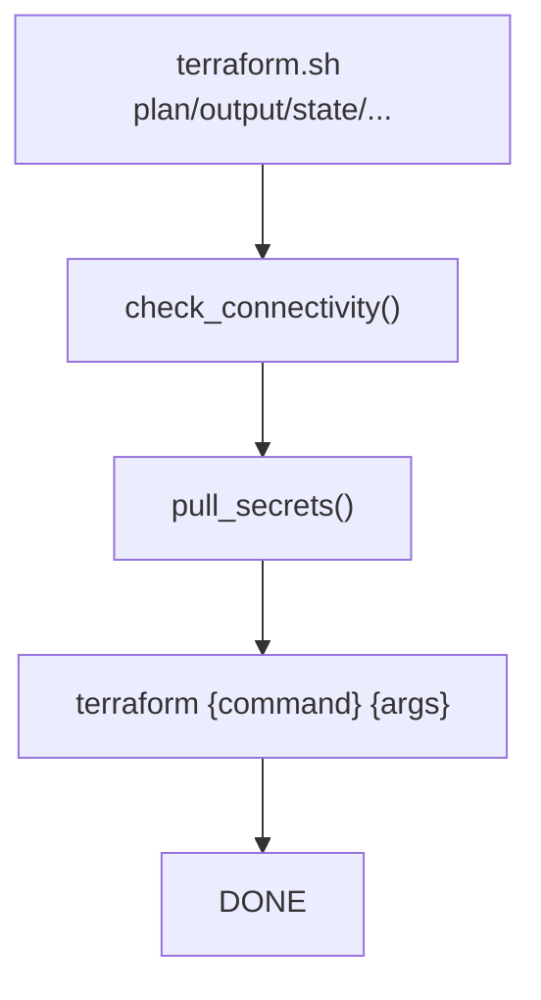

---

## 8. Secrets Management

### The 7-File Bidirectional Sync

The wrapper script maintains bidirectional synchronization between 7 local files and Kubernetes secrets in the `terraform-state` namespace on Harvester.

| # | Local File | K8s Secret Name | Contents |
|---|-----------|-----------------|----------|
| 1 | `terraform.tfvars` | `terraform-tfvars` | All Terraform variable values (including sensitive tokens) |
| 2 | `kubeconfig-harvester.yaml` | `kubeconfig-harvester` | Harvester cluster kubeconfig (for TF backend + provider) |
| 3 | `kubeconfig-harvester-cloud-cred.yaml` | `kubeconfig-harvester-cloud-cred` | Dedicated SA kubeconfig for Rancher cloud credential |
| 4 | `harvester-cloud-provider-kubeconfig` | `harvester-cloud-provider-kubeconfig` | Kubeconfig injected into VMs for in-cluster Harvester cloud provider |
| 5 | `vault-init.json` | `vault-init` | Vault initialization keys and root token |
| 6 | `root-ca.pem` | `root-ca-cert` | Root CA certificate (PEM) |
| 7 | `root-ca-key.pem` | `root-ca-key` | Root CA private key (PEM) |

### Push Operation

```bash
push_secrets() {
  for i in "${!SECRET_FILENAMES[@]}"; do
    local file="${SECRET_FILENAMES[$i]}"
    local secret_name="${SECRET_NAMES[$i]}"
    local filepath="${SCRIPT_DIR}/${file}"
    if [[ -f "$filepath" ]]; then
      $KUBECTL create secret generic "$secret_name" \
        --from-file="${file}=${filepath}" \
        --namespace="$TF_NAMESPACE" \
        --dry-run=client -o yaml | $KUBECTL apply -f -
    fi
  done
}
```

Uses the `create --dry-run=client -o yaml | apply -f -` pattern for idempotent upserts. If the file does not exist locally, it is skipped with a warning.

### Pull Operation

```bash
pull_secrets() {
  for i in "${!SECRET_FILENAMES[@]}"; do
    local file="${SECRET_FILENAMES[$i]}"
    local secret_name="${SECRET_NAMES[$i]}"
    if $KUBECTL get secret "$secret_name" -n "$TF_NAMESPACE" &>/dev/null; then
      $KUBECTL get secret "$secret_name" -n "$TF_NAMESPACE" -o json \
        | jq -r ".data[\"${file}\"]" | base64 -d > "$tmpfile"
      mv "$tmpfile" "$filepath"
      chmod 600 "$filepath"
    fi
  done
}
```

Extracts the base64-encoded data from the secret, decodes it, writes to a temp file, then atomically moves it into place. All files get `chmod 600` for security.

### Sync Flow

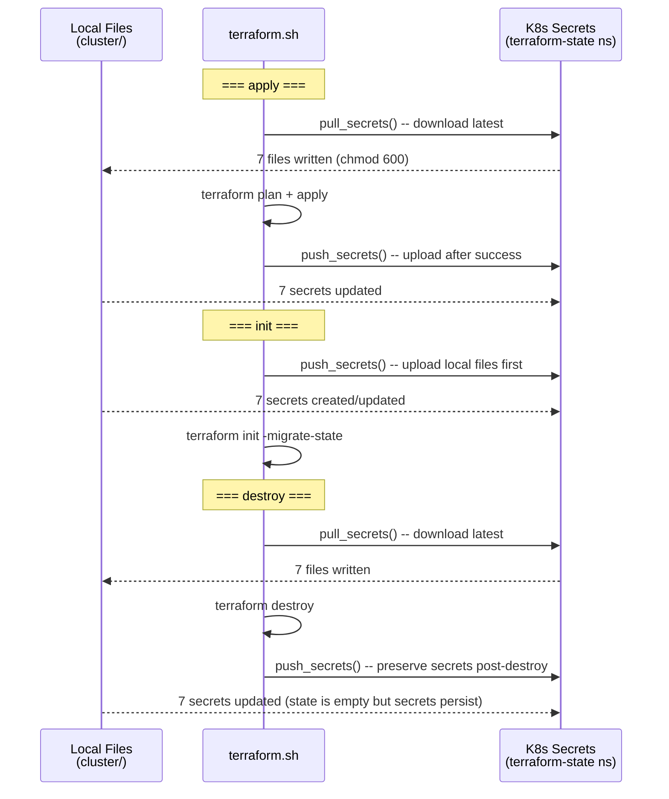

### Why Bidirectional?

- **Pull before operations** ensures a fresh clone or new workstation gets the latest secrets from the cluster without manual file copying.
- **Push after operations** ensures any local changes (e.g., rotated tokens, updated kubeconfigs) are persisted to the cluster.
- **Push after destroy** preserves secrets even after the Terraform state is emptied, so the cluster can be recreated without re-gathering credentials.

---

## 9. Post-Destroy Cleanup

### Why Cleanup Is Needed

When `terraform destroy` runs:

1. Terraform deletes `rancher2_cluster_v2` -- Rancher begins **async** VM teardown via CAPI.
2. Terraform then deletes `rancher2_cloud_credential` -- the Harvester node driver **loses access**.
3. CAPI machines get stuck with finalizers because the driver can no longer communicate with Harvester.
4. VM disks (PVCs and DataVolumes) accumulate on every destroy/recreate cycle.

### Cleanup Flow

```mermaid
flowchart TD
    START["post_destroy_cleanup(vm_namespace, cluster_name)"] --> CHECK_PARAMS{"vm_namespace and<br/>cluster_name set?"}
    CHECK_PARAMS -->|No| SKIP["Skip cleanup (warn)"]
    CHECK_PARAMS -->|Yes| GET_CREDS["Extract rancher_url and<br/>rancher_token from tfvars"]
    GET_CREDS --> HAS_CREDS{"Credentials<br/>available?"}

    HAS_CREDS -->|Yes| PHASE1["PHASE 1: Clear CAPI Finalizers on Rancher"]
    HAS_CREDS -->|No| PHASE3

    subgraph "Phase 1: CAPI Finalizer Cleanup (Rancher API)"
        PHASE1 --> HM["List HarvesterMachines with<br/>deletionTimestamp != null"]
        HM --> HM_PATCH["PATCH each: set finalizers=[]<br/>(merge-patch, NOT GET+PUT)"]
        HM_PATCH --> SLEEP1["sleep 5"]
        SLEEP1 --> CAPI["List CAPI Machines with<br/>deletionTimestamp != null"]
        CAPI --> CAPI_PATCH["PATCH each: set finalizers=[]"]
        CAPI_PATCH --> SLEEP2["sleep 5"]
        SLEEP2 --> CLUSTER_CHECK["Check if cluster has<br/>deletionTimestamp"]
        CLUSTER_CHECK --> CLUSTER_PATCH["PATCH cluster: set finalizers=[]"]
        CLUSTER_PATCH --> SLEEP3["sleep 5"]
    end

    CLUSTER_PATCH --> PHASE2

    subgraph "Phase 2: Wait for VM Deletion"
        PHASE2["Wait loop: 300s timeout, 10s interval"]
        PHASE2 --> VM_COUNT{"Count VMs matching<br/>{cluster_name}-* prefix"}
        VM_COUNT -->|0| VM_DONE["All VMs deleted"]
        VM_COUNT -->|>0| WAIT["sleep 10, elapsed += 10"]
        WAIT --> TIMEOUT{"elapsed >= 300?"}
        TIMEOUT -->|No| VM_COUNT
        TIMEOUT -->|Yes| VM_DONE
    end

    VM_DONE --> PHASE3

    subgraph "Phase 3: Force-Clean Harvester Resources"
        PHASE3["Check for stuck VMs"]
        PHASE3 --> STUCK_VMS{"Stuck VMs?"}
        STUCK_VMS -->|Yes| PATCH_VMS["Patch finalizers=null<br/>on each stuck VM"]
        STUCK_VMS -->|No| CHECK_VMIS

        PATCH_VMS --> CHECK_VMIS["Check for stuck VMIs"]
        CHECK_VMIS --> STUCK_VMIS{"Stuck VMIs?"}
        STUCK_VMIS -->|Yes| PATCH_VMIS["Patch finalizers=null<br/>+ delete each VMI"]
        STUCK_VMIS -->|No| CHECK_DVS

        PATCH_VMIS --> CHECK_DVS["List ALL DataVolumes<br/>in namespace"]
        CHECK_DVS --> HAS_DVS{"DataVolumes?"}
        HAS_DVS -->|Yes| DELETE_DVS["Patch finalizers=null<br/>+ delete each DV"]
        HAS_DVS -->|No| CHECK_PVCS

        DELETE_DVS --> CHECK_PVCS["List ALL PVCs<br/>in namespace"]
        CHECK_PVCS --> HAS_PVCS{"PVCs?"}
        HAS_PVCS -->|Yes| DELETE_PVCS["Patch finalizers=null<br/>+ delete each PVC"]
        HAS_PVCS -->|No| SUMMARY

        DELETE_PVCS --> SUMMARY["Summary: count remaining PVCs"]
    end

    SUMMARY --> DONE["DONE"]
```

### Phase Details

**Phase 1 -- CAPI Finalizer Cleanup:**
The cleanup starts at the Rancher management cluster level. HarvesterMachine finalizers are cleared **first** because they are the root blockers. Then CAPI Machine finalizers (which cascade from HarvesterMachines). Finally, the provisioning cluster finalizer if the cluster object itself is stuck.

> **Important:** The script uses PATCH with `application/merge-patch+json`, **not** GET+jq+PUT. The JSON responses from these CRDs contain binary cloud-init data that breaks jq parsing.

**Phase 2 -- Wait for VM Deletion:**
After clearing finalizers, the script polls Harvester for VMs matching the `{cluster_name}-*` prefix. It waits up to 300 seconds (5 minutes) with 10-second intervals.

**Phase 3 -- Force-Clean Harvester Resources:**
Any remaining stuck resources (VMs, VMIs, DataVolumes, PVCs) have their finalizers nulled and are deleted. **All** DataVolumes and PVCs in the namespace are cleaned because the namespace is dedicated to this cluster.

---

## 10. Golden Image vs Full Mode

### Decision Tree

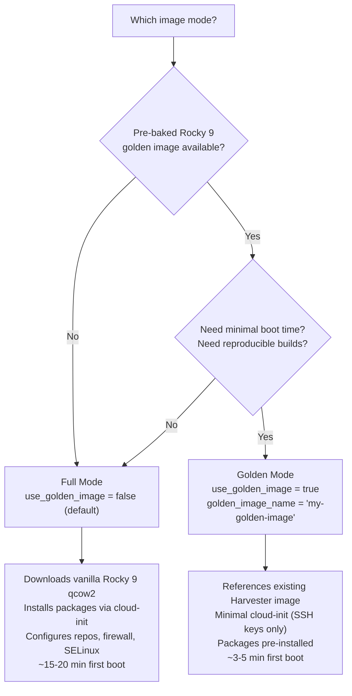

### Comparison Table

| Aspect | Full Mode (default) | Golden Mode |
|--------|-------------------|-------------|
| **Image source** | Downloaded from Rocky Linux mirror | Pre-existing in Harvester |
| **Terraform resource** | `harvester_image.rocky9[0]` (created) | `data.harvester_image.golden[0]` (data source) |
| **Image download** | ~2 GB download on first apply (30m timeout) | No download needed |
| **Cloud-init size** | ~100 lines (packages, repos, firewall, scripts) | ~10-15 lines (SSH keys, Cilium manifests for CP) |
| **First boot time** | 15-20 minutes (package install + upgrade) | 3-5 minutes |
| **Package management** | `dnf install` via cloud-init on every new node | Pre-baked in image |
| **Yum repos** | Written via cloud-init `write_files` | Pre-configured in image |
| **Firewall rules** | Written via cloud-init, activated via `runcmd` | Pre-configured in image |
| **ARP hardening** | Written via cloud-init sysctl config | Pre-configured in image |
| **Policy routing** | NetworkManager dispatcher script via cloud-init | Pre-configured in image |
| **SELinux** | `rke2-selinux` installed via `runcmd` | Pre-installed in image |
| **Reproducibility** | Depends on upstream package versions at boot time | Fully reproducible (pinned image) |
| **Variables required** | `rocky_image_url` (has default) | `golden_image_name` (required, validated by precondition) |
| **Cluster rebuild** | Image re-downloaded (unless cached by Harvester) | Image already present |

### When to Use Each

**Use Full Mode when:**
- Setting up a new cluster for the first time.
- Golden image pipeline is not yet built.
- You want the latest packages from upstream mirrors.
- Boot time is not critical.

**Use Golden Mode when:**
- Running in production with frequent node scaling.
- Need fast boot times for autoscaler responsiveness.
- Need reproducible, auditable node images.
- Operating in air-gapped environments (golden images can be imported offline).

---

## 11. Autoscaler Integration

### How It Works

The Rancher cluster autoscaler uses **annotations on machine pools** to determine scaling boundaries. Terraform manages the annotations (min/max) and machine configuration, while the autoscaler owns the live replica count.

#### Annotation Schema

```
cluster.provisioning.cattle.io/autoscaler-min-size = "2"
cluster.provisioning.cattle.io/autoscaler-max-size = "10"
```

For scale-from-zero pools (where `min_count = 0`), additional resource annotations tell the autoscaler what a new node would provide:

```
cluster.provisioning.cattle.io/autoscaler-resource-cpu     = "8"
cluster.provisioning.cattle.io/autoscaler-resource-memory  = "32Gi"
cluster.provisioning.cattle.io/autoscaler-resource-storage = "80Gi"
```

#### Lifecycle Ignore Changes

```hcl
lifecycle {
  ignore_changes = [
    rke_config[0].machine_pools[1].quantity,  # general
    rke_config[0].machine_pools[2].quantity,  # compute
    rke_config[0].machine_pools[3].quantity,  # database
  ]
}
```

Without `ignore_changes`:
1. Autoscaler scales general pool from 4 to 8 nodes.
2. `terraform plan` detects drift: `quantity: 8 -> 4`.
3. `terraform apply` resets quantity to 4, destroying 4 nodes.

With `ignore_changes`:
1. Autoscaler scales general pool from 4 to 8 nodes.
2. `terraform plan` shows no changes for quantity.
3. Terraform still manages annotations, machine config, and all other attributes.

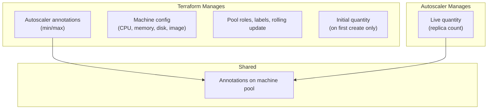

#### Pool Configuration

| Pool | Min | Max | Scale-from-zero | Initial Quantity |
|------|-----|-----|-----------------|------------------|
| `controlplane` | -- (fixed) | -- (fixed) | No | `controlplane_count` (3) |
| `general` | 4 | 10 | No | `general_min_count` (4) |
| `compute` | 0 | 10 | **Yes** | `compute_min_count` (0) |
| `database` | 4 | 10 | No | `database_min_count` (4) |

The control plane pool is **not autoscaled** -- its quantity is directly managed by Terraform (no `ignore_changes`, no autoscaler annotations).

---

## 12. Networking Configuration

### Network Architecture

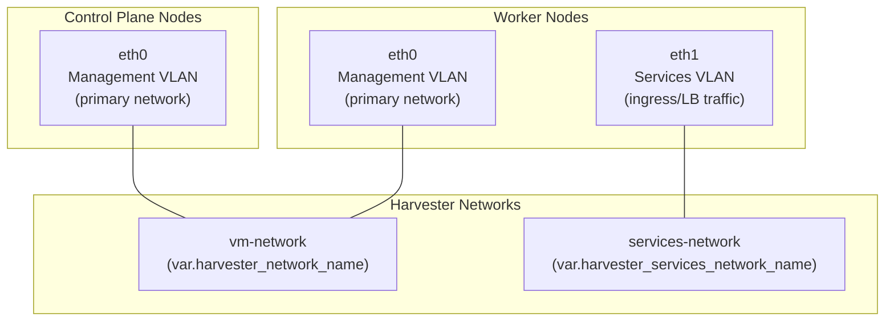

### Dual-NIC Worker Configuration

Workers have two network interfaces:

| Interface | Network | VLAN | Purpose |
|-----------|---------|------|---------|
| `eth0` | Management | Primary | Kubernetes API, node-to-node, pod-to-pod (Cilium overlay) |
| `eth1` | Services | Secondary (VLAN 5) | Ingress traffic, LoadBalancer services, L2 announcements |

Control plane nodes only have `eth0` because they do not serve ingress traffic.

### Policy Routing (Workers)

The `10-ingress-routing` NetworkManager dispatcher script solves the asymmetric routing problem inherent to dual-NIC VMs:

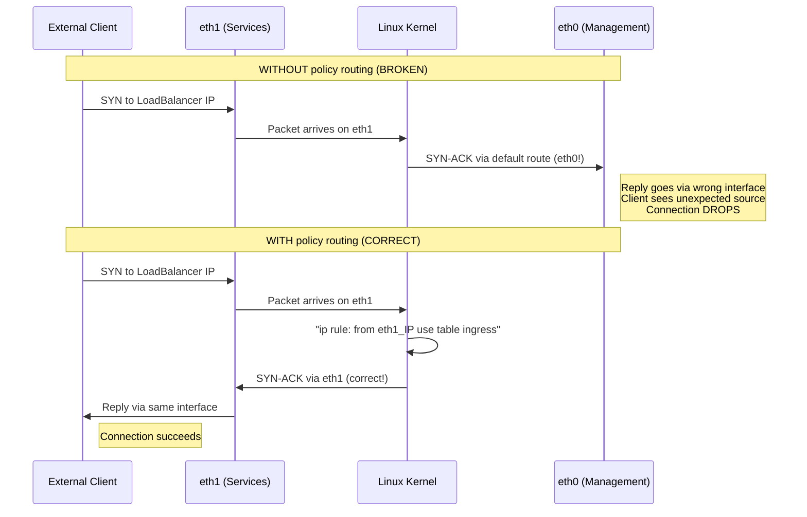

**Script logic:**
1. Fires on `eth1 up` event.
2. Reads eth1's IP, subnet, and gateway.
3. Creates routing table `200 ingress` in `/etc/iproute2/rt_tables`.
4. Adds a policy rule: packets **from** eth1's IP use the `ingress` table.
5. Sets the default route in the `ingress` table to use eth1.
6. Adds the subnet route to the `ingress` table.

### ARP Hardening (Workers)

```
net.ipv4.conf.all.arp_ignore=1
net.ipv4.conf.all.arp_announce=2
```

| Sysctl | Value | Effect |
|--------|-------|--------|
| `arp_ignore` | `1` | Only respond to ARP if the target IP is configured on the receiving interface. Prevents eth0 from responding to ARP queries for eth1's IP. |
| `arp_announce` | `2` | Always use the best local address (matching the subnet) as source in ARP. Prevents broadcasting eth1's IP from eth0. |

Without these settings, Linux would respond to ARP queries for any local IP on any interface, causing network confusion in dual-NIC configurations.

### Cilium L2 Configuration

Two manifests are placed on control plane nodes in `/var/lib/rancher/rke2/server/manifests/`:

**CiliumLoadBalancerIPPool:**
```yaml
apiVersion: "cilium.io/v2alpha1"
kind: CiliumLoadBalancerIPPool
metadata:
  name: ingress-pool
spec:
  blocks:
    - start: "198.51.100.2"
      stop: "198.51.100.20"
```
Defines 19 IPs available for LoadBalancer services. Cilium allocates from this pool.

**CiliumL2AnnouncementPolicy:**
```yaml
apiVersion: "cilium.io/v2alpha1"
kind: CiliumL2AnnouncementPolicy
metadata:
  name: l2-policy
spec:
  serviceSelector:
    matchLabels: {}           # Match ALL services
  nodeSelector:
    matchExpressions:
      - key: node-role.kubernetes.io/control-plane
        operator: DoesNotExist  # Workers only
  interfaces:
    - ^eth1$                  # Announce on services NIC only
  externalIPs: true
  loadBalancerIPs: true
```

This policy tells Cilium to perform L2 (ARP) announcements for LoadBalancer and ExternalIP services, but **only from worker nodes** and **only on eth1**. This ensures ingress traffic arrives on the correct interface.

### Firewall Rules

The iptables ruleset uses a default DROP policy on INPUT with specific port allowlists:

```
*filter
:INPUT DROP [0:0]         # Drop all incoming by default
:FORWARD ACCEPT [0:0]     # Allow forwarded traffic (pod networking)
:OUTPUT ACCEPT [0:0]      # Allow all outgoing
```

Port groups:

| Category | Ports | Purpose |
|----------|-------|---------|
| Infrastructure | 22/tcp | SSH access |
| Kubernetes API | 6443/tcp | API server (external and internal) |
| RKE2 | 9345/tcp | RKE2 supervisor/join API |
| etcd | 2379-2381/tcp | Client, peer communication, metrics |
| kubelet | 10250/tcp | kubelet API (metrics, exec, logs) |
| Controllers | 10257/tcp, 10259/tcp | kube-controller-manager and kube-scheduler metrics |
| NodePort | 30000-32767/tcp+udp | NodePort service range |
| Cilium | 4240/tcp, 8472/udp | Health checks, VXLAN overlay |
| Hubble | 4244-4245/tcp | Hubble server and relay |
| Cilium Metrics | 9962/tcp | Cilium agent Prometheus metrics |

---

## 13. Common Modifications

### Change Node Count

**Control plane** (directly managed by Terraform):
```hcl
# terraform.tfvars
controlplane_count = 5  # Must be odd for etcd quorum
```

**Worker pools** (autoscaler boundaries):
```hcl
# terraform.tfvars
general_min_count = 3    # Autoscaler floor
general_max_count = 15   # Autoscaler ceiling
```

### Change CPU/Memory

```hcl
# terraform.tfvars
compute_cpu    = "16"   # Type is string (Harvester provider requirement)
compute_memory = "64"   # GiB
```

> **Warning:** Changing CPU or memory recreates the machine config, which triggers EFI re-patching and a rolling update of all nodes in the affected pool.

### Change Kubernetes Version

```hcl
# terraform.tfvars
kubernetes_version = "v1.34.3+rke2r1"
```

This triggers a rolling upgrade. The `upgrade_strategy` ensures one node at a time with zero downtime.

### Change the VM Image

**Switch to golden image:**
```hcl
# terraform.tfvars
use_golden_image  = true
golden_image_name = "rocky9-golden-20260201"
```

**Change vanilla image URL:**
```hcl
# terraform.tfvars
rocky_image_url = "https://internal-mirror.example.com/rocky9-latest.qcow2"
```

### Change Network Configuration

```hcl
# terraform.tfvars
harvester_network_name                = "new-vm-network"
harvester_network_namespace           = "my-namespace"
harvester_services_network_name       = "new-services-network"
harvester_services_network_namespace  = "my-namespace"
```

### Change Traefik LoadBalancer IP

```hcl
# terraform.tfvars
traefik_lb_ip = "203.0.113.210"
```

### Override Cloud-Init

For custom cloud-init without modifying the module code:

```hcl
# terraform.tfvars
user_data_cp_file     = "cloud-init-cp.yaml"
user_data_worker_file = "cloud-init-worker.yaml"
```

Copy the example files and customize:
```bash
cp cluster/examples/cloud-init-cp.yaml cluster/cloud-init-cp.yaml
cp cluster/examples/cloud-init-worker.yaml cluster/cloud-init-worker.yaml
# Edit the copies, then set USER_DATA_CP_FILE / USER_DATA_WORKER_FILE in scripts/.env
```

### Add a New Worker Pool

To add a fifth machine pool (e.g., `gpu`):

1. Add variables in `variables.tf`:
   ```hcl
   variable "gpu_cpu"       { type = string; default = "16" }
   variable "gpu_memory"    { type = string; default = "64" }
   variable "gpu_disk_size" { type = number; default = 200 }
   variable "gpu_min_count" { type = number; default = 0 }
   variable "gpu_max_count" { type = number; default = 4 }
   ```

2. Add machine config in `machine_config.tf`:
   ```hcl
   resource "rancher2_machine_config_v2" "gpu" {
     generate_name = "${var.cluster_name}-gpu"
     harvester_config {
       vm_namespace         = var.vm_namespace
       cpu_count            = var.gpu_cpu
       memory_size          = var.gpu_memory
       reserved_memory_size = "-1"
       ssh_user             = var.ssh_user
       user_data            = var.user_data_worker_file != "" ? file(var.user_data_worker_file) : local.user_data_worker
       disk_info = jsonencode({
         disks = [{ imageName = local.image_full_name; size = var.gpu_disk_size; bootOrder = 1 }]
       })
       network_info = local.network_info_worker
     }
   }
   ```

3. Add EFI patch in `efi.tf` (follow the existing pattern).

4. Add machine pool block in `cluster.tf` and update `depends_on`, `lifecycle.ignore_changes`.

5. Add `machine_selector_config` for the new pool's label.

---

## 14. State Management

### Kubernetes Backend

Terraform state is stored as a Kubernetes secret on the Harvester cluster:

```hcl
backend "kubernetes" {
  secret_suffix = "rke2-cluster"
  namespace     = "terraform-state"
  config_path   = "kubeconfig-harvester.yaml"
}
```

| Setting | Value | Result |
|---------|-------|--------|
| `secret_suffix` | `"rke2-cluster"` | State stored in secret `tfstate-default-rke2-cluster` |
| `namespace` | `"terraform-state"` | Dedicated namespace for TF state and secrets |
| `config_path` | `"kubeconfig-harvester.yaml"` | Relative to the `cluster/` working directory |

### State Locking

The Kubernetes backend uses **Lease objects** for state locking. When a Terraform operation starts, it creates/acquires a lease in the `terraform-state` namespace. This prevents concurrent operations from corrupting state.

The `check_rbac()` function in `terraform.sh` verifies the user can both `create secrets` and `create leases` in the namespace.

### State Secret Naming

The Kubernetes backend constructs the secret name as: `tfstate-{workspace}-{suffix}`

- Default workspace: `default`
- Suffix: `rke2-cluster`
- Result: `tfstate-default-rke2-cluster`

### Migration from Local State

The `terraform.sh init` command runs `terraform init -migrate-state`, which automatically migrates any existing local `terraform.tfstate` file to the Kubernetes backend. This is a one-time operation for clusters that started with local state.

### State Backend Initialization Flow

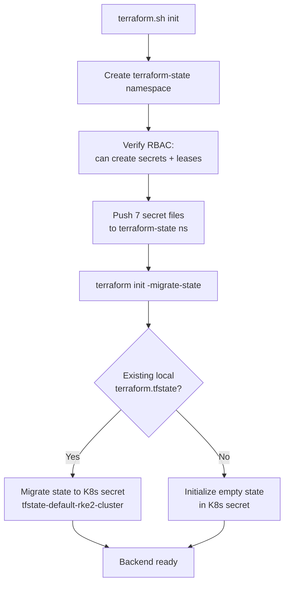

### Recovery Procedures

**Backend config hash mismatch** (common after cloning or config changes):
```bash
# terraform.sh handles this automatically with -reconfigure fallback
terraform init -input=false -reconfigure
```

**State corruption or loss:**
```bash
# Pull secrets first (state is separate from the 7 managed secrets)
./terraform.sh pull-secrets

# Re-import existing resources
terraform import rancher2_cloud_credential.harvester <credential-id>
terraform import rancher2_cluster_v2.rke2 fleet-default/<cluster-name>
# etc.
```

**View current state:**
```bash
./terraform.sh state list
./terraform.sh state show rancher2_cluster_v2.rke2
```

### Security Considerations

- All 7 managed files are set to `chmod 600` after pull.
- The `rancher_token` variable is marked `sensitive = true` in Terraform.
- The `terraform-state` namespace contains both the state secret and the 7 operational secrets -- access to this namespace provides full cluster control.
- The Harvester kubeconfig used for the backend (`kubeconfig-harvester.yaml`) should have minimal permissions: create/read/update secrets and leases in the `terraform-state` namespace only.
