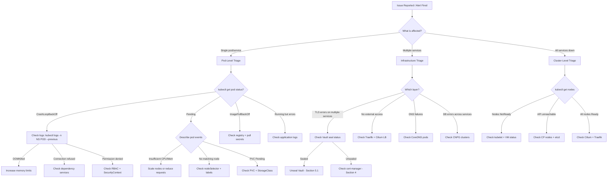
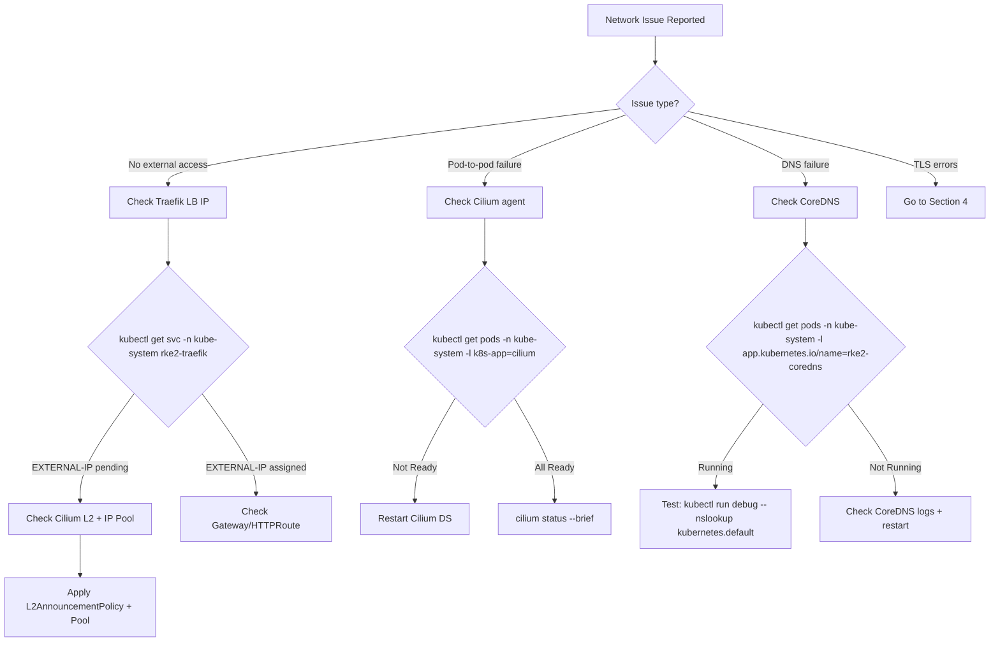
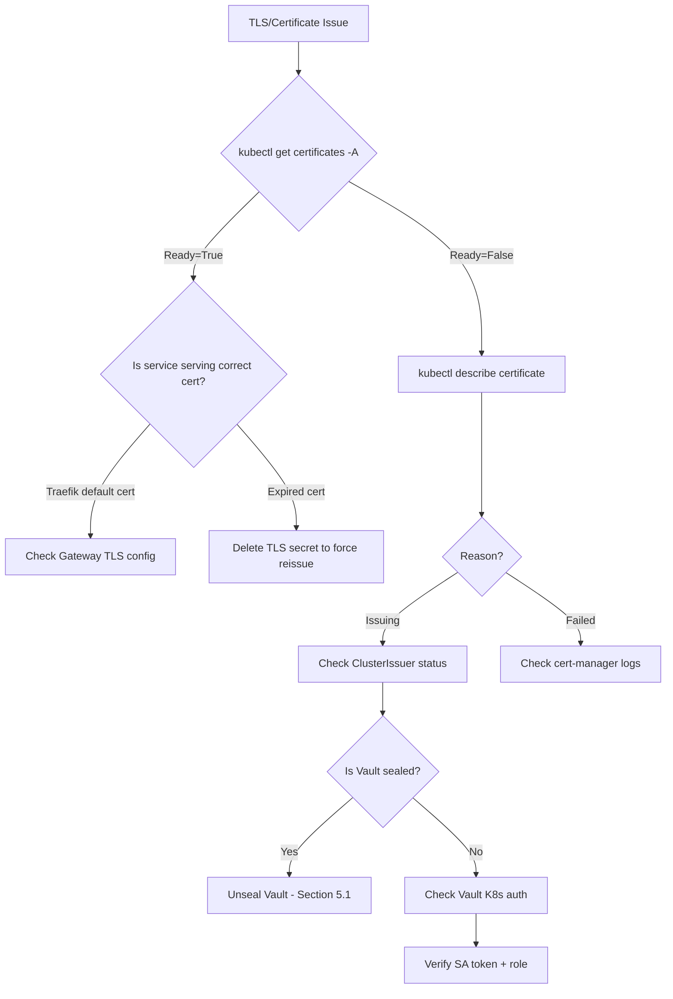
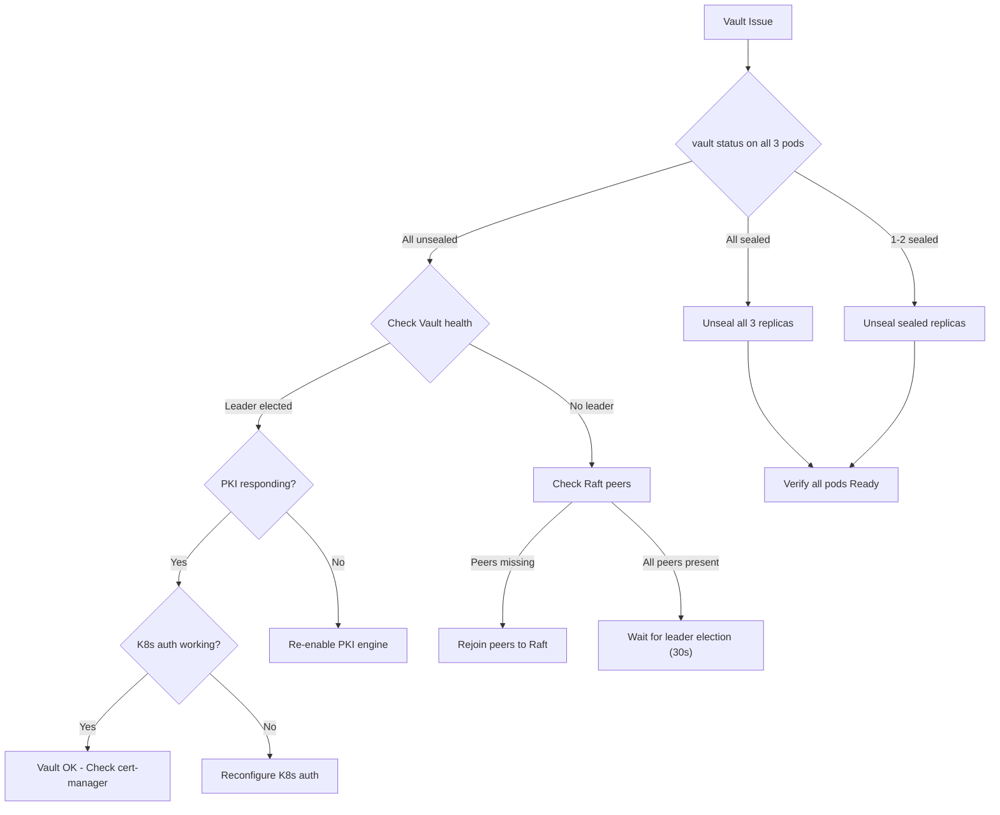
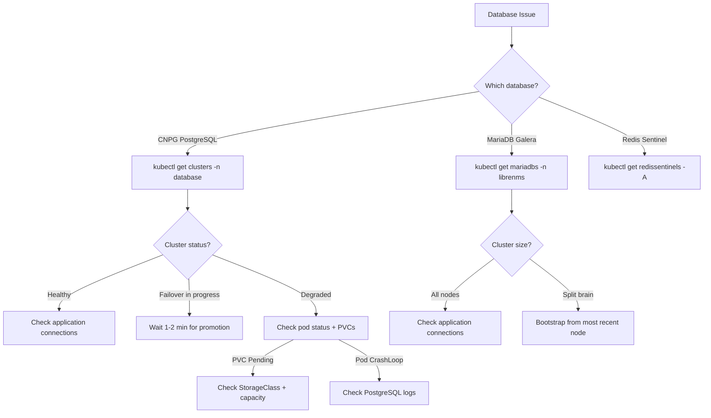
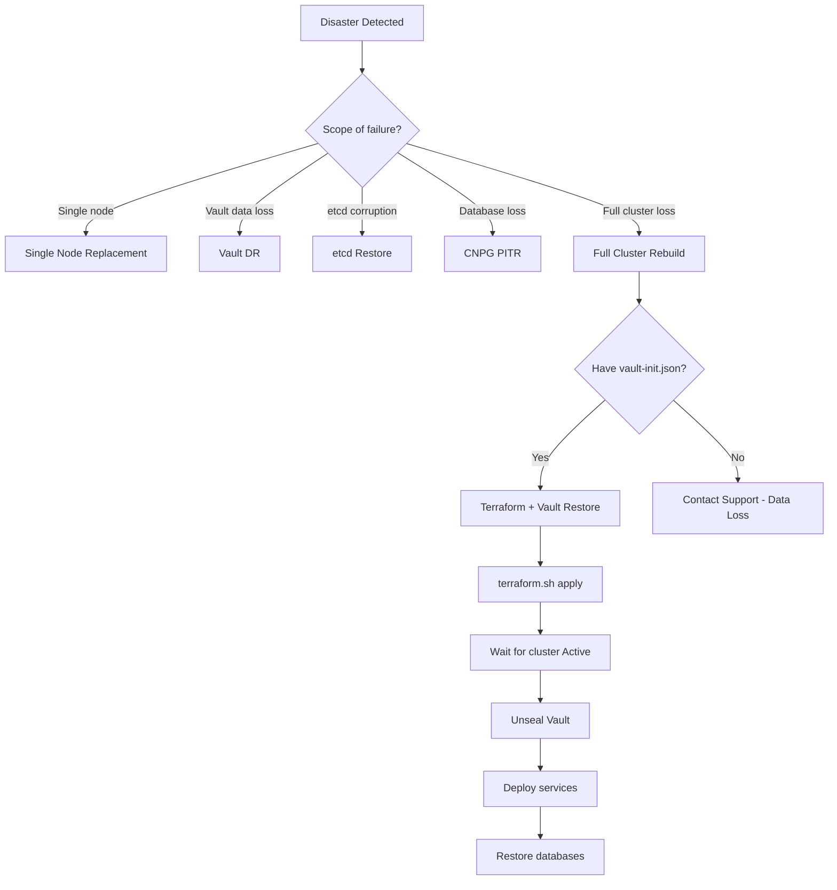

# Troubleshooting SOP Guide

Standard Operating Procedures for diagnosing and resolving issues across the RKE2 cluster platform on Harvester via Rancher.

> **Note**: Throughout this document, `<DOMAIN>` refers to the root domain
> configured in `scripts/.env` (e.g., `example.com`). Derived formats:
> `<DOMAIN_DASHED>` = dots replaced with hyphens (e.g., `example-com`),
> `<DOMAIN_DOT>` = dots replaced with `-dot-` (e.g., `example-dot-com`).

**Audience**: Infrastructure engineers, SREs, on-call operators.

**Severity Levels**:
- **P1 (Critical)**: Service outage affecting all users. Respond within 15 minutes.
- **P2 (Major)**: Partial service degradation. Respond within 1 hour.
- **P3 (Minor)**: Single component degraded, workaround available. Respond within 4 hours.
- **P4 (Low)**: Cosmetic or non-urgent. Respond next business day.

---

## Table of Contents

1. [General Diagnostic Flowchart](#1-general-diagnostic-flowchart)
2. [Cluster-Level Issues](#2-cluster-level-issues)
3. [Networking Issues](#3-networking-issues)
4. [TLS/Certificate Issues](#4-tlscertificate-issues)
5. [Vault Issues](#5-vault-issues)
6. [Database Issues](#6-database-issues)
7. [Service-Specific Issues](#7-service-specific-issues)
8. [Storage Issues](#8-storage-issues)
9. [Deployment Script Issues](#9-deployment-script-issues)
10. [Disaster Recovery Procedures](#10-disaster-recovery-procedures)
11. [Day-2 Operations Procedures](#11-day-2-operations-procedures)
    - [11.1 Daily Health Checks](#111-daily-health-checks)
    - [11.2 Scaling Operations](#112-scaling-operations)
    - [11.3 Node Maintenance](#113-node-maintenance)
    - [11.4 Backup and Restore](#114-backup-and-restore)
    - [11.5 Backup Schedule](#115-backup-schedule)
    - [11.6 Secret Rotation](#116-secret-rotation)
    - [11.7 Certificate Renewal Procedures](#117-certificate-renewal-procedures)
    - [11.8 Service Upgrade Procedures](#118-service-upgrade-procedures)

---

## 1. General Diagnostic Flowchart

Use this master decision tree for initial triage when an alert fires or an issue is reported.



### Quick Diagnostic Commands

Run these first to assess overall cluster health:

```bash
# Node status
kubectl get nodes -o wide

# All non-running pods
kubectl get pods -A --field-selector=status.phase!=Running,status.phase!=Succeeded

# Vault seal status
for i in 0 1 2; do echo "=== vault-$i ==="; kubectl exec -n vault vault-$i -- vault status 2>&1 | grep -E "Sealed|HA Enabled|HA Mode"; done

# Certificate status
kubectl get certificates -A | grep -v "True"

# Recent events (last 30 min)
kubectl get events -A --sort-by=.lastTimestamp | tail -30

# Resource pressure
kubectl top nodes
kubectl top pods -A --sort-by=memory | head -20
```

---

## 2. Cluster-Level Issues

### 2.1 Node Not Joining Cluster

**Severity**: P2

**Symptom**: New node provisioned by Rancher but does not appear in `kubectl get nodes`. Rancher UI shows machine in "Provisioning" state for more than 15 minutes.

**Diagnostic Steps**:
```bash
# Check Rancher machine status
kubectl get machines.cluster.x-k8s.io -A

# Check if VM exists in Harvester
kubectl --kubeconfig=cluster/kubeconfig-harvester.yaml get virtualmachines -n <vm-namespace>

# Check cloud-init logs (SSH into node or via Harvester console)
sudo cat /var/log/cloud-init-output.log
sudo journalctl -u rke2-agent -n 100
```

**Root Cause**: Cloud-init failure, network unreachable from VM to Rancher API, or EFI boot issue preventing the VM from starting.

**Resolution**:
```bash
# 1. Check if the VM booted at all (Harvester UI > VMs > Console)
# 2. If cloud-init failed, check user_data in machine config:
kubectl --kubeconfig=cluster/kubeconfig-harvester.yaml get virtualmachine <vm-name> -n <vm-ns> -o yaml | grep -A 50 userData

# 3. If RKE2 agent cannot reach Rancher:
# SSH to node and check connectivity
curl -sk https://<rancher-url>/healthz

# 4. If stuck, delete the machine and let autoscaler recreate:
kubectl delete machine <machine-name> -n fleet-default
```

**Prevention**: Validate cloud-init templates before deployment. Ensure Harvester network connectivity to Rancher URL.

**Escalation**: If VMs consistently fail to boot after 3 attempts, escalate to infrastructure team to check Harvester node health and storage availability.

---

### 2.2 Node NotReady

**Severity**: P2

**Symptom**: `kubectl get nodes` shows one or more nodes in `NotReady` state.

**Diagnostic Steps**:
```bash
# Check node conditions
kubectl describe node <node-name> | grep -A 20 "Conditions:"

# Check kubelet status (SSH to node)
sudo systemctl status rke2-agent
sudo journalctl -u rke2-agent -n 100

# Check for resource pressure
kubectl describe node <node-name> | grep -E "MemoryPressure|DiskPressure|PIDPressure"

# Check if node is reachable
ping <node-ip>
```

**Root Cause**: Kubelet crashed, disk pressure (>85% full), memory pressure, network partition, or Harvester VM suspended/crashed.

**Resolution**:
```bash
# If disk pressure:
# SSH to node, clean up
sudo crictl rmi --prune
sudo journalctl --vacuum-size=500M

# If kubelet crashed:
sudo systemctl restart rke2-agent

# If VM crashed (check Harvester UI):
# Reboot VM from Harvester UI or API
kubectl --kubeconfig=cluster/kubeconfig-harvester.yaml patch virtualmachine <vm> -n <ns> --type=merge -p '{"spec":{"running":true}}'

# If node is unrecoverable:
kubectl drain <node-name> --ignore-daemonsets --delete-emptydir-data --force
kubectl delete node <node-name>
# Rancher autoscaler will provision a replacement
```

**Prevention**: Monitor disk usage with Prometheus alert `NodeDiskPressure` (fires at 85%). Set up `NodeDiskCritical` alert (fires at 95%).

**Escalation**: If multiple nodes go NotReady simultaneously, this indicates a Harvester-level issue. Escalate to infrastructure team.

---

### 2.3 etcd Cluster Health Degraded

**Severity**: P1

**Symptom**: API server slow or returning errors. etcd alerts firing (`EtcdMemberDown`, `EtcdHighLatency`).

**Diagnostic Steps**:
```bash
# Check etcd member list (from any CP node)
# RKE2 embeds etcd — use the rke2 etcd snapshot commands
kubectl get nodes -l node-role.kubernetes.io/control-plane=true

# Check etcd health from inside a CP node (SSH required)
sudo /var/lib/rancher/rke2/bin/etcdctl \
  --endpoints=https://127.0.0.1:2379 \
  --cacert=/var/lib/rancher/rke2/server/tls/etcd/server-ca.crt \
  --cert=/var/lib/rancher/rke2/server/tls/etcd/server-client.crt \
  --key=/var/lib/rancher/rke2/server/tls/etcd/server-client.key \
  endpoint health --cluster

# Check etcd metrics
curl -s http://<cp-node-ip>:2381/metrics | grep etcd_server_leader_changes_seen_total

# Check snapshot schedule (configured in cluster.tf as every 6h, retain 5)
sudo ls -la /var/lib/rancher/rke2/server/db/snapshots/
```

**Root Cause**: etcd member crashed, disk I/O too slow (WAL fsync > 500ms), or quorum lost (2 of 3 CP nodes down).

**Resolution**:
```bash
# If one member is down, restart it:
sudo systemctl restart rke2-server

# If etcd WAL fsync is slow, check disk I/O:
sudo iostat -x 1 5

# If quorum is lost (2 of 3 CP down), restore from snapshot:
# See Section 10.3 - etcd Restore from Snapshot
```

**Prevention**: etcd snapshots run every 6 hours (configured in `cluster/cluster.tf`). Monitor WAL fsync latency with alert `EtcdHighLatency`.

**Escalation**: If etcd quorum is lost and no snapshots are available, escalate immediately to infrastructure lead. This requires a full cluster rebuild.

---

### 2.4 API Server Unreachable

**Severity**: P1

**Symptom**: `kubectl` commands return "connection refused" or timeout. Rancher UI shows cluster as "Unavailable".

**Diagnostic Steps**:
```bash
# Test direct API access (bypass Rancher tunnel)
curl -sk https://<cp-node-ip>:6443/healthz

# Check if Rancher can reach the cluster
# Look at Rancher logs (on Harvester management cluster)
kubectl --kubeconfig=cluster/kubeconfig-harvester.yaml logs -n cattle-system -l app=rancher --tail=50

# Check CP node VM status in Harvester
kubectl --kubeconfig=cluster/kubeconfig-harvester.yaml get virtualmachines -n <vm-ns> | grep controlplane
```

**Root Cause**: All CP nodes down, network partition between Rancher and cluster, or RKE2 server service crashed on all CP nodes.

**Resolution**:
```bash
# 1. Verify CP VMs are running in Harvester
# 2. If VMs are running but API is down, SSH to a CP node:
sudo systemctl status rke2-server
sudo journalctl -u rke2-server -n 200

# 3. Restart RKE2 server if needed:
sudo systemctl restart rke2-server

# 4. If Rancher tunnel is broken but direct access works:
# Generate kubeconfig directly from node
sudo cat /etc/rancher/rke2/rke2.yaml
# Update server URL and use this temporarily
```

**Prevention**: 3 CP nodes provide quorum tolerance for 1 node failure. Upgrade strategy uses `control_plane_concurrency: 1` to avoid simultaneous CP restarts.

**Escalation**: If all 3 CP nodes are unreachable and VMs are down in Harvester, escalate to infrastructure team for Harvester host diagnostics.

---

### 2.5 Cluster Autoscaler Not Scaling

**Severity**: P3

**Symptom**: Pods stuck in Pending state due to insufficient resources, but no new nodes are being provisioned.

**Diagnostic Steps**:
```bash
# Check autoscaler logs
kubectl -n kube-system logs -l app.kubernetes.io/name=rancher-cluster-autoscaler --tail=100

# Check autoscaler status
kubectl -n kube-system get configmap cluster-autoscaler-status -o yaml

# Check machine pool annotations
kubectl get clusters.provisioning.cattle.io -n fleet-default -o yaml | grep -A 5 autoscaler

# Check pending pods
kubectl get pods -A --field-selector=status.phase=Pending
kubectl describe pod <pending-pod> -n <ns> | grep -A 10 "Events:"
```

**Root Cause**: Autoscaler cloud-config secret has wrong Rancher token, Rancher CA certificate not trusted, machine pool min/max annotations missing, or Harvester lacks capacity to provision new VMs.

**Resolution**:
```bash
# 1. Verify cloud-config secret
kubectl -n kube-system get secret cluster-autoscaler-cloud-config -o yaml

# 2. Check if Rancher token is still valid
kubectl -n kube-system get secret cluster-autoscaler-cloud-config -o jsonpath='{.data.cloud-config}' | base64 -d

# 3. Verify machine pool annotations in cluster.tf
# general pool: autoscaler-min-size / autoscaler-max-size
# compute pool: includes resource-cpu/memory/storage for scale-from-zero

# 4. Force a scale-up by restarting the autoscaler
kubectl -n kube-system rollout restart deployment -l app.kubernetes.io/name=rancher-cluster-autoscaler
```

**Prevention**: Ensure Rancher API tokens have long expiry. Monitor autoscaler logs for errors via Prometheus.

**Escalation**: If Harvester reports no capacity for new VMs, escalate to infrastructure team for host resource planning.

---

### 2.6 Node Labels Missing (node-labeler Issue)

**Severity**: P3

**Symptom**: Pods with `nodeSelector: workload-type: general` (or `compute`/`database`) stuck in Pending. New autoscaler-created nodes lack the `workload-type` label.

**Diagnostic Steps**:
```bash
# Check node labels
kubectl get nodes --show-labels | grep workload-type

# Check node-labeler operator
kubectl -n node-labeler get pods
kubectl -n node-labeler logs deployment/node-labeler --tail=50

# Check if node-labeler image is available in Harbor
kubectl -n node-labeler describe pod -l app=node-labeler | grep -A 5 "Image:"
```

**Root Cause**: The node-labeler operator is not running (image not pushed to Harbor yet on first deploy), or the `machine_selector_config` in `cluster.tf` has a race condition where the `rke.cattle.io/rke-machine-pool-name` label is not set early enough.

**Resolution**:
```bash
# Manual fix (immediate):
# Label nodes based on hostname pattern
for node in $(kubectl get nodes --no-headers -o custom-columns=NAME:.metadata.name); do
  case "$node" in
    *-general-*)  kubectl label node "$node" workload-type=general --overwrite ;;
    *-compute-*)  kubectl label node "$node" workload-type=compute --overwrite ;;
    *-database-*) kubectl label node "$node" workload-type=database --overwrite ;;
  esac
done

# Or use the lib.sh function:
# source scripts/lib.sh && label_unlabeled_nodes

# Long-term fix: ensure node-labeler image is in Harbor
# Push operator images: see deploy-cluster.sh Phase 4.10
```

**Prevention**: The node-labeler operator watches for new nodes and applies labels automatically. Ensure it is running after initial deployment.

**Escalation**: Not required. Manual labeling is a reliable workaround.

---

### 2.7 EFI Boot Failures

**Severity**: P2

**Symptom**: VM stuck at UEFI shell or "No bootable device" screen in Harvester console.

**Diagnostic Steps**:
```bash
# Check if EFI patches were applied
kubectl --kubeconfig=cluster/kubeconfig-harvester.yaml get virtualmachines -n <vm-ns> -o yaml | grep -i efi

# Check VM firmware settings
kubectl --kubeconfig=cluster/kubeconfig-harvester.yaml get virtualmachines -n <vm-ns> <vm-name> -o jsonpath='{.spec.template.spec.firmware}'
```

**Root Cause**: EFI boot requires firmware type set to `efi` on the VM and the golden image must have GRUB installed for EFI. The `cluster/efi.tf` applies EFI patches before cluster provisioning via `null_resource.efi_*`.

**Resolution**:
```bash
# 1. Verify efi.tf null_resources ran
cd cluster && terraform state list | grep efi

# 2. If EFI patches did not apply, re-run:
cd cluster && ./terraform.sh apply

# 3. If golden image lacks EFI support:
# Rebuild golden image with GRUB EFI bootloader installed
# See docs/golden-image-plan.md
```

**Prevention**: Always use golden images with EFI support. The `depends_on` block in `cluster.tf` ensures EFI patches complete before VM provisioning.

**Escalation**: If the golden image consistently fails EFI boot, escalate to the image build team.

---

### 2.8 Cloud-Init Failures

**Severity**: P2

**Symptom**: Node joins cluster but services fail. SSH to node shows cloud-init scripts did not complete.

**Diagnostic Steps**:
```bash
# SSH to node and check cloud-init
sudo cat /var/log/cloud-init-output.log
sudo cloud-init status --long

# Check if runcmd completed
sudo cat /var/log/cloud-init.log | grep -i "error\|fail"
```

**Root Cause**: Cloud-init user_data malformed, Terraform `indent()` function producing bad YAML (see troubleshooting.md), or network not available during runcmd phase.

**Resolution**:
```bash
# 1. Check the rendered cloud-init in Harvester VM spec
kubectl --kubeconfig=cluster/kubeconfig-harvester.yaml get virtualmachine <vm> -n <ns> -o yaml | grep -A 200 userData | head -200

# 2. Validate YAML syntax
echo "<cloud-init-content>" | python3 -c "import yaml,sys; yaml.safe_load(sys.stdin.read())"

# 3. If fixable, update cloud-init in cluster.tf and run terraform apply
# Rancher will do a rolling update to apply new cloud-init
```

**Prevention**: Test cloud-init templates with `cloud-init devel schema --config-file user-data.yaml`. Remember that Terraform `indent()` only indents lines 2+.

**Escalation**: If cloud-init failures are caused by Harvester networking issues, escalate to infrastructure team.

---

### 2.9 Golden Image Issues

**Severity**: P2

**Symptom**: VMs boot but RKE2 agent fails to start. Errors about missing kernel modules (virtio), wrong GRUB configuration, or missing packages.

**Diagnostic Steps**:
```bash
# SSH to node
lsmod | grep virtio
cat /etc/default/grub
rpm -qa | grep rke2

# Check if golden image was built correctly
sudo cat /etc/os-release
```

**Root Cause**: Golden image missing virtio drivers, GRUB contaminated with Harvester-specific entries, or timeout too short for initial boot.

**Resolution**:
```bash
# 1. Rebuild golden image with correct configuration
# See docs/golden-image-plan.md for full procedure

# 2. Quick fix: install missing packages via cloud-init runcmd
# Add to user_data in cluster.tf:
# runcmd:
#   - dnf install -y <missing-package>
```

**Prevention**: Validate golden images before deployment. Ensure virtio drivers are included and GRUB is clean.

**Escalation**: Escalate to image build team for golden image rebuilds.

---

## 3. Networking Issues

### Networking Diagnostic Flowchart



### 3.1 Cilium Pod Not Ready

**Severity**: P1

**Symptom**: Cilium agent pods in `Init` or `CrashLoopBackOff` state. Pod networking broken across the cluster.

**Diagnostic Steps**:
```bash
# Check Cilium pods
kubectl get pods -n kube-system -l k8s-app=cilium

# Check Cilium agent logs
kubectl -n kube-system logs -l k8s-app=cilium --tail=50

# Check Cilium operator
kubectl -n kube-system logs -l name=cilium-operator --tail=50

# Check Cilium status (if any pod is running)
kubectl exec -n kube-system -l k8s-app=cilium -- cilium status --brief
```

**Root Cause**: Cilium configuration mismatch (kubeProxyReplacement mode requires specific settings), BPF filesystem not mounted, or CNI conflict.

**Resolution**:
```bash
# 1. Check Cilium configuration in cluster.tf chart_values
# Key settings: kubeProxyReplacement=true, k8sServiceHost=127.0.0.1, k8sServicePort=6443

# 2. Restart Cilium DaemonSet
kubectl -n kube-system rollout restart daemonset cilium

# 3. If BPF issue, check mount on node (SSH):
mount | grep bpf
# Should show: bpf on /sys/fs/bpf type bpf

# 4. Nuclear option: delete all Cilium pods (they will recreate)
kubectl -n kube-system delete pods -l k8s-app=cilium
```

**Prevention**: Do not modify Cilium configuration without testing. The `chart_values` in `cluster.tf` are the source of truth.

**Escalation**: If Cilium consistently fails after restart, escalate to networking team. Collect `cilium sysdump` first.

---

### 3.2 L2 Announcement Not Working (No ARP Responses)

**Severity**: P1

**Symptom**: LoadBalancer services have EXTERNAL-IP assigned but are unreachable from outside the cluster. No ARP responses for the LB IP.

**Diagnostic Steps**:
```bash
# Check if L2 announcements are enabled in Cilium config
kubectl get configmap -n kube-system cilium-config -o yaml | grep l2

# Check for L2AnnouncementPolicy
kubectl get CiliumL2AnnouncementPolicy -A 2>/dev/null || echo "No L2 policies found"

# Check for CiliumLoadBalancerIPPool
kubectl get CiliumLoadBalancerIPPool -A 2>/dev/null || echo "No IP pools found"

# Check Traefik service
kubectl get svc -n kube-system rke2-traefik -o wide
```

**Root Cause**: Cilium L2 announcements are enabled in `cluster.tf` chart_values (`l2announcements.enabled=true`), but the `CiliumL2AnnouncementPolicy` and `CiliumLoadBalancerIPPool` CRDs must be created separately.

**Resolution**:
```bash
# 1. Create L2 announcement policy
kubectl apply -f - <<EOF
apiVersion: cilium.io/v2alpha1
kind: CiliumL2AnnouncementPolicy
metadata:
  name: default-l2-policy
spec:
  interfaces:
    - ^eth[0-9]+
  externalIPs: true
  loadBalancerIPs: true
EOF

# 2. Create IP pool (adjust CIDR to match your LB range)
kubectl apply -f - <<EOF
apiVersion: cilium.io/v2alpha1
kind: CiliumLoadBalancerIPPool
metadata:
  name: default-pool
spec:
  blocks:
    - cidr: "203.0.113.200/29"
EOF

# 3. Verify ARP responses
arping -I <interface> <traefik-lb-ip>
```

**Prevention**: Include L2 policy and IP pool manifests in the deployment pipeline. Verify after cluster creation.

**Escalation**: If ARP responses are seen but traffic is not forwarded, escalate to networking team to check VLAN and switch configuration.

---

### 3.3 LoadBalancer IP Not Assigned

**Severity**: P2

**Symptom**: `kubectl get svc -n kube-system rke2-traefik` shows `EXTERNAL-IP` as `<pending>`.

**Diagnostic Steps**:
```bash
# Check service spec
kubectl get svc -n kube-system rke2-traefik -o yaml | grep -A 10 "spec:"

# Check Cilium operator logs for IP allocation
kubectl -n kube-system logs -l name=cilium-operator --tail=50 | grep -i "loadbalancer\|ip"

# Check if IP pool has available IPs
kubectl get CiliumLoadBalancerIPPool -o yaml
```

**Root Cause**: No `CiliumLoadBalancerIPPool` defined, pool exhausted, or `service.spec.loadBalancerIP` conflicts with pool range.

**Resolution**:
```bash
# 1. Verify loadBalancerIP in Traefik service matches pool range
kubectl get svc -n kube-system rke2-traefik -o jsonpath='{.spec.loadBalancerIP}'

# 2. If pool is exhausted, expand it:
kubectl edit CiliumLoadBalancerIPPool default-pool
# Add additional CIDR blocks

# 3. If service type is wrong:
# Check HelmChartConfig for rke2-traefik
kubectl get helmchartconfig -n kube-system rke2-traefik -o yaml
```

**Prevention**: Plan IP pool size to accommodate all LoadBalancer services. Currently only Traefik uses a LoadBalancer IP.

**Escalation**: Not typically required. This is a configuration issue.

---

### 3.4 Traefik Not Routing Traffic

**Severity**: P1

**Symptom**: HTTPS requests to service FQDNs return 404, 502, or connection timeout.

**Diagnostic Steps**:
```bash
# Check Traefik pods
kubectl get pods -n kube-system -l app.kubernetes.io/name=rke2-traefik

# Check Traefik logs for routing errors
kubectl -n kube-system logs -l app.kubernetes.io/name=rke2-traefik --tail=50

# Check all Gateways
kubectl get gateways -A

# Check all HTTPRoutes
kubectl get httproutes -A

# Check all IngressRoutes (Kasm uses IngressRoute)
kubectl get ingressroutes -A

# Test from inside cluster
kubectl run -it --rm debug --image=curlimages/curl --restart=Never -- \
  curl -sk --resolve "<service>.<DOMAIN>:443:<traefik-lb-ip>" https://<service>.<DOMAIN>/
```

**Root Cause**: Gateway not accepted (wrong listener port), HTTPRoute not attached to Gateway, backend service port name mismatch, or TLS secret missing.

**Resolution**:
```bash
# 1. Check Gateway listener ports (must use entrypoint ports 8000/8443, not 80/443)
kubectl get gateway -n <ns> -o yaml | grep -A 5 "listeners:"

# 2. Check HTTPRoute parent reference
kubectl get httproute -n <ns> -o yaml | grep -A 5 "parentRefs:"

# 3. Check backend service port naming (must be "http" not "https" for --insecure backends)
kubectl get svc <backend-svc> -n <ns> -o yaml | grep -A 5 "ports:"

# 4. Restart Traefik if configuration is correct but routes are stale
kubectl -n kube-system rollout restart deployment rke2-traefik
```

**Prevention**: Always use entrypoint ports (8000/8443) in Gateway listeners. Name backend ports "http" when TLS is terminated at Traefik.

**Escalation**: If Traefik consistently fails to pick up route changes, check for Traefik version issues and escalate to platform team.

---

### 3.5 Gateway API Certificate Not Provisioning

**Severity**: P2

**Symptom**: Gateway deployed but no TLS secret is created. HTTPS returns Traefik default certificate.

**Diagnostic Steps**:
```bash
# Check if cert-manager Gateway API support is enabled
kubectl get deployment -n cert-manager cert-manager -o yaml | grep -i gateway

# Check Gateway for cert-manager annotations
kubectl get gateway -n <ns> <gateway-name> -o yaml | grep -A 5 "annotations:"

# Check cert-manager logs for Gateway processing
kubectl -n cert-manager logs deployment/cert-manager --tail=100 | grep -i "gateway"

# Check if Certificate resource was auto-created
kubectl get certificates -n <ns>
```

**Root Cause**: cert-manager Gateway API feature gate not enabled, Gateway missing `cert-manager.io/cluster-issuer` annotation, or listener `tls.mode` not set to `Terminate`.

**Resolution**:
```bash
# 1. Verify cert-manager installed with Gateway API support
# deploy-cluster.sh installs with: --set config.enableGatewayAPI=true

# 2. Ensure Gateway has correct annotations:
# metadata.annotations:
#   cert-manager.io/cluster-issuer: vault-issuer

# 3. Ensure listener has TLS terminate mode:
# listeners:
#   - name: https
#     port: 8443
#     protocol: HTTPS
#     tls:
#       mode: Terminate
#       certificateRefs:
#         - name: <secret-name>

# 4. If Certificate exists but is not Ready, see Section 4
```

**Prevention**: Use the existing Gateway manifests as templates. All follow the same pattern with `vault-issuer` annotations.

**Escalation**: Not required. This is a configuration issue.

---

### 3.6 DNS Resolution Failures

**Severity**: P1

**Symptom**: Pods cannot resolve internal service names. `nslookup kubernetes.default` fails from within pods.

**Diagnostic Steps**:
```bash
# Check CoreDNS pods
kubectl get pods -n kube-system -l app.kubernetes.io/name=rke2-coredns

# Check CoreDNS logs
kubectl -n kube-system logs -l app.kubernetes.io/name=rke2-coredns --tail=50

# Check DNS service
kubectl get svc -n kube-system kube-dns

# Test DNS from a debug pod
kubectl run -it --rm debug --image=alpine --restart=Never -- nslookup kubernetes.default.svc.cluster.local

# Check /etc/resolv.conf in a pod
kubectl exec -n <ns> <pod> -- cat /etc/resolv.conf
```

**Root Cause**: CoreDNS pods crashed, kube-dns service ClusterIP changed, or Cilium CNI not providing DNS correctly.

**Resolution**:
```bash
# 1. Restart CoreDNS
kubectl -n kube-system rollout restart deployment rke2-coredns-rke2-coredns

# 2. Scale up CoreDNS if under load
kubectl -n kube-system scale deployment rke2-coredns-rke2-coredns --replicas=3

# 3. If Cilium is causing DNS issues, check Cilium DNS proxy:
kubectl exec -n kube-system -l k8s-app=cilium -- cilium status | grep DNS
```

**Prevention**: Monitor CoreDNS with Prometheus scrape job (configured in `prometheus/configmap.yaml` job 7).

**Escalation**: If DNS failures persist after CoreDNS restart, escalate to networking team to investigate Cilium DNS proxy.

---

### 3.7 Dual-NIC Policy Routing Broken

**Severity**: P3

**Symptom**: Traffic arriving on secondary NIC is not routed back through the same interface. Asymmetric routing causes connection resets.

**Diagnostic Steps**:
```bash
# SSH to affected node
ip route show table all
ip rule show
ip addr show
```

**Root Cause**: Cloud-init iptables rules for policy routing did not apply, or rules were flushed after a reboot.

**Resolution**:
```bash
# 1. Check if cloud-init applied iptables/routing rules
sudo iptables -t mangle -L -n
sudo ip rule show

# 2. Re-apply routing rules manually (from cloud-init user_data)
# See cluster/examples/cloud-init-cp.yaml for iptables rules

# 3. Make rules persistent
sudo iptables-save > /etc/sysconfig/iptables
```

**Prevention**: Ensure cloud-init policy routing rules are applied via runcmd and persisted.

**Escalation**: If dual-NIC configuration is needed cluster-wide, escalate to platform team for cloud-init template updates.

---

### 3.8 VXLAN Overlay Issues

**Severity**: P2

**Symptom**: Pod-to-pod communication fails across nodes. Traffic within the same node works fine.

**Diagnostic Steps**:
```bash
# Check Cilium connectivity
kubectl exec -n kube-system -l k8s-app=cilium -- cilium status
kubectl exec -n kube-system -l k8s-app=cilium -- cilium node list

# Run Cilium connectivity test
kubectl create ns cilium-test
kubectl apply -n cilium-test -f https://raw.githubusercontent.com/cilium/cilium/main/examples/kubernetes/connectivity-check/connectivity-check.yaml

# Check tunnel mode
kubectl get configmap -n kube-system cilium-config -o yaml | grep tunnel
```

**Root Cause**: VXLAN port (8472) blocked between nodes, MTU mismatch, or Cilium tunnel configuration issue.

**Resolution**:
```bash
# 1. Verify VXLAN port is open between nodes
# SSH to node A:
nc -zvu <node-B-ip> 8472

# 2. Check MTU on Cilium interfaces
kubectl exec -n kube-system -l k8s-app=cilium -- ip link show cilium_vxlan

# 3. If MTU mismatch, update Cilium config in cluster.tf:
# Under rke2-cilium chart_values, add:
# mtu: 1450
```

**Prevention**: Ensure firewall rules allow UDP 8472 between all cluster nodes.

**Escalation**: If VXLAN issues persist, collect `cilium sysdump` and escalate to networking team.

---

## 4. TLS/Certificate Issues

### TLS Diagnostic Flowchart



### 4.1 Certificate Not Issued

**Severity**: P2

**Symptom**: Certificate resource exists but `Ready` condition is `False`. New services cannot get TLS certificates.

**Diagnostic Steps**:
```bash
# Check certificate status
kubectl get certificates -A -o wide

# Describe the failing certificate
kubectl describe certificate <cert-name> -n <ns>

# Check CertificateRequest
kubectl get certificaterequests -n <ns> --sort-by=.metadata.creationTimestamp | tail -5
kubectl describe certificaterequest <cr-name> -n <ns>

# Check cert-manager logs
kubectl -n cert-manager logs deployment/cert-manager --tail=100 | grep -i "error\|fail"
```

**Root Cause**: Vault is sealed, ClusterIssuer not ready, Vault PKI role does not allow the requested DNS name, or cert-manager ServiceAccount token expired.

**Resolution**:
```bash
# 1. Check Vault seal status
for i in 0 1 2; do kubectl exec -n vault vault-$i -- vault status 2>&1 | grep Sealed; done

# 2. Check ClusterIssuer
kubectl get clusterissuer vault-issuer -o yaml

# 3. Verify Vault PKI role allows the domain
kubectl exec -n vault vault-0 -- env VAULT_ADDR=http://127.0.0.1:8200 VAULT_TOKEN=<root-token> \
  vault read pki_int/roles/<DOMAIN_DOT>

# 4. If SA token expired, recreate:
kubectl -n cert-manager delete secret vault-issuer-token 2>/dev/null
kubectl create token vault-issuer -n cert-manager --duration=8760h

# 5. Force certificate reissue
kubectl delete certificate <cert-name> -n <ns>
kubectl apply -f <certificate-manifest>.yaml
```

**Prevention**: Monitor with Prometheus alert `CertNotReady` (fires after 15 minutes of non-ready state).

**Escalation**: If cert-manager cannot communicate with Vault after unsealing, escalate to platform team.

---

### 4.2 cert-manager ClusterIssuer Not Ready

**Severity**: P1 (blocks all certificate issuance)

**Symptom**: `kubectl get clusterissuer vault-issuer` shows `Ready: False`.

**Diagnostic Steps**:
```bash
# Check ClusterIssuer status
kubectl describe clusterissuer vault-issuer

# Check cert-manager logs for Vault communication
kubectl -n cert-manager logs deployment/cert-manager --tail=100 | grep -i vault

# Verify Vault accessibility from cert-manager namespace
kubectl run -it --rm vault-test -n cert-manager --image=curlimages/curl --restart=Never -- \
  curl -s http://vault.vault.svc.cluster.local:8200/v1/sys/health
```

**Root Cause**: Vault sealed, Kubernetes auth not configured in Vault, ServiceAccount `vault-issuer` missing in cert-manager namespace, or Vault PKI engine not mounted.

**Resolution**:
```bash
# 1. Unseal Vault if sealed (see Section 5.1)

# 2. Verify Kubernetes auth in Vault
kubectl exec -n vault vault-0 -- env VAULT_ADDR=http://127.0.0.1:8200 VAULT_TOKEN=<root-token> \
  vault auth list | grep kubernetes

# 3. Verify cert-manager role
kubectl exec -n vault vault-0 -- env VAULT_ADDR=http://127.0.0.1:8200 VAULT_TOKEN=<root-token> \
  vault read auth/kubernetes/role/cert-manager-issuer

# 4. Check ServiceAccount exists
kubectl get sa vault-issuer -n cert-manager

# 5. If SA missing, recreate RBAC
kubectl apply -f services/cert-manager/rbac.yaml

# 6. Re-apply ClusterIssuer
kubectl apply -f services/cert-manager/cluster-issuer.yaml
```

**Prevention**: ClusterIssuer health is monitored by cert-manager metrics. Add an alert for `certmanager_clusterissuer_ready{status="False"}`.

**Escalation**: If Vault is unsealed and Kubernetes auth is configured but ClusterIssuer remains not ready, escalate to platform team with cert-manager logs.

---

### 4.3 Vault PKI Intermediate CA Expired

**Severity**: P1

**Symptom**: All new certificate requests fail. Existing certificates work until they expire. cert-manager logs show "certificate has expired or is not yet valid".

**Diagnostic Steps**:
```bash
# Check intermediate CA expiry
kubectl exec -n vault vault-0 -- env VAULT_ADDR=http://127.0.0.1:8200 VAULT_TOKEN=<root-token> \
  vault read pki_int/cert/ca_chain

# Decode and check dates
kubectl exec -n vault vault-0 -- env VAULT_ADDR=http://127.0.0.1:8200 VAULT_TOKEN=<root-token> \
  vault read -field=certificate pki_int/cert/ca_chain | openssl x509 -noout -dates
```

**Root Cause**: Intermediate CA (10-year validity) has expired. This should not happen for ~10 years after initial setup, but could occur if Vault was rebuilt with a short-lived intermediate.

**Resolution**:
Follow the Intermediate CA Rotation procedure from [Section 11.7](#117-certificate-renewal-procedures):

```bash
# 1. Ensure Root CA key is available
cd cluster && ./terraform.sh pull-secrets

# 2. Generate new intermediate CSR in Vault
kubectl exec -n vault vault-0 -- env VAULT_ADDR=http://127.0.0.1:8200 VAULT_TOKEN=<root-token> \
  vault write -field=csr pki_int/intermediate/generate/internal \
  common_name="Example Org Intermediate CA" ttl=87600h key_bits=4096 > /tmp/intermediate.csr

# 3. Sign locally with Root CA
openssl x509 -req -in /tmp/intermediate.csr \
  -CA root-ca.pem -CAkey root-ca-key.pem -CAcreateserial \
  -days 3650 -sha256 \
  -extfile <(printf "basicConstraints=critical,CA:true,pathlen:0\nkeyUsage=critical,digitalSignature,keyCertSign,cRLSign\nsubjectKeyIdentifier=hash\nauthorityKeyIdentifier=keyid:always") \
  -out /tmp/intermediate.crt

# 4. Import chain into Vault
cat /tmp/intermediate.crt root-ca.pem > /tmp/intermediate-chain.crt
kubectl cp /tmp/intermediate-chain.crt vault/vault-0:/tmp/intermediate-chain.crt
kubectl exec -n vault vault-0 -- env VAULT_ADDR=http://127.0.0.1:8200 VAULT_TOKEN=<root-token> \
  vault write pki_int/intermediate/set-signed certificate=@/tmp/intermediate-chain.crt

# 5. Delete all TLS secrets to force reissuance
kubectl delete secret -A -l cert-manager.io/certificate-name

# 6. Verify certificates reissue
kubectl get certificates -A -w
```

**Prevention**: Monitor intermediate CA expiry. Set calendar reminder at year 9.

**Escalation**: Requires Root CA key (stored offline on Harvester). If key is unavailable, this is a P1 escalation to infrastructure lead.

---

### 4.4 Root CA Rotation Procedure

**Severity**: P1 (planned maintenance)

**Symptom**: Root CA approaching 15-year expiry, or Root CA compromise requires immediate rotation.

**Resolution**:
```bash
# 1. Generate new Root CA locally
openssl genrsa -out root-ca-key-new.pem 4096
openssl req -x509 -new -nodes -key root-ca-key-new.pem -sha256 -days 5475 \
  -subj "/CN=Example Org Root CA v2" -out root-ca-new.pem

# 2. Sign new Intermediate CA CSR with new Root CA
# (Follow intermediate rotation steps from 4.3 using new root-ca-new.pem)

# 3. Update trust stores
# a. Push new Root CA to Harvester
cp root-ca-new.pem cluster/root-ca.pem
cp root-ca-key-new.pem cluster/root-ca-key.pem
cd cluster && ./terraform.sh push-secrets

# b. Update Rancher registries CA bundle
# Re-run: configure_rancher_registries (from lib.sh)

# c. Update vault-root-ca ConfigMaps in all namespaces
# Re-run: distribute_root_ca (from lib.sh)

# d. Distribute new Root CA to clients (browsers, OS trust stores)

# 4. Delete all TLS secrets
kubectl delete secret -A -l cert-manager.io/certificate-name

# 5. Verify all certificates reissue
kubectl get certificates -A -w
```

**Prevention**: Root CA has 15-year validity. Set calendar reminder at year 14.

**Escalation**: Root CA rotation is a planned operation. Coordinate with all stakeholders before executing.

---

### 4.5 TLS Handshake Failures

**Severity**: P2

**Symptom**: Clients receive "TLS handshake failure" or "unknown certificate authority" errors.

**Diagnostic Steps**:
```bash
# Check which certificate is being served
openssl s_client -connect <service>.<DOMAIN>:443 -servername <service>.<DOMAIN> 2>/dev/null | openssl x509 -noout -issuer -dates

# Check if it is the Traefik default cert (self-signed)
# Issuer will show "CN = TRAEFIK DEFAULT CERT" if Gateway TLS is misconfigured

# Check from inside cluster
kubectl exec -n default curl-check -- curl -sv --resolve "<service>.<DOMAIN>:443:<lb-ip>" https://<service>.<DOMAIN>/ 2>&1 | grep -i "issuer\|subject\|verify"
```

**Root Cause**: Client does not trust the Vault Root CA, service is serving Traefik default cert instead of Vault-issued cert, Gateway TLS configuration is incorrect, or the TLSStore default certificate is not configured.

**Resolution**:
```bash
# If client does not trust Root CA:
# Import Root CA into client trust store
# Extract Root CA:
kubectl get secret vault-init -n terraform-state -o jsonpath='{.data.vault-init\.json}' | base64 -d | jq -r '.root_token' > /dev/null
# Or get from cluster/root-ca.pem or credentials.txt

# If Traefik default cert is served (CN = TRAEFIK DEFAULT CERT):
# Check if the TLSStore default certificate is configured
kubectl get tlsstores.traefik.io -n kube-system
# The TLSStore CRD (services/monitoring-stack/kube-system/traefik-default-tlsstore.yaml)
# sets the Vault-issued wildcard cert as Traefik's default certificate.
# Without it, Traefik falls back to its internal self-signed "TRAEFIK DEFAULT CERT".

# Apply TLSStore if missing:
kubectl apply -f services/monitoring-stack/kube-system/traefik-default-tlsstore.yaml

# Verify TLSStore references the correct secret:
kubectl get tlsstore default -n kube-system -o yaml
# spec.defaultCertificate.secretName should reference the Traefik TLS secret

# Check Gateway TLS secretRef matches the actual TLS secret name
kubectl get gateway -n <ns> -o yaml | grep -A 10 "tls:"
kubectl get secret <tls-secret-name> -n <ns>

# If backend is running --insecure but port is named "https":
# Rename port to "http" in the Service spec (see troubleshooting.md)
```

**Prevention**: Distribute Root CA to all clients during onboarding. The `credentials.txt` file includes the Root CA PEM.

**Escalation**: Not required. This is a client configuration issue.

---

## 5. Vault Issues

### Vault Diagnostic Flowchart



### 5.1 Vault Sealed After Restart

**Severity**: P1

**Symptom**: Vault pods show `0/1 Ready`. cert-manager cannot issue certificates. All services depending on TLS are affected.

**Diagnostic Steps**:
```bash
# Check seal status for all replicas
for i in 0 1 2; do
  echo "=== vault-$i ==="
  kubectl exec -n vault vault-$i -- vault status 2>&1
done
```

**Root Cause**: Vault uses Shamir secret sharing. After any pod restart, the Vault instance starts sealed and requires 3 of 5 unseal keys.

**Resolution**:
```bash
# 1. Get unseal keys from vault-init.json
# Option A: Local file
cat cluster/vault-init.json | jq -r '.unseal_keys_hex[]'

# Option B: From Harvester secret
kubectl get secret vault-init -n terraform-state -o jsonpath='{.data.vault-init\.json}' | base64 -d | jq -r '.unseal_keys_hex[]'

# Option C: Pull from Harvester
cd cluster && ./terraform.sh pull-secrets
cat vault-init.json | jq -r '.unseal_keys_hex[]'

# 2. Unseal all 3 replicas (need 3 of 5 keys)
for i in 0 1 2; do
  echo "Unsealing vault-$i..."
  kubectl exec -n vault vault-$i -- vault operator unseal <KEY_1>
  kubectl exec -n vault vault-$i -- vault operator unseal <KEY_2>
  kubectl exec -n vault vault-$i -- vault operator unseal <KEY_3>
done

# 3. Verify all are unsealed
for i in 0 1 2; do
  kubectl exec -n vault vault-$i -- vault status | grep "Sealed"
done
# Expected: Sealed = false

# 4. Verify cert-manager recovers (within 30 seconds)
sleep 30
kubectl get certificates -A | grep -v "True"
```

**Prevention**: Consider implementing Vault auto-unseal with a transit key or cloud KMS. Current setup uses Shamir keys requiring manual unseal.

**Escalation**: If unseal keys are lost, see Section 5.2. If Vault init JSON is not available anywhere, this is unrecoverable -- full Vault rebuild required (Section 10.4).

---

### 5.2 Vault Unseal Procedure (3-Node HA)

**Severity**: P1

This is the standard unseal procedure used after any Vault pod restart, node reboot, or cluster upgrade.

**Prerequisites**:
- 3 of 5 Shamir unseal keys from `vault-init.json`
- kubectl access to the cluster

**Step-by-Step**:
```bash
# Step 1: Identify sealed replicas
for i in 0 1 2; do
  echo "=== vault-$i ==="
  kubectl exec -n vault vault-$i -- vault status 2>&1 | grep -E "Sealed|Initialized|HA Mode"
done

# Step 2: If any replica shows "Initialized: false", it needs to rejoin Raft
for i in 1 2; do
  INIT=$(kubectl exec -n vault vault-$i -- vault status -format=json 2>/dev/null | jq -r '.initialized // false')
  if [ "$INIT" != "true" ]; then
    echo "Joining vault-$i to Raft cluster..."
    kubectl exec -n vault vault-$i -- env VAULT_ADDR=http://127.0.0.1:8200 \
      vault operator raft join http://vault-0.vault-internal:8200
    sleep 3
  fi
done

# Step 3: Unseal each sealed replica with 3 keys
KEYS=$(cat cluster/vault-init.json | jq -r '(.unseal_keys_hex // .keys)[0:3][]')
for i in 0 1 2; do
  SEALED=$(kubectl exec -n vault vault-$i -- vault status -format=json 2>/dev/null | jq -r '.sealed // true')
  if [ "$SEALED" == "true" ]; then
    echo "Unsealing vault-$i..."
    for key in $KEYS; do
      kubectl exec -n vault vault-$i -- vault operator unseal "$key"
    done
  else
    echo "vault-$i already unsealed"
  fi
done

# Step 4: Verify Raft cluster health
ROOT_TOKEN=$(jq -r '.root_token' cluster/vault-init.json)
kubectl exec -n vault vault-0 -- env VAULT_ADDR=http://127.0.0.1:8200 VAULT_TOKEN=$ROOT_TOKEN \
  vault operator raft list-peers

# Step 5: Verify cert-manager recovery
sleep 30
kubectl get certificates -A -o wide | grep -v "True"
```

**Expected Duration**: 2-3 minutes.

---

### 5.3 Raft Leader Election Issues

**Severity**: P1

**Symptom**: All Vault pods are unsealed but no pod reports as leader. `vault status` shows `HA Mode: standby` on all pods. Prometheus alert `VaultLeaderLost` fires.

**Diagnostic Steps**:
```bash
# Check HA status on each pod
for i in 0 1 2; do
  echo "=== vault-$i ==="
  kubectl exec -n vault vault-$i -- vault status 2>&1 | grep -E "HA Mode|HA Cluster"
done

# Check Raft peer list
kubectl exec -n vault vault-0 -- env VAULT_ADDR=http://127.0.0.1:8200 VAULT_TOKEN=<root-token> \
  vault operator raft list-peers

# Check Vault logs for election activity
kubectl -n vault logs vault-0 -c vault --tail=100 | grep -i "raft\|leader\|election"
```

**Root Cause**: Network partition between Vault pods, or all pods restarted simultaneously and Raft needs time to elect a leader.

**Resolution**:
```bash
# 1. Wait 30 seconds for Raft to auto-elect
sleep 30

# 2. Check leader status again
for i in 0 1 2; do
  kubectl exec -n vault vault-$i -- vault status 2>&1 | grep "HA Mode"
done

# 3. If still no leader, check Raft peers can communicate
kubectl exec -n vault vault-0 -c vault -- sh -c "nc -zv vault-1.vault-internal.vault.svc.cluster.local 8201"
kubectl exec -n vault vault-0 -c vault -- sh -c "nc -zv vault-2.vault-internal.vault.svc.cluster.local 8201"

# 4. Verify headless service DNS resolves
kubectl run -it --rm debug --image=busybox --restart=Never -- nslookup vault-internal.vault.svc.cluster.local

# 5. If peers cannot communicate, check network policies
kubectl get networkpolicy -n vault

# 6. Nuclear option: step down current leader to force re-election
kubectl exec -n vault vault-0 -- env VAULT_ADDR=http://127.0.0.1:8200 VAULT_TOKEN=<root-token> \
  vault operator step-down
```

**Prevention**: Vault pods have `podAntiAffinity: preferred` to spread across nodes. Avoid draining multiple database-pool nodes simultaneously.

**Escalation**: If Raft cannot elect a leader after 5 minutes, collect Vault logs from all 3 pods and escalate to platform team.

---

### 5.4 PKI Engine Not Responding

**Severity**: P1

**Symptom**: cert-manager logs show errors accessing Vault PKI path. `vault read pki_int/cert/ca` fails.

**Diagnostic Steps**:
```bash
# Check if PKI engine is mounted
kubectl exec -n vault vault-0 -- env VAULT_ADDR=http://127.0.0.1:8200 VAULT_TOKEN=<root-token> \
  vault secrets list | grep pki_int

# Try reading the CA
kubectl exec -n vault vault-0 -- env VAULT_ADDR=http://127.0.0.1:8200 VAULT_TOKEN=<root-token> \
  vault read pki_int/cert/ca_chain

# Check signing role
kubectl exec -n vault vault-0 -- env VAULT_ADDR=http://127.0.0.1:8200 VAULT_TOKEN=<root-token> \
  vault read pki_int/roles/<DOMAIN_DOT>
```

**Root Cause**: PKI engine was disabled/deleted, signing role missing, or intermediate CA not imported.

**Resolution**:
```bash
# 1. Re-enable PKI engine if missing
kubectl exec -n vault vault-0 -- env VAULT_ADDR=http://127.0.0.1:8200 VAULT_TOKEN=<root-token> \
  vault secrets enable -path=pki_int pki

# 2. Re-import intermediate CA (requires Root CA key)
# Follow Phase 2 steps from deploy-cluster.sh (2.5-2.7)

# 3. Recreate signing role
kubectl exec -n vault vault-0 -- env VAULT_ADDR=http://127.0.0.1:8200 VAULT_TOKEN=<root-token> \
  vault write pki_int/roles/<DOMAIN_DOT> \
  allowed_domains=<DOMAIN> allow_subdomains=true max_ttl=720h generate_lease=true require_cn=false
```

**Prevention**: Take Vault Raft snapshots weekly. PKI configuration is preserved in Raft storage.

**Escalation**: If PKI engine data is lost and no Raft snapshot exists, a full PKI rebuild is required. Escalate to platform team.

---

### 5.5 Kubernetes Auth Failed

**Severity**: P2

**Symptom**: cert-manager cannot authenticate to Vault. ClusterIssuer shows "permission denied" or "invalid token" errors.

**Diagnostic Steps**:
```bash
# Check Vault K8s auth config
kubectl exec -n vault vault-0 -- env VAULT_ADDR=http://127.0.0.1:8200 VAULT_TOKEN=<root-token> \
  vault read auth/kubernetes/config

# Check cert-manager role
kubectl exec -n vault vault-0 -- env VAULT_ADDR=http://127.0.0.1:8200 VAULT_TOKEN=<root-token> \
  vault read auth/kubernetes/role/cert-manager-issuer

# Check ServiceAccount exists
kubectl get sa vault-issuer -n cert-manager

# Test auth manually
SA_TOKEN=$(kubectl create token vault-issuer -n cert-manager --duration=1h)
kubectl exec -n vault vault-0 -- env VAULT_ADDR=http://127.0.0.1:8200 \
  vault write auth/kubernetes/login role=cert-manager-issuer jwt="$SA_TOKEN"
```

**Root Cause**: Kubernetes auth configuration in Vault has stale CA certificate or API server URL, ServiceAccount token expired, or role binding mismatch.

**Resolution**:
```bash
# 1. Refresh Kubernetes auth config
K8S_HOST="https://$(kubectl get svc kubernetes -n default -o jsonpath='{.spec.clusterIP}')"
SA_CA=$(kubectl get configmap kube-root-ca.crt -n vault -o jsonpath='{.data.ca\.crt}')

echo "$SA_CA" > /tmp/k8s-ca.crt
kubectl cp /tmp/k8s-ca.crt vault/vault-0:/tmp/k8s-ca.crt

kubectl exec -n vault vault-0 -- env VAULT_ADDR=http://127.0.0.1:8200 VAULT_TOKEN=<root-token> \
  vault write auth/kubernetes/config \
  kubernetes_host="${K8S_HOST}:443" \
  kubernetes_ca_cert=@/tmp/k8s-ca.crt \
  issuer="https://kubernetes.default.svc.cluster.local"

# 2. Recreate cert-manager role
kubectl exec -n vault vault-0 -- env VAULT_ADDR=http://127.0.0.1:8200 VAULT_TOKEN=<root-token> \
  vault write auth/kubernetes/role/cert-manager-issuer \
  bound_service_account_names=vault-issuer \
  bound_service_account_namespaces=cert-manager \
  policies=cert-manager ttl=1h

# 3. Verify ClusterIssuer recovers
kubectl get clusterissuer vault-issuer -o yaml | grep -A 5 "status:"
```

**Prevention**: The SA token created during deployment has a 1-year duration. Set a calendar reminder to refresh it.

**Escalation**: Not required. This is a configuration issue.

---

## 6. Database Issues

### Database Diagnostic Flowchart



### 6.1 CNPG Primary Failover

**Severity**: P2

**Symptom**: Application database connections fail briefly (1-2 minutes). CNPG cluster shows a different primary pod.

**Diagnostic Steps**:
```bash
# Check CNPG cluster status
kubectl get clusters -n database -o wide

# Check which pod is primary
kubectl get pods -n database -l cnpg.io/cluster=<cluster-name> -L role

# Check recent events
kubectl describe cluster <cluster-name> -n database | grep -A 20 "Events:"

# Check CNPG operator logs
kubectl -n cnpg-system logs deployment/cnpg-controller-manager --tail=50
```

**Root Cause**: Primary pod crashed, node was drained, or CNPG detected the primary was unhealthy and triggered automatic failover.

**Resolution**:
```bash
# 1. Failover is automatic - verify new primary is serving
kubectl get cluster <cluster-name> -n database -o jsonpath='{.status.currentPrimary}'

# 2. Check application connectivity
kubectl exec -n database <cluster-name>-1 -- psql -U postgres -c "SELECT pg_is_in_recovery();"
# Returns 'f' for primary, 't' for replica

# 3. If applications are still failing, restart them to refresh connections
kubectl rollout restart deployment -n <app-ns> <app-name>

# 4. Check old primary pod
kubectl logs -n database <old-primary-pod> --tail=50
```

**Prevention**: CNPG handles failover automatically. Monitor with Prometheus alert `PostgreSQLDown`. Applications should use the `-rw` service endpoint for writes and `-ro` for reads.

**Escalation**: If CNPG cannot promote a replica (all replicas down), escalate to DBA for manual recovery.

---

### 6.2 CNPG Replica Lag

**Severity**: P3

**Symptom**: Prometheus alert `ReplicationLag` fires. Read-heavy applications may serve stale data.

**Diagnostic Steps**:
```bash
# Check replication lag
kubectl exec -n database <cluster-name>-1 -- psql -U postgres -c \
  "SELECT client_addr, state, sent_lsn, write_lsn, flush_lsn, replay_lsn FROM pg_stat_replication;"

# Check Prometheus metric
# cnpg_pg_replication_lag > 30 (seconds)

# Check replica pod resource usage
kubectl top pod -n database -l cnpg.io/cluster=<cluster-name>
```

**Root Cause**: Replica under heavy load, slow disk I/O, network latency, or large transactions on primary.

**Resolution**:
```bash
# 1. Check if replica is catching up
kubectl exec -n database <replica-pod> -- psql -U postgres -c \
  "SELECT pg_last_wal_receive_lsn(), pg_last_wal_replay_lsn(), pg_last_xact_replay_timestamp();"

# 2. If lag is growing, check disk I/O on replica node
kubectl describe pod <replica-pod> -n database | grep "Node:"
# SSH to node and run: iostat -x 1 5

# 3. If disk is slow, check PVC capacity
kubectl get pvc -n database -l cnpg.io/cluster=<cluster-name>

# 4. Scale up replica resources if needed (edit CNPG Cluster spec)
kubectl edit cluster <cluster-name> -n database
# Increase resources.requests.cpu and resources.requests.memory
```

**Prevention**: Monitor replication lag with Prometheus. Ensure database nodes have sufficient disk IOPS.

**Escalation**: If replication lag exceeds 5 minutes consistently, escalate to DBA for query optimization.

---

### 6.3 CNPG Backup Failure

**Severity**: P3

**Symptom**: Scheduled backup CronJob fails. No recent base backups in MinIO.

**Diagnostic Steps**:
```bash
# Check scheduled backups
kubectl get scheduledbackups -n database

# Check recent backup jobs
kubectl get jobs -n database --sort-by=.metadata.creationTimestamp | tail -5

# Check backup pod logs
kubectl logs -n database -l cnpg.io/jobRole=backup --tail=50

# Check MinIO connectivity
kubectl exec -n database <cluster-name>-1 -- pg_basebackup --help 2>&1 | head -5
```

**Root Cause**: MinIO unreachable, MinIO bucket does not exist, incorrect credentials, or PVC full preventing WAL archival.

**Resolution**:
```bash
# 1. Check MinIO service
kubectl get pods -n minio
kubectl get svc -n minio

# 2. Verify backup credentials
kubectl get secret -n database <cluster-name>-backup-creds -o yaml

# 3. Manual pg_dump as interim backup
kubectl exec -n database <cluster-name>-1 -- pg_dump -U postgres -Fc <dbname> > /tmp/backup.dump

# 4. Trigger a manual backup
kubectl apply -f - <<EOF
apiVersion: postgresql.cnpg.io/v1
kind: Backup
metadata:
  name: manual-backup-$(date +%Y%m%d)
  namespace: database
spec:
  cluster:
    name: <cluster-name>
EOF
```

**Prevention**: Monitor backup CronJob success with Prometheus. Ensure MinIO has sufficient storage.

**Escalation**: If backups have been failing for more than 24 hours, escalate to DBA -- this affects RPO.

---

### 6.4 MariaDB Galera Split-Brain

**Severity**: P1

**Symptom**: LibreNMS MariaDB Galera cluster has multiple nodes claiming to be primary. Data inconsistency across nodes.

**Diagnostic Steps**:
```bash
# Check MariaDB operator status
kubectl get mariadbs -n librenms

# Check Galera cluster size on each node
for pod in $(kubectl get pods -n librenms -l app.kubernetes.io/name=librenms-mariadb -o name); do
  echo "=== $pod ==="
  kubectl exec -n librenms $pod -- mariadb -u root -e "SHOW STATUS LIKE 'wsrep_cluster_size';"
done
```

**Root Cause**: Network partition between Galera nodes caused each partition to form its own cluster.

**Resolution**:
```bash
# 1. Identify the node with the most recent data
for pod in $(kubectl get pods -n librenms -l app.kubernetes.io/name=librenms-mariadb -o name); do
  echo "=== $pod ==="
  kubectl exec -n librenms $pod -- mariadb -u root -e "SHOW STATUS LIKE 'wsrep_last_committed';"
done

# 2. Scale down all MariaDB pods
kubectl scale statefulset -n librenms librenms-mariadb --replicas=0

# 3. Bootstrap from the most recent node
# Edit the StatefulSet to set WSREP_NEW_CLUSTER=1 on the chosen node
# Scale back up to 1, then to full replica count

# 4. Verify cluster consistency
kubectl exec -n librenms librenms-mariadb-0 -- mariadb -u root -e "SHOW STATUS LIKE 'wsrep_%';"
```

**Prevention**: Ensure network connectivity between all Galera nodes. Set `wsrep_provider_options="pc.weight=..."` to favor specific nodes during network splits.

**Escalation**: Galera split-brain can cause data loss. Escalate to DBA immediately if data inconsistency is suspected.

---

### 6.5 Redis Sentinel Failover

**Severity**: P3

**Symptom**: Harbor or LibreNMS experiences brief Redis connection errors. Sentinel promotes a new master.

**Diagnostic Steps**:
```bash
# Check Sentinel status
kubectl exec -n harbor harbor-redis-sentinel-0 -- redis-cli -p 26379 SENTINEL masters

# Check which pod is master
kubectl exec -n harbor harbor-redis-sentinel-0 -- redis-cli -p 26379 SENTINEL get-master-addr-by-name mymaster

# Check replication status
kubectl get pods -n harbor -l app=harbor-redis -o wide
```

**Root Cause**: Redis master pod crashed or became unreachable. Sentinel automatically promotes a replica.

**Resolution**:
```bash
# 1. Failover is automatic -- verify new master
kubectl exec -n harbor harbor-redis-sentinel-0 -- redis-cli -p 26379 SENTINEL masters

# 2. If applications are still failing, check sentinel password config
# Harbor chart v1.18 does NOT support sentinelPassword
# Sentinel must be accessible without auth (see troubleshooting.md)
kubectl exec -n harbor harbor-redis-sentinel-0 -- redis-cli -p 26379 SENTINEL masters
# Should return without auth prompt

# 3. Restart affected application pods if connections are stale
kubectl rollout restart deployment -n harbor harbor-core
```

**Prevention**: Redis Sentinel handles failover automatically. Do not set `kubernetesConfig.redisSecret` on the `RedisSentinel` CRD (it adds `requirepass` which breaks Harbor).

**Escalation**: Not required unless failover loops repeatedly.

---

### 6.6 Connection Pool Exhaustion

**Severity**: P2

**Symptom**: Application logs show "too many connections" or "connection pool exhausted". Prometheus alert `HighConnections` fires.

**Diagnostic Steps**:
```bash
# Check active connections per CNPG cluster
kubectl exec -n database <cluster>-1 -- psql -U postgres -c \
  "SELECT datname, count(*) FROM pg_stat_activity GROUP BY datname ORDER BY count DESC;"

# Check max_connections setting
kubectl exec -n database <cluster>-1 -- psql -U postgres -c "SHOW max_connections;"

# Check Prometheus metric
# cnpg_backends_total / cnpg_pg_settings_setting{name="max_connections"} > 0.8
```

**Root Cause**: Too many application replicas connecting directly (no connection pooler), connection leak in application code, or max_connections set too low.

**Resolution**:
```bash
# 1. Increase max_connections (edit CNPG Cluster spec)
kubectl edit cluster <cluster-name> -n database
# Add under spec.postgresql.parameters:
#   max_connections: "200"

# 2. Enable CNPG PgBouncer pooler
kubectl apply -f - <<EOF
apiVersion: postgresql.cnpg.io/v1
kind: Pooler
metadata:
  name: <cluster-name>-pooler
  namespace: database
spec:
  cluster:
    name: <cluster-name>
  instances: 3
  type: rw
  pgbouncer:
    poolMode: transaction
    parameters:
      max_client_conn: "1000"
      default_pool_size: "25"
EOF

# 3. Point applications to pooler service instead of direct -rw service
```

**Prevention**: Use PgBouncer pooler for all production databases. Monitor connection counts with Prometheus.

**Escalation**: If connection exhaustion is caused by a connection leak, escalate to the application development team.

---

## 7. Service-Specific Issues

### 7.1 Harbor

#### Image Push/Pull Failures

**Severity**: P2

**Symptom**: `docker push` or `docker pull` fails with timeout, connection reset, or authentication errors.

**Diagnostic Steps**:
```bash
# Check Harbor core pod
kubectl get pods -n harbor -l component=core
kubectl -n harbor logs -l component=core --tail=50

# Check Harbor registry pod
kubectl get pods -n harbor -l component=registry
kubectl -n harbor logs -l component=registry --tail=50

# Test Harbor API
curl -sk https://harbor.<DOMAIN>/api/v2.0/systeminfo

# Check Traefik timeouts (large images need 1800s)
kubectl get helmchartconfig -n kube-system rke2-traefik -o yaml | grep -i timeout
```

**Root Cause**: Traefik timeout too low for large images (>400MB), Harbor core/registry pod crash, MinIO backend unavailable, or TLS certificate issue.

**Resolution**:
```bash
# 1. If timeout error on large push:
# Apply Traefik timeout HelmChartConfig (1800s)
kubectl apply -f services/harbor/traefik-timeout-helmchartconfig.yaml

# 2. If auth error:
docker logout harbor.<DOMAIN>
docker login harbor.<DOMAIN>

# 3. If MinIO error:
kubectl get pods -n minio
kubectl -n minio logs deployment/minio --tail=30

# 4. If registry pod is crashlooping:
kubectl -n harbor logs -l component=registry --previous --tail=50
kubectl -n harbor delete pod -l component=registry
```

**Prevention**: Traefik timeout is set to 1800s in `services/harbor/traefik-timeout-helmchartconfig.yaml`. Do not use buffering or retry middleware on Harbor routes.

**Escalation**: If Harbor data is corrupted, escalate to platform team for database and MinIO recovery.

#### Proxy Cache Not Working

**Severity**: P3

**Symptom**: Pulling images through Harbor proxy cache (e.g., `harbor.<DOMAIN>/dockerhub/library/nginx:latest`) returns 404 or timeout.

**Diagnostic Steps**:
```bash
# Check proxy cache projects
curl -sk -u admin:<pass> https://harbor.<DOMAIN>/api/v2.0/projects | jq '.[].name'

# Check registry endpoints
curl -sk -u admin:<pass> https://harbor.<DOMAIN>/api/v2.0/registries | jq '.[] | {name, url, status}'

# Check Harbor core logs for proxy errors
kubectl -n harbor logs -l component=core --tail=100 | grep -i proxy
```

**Root Cause**: Proxy cache project not created, upstream registry endpoint unreachable, or Harbor cannot resolve DNS for upstream registries.

**Resolution**:
```bash
# 1. Recreate proxy cache projects
# Run the configure_harbor_projects function from lib.sh
# Or manually create via Harbor API (see deploy-cluster.sh Phase 4.7)

# 2. Test upstream connectivity from Harbor pod
kubectl exec -n harbor -l component=core -- curl -s https://registry-1.docker.io/v2/ -o /dev/null -w '%{http_code}'

# 3. If in airgapped mode, check UPSTREAM_PROXY_REGISTRY setting
grep AIRGAPPED scripts/.env
grep UPSTREAM_PROXY_REGISTRY scripts/.env
```

**Prevention**: Proxy cache projects are created during Phase 4 of deployment. Verify after each deployment.

**Escalation**: Not required.

#### Registry Sync Issues

**Severity**: P3

**Symptom**: Images pulled via proxy cache are stale or do not match upstream.

**Resolution**:
```bash
# Clear proxy cache for a specific project
curl -sk -u admin:<pass> -X DELETE https://harbor.<DOMAIN>/api/v2.0/projects/<project>/repositories/<repo>/artifacts/<tag>

# Force re-pull on next request
docker pull harbor.<DOMAIN>/<project>/<image>:<tag>
```

---

### 7.2 Keycloak

#### OIDC Authentication Failures

**Severity**: P2

**Symptom**: Users cannot log in via Keycloak SSO. Applications redirect to Keycloak but authentication fails.

**Diagnostic Steps**:
```bash
# Check Keycloak pods
kubectl get pods -n keycloak
kubectl -n keycloak logs deployment/keycloak --tail=100

# Check Keycloak readiness
curl -sk https://keycloak.<DOMAIN>/realms/master/.well-known/openid-configuration | jq .issuer

# Check database connectivity
kubectl exec -n database keycloak-pg-1 -- psql -U keycloak -d keycloak -c "SELECT 1;"
```

**Root Cause**: Keycloak pod crashed, database connection lost, realm configuration changed, or OIDC client secret mismatch.

**Resolution**:
```bash
# 1. Restart Keycloak if needed
kubectl rollout restart deployment -n keycloak keycloak

# 2. Verify OIDC client configuration
# Use kcadm.sh from inside the pod
POD=$(kubectl get pods -n keycloak -l app=keycloak -o name | head -1)
kubectl exec -n keycloak $POD -- /opt/keycloak/bin/kcadm.sh config credentials \
  --server http://localhost:8080 --realm master --client admin-cli --secret <bootstrap-secret>

kubectl exec -n keycloak $POD -- /opt/keycloak/bin/kcadm.sh get clients -r master | jq '.[].clientId'

# 3. Verify client secrets match application configuration
kubectl exec -n keycloak $POD -- /opt/keycloak/bin/kcadm.sh get clients -r master \
  -q clientId=<client-id> | jq '.[0].secret'
```

**Prevention**: Use `setup-keycloak.sh` to configure OIDC clients consistently. Store client secrets in `scripts/oidc-client-secrets.json`.

**Escalation**: If Keycloak database is corrupted, escalate to DBA for CNPG recovery.

#### Infinispan Cache Issues

**Severity**: P3

**Symptom**: Keycloak session inconsistency across replicas. Users logged in on one replica are not recognized by another.

**Diagnostic Steps**:
```bash
# Check Keycloak cluster formation
kubectl -n keycloak logs deployment/keycloak | grep -i "infinispan\|cluster\|jgroups" | tail -20

# Check pod count
kubectl get pods -n keycloak -l app=keycloak
```

**Root Cause**: JGroups cluster discovery failing (DNS-based discovery requires headless service), or pods started before DNS was ready.

**Resolution**:
```bash
# 1. Restart Keycloak pods to force cluster re-formation
kubectl rollout restart deployment -n keycloak keycloak

# 2. Verify cluster formation (look for "Received new cluster view" in logs)
kubectl -n keycloak logs deployment/keycloak | grep "cluster view" | tail -5
```

**Prevention**: Keycloak is configured with `cache-ispn.xml` for Infinispan clustering. Ensure the headless service exists for JGroups discovery.

**Escalation**: Not required.

---

### 7.3 ArgoCD

#### Sync Failures

**Severity**: P3

**Symptom**: ArgoCD Application shows `OutOfSync` or `SyncFailed` status.

**Diagnostic Steps**:
```bash
# Check application status
kubectl get applications -n argocd

# Describe the failing application
kubectl describe application <app-name> -n argocd | grep -A 20 "Status:"

# Check sync result
kubectl get application <app-name> -n argocd -o jsonpath='{.status.sync.status}'

# Check ArgoCD controller logs
kubectl -n argocd logs deployment/argocd-application-controller --tail=100
```

**Root Cause**: Git repository unreachable, manifest validation error, resource conflict (already exists), or RBAC insufficient.

**Resolution**:
```bash
# 1. Manual sync with debug output
argocd app sync <app-name> --loglevel debug

# 2. If resource conflict, check for orphaned resources
kubectl get <resource> -n <ns> -o yaml | grep -A 3 "ownerReferences"

# 3. If Git repo unreachable:
kubectl -n argocd get secrets -l argocd.argoproj.io/secret-type=repository
argocd repo list

# 4. Force sync (use with caution)
argocd app sync <app-name> --force
```

**Prevention**: Use `app-of-apps` pattern to manage all applications. Enable auto-sync with `selfHeal: true` for non-critical applications.

**Escalation**: Not required unless it is a persistent Git connectivity issue.

#### App Stuck in Progressing

**Severity**: P3

**Symptom**: ArgoCD Application shows `Progressing` status indefinitely.

**Diagnostic Steps**:
```bash
# Check which resources are not healthy
argocd app get <app-name> --show-operation

# Check resource health
kubectl get application <app-name> -n argocd -o jsonpath='{.status.resources[?(@.health.status!="Healthy")]}'
```

**Root Cause**: A resource (Deployment, StatefulSet) is not reaching healthy state. Often caused by pods stuck in Pending or CrashLoopBackOff.

**Resolution**:
```bash
# 1. Identify the unhealthy resource from argocd app get output
# 2. Troubleshoot that specific resource (see relevant section)
# 3. Once resource is healthy, ArgoCD will automatically detect it
```

---

### 7.4 Monitoring

#### Prometheus OOM

**Severity**: P2

**Symptom**: Prometheus pod restarted with `OOMKilled` reason. Metrics gap in Grafana dashboards.

**Diagnostic Steps**:
```bash
# Check pod events
kubectl describe pod -n monitoring -l app=prometheus | grep -A 5 "Last State:"

# Check memory usage
kubectl top pod -n monitoring -l app=prometheus

# Check TSDB size
kubectl exec -n monitoring -l app=prometheus -- du -sh /prometheus/
```

**Root Cause**: Too many active time series, scrape interval too frequent, or retention period too long for available memory.

**Resolution**:
```bash
# 1. Increase memory limit in Prometheus StatefulSet
kubectl edit statefulset -n monitoring prometheus
# Increase resources.limits.memory to 4Gi or 8Gi

# 2. If TSDB is too large, reduce retention
# Edit prometheus.yml configmap or deployment args:
# --storage.tsdb.retention.time=15d (was 30d)

# 3. Drop high-cardinality metrics via relabel_configs
# Add metric_relabel_configs to prometheus.yml to drop noisy series
```

**Prevention**: Monitor Prometheus storage usage with alert `PrometheusStorageAlmostFull`. Configure appropriate resource limits based on cluster size.

**Escalation**: Not required.

#### Grafana Dashboard Not Loading

**Severity**: P3

**Symptom**: Grafana UI shows "No data" or dashboards fail to load.

**Diagnostic Steps**:
```bash
# Check Grafana pod
kubectl get pods -n monitoring -l app.kubernetes.io/name=grafana
kubectl -n monitoring logs deployment/grafana --tail=50

# Check Grafana data source
curl -sk -u admin:<password> https://grafana.<DOMAIN>/api/datasources | jq '.[].name'

# Check Prometheus endpoint from Grafana
kubectl exec -n monitoring deployment/grafana -- curl -s http://prometheus.monitoring.svc:9090/api/v1/query?query=up | head -20
```

**Root Cause**: Prometheus data source misconfigured, Prometheus pod down, or Grafana PVC corrupted.

**Resolution**:
```bash
# 1. Verify data source points to correct Prometheus URL
# http://prometheus.monitoring.svc:9090

# 2. If PVC corrupted, delete and recreate
kubectl -n monitoring delete pvc grafana
kubectl rollout restart deployment -n monitoring grafana
# Dashboards auto-load from ConfigMaps

# 3. If dashboards are missing, re-apply monitoring stack
kubectl apply -k services/monitoring-stack
```

**Prevention**: Dashboards are stored as ConfigMaps in git, not in Grafana PVC. PVC only stores Grafana state (sessions, etc).

**Escalation**: Not required.

#### Loki Ingestion Errors

**Severity**: P3

**Symptom**: Log queries in Grafana return no results. Loki reports ingestion errors.

**Diagnostic Steps**:
```bash
# Check Loki pod
kubectl get pods -n monitoring -l app=loki
kubectl -n monitoring logs -l app=loki --tail=50

# Check Alloy (log collector) pods
kubectl get pods -n monitoring -l app.kubernetes.io/name=alloy
kubectl -n monitoring logs -l app.kubernetes.io/name=alloy --tail=50

# Test Loki API
kubectl exec -n monitoring deployment/grafana -- curl -s http://loki.monitoring.svc:3100/ready
```

**Root Cause**: Loki rate limit exceeded, storage backend full, or Alloy DaemonSet not running on all nodes.

**Resolution**:
```bash
# 1. Restart Loki
kubectl rollout restart statefulset -n monitoring loki

# 2. Check Alloy DaemonSet coverage
kubectl get daemonset -n monitoring alloy
# Should match node count

# 3. If storage full, expand PVC (see Section 8)
```

**Prevention**: Monitor Loki with Prometheus alert `LokiDown`. Monitor Alloy with `AlloyDown`.

**Escalation**: Not required.

#### Alloy Log Collection Gaps

**Severity**: P3

**Symptom**: Logs from specific nodes or pods are missing in Loki/Grafana.

**Diagnostic Steps**:
```bash
# Check Alloy DaemonSet
kubectl get daemonset -n monitoring alloy -o wide

# Check which nodes are missing Alloy pods
kubectl get pods -n monitoring -l app.kubernetes.io/name=alloy -o wide

# Check Alloy logs on affected node
kubectl -n monitoring logs <alloy-pod-on-affected-node> --tail=50
```

**Root Cause**: Alloy pod not scheduled on the node (taint/toleration issue), node disk full preventing log reading, or Alloy configuration missing the log source.

**Resolution**:
```bash
# 1. Ensure Alloy tolerates all taints
kubectl get daemonset -n monitoring alloy -o yaml | grep -A 10 tolerations

# 2. If Alloy is not scraping specific pods, check configuration
kubectl get configmap -n monitoring alloy-config -o yaml

# 3. Restart Alloy on affected node
kubectl -n monitoring delete pod <alloy-pod>
```

**Prevention**: Alloy DaemonSet should have tolerations for all node taints. Verify after cluster upgrades.

**Escalation**: Not required.

---

### 7.5 Mattermost

#### WebSocket Issues

**Severity**: P3

**Symptom**: Mattermost web client shows "Connection Lost" banner. Real-time message delivery fails.

**Diagnostic Steps**:
```bash
# Check Mattermost pod
kubectl get pods -n mattermost -l app=mattermost
kubectl -n mattermost logs deployment/mattermost --tail=50

# Check WebSocket connectivity (from browser dev tools Network tab)
# Look for ws:// or wss:// connections to mattermost.<DOMAIN>

# Check Traefik WebSocket support
kubectl get helmchartconfig -n kube-system rke2-traefik -o yaml
```

**Root Cause**: Traefik WebSocket timeout, Gateway/HTTPRoute not supporting WebSocket upgrades, or Mattermost pod under resource pressure.

**Resolution**:
```bash
# 1. WebSocket should work with default Traefik config (auto-upgrades HTTP connections)
# Verify no middleware is interfering:
kubectl get httproute -n mattermost -o yaml | grep -A 5 middleware

# 2. If behind additional proxy, ensure WebSocket headers are preserved
# Connection: Upgrade
# Upgrade: websocket

# 3. Restart Mattermost
kubectl rollout restart deployment -n mattermost mattermost
```

**Prevention**: Do not add buffering middleware to Mattermost routes.

**Escalation**: Not required.

#### File Upload Failures

**Severity**: P3

**Symptom**: Users cannot upload files in Mattermost. Error "Unable to upload file".

**Diagnostic Steps**:
```bash
# Check MinIO for Mattermost
kubectl get pods -n mattermost -l app=mattermost-minio
kubectl -n mattermost logs deployment/mattermost-minio --tail=30

# Check MinIO bucket
kubectl exec -n mattermost deployment/mattermost-minio -- mc ls local/mattermost/

# Check Mattermost logs
kubectl -n mattermost logs deployment/mattermost --tail=50 | grep -i "upload\|minio\|s3"
```

**Root Cause**: MinIO pod down, bucket does not exist, or MinIO disk full.

**Resolution**:
```bash
# 1. Verify MinIO is running
kubectl get pods -n mattermost -l app=mattermost-minio

# 2. Create bucket if missing
kubectl run mc --rm -i --image=quay.io/minio/mc:latest --restart=Never -- \
  sh -c 'mc alias set local http://mattermost-minio.mattermost.svc.cluster.local:9000 $MINIO_USER $MINIO_PASS && mc mb --ignore-existing local/mattermost'

# 3. Check disk usage
kubectl exec -n mattermost deployment/mattermost-minio -- df -h /data
```

**Prevention**: Monitor MinIO disk usage. Use storage autoscaler for PVC expansion.

**Escalation**: Not required.

---

### 7.6 Kasm

#### Session Launch Failures

**Severity**: P2

**Symptom**: Users click "Launch Session" but the workspace does not start. Error "Failed to provision session".

**Diagnostic Steps**:
```bash
# Check Kasm API pod
kubectl get pods -n kasm -l app.kubernetes.io/name=kasm
kubectl -n kasm logs deployment/kasm-api-deployment --tail=50

# Check Kasm agent pod
kubectl get pods -n kasm -l app.kubernetes.io/component=agent

# Check database connectivity
kubectl exec -n database kasm-pg-1 -- psql -U kasm -d kasm -c "SELECT 1;"
```

**Root Cause**: Kasm agent not running, insufficient compute resources, database schema not initialized (uuid-ossp extension missing), or Docker socket not available.

**Resolution**:
```bash
# 1. Check uuid-ossp extension
kubectl exec -n database kasm-pg-1 -- psql -U postgres -d kasm -c "\dx uuid-ossp"

# 2. If missing, create it
kubectl exec -n database kasm-pg-1 -- psql -U postgres -d kasm -c 'CREATE EXTENSION IF NOT EXISTS "uuid-ossp";'

# 3. Check Kasm agent
kubectl -n kasm logs -l app.kubernetes.io/component=agent --tail=50

# 4. Restart Kasm stack
kubectl rollout restart deployment -n kasm -l app.kubernetes.io/instance=kasm
```

**Prevention**: The `uuid-ossp` extension is created during Phase 7 of deployment. Verify after database rebuilds.

**Escalation**: If session provisioning consistently fails, escalate to Kasm vendor support.

#### IngressRoute Issues

**Severity**: P3

**Symptom**: Kasm web UI unreachable. Kasm uses IngressRoute (exception to Gateway API pattern).

**Diagnostic Steps**:
```bash
# Kasm uses IngressRoute, not Gateway API
kubectl get ingressroute -n kasm

# Check TLS certificate
kubectl get certificate -n kasm
kubectl get secret -n kasm kasm-<DOMAIN_DASHED>-tls

# Check Traefik is picking up the IngressRoute
kubectl -n kube-system logs -l app.kubernetes.io/name=rke2-traefik --tail=30 | grep kasm
```

**Root Cause**: IngressRoute missing `kubernetes.io/ingress.class: traefik` annotation, wrong backend port, or TLS secret missing.

**Resolution**:
```bash
# 1. Verify IngressRoute annotation
kubectl get ingressroute -n kasm -o yaml | grep "ingress.class"

# 2. Re-apply Kasm ingress resources
kubectl apply -f services/kasm/certificate.yaml
kubectl apply -f services/kasm/ingressroute.yaml
```

#### Sticky Session Problems

**Severity**: P3

**Symptom**: Users are disconnected from Kasm sessions after a few seconds. Reconnect shows a different session or login screen.

**Root Cause**: Kasm requires sticky sessions (session affinity) to maintain WebSocket connections to the same backend pod.

**Resolution**:
```bash
# Ensure IngressRoute has sticky session middleware
# Add cookie-based session affinity in the IngressRoute or Service:
kubectl annotate svc kasm-api -n kasm traefik.ingress.kubernetes.io/affinity=true --overwrite
```

---

### 7.7 Uptime Kuma

**Note**: Uptime Kuma is an optional service (deployed when `DEPLOY_UPTIME_KUMA=true` in `.env`).

#### Uptime Kuma Not Reachable

**Severity**: P3

**Symptom**: `status.<DOMAIN>` returns 502 or connection timeout.

**Diagnostic Steps**:
```bash
# Check if Uptime Kuma is deployed
kubectl get deployment -n uptime-kuma uptime-kuma

# Check pod status
kubectl get pods -n uptime-kuma
kubectl -n uptime-kuma logs deployment/uptime-kuma --tail=50

# Check TLS secret
kubectl get secret -n uptime-kuma status-<DOMAIN_DASHED>-tls

# Check Gateway and HTTPRoute
kubectl get gateway -n uptime-kuma
kubectl get httproute -n uptime-kuma
```

**Root Cause**: Pod not scheduled (missing `workload-type=general` label on nodes), PVC stuck in Pending, or TLS certificate not issued.

**Resolution**:
```bash
# 1. Check node labels
kubectl get nodes --show-labels | grep workload-type

# 2. If pod is Pending due to PVC:
kubectl get pvc -n uptime-kuma

# 3. Restart if pod is in error state
kubectl rollout restart deployment -n uptime-kuma uptime-kuma

# 4. If TLS is missing, check ClusterIssuer and Vault (Section 4)
```

**Prevention**: Uptime Kuma is a single-replica deployment with a PVC for state persistence. Monitor with Prometheus.

**Escalation**: Not required.

#### Monitors Not Sending Alerts

**Severity**: P3

**Symptom**: Uptime Kuma detects service downtime but notifications are not sent.

**Resolution**:
```bash
# 1. Check notification settings in the Uptime Kuma web UI
# Navigate to Settings > Notifications

# 2. If using Mattermost webhook, verify the webhook URL is reachable from inside the cluster
kubectl exec -n uptime-kuma deployment/uptime-kuma -- curl -sk https://mattermost.<DOMAIN>/hooks/<webhook-id>

# 3. If webhook fails due to TLS, Uptime Kuma may need the Root CA
# Mount the vault-root-ca ConfigMap if not already present
```

---

### 7.8 LibreNMS

**Note**: LibreNMS is an optional service (deployed when `DEPLOY_LIBRENMS=true` in `.env`). Also see Section 6.4 (MariaDB Galera Split-Brain) and Section 6.5 (Redis Sentinel Failover) for database-related LibreNMS issues.

#### LibreNMS Not Reachable

**Severity**: P3

**Symptom**: `librenms.<DOMAIN>` returns 502 or connection timeout.

**Diagnostic Steps**:
```bash
# Check LibreNMS deployment
kubectl get pods -n librenms
kubectl -n librenms logs deployment/librenms --tail=50

# Check database (MariaDB Galera)
kubectl get pods -n librenms -l app.kubernetes.io/name=librenms-mariadb

# Check Redis
kubectl get pods -n librenms -l app=librenms-redis

# Check TLS
kubectl get secret -n librenms librenms-<DOMAIN_DASHED>-tls
```

**Root Cause**: MariaDB Galera cluster not formed, Redis not ready, or LibreNMS application pod failing to connect to backing services.

**Resolution**:
```bash
# 1. Check MariaDB Galera cluster health
for pod in $(kubectl get pods -n librenms -l app.kubernetes.io/name=librenms-mariadb -o name); do
  echo "=== $pod ==="
  kubectl exec -n librenms $pod -- mariadb -u root -e "SHOW STATUS LIKE 'wsrep_cluster_size';" 2>/dev/null || echo "Not reachable"
done

# 2. Check Redis Sentinel master
kubectl exec -n librenms librenms-redis-sentinel-0 -- redis-cli -p 26379 SENTINEL masters 2>/dev/null || echo "Sentinel not ready"

# 3. Restart LibreNMS application
kubectl rollout restart deployment -n librenms librenms
```

**Prevention**: LibreNMS depends on both MariaDB Galera and Redis Sentinel. Ensure both are healthy before investigating application issues.

**Escalation**: If MariaDB Galera is in split-brain, see Section 6.4.

#### SNMP Discovery Not Working

**Severity**: P3

**Symptom**: LibreNMS cannot discover network devices via SNMP.

**Diagnostic Steps**:
```bash
# Check if LibreNMS pod can reach SNMP targets
kubectl exec -n librenms deployment/librenms -- snmpwalk -v2c -c public <target-ip> system 2>&1 | head -5

# Check if SNMP ports are accessible from the pod network
kubectl exec -n librenms deployment/librenms -- nc -zuv <target-ip> 161
```

**Root Cause**: Network policy blocking SNMP UDP/161, SNMP community string misconfigured, or target device not reachable from the cluster pod network.

**Resolution**:
```bash
# 1. Verify SNMP community in LibreNMS web UI > Settings
# 2. Check Cilium network policies
kubectl get ciliumnetworkpolicies -n librenms
# 3. If network policies are blocking SNMP, adjust or add an exception
```

**Prevention**: Ensure SNMP target networks are routable from the cluster pod CIDR.

**Escalation**: If SNMP targets are on isolated networks, escalate to networking team for routing configuration.

---

### 7.9 Argo Rollouts

#### Analysis Run Failures

**Severity**: P3

**Symptom**: Canary or blue-green rollout aborted because AnalysisRun failed.

**Diagnostic Steps**:
```bash
# Check AnalysisRuns
kubectl get analysisruns -n <app-ns> --sort-by=.metadata.creationTimestamp | tail -5

# Describe the failing AnalysisRun
kubectl describe analysisrun <ar-name> -n <app-ns>

# Check Prometheus query used by the analysis template
kubectl get clusteranalysistemplate <template-name> -o yaml | grep -A 10 "query:"

# Test the Prometheus query directly
kubectl exec -n monitoring deployment/grafana -- curl -s \
  "http://prometheus.monitoring.svc:9090/api/v1/query?query=<url-encoded-query>"
```

**Root Cause**: Prometheus query returning no data (service not yet generating metrics), success threshold too strict, or Prometheus unreachable from Argo Rollouts controller.

**Resolution**:
```bash
# 1. If Prometheus is unreachable:
kubectl -n argo-rollouts logs deployment/argo-rollouts --tail=50

# 2. If query returns no data (new service with no traffic):
# Adjust the AnalysisTemplate to use a "default" value or increase the initial delay
# Set initialDelay in the AnalysisRun to allow metrics to accumulate

# 3. Manually promote a stuck rollout
kubectl argo rollouts promote <rollout-name> -n <app-ns>

# 4. Abort a stuck rollout
kubectl argo rollouts abort <rollout-name> -n <app-ns>
```

**Prevention**: Include `initialDelay` in analysis templates for new deployments. Use `failureLimit` to allow transient metric gaps.

**Escalation**: Not required.

#### Rollout Dashboard Inaccessible

**Severity**: P3

**Symptom**: `rollouts.<DOMAIN>` returns 401 or is unreachable.

**Diagnostic Steps**:
```bash
# Check Argo Rollouts dashboard pod
kubectl get pods -n argo-rollouts

# Check oauth2-proxy pod
kubectl get pods -n argo-rollouts -l app.kubernetes.io/name=oauth2-proxy

# Check oauth2-proxy secret
kubectl get secret -n argo-rollouts oauth2-proxy-rollouts

# Check TLS
kubectl get secret -n argo-rollouts rollouts-<DOMAIN_DASHED>-tls
```

**Root Cause**: oauth2-proxy secret missing, OIDC client misconfigured in Keycloak, TLS certificate not issued, or Gateway/HTTPRoute misconfigured.

**Resolution**:
```bash
# 1. Check oauth2-proxy logs for OIDC errors
kubectl logs -n argo-rollouts -l app.kubernetes.io/name=oauth2-proxy

# 2. Re-apply rollouts ingress resources
kubectl apply -f services/argo/argo-rollouts/oauth2-proxy.yaml
kubectl apply -f services/argo/argo-rollouts/middleware-oauth2-proxy.yaml
kubectl apply -f services/argo/argo-rollouts/gateway.yaml
kubectl apply -f services/argo/argo-rollouts/httproute.yaml
```

**Prevention**: oauth2-proxy secrets are auto-generated by Phase 10 of `deploy-cluster.sh`.

**Escalation**: Not required.

---

## 8. Storage Issues

### 8.1 PVC Pending (No Available PV)

**Severity**: P2

**Symptom**: Pod stuck in Pending because PVC cannot bind to a PV.

**Diagnostic Steps**:
```bash
# Check PVC status
kubectl get pvc -n <ns>
kubectl describe pvc <pvc-name> -n <ns>

# Check StorageClass
kubectl get storageclass

# Check available PVs
kubectl get pv

# Check events
kubectl get events -n <ns> --sort-by=.lastTimestamp | grep pvc
```

**Root Cause**: StorageClass does not exist, Harvester storage backend full, or provisioner pod not running.

**Resolution**:
```bash
# 1. Verify StorageClass exists
kubectl get sc harvester
# If missing, create it (Harvester cloud provider should create automatically)

# 2. Check Harvester storage capacity
kubectl --kubeconfig=cluster/kubeconfig-harvester.yaml get nodes -o custom-columns=NAME:.metadata.name,STORAGE:.status.allocatable.ephemeral-storage

# 3. Check cloud provider
kubectl -n kube-system get pods -l app.kubernetes.io/name=harvester-cloud-provider

# 4. If provisioner is stuck, restart it
kubectl -n kube-system rollout restart deployment harvester-cloud-provider
```

**Prevention**: Monitor PVC status and Harvester storage capacity.

**Escalation**: If Harvester storage is full, escalate to infrastructure team for additional storage nodes.

---

### 8.2 PVC Expansion Failed

**Severity**: P3

**Symptom**: PVC resize request submitted but PVC stays at old size. Events show "cannot expand".

**Diagnostic Steps**:
```bash
# Check PVC conditions
kubectl get pvc <pvc-name> -n <ns> -o yaml | grep -A 10 "conditions:"

# Check if StorageClass allows expansion
kubectl get sc harvester -o yaml | grep allowVolumeExpansion
```

**Root Cause**: StorageClass does not have `allowVolumeExpansion: true`, or the PVC is in use and the filesystem does not support online expansion.

**Resolution**:
```bash
# 1. Enable volume expansion on StorageClass
kubectl patch storageclass harvester -p '{"allowVolumeExpansion": true}'

# 2. Resize PVC
kubectl patch pvc <pvc-name> -n <ns> -p '{"spec":{"resources":{"requests":{"storage":"<new-size>"}}}}'

# 3. If online expansion fails, scale down the pod, resize, scale back up
kubectl scale deployment -n <ns> <app> --replicas=0
kubectl patch pvc <pvc-name> -n <ns> -p '{"spec":{"resources":{"requests":{"storage":"<new-size>"}}}}'
# Wait for resize
kubectl get pvc <pvc-name> -n <ns> -w
kubectl scale deployment -n <ns> <app> --replicas=<N>
```

**Prevention**: Use the storage autoscaler operator to automatically expand PVCs before they fill up.

**Escalation**: Not required.

---

### 8.3 Storage Autoscaler Not Expanding

**Severity**: P3

**Symptom**: PVC approaching capacity but storage autoscaler is not triggering expansion.

**Diagnostic Steps**:
```bash
# Check storage autoscaler operator
kubectl get pods -n storage-autoscaler
kubectl -n storage-autoscaler logs deployment/storage-autoscaler --tail=50

# Check VolumeAutoscaler CRs
kubectl get volumeautoscalers -A

# Check Prometheus connectivity (autoscaler queries Prometheus for disk usage)
kubectl exec -n storage-autoscaler deployment/storage-autoscaler -- curl -s http://prometheus.monitoring.svc:9090/api/v1/query?query=up
```

**Root Cause**: Storage autoscaler operator not running (image not in Harbor), VolumeAutoscaler CR not applied, or Prometheus not reachable.

**Resolution**:
```bash
# 1. Ensure storage autoscaler is deployed
kubectl apply -k services/storage-autoscaler

# 2. Apply VolumeAutoscaler CRs
for cr in services/storage-autoscaler/examples/*.yaml; do
  kubectl apply -f "$cr"
done

# 3. If operator image is missing, push it to Harbor
# See deploy-cluster.sh Phase 4.10 (push_operator_images)

# 4. Manual PVC expansion as workaround
kubectl patch pvc <pvc-name> -n <ns> -p '{"spec":{"resources":{"requests":{"storage":"<new-size>"}}}}'
```

**Prevention**: Deploy storage autoscaler during Phase 3. Verify VolumeAutoscaler CRs exist for all stateful services.

**Escalation**: Not required.

---

### 8.4 Longhorn Volume Degraded

**Severity**: P3

**Symptom**: Harvester Longhorn reports degraded volumes in the Harvester UI. Volume has fewer replicas than desired.

**Diagnostic Steps**:
```bash
# Check from Harvester management cluster
kubectl --kubeconfig=cluster/kubeconfig-harvester.yaml get volumes.longhorn.io -A | grep -v "healthy"
```

**Root Cause**: A Harvester node went offline, reducing the number of available replicas for Longhorn volumes.

**Resolution**:
```bash
# 1. Check Harvester node status
kubectl --kubeconfig=cluster/kubeconfig-harvester.yaml get nodes

# 2. If node is back online, Longhorn will automatically rebuild replicas
# Monitor in Harvester UI > Volumes

# 3. If node is permanently gone, Longhorn will rebuild on remaining nodes
# (requires sufficient storage capacity)
```

**Prevention**: Maintain at least 3 Harvester nodes for Longhorn replica redundancy.

**Escalation**: If multiple Harvester nodes are down, escalate to infrastructure team.

---

### 8.5 MinIO Bucket Issues

**Severity**: P3

**Symptom**: Services cannot read/write to MinIO. S3 API returns errors.

**Diagnostic Steps**:
```bash
# Check MinIO pods (Harbor MinIO in minio ns, Mattermost MinIO in mattermost ns)
kubectl get pods -n minio
kubectl get pods -n mattermost -l app=mattermost-minio

# Check MinIO logs
kubectl -n minio logs deployment/minio --tail=30

# List buckets
kubectl exec -n minio deployment/minio -- mc ls local/
```

**Root Cause**: MinIO pod crashed, PVC full, or bucket does not exist.

**Resolution**:
```bash
# 1. Restart MinIO
kubectl rollout restart deployment -n minio minio

# 2. Create missing bucket
kubectl run mc --rm -i --image=quay.io/minio/mc:latest --restart=Never -- \
  sh -c 'mc alias set local http://minio.minio.svc.cluster.local:9000 admin <password> && mc mb --ignore-existing local/<bucket>'

# 3. Check disk usage
kubectl exec -n minio deployment/minio -- df -h /data
```

**Prevention**: Use storage autoscaler for MinIO PVCs.

**Escalation**: Not required.

---

## 9. Deployment Script Issues

### 9.1 deploy-cluster.sh Phase Failures

Each phase of `deploy-cluster.sh` can be resumed with `--from N`.

#### Phase 0: Terraform

**Symptom**: `terraform apply` fails.

```bash
# Resume from Phase 0
./scripts/deploy-cluster.sh --from 0

# Common issues:
# - terraform.tfvars missing required variables → check_tfvars() will report which
# - Harvester kubeconfig invalid → re-generate via Rancher API
# - Provider state drift → terraform plan shows unexpected changes
# - Orphaned resources from previous destroy → Phase 0 cleans these up automatically

# Debug:
cd cluster && ./terraform.sh plan
```

#### Phase 1: Foundation

**Symptom**: cert-manager, CNPG operator, or autoscaler fails to install.

```bash
# Resume from Phase 1
./scripts/deploy-cluster.sh --skip-tf --from 1

# Common issues:
# - Rancher webhook not ready → script waits up to 5 minutes
# - Helm repo not reachable → check internet connectivity
# - Node labels missing → label_unlabeled_nodes() runs automatically
```

#### Phase 2: Vault + PKI

**Symptom**: Vault initialization or PKI setup fails.

```bash
# Resume from Phase 2
./scripts/deploy-cluster.sh --skip-tf --from 2

# Common issues:
# - Vault pods not Running → check nodeSelector workload-type=database
# - vault-init.json lost → check Harvester secrets (terraform.sh pull-secrets)
# - Root CA generation fails → check openssl version
# - Intermediate CA signing fails → ensure root-ca-key.pem exists
```

#### Phase 3-7: Services

```bash
# Resume from any phase
./scripts/deploy-cluster.sh --skip-tf --from <phase>

# Common issues:
# - CNPG cluster not healthy → check database pool nodes + PVC availability
# - Helm install fails → check values file syntax
# - TLS secret not created → check Vault seal status + ClusterIssuer
# - Service pods pending → check node resources + labels
```

---

### 9.2 terraform.sh Apply Failures

**Symptom**: `./terraform.sh apply` fails during cluster provisioning.

**Diagnostic Steps**:
```bash
# Check terraform output
cd cluster && ./terraform.sh plan 2>&1 | tail -50

# Common errors:
# - "Error: Invalid provider configuration" → check provider block in providers.tf
# - "Error: creating machine config" → Harvester cloud credential missing
# - "Error: timeout waiting for cluster" → increase timeout in cluster.tf (default 45m)
```

**Resolution**:
```bash
# 1. Fix the error in terraform configuration
# 2. Re-run:
cd cluster && ./terraform.sh apply

# 3. If state is corrupted:
cd cluster && ./terraform.sh pull-secrets  # Recover state from Harvester
./terraform.sh plan  # Verify state is consistent
```

---

### 9.3 destroy-cluster.sh Stuck on Finalizers

**Symptom**: Cluster destroy hangs because Kubernetes resources have finalizers preventing deletion.

**Resolution**:
```bash
# 1. Remove finalizers from stuck resources
# VMs:
kubectl --kubeconfig=cluster/kubeconfig-harvester.yaml get virtualmachines -n <vm-ns> --no-headers | \
  awk '{print $1}' | xargs -I {} kubectl --kubeconfig=cluster/kubeconfig-harvester.yaml \
  patch virtualmachine {} -n <vm-ns> --type=merge -p '{"metadata":{"finalizers":null}}'

# DataVolumes:
kubectl --kubeconfig=cluster/kubeconfig-harvester.yaml get datavolumes -n <vm-ns> --no-headers | \
  awk '{print $1}' | xargs -I {} kubectl --kubeconfig=cluster/kubeconfig-harvester.yaml \
  patch datavolume {} -n <vm-ns> --type=merge -p '{"metadata":{"finalizers":null}}'

# PVCs:
kubectl --kubeconfig=cluster/kubeconfig-harvester.yaml get pvc -n <vm-ns> --no-headers | \
  awk '{print $1}' | xargs -I {} kubectl --kubeconfig=cluster/kubeconfig-harvester.yaml \
  patch pvc {} -n <vm-ns> --type=merge -p '{"metadata":{"finalizers":null}}'

# 2. Re-run terraform destroy
cd cluster && ./terraform.sh destroy
```

---

### 9.4 Keycloak OIDC Setup Failures

**Symptom**: `setup-keycloak.sh` (Phase 10) fails during OIDC client creation.

**Diagnostic Steps**:
```bash
# Check Keycloak is reachable
curl -sk https://keycloak.<DOMAIN>/realms/master/.well-known/openid-configuration

# Check bootstrap admin credentials
# Default: admin / CHANGEME_KC_ADMIN_PASSWORD (temporary bootstrap)

# Check kcadm.sh authentication
POD=$(kubectl get pods -n keycloak -l app=keycloak -o name | head -1)
kubectl exec -n keycloak $POD -- /opt/keycloak/bin/kcadm.sh config credentials \
  --server http://localhost:8080 --realm master --client admin-cli --secret <bootstrap-secret>
```

**Root Cause**: Keycloak not ready, bootstrap admin credentials incorrect, or OIDC client secrets mismatch with `scripts/oidc-client-secrets.json`.

**Resolution**:
```bash
# 1. Wait for Keycloak to be fully ready
kubectl wait --for=condition=available deployment/keycloak -n keycloak --timeout=300s

# 2. Re-run setup
./scripts/setup-keycloak.sh

# 3. If bootstrap admin expired, use client credentials:
# KC_BOOTSTRAP_ADMIN_CLIENT_ID=admin-cli
# KC_BOOTSTRAP_ADMIN_CLIENT_SECRET=<secret>
```

---

### 9.5 upgrade-cluster.sh Failures

The `upgrade-cluster.sh` script performs rolling Kubernetes version upgrades by updating `terraform.tfvars` and running `terraform.sh apply`. Rancher then orchestrates the rolling upgrade of all nodes.

#### Pre-Upgrade Check

Always run `--check` before upgrading to see current vs target version alignment:

```bash
./scripts/upgrade-cluster.sh --check
```

#### Version Format Rejected

**Symptom**: Script exits with "Invalid version format".

**Root Cause**: The version string does not match the expected pattern `v1.X.Y+rke2rN`.

**Resolution**:
```bash
# Verify available versions from Rancher
./scripts/upgrade-cluster.sh --list

# Use exact format from Rancher (e.g., v1.34.2+rke2r3)
./scripts/upgrade-cluster.sh v1.34.2+rke2r3
```

#### Terraform Apply Fails During Upgrade

**Symptom**: `terraform.sh apply` fails after terraform.tfvars was already updated.

**Resolution**:
```bash
# 1. Check current state
cd cluster && ./terraform.sh plan

# 2. If plan looks correct, re-apply
./terraform.sh apply

# 3. If you need to rollback the version change:
# Check git diff for the old version and revert terraform.tfvars manually
git diff cluster/terraform.tfvars
```

#### Nodes Stuck During Rolling Upgrade

**Severity**: P2

**Symptom**: Rancher started the rolling upgrade but nodes are stuck in "Upgrading" state for more than 30 minutes. `kubectl get nodes` shows nodes with different Kubernetes versions.

**Diagnostic Steps**:
```bash
# Check node versions
kubectl get nodes -o custom-columns=NAME:.metadata.name,VERSION:.status.nodeInfo.kubeletVersion,ROLES:.metadata.labels.node-role\\.kubernetes\\.io/control-plane --sort-by=.metadata.name

# Check Rancher cluster status
# Look for upgrade progress in Rancher UI > Cluster > Nodes

# Check rke2-agent on stuck node (SSH required)
sudo systemctl status rke2-agent
sudo journalctl -u rke2-agent -n 100 --no-pager
```

**Root Cause**: Node drain timeout (pod with PDB preventing drain), etcd snapshot taking too long on CP nodes, or cloud-init failing on reboot.

**Resolution**:
```bash
# 1. Check for pods blocking node drain
kubectl get pods --all-namespaces -o wide --field-selector spec.nodeName=<stuck-node>
kubectl get pdb -A

# 2. If a PDB is blocking drain, temporarily relax it:
kubectl edit pdb <pdb-name> -n <ns>
# Set minAvailable to 0 temporarily

# 3. If a node is completely stuck, you may need to force the upgrade:
# Delete the machine in Rancher to trigger reprovisioning
kubectl delete machine <machine-name> -n fleet-default

# 4. Monitor progress
kubectl get nodes -w
```

#### Vault Sealed After Upgrade

**Severity**: P1

**Symptom**: After a rolling upgrade, Vault pods are restarted and come up sealed. cert-manager cannot issue certificates.

**Resolution**:
```bash
# 1. Unseal all Vault replicas (see Section 5.1)
# The rolling upgrade restarts nodes one at a time, which restarts Vault pods

# 2. If vault-init.json is not available locally:
cd cluster && ./terraform.sh pull-secrets
cat vault-init.json | jq -r '.unseal_keys_hex[]'

# 3. Unseal each sealed replica
for i in 0 1 2; do
  SEALED=$(kubectl exec -n vault vault-$i -- vault status -format=json 2>/dev/null | jq -r '.sealed // true')
  if [ "$SEALED" == "true" ]; then
    echo "Unsealing vault-$i..."
    for k in 0 1 2; do
      KEY=$(jq -r "(.unseal_keys_hex // .keys)[$k]" cluster/vault-init.json)
      kubectl exec -n vault vault-$i -- vault operator unseal "$KEY"
    done
  fi
done

# 4. Verify cert-manager recovers
sleep 30
kubectl get certificates -A | grep -v "True"
```

**Prevention**: Plan for Vault unseal after upgrades. Consider implementing Vault auto-unseal with transit key or cloud KMS. The upgrade strategy uses `control_plane_concurrency: 1` and `worker_concurrency: 1` to minimize simultaneous restarts.

#### Upgrade Rollback

**Symptom**: Upgrade to a new version caused issues and you need to rollback.

**Resolution**:
```bash
# 1. Check the previous version
git log --oneline cluster/terraform.tfvars | head -5

# 2. Set the old version
./scripts/upgrade-cluster.sh <old-version>
# e.g., ./scripts/upgrade-cluster.sh v1.33.4+rke2r1

# 3. This triggers another rolling upgrade back to the old version
# Monitor with:
kubectl get nodes -w
```

**Note**: Kubernetes does NOT officially support downgrades. Rolling back to a previous minor version (e.g., 1.34 -> 1.33) may cause issues. Rollback to a previous patch version within the same minor (e.g., 1.34.2 -> 1.34.1) is safer.

---

## 10. Disaster Recovery Procedures

### DR Decision Flowchart



### 10.1 Full Cluster Rebuild

**Severity**: P1

**Prerequisites**:
- `vault-init.json` (from Harvester secret or offline backup)
- `terraform.tfvars` (from Harvester secret or local copy)
- Root CA files (`root-ca.pem`, `root-ca-key.pem`)
- Access to Harvester management cluster

**Procedure**:
```bash
# 1. Ensure prerequisites exist
cd cluster
./terraform.sh pull-secrets
ls -la vault-init.json terraform.tfvars root-ca.pem root-ca-key.pem

# 2. Rebuild cluster via Terraform
./terraform.sh apply
# Wait 15-30 minutes for cluster to become Active

# 3. Generate kubeconfig
# deploy-cluster.sh Phase 0 does this automatically, or manually:
# Get cluster ID from Rancher, then:
# curl -X POST https://<rancher>/v3/clusters/<id>?action=generateKubeconfig ...

# 4. Run full deployment from Phase 1
./scripts/deploy-cluster.sh --skip-tf --from 1

# 5. Vault will be re-initialized with NEW keys (old vault-init.json is for reference only)
# If Vault Raft snapshot exists, restore it after unseal (see 10.4)

# 6. Restore databases from CNPG backups (see 10.5)

# 7. Verify all services
./scripts/deploy-cluster.sh --skip-tf --from 9  # Run validation phase only
```

**Expected Duration**: 1-2 hours for infrastructure, plus time for data restoration.

---

### 10.2 Single Node Replacement

**Severity**: P2

**Procedure**:
```bash
# 1. Identify the failed node
kubectl get nodes -o wide

# 2. Drain the node (if still reachable)
kubectl drain <node-name> --ignore-daemonsets --delete-emptydir-data --force --timeout=300s

# 3. Delete the node from Kubernetes
kubectl delete node <node-name>

# 4. Delete the machine from Rancher (triggers replacement)
kubectl delete machine <machine-name> -n fleet-default

# 5. Wait for Rancher autoscaler to provision replacement (2-5 minutes)
kubectl get nodes -w

# 6. Label the new node (node-labeler should do this automatically)
# Verify:
kubectl get nodes --show-labels | grep workload-type

# 7. If Vault was on the failed node, unseal after pod rescheduling
for i in 0 1 2; do
  kubectl exec -n vault vault-$i -- vault status 2>&1 | grep Sealed
done
# Unseal any sealed replicas (see Section 5.1)
```

**Expected Duration**: 5-10 minutes.

---

### 10.3 etcd Restore from Snapshot

**Severity**: P1

**Prerequisites**: etcd snapshot file (auto-created every 6 hours, retained 5 copies).

**Procedure**:
```bash
# 1. SSH to a CP node
ssh <cp-node-ip>

# 2. List available snapshots
sudo ls -la /var/lib/rancher/rke2/server/db/snapshots/

# 3. Stop RKE2 server on ALL CP nodes
sudo systemctl stop rke2-server

# 4. Restore from snapshot on ONE CP node
sudo /var/lib/rancher/rke2/bin/etcdctl snapshot restore \
  /var/lib/rancher/rke2/server/db/snapshots/<snapshot-file> \
  --data-dir=/var/lib/rancher/rke2/server/db/etcd-new

# 5. Replace etcd data directory
sudo mv /var/lib/rancher/rke2/server/db/etcd /var/lib/rancher/rke2/server/db/etcd-old
sudo mv /var/lib/rancher/rke2/server/db/etcd-new /var/lib/rancher/rke2/server/db/etcd

# 6. Start RKE2 server on the restored node first
sudo systemctl start rke2-server

# 7. Wait for it to become leader, then start other CP nodes
sudo systemctl start rke2-server  # on other CP nodes

# 8. Verify cluster health
kubectl get nodes
kubectl get pods -A | grep -v Running
```

**Expected Duration**: 15-30 minutes.

**Escalation**: If etcd restore fails, contact Rancher support.

---

### 10.4 Vault Disaster Recovery (All Nodes Down)

**Severity**: P1

**Scenario**: All 3 Vault pods lost their data (PVCs deleted or corrupted).

**Option A: Restore from Raft Snapshot**:
```bash
# 1. Redeploy Vault (new empty instance)
helm upgrade vault hashicorp/vault -n vault -f services/vault/vault-values.yaml

# 2. Wait for pods
kubectl -n vault wait --for=condition=Ready pod/vault-0 --timeout=300s

# 3. Initialize new Vault (generates NEW unseal keys)
kubectl exec -n vault vault-0 -- vault operator init -key-shares=5 -key-threshold=3 -format=json > cluster/vault-init-new.json

# 4. Unseal vault-0
for k in 0 1 2; do
  KEY=$(jq -r "(.unseal_keys_hex // .keys)[$k]" cluster/vault-init-new.json)
  kubectl exec -n vault vault-0 -- vault operator unseal "$KEY"
done

# 5. Restore Raft snapshot
NEW_TOKEN=$(jq -r '.root_token' cluster/vault-init-new.json)
kubectl cp vault-snapshot.snap vault/vault-0:/tmp/snapshot.snap
kubectl exec -n vault vault-0 -- env VAULT_ADDR=http://127.0.0.1:8200 VAULT_TOKEN=$NEW_TOKEN \
  vault operator raft snapshot restore -force /tmp/snapshot.snap

# 6. After restore, OLD unseal keys are active again (from snapshot)
# Unseal all 3 replicas with OLD keys from original vault-init.json
for i in 0 1 2; do
  for k in 0 1 2; do
    KEY=$(jq -r "(.unseal_keys_hex // .keys)[$k]" cluster/vault-init.json)
    kubectl exec -n vault vault-$i -- vault operator unseal "$KEY"
  done
done

# 7. Delete all TLS secrets to force cert-manager reissuance
kubectl delete secret -A -l cert-manager.io/certificate-name
```

**Option B: Full PKI Rebuild (No Snapshot)**:
```bash
# 1. Redeploy Vault + initialize + unseal (steps 1-4 above)
# 2. Re-run Phase 2 from deploy-cluster.sh to rebuild PKI
./scripts/deploy-cluster.sh --skip-tf --from 2

# 3. Delete all TLS secrets
kubectl delete secret -A -l cert-manager.io/certificate-name

# 4. Wait for certificates to reissue
kubectl get certificates -A -w

# 5. Update vault-init.json backup
cd cluster && ./terraform.sh push-secrets
```

**Expected Duration**: 30-60 minutes.

---

### 10.5 CNPG Point-in-Time Recovery

**Severity**: P2

**Prerequisites**: CNPG continuous backup (WAL archiving) configured.

**Procedure**:
```bash
# 1. Create a recovery cluster targeting a specific point in time
kubectl apply -f - <<EOF
apiVersion: postgresql.cnpg.io/v1
kind: Cluster
metadata:
  name: <cluster-name>-recovered
  namespace: database
spec:
  instances: 3
  bootstrap:
    recovery:
      source: <cluster-name>
      recoveryTarget:
        targetTime: "2026-02-15T10:00:00Z"  # Target recovery time
  storage:
    size: 20Gi
    storageClassName: harvester
  nodeSelector:
    workload-type: database
EOF

# 2. Monitor recovery
kubectl -n database logs -l cnpg.io/cluster=<cluster-name>-recovered -f | grep recovery

# 3. Verify data integrity
kubectl exec -n database <cluster-name>-recovered-1 -- psql -U postgres -c "SELECT version();"
kubectl exec -n database <cluster-name>-recovered-1 -- psql -U postgres -l

# 4. Switch applications to recovered cluster
# Update service endpoints or DNS to point to new cluster's -rw service

# 5. Delete old cluster once verified
kubectl delete cluster <cluster-name> -n database

# 6. Rename recovered cluster (optional - requires recreating)
```

**Fallback: Manual pg_dump Restore**:
```bash
# If no CNPG backup exists, restore from pg_dump
kubectl exec -i -n database <new-cluster>-1 -- pg_restore -U postgres -d <dbname> < backup.dump
```

**Expected Duration**: 2-10 minutes depending on database size and WAL volume.

---

## 11. Day-2 Operations Procedures

This section consolidates Day-2 operational procedures: health checks, scaling, maintenance, backups, secret rotation, certificate renewal, and service upgrades.

### 11.1 Daily Health Checks

Run these checks daily (e.g., in a cron job or monitoring alert).

#### Manual Health Check Script

```bash
#!/bin/bash

echo "=== Node Status ==="
kubectl get nodes
if [ $(kubectl get nodes | grep -c Ready) -lt 6 ]; then
  echo "WARNING: Not all nodes Ready"
fi

echo ""
echo "=== Pod Status ==="
STUCK_PODS=$(kubectl get pods -A | grep -v "Running\|Succeeded\|Completed")
if [ -n "$STUCK_PODS" ]; then
  echo "WARNING: Stuck pods found:"
  echo "$STUCK_PODS"
else
  echo "OK: All pods Running/Succeeded"
fi

echo ""
echo "=== Vault Status ==="
VAULT_STATUS=$(kubectl exec -n vault vault-0 -- vault status 2>&1)
if echo "$VAULT_STATUS" | grep -q "Sealed.*false"; then
  echo "OK: Vault unsealed"
else
  echo "CRITICAL: Vault is sealed!"
  echo "$VAULT_STATUS"
fi

echo ""
echo "=== Certificate Status ==="
CERTS_NOT_READY=$(kubectl get certificates -A | grep -v "True")
if [ -n "$CERTS_NOT_READY" ]; then
  echo "WARNING: Certificates not Ready:"
  echo "$CERTS_NOT_READY"
else
  echo "OK: All certificates Ready"
fi

echo ""
echo "=== Prometheus Alerts (if enabled) ==="
kubectl get nodes -L node-role.kubernetes.io/master 2>/dev/null | grep -q "master" && \
  kubectl port-forward -n monitoring svc/prometheus 9090:9090 &
# Visit http://localhost:9090/alerts in browser to check firing alerts
```

#### Key Metrics to Monitor

| Component | Check Command | Expected Output |
|-----------|--------------|-----------------|
| Nodes | `kubectl get nodes` | All nodes Ready, age < 30d |
| Pods | `kubectl get pods -A` | All Running/Succeeded, age < 1h (except long-lived) |
| Vault | `kubectl exec -n vault vault-0 -- vault status` | Sealed=false, leader=true (on one replica) |
| Certificates | `kubectl get certificates -A` | Ready=True for all, not expiring in < 30 days |
| CNPG | `kubectl get clusters -n database` | Ready=True, 3 replicas running |
| Gateways | `kubectl get gateways -A` | All gateways Accepted |
| HTTPRoutes | `kubectl get httproutes -A` | All routes accepted by parent |
| IngressRoutes | `kubectl get ingressroutes -A` | Traefik Dashboard + Kasm only |
| PVCs | `kubectl get pvc -A` | No Pending or Lost status |
| Traefik | `kubectl get svc -n kube-system rke2-traefik` | LoadBalancer has external IP (203.0.113.202) |

---

### 11.2 Scaling Operations

#### Manual Pod Scaling

Scale a deployment or statefulset:

```bash
# Scale to N replicas
kubectl scale deployment -n <namespace> <app> --replicas=<N>

# Scale statefulset (e.g., CNPG)
kubectl scale statefulset -n database <cluster> --replicas=<N>

# View current replica count
kubectl get deployment,statefulset -n <namespace>
```

#### Autoscaler (Rancher Cluster Autoscaler)

Managed by Rancher -- no configuration needed. Deployed in kube-system namespace.

```bash
# Check autoscaler status
kubectl logs -n kube-system -l app=cluster-autoscaler

# Check node scale-out history
kubectl get nodes -o wide | grep -E "NAME|<1h"

# Check scale-from-zero activation (compute pool)
kubectl get nodes -L workload-type | grep compute
# Should show nodes appearing when compute workloads are scheduled
```

#### Application-Level HPA (Horizontal Pod Autoscaler)

Some services have HPA configured (Harbor, Keycloak). Monitor scaling:

```bash
# List all HPAs
kubectl get hpa -A

# Check scaling history for a specific HPA
kubectl describe hpa -n harbor core

# View current metrics
kubectl get hpa -n harbor core -o wide
```

#### Scale-From-Zero (Compute Pool)

The compute worker pool is configured to scale from 0. First pod scheduled will trigger VM provisioning.

```bash
# Check current nodes in compute pool
kubectl get nodes -L workload-type | grep compute

# When compute pod is scheduled (e.g., batch job):
# 1. Autoscaler detects unschedulable pod
# 2. Rancher provisions new VM in compute pool (2-5 min)
# 3. Node joins cluster, pod gets scheduled

# Monitor VM provisioning in Rancher UI or:
kubectl get nodes -w | grep compute
```

---

### 11.3 Node Maintenance

#### Cordon (Stop Scheduling New Pods)

```bash
kubectl cordon <node-name>

# Verify
kubectl get nodes | grep SchedulingDisabled
```

#### Drain (Evict All Workloads)

```bash
# Graceful drain with 300s grace period
kubectl drain <node-name> \
  --ignore-daemonsets \
  --delete-emptydir-data \
  --grace-period=300

# Watch pod rescheduling
kubectl get pods -A --watch
```

#### Uncordon (Resume Scheduling)

```bash
kubectl uncordon <node-name>

# Verify
kubectl get nodes <node-name> | grep "Ready"
```

#### Special Considerations

**Draining a Control Plane Node**

- RKE2 control plane is distributed (3 CP nodes)
- Draining one CP node is safe -- others handle API requests
- Takes 5-10 minutes (etcd snapshot, leader election)

```bash
kubectl drain <cp-node> --ignore-daemonsets
# Rancher will mark node as NotReady, new CP node will be provisioned
```

**Draining a Vault Node (Database Pool)**

- Vault is a StatefulSet with persistent state (Raft database)
- CRITICAL: Ensure 2 out of 3 Vault replicas remain unsealed

```bash
# Before draining, check Vault status
for i in 0 1 2; do
  kubectl exec -n vault vault-$i -- vault status | grep "Sealed"
done

# If draining vault-2, ensure vault-0 and vault-1 are unsealed
# Then drain:
kubectl drain <vault-node> --ignore-daemonsets

# Drain will hang if vault-2 is sealed and the other two fail
# If stuck, unseal remaining replicas first
```

**Draining a CNPG Database Node**

- CNPG handles replica failover automatically
- Draining the primary: CNPG promotes a replica (1-2 min downtime for connections)
- Safe to drain replicas anytime

```bash
# Before draining, check primary:
kubectl get cluster -n database -o wide

# Drain the node:
kubectl drain <database-node> --ignore-daemonsets

# CNPG will promote a new primary
# Avoid draining multiple database nodes simultaneously
```

---

### 11.4 Backup and Restore

#### Terraform State (Infrastructure-as-Code)

Terraform state is stored as K8s secret in the `terraform-state` namespace for durability.

**Backup (Push to Cluster)**

```bash
cd cluster
./terraform.sh push-secrets

# Verify
kubectl get secret -n terraform-state | grep -E "tfstate|vault-init"
```

**Restore (Pull from Cluster)**

```bash
cd cluster
./terraform.sh pull-secrets

# Verify
ls -la | grep -E "terraform.tfvars|vault-init.json"
```

**Offline Backup**

```bash
# Extract vault-init.json from cluster and store offline
kubectl get secret -n terraform-state vault-init -o jsonpath='{.data.vault-init\.json}' | base64 -d > vault-init.json

# Store in secure location (encrypted USB, safe deposit box, etc.)
# This is required for Vault disaster recovery
```

#### Vault Raft Snapshot

Vault's Raft database can be snapshotted for disaster recovery.

**Take Snapshot**

```bash
# Get Vault root token (from initial setup or stored secret)
VAULT_TOKEN=$(kubectl get secret -n vault vault-root-token -o jsonpath='{.data.token}' | base64 -d)

# Take snapshot
kubectl exec -n vault vault-0 -- sh -c \
  "VAULT_TOKEN=$VAULT_TOKEN vault operator raft snapshot save /tmp/snapshot.snap"

# Copy snapshot locally
kubectl cp vault/vault-0:/tmp/snapshot.snap ./vault-snapshot.snap

# Verify snapshot (should be 50MB-500MB depending on age)
ls -lh vault-snapshot.snap
```

**Restore from Snapshot**

This is a Vault-specific procedure -- contact Vault documentation for full restore steps. Requires:
1. New Vault cluster
2. Snapshot file
3. Root token

```bash
# On new Vault cluster:
vault operator raft snapshot restore /path/to/snapshot.snap
```

#### CNPG PostgreSQL Backup

CNPG databases support continuous backup and point-in-time recovery.

**Check Backup Configuration**

```bash
# View backup jobs
kubectl get cronjobs -n database

# View backup status
kubectl get pgbackups -n database

# Manual backup (if not automated)
kubectl exec -n database <cluster>-1 -- \
  pg_dump -U postgres registry > registry-backup.sql
```

**Point-in-Time Recovery (PITR)**

```bash
# Create a new cluster that restores to a specific point in time
kubectl apply -f - <<EOF
apiVersion: postgresql.cnpg.io/v1
kind: Cluster
metadata:
  name: registry-restored
  namespace: database
spec:
  instances: 3
  postgresql:
    version: 16
  bootstrap:
    recovery:
      source: registry  # Existing backup source
      recoveryTarget:
        targetTime: "2026-02-11T10:00:00Z"
EOF

# Monitor recovery
kubectl logs -n database registry-restored-1 -f | grep recovery

# Once recovered, verify data
kubectl exec -n database registry-restored-1 -- \
  psql -U postgres registry -c "SELECT version();"
```

**Manual Backup (pg_dump)**

```bash
# Connect to primary and dump database
kubectl exec -n database <cluster>-1 -- \
  pg_dump -U postgres -d registry --format=custom > registry.backup

# List databases
kubectl exec -n database <cluster>-1 -- \
  psql -U postgres -l

# Restore to new cluster (after PITR):
kubectl exec -i -n database <new-cluster>-1 -- \
  pg_restore -U postgres -d registry < registry.backup
```

#### Grafana Dashboard Backup

Grafana dashboards are stored as ConfigMaps in git. Prometheus metrics are ephemeral (30-day retention).

**Export Dashboards**

```bash
# Dashboards are already in git -- no manual export needed
# Check: services/monitoring-stack/grafana/dashboards/

# If Grafana state PVC is corrupted:
kubectl delete pvc -n monitoring grafana
kubectl rollout restart deployment -n monitoring grafana
# PVC will be recreated, dashboards auto-load from ConfigMaps
```

**Prometheus Retention Policy**

```bash
# Check retention (default 30 days, 100Gi PVC)
kubectl get statefulset -n monitoring prometheus -o jsonpath='{.spec.template.spec.containers[0].args}' | grep -o -- '--storage.tsdb.retention.time=[^ ]*'

# Modify retention in Prometheus values (if needed):
# --storage.tsdb.retention.time=45d
# Then scale prometheus down and backup PVC before increasing retention
```

---

### 11.5 Backup Schedule

Recommended backup frequencies and retention periods for all cluster components.

| Component | Backup Method | Frequency | Retention | Recovery Time |
|-----------|--------------|-----------|-----------|---------------|
| Terraform State | K8s secret (`terraform.sh push-secrets`) | After every `apply` | Current only | 5 minutes |
| vault-init.json | K8s secret + offline copy | Once (at cluster init) | Permanent (offline) | Permanent |
| Vault Raft Database | Manual `raft snapshot save` | Weekly | 4 weeks | 30 minutes |
| CNPG Databases | Continuous WAL + scheduled base backup | Continuous | 7 days | 1-2 minutes (PITR) |
| Grafana Dashboards | Git (ConfigMaps in `monitoring-stack/`) | Every git commit | Git history | Automatic |
| Prometheus Metrics | In-memory PVC (ephemeral) | N/A | 30 days | Metric regeneration |
| Harbor Data | MinIO backend + CNPG (above) | Continuous | 30 days | 5 minutes |
| Keycloak Realm | CNPG database (above) | Continuous | 7 days | 2 minutes (PITR) |
| Mattermost Data | MinIO + CNPG | Continuous | 30 days | 3 minutes |
| Kasm Database | CNPG | Continuous | 7 days | 2 minutes |

---

### 11.6 Secret Rotation

#### oauth2-proxy Secrets

Each oauth2-proxy instance has its own K8s Secret with OIDC client secret + cookie secret.

**Rotate Cookie Secret** (forces re-authentication for all users of that service):

```bash
# Rotate cookie secret for a specific service (e.g., prometheus)
NEW_COOKIE=$(openssl rand -base64 32 | tr -- '+/' '-_')
kubectl patch secret -n monitoring oauth2-proxy-prometheus \
  -p "{\"data\":{\"cookie-secret\":\"$(echo -n $NEW_COOKIE | base64 -w0)\"}}" \
  --type merge

# Restart oauth2-proxy to pick up new cookie secret
kubectl rollout restart deployment -n monitoring oauth2-proxy-prometheus
```

**Rotate OIDC Client Secret** (requires updating both Keycloak and K8s):

```bash
# 1. Regenerate client secret in Keycloak (via setup-keycloak.sh or admin console)
# 2. Update K8s secret with new client secret
kubectl patch secret -n monitoring oauth2-proxy-prometheus \
  -p "{\"data\":{\"client-secret\":\"$(echo -n NEW_SECRET | base64 -w0)\"}}" \
  --type merge
# 3. Restart oauth2-proxy
kubectl rollout restart deployment -n monitoring oauth2-proxy-prometheus
```

#### Database Credentials

**Rotate PostgreSQL Password**

```bash
# In CNPG, change superuser password
kubectl patch secret -n database <cluster>-superuser \
  -p "{\"data\":{\"password\":\"$(base64 -w0 <<< $(openssl rand -base64 32))\"}} " \
  --type merge

# Restart affected pods that use the database
kubectl rollout restart deployment -n <namespace> <app>

# Note: CNPG automatically updates its internal connections
```

**Rotate Application Database User**

```bash
# Create new user in CNPG (via application schema)
kubectl exec -n database <cluster>-1 -- \
  psql -U postgres -d registry -c \
  "CREATE USER app_user WITH PASSWORD 'newpass'; GRANT ALL ON DATABASE registry TO app_user;"

# Update application secret
kubectl patch secret -n <namespace> <app>-db \
  -p "{\"data\":{\"password\":\"$(base64 -w0 <<< 'newpass')\"}}" \
  --type merge

# Restart application pods
kubectl rollout restart deployment -n <namespace> <app>
```

#### Vault Root Token

Root tokens should be rotated periodically.

```bash
# List current tokens
kubectl exec -n vault vault-0 -- \
  vault token list

# Generate new root token
kubectl exec -n vault vault-0 -- \
  vault operator generate-root

# Revoke old token
OLD_TOKEN="<old-token>"
kubectl exec -n vault vault-0 -- \
  vault token revoke $OLD_TOKEN

# Update any scripts/automation that use root token
# Store new token securely (vault-root-token secret)
```

#### Harbor Admin Credentials

```bash
# Via Harbor UI:
# 1. Log in as admin
# 2. Navigate to Administration > Users
# 3. Select admin user, change password

# Via kubectl (if admin user is lost):
kubectl port-forward -n harbor svc/harbor-core 8080:80
# Visit http://localhost:8080 > Admin > Users
```

#### Keycloak Admin Credentials

```bash
# Via Keycloak UI:
# 1. Log in as admin
# 2. Navigate to Manage > Users
# 3. Select admin user, set new password (Temporary = OFF)

# Via kcadm.sh (CLI):
POD=$(kubectl get pods -n keycloak -l app.kubernetes.io/name=keycloak -o name | head -1)
REALM=$(kubectl get secret -n keycloak keycloak-auth -o jsonpath='{.data.realm}' | base64 -d)

kubectl exec -it $POD -- kcadm.sh set-password \
  --uusername admin \
  --password newpass123 \
  --permanent \
  --server http://localhost:8080 \
  --realm $REALM \
  --client keycloak --cclientid admin-cli
```

---

### 11.7 Certificate Renewal Procedures

#### Automatic Renewal

Certificates are automatically renewed by cert-manager when 2/3 of their lifetime has passed.

- **Root CA**: 15 years (external, key offline -- manual rotation)
- **Intermediate CA**: 10 years (manual rotation, signed locally by Root CA key)
- **Leaf Certificates**: 30 days (cert-manager renews at 20+ days)

#### Monitoring Renewal

```bash
# Check which certificates are expiring soon
kubectl get certificates -A -o wide | grep -v "d$"

# Get detailed expiry info
kubectl get secret -A -o json | jq '.items[] |
  select(.type == "kubernetes.io/tls") |
  {name: .metadata.name, namespace: .metadata.namespace,
   expiry: (.data."tls.crt" | @base64d | openssl x509 -noout -enddate)}'
```

#### Manual Certificate Renewal

If a certificate is stuck or needs immediate renewal:

```bash
# Delete the secret -- cert-manager will reissue immediately
kubectl delete secret -n <namespace> <secret-name>

# Watch the certificate re-request
kubectl get certificaterequest -n <namespace> -w

# Verify new certificate is Ready
kubectl get certificate -n <namespace> -o wide
```

#### Intermediate CA Rotation (Every 10 Years)

When the intermediate CA is within 1 year of expiry:

```bash
# 1. Ensure Root CA key is available locally
cd cluster
./terraform.sh pull-secrets  # Retrieves root-ca.pem + root-ca-key.pem from Harvester

# 2. Generate new intermediate CSR in Vault
kubectl exec -n vault vault-0 -- \
  vault write -field=csr pki_int/intermediate/generate/internal \
  common_name="Example Org Intermediate CA" \
  ttl=87600h key_bits=4096 \
  > /tmp/intermediate.csr

# 3. Sign CSR LOCALLY with Root CA key (NOT in Vault)
openssl x509 -req -in /tmp/intermediate.csr \
  -CA root-ca.pem -CAkey root-ca-key.pem \
  -CAcreateserial -days 3650 -sha256 \
  -extfile <(printf "basicConstraints=critical,CA:true,pathlen:0\nkeyUsage=critical,digitalSignature,keyCertSign,cRLSign\nsubjectKeyIdentifier=hash\nauthorityKeyIdentifier=keyid:always") \
  -out /tmp/intermediate.crt

# 4. Build full chain and import into Vault
cat /tmp/intermediate.crt root-ca.pem > /tmp/intermediate-chain.crt
kubectl cp /tmp/intermediate-chain.crt vault/vault-0:/tmp/intermediate-chain.crt
kubectl exec -n vault vault-0 -- \
  vault write pki_int/intermediate/set-signed \
  certificate=@/tmp/intermediate-chain.crt

# 5. Delete all TLS secrets so cert-manager reissues from new CA
kubectl delete secret -A -l "app.kubernetes.io/instance in (harbor,kasm,keycloak,vault)"

# 6. Verify all certificates re-issue within 5 minutes
kubectl get certificates -A -w | grep "Ready.*False"

# 7. Clean up temp files
rm -f /tmp/intermediate.csr /tmp/intermediate.crt /tmp/intermediate-chain.crt root-ca.srl
```

#### Root CA Rotation (Every 15 Years)

Root CA key is stored offline on Harvester. Rotation requires:
1. Generate new Root CA locally (`openssl genrsa` + `openssl req -x509`)
2. Sign a new Intermediate CA CSR with the new Root CA
3. Import new chain into Vault
4. Update all trust stores (node-level Rancher registries, app-level ConfigMaps, browser trust stores)
5. Delete all TLS secrets so cert-manager reissues from the new CA chain
6. Push new Root CA to Harvester via `terraform.sh push-secrets`

---

### 11.8 Service Upgrade Procedures

#### Service Upgrades (Helm)

Services deployed via Helm: Vault, ArgoCD, cert-manager, Argo Rollouts.

**Upgrade Service**

```bash
# Update chart version in values file
vim services/vault/values.yaml  # or keycloak, argo, etc.

# Dry-run to preview changes
helm upgrade --dry-run --debug <release> \
  --namespace <namespace> \
  --values services/<service>/values.yaml \
  goharbor/vault  # or appropriate chart repo/name

# Execute upgrade
helm upgrade <release> \
  --namespace <namespace> \
  --values services/<service>/values.yaml \
  goharbor/vault

# Monitor pod rollout
kubectl rollout status deployment -n <namespace> <release>

# Verify service health
kubectl get pods -n <namespace>
kubectl logs -n <namespace> <pod>
```

#### Service Upgrades (Kustomize)

Services deployed via Kustomize: monitoring-stack, keycloak, mattermost, kasm.

**Upgrade Service**

```bash
# Update image tag in kustomization.yaml or overlays/
vim services/keycloak/kustomization.yaml

# Dry-run
kubectl apply -k services/keycloak --dry-run=client

# Apply
kubectl apply -k services/keycloak

# Monitor rollout
kubectl rollout status deployment -n <namespace> <app>

# Verify health
kubectl get pods -n <namespace>
kubectl logs -n <namespace> deployment/<app>
```

#### Service Upgrades (ArgoCD-Managed)

Services deployed via ArgoCD auto-sync from git.

**Upgrade Service**

```bash
# Update git repository (manifests, chart versions, image tags)
# Commit and push to gitlab

# ArgoCD will detect changes within 3 minutes
kubectl get applications -n argo -w

# Monitor sync progress
kubectl describe application -n argo <app-name>

# If manual sync needed:
argocd app sync <app-name>

# Check sync status
argocd app get <app-name> | grep -A5 "Sync Status"
```

#### Canary Upgrade with Argo Rollouts

For critical services, use Argo Rollouts to safely upgrade.

```bash
# Create Rollout manifest with canary strategy:
apiVersion: argoproj.io/v1alpha1
kind: Rollout
metadata:
  name: app
spec:
  strategy:
    canary:
      steps:
      - setWeight: 10
        duration: 5m
      - setWeight: 50
        duration: 10m
      - setWeight: 100
        duration: 0s

# Apply new image tag
kubectl patch rollout app -p '{"spec":{"template":{"spec":{"containers":[{"name":"app","image":"app:v2"}]}}}}'

# Monitor canary:
argocd rollouts get app -w

# Automatically promotes if healthy; rollback on error
```

---

## Related Documentation

- [System Architecture](system-architecture.md) -- Cluster architecture overview, network topology
- [Security Architecture](security-architecture.md) -- Security architecture, PKI, OIDC
- [Vault HA Migration](../vault-ha.md) -- Vault HA architecture design record
- [Flow Charts](flow-charts.md) -- Deployment and operational flow diagrams

For additional help:
1. Check pod events: `kubectl describe pod <pod-name> -n <namespace>`
2. Review pod logs: `kubectl logs <pod-name> -n <namespace> --tail=50`
3. Inspect resource status: `kubectl get <resource> -n <namespace> -o wide`
4. Check Prometheus alerts: `https://prometheus.<DOMAIN>/alerts`
5. Check Grafana dashboards: `https://grafana.<DOMAIN>`
