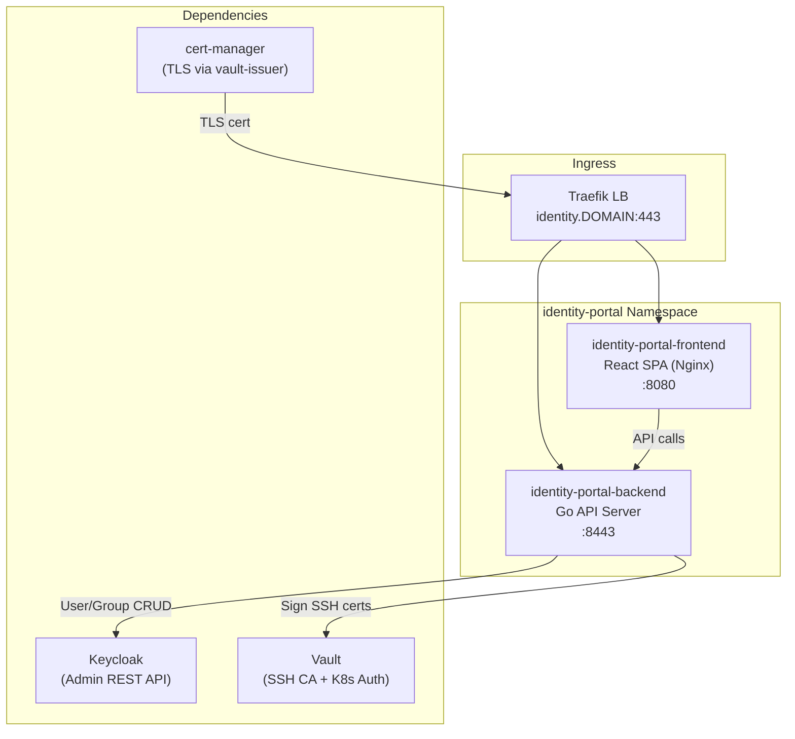
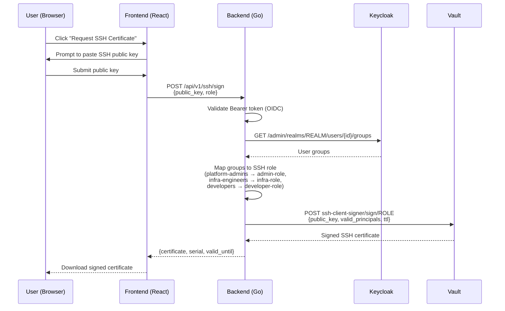
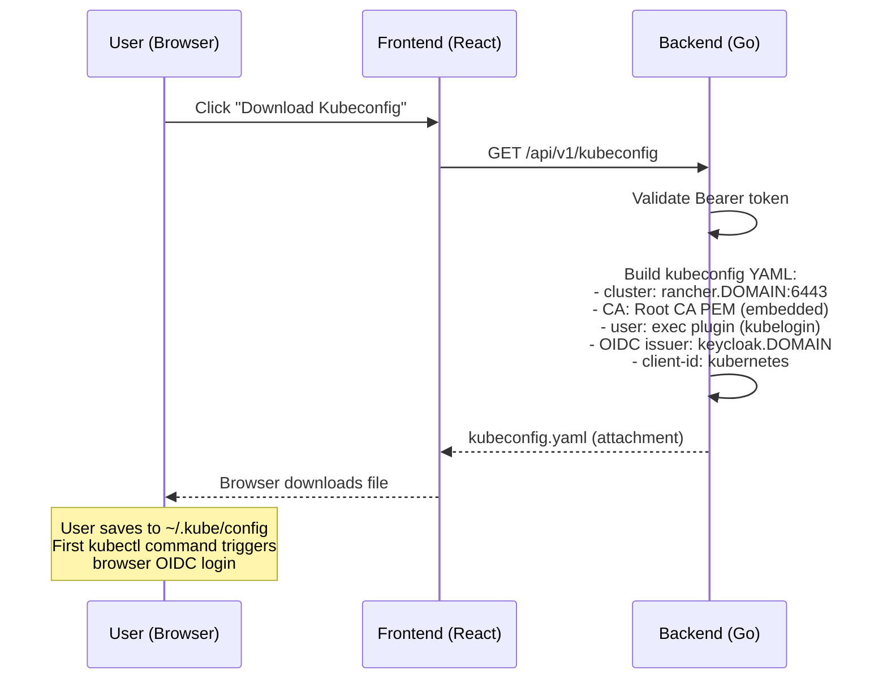

# Identity Portal

Centralized identity management service for the RKE2 cluster platform. Provides admin and self-service capabilities for user management, SSH certificate issuance, and kubeconfig generation.

> **Note**: Throughout this document, `<DOMAIN>` refers to the root domain
> configured in `scripts/.env`. Derived formats: `<DOMAIN_DASHED>` (dots replaced with hyphens),
> `<DOMAIN_DOT>` (dots replaced with `-dot-`).

---

## Architecture



---

## Features

### Admin Capabilities

| Feature | Description |
|---------|-------------|
| User management | Create, update, disable, delete Keycloak users |
| Group management | Assign/remove users to/from Keycloak groups |
| SSH role assignment | Map users to Vault SSH signing roles via group membership |
| Audit log viewer | View recent admin actions (Keycloak event log proxy) |

### Self-Service Capabilities

| Feature | Description |
|---------|-------------|
| SSH certificate request | Authenticate via OIDC, receive a signed SSH certificate from Vault |
| Kubeconfig download | Generate a pre-configured kubeconfig with kubelogin exec plugin |
| Profile view | View own group memberships and role assignments |
| Password change | Redirect to Keycloak account console for password updates |

---

## API Reference

### Authentication Endpoints

| Method | Path | Description | Auth |
|--------|------|-------------|------|
| GET | `/api/v1/auth/login` | Redirect to Keycloak OIDC login | None |
| GET | `/api/v1/auth/callback` | OIDC callback handler | None |
| POST | `/api/v1/auth/logout` | End session, revoke tokens | Bearer token |
| GET | `/api/v1/auth/userinfo` | Return current user profile + groups | Bearer token |

### User Management Endpoints (Admin)

| Method | Path | Description | Auth |
|--------|------|-------------|------|
| GET | `/api/v1/users` | List all users (paginated) | Bearer token (platform-admins) |
| GET | `/api/v1/users/:id` | Get user details | Bearer token (platform-admins) |
| POST | `/api/v1/users` | Create new user | Bearer token (platform-admins) |
| PUT | `/api/v1/users/:id` | Update user attributes | Bearer token (platform-admins) |
| DELETE | `/api/v1/users/:id` | Delete user | Bearer token (platform-admins) |
| POST | `/api/v1/users/:id/groups` | Add user to group | Bearer token (platform-admins) |
| DELETE | `/api/v1/users/:id/groups/:groupId` | Remove user from group | Bearer token (platform-admins) |

### SSH Certificate Endpoints

| Method | Path | Description | Auth |
|--------|------|-------------|------|
| POST | `/api/v1/ssh/sign` | Sign SSH public key, return certificate | Bearer token |
| GET | `/api/v1/ssh/roles` | List available SSH roles for current user | Bearer token |
| GET | `/api/v1/ssh/ca-public-key` | Return the SSH CA public key | None |

### Kubeconfig Endpoints

| Method | Path | Description | Auth |
|--------|------|-------------|------|
| GET | `/api/v1/kubeconfig` | Generate kubeconfig YAML with kubelogin exec plugin | Bearer token |

---

## SSH Certificate Flow



For full SSH CA architecture, Vault configuration, and host setup, see [SSH Certificate Authentication](ssh-certificate-auth.md).

---

## Kubeconfig Generation Flow



See also: [kubectl OIDC Setup](kubectl-oidc-setup.md) for manual configuration steps.

---

## Configuration

### Environment Variables

| Variable | Description | Source |
|----------|-------------|--------|
| `KEYCLOAK_URL` | Keycloak base URL | `https://keycloak.<DOMAIN>` |
| `KEYCLOAK_REALM` | Keycloak realm name | Derived from DOMAIN first segment |
| `KEYCLOAK_CLIENT_ID` | OIDC client ID for the portal | `identity-portal` |
| `KEYCLOAK_CLIENT_SECRET` | OIDC client secret | Kubernetes Secret |
| `VAULT_ADDR` | Vault API address | `http://vault.vault.svc.cluster.local:8200` |
| `VAULT_SSH_MOUNT` | Vault SSH secrets engine mount | `ssh-client-signer` |
| `VAULT_AUTH_PATH` | Vault K8s auth mount | `auth/kubernetes` |
| `VAULT_ROLE` | Vault K8s auth role | `identity-portal` |
| `CLUSTER_API_URL` | Kubernetes API server URL | `https://rancher.<DOMAIN>:6443` |
| `ROOT_CA_PEM` | Root CA PEM (for kubeconfig embedding) | Mounted from ConfigMap |
| `LOG_LEVEL` | Logging verbosity | `info` |
| `LISTEN_ADDR` | Backend listen address | `:8443` |

### Secrets

| Secret Name | Namespace | Keys | Source |
|-------------|-----------|------|--------|
| `identity-portal-oidc` | identity-portal | `client-secret` | Generated by setup-keycloak.sh |
| `identity-portal-tls` | identity-portal | `tls.crt`, `tls.key`, `ca.crt` | cert-manager (Gateway auto) |

---

## Kubernetes Resources

| Resource Type | Name | Namespace | Purpose |
|--------------|------|-----------|---------|
| Namespace | identity-portal | - | All Identity Portal components |
| Deployment | identity-portal-backend | identity-portal | Go API server |
| Deployment | identity-portal-frontend | identity-portal | React SPA (Nginx) |
| Service (ClusterIP) | identity-portal-backend | identity-portal | :8443 (API) |
| Service (ClusterIP) | identity-portal-frontend | identity-portal | :8080 (static) |
| ServiceAccount | identity-portal | identity-portal | Pod identity for Vault K8s auth |
| ConfigMap | identity-portal-config | identity-portal | Environment variables |
| ConfigMap | identity-portal-ca | identity-portal | Root CA PEM for kubeconfig generation |
| Secret | identity-portal-oidc | identity-portal | Keycloak OIDC client secret |
| Gateway | identity-portal | identity-portal | HTTPS with cert-manager annotation |
| HTTPRoute | identity-portal-frontend | identity-portal | Route `/` to frontend :8080 |
| HTTPRoute | identity-portal-backend | identity-portal | Route `/api/` to backend :8443 |

---

## Monitoring

- **Prometheus scrape**: Auto-discovered via pod annotation `prometheus.io/scrape: "true"`, port `8443`, path `/metrics`
- **Key metrics**: `identity_portal_ssh_certs_issued_total`, `identity_portal_kubeconfig_generated_total`, `identity_portal_auth_requests_total`, `identity_portal_keycloak_api_errors_total`
- **Grafana dashboard**: `identity-portal-overview` in Services folder
- **Alert rules**: See [Monitoring & Observability](engineering/monitoring-observability.md) for the `identity-portal-alerts` group

---

## Dependencies

| Dependency | Required | Purpose |
|------------|----------|---------|
| Keycloak | Yes | OIDC authentication + Admin REST API for user/group CRUD |
| Vault | Yes | SSH certificate signing via `ssh-client-signer/` engine |
| cert-manager + Vault | Yes | TLS certificate for ingress |
| Traefik | Yes | Ingress routing (Gateway + HTTPRoute) |
| DNS | Yes | `identity.<DOMAIN>` A record |

---

## Deployment

Identity Portal is deployed via Kustomize manifests in `services/identity-portal/`. It is deployed during Phase 7 of `deploy-cluster.sh` alongside other application services.

```bash
# Manual deployment
kube_apply_k_subst services/identity-portal/
```

For airgapped deployments, no additional Helm chart is needed (Kustomize-only). Ensure the container images are available in the Harbor registry.

---

## Related Documentation

- [SSH Certificate Authentication](ssh-certificate-auth.md) -- Vault SSH CA architecture and host configuration
- [Security Architecture](engineering/security-architecture.md) -- PKI, Vault policies, OIDC clients
- [kubectl OIDC Setup](kubectl-oidc-setup.md) -- Manual kubeconfig setup (alternative to self-service)
- [Keycloak User Management Strategy](keycloak-user-management-strategy.md) -- Identity stack design decisions

---

**Generated**: 2026-02-18
**Maintainer**: RKE2 Infrastructure Team
