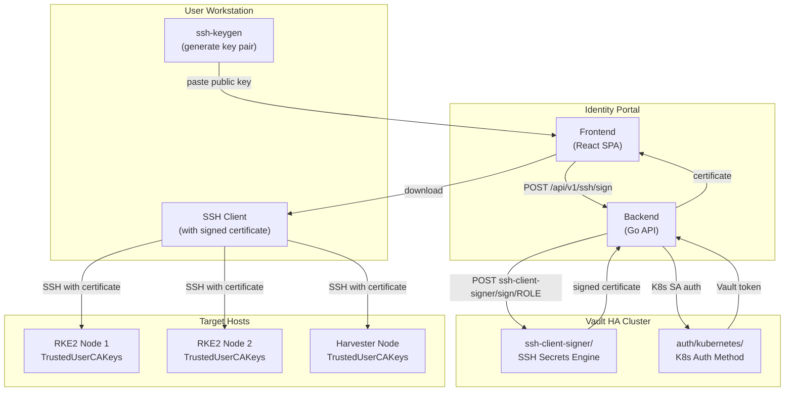

# SSH Certificate Authentication

Architecture and configuration for SSH certificate-based authentication using Vault as a Certificate Authority (CA). Users authenticate via OIDC (Keycloak), and Vault signs short-lived SSH certificates that grant access to cluster nodes.

> **Note**: Throughout this document, `<DOMAIN>` refers to the root domain
> configured in `scripts/.env`.

---

## Architecture



---

## Vault SSH CA Configuration

### Secrets Engine

| Parameter | Value |
|-----------|-------|
| Engine type | SSH |
| Mount path | `ssh-client-signer/` |
| CA key type | RSA 4096-bit (auto-generated) |
| Public key endpoint | `ssh-client-signer/public_key` |

Enable the engine:

```bash
vault secrets enable -path=ssh-client-signer ssh
vault write ssh-client-signer/config/ca generate_signing_key=true key_type=rsa key_bits=4096
```

### Signing Roles

| Role | `valid_principals` | `default_user` | `max_ttl` | `ttl` | `allowed_extensions` |
|------|-------------------|----------------|-----------|-------|---------------------|
| `admin-role` | `root,rocky` | `rocky` | `12h` | `4h` | `permit-pty,permit-agent-forwarding,permit-port-forwarding` |
| `infra-role` | `rocky` | `rocky` | `8h` | `4h` | `permit-pty,permit-agent-forwarding` |
| `developer-role` | `rocky` | `rocky` | `4h` | `2h` | `permit-pty` |

Create roles:

```bash
vault write ssh-client-signer/roles/admin-role \
    key_type=ca \
    allow_user_certificates=true \
    valid_principals="root,rocky" \
    default_user="rocky" \
    ttl=4h \
    max_ttl=12h \
    default_extensions='{"permit-pty":"","permit-agent-forwarding":"","permit-port-forwarding":""}'

vault write ssh-client-signer/roles/infra-role \
    key_type=ca \
    allow_user_certificates=true \
    valid_principals="rocky" \
    default_user="rocky" \
    ttl=4h \
    max_ttl=8h \
    default_extensions='{"permit-pty":"","permit-agent-forwarding":""}'

vault write ssh-client-signer/roles/developer-role \
    key_type=ca \
    allow_user_certificates=true \
    valid_principals="rocky" \
    default_user="rocky" \
    ttl=2h \
    max_ttl=4h \
    default_extensions='{"permit-pty":""}'
```

### Vault Policies

| Policy | Path | Capabilities | Consumer |
|--------|------|-------------|----------|
| `ssh-sign-admin` | `ssh-client-signer/sign/admin-role` | create, update | Identity Portal (for platform-admins group) |
| `ssh-sign-infra` | `ssh-client-signer/sign/infra-role` | create, update | Identity Portal (for infra-engineers group) |
| `ssh-sign-developer` | `ssh-client-signer/sign/developer-role` | create, update | Identity Portal (for developers group) |
| `ssh-ca-public-key` | `ssh-client-signer/public_key` | read | Identity Portal (public CA key endpoint) |

Create policies:

```bash
vault policy write ssh-sign-admin - <<EOF
path "ssh-client-signer/sign/admin-role" {
  capabilities = ["create", "update"]
}
EOF

vault policy write ssh-sign-infra - <<EOF
path "ssh-client-signer/sign/infra-role" {
  capabilities = ["create", "update"]
}
EOF

vault policy write ssh-sign-developer - <<EOF
path "ssh-client-signer/sign/developer-role" {
  capabilities = ["create", "update"]
}
EOF

vault policy write ssh-ca-public-key - <<EOF
path "ssh-client-signer/public_key" {
  capabilities = ["read"]
}
EOF
```

### Kubernetes Auth Role

| Parameter | Value |
|-----------|-------|
| Role name | `identity-portal` |
| Bound service account | `identity-portal` |
| Bound namespace | `identity-portal` |
| Policies | `ssh-sign-admin`, `ssh-sign-infra`, `ssh-sign-developer`, `ssh-ca-public-key` |
| TTL | 1h |

```bash
vault write auth/kubernetes/role/identity-portal \
    bound_service_account_names=identity-portal \
    bound_service_account_namespaces=identity-portal \
    policies=ssh-sign-admin,ssh-sign-infra,ssh-sign-developer,ssh-ca-public-key \
    ttl=1h
```

---

## Group-to-Role Mapping

The Identity Portal backend maps Keycloak group memberships to Vault SSH signing roles:

| Keycloak Group | Vault SSH Role | Principals | Max TTL |
|----------------|---------------|------------|---------|
| `platform-admins` | `admin-role` | `root`, `rocky` | 12h |
| `infra-engineers` | `infra-role` | `rocky` | 8h |
| `developers`, `senior-developers` | `developer-role` | `rocky` | 4h |

Users in multiple groups receive a certificate from the highest-privilege role they qualify for.

---

## Host Configuration

Target hosts must trust the Vault SSH CA public key. This is configured via cloud-init during node provisioning or manually for existing hosts.

### 1. Retrieve the CA Public Key

```bash
# From a machine with Vault access:
vault read -field=public_key ssh-client-signer/config/ca > /etc/ssh/trusted-user-ca-keys.pem

# Or via the Identity Portal API (unauthenticated):
curl -s https://identity.<DOMAIN>/api/v1/ssh/ca-public-key > /etc/ssh/trusted-user-ca-keys.pem
```

### 2. Configure sshd

Add to `/etc/ssh/sshd_config`:

```
TrustedUserCAKeys /etc/ssh/trusted-user-ca-keys.pem
```

Restart sshd:

```bash
systemctl restart sshd
```

### 3. Cloud-Init Integration

For RKE2 cluster nodes, the Vault SSH CA public key is distributed automatically via the Terraform cloud-init template. The key is injected during node provisioning so that all nodes trust the CA from first boot.

---

## User Workflow

### Request an SSH Certificate

1. Navigate to `https://identity.<DOMAIN>`
2. Log in with Keycloak credentials (OIDC)
3. Click "Request SSH Certificate"
4. Paste your SSH public key (from `~/.ssh/id_ed25519.pub` or similar)
5. Select a role (if eligible for multiple)
6. Download the signed certificate

### Use the Certificate

```bash
# Save the downloaded certificate alongside your key
mv ~/Downloads/id_ed25519-cert.pub ~/.ssh/id_ed25519-cert.pub

# SSH to a cluster node (certificate is auto-detected)
ssh rocky@node1.<DOMAIN>

# Verify certificate details
ssh-keygen -L -f ~/.ssh/id_ed25519-cert.pub
```

### Certificate Details

The signed certificate contains:

| Field | Example Value |
|-------|--------------|
| Type | `ssh-ed25519-cert-v01@openssh.com` (user certificate) |
| Serial | Auto-incremented by Vault |
| Key ID | `vault-identity-portal-<username>-<timestamp>` |
| Valid principals | `rocky` (or `root,rocky` for admin-role) |
| Valid | `2026-02-18T10:00:00 to 2026-02-18T14:00:00` (4h default) |
| Extensions | `permit-pty` (varies by role) |
| Signing CA | Vault SSH CA (`ssh-client-signer/`) |

---

## Troubleshooting

| Issue | Symptom | Solution |
|-------|---------|----------|
| Certificate rejected | `Permission denied (publickey)` | Verify host has `TrustedUserCAKeys` configured; check certificate validity with `ssh-keygen -L -f cert.pub` |
| Wrong principal | `no matching principal found` | Ensure the certificate's `valid_principals` includes the target username (e.g., `rocky`) |
| Expired certificate | `Certificate has expired` | Request a new certificate; default TTL is 2-4 hours |
| Vault auth failure | Backend returns 403 | Verify `identity-portal` K8s auth role exists in Vault; check ServiceAccount token |
| Role not available | API returns empty role list | User must be in a mapped Keycloak group (platform-admins, infra-engineers, or developers) |

---

## Security Considerations

| Aspect | Design Decision |
|--------|----------------|
| Certificate TTL | Short-lived (2-12h) -- no long-lived credentials on disk |
| No CRL needed | Certificates expire automatically; revocation is implicit |
| Principal restriction | Each role limits allowed principals; `root` only for admin-role |
| Extension restriction | `permit-port-forwarding` only for admin-role |
| Vault auth | Backend uses K8s ServiceAccount auth (no static tokens) |
| CA key protection | SSH CA private key stored in Vault, never exported |
| Audit trail | Vault audit log records every signing operation |

---

## Terraform Integration

The Vault SSH secrets engine, roles, and policies are configured during Phase 2 of `deploy-cluster.sh` as part of the Vault PKI bootstrap. The cloud-init templates in `cluster/` include the SSH CA public key distribution to all provisioned nodes.

See [Deployment Automation](engineering/deployment-automation.md) for the full Phase 2 flow.

---

## Related Documentation

- [Identity Portal](identity-portal.md) -- Portal service documentation
- [Security Architecture](engineering/security-architecture.md) -- Vault architecture, policies, PKI
- [Deployment Automation](engineering/deployment-automation.md) -- Phase 2 Vault setup
- [Keycloak User Management Strategy](keycloak-user-management-strategy.md) -- SSH key management decisions

---

**Generated**: 2026-02-18
**Maintainer**: RKE2 Infrastructure Team
