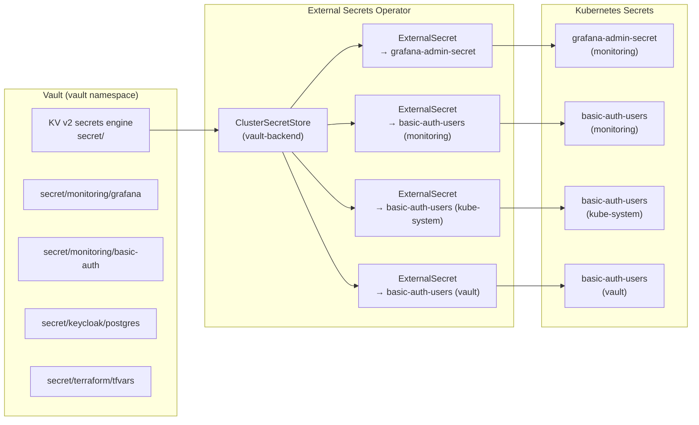

# Vault Credential Storage Migration Plan

## Status: Planning

Migrate all service credentials from git-committed YAML files (with placeholder values) to HashiCorp Vault KV secrets engine, synced to Kubernetes via External Secrets Operator.

---

## Problem

Credentials are currently stored in Kubernetes Secret manifests committed to git:

| File | Credential | Current State |
|------|-----------|---------------|
| `services/monitoring-stack/grafana/secret-admin.yaml` | Grafana admin password | Placeholder (was plaintext in git history) |
| `services/monitoring-stack/prometheus/basic-auth-secret.yaml` | Prometheus basic-auth htpasswd | Placeholder (hash was in git history) |
| `services/monitoring-stack/kube-system/basic-auth-secret.yaml` | Traefik/Hubble basic-auth htpasswd | Placeholder (hash was in git history) |
| `services/monitoring-stack/vault/basic-auth-secret.yaml` | Vault basic-auth htpasswd | Placeholder |
| `services/keycloak/` (future) | PostgreSQL + Keycloak admin creds | Not yet created |
| `cluster/terraform.tfvars` | Rancher token, SSH keys | Gitignored, stored as K8s secrets |

### Immediate Action Required

The following credentials were exposed in git history and **must be rotated**:
- Grafana admin password (`CHANGEME_KC_ADMIN_PASSWORD`)
- Basic-auth htpasswd hash (`admin:$apr1$xTSkdWWJ$k.NIQMIgqmqxt6662c6x4.`)

---

## Target Architecture



---

## Implementation Plan

### Phase 1: Enable Vault KV Secrets Engine

```bash
# Enable KV v2
kubectl exec -n vault vault-0 -- vault secrets enable -path=secret kv-v2

# Create policy for External Secrets Operator
kubectl exec -n vault vault-0 -- sh -c 'vault policy write external-secrets - <<EOF
path "secret/data/*" {
  capabilities = ["read"]
}
path "secret/metadata/*" {
  capabilities = ["read", "list"]
}
EOF'

# Create K8s auth role for ESO
kubectl exec -n vault vault-0 -- vault write auth/kubernetes/role/external-secrets \
  bound_service_account_names=external-secrets \
  bound_service_account_namespaces=external-secrets \
  policies=external-secrets \
  ttl=1h
```

### Phase 2: Store Credentials in Vault

```bash
# Grafana admin
kubectl exec -n vault vault-0 -- vault kv put secret/monitoring/grafana \
  admin-password="<new-strong-password>"

# Basic-auth (generate fresh htpasswd)
HASH=$(htpasswd -nbB admin "<new-strong-password>")
kubectl exec -n vault vault-0 -- vault kv put secret/monitoring/basic-auth \
  users="$HASH"

# Keycloak (future)
kubectl exec -n vault vault-0 -- vault kv put secret/keycloak/postgres \
  username="keycloak" \
  password="<generated>"

kubectl exec -n vault vault-0 -- vault kv put secret/keycloak/admin \
  username="admin" \
  password="<generated>"
```

### Phase 3: Deploy External Secrets Operator

```bash
helm install external-secrets external-secrets/external-secrets \
  -n external-secrets --create-namespace \
  --set installCRDs=true \
  --set nodeSelector.workload-type=general
```

### Phase 4: Create ClusterSecretStore + ExternalSecrets

**ClusterSecretStore:**
```yaml
apiVersion: external-secrets.io/v1beta1
kind: ClusterSecretStore
metadata:
  name: vault-backend
spec:
  provider:
    vault:
      server: "http://vault.vault.svc:8200"
      path: "secret"
      version: "v2"
      auth:
        kubernetes:
          mountPath: "kubernetes"
          role: "external-secrets"
          serviceAccountRef:
            name: "external-secrets"
            namespace: "external-secrets"
```

**ExternalSecret (example for Grafana):**
```yaml
apiVersion: external-secrets.io/v1beta1
kind: ExternalSecret
metadata:
  name: grafana-admin-secret
  namespace: monitoring
spec:
  refreshInterval: 1h
  secretStoreRef:
    name: vault-backend
    kind: ClusterSecretStore
  target:
    name: grafana-admin-secret
  data:
    - secretKey: admin-password
      remoteRef:
        key: monitoring/grafana
        property: admin-password
```

### Phase 5: Remove Static Secret Manifests

Once ExternalSecrets are working:
1. Remove `secret-admin.yaml`, `basic-auth-secret.yaml` files from kustomization
2. Add ExternalSecret manifests to kustomization instead
3. Static files become documentation-only (`.example` suffix)

### Phase 6: Terraform Secrets (Future)

Migrate `cluster/terraform.tfvars` and kubeconfigs from K8s secrets to Vault KV:
- `secret/terraform/tfvars` - Rancher token, cluster config
- `secret/terraform/kubeconfig-harvester` - Harvester access
- `secret/terraform/cloud-provider-kubeconfig` - Harvester cloud provider
- Update `cluster/terraform.sh` to read from Vault instead of K8s secrets

---

## Credential Rotation Checklist

After migration, rotate all previously-exposed credentials:

- [ ] Grafana admin password (was `CHANGEME_KC_ADMIN_PASSWORD` in git history)
- [ ] Basic-auth password for monitoring namespace (htpasswd hash was in git history)
- [ ] Basic-auth password for kube-system namespace (same hash was in git history)
- [ ] Generate new basic-auth for vault namespace
- [ ] Update Vault KV with new values
- [ ] Verify ExternalSecrets sync new values to K8s
- [ ] Restart affected pods to pick up new secrets

---

## Dependencies

| Component | Purpose | Install Method |
|-----------|---------|---------------|
| Vault KV v2 | Secret storage | `vault secrets enable` (already deployed) |
| External Secrets Operator | Vault → K8s Secret sync | Helm chart |
| Vault K8s auth | ESO authentication | Already configured for cert-manager |

## Related Documentation

- [Security Architecture](engineering/security-architecture.md) - Authentication matrix, TLS chain, credential rotation checklist
- [Vault Service README](../services/vault/README.md) - Vault HA operations, unseal procedures
- [Secret Rotation Procedures](engineering/troubleshooting-sop.md#116-secret-rotation) - Secret rotation procedures
