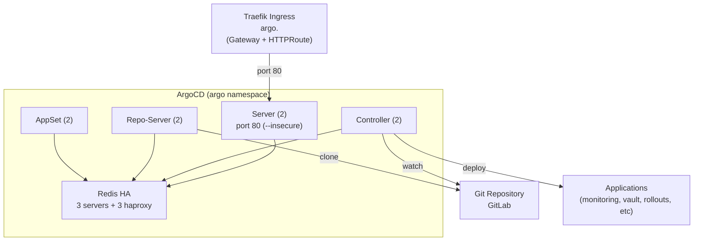
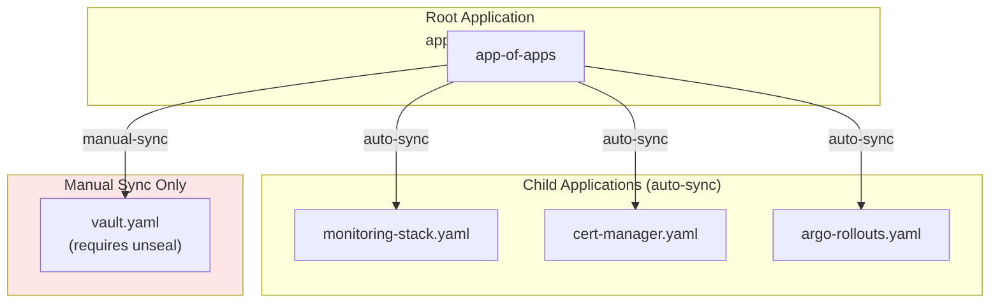
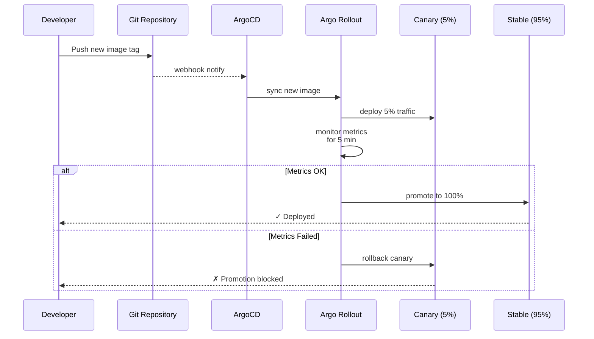

# ArgoCD + Argo Rollouts GitOps Platform

GitOps platform for cluster deployment automation and progressive delivery with ArgoCD and Argo Rollouts running in high-availability mode.

> **Note**: Throughout this document, `<DOMAIN>` refers to the root domain
> configured in `scripts/.env` (e.g., `example.com`). Derived formats:
> `<DOMAIN_DASHED>` = dots replaced with hyphens (e.g., `example-com`),
> `<DOMAIN_DOT>` = dots replaced with `-dot-` (e.g., `example-dot-com`).
> All service FQDNs follow the pattern `<service>.<DOMAIN>`.

## Overview

This directory deploys two complementary GitOps tools:

- **ArgoCD v3.3.0** — Declarative continuous deployment via Git-based configuration. Watches Git repositories and automatically syncs cluster state to match desired state.
- **Argo Rollouts v1.8.3** — Progressive delivery framework extending Kubernetes Deployments with canary and blue-green deployment strategies, traffic management, and automated promotion.

Both run in HA configuration with redundant replicas, shared state via Redis, and are fronted by Traefik IngressRouter for secure HTTPS access.

## Architecture

### ArgoCD High Availability



### App-of-Apps Bootstrap Pattern



### Progressive Delivery with Argo Rollouts



## Components

| Component | Version | Replicas | Pool | Purpose |
|-----------|---------|----------|------|---------|
| ArgoCD Server | 3.3.0 | 2 | general | Web UI + API for Git syncing |
| ArgoCD Controller | 3.3.0 | 2 | general | Watches Applications, reconciles state |
| ArgoCD Repo-Server | 3.3.0 | 2 | general | Clones Git repos, renders manifests |
| ArgoCD AppSet | 3.3.0 | 2 | general | Generates Applications from templates |
| Argo Rollouts Controller | 1.8.3 | 2 | general | Manages Rollout CRDs, traffic shifting |
| Argo Rollouts Dashboard | 1.8.3 | 1 | general | UI for Rollout visualization |
| Redis HA Server | - | 3 | general | ArgoCD state cache |
| Redis HA Haproxy | - | 3 | general | Redis cluster proxy |

## Prerequisites

- RKE2 cluster with Cilium CNI and Gateway API support (Gateway API CRDs bundled in rke2-traefik-crd)
- Traefik 3.6+ for IngressRoute support with port 80 (HTTP) not port name `https`
- Vault + cert-manager for TLS certificate management (issuers in `cert-manager` namespace)
- Git repository (GitLab) with cluster configuration (optional for bootstrap, required for production)
- kubectl with cluster-admin access

## Deployment

### Prerequisites Check

Verify prerequisites before deploying:

```bash
# Check Traefik is running
kubectl get deployment -n kube-system rke2-traefik

# Check cert-manager is ready
kubectl get clusterissuers vault-issuer

# Check Cilium L2 pool for LoadBalancer IPs
kubectl get ciliumloadbalancierpool

# Verify Gateway API CRDs exist
kubectl api-resources | grep gateway
```

### 1. Create ArgoCD

```bash
# Create namespace
kubectl apply -f services/argo/argocd/namespace.yaml

# Install ArgoCD via Helm
helm repo add argo https://argoproj.github.io/argo-helm
helm repo update

helm install argocd argo/argo-cd \
  --namespace argocd \
  --values services/argo/argocd/argocd-values.yaml \
  --timeout 10m

# Note: Omit --wait with Rancher tunnel — watch stream errors (INTERNAL_ERROR) are noise.
# Pods usually start within 30-60 seconds. Monitor with:
# kubectl -n argocd get pods -w
```

### 2. Configure Gateway & HTTPRoute

```bash
# Create Gateway (triggers cert-manager gateway-shim → Vault)
kubectl apply -f services/argo/argocd/gateway.yaml

# Create HTTPRoute (routes to argocd-server on port 80)
kubectl apply -f services/argo/argocd/httproute.yaml

# Verify Gateway is ready (cert-manager auto-creates TLS secret)
kubectl -n argocd get gateway argocd -o wide
kubectl get secrets -n argocd | grep tls
```

### 3. Optional: Configure Git Repository Secret

If using a private Git repository (highly recommended for production):

```bash
# Edit secret-repo.yaml with your repository details:
# - URL: git@gitlab.example.com:group/cluster.git (SSH recommended)
# - SSH key or HTTPS credentials

kubectl apply -f services/argo/argocd/secret-repo.yaml
```

### 4. Deploy Argo Rollouts

```bash
# Create namespace
kubectl apply -f services/argo/argo-rollouts/namespace.yaml

# Install Argo Rollouts via Helm
helm repo add argo https://argoproj.github.io/argo-helm
helm repo update

helm install argo-rollouts argo/argo-rollouts \
  --namespace argo-rollouts \
  --values services/argo/argo-rollouts/argo-rollouts-values.yaml \
  --timeout 10m
```

### 5. Configure Argo Rollouts Gateway & HTTPRoute

```bash
# Create Gateway for Rollouts dashboard (triggers cert-manager gateway-shim)
kubectl apply -f services/argo/argo-rollouts/gateway.yaml

# Create basic-auth credentials (htpasswd) for dashboard
kubectl apply -f services/argo/argo-rollouts/basic-auth-secret.yaml

# Create middleware for basic-auth
kubectl apply -f services/argo/argo-rollouts/middleware-basic-auth.yaml

# Create HTTPRoute with basic-auth via extensionRef filter
kubectl apply -f services/argo/argo-rollouts/httproute.yaml
```

### 6. Bootstrap Applications (Optional: Requires Git Repo)

If you have a Git repository with manifests, deploy the app-of-apps pattern:

```bash
# Edit bootstrap/argocd-self-manage.yaml to point to your repo URL

# Apply root Application (parent of all child apps)
kubectl apply -f services/argo/bootstrap/app-of-apps.yaml

# Apply child Applications
kubectl apply -f services/argo/bootstrap/apps/*.yaml
```

**Important**: The root Application auto-syncs child apps. Vault is manual-sync only due to unseal requirement — see [Vault Manual Sync](#vault-manual-sync-only) below.

## Configuration

### ArgoCD Helm Values

Key settings in `argocd-values.yaml`:

```yaml
# High availability replicas
replicaCount: 2                    # server, controller, repo-server, appset
redis-ha:
  enabled: true
  replicas: 3

# Disable basic-auth (ArgoCD has own auth)
configs:
  secret:
    argocdServerAdminPassword: <bcrypt-hashed>  # Set strong password

# IngressRoute: Use port 80 NOT port "https"
server:
  service:
    servicePortHttps: 443
    servicePort: 80                # Not named "https" — Traefik 3.x port detection issue
```

### Argo Rollouts Helm Values

Key settings in `argo-rollouts-values.yaml`:

```yaml
# HA controllers
controller:
  replicas: 2

# Traffic router plugin: Gateway API (top-level, NOT nested under controller)
trafficRouterPlugins:
  enabled: true
  argoproj_labs_rollouts_gateway_api:
    className: gatewayapi

# Dashboard (single replica, basic-auth required)
dashboard:
  enabled: true
  replicas: 1
```

**Critical**: `trafficRouterPlugins` MUST be top-level in values. Nesting under `controller` causes JSON unmarshal crash.

### Redis HA Anti-Affinity Fix

If deploying to a 2-node pool with 3 Redis replicas, set soft anti-affinity:

```yaml
redis-ha:
  podDisruptionBudget:
    enabled: true
    minAvailable: 1
  affinity: |
    podAntiAffinity:
      preferredDuringSchedulingIgnoredDuringExecution:
        - weight: 100
          podAffinityTerm:
            labelSelector:
              matchExpressions:
                - key: app
                  operator: In
                  values:
                    - redis-ha
            topologyKey: kubernetes.io/hostname
```

Default (required) anti-affinity deadlocks: 3 replicas cannot fit on 2 nodes if each requires unique node.

## Verification

### Check ArgoCD Status

```bash
# All pods running
kubectl -n argocd get pods

# Check server is accessible
kubectl -n argocd get svc argocd-server
# Output should show ClusterIP (not LoadBalancer)

# Verify Gateway and HTTPRoute are ready
kubectl -n argocd get gateway
kubectl -n argocd get httproute
# Gateway should have assigned IP, HTTPRoute should show parent Gateway

# Access web UI
# https://argo.<DOMAIN>
# Username: admin
# Password: kubectl -n argocd get secret argocd-initial-admin-secret -o jsonpath='{.data.password}' | base64 -d
```

### Check Argo Rollouts Status

```bash
# All pods running
kubectl -n argo-rollouts get pods

# Dashboard accessible
kubectl -n argo-rollouts get gateway
kubectl -n argo-rollouts get httproute

# Access dashboard
# https://rollouts.<DOMAIN>
# Basic auth credentials from basic-auth-secret.yaml
```

### Verify Redis HA

```bash
# Check Redis HA pods (3 servers + 3 haproxy)
kubectl -n argocd get pods -l app=redis-ha

# Check Redis is healthy
kubectl -n argocd exec -it redis-ha-server-0 -- redis-cli ping
# Output: PONG
```

### Check Application Sync

```bash
# List all Applications
argocd app list

# Watch app status
argocd app get app-of-apps

# Manually trigger sync (if needed)
argocd app sync app-of-apps
```

## Configuration: Retrieving Initial Admin Password

The initial admin password is generated automatically on first deployment:

```bash
# Retrieve and decode
kubectl -n argocd get secret argocd-initial-admin-secret \
  -o jsonpath='{.data.password}' | base64 -d && echo

# Login to UI
# https://argo.<DOMAIN>
# Username: admin
```

**Strongly recommended**: Change this password immediately via the UI or CLI after login.

## Vault Manual Sync Only

The Vault application in `bootstrap/apps/vault.yaml` is marked with `syncPolicy.automated: false` because:

1. Vault requires manual unseal after pod restart
2. Automatic sync could restart pods during unseal window
3. Manual sync allows operator control over timing

To sync Vault manually:

```bash
argocd app sync vault
```

Or via UI: ArgoCD web → Applications → vault → SYNC button

## Troubleshooting

### Issue: Redis HA Pods in Pending (2-node pool)

**Symptom**: Some redis-ha-server or redis-ha-haproxy pods stay Pending indefinitely.

**Cause**: Default anti-affinity is `required` (hard). With only 2 nodes, 3 replicas cannot each get unique node.

**Fix**: Edit values or HelmChart to use `preferredDuringSchedulingIgnoredDuringExecution` (soft):

```bash
kubectl -n argocd get helmchart redis-ha -o yaml | grep -A 10 affinity
# Verify weight: 100 with preferred (not required)
```

### Issue: Argo Rollouts Dashboard Bad Gateway (503)

**Symptom**: Accessing rollouts.<DOMAIN> returns "Bad Gateway" from Traefik.

**Cause**: HTTPRoute configuration issue or service port mismatch.

**Fix**: Check `argo-rollouts/httproute.yaml`:

```yaml
spec:
  rules:
    - backendRefs:
        - name: argo-rollouts-dashboard
          port: 3100              # Must match service port
```

Ensure the dashboard service is running and listening on the correct port.

### Issue: Helm Install Hangs with --wait (Rancher Tunnel)

**Symptom**: `helm install ... --wait` hangs with `INTERNAL_ERROR` watch stream errors.

**Cause**: Rancher WebSocket tunnel proxy occasionally drops watch streams. These are harmless.

**Fix**: Use shorter timeout instead:

```bash
helm install argocd argo/argo-cd \
  --namespace argocd \
  --values services/argo/argocd/argocd-values.yaml \
  --timeout 10m
  # Omit --wait; monitor pods manually
```

Pods typically start within 30-60 seconds. Check status:

```bash
kubectl -n argocd get pods -w
```

### Issue: trafficRouterPlugins JSON Unmarshal Crash

**Symptom**: Argo Rollouts controller pod crashes with JSON unmarshal error.

**Cause**: `trafficRouterPlugins` nested under `controller` in values instead of top-level.

**Fix**: Values structure must be:

```yaml
# CORRECT: top-level
trafficRouterPlugins:
  enabled: true
  argoproj_labs_rollouts_gateway_api:
    className: gatewayapi

# WRONG: nested under controller (causes crash)
controller:
  trafficRouterPlugins:  # <-- DO NOT NEST
    enabled: true
```

### Issue: ArgoCD Server Returns 502 (Bad Gateway)

**Symptom**: Accessing argo.<DOMAIN> returns "Bad Gateway".

**Cause**: HTTPRoute pointing to wrong port or service name.

**Fix**: Verify HTTPRoute uses port 80:

```bash
kubectl -n argocd get httproute argocd-server -o yaml | grep -A 5 "backendRefs:"
```

Expected output:

```yaml
backendRefs:
  - name: argocd-server
    port: 80                    # NOT 443 or https
```

The argocd-server runs with `--insecure` flag (TLS terminated by Traefik Gateway), so the backend service is HTTP on port 80.

### Issue: Vault Application Won't Sync (Locked/Sealed)

**Symptom**: Vault application shows "OutOfSync" and cannot be auto-synced.

**Cause**: Vault is unsealed, and auto-sync is disabled intentionally.

**Fix**: Check Vault status and unseal if needed:

```bash
# Check if sealed
argocd app get vault | grep Status

# Manually sync when ready
argocd app sync vault
```

See [Vault HA](../../docs/vault-ha.md) for unseal procedure.

### Issue: Certificate Not Issued (Pending)

**Symptom**: TLS secret not created, Gateway not ready.

**Cause**: Vault issuer down, cert-manager gateway-shim not enabled, or network unreachable.

**Fix**: Check cert-manager logs and Vault status:

```bash
kubectl -n cert-manager logs -l app=cert-manager -f | grep gateway

kubectl -n vault get pods
argocd app get vault    # Check if synced and healthy

# Verify gateway-shim is enabled
kubectl logs -n cert-manager -l app.kubernetes.io/name=cert-manager | grep "gateway-shim"
# Should see: "enabling the sig-network Gateway API certificate-shim"
```

## File Structure

```
services/argo/
├── README.md                          # This file
│
├── argocd/
│   ├── namespace.yaml                 # argo namespace
│   ├── argocd-values.yaml             # ArgoCD Helm values (2x HA, redis-ha, no basic-auth)
│   ├── gateway.yaml                   # Gateway with cert-manager annotation (auto-creates TLS secret)
│   ├── httproute.yaml                 # HTTPRoute (port 80, argocd-server runs --insecure)
│   └── secret-repo.yaml               # (Optional) Git repo SSH key/credentials
│
├── argo-rollouts/
│   ├── namespace.yaml                 # argo-rollouts namespace
│   ├── argo-rollouts-values.yaml      # Argo Rollouts values (trafficRouterPlugins top-level)
│   ├── gateway.yaml                   # Gateway with cert-manager annotation (auto-creates TLS secret)
│   ├── httproute.yaml                 # HTTPRoute with basic-auth via extensionRef filter
│   ├── basic-auth-secret.yaml         # htpasswd credentials for dashboard
│   └── middleware-basic-auth.yaml     # Traefik basic-auth middleware
│
└── bootstrap/
    ├── app-of-apps.yaml               # Root Application (auto-syncs children)
    ├── argocd-self-manage.yaml        # (Optional) ArgoCD self-manage app
    └── apps/
        ├── monitoring-stack.yaml      # Child app: monitoring-stack (auto-sync)
        ├── vault.yaml                 # Child app: vault (manual-sync only)
        ├── argo-rollouts.yaml         # Child app: argo-rollouts (auto-sync)
        └── cert-manager.yaml          # Child app: cert-manager (auto-sync)
```

## Dependencies

| Dependency | Version | Namespace | Purpose |
|------------|---------|-----------|---------|
| Traefik | 3.6+ | kube-system | Ingress routing & TLS termination |
| cert-manager | 1.14+ | cert-manager | TLS certificate provisioning |
| Vault | 1.16+ | vault | Certificate PKI backend |
| Cilium | 1.16+ | kube-system | L2 LoadBalancer IP advertisement |
| Gateway API CRDs | - | - | Argo Rollouts traffic routing plugin |

All prerequisites must be deployed before ArgoCD and Argo Rollouts.

See [../README.md](../README.md) for overall services deployment order.

## Next Steps

1. **Add Git Repository**: Clone cluster configuration repo, push to GitLab, link in ArgoCD
2. **Deploy Child Applications**: Create Application manifests in bootstrap/apps/ and push to Git
3. **Enable Auto-Sync**: Once Git repo is trusted, enable automatic sync for child apps
4. **Configure Notifications**: Add Slack/email notifications for sync failures
5. **Set Up RBAC**: Create ArgoCD projects and RBAC policies for team access
6. **Develop Rollout Strategies**: Create AnalysisTemplate and Rollout manifests for progressive delivery

## References

- [ArgoCD Documentation](https://argo-cd.readthedocs.io/)
- [Argo Rollouts Documentation](https://argoproj.github.io/argo-rollouts/)
- [App-of-Apps Pattern](https://argo-cd.readthedocs.io/en/stable/operator-manual/cluster-bootstrapping/#app-of-apps-pattern)
- [Progressive Delivery with Argo Rollouts](https://argoproj.github.io/argo-rollouts/features/progressive-delivery/)
- [Traefik 3.x Documentation](https://doc.traefik.io/traefik/v3.0/)
