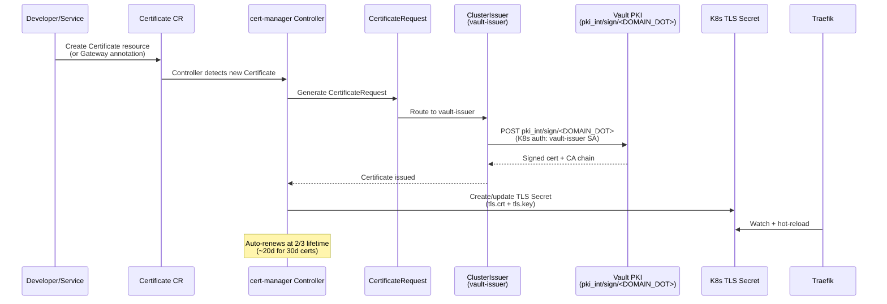

# cert-manager (Certificate Automation)

Automated TLS certificate management for the RKE2 cluster. cert-manager watches for Certificate resources and issues signed certificates from Vault PKI via the `vault-issuer` ClusterIssuer.

> **Note**: Throughout this document, `<DOMAIN>` refers to the root domain
> configured in `scripts/.env` (e.g., `example.com`). Derived formats:
> `<DOMAIN_DASHED>` = dots replaced with hyphens (e.g., `example-com`),
> `<DOMAIN_DOT>` = dots replaced with `-dot-` (e.g., `example-dot-com`).
> All service FQDNs follow the pattern `<service>.<DOMAIN>`.

## Status: Deployed

---

## Overview

cert-manager is the bridge between Vault PKI and Kubernetes TLS. It automates the entire certificate lifecycle: issuance, renewal, and secret creation. All 12 external endpoints in the cluster use certificates issued through this pipeline.

## Certificate Issuance Flow



## Components

| Component | Chart | Version | Namespace | Replicas | Pool |
|-----------|-------|---------|-----------|----------|------|
| cert-manager controller | jetstack/cert-manager | v1.19.3 | cert-manager | 1 | general |
| cert-manager webhook | (bundled) | v1.19.3 | cert-manager | 1 | general |
| cert-manager cainjector | (bundled) | v1.19.3 | cert-manager | 1 | general |

## Certificate Inventory

All certificates are signed by the Example Org Intermediate CA (Vault PKI) with a max TTL of 720h (30 days).

| Certificate | Namespace | Secret Name | Issuance Method |
|-------------|-----------|-------------|-----------------|
| `grafana.<DOMAIN>` | monitoring | `grafana-<DOMAIN_DASHED>-tls` | Auto (gateway-shim annotation) |
| `prometheus.<DOMAIN>` | monitoring | `prometheus-<DOMAIN_DASHED>-tls` | Auto (gateway-shim annotation) |
| `hubble.<DOMAIN>` | kube-system | `hubble-<DOMAIN_DASHED>-tls` | Auto (gateway-shim annotation) |
| `traefik.<DOMAIN>` | kube-system | `traefik-<DOMAIN_DASHED>-tls` | Explicit Certificate |
| `vault.<DOMAIN>` | vault | `vault-<DOMAIN_DASHED>-tls` | Auto (gateway-shim annotation) |
| `harbor.<DOMAIN>` | harbor | `harbor-<DOMAIN_DASHED>-tls` | Auto (gateway-shim annotation) |
| `keycloak.<DOMAIN>` | keycloak | `keycloak-<DOMAIN_DASHED>-tls` | Auto (gateway-shim annotation) |
| `argocd.<DOMAIN>` | argocd | `argocd-<DOMAIN_DASHED>-tls` | Auto (gateway-shim annotation) |
| `rollouts.<DOMAIN>` | argo-rollouts | `rollouts-<DOMAIN_DASHED>-tls` | Auto (gateway-shim annotation) |
| `mattermost.<DOMAIN>` | mattermost | `mattermost-<DOMAIN_DASHED>-tls` | Auto (gateway-shim annotation) |
| `kasm.<DOMAIN>` | kasm | `kasm-<DOMAIN_DASHED>-tls` | Explicit Certificate (IngressRoute exception) |
| `gitlab.<DOMAIN>` | gitlab | (4 certs) | Explicit Certificate |

**Note**: Only Traefik Dashboard and Kasm still use explicit Certificate resources. All other services use Gateway API with automatic certificate creation via gateway-shim.

## Prerequisites

- Vault deployed and unsealed (see [services/vault/README.md](../vault/README.md))
- Vault PKI configured (Root CA + Intermediate CA + `<DOMAIN_DOT>` role)
- Vault Kubernetes auth enabled with `cert-manager-issuer` role

## Deployment

cert-manager is deployed via Helm **before** Vault (Phase 1 of service deployment).

```bash
helm repo add jetstack https://charts.jetstack.io
helm repo update

helm install cert-manager jetstack/cert-manager \
  -n cert-manager --create-namespace \
  --version v1.19.3 \
  --set crds.enabled=true \
  --set config.apiVersion=controller.config.cert-manager.io/v1alpha1 \
  --set config.kind=ControllerConfiguration \
  --set config.enableGatewayAPI=true \
  --set nodeSelector.workload-type=general \
  --set webhook.nodeSelector.workload-type=general \
  --set cainjector.nodeSelector.workload-type=general
```

> **Note:** cert-manager v1.15+ replaced the `ExperimentalGatewayAPISupport` feature gate with the `enableGatewayAPI` controller config. Using the old feature gate will silently skip the gateway-shim controller.

### Apply RBAC and ClusterIssuer

After Vault PKI is configured (Phase 2), apply the cert-manager integration:

```bash
kubectl apply \
  -f services/cert-manager/rbac.yaml \
  -f services/cert-manager/cluster-issuer.yaml
```

This creates:
- **ServiceAccount** `vault-issuer` in `cert-manager` namespace
- **Role + RoleBinding** for token creation (Vault K8s auth)
- **ClusterIssuer** `vault-issuer` pointing to Vault PKI

## Configuration

### ClusterIssuer (`cluster-issuer.yaml`)

| Parameter | Value | Description |
|-----------|-------|-------------|
| `server` | `http://vault.vault.svc.cluster.local:8200` | Vault internal address |
| `path` | `pki_int/sign/<DOMAIN_DOT>` | PKI sign endpoint |
| `auth.kubernetes.role` | `cert-manager-issuer` | Vault K8s auth role |
| `auth.kubernetes.serviceAccountRef` | `vault-issuer` | ServiceAccount for auth |

### Adding TLS to a New Service

**Recommended approach (Gateway API with gateway-shim):**

1. Create a Gateway resource with cert-manager annotation:

```yaml
apiVersion: gateway.networking.k8s.io/v1
kind: Gateway
metadata:
  name: myapp
  namespace: myapp
  annotations:
    cert-manager.io/cluster-issuer: vault-issuer
spec:
  gatewayClassName: traefik
  listeners:
    - name: https
      protocol: HTTPS
      port: 8443
      hostname: myapp.<DOMAIN>
      tls:
        mode: Terminate
```

2. Create an HTTPRoute pointing to the Gateway:

```yaml
apiVersion: gateway.networking.k8s.io/v1
kind: HTTPRoute
metadata:
  name: myapp
  namespace: myapp
spec:
  parentRefs:
    - name: myapp
      namespace: myapp
  hostnames:
    - myapp.<DOMAIN>
  rules:
    - backendRefs:
        - name: myapp-service
          port: 8080
```

3. cert-manager gateway-shim will automatically create the TLS secret from the Gateway annotation.

**Legacy approach (explicit Certificate + IngressRoute):**

Only use this for services that require Traefik-specific features not yet supported in Gateway API (like serversTransport for HTTPS backends).

See [services/monitoring-stack/docs/tls-integration-guide.md](../monitoring-stack/docs/tls-integration-guide.md) for the full guide.

## Verification

```bash
# cert-manager pods running
kubectl get pods -n cert-manager

# Gateway-shim enabled
kubectl logs -n cert-manager -l app.kubernetes.io/name=cert-manager | grep gateway
# "enabling the sig-network Gateway API certificate-shim"

# ClusterIssuer ready
kubectl get clusterissuers vault-issuer
# READY = True

# Check Gateways and auto-created TLS secrets
kubectl get gateways -A
kubectl get secrets -A | grep <DOMAIN_DASHED>-tls

# Check explicit certificates (only Traefik Dashboard and Kasm)
kubectl get certificates -A
# Should show only 2-3 explicit certificates remaining

# Check certificate expiry for all TLS secrets
kubectl get secrets -A -o json | jq -r '.items[] | select(.type=="kubernetes.io/tls") | "\(.metadata.namespace) \(.metadata.name)"' | head -5
```

## Troubleshooting

### ClusterIssuer not ready

```bash
kubectl describe clusterissuer vault-issuer
```

Common causes:
- Vault is sealed (unseal all 3 replicas)
- Vault K8s auth not configured (run `vault write auth/kubernetes/config`)
- ServiceAccount `vault-issuer` missing in cert-manager namespace
- Role/RoleBinding for token creation missing

### Certificate stuck in "Issuing"

```bash
kubectl describe certificate <name> -n <namespace>
kubectl describe certificaterequest -n <namespace>
kubectl describe order -n <namespace>  # only for ACME, not Vault
```

Common causes:
- ClusterIssuer not ready (check above)
- DNS name not allowed by Vault PKI role (must be `*.<DOMAIN>`)
- Vault PKI intermediate CA expired (10yr TTL, check `vault read pki_int/cert/ca`)

### After Vault Rebuild

When Vault is rebuilt (new Root CA), all existing TLS secrets become invalid:

```bash
# Delete all TLS secrets so cert-manager reissues from new CA
kubectl get secrets -A -o json | \
  jq -r '.items[] | select(.type=="kubernetes.io/tls") | "\(.metadata.namespace) \(.metadata.name)"' | \
  while read ns name; do kubectl delete secret "$name" -n "$ns"; done

# cert-manager will automatically reissue all certificates
kubectl get certificates -A -w
```

## File Structure

```
services/cert-manager/
├── README.md                    # This file
├── rbac.yaml                    # ServiceAccount + Role + RoleBinding for vault-issuer
└── cluster-issuer.yaml          # ClusterIssuer vault-issuer → Vault PKI
```

> **Note**: All Certificate resources live in their respective service directories, not here. Most services use Gateway API with automatic certificate creation via gateway-shim.

## Dependencies

- **Vault** (PKI secrets engine, K8s auth) — must be deployed and unsealed first
- **Traefik** (consumes TLS secrets for HTTPS termination)
- **Harvester CSI** is not required (cert-manager is stateless)
