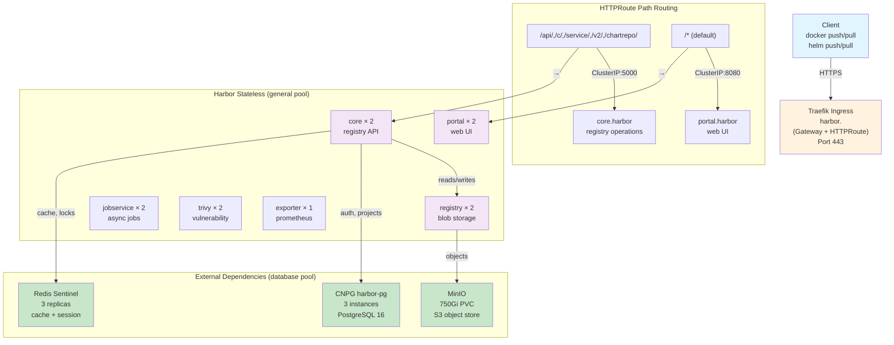
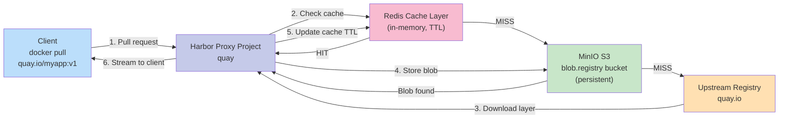

# Harbor HA - Container Registry + Proxy Cache

## Overview

Harbor is a cloud-native open source registry that stores, signs, and scans container images and Helm charts. This deployment provides **Harbor v2.14.x** as a highly-available, production-grade registry with integrated proxy caching for upstream container registries and OCI-based Helm chart storage.

**Key purposes**:
- **Proxy cache**: Cache images from Docker Hub, Quay, GitHub Container Registry, Google Container Registry, and Kubernetes registries
- **CICD image repository**: Store built application images and distribute them across the cluster
- **OCI Helm chart storage**: Native OCI support for Helm charts (no traditional `index.yaml` or `helm repo add` needed)
- **Single source of truth**: Centralized image management with role-based access control and audit trails

**High availability from day one**:
- Core, portal, registry, and jobservice components run in 2+ replicas across general worker pool
- Horizontal Pod Autoscaling (HPA) for CPU-based scaling
- External PostgreSQL (CNPG) on database pool (3-instance Raft cluster)
- External Redis with Sentinel for distributed caching and session management
- MinIO object storage on database pool for blob and artifact storage

**Harbor version**: v2.14.x (via `goharbor/harbor-helm` chart v1.18.x)
**Domain**: `harbor.<DOMAIN>`
**FQDN in cluster**: `core.harbor` (ClusterIP) + `portal.harbor` (ClusterIP, public ingress)

> **Note**: Throughout this document, `<DOMAIN>` refers to the root domain
> configured in `scripts/.env` (e.g., `example.com`). Derived formats:
> `<DOMAIN_DASHED>` = dots replaced with hyphens (e.g., `example-com`),
> `<DOMAIN_DOT>` = dots replaced with `-dot-` (e.g., `example-dot-com`).
> All service FQDNs follow the pattern `<service>.<DOMAIN>`.

---

## Architecture

### High-Level Architecture



### Deployment Order Flow

```
┌─────────────────────────────────────────────────────────────────┐
│ 1. Increase Traefik timeout to 1800s (readTimeout/writeTimeout) │
│    Reason: Docker pushes >400MB, large layer uploads need time  │
└──────────────────────────┬──────────────────────────────────────┘
                           ↓
┌─────────────────────────────────────────────────────────────────┐
│ 2. Create harbor, minio, database namespaces                    │
└──────────────────────────┬──────────────────────────────────────┘
                           ↓
        ┌──────────────────┴──────────────────┐
        ↓                                     ↓
  ┌──────────────────┐  ┌──────────────────────────────┐
  │ 3a. Deploy MinIO │  │ 3b. Deploy CNPG (harbor-pg)  │
  │    750Gi PVC     │  │     3-instance cluster       │
  │    Deployment    │  │     Database: registry       │
  │    S3 service    │  │                              │
  │    mc bucket job │  └──────────────────────────────┘
  └──────────────────┘
        ↓                          ↓
  [parallel execution]    [parallel execution]
        ↓                          ↓
        └──────────────────┬───────┘
                           ↓
  ┌──────────────────────────────────────────────────────────────┐
  │ 3c. Deploy Redis with Sentinel (Bitnami chart)              │
  │     3 replicas, masterSet: mymaster                         │
  └──────────────────┬───────────────────────────────────────────┘
                     ↓
  ┌──────────────────────────────────────────────────────────────┐
  │ 4. Wait for MinIO, CNPG, Redis to be healthy                │
  │    Check: MinIO S3 access, CNPG harbor-pg ready, Redis sync │
  └──────────────────┬───────────────────────────────────────────┘
                     ↓
  ┌──────────────────────────────────────────────────────────────┐
  │ 5. Deploy Harbor Helm Chart                                 │
  │    - externalURL: https://harbor.<DOMAIN>              │
  │    - database.type: external, connectionString to CNPG      │
  │    - redis.external: true, sentinel endpoints               │
  │    - storage.s3: MinIO endpoint, bucket registry            │
  │    - chart.storage: S3 backend (OCI Helm artifacts)         │
  │    - All stateless components: 2+ replicas, HPA             │
  └──────────────────┬───────────────────────────────────────────┘
                     ↓
  ┌──────────────────────────────────────────────────────────────┐
  │ 6. Apply certificate (cert-manager/vault-issuer)            │
  │    TLS secret: harbor.<DOMAIN>                         │
  └──────────────────┬───────────────────────────────────────────┘
                     ↓
  ┌──────────────────────────────────────────────────────────────┐
  │ 7. Apply Traefik IngressRoute                               │
  │    - Splits /api/, /c/, /service/, /v2/, /chartrepo/        │
  │    - Default /* routes to portal                            │
  └──────────────────────────────────────────────────────────────┘
```

### Proxy Cache Data Flow



---

## Components

| Component | Type | Count | Pool | Purpose |
|-----------|------|-------|------|---------|
| **core** | Deployment | 2 | general | Main registry API, auth, project management |
| **portal** | Deployment | 2 | general | Web UI, dashboard, user management |
| **registry** | Deployment | 2 | general | Blob storage (proxies to MinIO S3) |
| **jobservice** | Deployment | 2 | general | Async jobs: replication, scanning, gc |
| **trivy** | StatefulSet | 2 | general | Vulnerability scanner (requires StatefulSet for cache) |
| **exporter** | Deployment | 1 | general | Prometheus metrics exporter |
| **harbor-pg** | CNPG Cluster | 3 | database | PostgreSQL 16 (Raft HA) |
| **mymaster Redis** | Bitnami Helm | 3 | harbor ns | Redis Sentinel for cache + sessions |
| **MinIO** | Deployment | 1 | minio ns | S3-compatible object store (750Gi PVC) |

### Replication & Auto-scaling

- **HPA for core**: 2-5 replicas, 70% CPU target
- **HPA for registry**: 2-5 replicas, 70% CPU target
- **HPA for trivy**: 1-4 replicas, 70% CPU target (targets `kind: StatefulSet`)
- **Exporter**: Always 1 replica (metrics aggregator)

---

## Prerequisites

1. **Traefik 3.x ingress controller** with timeout configuration
   - Default `readTimeout: 600s` is insufficient for large Docker pushes
   - Must increase to `readTimeout: 1800s` and `writeTimeout: 1800s` on web and websecure entrypoints
   - File: `traefik-timeout-helmchartconfig.yaml`

2. **Namespaces**: `harbor`, `minio`, `database` already exist

3. **cert-manager** with vault-issuer (for TLS certificate)

4. **CNPG operator** deployed in database pool (for PostgreSQL cluster)

5. **Bitnami Helm repository** added (for Redis)
   ```bash
   helm repo add bitnami https://charts.bitnami.com/bitnami
   helm repo update
   ```

6. **goharbor Helm repository** (traditional, not OCI pull from Docker Hub which requires auth)
   ```bash
   helm repo add goharbor https://helm.goharbor.io
   helm repo update
   ```

7. **Worker pool capacity**: Minimum 3 nodes in general pool (2 for Harbor, 1 for backup/autoscaling)

---

## Deployment

### Step 1: Increase Traefik Timeout

Before deploying Harbor, increase Traefik's read/write timeouts to 1800s (30 minutes) to support large Docker image pushes (>400MB).

**File**: `traefik-timeout-helmchartconfig.yaml`

Apply via Kustomize (included in `kustomization.yaml`):
```bash
kubectl apply -k services/harbor/
```

Verify:
```bash
kubectl -n kube-system get helmchartconfig traefik-config
kubectl -n kube-system get helmchart traefik -o jsonpath='{.spec.valuesContent}' | grep -A5 readTimeout
```

### Step 2: Create Namespaces

Namespaces (`harbor`, `minio`, `database`) are created by Kustomize overlay or explicit manifest:

```bash
kubectl apply -f services/harbor/namespace.yaml
kubectl apply -f services/harbor/minio/namespace.yaml
```

### Step 3: Deploy MinIO (S3-Compatible Object Store)

MinIO provides S3 backend storage for Harbor blobs and chart artifacts.

**Key configuration**:
- **Image**: Official `quay.io/minio/minio:latest` (not Bitnami, which requires license as of Aug 2025)
- **Storage**: 750Gi PVC named `minio-data`
- **Access Keys**: Stored in `minio-secret` (root user, hardcoded for simplicity; rotate in production)
- **Bucket**: `registry` (created by `job-create-buckets.yaml`)
- **S3 endpoint**: `minio.minio:9000` (in-cluster) or `https://minio.<DOMAIN>:9001` (external)

**Files in `minio/`**:
- `namespace.yaml` — `minio` namespace
- `secret.yaml` — MinIO root credentials
- `pvc.yaml` — 750Gi PersistentVolumeClaim
- `deployment.yaml` — Single MinIO pod (standalone, not HA Distributed)
- `service.yaml` — ClusterIP services (S3 api port 9000, console port 9001)
- `job-create-buckets.yaml` — Post-install job to create `registry` bucket

**Deploy MinIO**:
```bash
kubectl apply -k services/harbor/minio/
```

**Verify MinIO is ready**:
```bash
kubectl -n minio get pods
kubectl -n minio get pvc
kubectl -n minio logs -f deployment/minio | grep "API:"
```

### Step 4: Deploy CNPG PostgreSQL Cluster (harbor-pg)

CNPG provides a 3-instance PostgreSQL 16 cluster with Raft-based HA and automatic failover.

**Files in `postgres/`**:
- `secret.yaml` — `harbor-pg-password` secret (postgres user password)
- `harbor-pg-cluster.yaml` — CNPG Cluster resource (3 instances, rocky9-base image, streaming replication)
- `harbor-pg-scheduled-backup.yaml` — Optional S3 backups

**Deploy CNPG**:
```bash
kubectl apply -k services/harbor/postgres/
```

**Verify CNPG cluster**:
```bash
kubectl -n database get clusters
kubectl -n database get pods -l cnpg.io/cluster=harbor-pg
kubectl -n database logs -f deployment/cnpg-operator | grep -i "harbor-pg"
```

**Wait for cluster to be "healthy"**:
```bash
kubectl -n database wait --for=condition=ready pod -l cnpg.io/cluster=harbor-pg,role=primary --timeout=300s
```

**Create Harbor database** (if not auto-created by Harbor Helm chart):
```bash
kubectl -n database exec -it harbor-pg-1 -- psql -U postgres -c "CREATE DATABASE registry OWNER postgres;"
```

### Step 5: Deploy Redis with Sentinel

Redis provides caching and distributed session management for Harbor. Sentinel provides automatic failover.

**Files in `redis/`**:
- `secret.yaml` — Redis passwords (namespace: `harbor`)
- `redis-values.yaml` — Bitnami Helm chart values (3 replicas, Sentinel enabled, auth.sentinel: false)

**Deploy Redis**:
```bash
helm repo add bitnami https://charts.bitnami.com/bitnami
helm repo update

kubectl apply -f services/harbor/redis/secret.yaml

helm install mymaster bitnami/redis \
  -n harbor \
  --values services/harbor/redis/redis-values.yaml \
  --wait --timeout 5m
```

**Verify Redis**:
```bash
kubectl -n harbor get pods -l app.kubernetes.io/name=redis
kubectl -n harbor get statefulset mymaster-redis
kubectl -n harbor logs -f statefulset/mymaster-redis-sentinel-0 | grep -i "sentinel"
```

**Test Redis connectivity**:
```bash
kubectl -n harbor exec -it mymaster-redis-0 -- redis-cli info replication
kubectl -n harbor exec -it mymaster-redis-sentinel-0 -- redis-cli -p 26379 info sentinel
```

### Step 6: Deploy Harbor via Helm

Harbor core components are deployed using the official goharbor/harbor-helm Helm chart with external database, Redis, and MinIO.

**Files**:
- `harbor-values.yaml` — Complete Helm chart configuration (replicas, resources, external services, ingress disabled)
- `argocd-application.yaml` — ArgoCD Application for GitOps sync (optional)

**Deploy Harbor**:
```bash
helm repo add goharbor https://helm.goharbor.io
helm repo update

kubectl apply -f services/harbor/secret.yaml

helm install harbor goharbor/harbor \
  -n harbor \
  --values services/harbor/harbor-values.yaml \
  --wait --timeout 10m
```

Alternatively, using ArgoCD:
```bash
kubectl apply -f services/harbor/argocd-application.yaml
```

**Verify Harbor pods**:
```bash
kubectl -n harbor get pods
kubectl -n harbor logs -f deployment/harbor-core | grep -i "listening"
kubectl -n harbor logs -f deployment/harbor-portal | grep -i "server started"
```

### Step 7: Apply Gateway & HTTPRoute

Gateway API routes ingress traffic to Harbor's core and portal services based on URL path. cert-manager gateway-shim automatically creates the TLS certificate from the Gateway annotation.

**Files**: `gateway.yaml` and `httproute.yaml`

```bash
kubectl apply -f services/harbor/gateway.yaml
kubectl apply -f services/harbor/httproute.yaml
```

**HTTPRoute path-based routing**:
- `/api/`, `/c/`, `/service/`, `/v2/`, `/chartrepo/` → `core.harbor:5000`
- `/*` (default) → `portal.harbor:8080`

**Verify Gateway and HTTPRoute**:
```bash
kubectl -n harbor get gateway
kubectl -n harbor get httproute
kubectl -n harbor get secrets | grep tls  # Auto-created by gateway-shim
```

### Step 8: Apply Horizontal Pod Autoscalers

HPA scales Harbor stateless components based on CPU utilization (70% target).

**Files**:
- `hpa-core.yaml` — core: 2-5 replicas
- `hpa-registry.yaml` — registry: 2-5 replicas (note: uses registry.registry.resources nesting, not registry.resources)
- `hpa-trivy.yaml` — trivy (StatefulSet): 1-4 replicas (must target kind: StatefulSet)

```bash
kubectl apply -f services/harbor/hpa-core.yaml
kubectl apply -f services/harbor/hpa-registry.yaml
kubectl apply -f services/harbor/hpa-trivy.yaml
```

**Verify HPA**:
```bash
kubectl -n harbor get hpa
kubectl -n harbor describe hpa harbor-core
```

---

## Configuration

### External Database Connection (harbor-values.yaml)

Harbor connects to the CNPG `harbor-pg` cluster in the `database` namespace:

```yaml
database:
  type: external
  external:
    host: harbor-pg-rw.database.svc
    port: 5432
    username: postgres
    password: <from secret>
    coreDatabase: registry
```

### External Redis with Sentinel

Harbor cache and session store backed by Redis Sentinel:

```yaml
redis:
  type: external
  external:
    addr: mymaster-redis-sentinel.harbor.svc:26379
    sentinelMasterSet: mymaster
    password: <from secret>
    cacheIndex: "1"
    databaseIndex: "2"
```

**Critical**: `auth.sentinel: false` in Redis chart values — Bitnami Redis Sentinel auth is disabled because Harbor chart v1.18 does not pass sentinelPassword to go-redis client (would cause auth failure).

### S3 Object Storage (MinIO)

Harbor stores blobs and artifacts in MinIO S3:

```yaml
storage:
  type: s3
  s3:
    endpoint: http://minio.minio:9000
    accesskey: minioadmin
    secretkey: <from secret>
    bucket: registry
    disableredirect: true
    v4auth: true
    secure: false
    skipverify: true
```

**Notes**:
- `disableredirect: true` — Required for Traefik L7 routing (prevents S3 redirects to MinIO service)
- `secure: false` — HTTP to MinIO (TLS not needed in-cluster)
- `skipverify: true` — Skip S3 certificate validation

### OCI Helm Chart Storage

Harbor stores Helm charts as OCI artifacts in S3:

```yaml
chartMuseum:
  enabled: false
```

Instead, use Harbor's native OCI support via the `/chartrepo/` API endpoint, which stores charts as OCI images in the same S3 bucket as container images.

---

## Proxy Cache Setup

Proxy cache projects allow Harbor to transparently cache images from upstream registries.

### Create Proxy Project via API

```bash
# Port-forward to Harbor core
kubectl -n harbor port-forward svc/core 5000:5000 &
PORT_FWD_PID=$!

# Get admin token
HARBOR_PASS=$(kubectl -n harbor get secret harbor-core-adminpass -o jsonpath='{.data.password}' | base64 -d)

# Create Docker Hub proxy project
curl -X POST \
  http://localhost:5000/api/v2.0/projects \
  -H "Content-Type: application/json" \
  -u admin:${HARBOR_PASS} \
  -d '{
    "project_name": "dockerhub",
    "public": true,
    "registry_id": 1,
    "storage_limit": -1
  }'

# Create registry pull (proxy) configuration
curl -X POST \
  http://localhost:5000/api/v2.0/registries \
  -H "Content-Type: application/json" \
  -u admin:${HARBOR_PASS} \
  -d '{
    "name": "docker-registry",
    "description": "Docker Hub Registry",
    "type": "docker-registry",
    "url": "https://registry-1.docker.io",
    "credential": {
      "access_key": "your-docker-username",
      "access_secret": "your-docker-password-or-token"
    },
    "insecure": false
  }'

kill $PORT_FWD_PID
```

### Configure Replication Rules

Create replication rules to sync images from proxy projects:

1. Open Harbor UI: `https://harbor.<DOMAIN>`
2. Navigate to **Administration > Registries**
3. Click **New Endpoint** to add upstream registries (Docker Hub, Quay, GHCR, GCR)
4. Navigate to **Projects > [project-name] > Replication**
5. Create replication rule:
   - **Source registry**: Docker Hub (push mode for cache warmup)
   - **Destination namespace**: Current project
   - **Trigger**: Manual or scheduled

### Standard Proxy Projects

Create these proxy projects for common use cases:

| Project | Upstream | Purpose |
|---------|----------|---------|
| `dockerhub` | `registry-1.docker.io` | Docker Hub public images |
| `quay` | `quay.io` | Quay.io public images |
| `ghcr` | `ghcr.io` | GitHub Container Registry |
| `gcr` | `gcr.io` | Google Container Registry |
| `k8s` | `registry.k8s.io` | Kubernetes images |
| `elastic` | `docker.elastic.co` | Elastic Stack images |

---

## CICD Project Setup

Create dedicated projects for CI/CD pipelines to push built images:

| Project | Purpose | Audience |
|---------|---------|----------|
| `library` | Production images | Pull from prod cluster |
| `dev` | Staging/test images | Pull from staging cluster |
| `charts` | OCI Helm charts | ArgoCD, GitOps sync |

### Example: Push Built Image from Pipeline

```bash
# Log in to Harbor
docker login harbor.<DOMAIN> \
  -u myuser \
  -p $(kubectl -n harbor get secret harbor-cli-secret -o jsonpath='{.data.password}' | base64 -d)

# Build and tag image
docker build -t harbor.<DOMAIN>/library/myapp:v1.0.0 .

# Push to Harbor
docker push harbor.<DOMAIN>/library/myapp:v1.0.0
```

**Note**: CLI users need a CLI Secret (not their password) from the Harbor UI to authenticate with Docker CLI.

---

## OCI Helm Usage

Harbor v2.9+ removed the traditional `helm repo add` mechanism. Instead, use OCI-based Helm chart distribution.

### Push Helm Chart to Harbor

```bash
# Log in to Harbor OCI registry
helm registry login harbor.<DOMAIN> \
  -u myuser \
  -p $(kubectl -n harbor get secret harbor-cli-secret -o jsonpath='{.data.password}' | base64 -d)

# Package Helm chart
helm package ./my-chart

# Push to Harbor OCI registry
helm push my-chart-1.0.0.tgz oci://harbor.<DOMAIN>/charts
```

### Pull and Install Helm Chart from Harbor

```bash
# Log in to Harbor OCI registry
helm registry login harbor.<DOMAIN> \
  -u myuser \
  -p $(kubectl -n harbor get secret harbor-cli-secret -o jsonpath='{.data.password}' | base64 -d)

# Pull chart
helm pull oci://harbor.<DOMAIN>/charts/my-chart --version 1.0.0

# Or install directly
helm install my-release oci://harbor.<DOMAIN>/charts/my-chart --version 1.0.0 -n myns
```

### ArgoCD with OCI Helm Charts

ArgoCD 3.1+ supports OCI Helm charts natively:

```yaml
apiVersion: argoproj.io/v1alpha1
kind: Application
metadata:
  name: my-app
spec:
  source:
    repoURL: oci://harbor.<DOMAIN>/charts
    chart: my-chart
    targetRevision: "1.0.0"
  destination:
    server: https://kubernetes.default.svc
    namespace: default
```

---

## Verification

### Health Checks

**1. Pod status**:
```bash
kubectl -n harbor get pods
kubectl -n harbor get deployment -o wide
kubectl -n harbor get statefulset -o wide
```

**2. Service endpoints**:
```bash
kubectl -n harbor get svc
kubectl -n harbor get endpoints
```

**3. Harbor core API (via proxy)**:
```bash
kubectl -n harbor port-forward svc/core 5000:5000 &
curl -I http://localhost:5000/api/v2.0/systeminfo
kill %1
```

**4. Harbor UI (via Traefik)**:
```bash
curl -k https://harbor.<DOMAIN>/
# Or open in browser: https://harbor.<DOMAIN>
```

**5. Log in and verify**:
```bash
# Get admin password
kubectl -n harbor get secret harbor-core-adminpass -o jsonpath='{.data.password}' | base64 -d

# CLI login
docker login harbor.<DOMAIN> -u admin -p <password>

# Push test image
docker tag alpine:latest harbor.<DOMAIN>/library/test:v1
docker push harbor.<DOMAIN>/library/test:v1

# Pull to verify
docker pull harbor.<DOMAIN>/library/test:v1
```

### Metrics

Prometheus scrapes Harbor exporter metrics from port 8808:

```bash
# Verify exporter is running
kubectl -n harbor get deployment harbor-exporter
kubectl -n harbor logs deployment/harbor-exporter

# Check metrics endpoint
kubectl -n harbor port-forward svc/harbor-exporter 8808:8808 &
curl http://localhost:8808/metrics | head -20
kill %1
```

---

## Troubleshooting

### Docker Push Fails: "net/http: request canceled" or "connection reset"

**Symptom**: Pushing images >400MB fails halfway through with timeout or connection reset.

**Cause**: Traefik default `readTimeout: 600s` (10 minutes) is insufficient for large layer uploads.

**Solution**:
1. Increase Traefik timeouts to 1800s (30 minutes):
   ```bash
   kubectl apply -f services/harbor/traefik-timeout-helmchartconfig.yaml
   ```
2. Verify new timeout is active:
   ```bash
   kubectl -n kube-system describe helmchartconfig traefik-config | grep -A10 readTimeout
   ```
3. Retry push:
   ```bash
   docker push harbor.<DOMAIN>/library/largimage:v1
   ```

### Redis Connection Refused or Auth Failure

**Symptom**: Harbor core logs show "connection refused" or "WRONGPASS" errors for Redis.

**Cause**: Redis Sentinel auth is enabled, but Harbor chart v1.18 doesn't pass sentinelPassword to go-redis client.

**Solution**:
1. Verify Redis Sentinel auth is **disabled** in `redis-values.yaml`:
   ```yaml
   auth:
     sentinel: false
   ```
2. Redeploy Redis if needed:
   ```bash
   helm upgrade mymaster bitnami/redis \
     -n harbor \
     --values services/harbor/redis/redis-values.yaml \
     --reuse-values
   ```
3. Restart Harbor core pods:
   ```bash
   kubectl -n harbor rollout restart deployment/harbor-core
   ```

### Trivy HPA Not Scaling (Stuck at 2 replicas)

**Symptom**: Trivy StatefulSet is not scaling up despite high CPU usage; HPA reports "unknown" metrics.

**Cause**: HPA incorrectly targets `kind: Deployment` instead of `kind: StatefulSet`. Trivy is a StatefulSet in Harbor chart v1.18.x.

**Solution**:
1. Check HPA target:
   ```bash
   kubectl -n harbor get hpa harbor-trivy -o yaml | grep -A5 "scaleTargetRef"
   ```
2. Verify HPA targets `kind: StatefulSet`:
   ```yaml
   scaleTargetRef:
     apiVersion: apps/v1
     kind: StatefulSet
     name: harbor-trivy
   ```
3. If incorrect, update `hpa-trivy.yaml` and reapply:
   ```bash
   kubectl apply -f services/harbor/hpa-trivy.yaml
   ```

### MinIO Images Fail to Pull (Bitnami Paywall)

**Symptom**: MinIO Deployment fails with `ImagePullBackOff`; error mentions "403 Forbidden" or "authentication required".

**Cause**: Bitnami images moved to a registry that requires authentication (August 2025+).

**Solution**:
1. Use official MinIO images instead:
   ```yaml
   image:
     repository: quay.io/minio/minio
     tag: latest
   ```
2. Redeploy MinIO:
   ```bash
   kubectl apply -k services/harbor/minio/
   ```

### Cluster Autoscaler Labels Not Applied

**Symptom**: Rancher cluster autoscaler creates nodes in Harbor worker pool but they lack `workload-type: general` labels.

**Cause**: Cluster autoscaler doesn't inherit labels from machine pool config.

**Solution**:
1. Manually label nodes after creation:
   ```bash
   kubectl label nodes <node-name> workload-type=general --overwrite
   ```
2. Or patch Rancher machine pool config to add a cloud-init script that labels itself:
   ```bash
   sudo kubectl label node $(hostname) workload-type=general
   ```

### Do NOT Use Buffering or Retry Middleware

**Cause**: Harbor registry protocol expects streaming uploads/downloads. Buffering middleware causes memory exhaustion on large layers; retry middleware retries non-idempotent requests (registry uploads).

**Solution**: Remove any buffering or retry middleware from Harbor IngressRoute:
```yaml
# WRONG:
middlewares:
  - name: buffer
  - name: retry

# CORRECT: (no middleware)
middlewares: []
```

### Harbor Dashboard Shows "Unhealthy" Components

**Symptom**: Harbor UI reports "Unhealthy: Unable to connect to external services (PostgreSQL, Redis, MinIO)".

**Diagnosis**:
1. Check database connection:
   ```bash
   kubectl -n harbor logs deployment/harbor-core | grep -i "database"
   ```
2. Check Redis connection:
   ```bash
   kubectl -n harbor logs deployment/harbor-core | grep -i "redis"
   ```
3. Check MinIO S3 connection:
   ```bash
   kubectl -n harbor logs deployment/harbor-core | grep -i "s3\|minio"
   ```

**Solution**:
1. Verify services are accessible:
   ```bash
   kubectl run debug-pod --image=curl:latest --rm -it -- /bin/sh
   # Inside pod:
   curl http://minio.minio:9000/minio/health/live
   nc -zv harbor-pg-rw.database.svc 5432
   redis-cli -h mymaster-redis-sentinel.harbor.svc -p 26379 ping
   ```
2. Check credentials in secrets:
   ```bash
   kubectl -n harbor get secret harbor-core-password -o jsonpath='{.data}' | jq .
   ```
3. Restart Harbor core:
   ```bash
   kubectl -n harbor rollout restart deployment/harbor-core
   ```

---

## File Structure

```
services/harbor/
├── README.md                                # This file
├── namespace.yaml                           # harbor, minio, database namespaces
├── kustomization.yaml                       # Kustomize overlay, patches Traefik HelmChartConfig
├── harbor-values.yaml                       # Harbor Helm chart values (v1.18.x)
├── traefik-timeout-helmchartconfig.yaml     # Patch for Traefik readTimeout/writeTimeout
├── gateway.yaml                             # Gateway with cert-manager annotation (auto-creates TLS secret)
├── httproute.yaml                           # HTTPRoute (path-based routing)
├── argocd-application.yaml                  # ArgoCD Application (optional GitOps sync)
├── hpa-core.yaml                            # HPA for harbor-core (2-5 replicas, CPU 70%)
├── hpa-registry.yaml                        # HPA for harbor-registry (2-5 replicas, CPU 70%)
├── hpa-trivy.yaml                           # HPA for harbor-trivy (1-4 replicas, CPU 70%, kind: StatefulSet)
├── minio/
│   ├── namespace.yaml                       # minio namespace
│   ├── secret.yaml                          # MinIO root credentials
│   ├── pvc.yaml                             # 750Gi PersistentVolumeClaim
│   ├── deployment.yaml                      # MinIO standalone Deployment
│   ├── service.yaml                         # ClusterIP services (S3 port 9000, console 9001)
│   ├── job-create-buckets.yaml              # Post-install job to create registry bucket
│   ├── kustomization.yaml                   # Kustomize manifest for minio/
│   └── minio-values.yaml                    # (unused) Bitnami Helm chart values
├── postgres/
│   ├── secret.yaml                          # CNPG harbor-pg-password secret
│   ├── harbor-pg-cluster.yaml               # CNPG Cluster resource (3 instances, Raft HA)
│   ├── harbor-pg-scheduled-backup.yaml      # Optional S3 backups to MinIO
│   └── kustomization.yaml                   # Kustomize manifest for postgres/
└── redis/
    ├── secret.yaml                          # Redis password (namespace: harbor)
    ├── redis-values.yaml                    # Bitnami Helm chart values (3 replicas, Sentinel, auth.sentinel: false)
    └── kustomization.yaml                   # Kustomize manifest for redis/
```

---

## Dependencies

| Service | Version | Purpose | Deployment Order |
|---------|---------|---------|------------------|
| **Traefik** | 3.6.7 (RKE2 bundled) | Ingress + TLS termination | Pre-existing |
| **cert-manager** | 1.x+ | TLS certificate issuance | Pre-existing |
| **Vault** | 1.x+ | PKI backend for cert-manager | Pre-existing |
| **CNPG** | 1.x+ (operator) | PostgreSQL HA cluster | Deploy before Harbor |
| **Bitnami Helm repo** | Latest | Redis Helm chart | Deploy before Harbor |
| **goharbor Helm repo** | Latest | Harbor Helm chart | Final deployment |
| **Rancher cluster autoscaler** | N/A | Auto-scales worker pools | Pre-existing (Rancher cluster) |

---

## Related Documentation

- **Cluster architecture**: `docs/` (Mermaid diagrams)
- **Traefik configuration**: `cluster/` (Terraform)
- **CNPG PostgreSQL**: Kubernetes documentation on CNPG (external resource)
- **MinIO S3 API**: https://min.io/docs/minio/linux/developers/minio-drivers.html
- **Harbor documentation**: https://goharbor.io/docs/
- **Helm OCI support**: https://helm.sh/docs/topics/registries/

---

## Next Steps

1. **Post-deployment configuration**:
   - Create admin user via Harbor UI
   - Configure proxy cache projects (Docker Hub, Quay, GHCR, GCR)
   - Set up replication rules for cache warmup
   - Configure OIDC integration with Keycloak (later)

2. **CI/CD pipeline integration**:
   - Create `library`, `dev`, and `charts` projects
   - Provide Harbor credentials to CI/CD runners
   - Document image naming conventions for teams

3. **Monitoring and alerting**:
   - Configure Prometheus scrape for Harbor exporter
   - Create Grafana dashboard for Harbor metrics
   - Set up alerts for pod failures, storage saturation

4. **Backup and disaster recovery**:
   - Enable scheduled CNPG backups to S3
   - Document backup restore procedures
   - Test disaster recovery workflow

---

**Last updated**: 2026-02-11
**Harbor version**: v2.14.x
**Helm chart**: goharbor/harbor-helm v1.18.x
